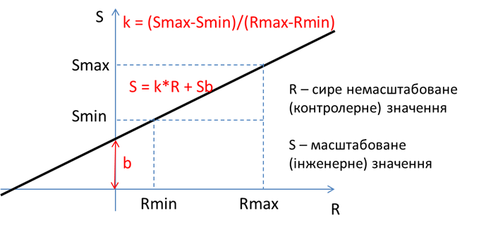

[<- До підрозділу](README.md)	[PLC MachineStruxure](../ecostruxuremachineexpert.md) 	[CODESYS (загальна)](../codesys.md)	[Коментувати](#feedback)

# Програмні сутності в Machine Expert і CODESYS: практична частина

**Мета:** навчитися створювати власні функції та функціональні блоки.

**Необхідне програмне забезпечення.** EcoStruxure Machine Expert або CODESYS

## Порядок виконання роботи

## 1. Програми

- [ ] Ознайомтеся з рекомендаціями щодо розробки та налагодження програм, наведених в [Програмування та налагодження в ПЛК M221: практична частина](../debug/labm221.md)     

### 1.1. Постановка завдання для написання власної POU 

- [ ] Ознайомтеся з умовою задачі, наведеної нижче.

Рисунок 1 показує ескіз процесу безперервного наповнення. Цей процес вимагає, щоб коробки, які рухаються по конвеєру, автоматично позиціонувалися та заповнювалися. Послідовність роботи процесу безперервного наповнення така:

- Запустити конвеєр, коли кнопка запуску `Start` короткочасно натиснута.
- Зупинити конвеєр, коли кнопка зупинки `Stop` короткочасно натиснута.
- Увімкнути індикатор стану роботи `Run`, коли процес виконується.
- Увімкнути індикатор режиму очікування `Standby`, коли процес зупинений.
- Зупинити конвеєр, коли правий край коробки вперше зафіксовано фотодатчиком (`Photo switch`).
- Коли коробка в позиції і конвеєр зупинений, відкрити електромагнітний клапан (`Solenoid`) і дозволити наповнення коробки. Наповнення має припинитися, коли датчик рівня (`Level switch`) стане істинним.
- Увімкнути індикатор повної коробки (`Full`), коли коробка заповнена. Індикатор має залишатися увімкненим, доки коробка не буде переміщена за межі фотодатчика.


рис.1. До постановки задачі (Джерело: Petruzella F. D. Programmable Logic Controllers: 2025 Release ISE. McGraw Hill, 2025.)

Рисунок 2 показує програму релейно-контактної логіки, необхідну для виконання цієї операції.


рис.2. PLC-програма безперервної операції наповнення (Джерело: Petruzella F. D. Programmable Logic Controllers: 2025 Release ISE. McGraw Hill, 2025.)

### 1.2. Визначення необхідних входів виходів

- [ ] Визначте перелік змінних необхідних для реалізації задачі та вимоги до них. Сформуйте перший варіант таблиці 1, без заповнення поля `Змінна`. Рекомендації щодо наповнення наведені в [Програмування та налагодження в ПЛК M221: практична частина](../debug/labm221.md)     

Таблиця 1.Перелік змінних та вимоги до них.  

| Змінна   | Позначення параметру | Діапазон  зміни | Діапазон сигналу на/з ПЛК | Вхід/вихід ПЛК | Примітка                         |
| -------- | -------------------- | --------------- | ------------------------- | -------------- | -------------------------------- |
| `bStart` | Кнопка `Start1`      | вкл/відкл       | Вкл.=24В, Відкл=0         | I0             | вмикається людиною, без фіксації |
|          | ...                  |                 |                           |                |                                  |

- [ ] Прочитайте рекомендації щодо найменування змінних в угорській нотації, як це описано в [Підходи до найменування сутностей в програмах PLC](../data/teornaming.md) 
- [ ] Сформуйте назви змінних та заповніть поле `Змінна` в таблиці 1. 

### 1.3. Розробка методики перевірки    

Методика перевірки передбачає опис процедур, які необхідно зробити, щоб перевірити чи відповідає виконання програми заданим в завданні умовам. Перший варіант методики перевірки розробляють ще до написання програми користувача. Методика дає можливість розробнику не тільки перевірити правильність виконання програми користувача, але і зрозуміти усі тонкощі алгоритму.

Дана задача не передбачає орієнтацію на внутрішній стан системи, так як значення виходів повністю залежить виключно від входів. Про це свідчить як сама постановка задачі так і релейно-контактна схема, показана на рис.2. Тому можна зробити таблицю в якій стан виходів показаний як залежність від комбінації станів входів. Враховуючи що вхідних дискретних сигналів 4, необхідно врахувати $2^4$ , тобто 16 комбінацій. 

- [ ] Заповніть таблицю 2 для формування методики перевірки задачі. Замість назв входів та виходів описаних в задачі, вставте назви змінних з таблиці 1.

Таблиця 2. Табличний вигляд методики перевірки роботи задачі  

| №    | Stop | Start | Photo | Level | Стан системи         | Motor | Solenoid | Run  | Standby | Full | Примітка |
| ---- | ---- | ----- | ----- | ----- | -------------------- | ----- | -------- | ---- | ------- | ---- | -------- |
| 1    | 0    | 0     | 0     | 0     | Всі входи відключені | 0     | 0        | 0    | 0       | 0    |          |
| 2    |      |       |       |       |                      |       |          |      |         |      |          |
| 3    |      |       |       |       |                      |       |          |      |         |      |          |
| 4    |      |       |       |       |                      |       |          |      |         |      |          |
| 5    |      |       |       |       |                      |       |          |      |         |      |          |
| 6    |      |       |       |       |                      |       |          |      |         |      |          |
| 7    |      |       |       |       |                      |       |          |      |         |      |          |
| 8    |      |       |       |       |                      |       |          |      |         |      |          |
| 9    |      |       |       |       |                      |       |          |      |         |      |          |
| 10   |      |       |       |       |                      |       |          |      |         |      |          |
| 11   |      |       |       |       |                      |       |          |      |         |      |          |
| 12   |      |       |       |       |                      |       |          |      |         |      |          |
| 13   |      |       |       |       |                      |       |          |      |         |      |          |
| 14   |      |       |       |       |                      |       |          |      |         |      |          |
| 15   |      |       |       |       |                      |       |          |      |         |      |          |
| 16   |      |       |       |       |                      |       |          |      |         |      |          |

### 1.4. Створення проєкту та реалізація задачі  

- [ ] Запустіть Machine Expert. Створіть новий проект на базі M241 з назвою `POU_labs`
- [ ] У конфігурації PLC змініть найменування входів та виходів PLC, відповідно до таблиці 1. 

- [ ] Створіть POU типу Program з назвою `Hopper` на мові LD. Добавте її до обробки в задачі MAST
- [ ] Реалізуйте програму, наведену на рис.2. 
- [ ] Зробіть компіляцію та за необхідності виправте усі помилки.

### 1.5. Перевірка роботи програми користувача   

- [ ] Переключіть середовище в режим імітації. Зєднайтеся з емулятором ПЛК, завантажте програму та запустіть її на виконання.

- [ ] Перевірте роботу програми згідно методики перевірки, яка наведена в таблиці 2  

### 1.6. Модифікація програми користувача   

- [ ] Модифікуйте програму, добавивши нові умови:

- 2-секундну затримку перед початком наповнення коробки після зупинки конвеєра.
- 4-секундну затримку перед запуском конвеєра після заповнення коробки.

## 2. Функції

### 2.1. Постановка завдання для написання власної функції

У цій частині лабораторної роботи необхідно реалізувати власну функцію. 

- [ ] Розгляньте постановку завдання для  функції, яка має виконувати масштабування вимірюваного значення з аналогового входу в інженерні одинці. 

Враховуючи що вимірювальне значення отримується з аналогового входу через змінну з каналу `IW` в цілочисельному форматі (наприклад в діапазоні 0-10000), при відображенні оператору воно неінформативне. Для відображенні на засобах людино-машинного інтерфейсу (ЛМІ), наприклад панелях оператора чи комп'ютері, його необхідно перетворити в інженерні одиниці. Таке перетворення прийнято називати масштабуванням. Як правило, засоби ЛМІ вміють робити лінійне масштабування, однак інколи необхідно це робити на самому ПЛК. 

Лінійне масштабування, тобто перетворення вхідних `сирих` одиниць у `інженерні` масштабовані може проводитися за формулою (див. рис.1):

```mathematica
S = k*R + Sb 			(1)
```

де `S `– отримуване масштабоване значення в інженерних одиницях; `R` – вхідне сире немасштабоване значення, `Sb` – зміщення; `k` – коефіцієнт, який дорівнює тангенсу кута нахилу прямої масштабування до осі абсцис.     



рис.1. Лінійне масштабування

Задавання масштабування у вигляді (1) вимагає від розробника додаткових розрахунків. Замість цього зручніше задавати тільки мінімальні та максимальні межі для *сирого* (*raw*) і *масштабованого* (*scaled*) значення. На рис.1 межі сирого значення показані як `Rmax` та `Rmin`, а масштабованого як `Smax` та `Smin`. Так, наприклад, якщо в ПЛК значення від датчика задається в діапазоні від 0-10000 (одиниць ПЛК) а на ЛМІ воно повинно відображатися як 50.0-150.0 (°С), то:

```mathematica
Rmin = 0 (одиниць ПЛК) –> Smin = 50.0 (°С)
Rmax = 10000 (одиниць ПЛК) -> Smax = 150.0 (°С)
```

Формула визначення `S` з використанням змінних діапазонів матиме вигляд:

```mathematica
S = Smin + (R-Rmin)(Smax-Smin)/(Rmax-Rmin) 				(2)
```

### 2. Визначення параметрів власної функції

- [ ] Проаналізуйте які параметри необхідні для наведеної вище функції. Це розглядається нижче. 

Параметрами функції будуть усі необхідні вхідні значення, потрібні для масштабування:

- `RAW` - сире значення вимірювальної величини типу `INT`
- `RMIN`- нижня межа сирого значення вимірювальної величини типу `INT`
- `RMAX`- верхня межа сирого значення вимірювальної величини типу `INT`
- `SMIN` - нижня межа масштабованого значення величини типу `REAL`
- `SMAX` - верхня межа масштабованого значення величини типу `REAL`

Виходом функції буде масштабоване значення типу `REAL`.

У процесі розрахунку необхідно робити проміжні перетворення. Зокрема, треба перетворити цілі числа у дійсні, щоб зробити арифметичні операції, наведені в формулі (2), тому що не дозволяється робити обчислення з різними типами. 

### 3. Реалізація функції

- [ ] Запустіть Machine Expert. Створіть новий проект на базі M241 з назвою `POU_labs`
- [ ] У проєкті `POU_labs` добавте нову функцію з назвою `SCALE` і мовою ST


рис.2.

Функції можна реалізовувати і в застосунку контролера, однак якщо вона буде використовуватися в кількох ПЛК проєкту, варто її розміщувати в Global.

- [ ] Переключіть область означення змінних в текстовий вигляд і внесіть туди наступні параметри:

```pascal
FUNCTION SCALE : REAL
VAR_INPUT
	iRaw : INT; 		//сире значення вимірювальної величини
	iRmin: INT := 0; 	//нижня межа сирого значення вимірювальної величини
	iRmax: INT := 10000; //верхня межа сирого значення вимірювальної величини
	rSmin: REAL := 0.0;	//нижня межа масштабованого значення величини 
	rSmax: REAL := 100.0; //верхня межа масштабованого значення величини
END_VAR
VAR
	rRaw, rRmin, rRmax : REAL; // для перетворення типів
	rK: REAL; //проміжний коефіцієнт
END_VAR
```

- [ ] У область коду впишіть наступний код:

```pascal
rRaw := INT_TO_REAL (iRaw);
rRmin := INT_TO_REAL (iRmin);
rRmax := INT_TO_REAL (iRmax);
rK := (rSmax-rSmin)/(rRmax-rRmin);
SCALE := rSmin + rRaw*rK; 	
```

- [ ] Проналізуйте реалізовану програму, перевірте на наявність помилок в ній (як логічних так і синтаксичних) та внесіть зміни в коді за необхідності.

### 4. Перевірка роботи функції 

- [ ] У апаратній конфігурації проєкту для PLC добавте картридж на два аналогові входи і сконфігуруйте один на 4-20 мА а другий на 0-10В (рис.3).


рис.3. 

- [ ] Створіть нову програмну POU `Check_FN`, добавте її виклик в задачу MAST та добавте дві локальні змінні. 

  ```
  rTemperature: REAL;
  rPressure: REAL;
  ```

- [ ] Використовуючи IOMapping назначте назви для вхідних змінних каналів `IW0` та `IW1` в яких би були зазначені унікальні назви. Напишіть код програми для масштабування, наприклад:

```pascal
rTemperature := scale(iiTMC4AI2_IW0,4000,20000,0,150);
rPressure := scale(iiTMC4AI2_IW1,0,10000,0.0,10.0);
```

- [ ] Переведіть середовище в режим емуляції, з'єднайтеся з емулятором ПЛК, звантажте проєкт в ПЛК і запустіть програму на виконання.
- [ ] Створіть таблицю перевірки для кожного зі значень (rTemperature та rPressure)

| Відсоток діапазону | Сире значення в одиницях ПЛК | Масштабоване значення |
| ------------------ | ---------------------------- | --------------------- |
| 0%                 |                              |                       |
| 100%               |                              |                       |
| 50%                |                              |                       |
| 10%                |                              |                       |

- [ ] Використовуючи створені таблиці перевірте правильність роботи функції, 

- [ ] Зробіть копії екранів з реалізацією функції, програмою де вона використовується та watch таблиці в якій показані вхідні та вихідне значення. 

## Функціональні блоки

### 5. Постановка і декомпозиція завдання для створення користувацького ФБ

- [ ] Розгляньте приклад створення та використання функціональних блоків користувача для керування клапаном, наведений в даному пункті.

Необхідно розробити фрагмент керування програмою користувача для керування клапанами з датчиками кінцевого положення. Необхідно реалізувати:

- окремі режими ручний/автомат:
  - передбачається окрема булева змінна (АВТ/РУЧ) для керування режимом з засобів людино-машинного інтерфейсу
  - передбачається окрема булева змінна для ВКЛ/ВІДКЛ клапану у ручному режимі з засобів людино-машинного інтерфейсу
  - передбачається окрема булева змінна для ВКЛ/ВІДКЛ клапану у автоматичному режимі з програми користувача
- для клапанів використовувати керування одним дискретним виходом: ВКЛ - на відкриття, ВІДКЛ - на закриття 
- передбачити використання 2-х датчиків кінцевого положення: позиція "відкритий" і "закритий"  
- контроль стану клапану (див. рис.4) з метою відображення його на засобах людино-машинного інтерфейсу різними кольорами:  
  - відкривається - проміжний стан, коли йде сигнал на відкриття, але кінцевик ВІДКРИТО ще не спрацював
  - закривається - проміжний стан, коли йде сигнал на закриття, але кінцевик ЗАКРИТО ще не спрацював
  - відкрито - кінцевий стан, коли йде команда на відкриття і спрацьовує кінцевик ВІДКРИТО, при цьому кінцевик ЗАКРИТО відключений   
  - закрито - кінцевий стан, коли йде команда на закриття і спрацьовує кінцевик ЗАКРИТО, при цьому кінцевик ВІДКРИТО відключений
  - при включенні ПЛК переходити у один з проміжних станів, в залежності від команди    


рис.4. Діаграма для автомату станів клапану

- сигналізування тривог з використанням окремих дискретних сигналів: 
  - не відкрився, якщо клапан знаходиться в проміжному стані "ВІКДРИВАЄТЬСЯ" більше, ніж задано часом уставки   
  - не закрився, якщо клапан знаходиться в проміжному стані "ЗАКРИВАЄТЬСЯ" більше, ніж задано часом уставки   
  - загальна помилка датчика або довільний зсув:
    - коли обидва датчика спрацьовують
    - коли в кінцевому стані без зміни команди спрацьовують або відключаються датчики положення  

### 6. Створення інтерфейсу функціонального блоку

- [ ] У `Global` створіть новий POU типу функціонального блоку (рис.5)


рис.5. Створення нового типу функціонального блоку

- [ ] Використовуючи угорську нотацію змінних у області оголошення означте параметри, що відповідають входам виходам

- для клапану означте наступні булеві входи:
  - `CMD` - подача команди в автоматичному режимі
  - `AUTO` - ручний (0), або автоматичний (1) режим 
  - `MCMD` - подача команди в ручному режимі
  - `GSOPN` - датчик кінцевого положення ВІДКРИТО
  - `GSCLS` - датчик кінцевого положення ЗАКРИТО 
- наступний вхід типу INT
  - `tTmSp` -  параметр, який вказує на максимальний час відкриття (в секундах) 
-  наступні булеві виходи
  - `OUT` - вихід на виконавчий механізм
  - `ALMOPN` - вихід сигналу тривоги "НЕ ВІДКРИВСЯ" 
  - `ALMCLS` - вихід сигналу тривоги "НЕ ЗАКРИВСЯ" 
  - `ALMSENS` - вихід сигналу тривоги "Помилка датчика або довільний зсув" 

Це може мати наступний вигляд: 

```pascal
VAR_INPUT
	bCmd: BOOL; //подача команди в автоматичному режимі
	bAuto: BOOL; //ручний (0), або автоматичний (1) режим 
	bMCmd: BOOL: //подача команди в ручному режимі
	bGSOpn: BOOL; //датчик кінцевого положення ВІДКРИТО
	bGSCls: BOOL: //датчик кінцевого положення ЗАКРИТО 
END_VAR
VAR_OUTPUT
END_VAR
VAR
	bOut: BOOL; //вихід на виконавчий механізм
	bAlmOPN: BOOL; //вихід сигналу тривоги "НЕ ВІДКРИВСЯ" 
	bAlmCls: BOOL; //вихід сигналу тривоги "НЕ ЗАКРИВСЯ" 
	bAlmSens: BOOL; //вихід сигналу тривоги "Помилка датчика або довільний зсув" 
END_VAR
```


### 7. Аналіз рішення для іншого ПЛК

Даний функціональний блок реалізований для ПЛК M221 в середовищі Machine Expert Basic на мові LD. Необхідно проаналізувати роботу програми та реалізувати її функціонал в Machine Expert або CODESYS. 

- [ ] Проаналізуйте код, наведений нижче на рисунках. Зверніть увагу, що крім описаних вище вхідних та вихідних змінних використовуються наступні параметри:   

  - `%TM` -параметр, який вказує час плинного стану (в секундах)  

  - `%STA` - параметр, який вказує плинний стан клапану: 0 - ініціалізація, 1 - відкритий, 2 - закритий, 12 - відкривається, 21 - закривається

  - `%BITS` - внутрішня змінна, для розрахунку та збереження бітових результатів


рис.6. Керування виходом `OUT` у залежності від режиму. 

Вихід `OUT` керується входом `CMD` в режимі `AUTO` і `MCMD` у ручному режимі. Зрештою такий ланцюжок можна прокоментувати так:

- `%OUT := %CMD` при `%AUTO=1`
- `%OUT := %MCMD` при `%AUTO=0`


рис.7. Фрагмент програми для реалізації станів 0, 1 і 2

У цьому фрагменті реалізована поведінка в станах 0, 1 та 2:

- якщо у стані відкритий (1) або ініціалізації (0) відсутній вихід `OUT`, значення часу (`%TM`) стану обнуляється і стан переходить в значення 12 - закривається;

> значення 12 і 21 взято для зручності читання, і читається як перехід з 1 в 2, та перехід з 2 в 1 відповідно;

- якщо у стані відкритий (1) вмикається кінцевик ЗАКРИТО або відключається кінцевик ВІДКРИТО, то це очевидно помилка датчика; при цьому перевіряється, що стан тримається протягом максимального часу переходу між станами

> зверніть увагу, що як тільки у відкритому стані вікдлючиться вихід - спочатку обнулиться час кроку, а потім вже відбудеться перевірка датчиків, тому в цій ситуації помилка датчика не відловиться

> зверніть увагу, що замість булевих змінних можна використовувати біти слів, так запис `%BITS:X1`вказує на використання 1-го біту в слові `%BITS`    

Аналогічно реалізовані переходи та перевірка для закритого стану.  


рис.8. Реалізація перехідного режиму.

У перехідних станах (21 і 12) перевіряється час стану (рис.8). Якщо цей час `%TM` більше заданого максимального `%TMSP` спрацьовує відповідний вихід тривоги. Перехідний стан завершується при спрацюванні відповідних датчиків, при цьому обнуляється час стану, саме присвоєння новому стану йде в наступному ланцюгу (див. рис.9). Якщо у перехідному стані, команда змінюється, то стан переходить в інший перехідний (наприклад з 21-го в 12-й при відключенні `OUT`).

Наступний фрагмент коду реалізує перехід в кінцеві стани при відповідних умовах, а також спрацювання виходу тривоги помилки датчика або довільного зсуву.   


рис.9. Реалізація переходу в кінцеві стани та контроль помилок.  


рис.10. Реалізація часу кроку. 

Час кроку реалізується через змінну `%TM`, яка збільшується з кожною секундою. Для цього використаний бітовий меандр `%S6` , який протягом `0.5` секунд тримає логічну одиницю, і стільки ж логічний нуль.  У М221 не можна ловити фронти на системних бітах, тому для відлову переходів з `0` в `1` треба зберігати попереднє значення `%S6` в 0-му біті внутрішнього слова `%BITS`. 

Важливо зробити обмеження збільшення часу `%TM`, так як при досягненні верхньої межи додатного значення (32767), змінна перейди у від'ємне значення. Тут плинне значення використовується більше для контролю перехідних станів, тому обмеження в `8` з чимось годин (32000/60/60) для цих задач цілком достатньо. При необхідності більшого часу, необхідно реалізовувати додаткові лічильники, або використовувати змінну типу `DWORD`.  

### 8. Реалізація функціонального блоку

- [ ] Використовуючи наведений вище код, реалізуйте функціональний блок для Machine Epert або CODESYS на будь якій мові програмування з досутпних. Зверніть увагу, що прийдеться додавати нові змінні до області оголошення змінних функціонального блоку.

### 9. Створення та перевірки програми користувача з функціональними блоками

- [ ] У апаратній конфігурації проєкту визначте дискретні входи та виходи, які мають контролювати та керувати циліндром а також задавати режим.
- [ ] У основній задачі створіть POU типу program на будь якій мові програмування із доступних.
- [ ] Складіть таблицю перевірки програми з функціональним блоком, при цьому врахуйте.
  - весь набір можливих вихідних станів
  - режими роботи
  - поведінку при перезапуску застосунку ПЛК та рестарту ПЛК 

- [ ] Перевірте роботу функціонального блоку на емуляторі ПЛК. 

- [ ] Зробіть копії екранів та таблиці для звітності.

### 10. Експортування та імпортування функціонального блоку

- [ ] Зробіть експортування функціонального блоку в окремий файл через контекстний пункт меню `PLCOopenXMLExport`
- [ ] Використовуючи браузер, редактор XML або текстовий редактор подивіться зміст експортованого файлу

 

Відкрийте програму реалізації Вашого індивідуального варіанту на LD за лабораторної роботи  №6. 

- Зробіть імпортування функціонального блоку у Ваш проект

#### 16. Дороблення програми користувача

У Вашому завданні є дискретні клапани або двигуни. 

- Для клапанів: Модифікуйте програму так, щоб виконувалась перевірка закривання та відкривання клапану перед переходом до наступних кроків. 

- Для двигунів (якщо дискретних клапанів немає): модифікуйте функціональний блок та програму так, щоб виконувалась перевірка спрацювання двигуна (зворотній сигнал по контакту від контактору).  

У випадку не зрозумілості постановки завдання, уточніть завдання у викладача.

- Модифікуйте таблиці перевірки так, щоб вони відповідали новій програмі користувача.
- Перевірте працездатність програми користувача.

#### 17. Дороблення функціонального блоку

**Це завдання не є обов'язковим для виконання. За успішного виконання цього завдання, студент отримує додаткові бали на іспиті**

- модифікуйте функціональний блок таким чином, щоб у нього був додатковий вхід з керуванням режимом імітації:
  - у нормальному режимі стан клапану залежить від значення датчиків кінцевого положення
  - у режимі імітації, значення датчиків для автомату станів не має значення, а час переходу між станами відбувається з часом `%TMSP-1`

### Питання до захисту

1. Коли виникає необхідність у створенні власних функціональних елементів?
2. Розкажіть про інтерфейс та область видимості.
3. Що таке функції?
4. Що таке вхідні та вихідні параметри функціональних елементів?
5. Поясніть поняття "формальні параметри" та "фактичні параметри".
6. Назвіть кілька функцій з бібліотеки системних функцій.
7. Що таке функції користувача? Навіщо в лабораторній роботі створювалася функція користувача?
8. Що таке локальна змінна функції?
9. Чим функціональний блок принципово відрізняється від функції?
10. Розкажіть про призначення функціонального блоку, який реалізований в даній лабораторній роботі.
11. Поясніть програмну реалізацію функціонального блоку, який реалізований в даній лабораторній роботі.  

## Джерела

1. Modicon M241 Logic Controller User Guide, 04/2021, Schneider Electric 
2. EcoStruxure Machine Expert Software User Guide, 09/2021, Schneider Electric
3. Petruzella F. D. Programmable Logic Controllers: 2025 Release ISE. McGraw Hill, 2025.

## Автори


Практичне заняття розробив [Олександр Пупена](https://github.com/pupenasan). 

## Feedback

Якщо Ви хочете залишити коментар у Вас є наступні варіанти:

- [Обговорення у WhatsApp](https://chat.whatsapp.com/BRbPAQrE1s7BwCLtNtMoqN)
- [Обговорення в Телеграм](https://t.me/+GA2smCKs5QU1MWMy)
- [Група у Фейсбуці](https://www.facebook.com/groups/asu.in.ua)

Про проект і можливість допомогти проекту написано [тут](https://asu-in-ua.github.io/atpv/)
