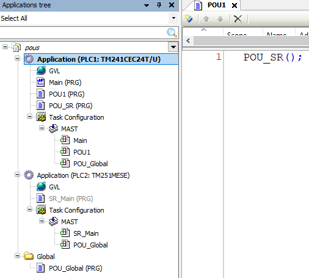
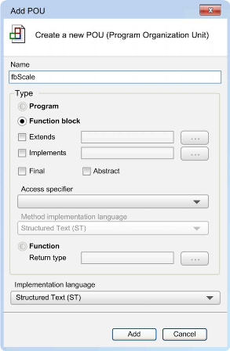
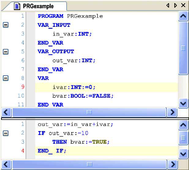
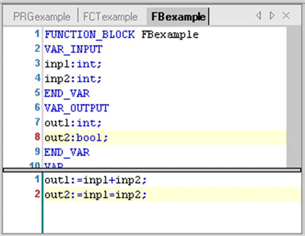
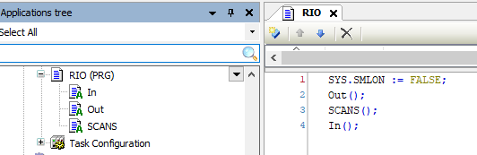

[<- До підрозділу](README.md)	[PLC MachineStruxure](../ecostruxuremachineexpert.md) 	[CODESYS (загальна)](../codesys.md)	[Коментувати](#feedback)

# Програмні сутності POU в в Machine Expert і CODESYS: теоретична частина

У цій лекції теорія дається в контексті ПЗ Machine Expert, який базується на CODESYS.

## POU

Термін Program Organizational Unit (**POU**) означає програмні об’єкти (програми, функціональні блоки, функції тощо), що використовуються для створення застосунку контролера. 

Відповідно до стандарту IEC 61131, POU є програмою, функціональним блоком або функцією. Однак у Machine Expert термін POU використовується в ширшому значенні для позначення програмних елементів загалом, які можуть містити IEC-код, таких як методи, властивості, інтерфейси тощо. Тому коли в документації йдеться про POU у більш вузькому значенні, визначеному IEC 61131, використовується термін **об’єкт POU** - програма, функція або функціональний блок. 

POU сам по собі не виконується після його створення. Для того щоб код, що міститься в POU, почав виконуватися, він має бути включений у виконувальний контекст застосунку. Це означає, що програмний POU повинен бути викликаний задачею (Task) або з іншого POU, який уже виконується в межах відповідної задачі. Лише після цього POU стає частиною циклу виконання PLC і бере участь у логіці керування.

POU можуть бути створені на глобальному рівні або в межах конкретного застосунку. POU, створені у глобальному вузлі Global дерева Applications tree, не прив’язані до конкретного пристрою і можуть повторно використовуватися в різних застосунках шляхом інстанціювання. POU, створені безпосередньо під застосунком, є локальними для цього застосунку і зазвичай використовуються для реалізації його конкретної логіки.

На рис.1 показаний приклад організації програми користувача в 2 PLC. У кожному застосунку означені свої POU, а один POU з назвою `POU_Global`  означено для всього проєкту через глобальний вузол `Global`. Усі вони є програмами (Program - PRG), написані на різних мовах, але наразі це не важливо. Наразі розглянемо як ці програми викликаються. Почнемо огляд з локальних для застосунків PLC програмних об'єктів. У застосунку PLC1 їх три: `Main`, `POU1` і `POU_SR`. Програми  `Main` і `POU1` викликаються в задачі `MAST`, це видно в дереві, так як їх імена вказані всередині гілки `MAST`. Зверніть увагу, що це не є копією однойменних програм, це саме їх виклик. Тому доступ до редагування цих програм можна однаково через подвійний клік по будь якій з них. Програма `POU_SR` викликається явно з `POU1` шляхом вказівки її назви відповідно до синтаксису мови ST.   



рис.1. Приклади викликів POU

Програма `POU_Global` викликається в задачах MAST обидвох PLC, шляхом вказівки її назви в задачах `MAST`. Таким чином після побудови завантажуваного коду для цих PLC він записуватиметься в обидва. У цьому випадку кажуть, що POU інстанціюється в обидвох PLC. Так само, можна  викликати глобальні POU з інших POU. Використання глобальних POU спрощує створення розподілених застосунків з кількома PLC, де ряд програм будуть однакові, адже зміни робляться тільки в одному об'єкті POU, а інстанціювання в усіх потрібних.  

Об’єкти Program Organization Unit (POU) можна додавати до застосунку в дереві Applications tree, при цьому вибирається один із типів об'єктів:

- Program: під час виконання повертає одне або кілька значень. Усі значення зберігаються з моменту останнього виконання програми до наступного запуску. Програма може бути викликана іншим об’єктом POU.
- Function Block: під час виконання програми формує одне або кілька значень. На відміну від функції, значення вихідних змінних та необхідних внутрішніх змінних зберігаються між послідовними викликами функціонального блоку. Тому виклик функціонального блоку з однаковими аргументами (вхідними параметрами) не обов’язково завжди дає однакові вихідні значення.
- Function: під час обробки повертає рівно один елемент даних (який може складатися з кількох елементів, наприклад полів або структур). У текстових мовах виклик функції може використовуватися як оператор у виразах.



рис.2. Вікно створення POU 

## Function

### Оголошення

**Функція** (**Function**) - це POU, яка під час виконання повертає рівно один елемент даних, який є результатом виконання функції. Тип результату виконання може бути і не скалярним. 

Результат виконання функції завжди залежить тільки від значення входів. Тобто функція не має стану, оскільки не може зберігати в себе значень між викликами. З цієї причини функції не можуть містити глобальні змінні та адреси. Однак, безстановість втрачається, якщо у функції використовуються змінні з областю дії VAR_STAT.

Особливість одного виходу - результату роботи функції, робить зручним її використання у текстових мовах, де її виклик може використовуватися як оператор у виразах. Особливо це зручно, коли такі виклики вкладені, наприклад:

```pascal
result := ABS(STRING_TO_INT('-25')) + LIMIT(0, value, maxValue);
```

Є багато бібліотечних функцій, однак користувач може створювати власні. При цьому у області оголошення редактора POU, функція матиме вигляд (рис.3.): 

```pascal
FUNCTION <function name> : <data type>
```

де `<data type>` - це тип результату роботи функції.

Після цього оголошуються вхідні змінні та змінні функції. У тілі функції результат роботи функції необхідно присвоїти самій функції, тобто ім’я функції використовується як вихідна змінна. Так на рис.3 функція результат роботи функції  `FCTexample` всередині записується як присвоєння однойменній неявній змінній, хоча сама змінна явно не оголошувалася. 


рис.3. Редагування функції

### Локальні змінні 

Як вже зазначалося в розділі [Робота з даними в Machine Expert: теоретична частина](../data/teorm241.md), у функціях можна оголошувати локальні змінні з наступними областями дії:

- VAR_INPUT - вхідні параметри функції, значення передаються під час виклику, доступні лише для читання.

- VAR_OUTPUT - додаткові вихідні параметри функції (окрім основного результату); значення повертаються через оператор `=>` під час виклику.

- VAR_IN_OUT - параметри, що передаються за посиланням з можливістю читання і запису.

- VAR_IN_OUT CONSTANT - параметри, що передаються за посиланням лише для читання (розширення Machine Expert).
- VAR - локальні змінні функції, не мають зовнішнього доступу і не зберігають своє значення між викликами

- VAR_STAT - статичні локальні змінні функції (розширення IEC 61131-3, підтримується Machine Expert).

Не слід оголошувати локальні змінні у функції як RETAIN або PERSISTENT, оскільки це не матиме жодного ефекту. 

### Виклик

Функцію можна викликати тільки з інших POU, в переліку POU для задачі її не можна вказувати безпосередньо. Синтаксис виклику наведено вище.

Відповідно до стандарту IEC 61131-3, функції можуть мати додаткові виходи VAR_OUTPUT. Їх можна призначати під час виклику функції. Наприклад є функція `fun` , яка означена з двома вхідними змінними `in1` і `in2` та двома вихідними змінними `out1` і `out2`. Вихідні значення `fun` записуються в локально оголошені змінні `loc1` і `loc2`. Це матиме наступний вигляд:

```pascal
res := fun(in1 := 1, in2 := 2, out1 => loc1, out2 => loc2);
```

де : `res` — основний результат функції,`loc1`, `loc2` — додаткові виходи. `VAR_OUTPUT` у функції ≠ основний результат функції.

У функціях використання VAR_STAT має особливу семантику: статичні змінні формують внутрішній стан функції, спільний для всіх її викликів, і зберігають значення між ними. Це означає, що результат функції може залежати не лише від поточних вхідних параметрів, а й від значень, накопичених під час попередніх викликів. Відповідно, твердження про те, що функція є безстанною і що її результат визначається лише входами, є справедливим тільки за відсутності VAR_STAT у її реалізації.

## Program

### Означення

**Program** (**Програма**) є видом POU, призначеним для реалізації основної логіки керування. Тільки цей тип POU можна вказати в задачах для виклику.

На відміну від функції, програма не використовується у виразах, а виконується як окремий програмний блок зі збереженням власного стану між викликами. Водночас, на відміну від функціональних блоків, програма існує в єдиному екземплярі: усі її виклики працюють з одним і тим самим набором даних. Особливості роботи з екземплярами функціональних блоків описано нижче, тут зосередимося на Програмі.

У області оголошення редактора POU, Програма починається з:

```
PROGRAM <program name>
```

Після цього йдуть оголошення вхідних змінних, вихідних змінних та програмних змінних. Також доступні змінні доступу (access variables) як додаткова опція.



рис.4. Редагування Програми

### Локальні змінні

У Програмі можуть бути оголошені змінні з тих самих областей дії, що й у функції, окрім VAR_STAT. Крім того, програма може використовувати VAR_EXTERNAL, access variables та VAR_TEMP, що дозволяє працювати з глобальними даними, об’єктами конфігурації PLC та тимчасовими змінними в межах одного циклу виконання задачі. 

Змінні з області VAR, на відміну від функцій, зберігають свої значення між викликами програми, оскільки програма має власний виконуваний контекст у задачі та єдиний екземпляр у межах застосунку. Це дозволяє використовувати VAR у програмі для зберігання поточного стану логіки керування між циклами виконання. Натомість значення змінних VAR_TEMP збергіається лише в межах одного циклу виконання програми тобто не зберігають свої значення між викликами. Змінні з області VAR_TEMP призначені для тимчасових обчислень і допоміжної логіки всередині одного виконання задачі та не формують стан програми.

### Виклик

Програма може бути викликана з іншого POU (наприклад, з іншої програми або функціонального блока), але не з функції, а також може бути безпосередньо прив’язана до задачі.

Щоб задати вхідні та/або вихідні параметри під час виклику програми, у редакторах текстових мов (наприклад, ST) значення параметрів присвоюються після імені програми в дужках. Для вхідних параметрів використовується оператор `:=`, як і під час ініціалізації змінних у місці оголошення. Для вихідних параметрів використовується оператор `=>`. Див. наведений нижче приклад.

Приклад мовою ST:

```pascal
PRGexample(in_var := 33);
erg := PRGexample.out_var;
```

Альтернативний спосіб: 

```pascal
PRGexample(in_var := 33, out_var => erg);
```

## Function Block

### Оголошення

**Функціональний блок** (**Function Block**) поєднує властивості функцій і програм: як і функція, він інкапсулює певну логіку, але, на відміну від неї, має власний внутрішній стан, який зберігається між викликами, і, на відміну від програми, завжди використовується через екземпляр. Саме це робить функціональні блоки базовим механізмом побудови станної логіки та об’єктно-орієнтованих рішень у PLC-проєктах.

Нагадаємо з базових курсів програмування PLC, що функціональний блок має двояку природу, поєднуючи в собі логіку виконання та дані. З одного боку, функціональний блок містить програмний код, який описує певний алгоритм або поведінку, а з іншого - власний набір змінних, значення яких зберігаються між викликами. Саме ця єдність коду і даних відрізняє функціональний блок від функції, яка не має власного стану, і водночас робить його принципово іншим механізмом, ніж програма, оскільки функціональний блок завжди використовується через екземпляр і може мати кілька незалежних реалізацій з окремими станами. 

Окрім функціональності, означеної стандартом IEC 61131-3, підтримується об’єктно-орієнтоване програмування, і функціональні блоки можуть бути означені як розширення інших функціональних блоків. Вони можуть містити означення інтерфейсів, пов’язані з викликом методів. Таким чином, під час програмування з використанням функціональних блоків може застосовуватися наслідування. Однак в межах цього розділу, ці розширення не розглядаються.

Таким чином, порядок означення та використання функціональних блоків є таким:

- означується функціональний блок;
- оголошується необхідна кількість його екземплярів;
- викликаються відповідні екземпляри функціонального блока. 

При створенні функціонального блоку у якості опцій задаються додаткові поля, такі як `Extends`, `Implements`, `Access specifier`, `final`, `Abstract` та `Method implementation language`  (див. рис.2). Вони потрібні для розширених можливостей ООП, які в даній лекції не розглядаються. 

Якщо не враховувати додаткові ООП розширення синтаксис оголошення має вигляд:      

```
FUNCTION_BLOCK <function block name>
```

Далі йдуть оголошення змінних (рис.5). 



рис.5. Редагування функціонального блоку 

### Локальні змінні

У функціональному блоці можуть бути оголошені змінні з тих самих областей дії, що й у функції, а також змінні з додаткових областей, пов’язаних з наявністю власного стану та екземплярів функціонального блока. А саме:

- VAR_INST - екземплярні змінні (instance variables), які доступні тільки для методу; в межах цієї лекції не розглядаються;  
- VAR_TEMP - тимчасові змінні, які існують лише протягом одного виконання функціонального блока і не формують його стан;

Змінні VAR та VAR_TEMP ведуть себе аналогічно як у Програмах, за винятком того, що значення змінних VAR зберігаються окремо для кожного екземпляра функціонального блока, а не в єдиному екземплярі, як у Програмі.

Функціональні блоки викликаються через екземпляр, який є відтворенням (копією) функціонального блока. Кожен екземпляр має власний ідентифікатор (ім’я екземпляра) та структуру даних, що містить його входи, виходи і внутрішні змінні. 

Екземпляри, подібно до змінних, оголошуються локально в програмах та функціональних блоках або глобально - в GVL. А от у функціях оголошення екземплярів не допускається. Ім’я функціонального блока використовується як тип даних для ідентифікатора. Синтаксис оголошення екземпляра функціонального блока

```
<identifier>:<function block name>;
```

де `<identifier>` - ім’я екземпляра, яке використовується для звернення до конкретного екземпляра функціонального блока в коді (аналогічно як ім'я змінної), а `<function block name>` - ім’я означеного функціонального блока, що задає тип даних екземпляра (аналогічно як ім'я типу даних змінної).

### Виклик

Функціональні блоки викликаються через екземпляр функціонального блока. Тому екземпляр функціонального блока має бути оголошений локально або глобально. Наприклад, якщо необхідно викликати функціональний блок з екземпляром  `FBinstexample` та аргументами, це матиме вигляд:

```
FBinstexample(in_var := 33, out_var => erg);
```

У цьому прикладі, функціональний блок має вхідну змінну `in_var` типу INT та інстанціюється через екземпляр `FBinstexample`. 

Кожен виклик екземпляра приводить до зміни значень його станових змінних VAR. Доступ до змінних функціонального блока здійснюється за таким синтаксисом.

```
<instance name>.<variable name>
```

Нижче показано приклад виклику для наведеного вище прикладу:

```
in_var := 33; 					//вхідній змінній in_var присвоюється значення 33
FBinstexample (); 				//виклик fb, необхідний для подальшого доступу до вихідної змінної
erg := FBinstexample.out_var;	//зчитується вихідна змінна fb
```

Варто зауважити:

- Іззовні екземпляра функціонального блока доступні лише його вхідні та вихідні змінні, але не внутрішні.
- Доступ до екземпляра функціонального блока обмежений тим POU, у якому він оголошений, якщо екземпляр не був оголошений глобально.
- Під час виклику екземпляра можна призначати значення параметрам функціонального блока, аналогічно як в POU 
- Вхідні та двонапрямні змінні (VAR_IN_OUT) функціонального блока передаються як вказівники.
- У SFC виклики функціональних блоків можуть виконуватися лише в кроках.
- Ім’я екземпляра функціонального блока може використовуватися як вхідний параметр для функції або іншого функціонального блока.
- Якщо принаймні одна зі змінних функціонального блока є реманентною, весь екземпляр зберігається в області даних retain.

### Налаштування резерву пам’яті для online change функціональних блоків

Можна налаштувати резерв пам’яті для виконання `online change` функціональних блоків. Після внесення змін до оголошення функціонального блока (зокрема після додавання нової змінної) та виконання `online change` в нових версіях не потрібно копіювати екземпляри функціонального блока в нову область пам’яті. Завдяки цьому `online change` виконується швидше і виникає менше помилок.

Якщо налаштований резерв пам’яті буде вичерпано, перед виконанням `online change` відображається відповідне повідомлення.

Рекомендується налаштовувати резерв пам’яті для функціонального блока до завантаження застосунку в контролер. Якщо резерв пам’яті налаштовується тоді, коли застосунок уже розміщений у контролері, необхідно виконати `online change`, який є більш тривалим за часом.

Процедура налаштування резерву пам’яті для online change функціональних блоків

Якщо передбачається подальше внесення змін до функціонального блока, які під час online change вимагатимуть копіювання його екземплярів в інші області пам’яті, можна скористатися командою Online Change Memory Reserve Settings.

За замовченням ця команда недоступна в меню. Її потрібно додати через меню Tools > Customize (див. EcoStruxure Machine Expert, Menu Commands, Online Help).

Під час завантаження застосунку в контролер обсяг пам’яті, зарезервований для функціонального блока, обчислюється як поточний розмір функціонального блока плюс резерв пам’яті, налаштований у вікні Online Change Memory Reserve.

Подальші зміни функціонального блока можуть бути завантажені в контролер за допомогою online change без необхідності копіювати всі екземпляри функціонального блока в нову область пам’яті.

## Action

Додатково до основної POU, такої як Функціональний Блок або Програма, може містити додаткові програмні блоки - **Дії** (**Actions**). Стандарт IEC не визнає Дій, за виключенням в мові SFC, тому це є розширенням до стандарту. 

Дії мають імена і можуть бути реалізовані іншими мовами програмування, ніж POU, до якого вони прикріплені. По суті, Дії є додатковими програмними частинами POU, які не мають власної області оголошення локальних змінних і використовують локальні змінні відповідних секцій цього POU.

На рис.6 наступній ілюстрації показано три Дії (`In`, `Out`  і `SCANS`) у межах Програми `RIO`. Як видно дії візуально відрізняються від POU наявною літерою `A` .



рис.6. Приклад Actions в межах Program 

Означення Дій у межах POU лише створює їх опис, але саме по собі не забезпечує їх виклик. Для виконання Дії необхідно зробити явне звернення до неї з коду Програми або Функціонального Блока. Виклик можна зробити як зсередини самого POU, до якого належить Дія, так і з іншого POU, звертаючись до неї через ім’я Програми або екземпляра Функціонального Блока. Для того щоб викликати зсередини достатньо вказати її ім'я, як це зроблено на прикладі рис.6.  Виклик з іншого POU робиться за синтаксисом:

```pascal
<Program_name>.<Action_name>
```

якщо дія в Програмі, або

```pascal
<Instance_name>.<Action_name>
```

якщо Дія в екземплярі Функціонального Блока.

## Джерела

1. Modicon M241 Logic Controller User Guide, 04/2021, Schneider Electric 
2. EcoStruxure Machine Expert Software User Guide, 09/2021, Schneider Electric

## Автори


Теоретичне заняття розробив [Олександр Пупена](https://github.com/pupenasan). 

## Feedback

Якщо Ви хочете залишити коментар у Вас є наступні варіанти:

- [Обговорення у WhatsApp](https://chat.whatsapp.com/BRbPAQrE1s7BwCLtNtMoqN)
- [Обговорення в Телеграм](https://t.me/+GA2smCKs5QU1MWMy)
- [Група у Фейсбуці](https://www.facebook.com/groups/asu.in.ua)

Про проект і можливість допомогти проекту написано [тут](https://asu-in-ua.github.io/atpv/)
