[<- До підрозділу](README.md)		[Коментувати](#feedback)

# Задачі з книги Frank Petruzella   

Petruzella, Frank D.  Programmable Logic Controllers. LogixPro PLC Lab Manual for use with Programmable Logic Controllers. 5th Edition. New York: McGraw-Hill Education, 2017.

Вирішення задач не дається в цьому переліку, тільки постановка. Вирішення шукайте в інших розділах.

## 1 Програмовані логічні контролери (PLC): огляд

todo

## 2 Апаратні компоненти PLC

todo

## 3 Системи числення та коди

todo

## 4 Основи логіки

todo

## 5 Основи програмування PLC

todo

## 6 Розроблення базових схем підключення PLC та програм релейної логіки

todo

### 6.10 

Напишіть задокументовану програму, яка реалізує показану схему керування процесом машини зі зворотно-поступальним рухом, виконану на жорстко змонтованій логіці. Послідовність роботи така:

> Заготовка (workpiece) стартує з лівого положення і рухається вправо після короткочасного натискання кнопки пуску. Коли вона досягає крайнього правого положення (`LS2`), двигун автоматично змінює напрямок і повертає заготовку назад у крайнє ліве положення, після чого процес повторюється. Кнопка реверсу забезпечує можливість запуску двигуна у зворотному напрямку, щоб кінцевий вимикач `LS1` перебрав на себе автоматичне керування.

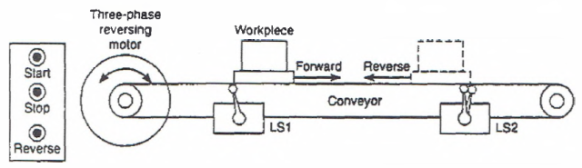

### 6.11 

6-11(a) Напишіть задокументовану програму, яка реалізує наступну операцію безперервного наповнення:

> Запустіть конвеєр при короткочасному натисканні кнопки пуску.
> Зупиніть конвеєр при короткочасному натисканні кнопки зупинки.
> Увімкніть сигнальну лампу `Run`, коли процес перебуває в робочому режимі.
> Увімкніть сигнальну лампу `Standby`, коли процес зупинений.
> Зупиніть конвеєр та увімкніть лампу `Standby` у момент першого виявлення правого краю коробки фотодатчиком.
> Коли коробка встановлена у позицію і конвеєр зупинений, відкрийте соленоїдний клапан і дозвольте наповнення коробки. Наповнення має припинитися, коли датчик рівня переходить у активний стан.
> Увімкніть лампу `Full`, коли коробка заповнена. Лампа `Full` має залишатися увімкненою, доки коробка не вийде з зони дії фотодатчика.

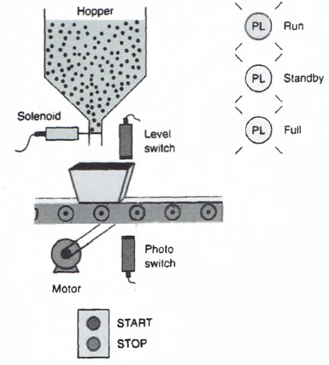

6-11(b) Модифікуйте початкову програму так, щоб панельний селекторний перемикач можна було використати для вибору одного з трьох режимів роботи:

> Коли селекторний перемикач у положенні “A”, процес має бути фактично вимкнений, і жоден вихід не повинен мати можливості увімкнутися.
> Коли селекторний перемикач у положенні “B”, процес має працювати як програма безперервного наповнення з 6-11(a).
> Коли селекторний перемикач у положенні “C”, процес має працювати так, щоб коробки просто безперервно рухалися конвеєром і проходили повз операцію наповнення.

### 6.12

6-12 Напишіть задокументовану програму, яка забезпечить увімкнення сигнальної лампи PL за умови, що селекторний перемикач SS замкнений, кнопка PB розімкнена, а кінцевий вимикач LS розімкнений.

todo

### 6.22 

6.22 Напишіть програму, яка реалізує показану релейну схему керування конвеєром. Використайте екран I/O Simulator та такі адреси, щоб змоделювати роботу програми:

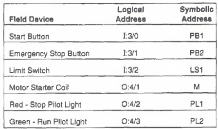

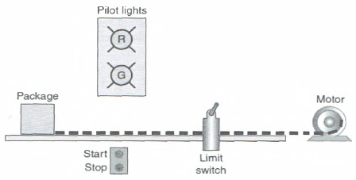

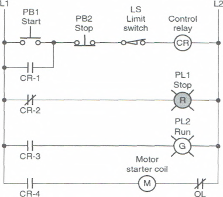

todo

### 6.25

Насос має використовуватися для наповнення двох накопичувальних баків. Насос запускається оператором вручну зі станції пуск/зупинка. Коли перший бак заповнений, логіка керування має автоматично припинити подачу в перший бак і перенаправити потік у другий бак з використанням датчиків та електромагнітних (соленоїдних) клапанів. Коли другий бак заповнений, насос має автоматично вимкнутися. Потрібно передбачити сигнальні лампи, які показують, що кожен бак заповнений.

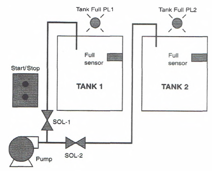

## 7 Програмування таймерів

todo

7-26 Напишіть задокументовану програму для реалізації процесу, показаного в Batch Simulator. Послідовність роботи має бути такою:

> Кнопки пуску (нормально розімкнена) і зупинки (нормально замкнена) використовуються для запуску та зупинки процесу в будь-який момент.
> Коли натискається кнопка пуску, вмикається насос 1 і починається наповнення бака.
> У міру наповнення бака замикається датчик нижнього рівня.
> Коли бак заповнений, замикається датчик верхнього рівня, і насос 1 вимикається.
> Далі автоматично запускається двигун мішалки і працює загалом 3 хвилини для перемішування рідини.
> Коли двигун мішалки зупиняється, вмикається зливний насос 3 для спорожнення бака.
> Коли бак порожній, датчик нижнього рівня розмикається і вимикає зливний насос 3.
> Для повторення послідовності натискається кнопка пуску.

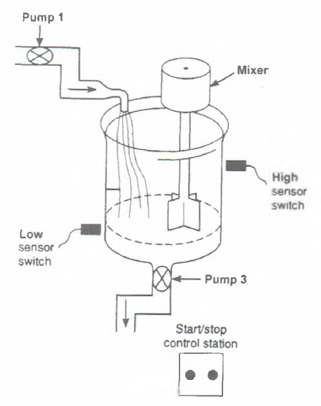

todo

### 7.38

7-38 Модифікуйте показану програму симуляції безперервного наповнення силоса. Модифікація передбачає таке:

> 2-секундну затримку перед початком наповнення коробки після зупинки конвеєра.
> 4-секундну затримку перед запуском конвеєра після заповнення коробки.

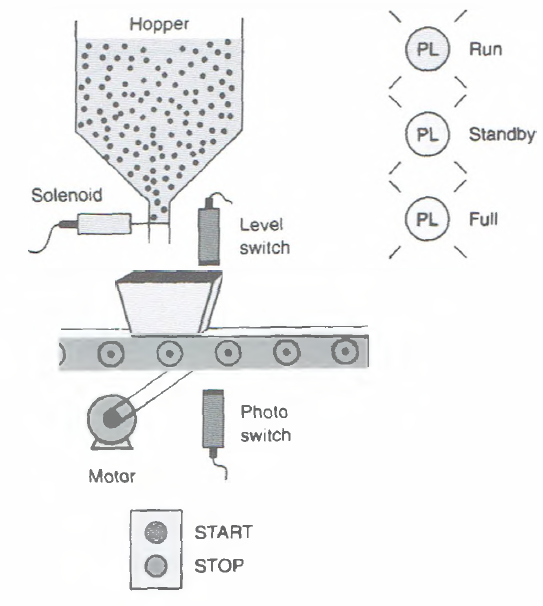

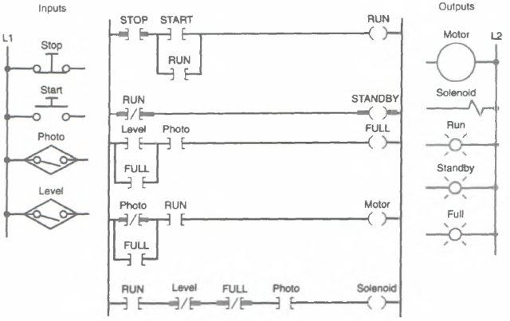

todo

## 8 Програмування лічильників

todo

### 8.7

8-7(a) Реалізуйте програму лічильника з підрахунком вгору/вниз, що використовується в системі моніторингу виробів у процесі оброблення. Ця програма призначена для безперервного контролю кількості виробів у процесі і працює так:

> Фотоелектричний датчик на вході підраховує заготовки, що надходять у систему.
> Фотоелектричний датчик на виході підраховує готові вироби, які залишають машину.
> Кількість виробів між входом і виходом відображається накопиченим значенням лічильника.
> Перед запуском система повністю порожня, і лічильник вручну скидається в нуль.
> Значення уставки лічильника в цій задачі не має значення, оскільки логіка увімкнення або вимкнення виходу не використовується.

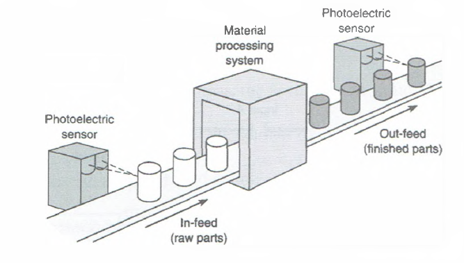

todo

### 8.12

8-12 Реалізуйте показану програму лічильника, що використовується для вимірювання довжини. Роботу програми можна підсумувати так:

> Імпульси підрахунку формуються магнітним датчиком, який виявляє зубці, що проходять, на приводній зірочці конвеєра. Якщо повз датчик проходить 10 зубців на один фут переміщення конвеєра, накопичене значення лічильника відповідатиме довжині в десятих частках фута.
> Фотоелектричний датчик контролює опорну точку на конвеєрі. Під час спрацювання він блокує підрахунок, дозволяючи лічильнику накопичувати імпульси лише тоді, коли прутковий матеріал рухається.
> Замикання кнопки скидання обнуляє лічильник.

Додайте станцію пуску/зупинки конвеєра з кнопками та використайте екран Silo Simulator і наведені адреси для моделювання програми.

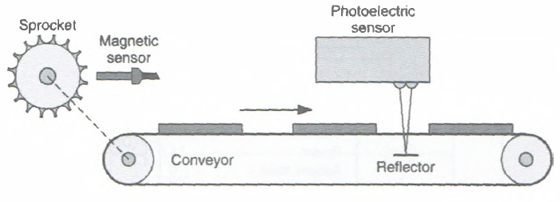

### 8.13

8-13 Реалізуйте показаний процес автоматичного штабелювання. У цьому процесі конвеєр M1 використовується для укладання металевих пластин на конвеєр M2. Фотоелектричний датчик формує вхідний імпульс на лічильник PLC кожного разу, коли металева пластина падає з конвеєра M1 на M2. Коли укладено 15 пластин, конвеєр M2 вмикається таймером PLC на 5 секунд. Роботу процесу можна підсумувати так:

> Коли натискається кнопка пуску, конвеєр M1 починає працювати.
> Після укладання 15 пластин конвеєр M1 зупиняється, а конвеєр M2 запускається.
> Після роботи конвеєра M2 протягом 5 секунд він зупиняється, і послідовність автоматично повторюється.
> Біт завершення таймера скидає таймер і лічильник та формує короткочасний імпульс для автоматичного повторного запуску конвеєра M1.

Для моделювання програми використайте пляшки замість пластин разом з екраном Bottle Line Simulator і наведеними адресами.

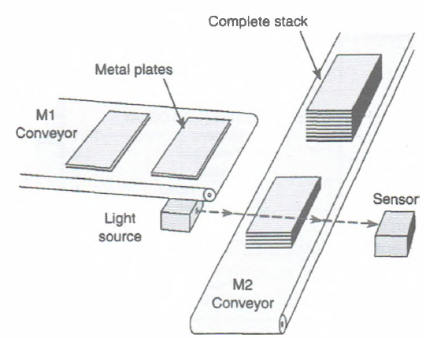

todo

### 8.22

8-22 Напишіть задокументовану програму PLC, яка виконує наведений промисловий процес керування. Послідовність роботи така:

> Виріб знаходиться у вихідному положенні (контакти кінцевого вимикача LS1 замкнені).
> Натискається кнопка пуску, і двигун конвеєра починає переміщувати виріб уперед у напрямку позиції A (контакти LS1 розмикаються, коли важіль приводу повертається у нормальне положення).
> Конвеєр переміщує виріб до позиції A і зупиняється (позиція A визначається вісьмома імпульсами типу «0→1» від енкодера, які підраховуються лічильником з підрахунком вгору).
> Відбувається затримка часу 10 секунд, після чого конвеєр починає переміщувати виріб до LS2 і зупиняється (контакти LS2 замикаються, коли виріб натискає на важіль кінцевого вимикача).
> Кнопка аварійної зупинки використовується для зупинки процесу в будь-який момент.
> Якщо послідовність переривається аварійною зупинкою, лічильник і таймер автоматично скидаються.

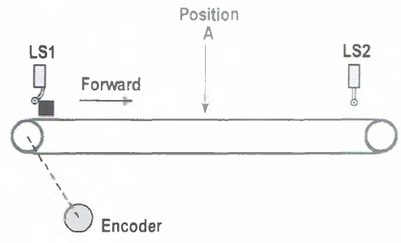

### 8.23

8-23 Напишіть задокументовану програму PLC для реалізації показаного процесу. Лічильник з підрахунком вгору має бути запрограмований як частина операції пакетного підрахунку для автоматичного сортування виробів з метою контролю якості. Лічильник використовується для відведення одного виробу з кожних десяти на контроль або інспекцію. Робота схеми така:

> Станція з кнопками пуску/зупинки використовується для вмикання та вимикання двигунів конвеєрів (M1 і M2).
> Датчик наближення підраховує вироби під час їх проходження по конвеєру.
> Коли значення лічильника досягає 10, вихід лічильника активує соленоїд заслінки, відводячи виріб на лінію інспекції.
> Соленоїд заслінки вмикається на 0,3 секунди, що забезпечує достатній час для проходження виробу на лінію контролю якості.
> Після завершення інтервалу 0,3 секунди заслінка повертається у нормальне положення.
> Лічильник скидається в нуль і продовжує накопичувати підрахунок.
> Передбачено кнопку скидання для ручного обнулення лічильника.

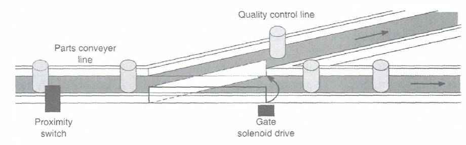

todo

### 8.25

8-25 Напишіть задокументовану програму PLC для реалізації показаного процесу. У цьому застосуванні підприємству, що виготовляє набори для електронного монтажу, потрібен лічильник для підрахунку кількості резисторів, що вкладаються в кожен набір. Контролер має зупиняти намотувальну котушку після досягнення заданої кількості резисторів (20). Після цього працівник відрізає стрічку з резисторами та вкладає її в набір. Робота схеми така:

> Станція з кнопками пуску/зупинки використовується для ручного вмикання та вимикання приводу намотувальної котушки.
> Прохідний (through-beam) датчик підраховує резистори під час їх проходження.
> Лічильник з уставкою 20 (кількість резисторів у кожному наборі) автоматично зупиняє намотувальну котушку, коли накопичене значення дорівнює 20.
> Передбачено другий лічильник для підрахунку загальної кількості.
> Передбачено кнопки ручного скидання для обнулення обох лічильників.

todo

### 8.28.

8-28 Напишіть задокументовану програму PLC, яка реалізує показаний процес штабелювання коробок. У цьому застосуванні необхідно керувати конвеєрною стрічкою, що подає коробки на механічний штабелер. Штабелер може укладати різну кількість коробок з плиткою для стелі на кожен піддон (залежно від розміру піддона та уставки лічильника). Коли необхідну кількість коробок укладено, конвеєр зупиняється до моменту, поки завантажений піддон не буде прибрано і на зону завантаження не встановлять порожній піддон. Для формування імпульсів підрахунку після проходження кожної коробки використовується фотоелектричний датчик. Окрім станції пуску/зупинки конвеєра, передбачено віддалену кнопку скидання, яка дозволяє оператору з навантажувача скинути систему після встановлення порожнього піддона в зону завантаження. Роботу системи можна підсумувати так:

> Натискання кнопки пуску запускає конвеєр.
> Під час проходження кожної коробки повз фотоелектричний датчик реєструється імпульс підрахунку.
> Коли досягається уставлене значення (у цьому випадку 20), конвеєрна стрічка вимикається.
> Оператор навантажувача прибирає завантажений піддон.
> Після встановлення порожнього піддона оператор навантажувача активує віддалену кнопку скидання, після чого весь цикл запускається знову.

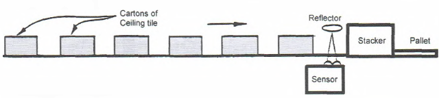

todo

### 8.32

8-32 Напишіть задокументовану програму PLC, яка реалізує наведений процес пакування:

> Метою цього процесу є укладання 10 одиниць продукції в кожен контейнер.
> Процес запускається натисканням кнопки пуску.
> Під час проходження продукції через світловий промінь вона виявляється фотоелектричним датчиком наближення і підраховується лічильником PLC.
> Коли значення лічильника досягає 10, соленоїдно керована відхильна пластина (SOL A) вмикається і спрямовує продукцію з жолоба A в жолоб B.
> Коли досягається наступне значення 10, соленоїдно керована відхильна пластина вимикається і знову спрямовує продукцію в жолоб A, і так далі.
> Також передбачена можливість зупинки процесу в будь-який момент і ручного скидання накопиченого значення лічильників.

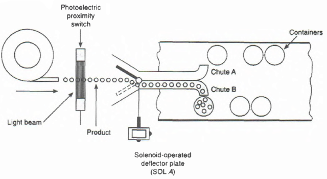

### 8.33

8-33 Напишіть задокументовану програму PLC, яка змоделює роботу показаної релейної схеми керування, виконаної на жорстко змонтованій логіці. Послідовність роботи така:

> Оператор запускає систему, після чого вироби для сортування подаються на виробничий конвеєр.
> Після надходження на конвеєр вироби рухаються далі та спрацьовують кінцевий вимикач 1, який підраховує всі вироби.
> Кінцевий вимикач 2 підраховує лише вироби більшого розміру.
> Під час спрацювання кінцевого вимикача 2 активується пневматичний штовхач, який спрямовує всі великі вироби в пакувальну коробку 2.
> Менші вироби продовжують рух до кінця конвеєра та складаються в пакувальну коробку 1.
> Активація кнопки скидання в будь-який момент обнуляє обидва лічильники.

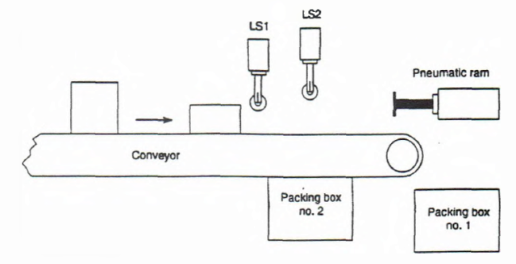

todo

## 9 Інструкції керування виконанням програми

todo

## 10 Інструкції оброблення даних

todo

## 11 Математичні інструкції

todo

## 12 Інструкції секвенсерів та регістрів зсуву

todo

### 12.9

12-9 Реалізуйте показану програму фарбування методом розпилення з використанням регістра зсуву. Послідовність роботи така:

> Кожен біт файлу відповідає окремій станції на лінії, а стан біта вказує, чи присутній виріб на цій станції.
> Бітова адреса 1:1/2 визначає, чи надійшов виріб на лінію.
> Регістр зсуву використовується для відстеження виробів, які підлягають фарбуванню. Для позначення руху лінії вперед застосовується інструкція Bit Shift Left. У міру переміщення виробів уздовж виробничої лінії бітові шаблони регістра зсуву відображають вироби на підвісному конвеєрі, що мають бути пофарбовані. LS1 використовується для виявлення підвісу, а LS2 — для виявлення виробу.
> Коли виріб, що підлягає фарбуванню, і підвіс з’являються послідовно (що визначається послідовним замиканням LS2, а потім LS1), у регістр зсуву вводиться логічна «1».
> Логічна «1» призводить до спрацювання пістолета ґрунтового покриття, а через п’ять кроків, коли «1» з’являється далі в регістрі зсуву, спрацьовує пістолет фінішного покриття. Кінцевий вимикач LS3 підраховує вироби під час їх виходу з печі.
> Кількість імпульсів, отриманих від кінцевих вимикачів LS2 і LS3, має бути однаковою після завершення циклу фарбування (при цьому вмикається PL1), що є індикацією того, що кількість виробів, які розпочали процес фарбування, дорівнює кількості виробів, які його завершили. Логічний «0» у регістрі зсуву означає, що на конвеєрі немає виробів для фарбування і, відповідно, блокує роботу пістолетів розпилення.

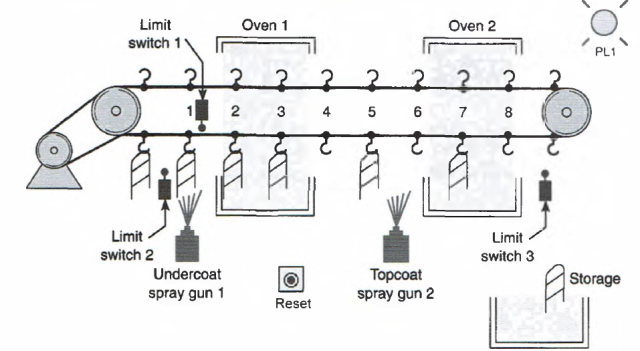

todo

### 12.14

12-14 Виріб безперервно рухається складальною лінією, яка має чотири станції, як показано. Виріб входить у зону контролю, де датчик наближення визначає його присутність. Інспектор оглядає виріб і активує кнопку бракування, якщо виріб не проходить контроль. Якщо виріб дефектний, на станціях 1, 2 і 3 вмикаються сигнальні лампи браку, щоб повідомити складальника ігнорувати цей виріб. Коли дефектний виріб досягає станції 4, вмикається відвідна заслінка, яка спрямовує цей виріб у контейнер для браку. Розробіть програму PLC, яка використовує інструкцію Bit Shift Left для реалізації цього процесу.

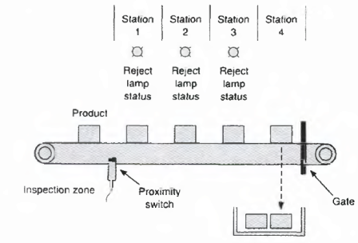

todo

## 13 Практика встановлення PLC, редагування та усунення несправностей

todo

## Автори

Адаптацію розробив [Олександр Пупена](https://github.com/pupenasan). 

## Feedback

Якщо Ви хочете залишити коментар у Вас є наступні варіанти:

- [Обговорення у WhatsApp](https://chat.whatsapp.com/BRbPAQrE1s7BwCLtNtMoqN)
- [Обговорення в Телеграм](https://t.me/+GA2smCKs5QU1MWMy)
- [Група у Фейсбуці](https://www.facebook.com/groups/asu.in.ua)

Про проект і можливість допомогти проекту написано [тут](https://asu-in-ua.github.io/atpv/)

