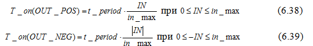
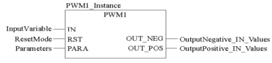
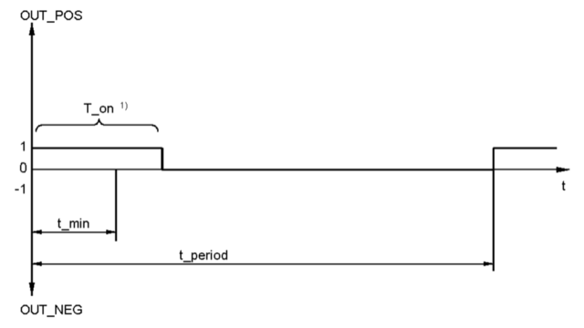
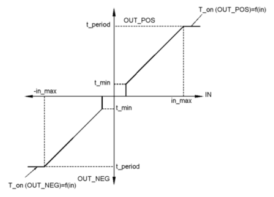
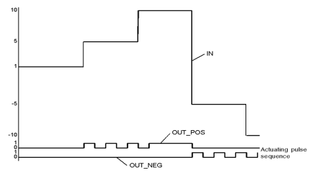
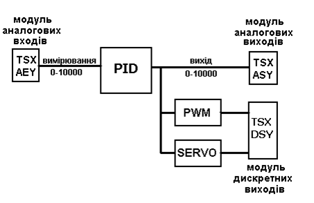
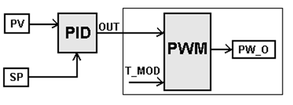
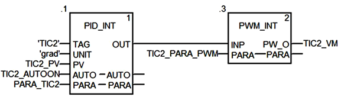
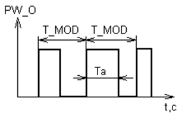
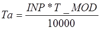

[<- До підрозділу](README.md)

# Реалізація широтно-імпульсного регулювання в UnityPRO/Control Expert

На рис.6.1 показана узагальнена функціональна структура контурів регулювання з використанням ПЛК. 

Нагадаємо, що в UNITY PRO для реалізації алгоритмів регулювання пропонується використовувати бібліотеку *ControlLib*, зокрема блоки сімейств *Controller,* *Output* *Processing,* *Setpoint* *Management*. У таблиці 6.2 наведений перелік функціональних блоків сімейства Controller .

Таблиця 6.2. Функціональні блоки сімейства Controller

| Назва типу EFB | Призначення                                                  |
| -------------- | ------------------------------------------------------------ |
| *SAMPLETM*     | управління періодичністю виклику  відносно початкового циклу |
| *PI_B*         | ПІ-регулятор                                                 |
| *PIDFF*        | ПІД-регулятор                                                |
| *STEP2*        | двохпозиційний регулятор                                     |
| *STEP3*        | трьохпозиційний регулятор                                    |
| *AUTOTUNE*     | блок автонастройки *PI_B* та *PIDFF*                         |
| *IMC*          | коректор моделі                                              |

## SAMPLETM 

Всі блоки бібліотеки *Control* *Lib*, алгоритм яких передбачає використання часових інтервалів (наприклад для інтегрування або диференціювання), розраховують ці інтервали як різницю між плинним та попереднім часом виклику блоку. Це значить, що їх можна викликати аперіодично. Однак алгоритми регулювання потребують значні часові ресурси, що займає значну частину часу Задачі(*Task*), в якій вони викликаються. З іншого боку, більшість задач регулювання не потребують частої обробки, а отже їх контури можуть оброблятися рідше, ніж кожний цикл. Таким чином для оптимізації роботи програми контролера рекомендується обробляти контури періодично, і зсунутими у часі відносно один одного. 

Так, наприклад, при наявності 10-ти контурів регулювання, можна викликати зв’язані в контурі блоки з періодичністю 100 мс, але зсунуті один відносно одного на один цикл. Тобто через кожні 100 мс, протягом 10 циклів будуть оброблені всі контури. Періодичний виклик зі зсувом по часу можна забезпечити функціональним блоком *SAMPLETM*.

Функціональний блок *SAMPLETM* з періодичністю, яка визначається вхідним параметром *INTERVAL*, на один цикл Задачі виставляє в значення *TRUE* вихід *Q*. Вхідний параметр *DELSCANS* визначає зміщення в циклах запуску внутрішнього таймеру блоку відносно першого циклу контролеру (після холодного старту).

На рис.6.5 показаний приклад використання 2-х екземплярів *SAMPLETM*, виходи *Q* яких з періодичністю однієї секунди будуть виставлятися на один цикл в *TRUE*. Включення цих виходів буде зміщене на один цикл один відносно одного. 

Рис.6.5. Використання 2-х екземплярів SAMPLETM зі зсувом на один цикл відносно      

## Управління виконавчими механізмами з використанням широтно-імпульсного перетворення *PWM1*

Функціональний блок *PWM1* призначений для перетворення числового значення на вході блоку *IN* в 2 дискретні сигнали *OUT_POS* та *OUT_NEG* з певною шириною та частотою імпульсу (рис.6.31). 

*Ініціалізація блоку обов’язково повинна проводитись при першому циклі ПЛК!*

Весь час ділиться на періоди з тривалістю *t_period* (рис.6.32). У залежності від значення входу *IN*, на кожному періоді формується сигнал *OUT_POS* (при *IN>0*) або *OUT_MIN* (при *OUT<0*) з тривалістю *T_on*. Залежність *T_on* від значення *IN* описується формулами (6.38)-(6.39), та графічно показана на рис.6.33. 

Рис.6.31. Приклад виклику блоку PWM1

У таблиці 6.25 та 6.26 наведені параметри блоку PWM1.  

*Таблиця* *6.25* Параметри блоку PWM1

|           |             | Вхідні  параметри                 |      |
| --------- | ----------- | --------------------------------- | ---- |
| *IN*      | *REAL*      | Вхідна змінна                     |      |
| *RST*     | *BOOL*      | 1 = Скинути  блок                 |      |
| *PARA*    | *Para_PWM1* | Параметри                         |      |
|           |             | **Вихідні  параметри**            |      |
| *OUT_NEG* | *BOOL*      | Вихід для від’ємного  значення IN |      |
| *OUT_POS* | *BOOL*      | Вихід для додатного  значення IN  |      |
|           |             |                                   |      |

*Таблиця* *6.26* Опис структурного типу Para_PWM1

|            |        |                                                   |
| ---------- | ------ | ------------------------------------------------- |
| *t_period* | *TIME* | Довжина (тривалість) періоду                      |
| *t_min*    | *TIME* | Мінімальний час  імпульсу                         |
| *in_max*   | *REAL* | обмеження по максимуму  (по модулю) значення *IN* |

Рис.6.32. Діаграма зміни виходів блоку *PWM1*

Рис.6.33. Статична характеристика *t_period(IN)* для *PWM1*

Параметр *t_min* вказує мінімальну тривалість імпульсу. Тобто якщо розрахований час *T_on* за (6.38) та (6.39) буде менше часу *t_min*, то імпульс на даному періоді формуватися не буде.

При команді *RST=1* всі виходи блоку скидаються в *FALSE*, а блок починає відраховувати час з моменту, коли *RST=0*.

Якщо блок *PWM1* обробляє вихід регуляторів *PI_B/PIDFF*, то рекомендується *t_period* виставляти рівним часу виклику блоку регулятору. Це гарантує, що кожний новий сигнал на ВМ з регулятора буде оброблений блоком *PWM1*. Час періоду виклику самого *PWM1* рекомендується виставляти як мінімум в 10 раз менше ніж час періоду *t_period*.    

Блок *PWM1* може використовуватися для управління двигуном, швидкість якого керується шириною імпульсу *OUT_POS* в один бік, і *OUT_NEG* в інший бік. Іншим прикладом виконавчого механізму є *ТЕН* (трубчатий електронагрівач), однак при цьому буде використовуватись тільки вихід *OUT_POS*. 

 Приклад діаграми роботи *PWM1* з настройками *t_period=t#4s, t_min=t#0.5s, in_max=10* показаний на рис.6.34.

Рис.6.34. Приклад діаграми роботи PWM1

 ## PWM_INT

Процедури UNITY PRO для цілочисельного регулювання *PID_INT,* *PWM_INT* та *SERVO_INT* аналогічні функціям *PID*, *PWM* та *SERVO*, які використовувалися в PL7 PRO при програмуванні попередніх версій TSX Premium та TSX Micro. Дані процедури як правило використовують тільки для сумісності з конвертованими проектами з PL7, однак використання їх в нових проектах UNITY PRO також дозволяється. Альтернативою процедурам цілочисельного регулювання є більш потужні функціональні блоки бібліотеки управління, які наведені вище. 

Структурна схема можливих варіантів контуру з цілочисельним ПІД-регулятором представлена на рис.6.50.

Рис.6.50. Структурна схема варіантів реалізації контуру з ПІД-регулятором 

До структурної схеми можуть входити три процедури:

-     блок ПІД-регулятора (процедура *PID_INT*);

-     блок широтно-імпульсного перетворення (*PWM_INT*);

-     блок управління реверсивним двигуном (*SERVO_INT*).

При використанні аналогового виконавчого механізму, цілочисельний вихід блока ПІД подається на аналоговий вихід контролера. Якщо використовується електричний виконавчий механізм з постійною швидкістю обертання (наприклад виконавчий механізм типу МЕО) або крокові двигуни, цілочиселний вихід *PID_INT* за допомогою процедур *PWM_INT* або *SERVO_INT* перетворюється у послідовність імпульсів, які подаються на дискретні виходи. Для правильного функціонування процедур *PID_INT,* *PWM_INT* та *SERVO_INT* Задача, в якій вони викликаються повинна виконуватись у періодичному режимі! 

Якщо у якості виконавчого механізму використовується кроковий двигун або трубчатий електронагрівач (ТЕН), то після процедури *PID_INT* використовується блок широтно-імпульсного модулятора *PWM_INT*, структура якого наведена на рис.6.56.

Рис.6.56. Структура контуру управління з широтно-імпульсною модуляцією

Приклад використання показаний на рис.6.57. Параметр *INP* – вхід блоку, на який подається вихід регулятора *PID_INT; PW_O* – дискретний модульований вихід; *PARA* – масив параметрів типу *INT* із 5 елементів:

Таблиця 6.40 Таблиця параметрів (*PARA*) процедури *PWM_INT*

| Елемент масиву        | Позначення | Призначення                                |
| --------------------- | ---------- | ------------------------------------------ |
| *PARA[0]*             | *T_MOD*    | Період модуляції  (в 0.01 c) (0-32767)     |
| *PARA[1]-*  *PARA[4]* |            | дані для збереження  проміжних результатів |

Рис.6.57. Приклад виклику процедури PWM_INT разом з PID_INT 

Рис.6.58  Широтно-імпульсна модуляція

Першим параметром цієї таблиці є слово, в якому зберігається значення періоду модуляції *T_MOD*. Період модуляції повинен бути меншим або дорівнювати періоду дискретизації ПІД-регулятора (*TS)*. *T_MOD* може змінюватись у межах від 0 до 32767 і вимірюється у 0,01 секунди. Тривалість імпульсу залежить від значення вхідної величини *INP* і періоду модуляції *T_MOD*:

    (6.49)

## Контрольні запитання

1.   Які апаратні засоби є вбудовані в TSX Premium для реалізації контурів регулювання?

2.   З яких основних частин складається прикладна програма ПЛК для реалізації контурів регулювання? Поясніть призначення кожної з цих частин. 

3.   Блоки FFB яких бібліотек використовуються для реалізації контурів регулювання в UNITY PRO? Які з них використовуються тільки для сумісності з проектами PL7 та Concept?

4.   Блоки FFB якої бібліотеки рекомендується для реалізації контурів регулювання в UNITY PRO? Чи обов’язково користуватися для задач регулювання блоками саме цієї бібліотеки?

5.   Поясніть призначення та особливості функціонування режиму слідкування (*Tracking*) FFB-блоків бібліотеки *ControllLIB*. Який пріоритет має цей режим по відношенню до режиму ручний/автомат?

6.   Поясніть призначення та особливості функціонування ручного та автоматичного режимів FFB-блоків бібліотеки *ControllLIB*. Який пріоритет має цей режим по відношенню до режиму слідкування? 

7.   Яким чином контролюється виконання FFB бібліотеки *ControllLIB*? Які типові помилки можуть виникнути при обробці блоку?

8.   Чи обов’язково викликати блоки регуляторів *ControllLIB* строго періодично?

9.   Розкажіть про призначення FFB блоків сімейства *Controller* бібліотеки *ControllLIB*. 

10.   Розкажіть про призначення та функціонування *SAMPLETM*. Чи обов’язкове їх використання тільки з блоками регуляторів?

11.   Використовуючи функціональну схему поясніть основні принципи роботи блоку регулятору *PI_B*.

12.   Яким чином блок *PI_B* переводиться в П- та ПІ-режим регулювання? Поясніть відмінності роботи цих режимів.

13.   Поясніть призначення полів структури *Para_PI_B* .

14.   Використовуючи функціональну схему поясніть основні принципи роботи блоку регулятору *PIDFF*.

15.   Поясніть призначення полів структури *Para_PIDFF* .

16.   Чим відрізняється вихід *OUTD* від *OUT* в регуляторах блоків PI_B та PIDFF? Навіщо кожен з них використовується?

17.   Розкажіть про призначення входу *RCPY*. Як активувати режим використання *RCPY*?

18.   Розкажіть про функціонування блоків *PI_B/PIDFF* в режимі абсолютного розрахунку.

19.   Розкажіть про функціонування блоків *PI_B/PIDFF* в інкрементальному режимі роботи.

20.   Як Ви розумієте термін безударність переходу? Між якими режимами і яким чином реалізована безударність переходу в блоках *PI_B* та *PIDFF*?

21.   Розкажіть про призначення та функціонування *STEP2*.

22.   Розкажіть про призначення та функціонування *STEP3*.

23.   Розкажіть про призначення та функціонування *HYST*.

24.   Розкажіть про призначення та функціонування *INDLIM*.

25.   Розкажіть про призначення та функціонування процедури *LOOKUP_TABLE*.

26.   Розкажіть про призначення та функціонування *DEAD_ZONE*.

27.   Розкажіть про призначення та функціонування *SAH*.

28.   Розкажіть про призначення та функціонування *AVGMV* та *AVGMV_K*. 

29.   Розкажіть про призначення та функціонування *K_SQRT*.

30.   Розкажіть про призначення та функціонування *MFLOV*.

31.   Розкажіть про призначення та функціонування *MULDIV_W* та *SUM_W*.

32.   Розкажіть про призначення та функціонування *SERVO*. 

33.   Яким чином блоки управління серводвигунами можуть визначати положення регулюючого органу?

34.   Як контролюється блоком *SERVO* досягнення регулюючим органом крайніх положень? Як при цьому веде себе блок?

35.   Які особливості обробки серводвигунів в автоматичному та ручному режимах? Розкажіть про призначення входу *SEN*.

36.   Розкажіть про роботу блоку управління серводвигуном в режимі активації *RCPY*? Як при цьому правильно з’єднувати *SERVO* та регулятор? Що необхідно передбачити в програмі в ручному режимі?

37.   Розкажіть про роботу блоку управління серводвигуном в режимі без *RCPY*? Як при цьому правильно з’єднувати *SERVO* та регулятор? Що необхідно передбачити в програмі в ручному режимі?

38.   Навіщо задаються в блоці управління серводвигунами параметри *t_motor* та  *t_mini*?

39.   Розкажіть про призначення та функціонування *PWM1*. 

40.   Розкажіть про призначення та функціонування *MS*. У яких випадках необхідно використовувати цей функціональний блок?

41.   Розкажіть про призначення та функціонування *SP_SEL*. 

42.   Розкажіть про призначення та функціонування *RAMP*. 

43.   Розкажіть про призначення та функціонування *RATIO*. 

44.   Розкажіть про призначення та функціонування *SCALING*. 

45.   Розкажіть про призначення та функціонування *DTIME*. 

46.   Розкажіть про призначення та функціонування *INTEGRATOR*. 

47.   Розкажіть про призначення та функціонування *LAG_FILTER*. 

48.   Розкажіть про призначення та правила використання процедур цілочисельного регулювання. У якому режимі повинна виконуватися задача, в якій ці процедури виконуються?

49.   Розкажіть про призначення та функціонування *PID_INT*. 

50.   Розкажіть про призначення та функціонування *SERVO_INT*. 

51.   Розкажіть про призначення та функціонування *PWM_INT*. 

Теоретичне заняття розробив [Прізвище або нік розробника Імя](https://github.com). 
