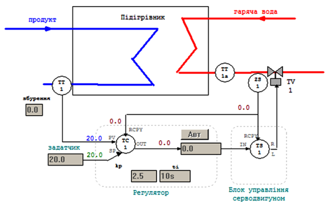
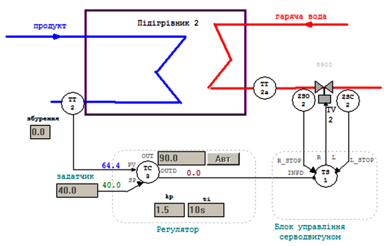
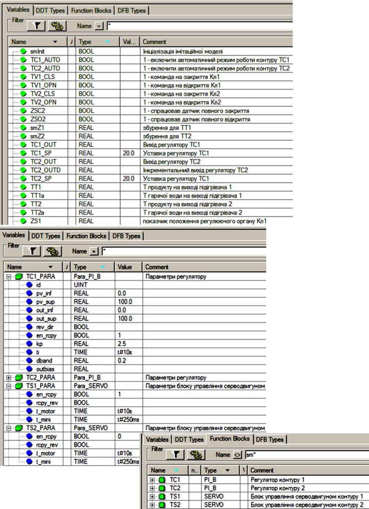
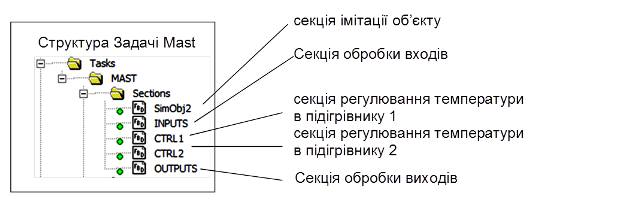
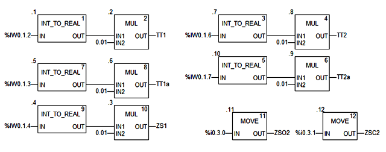
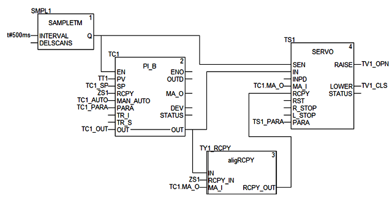
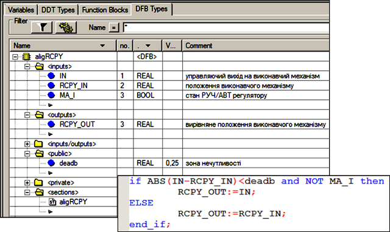
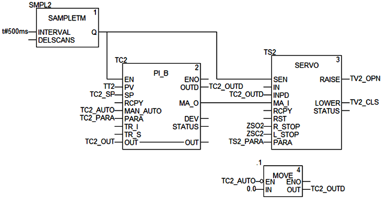

[<- До підрозділу](README.md)	[PLC M340, M580 Control Expert/Unity Pro](../controlexpert.md)		[Коментувати](#feedback)

# Регулювання з використанням виконавчих механізмів типу реверсивний двигун UnityPRO/Control Expert

Завдання. 

Необхідно створити проект в UNITY PRO для реалізації поставленої задачі (рис.6.69 та рис.6.70) з використанням FFB бібліотеки *ControlLIB*. Налагодження проекту зробити з використанням готового програмного імітатору об’єкту та операторського екрану. 

Технологічна установка являє собою два теплообмінника для підігріву рідкого продукту за допомогою гарячої води. У першому підігрівнику (рис.6.69) температура продукту на виході вимірюється датчиком температури *TT1* (0-100 °C, вхід ПЛК *%IW0.1.2*) який вмонтований на трубопроводі на відстані кількох метрів від підігрівника, а регулюється витратою гарячої води на виході підігрівника з використанням клапану *TV1* і приводом типу МЕО (вихід ПЛК *%Q0.3.16* – "більше", *%Q0.3.17* – "менше"). Додатково вимірюється також температура води в трубопроводі безпосередньо на виході підігрівника за допомогою датчика *ТТ1а* (0-100 °C, вхід ПЛК *%IW0.1.3*). Виконавчий механізм *TV1* має показчик положення регулюючого органу (0-100%, вхід ПЛК *%IW0.1.4*). Час повного відкриття клапану – 10с, мінімальний імпульс – 250 мс. 

Температура продукту на виході другого підігрівника (рис.6.70) вимірюється датчиком температури *TT2* (0-100 °C, вхід ПЛК *%IW0.1.6*), а регулюється витратою гарячої води на виході підігрівника з використанням клапану *TV2* з приводом типу МЕО (вихід ПЛК *%Q0.3.18* – "більше", *%Q0.3.19* – "менше"). Додатково вимірюється також температура води в трубопроводі безпосередньо на виході підігрівника за допомогою датчика *ТТ2а* (0-100 °C, вхід ПЛК *%IW0.1.7*). Виконавчий механізм *TV2* має датчики кінцевого положення регулюючого органу: "повністю відкритий" - вхід ПЛК *%I0.3.0*, "повністю закритий" - вхід ПЛК *%I0.3.1*. Час повного відкриття клапану – 10с, мінімальний імпульс – 250 мс.

Система управління повинна забезпечити регулювання температури *ТТ1* та *ТТ2* з підтримкою наступних функцій:

1)  стабілізація температур на виходах підігрівників на заданому оператором значені, з використанням ПІ регуляторів та блоків управління серводвигунами;

2)  можливість настройки коефіцієнтів *Kp* та *Ti* з операторського екрану;

3)  можливість ручного управління виконавчими механізмами *TV1* та *TV2* з операторського екрану при переключенні в ручний режим з забезпеченням безударності переходу.

Рішення.

Перелік змінних та екземплярів функціональних блоків наведені на рис.6.71. 

Рис.6.69. Операторський екран для контролю та управління процесом нагрівання в підігрівнику 1

Рис.6.70. Операторський екран для контролю та управління процесом нагрівання в підігрівнику 2  

 

Рис.6.71. Змінні проекту  

Загальні принципи роботи контуру управління температурю в підігрівнику 1. 

Функціональна схема контуру регулювання температури продукту показана на операторському екрані (рис.6.70). 

Контур включає:

-           канали вимірювання (*ТТ1*, *ТТ1а*);

-           регулятор *TC1* (ПІ закон), який на основі сформованого завдання (вхід *SP*) та вимірювального значення (*TT1* на вхід *PV*), формує сигнал управління (вихід *OUT*), що подається на блок управління серводвигуном *TS1*; на вхід *RCPY* регулятору заводиться сигнал зворотного зв’язку по положенню регулюючого органу *ZS1*; для регулятору налаштовуються *Kp* та *Ti*; регулятор може працювати в автоматичному або ручному режимі (вмикається/вимикається кнопка "АВТ"); в ручному режимі вихід *OUT* задається безпосередньо оператором;

-           блок управління серводвигуном *TS1*, який перетворює числовий сигнал що поступає на вхід *IN* в діапазоні 0-100% у дискретні сигнали відповідної тривалості типу "більше" (вихід R) та "менше" (вихід L); на вхід *RCPY* блоку заводиться сигнал зворотного зв’язку по положенню регулюючого органу *ZS1*; 

-           канал управління, який окрім клапану з виконавчим механізмом TV1 включає показчик положення регулюючого органу (*ZS1*);

Структура програми. Для реалізації даної задачі використовуються 5-ть секцій (рис.6.72): секція "*INPUTS*" – для обробки вхідних каналів вимірювання; секція "*OUTPUTS*" – для обробки вихідних каналів правління; секція "*CTRL1*" та "*CTRL2*" – для реалізації контурів управління температурою відповідно в підігрівнику 1 та підігрівнику 2. Секція "*Simulation*" призначена тільки для імітації об’єкта.

Рис.6.72. Структура Задачі MAST 

У секції "*INPUTS*" (рис.6.73) оцифровані значення аналогових входів масштабуються шляхом множення на коефіцієнт (діапазон 0-10000 в 0-100°C). До входів контуру з підігрівачем 1 належить також показник положення *ZS1* (діапазон 0-10000 в 0-100 %ХРО). До входів контуру з підігрівачем 2 належать також датчики кінцевого положення типу "відкрито" - *ZSO2*, та "закрито" - *ZSC2*. 

У секції "*OTPUTS*" (рис.6.74) для кожного виконавчого механізму на виходи ПЛК подаються сигнали "більше" (*TV1_OPN*, *TV2_OPN*) та "менше" (*TV1_CLS*, *TV2_CLS*). 

 

Рис.6.73. Секція обробки входів 

Рис.6.74. Секція обробки виходів 

Опис роботи програми реалізації контуру управління температурою в підігрівнику 1.  Програма секції "*CTRL1*" наведена на рис.6.75. Для UNITY PRO V<6.0 вхід/вихід *TC1.OUT* треба розірвати від *TS1* та *SERVO*, а зв’язок реалізувати через змінну *TC1_OUT*. 

Рис.6.75. Секція CTRL1 

Основу контуру складає ПІ-регулятор *TC1*, який на основі плинної температури *TT1* та завдання *TC1_SP* формує на виході *OUT* (прив’язаний до *TC1_OUT*) числове значення, яке подається на блок управління серводвигуном *TS1* для формування імпульсів "більше" та "менше". Регулятор *TC1* працює в режимі використання входу *RCPY* (*TC1_PARA*.*en_rcpy=TRUE*). Це значить, що нове значення виходу *OUT* регулятор буде розраховувати на базі значення входу *RCPY,* на який подається значення покажчика положення *ZS1*. 

 Блок управління серводвигуном *TS1* теж працює в режимі використання входу *RCPY* (*TS1_PARA*.*en_rcpy=TRUE*). Це значить, що він буде перетворювати значення різниці *IN-RCPY* у дискретний сигнал *RAISE* або *LOWER* відповідної тривалості. Значення параметрів блоку дорівнюють *TS1_PARA*.*t_motor=t#10s* та *TS1_PARA*.*t_mini=t#250ms* відповідно до умов задачі.   

Алгоритм роботи блоку *SERVO* працює таким чином, що у ручному режимі він буде видавати сигнали "більше" та "менше" до тих пір, поки *IN* та *RCPY* не будуть рівними. Для того, щоб блок управління серводвигуном в ручному режимі припиняв управління в зоні наближеній до положення *RCPY,* можна створити та використати блок вирівнювання (рис.6.76). Принцип роботи алгоритму заключається в прирівнюванні виходу *RCPY_OUT=IN* в тому випадку, коли в ручному режимі (*MA_I=TRUE*) вхід *IN* буде в зоні наближення до *RCPY*. Величина зони наближення визначається параметром *deadb*, збільшення значення якого зменшує кількість рухів однак збільшує похибку позиціонування.  

Рис.6.76. Структура і програма DFB типу aligRCPY

Блок вирівнювання *TY1_RCPY* включається в схему між *TC1.OUT* та  *SERVO.RCPY.* Тобто, коли *ZS1* знаходиться в зоні *TC1_OUT*, на вхід *TS1.RCPY* буде подаватися значення *TC1_OUT* а не *ZS1*, що приведе до відключення виходів LOWER та RAISE.   

Опис роботи програми реалізації контуру управління температурою в підігрівнику 2.  Програма секції "*CTRL2*" наведена на рис.6.77. 

Рис.6.77. Секція *CTRL2* 

Основу контуру складає ПІ-регулятор *TC2*, який на основі плинної температури *TT2* та завдання *TC2_SP* формує на інкрементальному виході *OUTD* (прив’язаний до *TC2_OUTD*) числове значення, яке подається на блок управління серводвигуном *TS2* для формування імпульсів "більше" та "менше". Регулятор *TC2* працює в режимі без використання входу *RCPY* (*TC1_PARA*.*en_rcpy=FALSE*), саме тому використовується зв’язка інкрементального виходу *TC2.OUTD* та *TS2.INPD*. Це значить, що на кожному циклі блок *TC2* буде розраховувати нове інкрементальне значення виходу *OUTD*, а абсолютне значення *OUT* використовуватися не буде. 

Блок управління серводвигуном *TS2* теж працює в режимі без використання входу *RCPY* (*TS1_PARA*.*en_rcpy=FALSE*). Це значить, що він буде перетворювати значення входу *INPD* у дискретний сигнал *RAISE* або *LOWER* відповідної тривалості. Значення параметрів блоку дорівнюють *TS1_PARA*.*t_motor=t#10s* та *TS1_PARA*.*t_mini=t#250ms* відповідно до умов задачі. 

Алгоритм роботи блоку *SERVO* працює таким чином, що у ручному режимі він буде видавати сигнали "більше" та "менше" відповідно до значення входу *INPD* на кожному циклу. Враховуючи що змінна *TC2_OUTD* обновлюється з періодичністю виклику *TC2* (500 мс), а блок *TS2* з кожним циклом, протягом 500 мс блок *TS2* буде формувати нові імпульси. Для того щоб уникнути цього ефекту, в ручному режимі (*TC2_AUTO=FALSE*) змінна *TC2_OUTD* обнуляється після обробки контуру. 

## Автори

Теоретичне заняття розробив [Олександр Пупена](https://github.com/pupenasan). 

## Feedback

Якщо Ви хочете залишити коментар у Вас є наступні варіанти:

- [Обговорення у WhatsApp](https://chat.whatsapp.com/BRbPAQrE1s7BwCLtNtMoqN)
- [Обговорення в Телеграм](https://t.me/+GA2smCKs5QU1MWMy)
- [Група у Фейсбуці](https://www.facebook.com/groups/asu.in.ua)

Про проект і можливість допомогти проекту написано [тут](https://asu-in-ua.github.io/atpv/)
