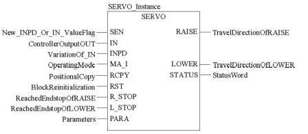
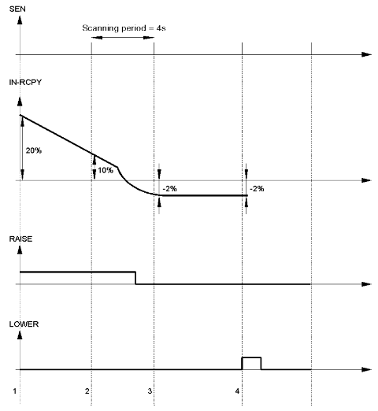
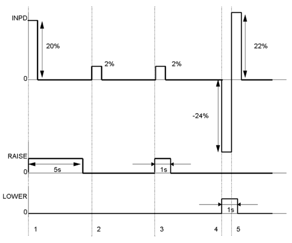
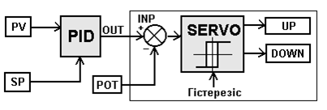
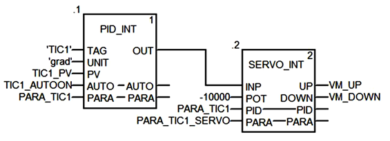
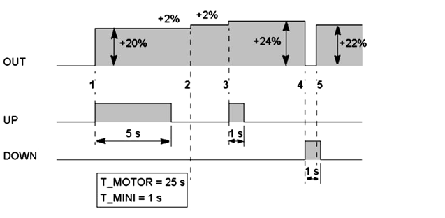

[<- До підрозділу](README.md)

# Регулювання типу більше/менше в ПЛК (Servo) в UnityPRO/Control Expert

На рис.6.1 показана узагальнена функціональна структура контурів регулювання з використанням ПЛК. 

Нагадаємо, що в UNITY PRO для реалізації алгоритмів регулювання пропонується використовувати бібліотеку *ControlLib*, зокрема блоки сімейств *Controller,* *Output* *Processing,* *Setpoint* *Management*. У таблиці 6.2 наведений перелік функціональних блоків сімейства Controller .

Таблиця 6.2. Функціональні блоки сімейства Controller

| Назва типу EFB | Призначення                                                  |
| -------------- | ------------------------------------------------------------ |
| *SAMPLETM*     | управління періодичністю виклику  відносно початкового циклу |
| *PI_B*         | ПІ-регулятор                                                 |
| *PIDFF*        | ПІД-регулятор                                                |
| *STEP2*        | двохпозиційний регулятор                                     |
| *STEP3*        | трьохпозиційний регулятор                                    |
| *AUTOTUNE*     | блок автонастройки *PI_B* та *PIDFF*                         |
| *IMC*          | коректор моделі                                              |

## SAMPLETM 

Всі блоки бібліотеки *Control* *Lib*, алгоритм яких передбачає використання часових інтервалів (наприклад для інтегрування або диференціювання), розраховують ці інтервали як різницю між плинним та попереднім часом виклику блоку. Це значить, що їх можна викликати аперіодично. Однак алгоритми регулювання потребують значні часові ресурси, що займає значну частину часу Задачі(*Task*), в якій вони викликаються. З іншого боку, більшість задач регулювання не потребують частої обробки, а отже їх контури можуть оброблятися рідше, ніж кожний цикл. Таким чином для оптимізації роботи програми контролера рекомендується обробляти контури періодично, і зсунутими у часі відносно один одного. 

Так, наприклад, при наявності 10-ти контурів регулювання, можна викликати зв’язані в контурі блоки з періодичністю 100 мс, але зсунуті один відносно одного на один цикл. Тобто через кожні 100 мс, протягом 10 циклів будуть оброблені всі контури. Періодичний виклик зі зсувом по часу можна забезпечити функціональним блоком *SAMPLETM*.

Функціональний блок *SAMPLETM* з періодичністю, яка визначається вхідним параметром *INTERVAL*, на один цикл Задачі виставляє в значення *TRUE* вихід *Q*. Вхідний параметр *DELSCANS* визначає зміщення в циклах запуску внутрішнього таймеру блоку відносно першого циклу контролеру (після холодного старту).

На рис.6.5 показаний приклад використання 2-х екземплярів *SAMPLETM*, виходи *Q* яких з періодичністю однієї секунди будуть виставлятися на один цикл в *TRUE*. Включення цих виходів буде зміщене на один цикл один відносно одного. 

Рис.6.5. Використання 2-х екземплярів SAMPLETM зі зсувом на один цикл відносно      

## Блок управління реверсивним двигуном (*SERVO*)

Функціональний блок *SERVO* призначений для реалізації управляючих дій з регуляторів *PI_B*/*PIDFF* або інших блоків з використанням виконавчих механізмів типу реверсивного двигуна (серводвигун, наприклад *МЕО*). Для управляння серводвигунами використовуються два виходи - *RAISE* ("більше") та *LOWER* ("менше"), на яких сигнал формується в залежності від значення входу *IN* (або *INPD*) та налаштування блоку (рис.6.28). У таблиці 6.23 показані параметри блоку *SERVO*.  

Рис.6.28. Виклик функціонального блоку *SERVO*

*Таблиця* *6.23*  Параметри блоку *SERVO*

|          |            | Вхідні  параметри                                            |
| -------- | ---------- | ------------------------------------------------------------ |
| *SEN*    | *BOOL*     | 1 : є нові значення на входах *INPD* або *IN*   0 : немає нових значень на входах *INPD* або *IN* |
| *IN*     | *REAL*     | значення з абсолютного  виходу блоку управління *OUT* (0 до 100%) |
| *INPD*   | *REAL*     | значення з  інкрементального  виходу блоку управління *OUTD* (-100% до 100%) |
| *MA_I*   | *BOOL*     | значення операційного  режиму блоку регулятору  до якого підключений *SERVO* (вихід  *MA_O*)   1 : Автоматичний режим   0 : інший режим (ручний або слідкування) |
| *RCPY*   | *REAL*     | Зворотній зв’язок по  позиції ВМ (0 до100%)                  |
| *RST*    | *BOOL*     | 1 : Ініціалізація функціонального блоку (відключення виходів та обнуління внутрішнього  статусу блоку) |
| *R_STOP* | *BOOL*     | кінцева позиція  "відкритий" (досягнутий  поріг по *RAISE*)  |
| *L_STOP* | *BOOL*     | кінцева позиція  "закритий" (досягнутий поріг по *LOWER*)    |
| *PARA*   | Para_SERVO | Параметри (див. таб 6.24)                                    |
|          |            | **Вихідні  параметри**                                       |
| *RAISE*  | *BOOL*     | Вихід  "більше" ("відкрити")                                 |
| *LOWER*  | *BOOL*     | Вихід "менше"  ("закрити")                                   |
| *STATUS* | *WORD*     | Слово статусу                                                |

*Таблиця* *6.24*. Опис структурного типу Para_SERVO

|            |        |                                                              |
| ---------- | ------ | ------------------------------------------------------------ |
| *en_rcpy*  | *BOOL* | 1 : Використовується зворотній зв’язок по позиції ВМ (включити *RCPY*) |
| *rcpy_rev* | *BOOL* | 1 : Інвертувати *RCPY* (0 – це 100%, 100 – це 0%)  0 : Не інвертувати *RCPY* |
| *t_motor*  | *TIME* | час повного відкриття  регулюючого органу                    |
| *t_mini*   | *TIME* | мінімальна довжина  імпульсу                                 |

Функціональний блок може використовуватись як з сигналом зворотного зв’язку по положенню виконавчого механізму (*RCPY*) так і без нього.

При використанні сигналу зворотного зв’язку (*en_rcpy* *=* *TRUE*), в якості управляючого входу *SERVO* треба використовувати вхід *IN*, який повинен бути зв’язаний з абсолютним виходом *OUT* регулятору *PI_B/PIDFF*. Для кожного нового значення виходу *OUT*, який формує регулятор, функціональний блок *SERVO* генерує дискретний вихід *RAISE* або *LOWER* з довжиною імпульсу пропорційною різниці *IN-RCPY*. При необхідності, вхід *RCPY* можна інвертувати (*rcpy_rev=1*), тобто коли показник положення регулюючого органу показує не процент відкриття, а процент закриття. Приклад діаграми роботи *SERVO* зі зворотним зв’язком по положенню ВМ показаний на рис. 6.29. 

Якщо зворотний сигнал по положенню ВМ не використовується (*en_rcpy* *=* *FALSE*) то в якості управляючого входу *SERVO*, треба використовувати вхід *INPD*, який повинен бути зв’язаний з виходом *OUTD* регулятору *PI_B/PIDFF*. Для кожного нового значення виходу *OUTD* регулятору, блок *SERVO* генерує дискретний вихід *RAISE* або *LOWER* з довжиною імпульсу пропорційною *INPD*. Приклад діаграми роботи *SERVO* без зворотного зв’язку по положенню ВМ показаний на рис. 6.30.

Для правильного функціонування операційного режиму, вхід *MA_I* блоку *SERVO* повинен бути з’єднаний з виходом *MA_O* блоку регулятору.  

Для формування імпульсу з тривалістю, пропорційною величині управляючого сигналу, необхідно вказати час повного відкриття регулюючого органу (*t_motor*). Тобто, наприклад, при формуванні на вході *INPD* значення *100%*, блок *SERVO* сформує імпульс на виході *RAISE* рівним значенню *t_motor*. А при *INPD* рівним -10%, *SERVO* сформує імпульс на виході *LOWER* рівним значенню *t_motor/10*. 

Для зменшення навантаження на двигун, тобто збільшення його терміну служби, задається мінімальний час імпульсу (*t_mini*). Якщо тривалість розрахованого імпульсу менша ніж *t_mini*, імпульс формуватися не буде, однак він буде врахований на наступних циклах.

Для точності регулювання, блок *SERVO* повинен викликатися з кожним циклом Задачі. Однак весь контур регулювання може оброблятися з меншою частотою, наприклад при використанні *SAMPLETM* (див. параграф 6.2.2). Для того щоб вказати блоку *SERVO* що регулятор *PI_B/PIDFF* оброблений і сформовані нові значення (особливо це стосується виходу *OUTD* регулятору), і його вихід *OUT/OUTD* а отже і вхід *SERVO* *IN/INPD* отримав нові значення, на вхід *SEN* подається *TRUE*. Таким чином, якщо в контурі для задавання періодичності обробки використовується блок *SAMPLETM*, то його вихід підключається паралельно до входів *EN* блоків *PI_B/PIDFF* і до входу *SEN* блоку *SERVO*. 

У ручному режимі (*MA_I=FALSE*) блок *SERVO* обробляє входи *IN/INPD* в кожному циклі незалежно від значення входу *SEN*, що треба враховувати при написанні програми. Тобто при ручній зміні виходу *OUT* регулятору, він автоматично розрахує *OUTD* (див. параграф 6.2.5), який протримається на виході аж до наступного виклику регулятору. За цей час, зв’язаний з цим виходом вхід *INPD* блоку *SERVO,* буде оброблений декілька (*n*) раз, що затягне імпульс в *n* раз довше, ніж потрібно. Для подолання цієї проблеми, в ручному режимі після кожного виклику регулятору необхідно обнулювати змінну, прив’язану до *OUTD* та *INPD* (див. приклад в параграфі 6.8.3)    

При використанні сигналу зворотного зв’язку (*en_rcpy* *=* *TRUE*) у ручному режимі блок *SERVO* буде видавати команди "більше" та "менше" на виконавчий механізм доти, поки входи *RCPY* та *IN* не будуть рівними. Це може негативно сказатися на процесі а також на роботі приводу та регулюючого органу. Варіант вирішення цієї проблеми показаний в прикладі з параграфу 6.8.3.  

При досягненні крайнього положення регулюючим органом, тобто коли *R_STOP=TRUE* або *L_STOP=TRUE*, відповідний вихід виставляється в логічний нуль (*RAISE=FALSE* або *LOWER=FALSE*) незалежно від значення *IN* або *INPD*. 

Рис.6.29. Приклад діаграми роботи блоку SERVO зі зворотним зв’язком по положенню ВМ

Розглянемо роботу *SERVO* в режимі використання зворотного зв’язку по положенню, тобто при *en_rcpy=TRUE* (рис.6.29). У цьому прикладі використовуються такі настройки: *t_motor=t#25s*, *t_mini=t#1s*, періодичність виклику основного регулятору (періодичність активації *SEN*) - 4s. Контур працює в автоматичному режимі (*MA_I=TRUE*). На діаграмі цифрами мітками позначені наступні ситуації.

1.   При початковому скануванні контуру значення (*IN-RCPY*)=+20% : на виході *RAISE* генерується імпульс тривалістю 5s (=20% від 25s);

2.   При наступному скануванні контур значення (*IN-RCPY*)=+10%: на виході *RAISE=TRUE* залишається ще протягом 2.5s (=10% від 25s); одна секунда, яка залишилась від попереднього разу вже не враховується;

3.   На 3-му циклі сканування контуру (*IN-RCPY*)= -2%: це відповідає імпульсу 0.5s на виході *LOWER*, однак оскільки це менше ніж *t_mini*, то вихід *LOWER=FALSE*; тривалість 0.5s для *LOWER* залишається збереженим до наступного циклу перерахунку;

На 4-му циклі сканування контуру (*IN-RCPY*)= -2%: це відповідає імпульсу 0.5s на виході *LOWER*, враховуючи попередній імпульс 0.5s, загальна тривалість імпульсу 1s, тобто на виході *LOWER=TRUE* протягом одної секунди.     

Рис.6.30. Приклад діаграми роботи блоку SERVO без зворотного зв’язку по положенню ВМ

Розглянемо роботу *SERVO* без використання зворотного зв’язку по положенню, тобто при *en_rcpy=FALSE* (рис.6.30). У цьому прикладі використовуються такі настройки*:* *t_motor=t#25s*, *t_mini=t#1s*, контур працює в ручному режимі (*MA_I=FALSE*). На діаграмі цифрами мітками позначені наступні ситуації.

1.   При *INPD=+20%:* на виході *RAISE* генерується імпульс тривалістю 5s (=20% від 25s);

2.   При появі значення *INPD*=+2%: це відповідає імпульсу 0.5s на виході *RAISE*, однак оскільки це менше ніж t_mini, то вихід *RAISE* *=FALSE*; тривалість 0.5s для *RAISE* залишається збереженим до наступного перерахунку;

3.   При появі значення *INPD=+2%:* це відповідає імпульсу 0.5s на виході *RAISE*, враховуючи попередній імпульс 0.5s, загальна тривалість імпульсу 1s, тобто на виході *RAISE=TRUE* протягом одної секунди;

4.   При появі значення *INPD=* *-24%:* це відповідає імпульсу 6s на виході *LOWER*;

5.   Перед закінченням наступної секунди наступна модифікація *INPD=+22%:* загальна модифікація = -24%+22%=-2%, це менше ніж мінімальний імпульс (4%), тому вихід *LOWER=FALSE*.      

Приклад використання блоку *SERVO* показаний в параграфі 6.8.3.

## SERVO_INT 

Процедури UNITY PRO для цілочисельного регулювання *PID_INT,* *PWM_INT* та *SERVO_INT* аналогічні функціям *PID*, *PWM* та *SERVO*, які використовувалися в PL7 PRO при програмуванні попередніх версій TSX Premium та TSX Micro. Дані процедури як правило використовують тільки для сумісності з конвертованими проектами з PL7, однак використання їх в нових проектах UNITY PRO також дозволяється. Альтернативою процедурам цілочисельного регулювання є більш потужні функціональні блоки бібліотеки управління, які наведені вище. 

Структурна схема можливих варіантів контуру з цілочисельним ПІД-регулятором представлена на рис.6.50.

Рис.6.50. Структурна схема варіантів реалізації контуру з ПІД-регулятором 

До структурної схеми можуть входити три процедури:

-     блок ПІД-регулятора (процедура *PID_INT*);

-     блок широтно-імпульсного перетворення (*PWM_INT*);

-     блок управління реверсивним двигуном (*SERVO_INT*).

При використанні аналогового виконавчого механізму, цілочисельний вихід блока ПІД подається на аналоговий вихід контролера. Якщо використовується електричний виконавчий механізм з постійною швидкістю обертання (наприклад виконавчий механізм типу МЕО) або крокові двигуни, цілочиселний вихід *PID_INT* за допомогою процедур *PWM_INT* або *SERVO_INT* перетворюється у послідовність імпульсів, які подаються на дискретні виходи. Для правильного функціонування процедур *PID_INT,* *PWM_INT* та *SERVO_INT* Задача, в якій вони викликаються повинна виконуватись у періодичному режимі! 

Коли у якості виконавчого механізму використовуються реверсивні двигуни з постійною швидкістю обертання (типу МЕК, МЕО), які управляються двома дискретними сигналами "більше" та "менше", вихід з аналогового ПІД-регулятора (*OUT* *PID_INT*) необхідно обробити процедурою *SERVO_INT* (рис.6.53).

Рис.6.53. Структура контуру управління ВМ типу МЕО/МЕК

Процедура *SERVO_INT* завжди використовується разом з *PID_INT*, та зчитує її внутрішні дані. Тому, крім виходу *OUT* з *PID_INT* використовується також таблиця параметрів *PARA*. Приклад використання процедури *SERVO_INT* разом з *PID_INT* показаний на рис.6.54. 

Вихід *OUT* з *PID_INT* подається на вхід *INP* процедури *SERVO_INT*. У вхідному параметрі *POT* (типу *INT*) зберігається значення сигналу від датчика положення виконавчого механізму (сигнал зворотного зв‘язку). Якщо зворотній зв’язок не використовується, на віх *POT* подають -10000. 

Вихід *UP* відповідає сигналу “більше”, а *DOWN* – "менше”. На вхід *PID* завжди подається той самий масив, який використовується в якості фактичного параметра *PARA* регулятора *PID_INT*. *PARA* – масив параметрів процедури *SERVO_INT* із 9 елементів типу *INT*.

Рис.6.54. Приклад виклику процедури *SERVO**_**INT* разом з *PID**_**INT* без зворотного зв’язку по положенню *РО*  

Таблиця 6.39. Таблиця параметрів (*PARA*) процедури *SERVO_INT*

| Елемент масиву        | Позначення | Призначення                                           |
| --------------------- | ---------- | ----------------------------------------------------- |
| *PARA[0]*             | *T_MOTOR*  | Час повного відкриття  регулюючого органу  (в 0.01 c) |
| *PARA[1]*             | *T_MINI*   | Мінімальна тривалість  імпульсу (в 0.01 c)            |
| *PARA[2]*             | *HYST*     | Значення гістерезису  (0-10000)                       |
| *PARA[3]-*  *PARA[8]* |            | дані для збереження  проміжних результатів            |

Для правильної роботи *SERVO_INT*, необхідно вказати час переміщення регулюючого органу з однієї крайньої позиції (наприклад "закритий") в іншу крайню позицію ("відкритий"). Цей час задається в 0.01 с, тобто час повного ходу 25с записується як *T_MOTOR:=2500*. Крім того задається мінімальний час імпульсу *T_MINI* теж в 0.01 с. 

У випадку відсутності зворотного зв’язку по положенню регулюючого органу, *SERVO_INT* буде працювати наступним чином. Алгоритм отримує на вході відхилення виходу *PID* (з *PARA* алгоритму *PID_INT*) і перетворює його в період імпульсу згідно формули:

T_IMP = OUT * T_MOTOR/1000* мс,        (6.48) 

Необхідний для цієї процедури час добавляється до періоду, що залишився від попередніх циклів. Тобто те, що не було "спожито" в робочому циклі, зберігається для наступних циклів. 

Припустимо, що *T_MOTOR=2500* (25 с), а *T_MINI=1000* (1 с). Тоді роботу процедури можна описати діаграмою, яка зображена на рис.6.55. 

На діаграмі цифрами-мітками позначені наступні ситуації:

1 – відхилення виходу *PID_INT=+20%:* враховуючи, що повний хід *РО* є 25 с, сформується імпульс на виході UP протягом 5 с;

2 – відхилення виходу від попереднього значення *PID_INT=+2%,* що відповідає імпульсу 0.5 с: цей імпульс менше ніж *T_MINI* (=1 c), тому не впливає на виходи;

3 – з’являється ще одне відхилення на +2%: процедура добавляє це відхилення до попереднього (яке відповідає відхиленню, менше мінімального значення), що відповідає загальному додатному відхиленню на +4%, і імпульсу тривалістю 1 с на виході UP;

4 – з’являється відхилення на -24%: це відповідає імпульсу тривалістю 6 с на виході DOWN;

5 – перед закінченням наступної секунди інше відхилення на +22% повертає систему знову до глобального відхилення на 2% < відхилення *T_MINI* (4%): процедура закінчує виконання мінімального імпульсу *DOWN* тривалістю в 1 с.    

Рис.6.55. Приклад роботи процедури *SERVO**_**INT* без зворотного зв’язку по положенню регулюючого органу  

## Контрольні запитання

1.   Які апаратні засоби є вбудовані в TSX Premium для реалізації контурів регулювання?

2.   З яких основних частин складається прикладна програма ПЛК для реалізації контурів регулювання? Поясніть призначення кожної з цих частин. 

3.   Блоки FFB яких бібліотек використовуються для реалізації контурів регулювання в UNITY PRO? Які з них використовуються тільки для сумісності з проектами PL7 та Concept?

4.   Блоки FFB якої бібліотеки рекомендується для реалізації контурів регулювання в UNITY PRO? Чи обов’язково користуватися для задач регулювання блоками саме цієї бібліотеки?

5.   Поясніть призначення та особливості функціонування режиму слідкування (*Tracking*) FFB-блоків бібліотеки *ControllLIB*. Який пріоритет має цей режим по відношенню до режиму ручний/автомат?

6.   Поясніть призначення та особливості функціонування ручного та автоматичного режимів FFB-блоків бібліотеки *ControllLIB*. Який пріоритет має цей режим по відношенню до режиму слідкування? 

7.   Яким чином контролюється виконання FFB бібліотеки *ControllLIB*? Які типові помилки можуть виникнути при обробці блоку?

8.   Чи обов’язково викликати блоки регуляторів *ControllLIB* строго періодично?

9.   Розкажіть про призначення FFB блоків сімейства *Controller* бібліотеки *ControllLIB*. 

10.   Розкажіть про призначення та функціонування *SAMPLETM*. Чи обов’язкове їх використання тільки з блоками регуляторів?

11.   Використовуючи функціональну схему поясніть основні принципи роботи блоку регулятору *PI_B*.

12.   Яким чином блок *PI_B* переводиться в П- та ПІ-режим регулювання? Поясніть відмінності роботи цих режимів.

13.   Поясніть призначення полів структури *Para_PI_B* .

14.   Використовуючи функціональну схему поясніть основні принципи роботи блоку регулятору *PIDFF*.

15.   Поясніть призначення полів структури *Para_PIDFF* .

16.   Чим відрізняється вихід *OUTD* від *OUT* в регуляторах блоків PI_B та PIDFF? Навіщо кожен з них використовується?

17.   Розкажіть про призначення входу *RCPY*. Як активувати режим використання *RCPY*?

18.   Розкажіть про функціонування блоків *PI_B/PIDFF* в режимі абсолютного розрахунку.

19.   Розкажіть про функціонування блоків *PI_B/PIDFF* в інкрементальному режимі роботи.

20.   Як Ви розумієте термін безударність переходу? Між якими режимами і яким чином реалізована безударність переходу в блоках *PI_B* та *PIDFF*?

21.   Розкажіть про призначення та функціонування *STEP2*.

22.   Розкажіть про призначення та функціонування *STEP3*.

23.   Розкажіть про призначення та функціонування *HYST*.

24.   Розкажіть про призначення та функціонування *INDLIM*.

25.   Розкажіть про призначення та функціонування процедури *LOOKUP_TABLE*.

26.   Розкажіть про призначення та функціонування *DEAD_ZONE*.

27.   Розкажіть про призначення та функціонування *SAH*.

28.   Розкажіть про призначення та функціонування *AVGMV* та *AVGMV_K*. 

29.   Розкажіть про призначення та функціонування *K_SQRT*.

30.   Розкажіть про призначення та функціонування *MFLOV*.

31.   Розкажіть про призначення та функціонування *MULDIV_W* та *SUM_W*.

32.   Розкажіть про призначення та функціонування *SERVO*. 

33.   Яким чином блоки управління серводвигунами можуть визначати положення регулюючого органу?

34.   Як контролюється блоком *SERVO* досягнення регулюючим органом крайніх положень? Як при цьому веде себе блок?

35.   Які особливості обробки серводвигунів в автоматичному та ручному режимах? Розкажіть про призначення входу *SEN*.

36.   Розкажіть про роботу блоку управління серводвигуном в режимі активації *RCPY*? Як при цьому правильно з’єднувати *SERVO* та регулятор? Що необхідно передбачити в програмі в ручному режимі?

37.   Розкажіть про роботу блоку управління серводвигуном в режимі без *RCPY*? Як при цьому правильно з’єднувати *SERVO* та регулятор? Що необхідно передбачити в програмі в ручному режимі?

38.   Навіщо задаються в блоці управління серводвигунами параметри *t_motor* та  *t_mini*?

39.   Розкажіть про призначення та функціонування *PWM1*. 

40.   Розкажіть про призначення та функціонування *MS*. У яких випадках необхідно використовувати цей функціональний блок?

41.   Розкажіть про призначення та функціонування *SP_SEL*. 

42.   Розкажіть про призначення та функціонування *RAMP*. 

43.   Розкажіть про призначення та функціонування *RATIO*. 

44.   Розкажіть про призначення та функціонування *SCALING*. 

45.   Розкажіть про призначення та функціонування *DTIME*. 

46.   Розкажіть про призначення та функціонування *INTEGRATOR*. 

47.   Розкажіть про призначення та функціонування *LAG_FILTER*. 

48.   Розкажіть про призначення та правила використання процедур цілочисельного регулювання. У якому режимі повинна виконуватися задача, в якій ці процедури виконуються?

49.   Розкажіть про призначення та функціонування *PID_INT*. 

50.   Розкажіть про призначення та функціонування *SERVO_INT*. 

51.   Розкажіть про призначення та функціонування *PWM_INT*. 

Теоретичне заняття розробив [Прізвище або нік розробника Імя](https://github.com). 
