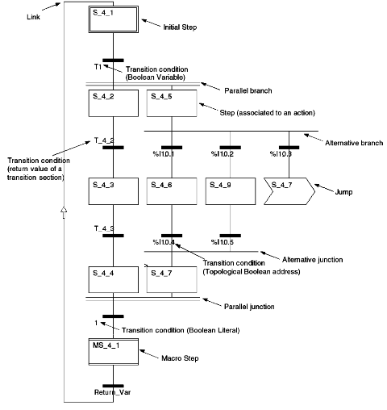
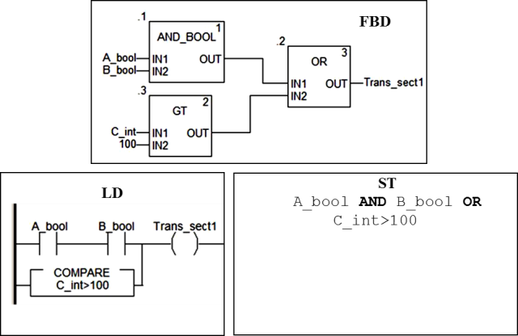
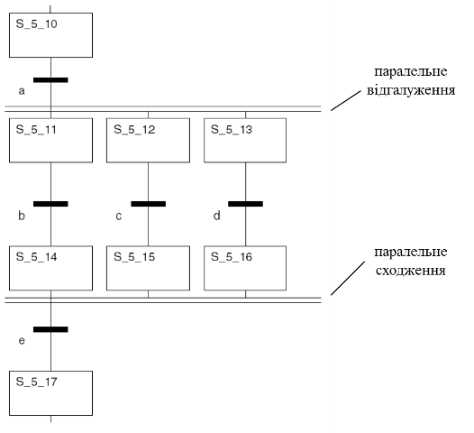
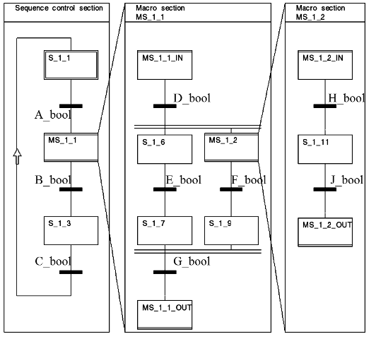
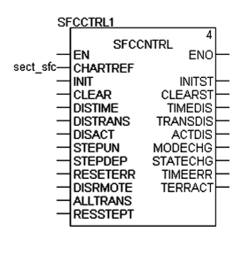
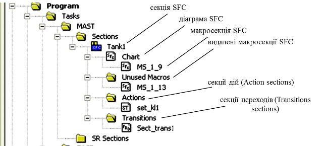
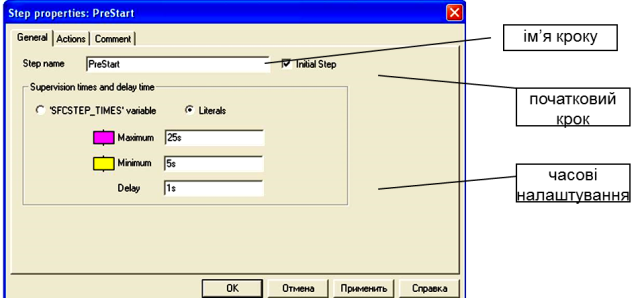

[<- До підрозділу](README.md)

# Програмування на мові SFC в UnityPRO/Control Expert

## 1. Основи SFC

Мова *SFC* (*Sequential Function Charts*) – графічна мова програмування, в якій поведінка системи задається:

- послідовністю кроків, де описуються необхідні дії;

- переходів між кроками, які задаються умовами. 

SFC також відома під назвою *Grafcet*, та крім стандарту IEC 61131 описана також в IEC 848. Основою для розробки SFC стали *мережі Петрі* – математичний апарат для моделювання поведінки динамічних систем. 

Секція на SFC може бути створена тільки в основній Задачі *MAST*. Зовнішній вигляд та елементи SFC показані на рис.3.40. Основними елементами SFC є *кроки* (*Step*), *переходи* (*Transition*) та *зв’язки* (*Link*).  Всі елементи (кроки, переходи) організовують *мережу* *SFC* (подібно мережі Петрі). У одній секції SFC можуть бути декілька мереж. 

Кроки поєднуються між собою тільки через переходи, які в свою чергу теж не можуть безпосередньо з’єднуватися між собою. Таким чином зв’язки можуть бути тільки між кроками та переходами. У момент активності кроку він володіє *маркером* (*Token*). Коли крок активний (тобто володіє маркером) виконуються *дії* (*Action*) що описані в кроці. Перехід пропускає через себе маркер тоді, коли справджується *умова переходу* (*Transition* *Condition*). 

 

Рис.3.40. Приклад фрагменту програми на мові SFC 

Мережі SFC можуть мати лінійну структуру або містити альтернативні та паралельні гілки, які організовані відповідними типами розходження та сходження (рис.3.40).

Мережа SFC в UNITY PRO може мати як *одинарний маркер* (*Single-Token*) так і *множинний маркер* (*Multi-Token*). При множинному маркері в одній гілці мережі можуть бути активними одночасно декілька кроків. При одинарному маркері декілька кроків можуть бути активні тільки в паралельних гілках. Множинний маркер активується у властивостях проекту 

*Project* *Settings* *->* *Program* *->* *SFC* *->* *Allow* *Multiple* *token*

Надалі ми будемо розглядати SFC тільки в контексті одинарного маркеру, з правилами множинного маркеру можна ознайомитись в довідниковій системі UNITY PRO.   

Входи та виходи кроків і переходів повинні бути задіяні. Таким чином кінця у мережі SFC немає, оскільки останній (нижній) крок в мережі повинен бути з’єднаний з одним із попередніх (не обов’язково на початковий), організовуючи замкнене кільце для маркеру. У програмі з рис.3.40 крок *MS_4_1* через перехід *Return_Var* замикає мережу SFC на початковий крок *S_4_1*. 

## 2. Кроки та дії

Кроки призначені для організації дій (табл.3.12). Крім звичайного кроку, у мові SFC доступні також початкові кроки (ініціалізації), макрокроки та спеціальні кроки для макросекцій (вхідні та вихідні). Детальніше про макрокроки та макросекції описано нижче. 

При ініціалізації контролера, маркер в мережі SFC переходить на *початковий крок* (*Initial* *Step*). Якщо початкових кроків в секції декілька (дозволяється тільки при множинному маркері), то отримують маркер всі початкові кроки.   

Кроки мають унікальні імена, які даються по замовченню, однак можуть бути змінені розробником програми. Для кожного кроку можуть бути вказані часові настройки та проводитися контроль за роботою кроку. 

Кожному кроку можуть належати одна або декілька дій (до 20-ти на крок). Вони виконуються послідовно згідно порядку в списку дій (за винятком специфікаторів *P1*, *P0*). Дозволяється створювати "пусті" кроки, тобто без дій, наприклад в якості функцій очікування. 

 *Таблиця 3.12*

​                             Типи кроків.                   

| Тип                              | Зображення             | Опис                                                         |
| -------------------------------- | ---------------------- | ------------------------------------------------------------ |
| Звичайний  крок                  |  | Крок стає активним (отримує маркер) тоді, коли  попередній крок стає неактивним і спрацювала умова переходу, що знаходиться  вище. |
| Початковий  крок (Initial  Step) |  | Кожна мережа SFC містить як мінімум один початковий крок, з якого  починається програма при ініціалізації.   При множинному маркері дозволяється декілька кроків ініціалізації. |
| Макрокрок (Macro  Step)          |  | Призначений  для виклику макросекції SFC, для ієрархічного  структурування програми (вкладені мережі SFC) |
| Вхідний крок  (Input Step)       |  | Кожна  макросекція починаються з вхідного кроку              |
| Вихідний крок  (Output  Step)    |  | Кожна  макросекція закінчуються вихідним кроком              |

Кожна дія може бути представлена булевою змінною (*змінна дії*, *Action* *Variable*), або секцією (*секція дії*, *Action* *Section*) написаною на одній з 4-х мов LD, FBD, ST, IL. Тобто дія може змінювати булеву змінну, або вмикати/вимикати програмні секції. Що саме повинна робити дія визначається *специфікатором* (*Qualifier*). Список можливих специфікаторів вказаний у таблиці 3.13. 

*Таблиця 3.13* Типи специфікаторів.

| Специфікатор | Призначення                       | Опис                                                         |
| ------------ | --------------------------------- | ------------------------------------------------------------ |
| N/None       | без фіксації                      | дія активна тільки при активності кроку, крок  активний – дія *TRUE*,  крок неактивний - *FALSE* |
| S            | Встановити з фіксацією            | дія  встановлюється в *TRUE* і залишається такою, навіть при деактивації  кроку; дія повинна скинутися в *FALSE* специфікатором *R* в іншому кроці цієї ж секції *SFC* |
| R            | Скинути                           | дія встановлюється в *FALSE* і залишається такою, навіть при деактивації  кроку; |
| P            | Імпульс по передньому фронту      | при активації кроку дія стає активною  (встановлюється в *TRUE*) на один цикл Задачі MAST |
| P1           | Імпульс по передньому фронту      | аналогічно  специфікатору *P*, однак дія виконується завжди першою незалежно від розміщення в списку  дій |
| P0           | Імпульс по задньому фронту        | при деактивації  кроку дія стає активною (встановлюється в *TRUE*) на один цикл Задачі MAST |
| L            | Обмеження по часу                 | дія  активується (встановлюється в *TRUE*) одночасно з активацією кроку, деактивується  (скидається в *FALSE*) при закінченні встановленого часу (тривалість задається) або при деактивації  кроку |
| D            | Затримка на включення             | подібно до  роботи таймеру *TON*; при активації кроку запускається внутрішній таймер (тривалість  задається), після спрацюванні якого дія активується (встановлюється в *TRUE*); дія деактивується  разом з деактивацією кроку |
| DS           | Затримка на включення з фіксацією | подібно до дії визначеної специфікатором *D*, однак при деактивації кроку  дія залишається активною; дія повинна скинутися в *FALSE* специфікатором *R* в іншому кроці тієї ж секції SFC |

Змінні дії можуть бути тільки булевими, що є суттєвим обмеженням. Для виконання дій зі змінними іншого типу а також виклику FFB, організації циклів і таке інше, в якості дій використовуються секції дії. Секція дії може бути написана на одній із 4-х мов (IL, ST, LD або FBD) і, в свою чергу, може включати умови та дії такої самої складності, як і у звичайних секціях написаних на цій мові. Однак секції дій належать SFC-секції, в якій вони створюються і не можуть бути використані в іншій частині програми. При використанні в кроці дії секції, ім’я дії вказує на ім’я секції. Слід зазначити, що кількість секцій дій для одного кроку обмежується тільки загальною кількістю дій в цьому кроці, тобто до 20. У секціях дій не можна використовувати діагностичні FFB. 

Для того, щоб не відображати довгі зв’язки між кроками, їх можна замінити *стрибками* (*Jump*). У самому елементі "Стрибок" вказується той крок, куди необхідно перейти, коли маркер попадає на цей елемент (рис.3.41).

 

Рис.3.41. Стрибки.

## 3. Переходи 

Переходи забезпечують передачу маркера від кроку до кроку, якщо умова переходу спрацьовує. Умова переходу може бути описана булевою змінною (також коміркою пам’яті, константою) або секцією переходу. Перехід відбувається, якщо умова переходу повертає значення *TRUE*.

Якщо в якості переходів необхідно використати числове значення або логічний вираз, використовуються *секції переходів* (*Transition* *Section*). Секції переходів можуть бути написані на одній з 4-х мов (IL, ST, LD або FBD). Для мов IL та ST, в секції переходу записується тільки умова переходу. Для FBD вихід останнього блоку в ланцюгу обов’язково повинен бути булевого типу і вказувати на назву секції переходу. У мові LD ланцюг повинен закінчуватися котушкою, що прив’язана до назви секції переходу. Наприклад, якщо секція переходу має назву *Trans_sect1*, то для мов FBD, LD та ST ці секції будуть виглядіти так як показано на рис.3.42. 

Рис.3.42. Приклад секції переходу SFC з назвою "*Trans_sect1*" на мовах FBD, LD та ST 

## 4. Відгалуження 

Мережі SFC можуть містити відгалуження, що забезпечує виконання потрібних кроків в залежності від умов. Відгалуження організовують *гілки* (*Branch*). 

*Альтернативні відгалуження* (*Alternative* *Branch*) забезпечують передачу маркера в ту гілку програми, умова переходу якого спрацює раніше. Альтернативне відгалуження позначається одинарною лінією, з відповідною кількістю гілок (від 2-х). У програмі на рис.3.43 при активності кроку *S_5_10* контролер буде перевіряти зліва-направо спрацювання умов *a*, *b* та *c*. У залежності від того, яка з цих змінних раніше стане рівною *TRUE*, маркер буде переданий у відповідну гілку (яка починається з цієї умови). Так, наприклад, якщо раніше всіх стане рівною *TRUE* змінна *с*, маркер буде переданий до кроку *S_5_13*, тобто піде по 3-ій зліва гілці. Якщо одночасно спрацьовують декілька умов, то маркер буде переданий самій лівій гілці серед них.

Альтернативні гілки закінчуються *альтернативним сходженням* (*Alternative* *junction*). Альтернативне сходження організує перехід з альтернативної гілки в крок основної гілки. У прикладі з рис.3.43 альтернативне сходження закінчується кроком *S_5_16*.  

 

Рис.3.43. Приклад мережі SFC з альтернативними гілками.

Паралельні гілки організовують одночасне виконання кроків в цих гілках (дозволяється до 32 гілок). *Паралельні відгалуження* (*Parallel* *Branch*) забезпечують розділення маркеру між паралельними гілками при спрацюванні єдиної умови переходу. Наприклад, в програмі на рис.3.44 при активності кроку *S_5_10*, якщо змінна *a=TRUE*, маркер "поділиться" на 3 частини і буде переданий 3-м крокам*:* *S_5_11*, *S_5_12* та *S_5_13*. Після цього програма продовжить виконуватись одночасно в 3-х паралельних гілках. Після активності останніх кроків в усіх паралельних гілках (в прикладі *S_5_14,* *S_5_15* та *S_5_16*) та спрацюванні умови переходу (в прикладі умова *e=TRUE*), маркери об’єднаються в один, який буде переданий кроку основної гілки (у прикладі *S_5_17*). Ця операція проводиться з використанням *паралельного сходження* (*Parallel*  *junction*). 

 

Рис.3.44. Приклад мережі SFC з паралельними гілками.

## 5.  Макрокроки 

Для програм з великою кількістю кроків зручно створювати ієрархічні SFC мережі, де на верхньому рівні ієрархії знаходяться *макрокроки* (*Macro* *Step*), які вміщують окрему мережу SFC, створену в окремій *макросекції* SFC (*MacroSection*). Макросекції, в свою чергу, крім звичайних кроків можуть вміщувати макрокроки. Максимальна глибина такої вкладеності макрокроків – 8 рівнів. 

Кожна макросекція починається з *вхідного кроку* (*Input* *Step*) та закінчується *вихідним кроком* (*Output* *Step*). При отриманні маркеру макрокроком, цей маркер отримує вхідний крок його макросекції. Коли активується вихідний крок макросекції, перевіряється умова переходу що йде за макрокроком, якому належить дана макросекція. 

На рис.3.45 показаний приклад трирівневої ієрархічної мережі SFC. При активації макрокроку *MS_1_1* активується вхідний крок *MS_1_1_IN* макросекції, що прив’язана до даного макрокроку. Вхідний крок деактивується при спрацюванні умови *D_bool*, після чого маркер поділиться між 2-ма паралельними гілками. Слід звернути увагу, що макрокрок *MS_1_1* не втрачає маркер, адже той знаходиться в межах його макросекції. Попадаючи в макрокрок *MS_1_2*, маркер опиняється у вхідному кроці *MS_1_2_IN* його макросекції. Після спрацювання умов *H_bool* та *J_bool* маркер опиняється у вихідному кроці *MS_1_2_OUT*. Після спрацювання умови *F_bool*, крок *MS_1_2_OUT* віддає маркер кроку *S_1_9*. Одночасно з вихідним кроком і макрокрок *MS_1_2* теж втрачає маркер. Вихідний крок *MS_1_1_OUT* отримає маркер при активності кроків *S_1_7* та *S_1_9* і при спрацюванні умов *G_bool*, а віддасть при спрацюванні умови *B_bool*. Разом з вихідним кроком маркер втрачає і макрокрок *MS_1_1*. 

 

Рис.3.45. Приклад ієрархічної мережі SFC.

## 6.  Часові налаштування та контроль за виконанням кроків

Кожному кроку можуть бути присвоєні мінімальний контрольний час, максимальний контрольний час та час затримки.

При необхідності контролю за часом виконання кроку, використовують *мінімальний контрольний* *час* (*Minimum Supervision Time*) та *максимальний контрольний час* (*Maximum Supervision Time*). Якщо час виконання кроку менше ніж заданий в мінімальному контрольному часі – в змінній кроку сигналізується помилка. Так саме сигналізується помилка, коли час виконання кроку більше ніж заданий в максимальному контрольному часі. Якщо настройка контрольного часу = 0, то контроль не проводиться .

 За допомогою *часу затримки* (*Delay* *Time*) можна вказати мінімальний час виконання кроку. Тобто, якщо умова переходу після даного кроку спрацювала, але час активності кроку менше ніж час затримки, то крок не віддасть маркер. За допомогою часу затримки можна організовувати кроки з затримкою. 

Часові налаштування повинні задовольняти умовам (3.3)  

*Delay time < minimum supervision time < maximum supervision time*           (3.3)

Задати часові налаштування можна двома способами: 

1)  безпосередньо вводячи часові константи в форматі часу, наприклад *t#5s*;

2)  використовуючи структурну змінну DDT типу *SFCSTEP_TIMES*, яка попередньо створюється для кожного кроку. 

Змінна типу *SFCSTEP_TIMES*, до якої прив’язується часові настройки кроку, може бути доступна як для читання, так і для запису, і являється глобальною, тобто доступною в будь-якій секції проекту. Структура типу *SFCSTEP_TIMES* містить 3 поля типу *TIME*: *delay* (час затримки),  *min* (мінімальний контрольний час), *max* (максимальний контрольний час).

При створенні кроку SFC в змінних проекту автоматично створюється *змінна кроку* DDT типу *SFCSTEP_STATE* з іменем цього кроку. Ця змінна призначена для контролю за кроком і доступна тільки для читання. Поля змінної описані в таблиці 3.14.

*Таблиця 3.14*. Поля змінної кроку типу SFCSTEP_STATE.

| поле    | Тип  | Опис                                                         |
| ------- | ---- | ------------------------------------------------------------ |
| t       | TIME | час  активності кроку; при деактивації кроку даний час запам’ятовується, а при  повторній активації обнуляється |
| x       | BOOL | активність  кроку: *TRUE* - крок активний (має маркер), *FALSE*-крок  неактивний |
| tminErr | BOOL | помилка мінімального контрольного часу; якщо час  виконання кроку менше ніж заданий в мінімальному контрольному часі *tminErr=TRUE*, інакше *FALSE*; автоматично скидається в *FALSE* при  повторній активації кроку |
| tmaxErr | BOOL | помилка максимального контрольного часу; якщо час виконання  кроку більше ніж заданий в максимальному контрольному часі *tmaxErr* *=TRUE*, інакше *FALSE*; автоматично  скидається в *FALSE* при повторній активації кроку |

Спрацювання *tminErr* та *tmaxErr* можуть сигналізуватися в діагностичному буфері ПЛК (див. параграф 4.5.3). Для цього необхідно активувати опцію *Operator* *Control* та виставити настройки області тривог (*Area*) у властивостях секції SFC, а також активувати опцію програмної діагностики (*Tools->Project* *settings->General->PLC* *Diagnostics->Application* *Diagnostics*) 

## 7.  Управління виконанням мережі SFC

У зв’язку з нештатними ситуаціями на виробництві, маркер може "зависнути" на певному кроці. Крім того, в багатьох випадках необхідно втрутитися в роботу програми SFC, щоб вручну зробити перехід на потрібний крок.  

Для управління роботою секцій SFC в UNITY PRO передбачені наступні можливості:

1)  використання налагоджувальних засобів SFC редактору в онлайн режимі (див. параграф 4.5.3);

2)  програмне управління з використанням спеціальних FFB сімейства *SFC* *Management* із бібліотеки *System* *Library*. 

Ці засоби дозволяють при необхідності змінювати стандартну послідовність проходження маркеру, ініціалізувати мережі SFC секцій (переходити на крок ініціалізації), заморожувати мережу (відключати умови переходу), управляти бітами контролю часу (*tminErr, tmaxErr*). 

Можливості програмного управління через спеціальні FFB такі саме як і можливості налагоджувальних засобів редактору SFC в онлайн режимі. Останні розглянуті в параграфі 4.5.3, тут зупинимося на функціях та функціональних блоках сімейства *SFC* *Management*. 

Функції *CLEARCHART* (деактивація кроків), *FREEZECHART* (замороження кроків), *INITCHART* (ініціалізація мереж SFC) а також функціональний блок *SFCCNTRL* (управління секцією SFC) управляють мережами SFC вказаної в аргументі *CHARTREF* секції (рис.3.46).  

Функція *CLEARCHART* – деактивує всі активні кроки мереж вказаної секції SFC, коли на вході *CLEAR_I*=*TRUE*. 

Функція *FREEZECHART* – при *FREEZE_I=TRUE* переводить всі мережі вказаної секції SFC в режим деактивації переходів (*режим замороження SFC*). У режимі замороження маркери не будуть передаватися на інші кроки, навіть при спрацюванні умов переходу. 

Функція *INITCHART* – по передньому фронту управляючого входу (при переході *Init_I* з *FALSE*->*TRUE*) деактивує всі кроки мереж вказаної секції SFC, а по задньому (при переході *Init_I* з *TRUE*->*FALSE*) активує початкові кроки мереж. 

Рис.3.46. Функції управління виконанням SFC.

Функціональний блок *SFCCTRL* призначений для розширених функцій управління виконанням секцій SFC (див. рис.3.47). Як і в попередніх функціях, на вхід *CHARTREF* подається змінна типу *SFCCHART_STATE*, яка відповідає за виконання секції SFC. Усі інші входи (булевого типу) призначені для формування команд управління мережами, а виходи – для контролю за станом мереж секції SFC. 

Вхід *INIT* має таке саме призначення як функція *INITCHART*, вхід *CLEAR* – таке саме як *CLEARCHART*, *DISTRANS* – таке саме як *FREEZECHART*.

 Якщо вхід *DISTIME=TRUE*, то відключається контроль часу виконання кроків. При *DISACT=TRUE* деактивуються всі дії кроків. По передньому фронту значення змінної на вході *STEPUN* (перехід з *FALSE->TRUE*) маркер передається на наступний крок, незалежно від виконання умови переходу. 

При *DISTRANS=TRUE* включається режим замороження, при якому, після спрацювання умов переходу, маркери не будуть передаватися на наступні кроки. У цьому режимі можливе управління переходами тільки з використанням спеціальних команд. Для цього можна використати вхід *STEPUN*, що описаний вище. Можна тимчасово активувати перехід, подавши на вхід *STEPDEP* логічну одиницю (перехід з *FALSE->TRUE*). 

При *RESETERR=TRUE* скидаються біти контролю помилок *tminErr* та *tmaxErr*. Ця команда потрібна для підтвердження виникнення помилки контролю часу. При *RESSTEPT=TRUE* відключається перевірка часу виконання кроків.  

При *DISRMOTE=TRUE*, блокується можливість використання налагоджувальних засобів редактору SFC в онлайн режимі.

При *ALLTRANS=TRUE* перераховуються усі секції умов переходу. Цей вхід використовується тільки для відображення в анімаційних засобах редактору SFC стану переходів і не впливає на логіку виконання мережі SFC.      

Рис.3.47. Виклик функціонального блоку типу *SFCCNTRL*.

Процедура *RESETSTEP* деактивує вказаний крок (забирає маркер), а *SETSTEP* – активує вказаний крок (передає йому маркер). Ці процедури можна використовувати тільки при множинному маркері. У якості фактичного параметру у процедуру передається змінна кроку типу *SFCSTEP_STATE*. 

## 8.  Редактор SFC

SFC секція окрім діаграми, що включає мережі SFC, включає в себе секції дій, секції переходів, всі включені та видалені макросекції (рис.3.48). 

Рис.3.48. Структура секції SFC.

Редактор *діаграми* *SFC* (*Chart*) ділиться на комірки (200 рядків на 32 колонки), в яких розміщуються кроки, переходи та стрибки. Зв’язки, відгалуження та сходження не потребують окремих комірок. У кожній секції SFC може бути максимум 1024 кроки, включаючи всі кроки макросекцій. 

Для створення мереж SFC використовується палітра інструментів (рис.3.49). Серед всіх типів кроків в палітрі відсутні: 

-     початковий крок, так як він робиться зі звичайного кроку через його основні властивості; 

-     вхідні та вихідні кроки макросекцій, так як вони створюються автоматично з макросекцією.  

 

Рис.3.49. Палітра інструментів SFC. 

Доступ до властивостей кроку проводиться через його контекстне меню. У основних властивостях (вкладка *General*, рис.3.50) вказується ім’я кроку, часові налаштування кроку, та чи буде даний крок початковим (*Initial* *Step*). Часові налаштування вказуються часовими літералами (*Literals*) або через змінну (*'SFCSTEP_TIMES'* *variable*). 

 

Рис.3.50. Вікно загальних властивостей кроку SFC. 

Дії для кожного кроку налаштовуються у вкладці *Actions*, яка доступна у вікні властивостей кроку (рис.3.51). Тип дії (змінна чи секція) вибирається відповідним перемикачем *Variable/Section*, під ним вказується назва змінної або секції. Кожна дія супроводжується вибраним специфікатором (*Qualifier*). Для дій з специфікаторами *L, D, DS* вказуються часові літерали або змінні для визначення затримок.  

Рис.3.51. Вікно налаштування дій для кроку SFC. 

Діаграму SFC можна відобразити в розширеному вигляді "*View->Expanded* *Display*", де з правого боку від кроків вказується список дій. Для відгалужень і сходжень через вікно властивостей налаштовується кількість гілок і номер точки входу (для відгалужень) або виходу (для сходжень) основної гілки. 

Можливості редактору в онлайн режимі розглянуті в параграфі 4.5.3.

Теоретичне заняття розробив [Прізвище або нік розробника Імя](https://github.com). 
