[<- До підрозділу](README.md)	[PLC MachineStruxure](../ecostruxuremachineexpert.md)	[Коментувати](#feedback)

# Імітаційна модель об'єкта в Machine Expert з використанням Filter_PT1: практична частина 

**Тривалість**: 1 год 

**Мета:** Навчитися використовувати блоки передавальних функцій для імітації об'єкту.

## Лабораторна установка.

**Необхідне апаратне забезпечення.** Для проведення лабораторних робіт необхідно мати комп’ютер з наступною мінімальною апаратною конфігурацією:

- CPU Intel/AMD 2 ГГц / RAM 16 ГБ / Диск 20 ГБ (вільних)  

**Необхідне програмне забезпечення.** 

1. EcoStruxure Machine Expert

**Загальна постановка задачі**. 

У даній роботі функціональний блок `Filter_PT1` використовується в якості імітаційної моделі теплообмінника, яку, наприклад можна використати для перевірки роботи регулятора, поставивши його в контур регулювання замість реального об'єкту (`simHeater` на рис.1)  

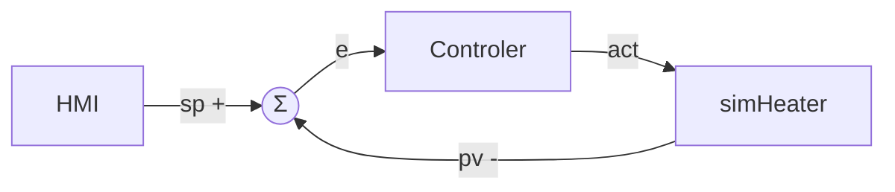

рис.1. Приклад використання PT1 як імітаційної моделі процесу: `simHeater` - імітаційна модель теплообмінника, `Controller` - функціональний блок регулятора 

Цілі роботи: 

1) Створити POU для імітації об'єкта аперіодичною ланкою 1-го порядку.
1) Перевірити роботу POU з використанням утиліти Trace.

## Послідовність виконання роботи

- [ ] Ознайомтеся з описом `Filter_PT1` в [Обробка сигналів в контурі регулювання з Toolbox в Machine Expert: теоретичні відомості](teormachexpert.md)

### 1. Добавлення бібліотеки

- [ ] Створіть новий проєкт з PLC M241
- [ ] У Library Manager добавте бібліотеку `Toolbox` від Schneider Electric  

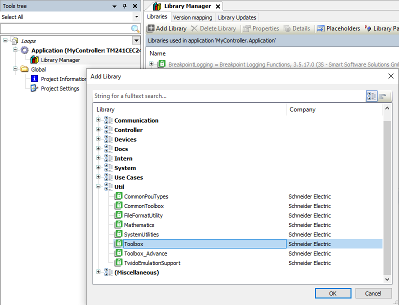

рис.2. Добавлення бібліотеки

- [ ] Використовуючи вкладки перегляду контенту `Documentation`, `Inputs/Outputs` та `Graphiacal` ознайомтеся з описом змісту `Filter_PT1` 

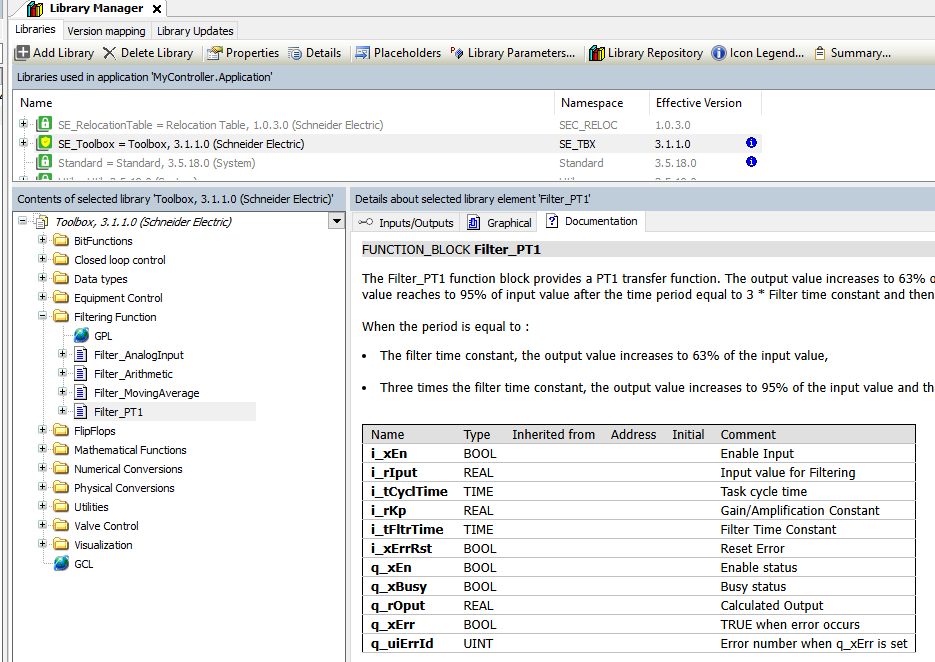

рис.3. Ознайомлення з документацією бібліотеки

### 2. Створення імітаційної моделі 1-го порядку

- [ ] В GVL добавте змінні:

```pascal
	rTT100 : REAL; //значення температури 
	rVR100 : REAL; //вихід на регулюючий клапан
```

- [ ] Виставте періодичність виклику задачі MAST рівною 50 мс
- [ ] Створіть POU типу Program з назвою  `simHeater` на будь з якій мов, окрім SFC
- [ ] Отримайте від викладача номер варіанту і виберіть з таблиці 1 коефіцієнт підсилення (Kp) та зміщення відповідно до варіанту

  

| Варіант | коефіцієнт підсилення (Kp) | Зміщення |
| ------- | -------------------------- | -------- |
| 1       | 0.1                        | 5        |
| 2       | 0.2                        | 10       |
| 3       | 0.3                        | 20       |
| 4       | 0.4                        | 30       |
| 5       | 0.5                        | 40       |
| 6       | 0.6                        | 50       |
| 7       | 0.7                        | 10       |
| 8       | 0.8                        | 20       |
| 9       | 0.9                        | 30       |
| 10      | 1.0                        | 40       |
| 11      | 1.1                        | 50       |
| 12      | 1.2                        | 10       |
| 13      | 1.3                        | 20       |
| 14      | 1.4                        | 30       |
| 15      | 1.5                        | 40       |
| 16      | 1.6                        | 50       |
| 17      | 1.7                        | 10       |
| 18      | 1.8                        | 20       |
| 19      | 1.9                        | 30       |
| 20      | 2.0                        | 0        |

- [ ] Добавте POU в задачу MAST. Напишіть там програму, аналогічну як показано на рис.4. Зміщення в даному випадку рівне 20, коефіцієнт підсилення 0.5.

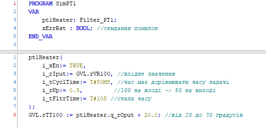

рис.4. Програма реалізації 

- [ ]  Запустіть програму в режимі імітації ПЛК. Перевірте працездатність програми з використанням засобів Watch

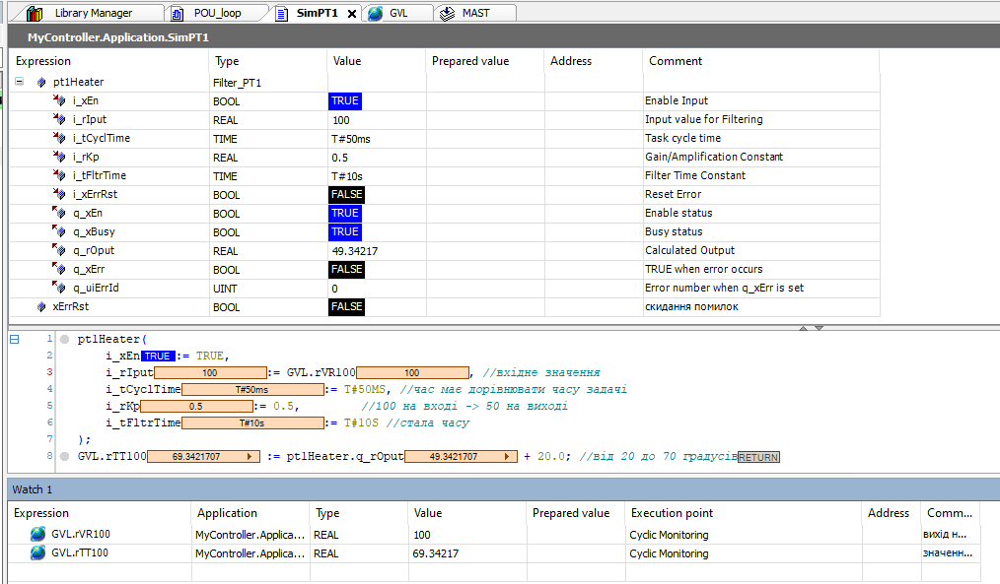

рис.5. Перевірка працездатності програми

### 3. Перевірка з використанням Trace

- [ ] Ознайомтеся з можливостями інструменту Trace з відповідного розділу [Налагодження програм користувача в CODESYS: теоретичні відомості](../debug/teorcodesys.md)

- [ ] Добавте Trace з іменем `Trace1` і прив'яжіть до задачі Mast
- [ ] Добавте дві змінні в Trace та означте, щоб запис відбувався кожен 20 цикл задачі `Mast`

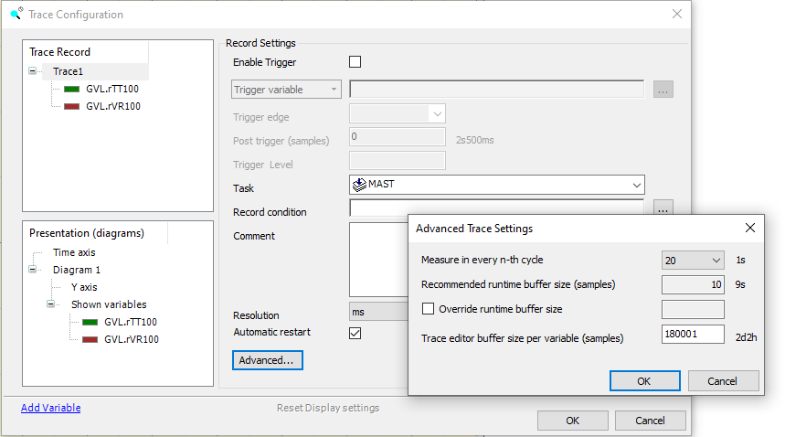

рис.6

- [ ] Налаштуйте вісь часу на 1 хвилину

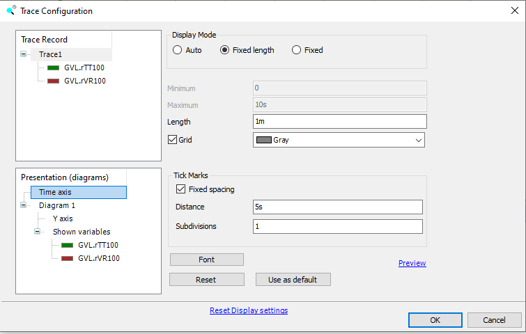

рис.7. 

- [ ] Налаштуйте вісь Y на потрібний відповідно до вашого діапазону масштаб

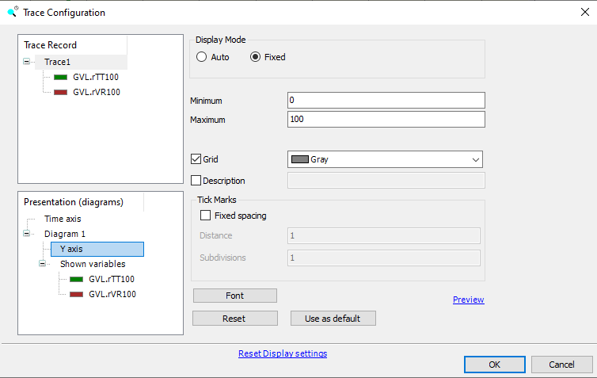

рис.8. 

- [ ] Використовуючи команду `Download Trace` завантажте Trace в емулятор ПЛК.
- [ ] Використовуючи Watch змініть значення `rVR100` та зніміть криву розгону. Для зупинки автопрокрутки можна скористатися пунктом-опцією контекстного меню  `Autoscroll`. Зробіть копію екрану для звіту.

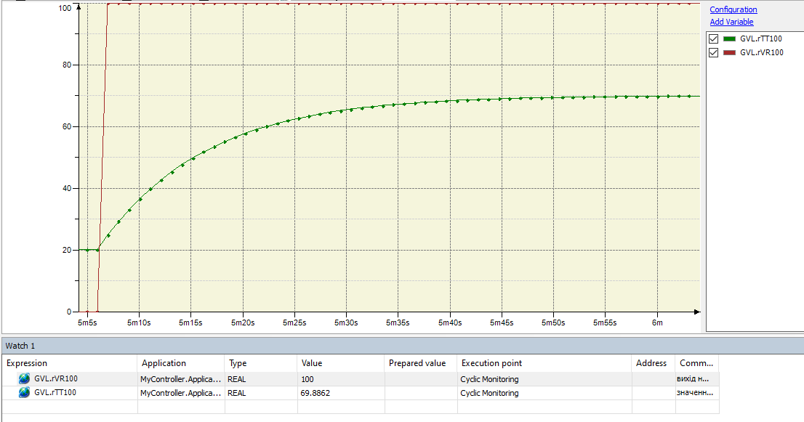

рис.9.

- [ ] Визначте розрахункові показники  `63%` та `95%` від вхідного значення з урахуванням зміщення. Порівняйте фактичний і розрахунковий час на кривій розгону. Зробіть записи розрахункових даних а також результати порівняння для звіту. 


рис.10.

### 3. Створення та перевірка імітаційної моделі 2-го порядку

- [ ] У GVL добавте дві змінні для 2-го імітаційного об'єкту

```pascal
	rTT101 : REAL; //значення температури 2 
	rVR101 : REAL;//вихід на регулюючий клапан 2
```

- [ ] Створіть POU з назвою `simHeater2` який буде імітувати об'єкт 2-го порядку і прив'яжіть його до задачі MAST (рис.11).

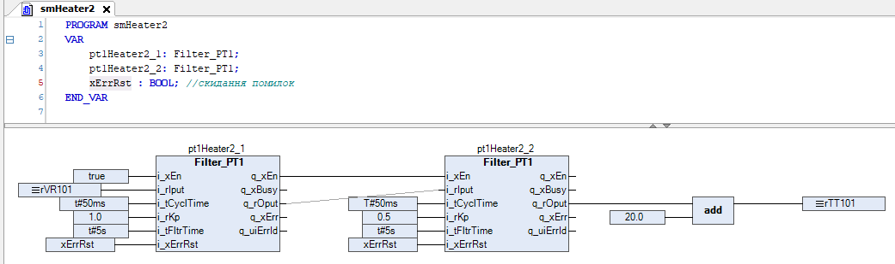

рис.11.

- [ ] Звантажте в емулятор ПЛК, створіть новий Trace і використовуючи його та Watch перевірте роботу. Зробіть копію екрану для звіту.

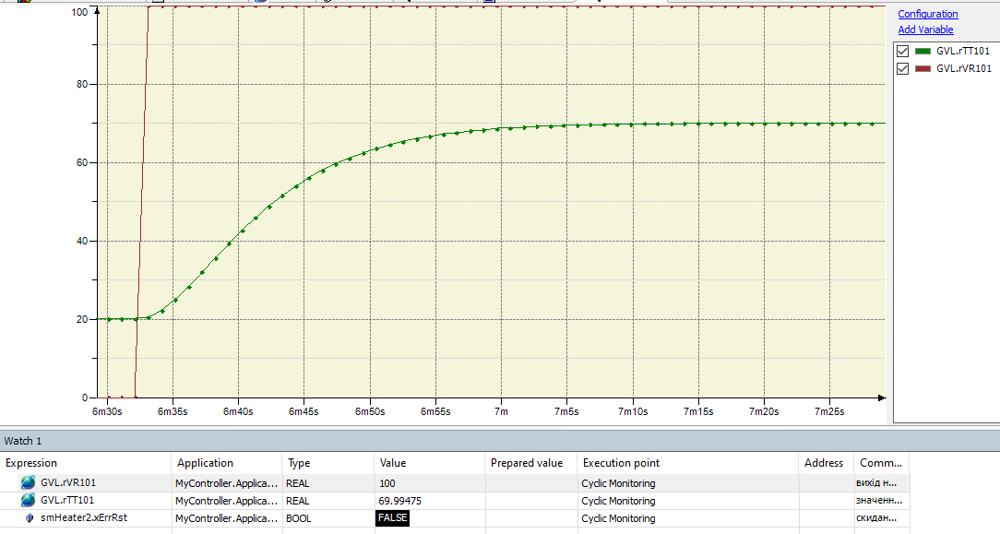

- [ ] Збережіть проєкт, він потрібен буде для наступних практичних робіт.

### 4. Підготовка та відправлення звіту

-  На Google диску створіть папку з назвою `MyLabs`, якщо вона ще не створена, а в ній створіть папку `LabPT1`. Посилання на папку `MyLabs` необхідно переслати викладачу для звітності.
-  У межах папки `LabPT1` розмістіть файл проєкту.
-  У межах папки `LabPT1` створіть Google документ з копіями екрану та іншими матеріалами, якщо такі потребуються.

## Автори


Практичне заняття розробив  [Олександр Пупена](https://github.com/pupenasan). 

## Feedback

Якщо Ви хочете залишити коментар у Вас є наступні варіанти:

- [Обговорення у WhatsApp](https://chat.whatsapp.com/BRbPAQrE1s7BwCLtNtMoqN)
- [Обговорення в Телеграм](https://t.me/+GA2smCKs5QU1MWMy)
- [Група у Фейсбуці](https://www.facebook.com/groups/asu.in.ua)

Про проект і можливість допомогти проекту написано [тут](https://asu-in-ua.github.io/atpv/) 