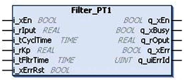
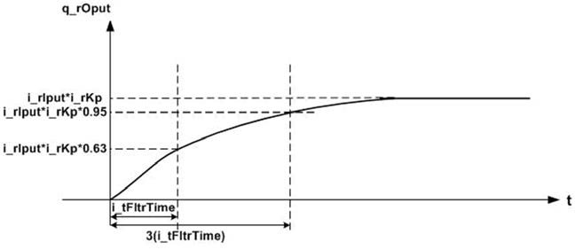
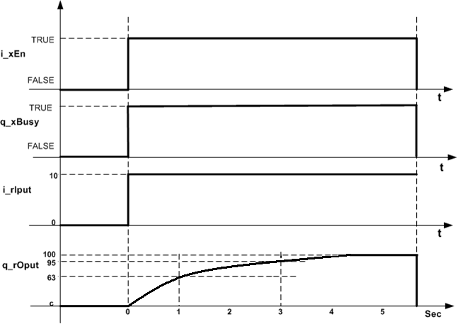
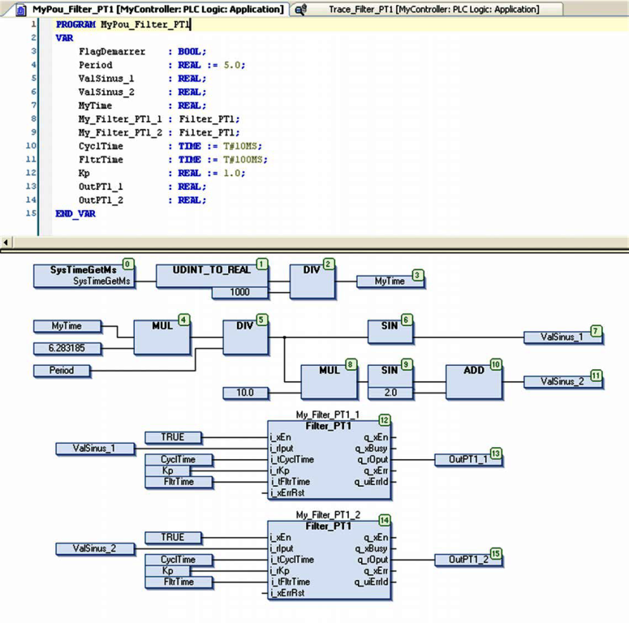
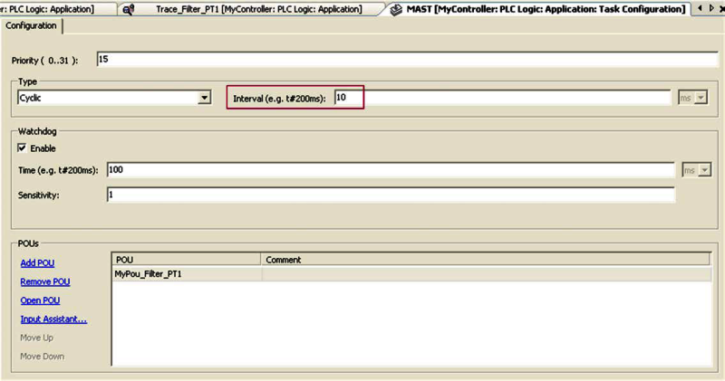
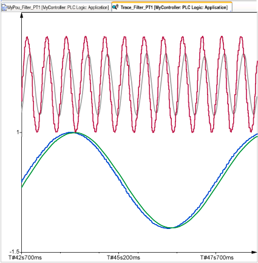
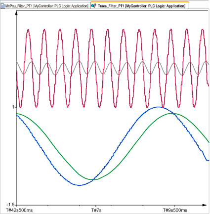

[<- До підрозділу](README.md)	[PLC MachineStruxure](../ecostruxuremachineexpert.md)  [Коментувати](#feedback)

# Обробка сигналів в контурі регулювання з Toolbox в Machine Expert: теоретичні відомості

## Filtering Functions

Глобальний список параметрів (GPL) містить глобальні константи, які використовуються функціональними блоками фільтрації цієї бібліотеки. Параметри можуть редагуватися окремо для кожного застосування, у якому використовується бібліотека. Зміни необхідно виконувати в Library Manager проєкту, у якому ця бібліотека підключена.

| Змінна           | Тип даних | Значення за замовчуванням | Діапазон | Опис                                                         |
| ---------------- | --------- | ------------------------- | -------- | ------------------------------------------------------------ |
| Gc_uiMaxAvgeSmpl | UINT      | 100                       | 100…1000 | Максимальна кількість вибірок, що враховуються входом `uiSmplCnt` |

### Filter_AnalogInput: Checking Analog Input Varaibility

### Filter_Arithmetic: Giving Arithmetic Mean Value

### Filter_MovingAverage: Giving Moving Mean Value

### Filter_PT1: Providing PT1 Transfer Function

Функціональний блок `Filter_PT1` реалізує передавальну функцію типу `PT1`. Вихідне значення зростає до `63%` від вхідного значення протягом часу, що дорівнює сталiй часу фільтра. Вихідне значення досягає 95% від вхідного значення протягом часу, що дорівнює `3 × сталiй часу фільтра`, після чого поступово наближається до 100% вхідного значення. 

На рисунку показано профіль зміни виходу функціонального блока `Filter_PT1`.

Якщо період дорівнює:

- сталiй часу фільтра, вихідне значення зростає до 63% від вхідного значення;
- трьом сталим часу фільтра, вихідне значення зростає до 95% від вхідного значення, а потім поступово досягає 100% від вхідного значення.

Якщо вхідне значення `i_rIput` дорівнює `10`, а стала часу фільтрації `i_tFltrTime` становить одну секунду при коефіцієнті підсилення фільтра `10`, то вихідне значення `q_rOput` через одну секунду дорівнюватиме `63`. Через три секунди, тобто через `3 × сталу часу фільтра`, вихідне значення дорівнюватиме `95`, після чого поступово досягне `100`. На рисунку показано нормальну поведінку.

Це рівняння показує передавальну функцію:
$$
G(s) = Kp · 1 / (1 + Ts·s)
$$
де:

| Позначення | Опис                                                         |
| ---------- | ------------------------------------------------------------ |
| Kp         | коефіцієнт підсилення (передавальний коефіцієнт) функції PT1 |
| Ts         | стала часу фільтра функції PT1                               |
| G(s)       | передавальна функція                                         |

Наведене вище рівняння є записом у перетворенні Лапласа для аперіодичної ланки першого порядку, тобто фільтра низьких частот першого порядку. У дискретних системах керування цю функцію часто називають імпульсною передавальною функцією (функція `PT1`).

функціональний блок потребує періодичного виклику, а сам період з яким він викликається задається у вхідному параемтрі  `i_tCyclTime`.

Некоректні параметри, такі як `i_tCyclTime = 0` або `i_tFltrTime < i_tCyclTime`, призводять до виявлення помилки та формування відповідного ідентифікатора помилки. Під час стану виявленої помилки вихід встановлюється в нуль. Стан помилки може бути скинутий лише по фронту наростання входу `i_xErrRst`.

Як показано на діаграмі виходів функціонального блока, сигнал `q_xBusy` має значення TRUE, коли функціональний блок активований і відсутня виявлена помилка. 

У наступній таблиці описано вихідні контакти функціонального блока `Filter_PT1`.

| Вхід        | Тип даних | Опис                                                         |
| ----------- | --------- | ------------------------------------------------------------ |
| i_xEn       | BOOL      | TRUE: увімкнено FALSE: вимкнено                         |
| i_rIput     | REAL      | Вхідне значення для обробленняДіапазон: ±3.4e+38             |
| i_tCyclTime | TIME      | Час циклу задачі Діапазон: 0…4294967295 мс `i_tCyclTime < 0` призводить до виявлення помилки |
| i_rKp       | REAL      | Коефіцієнт підсилення (Kp) функції PT1Діапазон: ±3.4e+38     |
| i_tFltrTime | TIME      | Стала часу фільтра Діапазон: 0…4294967295 мс Заводське налаштування: `t#0ms`  `i_tFltrTime < i_tCyclTime` призводить до виявлення помилки |
| i_xErrRst   | BOOL      | TRUE: скидання виявленої помилки (по фронту наростання)(Необов’язковий вхід) |

У таблиці нижче описано вихідні контакти функціонального блока `Filter_PT1`:

| Вихід     | Тип даних | Опис                                                         |
| --------- | --------- | ------------------------------------------------------------ |
| q_xEn     | BOOL      | TRUE: увімкненоFALSE: вимкнено                               |
| q_xBusy   | BOOL      | TRUE: активний і відсутня виявлена помилкаFALSE: вимкнено або виявлена помилка |
| q_rOput   | REAL      | Вихідне значенняДіапазон: ±3.4e+38                           |
| q_xErr    | BOOL      | TRUE: виявлена помилкаFALSE: помилки не виявлено             |
| q_uiErrId | UINT      | Номер виявленої помилки, якщо встановлено вихід помилки:0: помилки не виявлено1: некоректний параметр i_tCyclTime < 02: некоректний параметр i_tFltrTime < i_tCyclTime |

Програма формує синусоїдальний сигнал із заданим періодом (5 секунд / 0,2 Гц) та синусоїдальний сигнал із частотою, більшою на одну декаду (0,5 секунди / 2 Гц).

Вхід i_tCyclTime функціонального блока `Filter_PT1` повинен мати точно таке саме значення, як і період виконання POU у задачі MAST, у цьому випадку 10 мілісекунд (див. область, виділену червоною рамкою).

Результат роботи попереднього POU, коли вхід `i_tFltrTime` дорівнює 100 мс:

Синій — синусоїдальний сигнал `i_rIput` із частотою 0,5 Гц (функціональний блок `My_Filter_PT1_1`)
Зелений — відфільтрований сигнал `q_rOput` (функціональний блок `My_Filter_PT1_1`)
Червоний — синусоїдальний сигнал `i_rIput` із частотою 5 Гц (функціональний блок `My_Filter_PT1_2`)
Сірий — відфільтрований сигнал `q_rOput` (функціональний блок `My_Filter_PT1_2`)

Результат роботи попереднього POU, коли вхід `i_tFltrTime` дорівнює 500 мс:

Синій — синусоїдальний сигнал `i_rIput` із частотою 0,5 Гц (функціональний блок `My_Filter_PT1_1`)
Зелений — відфільтрований сигнал `q_rOput` (функціональний блок `My_Filter_PT1_1`)
Червоний — синусоїдальний сигнал `i_rIput` із частотою 5 Гц (функціональний блок `My_Filter_PT1_2`)
Сірий — відфільтрований сигнал `q_rOput` (функціональний блок `My_Filter_PT1_2`)

[Імітаційна модель об'єкта в Machine Expert з використанням Filter_PT1: практична частина ](labmachexpert.md)

## Джерела

1. [EcoStruxure Machine Expert - Toolbox, Library Guide ](https://www.se.com/us/en/download/document/EIO0000000096/)

## Автори

Теоретичне заняття розробив [Олександр Пупена](https://github.com/pupenasan). 

## Feedback

Якщо Ви хочете залишити коментар у Вас є наступні варіанти:

- [Обговорення у WhatsApp](https://chat.whatsapp.com/BRbPAQrE1s7BwCLtNtMoqN)
- [Обговорення в Телеграм](https://t.me/+GA2smCKs5QU1MWMy)
- [Група у Фейсбуці](https://www.facebook.com/groups/asu.in.ua)

Про проект і можливість допомогти проекту написано [тут](https://asu-in-ua.github.io/atpv/)
