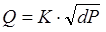

[<- До підрозділу](README.md)		[Коментувати](#feedback)

# Обробка сигналів в контурі регулювання UnityPRO/Control Expert

## Обробка сигналів в структурі контурів регулювання 

На рис.6.1 показана узагальнена функціональна структура контурів регулювання з використанням ПЛК. 

Значення регульованої величини, яке поступає з датчиків на програмний регулятор, попередньо повинен бути оброблений. Це зв’язано з тим, що всі реалізації регуляторів сімейства "Controller" оперують зі значеннями типу REAL, а оцифроване значення з аналогових вхідних модулів має тип INT (в діапазоні 0-10000). Крім того вимірювальне значення може бути зашумлене та потребувати додаткової обробки. Для обробки вхідних даних контурів управління можуть бути використані блоки сімейств "Conditioning", "Measurement" та "Mathematics", які розглядаються нижче. На будь якому з етапів перетворення та алгоритмічної обробки даних можуть знадобитися блоки додаткової обробки з сімейства "Conditioning", які також будуть розглянуті нижче. 

## Гістерезис HYST (сімейство Measurement)  

Функціональний блок HYST реалізує гістерезис. Приклад виклику блоку та діаграма його роботи показані на рис.6.17 

 

Таблиця 6.12. Параметри функціонального блока HYST.

| Вхідні  параметри      |                              |                                     |
| ---------------------- | ---------------------------- | ----------------------------------- |
| X                      | INT, DINT, UINT, UDINT, REAL | вхідне значення                     |
| HIGH                   | INT, DINT, UINT, UDINT, REAL | нижня межа                          |
| LOW                    | INT, DINT, UINT, UDINT, REAL | верхня межа                         |
| **Вихідні  параметри** |                              |                                     |
| IND                    | BOOL                         | індикатор досяжності  верхньої межі |

## Індикатор меж INDLIM (сімейство Measurement) 

Функціональний блок INDLIM призначений для відслідковування переходу вхідного значення через визначені межі. На рис.6.18 показана діаграма роботи блоку, а на рис.6.19 – приклад виклику.

Таблиця 6.13. Параметри функціонального блока INDLIM.

| Вхідні параметри      |                               |                                        |
| --------------------- | ----------------------------- | -------------------------------------- |
| X                     | INT, DINT, UINT,  UDINT, REAL | Вхідна  змінна                         |
| MX_HIGH               | INT, DINT, UINT,  UDINT, REAL | Максимальна  верхня межа               |
| MX_LOW                | INT, DINT, UINT,  UDINT, REAL | Максимальна  нижня межа                |
| MN_LOW                | INT, DINT, UINT,  UDINT, REAL | Мінімальна  нижня межа                 |
| MN_HIGH               | INT, DINT, UINT,  UDINT, REAL | Мінімальна  верхня межа                |
| **Вихідні параметри** |                               |                                        |
| MX_IND                | BOOL                          | Відображення  досягнення верхньої межі |
| MN_IND                | BOOL                          | Відображення  досягнення нижньої межі  |

## Кусочно-лінійна інтерполяція LOOKUP_TABLE1 (сімейство Measurement) 

Процедура LOOKUP_TABLE1 використовується для кусочно-лінійної інтерполяції. У залежності від входу X та заданої вузловими точками залежності XiYi (2 значення на кожну точку) формується вихід Y. Кількість вузлових точок варіюється до 15, кожна задається парою значень XiYij: перша для X (непарні номера j), друга для Y(парні номера j). Таким чином процедура може мати до 30+1 входів. 

Аналітична залежність X від Y та заданих вузлових точок показана в (6.25)

        (6.25)

Приклад програми з використанням LOOKUP_TABLE1 наведений в параграфі 6.8.2 

 

Таблиця 6.14. Параметри процедури LOOKUP_TABLE1.

| Вхідні  параметри      |      |                             |
| ---------------------- | ---- | --------------------------- |
| X                      | REAL | Вхідна змінна               |
| XiYi1                  | REAL | координата  X1.             |
| XiYi2                  | REAL | координата  Y1.             |
| XiYi(n-1)              | REAL | координата  X n/2; n=max 30 |
| XiYi(n)                | REAL | координата  Y n/2; n=max 30 |
| **Вихідні  параметри** |      |                             |
| Y                      | REAL | Вихідна змінна              |
| QXHI                   | BOOL | Індикація  X > Xm           |
| QXLO                   | BOOL | Індикація  X < X1           |

## Зона нечутливості DEAD_ZONE (сімейство Measurement) 

Функція DEAD_ZONE забезпечує послаблення сигналу з коефіцієнтом GAIN в межах зони нечутливості, заданої діпазоном [-DZ;DZ] (рис.6.22).

 (6.26)

 

Таблиця 6.15. Параметри функції DEAD_ZONE.

| Вхідні  параметри      |      |                                         |
| ---------------------- | ---- | --------------------------------------- |
| X                      | REAL | Вхідна змінна                           |
| DZ                     | REAL | Половинне значення зони  нечутливості   |
| GAIN                   | REAL | Коефіцієнт послаблення  значення в зоні |
| **Вихідні  параметри** |      |                                         |
| Y                      | REAL | Вихідна змінна                          |

## Запис змінної SAH (сімейство Measurement)

Функціональний блок SAH по передньому фронті CLK запам’ятовує на виході OUT значення входу IN. При першому виклику блоку OUT=PV. 

Таблиця 6.16. Параметри блоку SAH.

| Вхідні  параметри      |      |                         |
| ---------------------- | ---- | ----------------------- |
| IN                     | ANY  | Вхідне значення         |
| CLK                    | BOOL | Вхід тактового сигналу  |
| PV                     | ANY  | Задане значення уставки |
| **Вихідні  параметри** |      |                         |
| OUT                    | ANY  | Вихідне значення        |

## Фільтр ковзного середнього AVGMV (сімейство Measurement)

Функціональний блок AVGMV реалізовує алгоритм розрахунку фільтру ковзного середнього по формулі (6.27). 

  або                     (6.27)

де N – кількість значень в буфері (ширина вікна), X – вхідне не фільтроване значення, Y – середнє вихідне (фільтроване) значення, Yold - значення виходу на попередньому виклику.  

 

Таблиця 6.17. Параметри блоку AVGMV.

| Вхідні  параметри      |      |                                                              |
| ---------------------- | ---- | ------------------------------------------------------------ |
| MAN                    | BOOL | 0 = Автоматичний режим;    1 = Ручний режим                  |
| X                      | REAL | Вхід                                                         |
| N                      | INT  | Ширина вікна (кількість значень в буфері; максимум 50)       |
| YMAN                   | REAL | Ручне значення                                               |
| **Вихідні  параметри** |      |                                                              |
| Y                      | REAL | Середнє значення                                             |
| RDY                    | BOOL | 1 = буфер заповнений (готовий);  0 = буфер не заповнений (не готовий) |

При ініціалізації функціонального блоку буфер скидується. З кожним викликом буфер наповнюється новими значеннями. Поки кількість значень в буфері не буде рівним N, буфер не буде готовий  (RDY=FALSE) і фільтр працює з неповним буфером. Коли буфер заповниться (RDY=TRUE) блок буде видавати коректне відфільтроване значення.   

## Фільтр ковзного середнього з коректором AVGMV_K (сімейство Measurement) 

Функціональний блок AVGMV_K реалізовує алгоритм розрахунку фільтру ковзного середнього з коректором К по формулі (6.28).

               (6.28)

де X – вхідне не фільтроване значення, Y – середнє вихідне (фільтроване) значення, Yold - значення виходу на попередньому виклику, K - коректор. 

Таблиця 6.18. Параметри блоку AVGMV_K.

| Вхідні  параметри      |      |                                            |
| ---------------------- | ---- | ------------------------------------------ |
| MAN                    | BOOL | 0 = Автоматичний режим;   1 = Ручний режим |
| X                      | REAL | Вхід                                       |
| K                      | INT  | Коректор (макс 10000)                      |
| YMAN                   | REAL | Ручне значення                             |
| **Вихідні  параметри** |      |                                            |
| Y                      | REAL | Середнє значення                           |

## Розрахунок витрати по перепаду тиску K_SQRT (сімейство Mathematics) та MFLOW (сімейство Conditioning) 

Об’ємна витрата може бути розрахована за наступними залежностями:

         (6.29)

де Q-об’ємна витрата (м3/год), d – діаметр отвору (мм), p -густина (кг/м3), (p1-p2) – перепад тиску на звужуючому пристрої (кгс/м2), Е – коефіцієнт розширення (для рідин=1), a- коефіцієнт витрати який розраховується за формулою

                 (6.30)

Коефіцієнти розраховуються (підбираються) в залежності від середовища та типу звужуючого пристрою. Таким чином формулу для розрахунку можна записати:

            (6.31)

де dP=P1-P2, К – ваговий коефіцієнт. Ваговий коефіцієнт К можна розрахувати або підібрати при відомих витратах на етапі налагодження. 

У UNITY PRO для реалізації розрахункової формули 6.31 можна скористатися функцією SQRT (вилучення квадратного кореню), однак для цієї цілі зручніше використовувати спеціалізовану функцію K_SQRT або функціональний блок MFLOW. 

Функція K_SQRT знаходиться в бібліотеці Control Library сімейства Mathematics. Приклад використання функції показаний на рис.6.26. Функція повертає: 

          (6.32)

Таким чином, крім вагового коефіцієнта К, функція враховує нижню межу вхідного значення CUTOFF. Тобто, якщо перепад тиску на вході є від’ємним або менше нижньої межі, то функція повертає 0, в той час як SQRT повернув би -1.#NAN, а це в свою чергу спрощує використання цієї функції для даної задачі.

Густина газів залежить від температури та тиску. Для врахування цих параметрів, треба їх ввести в розрахункову формулу для масової витрати:

                      (6.33) 

Функціональний блок MFLOW сімейства Conditioning, призначений для розрахунку масової витрати газів з урахуванням їх температури та тиску згідно формули (6.34):

                (6.34)

 де PA-абсолютний тиск газу, TA – абсолютна температура в градусах Кельвіна.

Приклад використання функціонального блоку MFLOW показаний на рис.6.27. Вхід IN, вихід OUT та коефіцієнт К мають той же зміст, що і в попередньому варіанті. Параметри роботи блоку задаються на вході PARA. 

Вхід PRES – це тиск, який може задаватися як в абсолютних одиницях так і відносно атмосферного. У випадку відносного тиску (PARA.pr_pa=FALSE), абсолютний тиск розраховується за формулою 

    PA=PRES+pu                          (6.35)

де pu задається в тій же структурі PARA.

Вхід TEMP, це температура, яка може задаватися в градусах Цельсія (PARA.tc_tf=FALSE) або Фаренгейта (PARA.tc_tf=TRUE). У блоці розраховується абсолютна температура TA в градусах Кельвіна.

Корекція по тиску активується параметром PARA.en_pres=TRUE, по температурі - PARA.en_temp=TRUE. Якщо PARA.en_sqrt=FALSE то добуток буде розраховуватись без квадратного кореня.

## Зважене множення/ділення MULDIV_W (сімейство Mathematics)

Функція MULDIV_W розраховує вихідне значення за формулою (6.36):

                        (6.36)

Таблиця 6.19. Параметри блоку MULDIV_W

| Вхідні  параметри      |                |                      |
| ---------------------- | -------------- | -------------------- |
| IN1                    | REAL           | вхід1                |
| IN2                    | REAL           | вхід2                |
| IN3                    | REAL           | вхід3                |
| PARA                   | Para_MULDIV_W] | Параметри            |
| **Вихідні  параметри** |                |                      |
| OUT                    | REAL           | Результат розрахунку |

Таблиця 6.20. Опис структурного типу Para_MULDIV_W

| Поле | Тип  | Пояснення  |
| ---- | ---- | ---------- |
| k    | REAL | коефіцієнт |
| c1   | REAL | коефіцієнт |
| c2   | REAL | коефіцієнт |
| c3   | REAL | коефіцієнт |
| c4   | REAL | коефіцієнт |

## Зважена сума SUM_W (сімейство Mathematics).

Функція SUM_W розраховує вихідне значення за формулою (6.36):

               (6.37)

Таблиця 6.21. Параметри блоку SUM_W

| Вхідні  параметри      |            |                      |
| ---------------------- | ---------- | -------------------- |
| IN1                    | REAL       | вхід1                |
| IN2                    | REAL       | вхід2                |
| IN3                    | REAL       | вхід3                |
| PARA                   | Para_SUM_W | Параметри            |
| **Вихідні  параметри** |            |                      |
| OUT                    | REAL       | Результат розрахунку |

Таблиця 6.22. Опис структурного типу Para_SUM_W

| Поле | Тип  | Пояснення  |
| ---- | ---- | ---------- |
| k1   | REAL | коефіцієнт |
| k2   | REAL | коефіцієнт |
| k3   | REAL | коефіцієнт |
| c1   | REAL | коефіцієнт |

## SCALING (сімейство *Conditioning*) 

Даний функціональний блок призначений для масштабування числових величин. Він реалізовує лінійну залежність вихідної величини (*OUT*) від вхідної (*IN*) за формулою: 

           (6.41)

 Графічно залежність виходу *OUT* від входу *IN* показана на рис.6.44. Мінімальні та максимальні вхідні (*in_min*, *in_max*) та вихідні (*out_min*, *out_max*) величини, відносно яких проводиться масштабування, задаються у вхідному параметрі *PARA* типу *Para_SCALING*. Тип даних *Para_SCALING* включає 4-ри поля типу *REAL* для завдання вхідних та вихідних меж, а також одне поле "*clip*" типу *BOOL* для визначення необхідності обмеження вихідної величини (див. рис.6.44).  

Рис.6.44. Залежність масштабованого вихідного значення (*OUT*) від вхідного (*IN*) при обмеженні на вихідний сигнал (зліва, *Clip*=1) та без обмеження (праворуч, *Clip*=0) для блока *SCALING*

Функціонування блоку продемонструємо на прикладі масштабування вхідного аналогового сигналу від датчика температури з діапазоном *0-150ºС*, який підключений до *%IW0.1.1*. Результат масштабування необхідно записати в змінну *T1_R.* 

По замовченню, при опитуванні, сигнали від універсальних аналогових вхідних модулів перетворюються в діапазон *0-10000*. Тобто вхідні межі будуть 0-10000, а вихідні 0-150. Для параметрів масштабування створюємо змінну *T_PARA* типу *Para_SCALING*, властивості *VALUE* для полів заповнюємо відповідно до рис.6.45 (зверху). Присвоїмо поле *clip:=TRUE* для обмеження по мінімуму та максимуму вихідної (масштабованої величини). 

Вигляд програми користувача на FBD показаний на рис.6.45 (внизу). Створюється екземпляр функціонального блоку *SCALE_T1* типу *SCALING*. Попередньо *%IW0.1.1* перетворюється в тип *REAL*, відповідно до типу параметру *IN* функціонального блоку *SCALING*. Вихідний параметр *STATUS* потрібен для контролю за помилками, в прикладі не використовується.      

Рис.6.45. Приклад використання функціонального блока SCALING для масштабування аналогового вхідного сигналу: зверху – опис структурної змінної T_PARA типу Para_SCALING, знизу – приклад програми на FBD

Аналогічним чином можна проводити масштабування вихідної величини.

## Ланка транспортного запізнювання *DTIME* (сімейство *Conditioning*)

 Функціональний блок *DTIME* призначений для реалізації ланки чистого (транспортного) запізнювання між входом *IN* та виходом *OUT*. Час запізнювання визначається значенням T_DELAY*(*рис.6.46*)*

 

Рис.6.46. Діаграма роботи DTIME

Рис.6.47. Приклад виклику блоку DTIME

*Таблиця* *6.35*  Параметри блоку DTIME

|           |        | Вхідні  параметри                                            |
| --------- | ------ | ------------------------------------------------------------ |
| *IN*      | *REAL* | Вхідне числове значення                                      |
| *T_DELAY* | *TIME* | Час запізнення                                               |
| *TR_I*    | *REAL* | Вхід ініціалізації                                           |
| *TR_S*    | *BOOL* | Команда ініціалізації                                        |
|           |        | **Вихідні  параметри**                                       |
| *OUT*     | *REAL* | Вихідне значення                                             |
| *BUFFER*  | ANY    | Пам'ять для збереження  значень (завжди повинен бути підключений до змінної) |
| *STATUS*  | *WORD* | Слово стану                                                  |

Для розміщення даних транспортного запізнення між входом і виходом використовується змінна, яка підключається до виходу *BUFFER*. Ця змінна має тип *ANY*, враховуючи що розмір буфер може бути різним. Однак в більшості випадків розмір буфера буде більше ніж *REAL*, оскільки кількість значень в буфері буде більше 1-го. Тому в якості змінної рекомендується використовувати масив типу *REAL*. Наприклад, масив *ARRAY* *[0..10]* *of* *REAL* може вміщувати до 11 елементів. 

Максимальна величина затримки розраховується за формулою: 

                   (6.42)

де n - кількість значень, які можуть бути збережені в *BUFFER*, T_PERIOD - інтервал виклику функціонального блоку

## Блок інтегрування *INTEGRATOR* (сімейство *Conditioning*) 

Функціональний блок *INTEGRATOR* призначений для реалізації числового інтегрування за формулою:

              (6.43)

де змінні з індексами *old* – значення на попередньому виклику, *dt* – інтервал між викликами блоку. 

*Даний блок повинен обов’язково викликатися на першому циклі ПЛК!* 

Рис.6.48. Приклад виклику блоку INTEGRATOR

*Таблиця* *6.36* Параметри блоку *INTEGRATOR*

| Вхідні  параметри  |        |                                                |
| ------------------ | ------ | ---------------------------------------------- |
| *IN*               | *REAL* | Вхідна змінна                                  |
| *GAIN*             | *REAL* | Коефіцієнт інтегрування                        |
| *OUT_MIN*          | *REAL* | Нижня межа                                     |
| *OUT_MAX*          | *REAL* | Верхня межа                                    |
| *TR_I*             | *REAL* | Вхід ініціалізації  (слідкування)              |
| *TR_S*             | *BOOL* | 1 = режим слідкування   0 = автоматичний режим |
| Вихідні  параметри |        |                                                |
| *OUT*              | *REAL* | Вихід                                          |
| *QMIN*             | *BOOL* | 1 = значення виходу досягнуло нижньої межі     |
| *QMAX*             | *BOOL* | 1 = значення виходу досягнуло верхньої межі    |

 

## Аперіодична ланка *LAG_FILTER* (сімейство *Conditioning*)

Функціональний блок *LAG_FILTER* призначений для реалізації аперіодичної ланки (1-го порядку), де вихід розраховується за формулою:

         (6.44)

де змінні з індексами *old* – значення на попередньому виклику, *dt* – інтервал між викликами блоку, інші параметри наведені в таблиці 6.37.

*Даний блок повинен обов’язково викликатися на першому циклі ПЛК.* 

Рис.6.49. Приклад виклику блоку *LAG_FILTER* та діаграма його роботи

*Таблиця* *6.37* Параметри блоку LAG_FILTER

|        |        | Вхідні  параметри                              |
| ------ | ------ | ---------------------------------------------- |
| *IN*   | *REAL* | Вхідне значення                                |
| *GAIN* | *REAL* | Коефіцієнт підсилення                          |
| *LAG*  | *TIME* | Стала часу                                     |
| *TR_I* | *REAL* | Вхід ініціалізації  (слідкування)              |
| *TR_S* | *BOOL* | 1 = режим слідкування   0 = автоматичний режим |
|        |        | **Вихідні  параметри**                         |
| *OUT*  | *REAL* | Вихід                                          |

## Контрольні запитання

1.   Які апаратні засоби є вбудовані в TSX Premium для реалізації контурів регулювання?

2.   З яких основних частин складається прикладна програма ПЛК для реалізації контурів регулювання? Поясніть призначення кожної з цих частин. 

3.   Блоки FFB яких бібліотек використовуються для реалізації контурів регулювання в UNITY PRO? Які з них використовуються тільки для сумісності з проектами PL7 та Concept?

4.   Блоки FFB якої бібліотеки рекомендується для реалізації контурів регулювання в UNITY PRO? Чи обов’язково користуватися для задач регулювання блоками саме цієї бібліотеки?

5.   Поясніть призначення та особливості функціонування режиму слідкування (*Tracking*) FFB-блоків бібліотеки *ControllLIB*. Який пріоритет має цей режим по відношенню до режиму ручний/автомат?

6.   Поясніть призначення та особливості функціонування ручного та автоматичного режимів FFB-блоків бібліотеки *ControllLIB*. Який пріоритет має цей режим по відношенню до режиму слідкування? 

7.   Яким чином контролюється виконання FFB бібліотеки *ControllLIB*? Які типові помилки можуть виникнути при обробці блоку?

8.   Чи обов’язково викликати блоки регуляторів *ControllLIB* строго періодично?

9.   Розкажіть про призначення FFB блоків сімейства *Controller* бібліотеки *ControllLIB*. 

10.   Розкажіть про призначення та функціонування *SAMPLETM*. Чи обов’язкове їх використання тільки з блоками регуляторів?

11.   Використовуючи функціональну схему поясніть основні принципи роботи блоку регулятору *PI_B*.

12.   Яким чином блок *PI_B* переводиться в П- та ПІ-режим регулювання? Поясніть відмінності роботи цих режимів.

13.   Поясніть призначення полів структури *Para_PI_B* .

14.   Використовуючи функціональну схему поясніть основні принципи роботи блоку регулятору *PIDFF*.

15.   Поясніть призначення полів структури *Para_PIDFF* .

16.   Чим відрізняється вихід *OUTD* від *OUT* в регуляторах блоків PI_B та PIDFF? Навіщо кожен з них використовується?

17.   Розкажіть про призначення входу *RCPY*. Як активувати режим використання *RCPY*?

18.   Розкажіть про функціонування блоків *PI_B/PIDFF* в режимі абсолютного розрахунку.

19.   Розкажіть про функціонування блоків *PI_B/PIDFF* в інкрементальному режимі роботи.

20.   Як Ви розумієте термін безударність переходу? Між якими режимами і яким чином реалізована безударність переходу в блоках *PI_B* та *PIDFF*?

21.   Розкажіть про призначення та функціонування *STEP2*.

22.   Розкажіть про призначення та функціонування *STEP3*.

23.   Розкажіть про призначення та функціонування *HYST*.

24.   Розкажіть про призначення та функціонування *INDLIM*.

25.   Розкажіть про призначення та функціонування процедури *LOOKUP_TABLE*.

26.   Розкажіть про призначення та функціонування *DEAD_ZONE*.

27.   Розкажіть про призначення та функціонування *SAH*.

28.   Розкажіть про призначення та функціонування *AVGMV* та *AVGMV_K*. 

29.   Розкажіть про призначення та функціонування *K_SQRT*.

30.   Розкажіть про призначення та функціонування *MFLOV*.

31.   Розкажіть про призначення та функціонування *MULDIV_W* та *SUM_W*.

32.   Розкажіть про призначення та функціонування *SERVO*. 

33.   Яким чином блоки управління серводвигунами можуть визначати положення регулюючого органу?

34.   Як контролюється блоком *SERVO* досягнення регулюючим органом крайніх положень? Як при цьому веде себе блок?

35.   Які особливості обробки серводвигунів в автоматичному та ручному режимах? Розкажіть про призначення входу *SEN*.

36.   Розкажіть про роботу блоку управління серводвигуном в режимі активації *RCPY*? Як при цьому правильно з’єднувати *SERVO* та регулятор? Що необхідно передбачити в програмі в ручному режимі?

37.   Розкажіть про роботу блоку управління серводвигуном в режимі без *RCPY*? Як при цьому правильно з’єднувати *SERVO* та регулятор? Що необхідно передбачити в програмі в ручному режимі?

38.   Навіщо задаються в блоці управління серводвигунами параметри *t_motor* та  *t_mini*?

39.   Розкажіть про призначення та функціонування *PWM1*. 

40.   Розкажіть про призначення та функціонування *MS*. У яких випадках необхідно використовувати цей функціональний блок?

41.   Розкажіть про призначення та функціонування *SP_SEL*. 

42.   Розкажіть про призначення та функціонування *RAMP*. 

43.   Розкажіть про призначення та функціонування *RATIO*. 

44.   Розкажіть про призначення та функціонування *SCALING*. 

45.   Розкажіть про призначення та функціонування *DTIME*. 

46.   Розкажіть про призначення та функціонування *INTEGRATOR*. 

47.   Розкажіть про призначення та функціонування *LAG_FILTER*. 

48.   Розкажіть про призначення та правила використання процедур цілочисельного регулювання. У якому режимі повинна виконуватися задача, в якій ці процедури виконуються?

49.   Розкажіть про призначення та функціонування *PID_INT*. 

50.   Розкажіть про призначення та функціонування *SERVO_INT*. 

51.   Розкажіть про призначення та функціонування *PWM_INT*. 

## Автори

Теоретичне заняття розробив [Олександр Пупена](https://github.com/pupenasan). 

## Feedback

Якщо Ви хочете залишити коментар у Вас є наступні варіанти:

- [Обговорення у WhatsApp](https://chat.whatsapp.com/BRbPAQrE1s7BwCLtNtMoqN)
- [Обговорення в Телеграм](https://t.me/+GA2smCKs5QU1MWMy)
- [Група у Фейсбуці](https://www.facebook.com/groups/asu.in.ua)

Про проект і можливість допомогти проекту написано [тут](https://asu-in-ua.github.io/atpv/)
