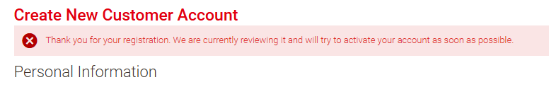
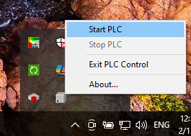
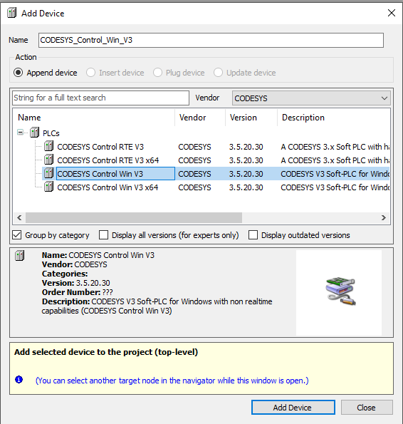
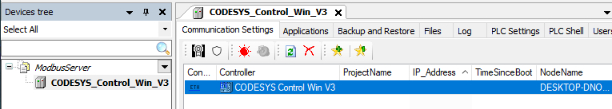
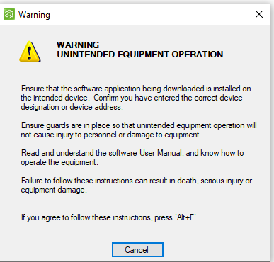
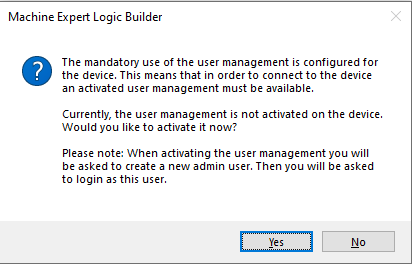
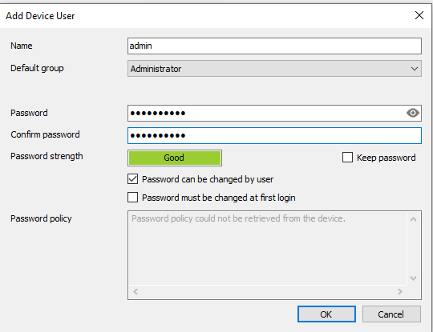
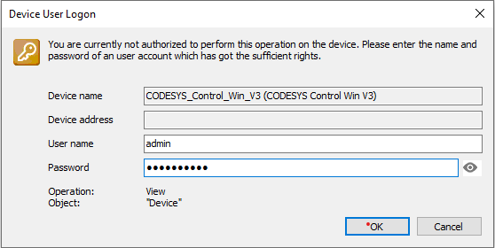
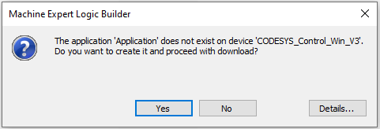

[<- До підрозділу](README.md)	[CODESYS (загальні теми)](../codesys.md) 	[PLC MachineStruxure M241, M251, M262 та інші](../ecostruxuremachineexpert.md) 	[Коментувати](#feedback)

# Встановлення та робота з CODESYS Control Win: практичне заняття 

## Реєстрація на CODESYS Store International

**Увага! Реєстрація проводиться вручну, підтвердження реєстрації може тривати кілька днів!**

- [ ] Зареєструйтеся на якщо Ви ще не зареєстровані, це безкоштовно, для цього:
  - зайдіть на  [Customer Login | CODESYS Store International](https://store.codesys.com/en/customer/account/login/)
  - Виберіть [Create Private Customer Account](https://store.codesys.com/en/customer/account/create/)
  - введіть необхідну інформацію, після чого вийде повідомлення про очікування на перевірку реєстрації. 

\

рис.1. 

Пройде певний час перш ніж вашу реєстрацію буде перевірено і підтеверджено.

## Завантаження, встановлення та запуск CODESYS Control Win

- [ ] Зайдіть на сторінку для завантаження  https://store.codesys.com/en/codesys-control-win-sl-1.html, 
- [ ] натисніть Download, натисніть Accept та завантажте CODESYS Control Win SL  https://store.codesys.com/en/customer/account/login/

- [ ] Рзпакуйте архів і інсталюйте CODESYS Control Win 3 (не 64 бітну версію)

- [ ] Після встановлення запустіть CODESYS Control Win з панелі статусу (`Start PLC`)

Після команди запуску, з'явиться вікно з повідомленням про роботу застосунку на системному рівні. Робота CODESYS Control Win без ліцензії триває 30 хв, після чого програмний ПЛК сам зупинить свою роботу. Зупинка CODESYS Control Win робиться також через панель статусу (`Stop PLC`)

рис.2. 

## Створення проєкту і тест підключення 

- [ ] Запустіть CODESYS або Machine Expert.
- [ ] Створіть проєкт 
- [ ] У апаратній конфігурації добавте пристрій:
  - виробника (Vendor) - CODESYS
  - назва - CODESYS Control Win V3 

рис.3.

- [ ] Скомпілюйте проєкт
- [ ] Відкрийте в редакторі добавлений пристрій (рис.4)
- [ ] Знайдіть програмний ПЛК, та подвійним кліком виберіть його - він має виділитися жирним шрифтом

\

рис.4.

- [ ] Перейдіть в онлайн на пристрій CODESYS Control Win V3 
- [ ] Після вінка попередження натисніть `ALT+F`

рис.5. 

У наступному вікні (рис.6) середовище повідомляє, що для підключення до контролера обов’язково має бути активована система керування користувачами (User Management). Наразі вона на пристрої не увімкнена, тому середовище пропонує її активувати.Якщо натиснути Yes, буде створено адміністратора, після чого потрібно буде виконати вхід з логіном і паролем. Це механізм захисту доступу до PLC.

- [ ] Натисніть кнопку `Yes`

рис.6.

- [ ] У вікні створення нового користувача та паролю (рис.7) вкажіть необхідні дані, які задвольняють вимогам щодо паролю (мінімум однак літера вклика, одна мала, одна цифра, один спец. символ, наприклад `Password_1`). Індикатором достатньої складності паролю буде текст `Good` навпроти `Password strength`. Не забудьте ім`я користувача та пароль, це потрібно буде для наступних доступів до програмного PLC.

рис.7.

- [ ] У наступному вікні (рис.8) вже потребується ввести дані для автентифікації, які щойно було створено. Ввведіть користувача та пароль для входу в програмний PLC.

рис.8.

- [ ] У наступному вікні необхідно натиснути `Yes` для того, щоб створити проєкт в PLC.

рис.9

- [ ] Переведіть програиний ПЛК в режим RUN

## Перевірка роботи проєкту 

- [ ] Відєднайтеся від PLC
- [ ] Створіть одну змінну та програму в секції POU, яка буде збільшуватися з кожним циклом і перевірте роботу програми. 

## Джерела

1. 

## Автори

Практичне заняття розробив [Олександр Пупена](https://github.com/pupenasan). 

## Feedback

Якщо Ви хочете залишити коментар у Вас є наступні варіанти:

- [Обговорення у WhatsApp](https://chat.whatsapp.com/BRbPAQrE1s7BwCLtNtMoqN)
- [Обговорення в Телеграм](https://t.me/+GA2smCKs5QU1MWMy)
- [Група у Фейсбуці](https://www.facebook.com/groups/asu.in.ua)

Про проект і можливість допомогти проекту написано [тут](https://asu-in-ua.github.io/atpv/)