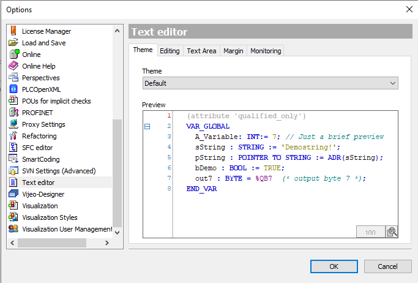
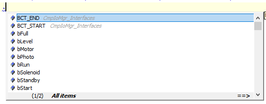
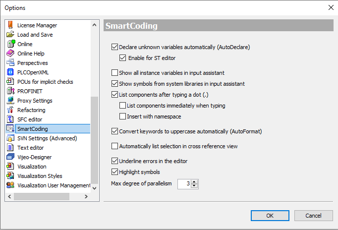
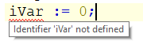
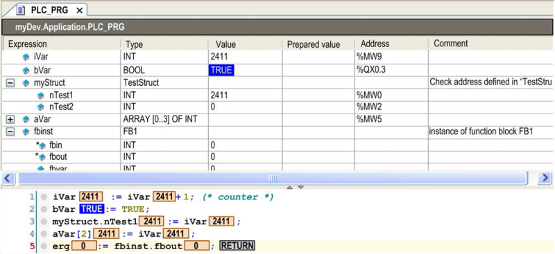
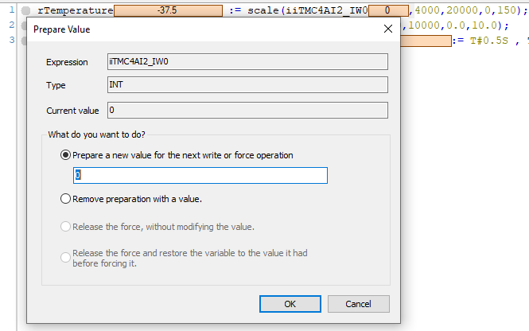
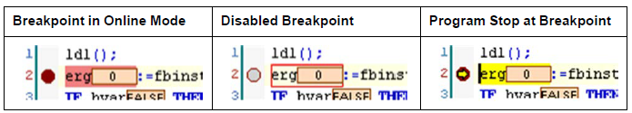

[<- До підрозділу](README.md)	[PLC MachineStruxure](../ecostruxuremachineexpert.md) 	[CODESYS (загальна)](../codesys.md)	[Коментувати](#feedback)

# Програмування на мові ST в CODESYS

## 1. Мова Structured Text (ST)

Structured Text — це текстова мова програмування високого рівня, подібна до PASCAL або C, в якій програмний код складається з виразів та інструкцій .

### Коментарі в ST

Існують два способи запису коментарів у Structured Text:

- Багаторядкові коментарі, починаються з `(*` і завершуються `*)`. Дозволяють створювати коментарі, що охоплюють кілька рядків. Приклад

```pascal
(* Це коментар *)
```

- Однорядкові коментарі (розширення стандарту IEC 61131-3). Починаються з `//` і діють до кінця рядка. Приклад

```pascal
// Це коментар
```

Коментарі можна розміщувати в будь-якому місці секції оголошень змінних або реалізації коду редактора ST.

Можна розміщувати коментарі всередині інших коментарів. У наступному прикладі зовнішній коментар, що починається з першої дужки `(*`, закривається лише останньою парою `*)`, а не після слова `перевірити`.

```pascal
(*
a := inst.out; (* перевірити *)
b := b + 1;
*)
```

### Вирази

Вираз — це конструкція, яка після обчислення повертає значення. Це значення використовується в інструкціях. Вирази складаються з:

- операторів 
- операндів: константа (накприклад, `33`), змінна (`iVar`), виклик функції (`fct(a, b, c)`) або інший вираз (`(x*y) / z`).
- та/або присвоювань (наприклад `real_var2 := int_var;`).

Обчислення виразу здійснюється шляхом опрацювання операторів відповідно до визначених правил. Спочатку обробляється оператор з найвищим пріоритетом, далі оператор наступного рівня пріоритету і так доти, доки не буде оброблено всі оператори.

Нижче наведена таблиця операторів ST у порядку зменшення їх пріоритету виконання від наймвищого до найнижчого:

| Операція              | Символ                           |
| --------------------- | -------------------------------- |
| розміщення в дужках   | (expression)                     |
| виклик функції        | ім’я функції (список параметрів) |
| піднесення до степеня | EXPT                             |
| заперечення           | –                                |
| побудова доповнення   | NOT                              |
| множення              | *                                |
| ділення               | /                                |
| остача від ділення    | MOD                              |
| додавання             | +                                |
| віднімання            | –                                |
| порівняння            | <, >, <=, >=                     |
| дорівнює              | =                                |
| не дорівнює           | <>                               |
| логічне AND           | AND                              |
| логічне XOR           | XOR                              |
| логічне OR            | OR                               |

Як розширення стандарту IEC 61131-3 (ExST), присвоювання може використовуватися як вираз. Приклади:

```pascal
int_var1 := int_var2 := int_var3 + 9; (* int_var1 і int_var2 отримують значення int_var3 + 9 *)
real_var1 := real_var2 := int_var; (* коректні присвоювання; real_var1 і real_var2 отримають значення int_var *)
int_var := real_var1 := int_var; (* буде відображено повідомлення через невідповідність типів real–int *)
IF b := (i = 1) 
	THEN i := i + 1; (* вираз використовується в умові IF; спочатку змінній b буде присвоєно TRUE або FALSE залежно від того, чи дорівнює i 1; потім буде обчислено результат b *) 
END_IF 
```

### Огляд Інструкцій

Інструкції означують, що потрібно виконати з заданими виразами. У ST можуть використовуватися такі інструкції:

| Інструкція                                               | Приклад                                                      |
| -------------------------------------------------------- | ------------------------------------------------------------ |
| присвоювання                                             | `A := B;` `CV := CV + 1;` `C := SIN(X);`                     |
| виклик функціонального блока та використання його виходу | `CMD_TMR(IN := %IX5, PT := 300);` `A := CMD_TMR.Q;`          |
| RETURN                                                   | `RETURN;`                                                    |
| IF                                                       | `D := B*B; <br> IF D < 0 THEN <br> C := A; <br> ELSIF D = 0 THEN <br> C := B; <br> ELSE <br> C := D; <br> END_IF;` |
| CASE                                                     | `CASE INT1 OF <br> 1: BOOL1 := TRUE; <br> 2: BOOL2 := TRUE; <br> ELSE <br> BOOL1 := FALSE; <br> BOOL2 := FALSE; <br> END_CASE;` |
| FOR                                                      | `J := 101; <br> FOR I := 1 TO 100 BY 2 DO <br> IF ARR[I] = 70 THEN <br> J := I; <br> EXIT; <br> END_IF; <br> END_FOR;` |
| WHILE                                                    | `J := 1; <br> WHILE J <= 100 AND ARR[J] <> 70 DO <br> J := J + 2; <br> END_WHILE;` |
| REPEAT                                                   | `J := -1; <br> REPEAT <br> J := J + 2; <br> UNTIL J = 101 OR ARR[J] = 70 <br> END_REPEAT;` |
| EXIT                                                     | `EXIT;`                                                      |
| CONTINUE                                                 | `CONTINUE;`                                                  |

Додаткові інструкції ST

| Інструкція         | Приклад                                                      |
| ------------------ | ------------------------------------------------------------ |
| JMP                | `label1: i := i + 1; <br> IF i = 10 THEN <br> JMP label2; <br> END_IF; <br> JMP label1; <br> label2:` |
| порожня інструкція | `;`                                                          |

### Присвоювання 

#### Оператор присвоювання `:=`

Зліва від оператора присвоювання розташований операнд (змінна, адреса), якому за допомогою оператора `:=` присвоюється значення виразу, що знаходиться справа. Приклад

```pascal
a := b;
```

Змінна `a` отримує значення `b`.

Оператор MOVE виконує ту саму дію.

#### Оператор встановлення `S=`

Значення встановлюється: якщо змінну один раз встановлено в `TRUE`, вона залишатиметься `TRUE`. Приклад

```pascal
a S= b;
```

Змінна `a` встановлюється в `TRUE`, якщо під час виконання присвоювання `b = TRUE`. Якщо `b = FALSE`, значення `a` не змінюється.

#### Оператор скидання `R=`

Значення скидається: якщо змінну один раз встановлено в `FALSE`, вона залишатиметься `FALSE`. Приклад

```pascal
a R= b;
```

Змінна `a` встановлюється в `FALSE`, як тільки `b = TRUE`. 

У випадку множинного присвоювання оператори встановлення та скидання застосовуються до останнього елемента присвоювання. Приклад

```pascal
a S= b R= fun1(par1, par2);
```

У цьому випадку `b` отримує результат оператора скидання від функції `fun1`. Але `a` отримує не встановлене значення `b`, а встановлене вихідне значення `fun1`. Слід враховувати, що присвоювання може використовуватися як вираз. Це є розширенням стандарту IEC 61131-3.

#### Оператор присвоювання `REF`

Цей оператор створює посилання (reference) на значення. Синтаксис

```pascal
<ім’я змінної> REF= <ім’я змінної>;
```

Приклад

```pascal
refA : REFERENCE TO DUT;
B : DUT;
C : DUT;

A REF= B;   // відповідає A := ADR(B);
A := C;     // відповідає A^ := C;
```

### Виклик функціональних блоків

Функціональний блок (FB) викликається в Structured Text за такою схемою:

```pascal
<ім’я екземпляра FB>(вхідна_змінна_FB := <значення або адреса>,
                      інша_вхідна_змінна_FB := <значення або адреса>,
                      ...);
```

У наведеному прикладі таймер TON викликається з присвоюванням параметрів `IN` та `PT`. Потім результат `Q` присвоюється змінній `A`.  Екземпляр таймера створюється оголошенням: `TMR : TON;` Звернення до вихідної змінної FB здійснюється за схемою:`<ім’я екземпляра>.<змінна FB>`

```pascal
TMR(IN := %IX5, PT := 300);
A := TMR.Q;
```

Також доступний альтернативний синтаксис для виходів:

```pascal
fb(in1 := myvar, out1 => myvar2);
```

### Інструкція `RETURN`

Інструкція `RETURN` використовується для виходу з POU. Синтаксис

```pascal
RETURN;
```

Приклад

```pascal
IF b = TRUE THEN
   RETURN;
END_IF;
a := a + 1;
```

Якщо `b = TRUE`, інструкція `a := a + 1;` виконана не буде, і виконання POU негайно завершиться.

### Інструкція `IF`

Інструкція `IF` дозволяє перевірити умову і, залежно від її результату, виконати відповідні інструкції. Синтаксис

```pascal
IF <boolean_expression1> THEN
   <IF_instructions>
{ELSIF <boolean_expression2> THEN
   <ELSIF_instructions1>
 ...
ELSIF <boolean_expression n> THEN
   <ELSIF_instructions_n>
ELSE
   <ELSE_instructions>}
END_IF;
```

Частина в фігурних дужках є необов’язковою. Логіка виконання наступна:

- Якщо `<boolean_expression1>` повертає `TRUE`, виконуються тільки `<IF_instructions>`.
- Інакше послідовно перевіряються вирази `ELSIF`.
- Якщо жодна умова не повертає `TRUE`, виконуються інструкції блоку `ELSE`.

Приклад

```pascal
IF temp < 17 THEN
   heating_on := TRUE;
ELSE
   heating_on := FALSE;
END_IF;
```

У цьому випадку нагрівання вмикається, якщо температура опускається нижче 17 градусів. Інакше воно залишається вимкненим.

### Інструкція `CASE`

Інструкція `CASE` дозволяє об’єднати кілька умов з однією змінною керування в єдину конструкцію. Синтаксис

```pascal
CASE <Var1> OF
   <value1>: <instruction1>
   <value2>: <instruction2>
   <value3, value4>: <instruction3>
   <value6..value10>: <instruction4>
   ...
ELSE
   <ELSE_instruction>
END_CASE;
```

Принцип роботи:

- Якщо `<Var1>` має значення `<value_i>`, виконується відповідна інструкція.
- Якщо жодне зі значень не збігається, виконується блок `ELSE`.
- Для кількох значень можна перелічити їх через кому.
- Для діапазону значень використовується запис через дві крапки `..`.

Приклад

```pascal
CASE INT1 OF
   1, 5:
      BOOL1 := TRUE;
      BOOL3 := FALSE;
   2:
      BOOL2 := FALSE;
      BOOL3 := TRUE;
   10..20:
      BOOL1 := TRUE;
      BOOL3 := TRUE;
ELSE
   BOOL1 := NOT BOOL1;
   BOOL2 := BOOL1 OR BOOL2;
END_CASE;
```

### Цикли

Перед розглядом циклів варто пам'ятати: необхідно забезпечити, щоб цикли завершувалися в межах часу задачі, інакше може спрацювати сторожовий таймер (якщо він виставлений). Недотримання цих інструкцій може призвести до смерті, серйозної травми або пошкодження обладнання.

#### Цикл `FOR`

За допомогою циклу `FOR` можна реалізувати повторювані процеси. Синтаксис

```pascal
INT_Var : INT;

FOR <INT_Var> := <INIT_VALUE> TO <END_VALUE> {BY <step_size>} DO
   <instructions>
END_FOR;
```

Частина в фігурних дужках є необов’язковою. Інструкції виконуються доти, доки лічильник `<INT_Var>` не перевищить `<END_VALUE>`.
Перевірка виконується перед входом у тіло циклу, тому якщо `<INIT_VALUE>` більше за `<END_VALUE>`, тіло циклу не буде виконано жодного разу. 

Після кожного виконання тіла циклу значення `<INT_Var>` збільшується на `<step_size>`. Крок може мати будь-яке ціле значення. Якщо параметр `BY` відсутній, за замовчуванням використовується `1`. Цикл завершується, коли `<INT_Var>` стає більшим за `<END_VALUE>`.

Приклад

```pascal
FOR Counter := 1 TO 5 BY 1 DO
   Var1 := Var1 * 2;
END_FOR;

Erg := Var1;
```

Якщо початкове значення `Var1` дорівнює `1`, після завершення циклу `FOR` воно буде дорівнювати `32`. 

Якщо `<END_VALUE>` дорівнює граничному значенню типу даних змінної `<INT_Var>` (у наведеному прикладі — `Counter`), виникне нескінченний цикл.

Наприклад, якщо `Counter` має тип SINT, а `<END_VALUE>` дорівнює `127` (максимальне додатне значення для SINT), цикл ніколи не завершиться. Після додавання `1` до `127` змінна стане від’ємною і вже не зможе перевищити межу, необхідну для завершення циклу `FOR`.

Переконайтеся, що тип змінної, яка використовується в інструкції `FOR`, має достатню розрядність для значення `<END_VALUE> + 1`. Недотримання цих інструкцій може призвести до смерті, серйозної травми або пошкодження обладнання.

У циклі `FOR` можна використовувати інструкцію `CONTINUE`. 

#### Цикл `WHILE`

Альтернативою циклу `FOR` є цикл `WHILE`. Він виконується, якщо логічна умова є `TRUE`, і продовжує виконуватися доти, доки ця умова залишається `TRUE`. Якщо умова спочатку не є `TRUE`, тіло циклу не виконується. Якщо умова, що спочатку була `TRUE`, стає `FALSE`, цикл завершується. Синтаксис

```pascal
WHILE <boolean_expression> DO
   <instructions>
END_WHILE;
```

Очевидно, що в процесі виконання інструкцій циклу логічний вираз повинен на певному етапі набути значення `FALSE`. Інакше цикл не завершиться, що призведе до нескінченного циклу. Приклад

```pascal
WHILE Counter > 0 DO
   Var1 := Var1 * 2;
   Counter := Counter - 1;
END_WHILE;
```

У циклі `WHILE` можна використовувати інструкцію `CONTINUE`.

#### Цикл `REPEAT`

Цикл `REPEAT` є ще однією альтернативою циклам `FOR` і `WHILE`. Відмінність від `WHILE` полягає в тому, що умова завершення перевіряється тільки після того, як тіло циклу буде виконано щонайменше один раз — у кінці циклу. Синтаксис

```pascal
REPEAT
   <instructions>
UNTIL <boolean_expression>
END_REPEAT;
```

Інструкції виконуються повторно доти, доки `<boolean_expression>` повертає `FALSE`. Якщо під час першої перевірки в блоці `UNTIL` логічний вираз уже має значення `TRUE`, тіло циклу буде виконано лише один раз. Логічний вираз повинен у певний момент набути значення `TRUE`. Інакше цикл не завершиться, що призведе до нескінченного циклу.

Приклад

```pascal
REPEAT
   Var1 := Var1 * 2;
   Counter := Counter - 1;
UNTIL
   Counter <= 0
END_REPEAT;
```

У циклі `REPEAT` можна використовувати інструкцію `CONTINUE`. Це є розширенням стандарту IEC 61131-3.

#### Інструкція `CONTINUE`

Як розширення стандарту IEC 61131-3, інструкція `CONTINUE` підтримується в циклах `FOR`, `WHILE` та `REPEAT`. `CONTINUE` передає керування на початок наступної ітерації циклу.

Приклад

```pascal
FOR Counter := 1 TO 5 BY 1 DO
   INT1 := INT1 / 2;
   IF INT1 = 0 THEN
      CONTINUE; (* щоб уникнути ділення на нуль *)
   END_IF
   Var1 := Var1 / INT1; (* виконується тільки якщо INT1 ≠ 0 *)
END_FOR;

Erg := Var1;
```

#### Інструкція `EXIT`

Інструкція `EXIT` негайно завершує цикл `FOR`, `WHILE` або `REPEAT`, у якому вона розташована, незалежно від умов.

### Інструкція `JMP`

Інструкція `JMP` використовується для безумовного переходу до рядка коду, позначеного міткою переходу. Синтаксис

```pascal
JMP <label>;
```

`<label>` — довільний, але унікальний ідентифікатор, що розміщується на початку рядка програми. Після `JMP` необхідно вказати ім’я мітки, яке має відповідати попередньо означеній мітці.

Необхідно забезпечити, щоб використання інструкції JMP було умовним. Недотримання цих інструкцій може призвести до смерті, серйозної травми або пошкодження обладнання.

Приклад

```pascal
aaa := 0;

_label1: aaa := aaa + 1;
(* інструкції *)

IF (aaa < 10) THEN
   JMP _label1;
END_IF;
```

Поки змінна `aaa`, ініціалізована нулем, має значення менше `10`, виконується повторний перехід до рядка з міткою `_label1`. Оскільки всередині циклу відбувається інкремент `aaa`, умова переходу зрештою стане хибною, і виконання продовжиться далі. Ту саму логіку можна реалізувати за допомогою циклів `WHILE` або `REPEAT`. 

Загалом використання JMP зменшує читабельність коду.

## 2. Редактор ST

### Режим редагування

Для створення програмних об’єктів мовою програмування Structured Text (ST) використовується текстовий редактор ST. Налаштування його поведінки, зовнішнього вигляду та меню робиться через відповідні параметри текстового редактора у вікнах `Options` та `Customize`. Там можна означити стандартні налаштування підсвічування синтаксису, нумерації рядків, табуляції, відступів та багато інших параметрів.



рис.1. Вікно налаштування текстового редактору. 

Для спрощення програмування передбачені функції `List components` та Input `Assistant`. Наприклад натиснувши крапку можна отримати доступ до списку відповідних об'єктів даного рівня (рис.2). 

 

рис.2. Відображення `List components`

Текстовий редактор взагалі має багато можливостей які характерні для всіх редакторів CODESYS, зокрема Smart Coding, який налаштовується в Options. 



рис.3. Вікно налаштування Smart Coding

Якщо під час редагування виявляються синтаксичні помилки, відповідні повідомлення відображаються у вікні Precompile Messages. Це вікно оновлюється щоразу, коли фокус повертається до вікна редактора (наприклад, якщо ви перейшли в інше вікно, а потім знову повернулися до редактора). Місце помилки виділяється відповідним кольором і підсвічується, а при наведені вказівника миші - показує повідомлення про помилку.



рис.4. Приклад підсвічування помилки в редакторі.

Редактор надає можливості пошуку, заміни та типові функції тектсових редакторів.

### Онлайн-режим

В онлайн-режимі редактор ST надає засоби для моніторингу, а також для запису та форсування змінних і виразів безпосередньо на контролері. Доступні засоби налагодження, зокрема точки зупину, покрокове виконання тощо. 

Якщо в діалоговому вікні `Tools > Options > Text editor` на вкладці `Monitoring` активовано опцію `Enable inline monitoring`, після кожної змінної відображатимуться невеликі вікна моніторингу з її поточним значенням. 



рис.5. Онлайн-вигляд програмного об’єкта PLC_PRG з увімкненим моніторингом

Окрім можливості введення підготовленого значення змінної безпосередньо в її оголошенні в будь-якому редакторі, редактор ST дозволяє в онлайн-режимі двічі клацнути на полі моніторингу змінної в частині реалізації програми. У діалоговому вікні, що з’явиться, потрібно ввести підготовлене значення.



рис.6. Діалогове вікно Prepare Value

У вікні відображається ім’я змінної разом із повним шляхом, її тип та поточне значення. Активувавши відповідний пункт, можна виконати такі дії:

- підготувати нове значення, яке потрібно ввести в поле редагування
- видалити підготовлене значення
- зняти форсування зі змінної
- зняти форсування та відновити значення, яке змінна мала до форсування

Для виконання вибраної дії можна використати команду `Debug > Force values` (у розділі `Online`) або натиснути клавішу `F7`.

### Позиції точок зупину в редакторі ST

Точку зупину можна встановити в тих позиціях POU, де може змінюватися значення змінних, відбувається розгалуження виконання або виклик іншого POU. 

У наведених прикладах позначення `{BP}` вказує можливу позицію точки зупину.

Цикли:

```
{BP} FOR i := 12 TO {BP} x {BP} BY 1 DO
{BP} statement1
...
{BP} statementn-2
END_FOR
```

```
{BP} WHILE i < 12 DO
{BP} statement1
...
{BP} statementn-1
END_WHILE
```

```
REPEAT
{BP} statement1
...
{BP} statementn-1
{BP} UNTIL i >= 12
END_REPEAT
```

Виклик програми або функціонального блока: 

```
{BP} POU();
```

У кінці POU. 



рис.7. Відображення точки зупину в редакторі ST

Точка зупину буде автоматично встановлена в усіх методах, які можуть бути викликані.

Якщо викликається метод, керований через інтерфейс, точки зупину встановлюються:

- у всіх методах функціональних блоків, що реалізують цей інтерфейс;
- у всіх похідних функціональних блоках, які підписані на цей метод.

Якщо метод викликається через вказівник на функціональний блок, точки зупину встановлюються:

- у методі відповідного функціонального блока;
- у всіх похідних функціональних блоках, які підписані на цей метод.

## Автори


Теретичне заняття розробив [Олександр Пупена](https://github.com/pupenasan). 

## Feedback

Якщо Ви хочете залишити коментар у Вас є наступні варіанти:

- [Обговорення у WhatsApp](https://chat.whatsapp.com/BRbPAQrE1s7BwCLtNtMoqN)
- [Обговорення в Телеграм](https://t.me/+GA2smCKs5QU1MWMy)
- [Група у Фейсбуці](https://www.facebook.com/groups/asu.in.ua)

Про проект і можливість допомогти проекту написано [тут](https://asu-in-ua.github.io/atpv/)
