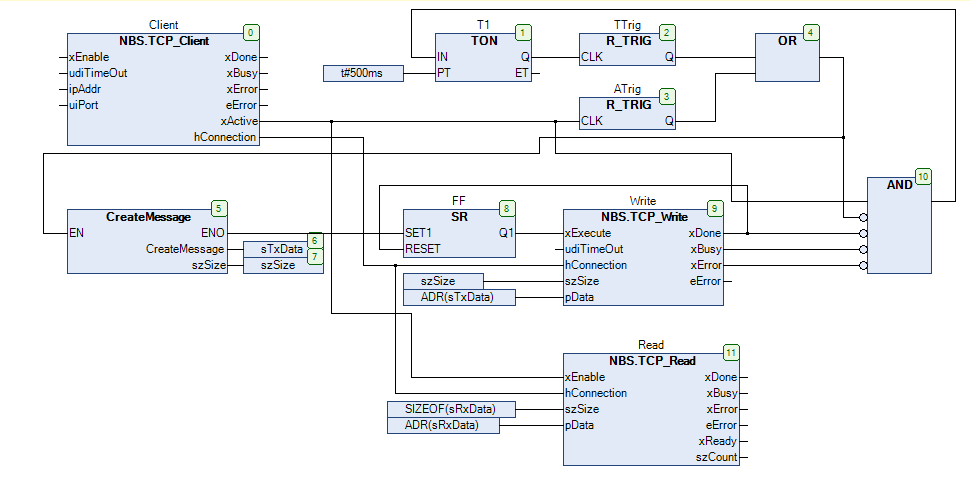

[<- До підрозділу](README.md)	[PLC MachineStruxure](../ecostruxuremachineexpert.md)	[Коментувати](#feedback)

# Бібліотека NetBaseServices Codesys: TCP/UDP

## TCP_Client (FB)

[Джерело](https://content.helpme-codesys.com/en/libs/Net%20Base%20Services/Current/NetBaseServices/Function-Blocks/TCP/TCP_Client.html)

Щоб підключитися до TCP-сервера в кінцевій точці, означеній за допомогою `itfIPAddress` і `uiPort`, вхід `xEnable` має встановити значення `TRUE`. Під час налаштування підключення `xBusy` має значення `TRUE`, а `xActive` має значення `FALSE`. Після встановлення з’єднання `xActive` і `xBusy` мають значення `TRUE`, а вихід `itfConnection` дійсний. Після закриття з’єднання з боку сервера `xActive` стає `FALSE`, `itfConnection` стає недійсним, а `xDone` стає `TRUE`.

`itfConnection` можна використовувати як вхід `itfConnection` для функціональних блоків [TCP_Write](https://content.helpme-codesys.com/en/libs/Net Base Services/Current/NetBaseServices/Function-Blocks/TCP/TCP_Write. html#tcp-write), [TCP_Writer](https://content.helpme-codesys.com/en/libs/Net Base Services/Current/NetBaseServices/Function-Blocks/TCP/TCP_Writer.html#tcp-writer), [TCP_Read](https://content.helpme-codesys.com/en/libs/Net Base Services/Current/NetBaseServices/Function-Blocks/TCP/TCP_Read.html#tcp-read) і [TCP_Reader](https:/ /content.helpme-codesys.com/en/libs/Net Base Services/Current/NetBaseServices/Function-Blocks/TCP/TCP_Reader.html#tcp-reader).

| Ім'я               | Тип                                                          | Початкове значення | коментар                                                     | Успадковано від |
| ------------------ | ------------------------------------------------------------ | ------------------ | ------------------------------------------------------------ | --------------- |
|                    | **Input**                                                    |                    |                                                              |                 |
| `xEnable`          | `BOOL`                                                       |                    | `TRUE`: активує означену операцію. `FALSE`: перериває/скидає означену операцію | LCon            |
| `udiTimeOut`       | `UDINT`                                                      | 0                  | Означує час (мкс), після якого встановлення з’єднання переривається з активним `xError`. |                 |
| `itfIPAddress`     | [IIPAddress](https://content.helpme-codesys.com/en/libs/Net Base Services/Current/NetBaseServices/Interfaces/IP/IIPAddress.html#iipaddress) |                    | Пов’язана адреса сервера (з [ResolveHostname](https://content.helpme-codesys.com/en/libs/Net Base Services/Current/NetBaseServices/Function-Blocks/IP/pou-ResolveHostname/ResolveHostname.html#resolvehostname- resolvehostname), можливе перетворення імені хоста на IP-адресу) |                 |
| `uiPort`           | `UINT`                                                       |                    | Відповідний порт сервера                                     |                 |
|                    | **Input Const**                                              |                    |                                                              |                 |
| `itfAsyncProperty` | [IAsyncProperty](https://content.helpme-codesys.com/en/libs/Net Base Services/Current/NetBaseServices/Interfaces/AsyncProperty/IAsyncProperty.html#iasyncproperty) |                    |                                                              |                 |
| `itfTLSContext`    | [ITLSContext](https://content.helpme-codesys.com/en/libs/Net Base Services/Current/NetBaseServices/Interfaces/TLS/ITLSContext.html#itlscontext) |                    |                                                              |                 |
| `itfTSNContext`    | [ITSNContext](https://content.helpme-codesys.com/en/libs/Net Base Services/Current/NetBaseServices/Interfaces/TSN/ITSNContext.html#itsncontext) |                    |                                                              |                 |
|                    | **Output**                                                   |                    |                                                              |                 |
| `xDone`            | `BOOL`                                                       |                    | Готовий стан досягнуто                                       | LCon            |
| `xBusy`            | `BOOL`                                                       |                    | `TRUE`: операція виконується                                 | LCon            |
| `xError`           | `BOOL`                                                       |                    | `TRUE`: Виникла умова помилки                                | LCon            |
| `eErrorID`         | [ERROR](https://content.helpme-codesys.com/en/libs/Net Base Services/Current/NetBaseServices/Enums/ERROR.html#error) |                    |                                                              | LCon            |
| `xActive`          | `BOOL`                                                       |                    | `TRUE`, якщо з'єднання встановлено                           |                 |
| `itfConnection`    | [IConnection](https://content.helpme-codesys.com/en/libs/Net Base Services/Current/NetBaseServices/Interfaces/TCP/IConnection.html#iconnection) |                    | Встановлене з’єднання з відповідним сервером дійсне, якщо `xActive` = `TRUE` |                 |


## TCP_Read (FB)

Цей функціональний блок служить для читання даних із попередньо встановленого з’єднання, указаного в `itfConnection`. Поки `xEnable` має значення `TRUE` і з'єднання дійсне. Покажчик `pData` вказує область пам'яті для запису прочитаних даних. `udiSize` визначає максимальну кількість байтів для читання. Коли дані було успішно прочитано, `xReady` встановлюється на `TRUE`, а `udiCount` вказує фактично прочитану кількість байтів.

| Name            | Type                                                         | Comment                                                      | Inherited from |
| --------------- | ------------------------------------------------------------ | ------------------------------------------------------------ | -------------- |
| **Input**       |                                                              |                                                              |                |
| `xEnable`       | `BOOL`                                                       | `TRUE`: Активує означену операцію `FALSE`: перериває/скидає визначену операцію | LConC          |
| `itfConnection` | [IConnection](https://content.helpme-codesys.com/en/libs/Net Base Services/Current/NetBaseServices/Interfaces/TCP/IConnection.html#iconnection) |                                                              |                |
| `pData`         | `__XWORD`                                                    |                                                              |                |
| `udiSize`       | `UDINT`                                                      |                                                              |                |
| **Output**      |                                                              |                                                              |                |
| `xBusy`         | `BOOL`                                                       | `TRUE`: Операція виконується                                 | LConC          |
| `xError`        | `BOOL`                                                       | `TRUE`: Досягнуто умови помилки                              | LConC          |
| `eErrorID`      | [ERROR](https://content.helpme-codesys.com/en/libs/Net Base Services/Current/NetBaseServices/Enums/ERROR.html#error) |                                                              | LConC          |
| `xReady`        | `BOOL`                                                       |                                                              |                |
| `udiCount`      | `UDINT`                                                      |                                                              |                |

## TCP_Write (FB)

Цей функціональний блок служить для запису даних до попередньо встановленого з’єднання, указаного в `itfConnection`. Вміст області пам’яті, позначений покажчиком `pData`, містить дані, які потрібно записати. `udiSize` визначає кількість байтів для запису. Якщо `xDone` має значення `TRUE`, `udiCount` байтів даних було успішно записано.

| Name            | Type                                                         | Comment                                                      | Inherited from |
| --------------- | ------------------------------------------------------------ | ------------------------------------------------------------ | -------------- |
|                 | **Input**                                                    |                                                              |                |
| `xExecute`      | `BOOL`                                                       | Наростаючий фронт: починає визначену операцію. `FALSE`: скидає визначену операцію після досягнення стану готовності | ETrigTo        |
| `udiTimeOut`    | `UDINT`                                                      | Макс. час роботи для виконання [мкс], 0: без обмеження часу роботи | ETrigTo        |
| `itfConnection` | [IConnection](https://content.helpme-codesys.com/en/libs/Net Base Services/Current/NetBaseServices/Interfaces/TCP/IConnection.html#iconnection) |                                                              |                |
| `pData`         | `__XWORD`                                                    |                                                              |                |
| `udiSize`       | `UDINT`                                                      |                                                              |                |
|                 | **Output**                                                   |                                                              |                |
| `xDone`         | `BOOL`                                                       | Ready condition reached                                      | ETrigTo        |
| `xBusy`         | `BOOL`                                                       | `TRUE`: Operation is running                                 | ETrigTo        |
| `xError`        | `BOOL`                                                       | `TRUE`: Error condition reached                              | ETrigTo        |
| `eErrorID`      | [ERROR](https://content.helpme-codesys.com/en/libs/Net Base Services/Current/NetBaseServices/Enums/ERROR.html#error) |                                                              | ETrigTo        |
| `udiCount`      | `UDINT`                                                      |                                                              |                |

## Приклади

Функціональні блоки з вхідною або вихідною змінною з назвою hBlock внутрішньо використовуватимуть бібліотеку Segmented Block Manager. Ця бібліотека надає функціональні можливості для керування структурами даних таким чином, щоб кількість дій копіювання була якомога меншою. Наразі впровадження цієї бібліотеки має серйозну проблему (CDS-56664). Він часто використовує функцію для виділення (SysMemAlloc) і звільнення пам’яті (SysMemFree) розділів. Така поведінка може призвести до фрагментації пам’яті. Це не є хорошою практикою в промисловому середовищі, оскільки йдеться про можливість безперервної роботи цілодобово та 365 днів на рік.

У цьому прикладі право власності на дескриптор `hBuffer` безпосередньо пов'язано з обробкою наступних функціональних блоків або функцій. Якщо ви виконуєте деякі інші кроки обробки та отримуєте право власності на дескриптор `hBlock`, необхідно буде використовувати функцію `SBM.DeleteBuffer`, щоб звільнити підключені ресурси.

```pascal
PROGRAM Client
VAR
	Client : NBS.TCP_Client;
	Write: NBS.TCP_Write;
	Read: NBS.TCP_Read;

	T1: TON;
	TTrig: R_TRIG;
	ATrig: R_TRIG;
	FF: SR;

	sTxData: STRING;
	sRxData: STRING;
	szSize: CAA.SIZE;
    
END_VAR
```



## Автори


Теретичне заняття розробив  [Олександр Пупена](https://github.com/pupenasan). 

## Feedback

Якщо Ви хочете залишити коментар у Вас є наступні варіанти:

- [Обговорення у WhatsApp](https://chat.whatsapp.com/BRbPAQrE1s7BwCLtNtMoqN)
- [Обговорення в Телеграм](https://t.me/+GA2smCKs5QU1MWMy)
- [Група у Фейсбуці](https://www.facebook.com/groups/asu.in.ua)

Про проект і можливість допомогти проекту написано [тут](https://asu-in-ua.github.io/atpv/) 