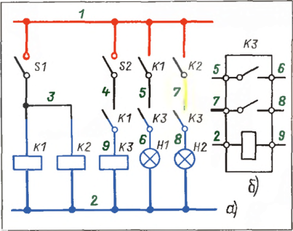
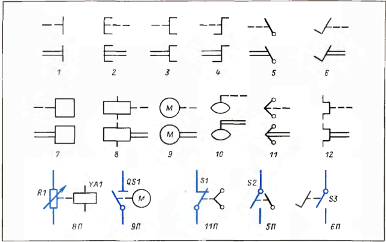
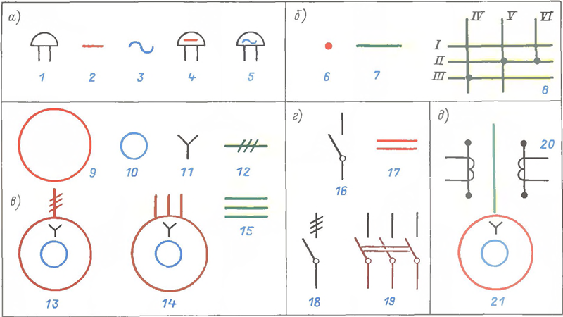
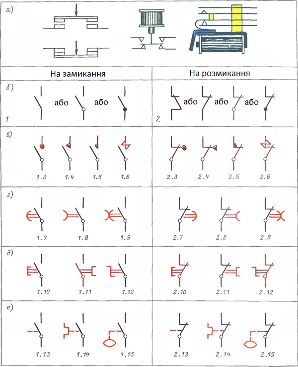
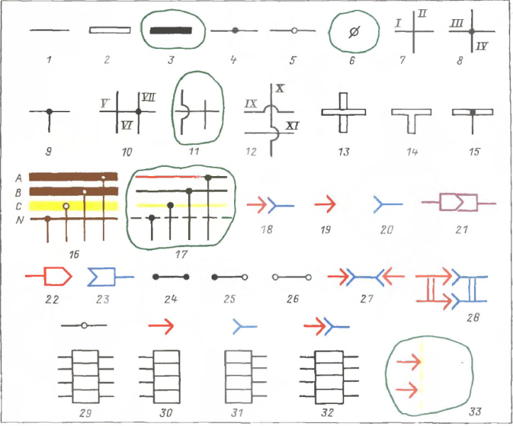
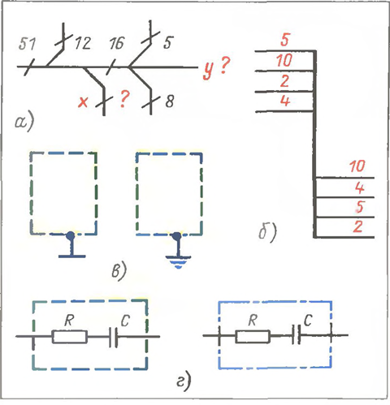
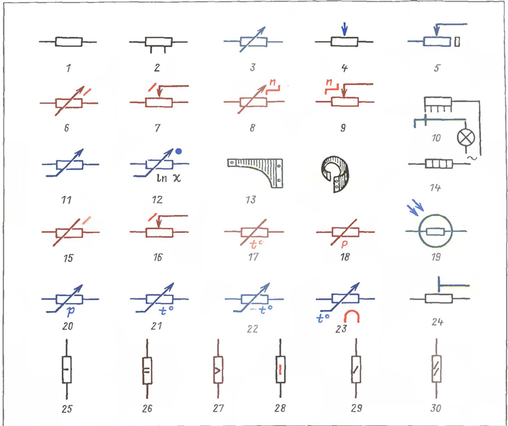
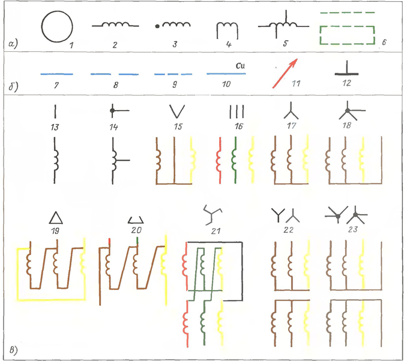
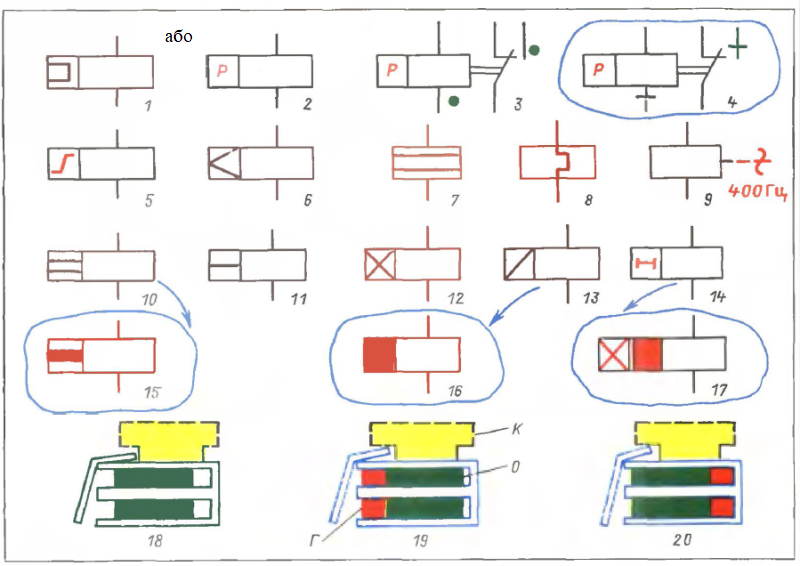
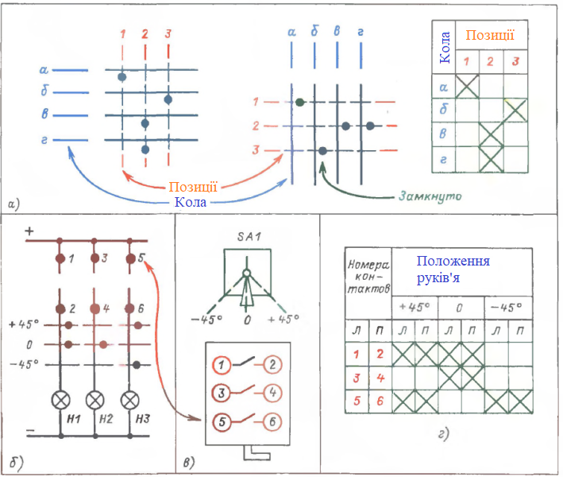

[<- До підрозділу](README.md)

# Позначення умовні графічні для електричних схем

Переклад та адаптація частини книги Е.А. Каминский. Практические приемы чтения схем электроустановок. 1988

Деякі частини тексту замінені більш актуальними на сьогоднішній день.

# 1. Що таке схема та що потрібно знати для читання схем

## 1.2. Види та типи схем

Схеми поділяються за видами. Вид схеми визначається видом елементів та зв'язків між ними, а також енергоносієм, який необхідний для дії елементів. **Види** схем позначають літерами.  

- Електричні схеми (**Е**): елементи електротехнічні вироби; зв'язки – провідники; енергоносій електричний струм. 
- Гідравлічні схеми (**Г**): елементи – насоси, засувки, вентилі; зв'язки - трубопроводи; енергоносій - рідина під тиском, наприклад вода, олія. 
- Пневматичні схеми (**П**): елементи – компресори, клапани, золотники; зв'язки – трубопроводи; енергоносій – стислий газ, пара, повітря; 
- Кінематичні схеми (**К**): елементи - частини механізмів; зв'язки між ними - важелі, тяги, ланцюги; енергоносій – механічна енергія.
- Схеми автоматизації. До їх складу можуть входити схеми різних видів із відповідними зв'язками. У разі назва виду підкреслює призначення схеми, а чи не вид елементів і зв'язків.
- Комбіновані (сумісні) схеми (**С**), наприклад схема електрогідравлічна, тобто така схема, яка містить і електричні та гідравлічні елементи. Поширення суміщених схем пояснюється тією обставиною, що багато технічні завдання вирішуються спільно засобами гідравліки, пневматики, електротехніки і механіки. Наприклад, для переміщення вантажу електродвигун приводить у дію насос, що піднімає тиск у гідравлічній системі. Напрямок руху визначається положенням золотників. Золотники мають пневматичні приводи. Обмеження ходу досягається елементами кінематики тощо.

У межах кожного виду схеми поділяються кілька типів. **Тип** схеми визначається її призначенням. Типи схем позначають цифрами. 

- Структурна схема (1) означує основні функціональні частини виробу. 
- Функціональна схема (2) пояснює процеси, які у ньому. 
- Принципова (повна) схема (3) означує повний склад елементів і зв'язків між ними і, дає детальне уявлення про принцип роботи.

Принципові схеми порівняно прості за зображенням, але по суті вони найскладніші і найважливіші. Справа в тому, що саме на підставі принципових схем розробляють схеми інших типів, тобто такі схеми, керуючись якими виконують роботи. Це:

- схеми з'єднань (монтажні) (4), 
- підключення (5), 
- загальні (6), 
- розташування (7) 
- та об'єднані. 

На об'єднаній схемі можуть бути поміщені схеми одного виду декількох типів, що відносяться до одного виробу (установки), наприклад схема принципова електрична (ЕЗ) і схема електрична з'єднань (Е4). Об'єднаній схемі надається найменування схеми, що має менший номер із номерів об'єднаних схем; у разі схемі треба привласнити номер ЕЗ, оскільки ЕЗ менше, ніж Е4.

## 1.3. Стандарти, якими користуються під час виконання схем

Схеми виконують, керуючись стандартами. Стандарти ГОСТ, що належать до схем, входять до сьомої класифікаційної групи Єдиної системи конструкторської документації (ЄСКД). Позначення цих стандартів будується за наступною системою:

ГОСТ 2.700 — 00

Де 2 - ознака системи ЄСКД (Іншим системам документації присвоєно інші цифри); 7 ознака сьомої класифікаційної групи — групи схем, за якою слідує номер стандарту (1—99) у межах групи. Після знаку розділу вказано рік реєстрації (затвердження) стандарту.

Спільно завжди застосовують стандарти на графічні умовні позначення (див. гл. 2), літерно-цифрові позиційні позначення елементів (див. § 4.2) та у ряді випадків стандарт на систему позначень ділянок ланцюгів в електричних установках (див. § 4.5). Справа в тому, що котушки будь-яких реле, магнітних пускачів і контакторів, рубильники, автоматичні вимикачі, всі однотипні електричні машини, трансформатори, прилади зображують відповідно однаково. Отже, без позиційних позначень не можна розрізнити різні апарати, ні встановити приналежність деталей (котушок, контактів) тому чи іншому апарату.

Необхідність у позиційних позначеннях елементів ілюструє рис. 1.7, а. На ньому ясно видно, що рубильники S1, S2, котушки реле К1-КЗ та їх контакти, лампи Н1 і Н2 розрізняються за допомогою позиційних позначень. Вони ж встановлюють зв'язки між частинами виробу, які зображені різних ланцюгах. Наприклад, у ланцюг лампи Н1 введені контакти реле К1 і КЗ, у ланцюг лампи Н2 — контакти реле К2 і КЗ, ланцюг котушки КЗ — рубильник S2 і контакт реле К1. Достатньо змінити позиційні позначення, і ця ж схема зобразить іншу електронну установку.

Рис.1.7. Апарати розрізняють за допомогою позиційних позначень. Приналежність частин апаратів до тієї чи іншої ланцюга визначається позначенням (маркуванням) ділянок ланцюгів

Без позначень ділянок ланцюгів їх не можна розрізнити. На рис.1.7,а ділянки ланцюгів позначені зеленими цифрами, але не довільно, а, по певній системі. Так, все одно потенційні ділянки мають те саме позначення — ту саму марку (номер). Наприклад, верхній провід живлення і відгалуження від нього мають марку 1 - червоні лінії. Марка нижнього проводу живлення і відгалужень від нього 2 сині лінії.

При переході через котушку (контакт, резистор, конденсатор), іншими словами, у тих випадках, коли потенціал ділянки може набувати різних значень, марка змінюється. Розглянемо як приклад один, самий правий, ланцюг. У ній до контакту К2 зверху (за схемою) підходить провід 1 - червона лінія. Після контакту марка змінюється на 7-зелена лінія. До контакту КЗ підходять дроти з марками 7 – зелена лінія та 8 – чорна лінія. До лампи Н2 підходять дроти 8 та 2.

Позначення ділянок ланцюгів дозволяють знайти необхідну частину апарату. Пояснимо це, звернувшись до реле КЗ (рис.1.7,6). Це реле має два однакових контакти, але один із них введений у ланцюг лампи Н1, а інший – у ланцюг лампи Н2. Як їх розрізнити на самому реле? За наявності маркування жил немає нічого простішого. У цьому легко переконатись, зіставивши рис. 1.7,а і 6. До одного контакту підходять дроти 5 і 6, отже, саме цей контакт введений у ланцюг лампи Н1, до іншого — дроти 7 і 8. Отже, цей контакт відноситься до ланцюга лампи Н2.

Є стандарти, які в жодному разі не можна застосовувати спільно, тому що одні і ті ж або дуже схожі позначення мають різний зміст. Це стосується, наприклад, стандартів на умовні графічні позначення для схем, з одного боку, і на позначення електрообладнання і проводок на планах — з іншого, 

Особливий випадок становлять схеми електроживлення. Одна частина схеми виконується позначеннями для схем. Інша, що показує електрообладнання відповідно до його позначення на плані, виконується в позначеннях для планів, що ілюструє рис.1.8,6. На цьому рисунку в позначеннях для планів зображені: асинхронний двигун Ml, трансформатор Т4 комплектно з вимикачем і запобіжниками, шафа управління ШУ, шафа зі статичними конденсаторами С. В позначеннях для схем показані двообмотковий трансформатор Т1 з виведеною нейтраллю, автоматичні вимикачі QF1 - QF5, чотири шини (на лінії, що зображує шини, чотири рисочки).

Мал. 1.8. Застосування на одному кресленні позначень із «стандартів, що мають різне призначення», може призвести до помилок (с). Але якщо межа між схемою та зображенням електрообладнання на плані явно виражена, то застосовують для однієї частини креслення позначення для схем, а для іншої – для планів (б)

Незалежно від того, за яким ГОСТ зображений той чи інший елемент пристрою, на всіх кресленнях і схемах він має те саме позиційне позначення, інакше порушиться зв'язок між кресленнями. Наприклад, якщо на плані трансформатор має позиційне позначення T5, то так само його позначають на всіх схемах, що відносяться до даної електроустановки.

## 1.4. Система побудови умовних графічних позначень ЄСКД

Умовні графічні позначення утворюються з найпростіших геометричних фігур: квадратів, прямокутників, колів, трикутників, і навіть з суцільних і штрихових ліній і точок. Їх поєднання за системою, встановленою стандартом, дає можливість легко зобразити: 

- електричні машини, апарати, прилади та їх складові (обмотки, котушки, ротор, статор, магнітопровід, контакти тощо);
- дроти, шини, кабелі, їх перетину та з'єднання;
- лінії механічного зв'язку частин машин, апаратів та приладів (наприклад, механічний привід контакту, механічне з'єднання ножів багатополюсного рубильника, з'єднання двигуна з генератором тощо);
- вид з'єднання обмоток (у зірку, трикутник тощо);
- рід струму (постійний, змінний), частоту, напругу, полярність тощо. п.

Недотримання правил розташування фігур в умовних графічних позначеннях призводить до спотворення сенсу.

Умовні графічні позначення показують лише те, що необхідно для конкретної справи, без зайвої деталізації. Все, що зрозуміло, на схемах показувати не потрібно. 

### Позначення загального застосування

Стандарт встановлює позначення загального застосування, тобто такі позначення, які можна з огляду на обставини графічно приєднувати до інших позначень, щоб конкретизувати їх значення. Позначення загального застосування служать, наприклад, для вказівки напрямку руху, механічного зв'язку, характеру та способу регулювання, виду приводу. Розглянемо найбільш уживані із цих позначень, керуючись рис. 1.10 та 1.11:

- Напрямок руху (рис. 1.10, а): 1 - Прямолінійне одностороннє, в нашому прикладі вправо; 2 - рух прямолінійний зворотний; 3 - обертальне одностороннє, у нашому прикладі за годинниковою стрілкою. 

- Механічний зв'язок (лінія механічного зв'язку) в електричних схемах позначається штрихової лінії 4 (рис. 1.10,а). Штрихова лінія служить, щоб показати: а) зв'язки між елементами електроустановки, наприклад, між двигуном і генератором; б) зв'язки між частинами елемента, наприклад між котушкою магнітного пускача та його контактами; в) зв'язку контактів не електричних реле з їх приводами, наприклад, зв'язок контакту з поплавком. Однак при невеликих відстанях між елементами та їх складовими частинами незручно використовувати штрихову лінію, тому допускається замінювати її двома паралельними суцільними лініями 5 (рис. 1.10, а).
- Регулювання. Загальне позначення 6 лінійного регулювання, тобто без конкретизації характеру та способу регулювання, показано на рис. 1.10,6. Характер регулювання конкретизують такі позначення: 7 - плавне, 8 - ступінчасте (у нашому прикладі п'ять ступенів), 9 - підстроювальне. Позначення 10 і 11 вказують на саморегулювання (тобто автоматичне регулювання) лінійне 10 та нелінійне 11. Приклади застосування позначень наведені за номерами 6П-11П. Так, приклад 6П показує, що резистор R1 регульований без конкретики як; 7П - конденсатор С1, ємність якого регулюється плавно (так, наприклад, позначають конденсатор С1 змінної ємності для налаштування радіоприймача на необхідну станцію); 8П - ступінчасте регулювання напруги трансформатора Т1 за допомогою перемикання п'яти відводів; 9П - підстроювальний конденсатор С2, його ємкості підбирається при налагодженні виробу та фіксується; 10П - зображення термометрі опору, тобто такого резистора Rt опір якого плавно змінюється в залежності від температури; 11П — котушка L1, індуктивність якої означується значенням напруги U, ця залежність нелінійна.
- На спосіб регулювання вказують позначення на рис. 1.10,в. Тут: 12 - регулювання ручкою, виведеної назовні; 13 - те саме, але стрілка уточнює, що значення регульованої величини збільшується при повертанні ручки за годинниковою стрілкою; 14 — елемент регулювання (наприклад, вісь потенціометра) виведено назовні, проте повернути її можна тільки інструментом; 15 — те саме, але вісь потенціометра знаходиться всередині пристрою. Приклади застосування позначень наведені під номерами 14П і 15П. Так приклад 14П показує резистор R2 значення опору якого можна встановити за допомогою інструмента, не розкриваючи приладу; 15П - те саме, але, щоб встановити потрібну ємність конденсатора СЗ, прилад треба розкрити.

Рис.1.10. Позначення загального застосування: напрямок руху, лінії механічного зв'язку, регулювання

- Приводи. Позначення приводів ілюструє рис. 1.11. Тут: 1 - загальне позначення (тобто без конкретизації) ручного приводу, 2 - привід, що приводиться в рух натисканням, 3 - те ж витягуванням, 4 - поворотом кнопки, 5 - важільний привід, 6 - ножний привід. Загальне позначення акумулятора механічної енергії (будь-якого приводу, крім ручного) 7, електромагнітного приводу 8, електромашинного 9, 10 поплавця, відцентрового 11, за допомогою біметалу 12. Приклади застосування наведені під номерами 8П, 9П, 11П, 5П та 6П. Приклад 8П – регулювання опору резистора R1 за допомогою електромагніту YAI; 9П - руховий привід роз'єднувача QS1; 11П - управління контактом S1 за допомогою відцентрового регулятора (такий пристрій застосовується, наприклад, у приводі пральної машини для відключення пускової обмотки двигуна, при досягненні номінальної частоти обертання); 5П - важільне управління (чорні лінії) контактом (сині лінії) S2; 6П - ножний привід (чорні лінії) контактом (сині лінії) S3.

Рис.1.11. Позначення загального застосування: приводи. На рис. 1.11 кожному номеру 1—12 відповідають два позначення: зверху лінія механічного зв'язку зображена штриховою лінією, знизу двома суцільними лініями. Обидва позначення рівноцінні (див. рис. 1.10, я, поз. 4 і 5).

- Похідні позначення. Якщо у конкретному випадку бракує простіших загальних позначень (щоб передати необхідні відомості), то застосовують похідні позначення. Систему побудови похідних позначень ілюструє рис. 1.12. На рис. 1.12 а дано загальне позначення 1 електричного дзвінка. Якщо потрібно підкреслити рід струму, то, вписуючи в 1-ше позначення постійного 2 або змінного 3 струму, отримують похідні позначення: дзвінок постійного 4 і змінного 5 струму. На рис. 1.12,6 показано, що, застосовуючи поєднання електричного з'єднання 6 і дроту 7, легко отримати похідне позначення 8, з якого випливає, що дроти II, V і VI з'єднані. З'єднані також дроти III і IV, а дроти I до IV, 1 і V, I і VI, II і IV, III і V не з'єднані, тільки перетинаються. Провід VI відгалужується від дроту II. Поєднуючи на рис. 1.12,в позначення: обмотки статора 9 машини, що обертається, короткозамкнутого ротора 10, позначення II, яке вказує на з'єднання трифазної обмотки в зірку, та позначення 12 трьох проводів (три рисочки), зображують асинхронний двигун 13 з короткозамкненим ротором, статор якого з'єднаний в зірку.

Рис.1.12. Поєднання загальних позначень з іншими утворюють конкретніші - похідні позначення

- Багатолінійне та однолінійне позначення. Якщо однолінійного позначення недостатньо, то застосовують багатолінійне позначення. Так, наприклад, проводи, шини, кабелі і взагалі будь-які лінії електричного зв'язку можуть бути зображені або однією лінією 12, кількість рисок на якій вказує кількість проводів, або кількома лініями - 15. Як приклад на рис. 1.12, дані як однолінійне 13, так і трилінійне 14 зображення одного і того ж двигуна. На рис. 1.12г із загального позначення 16 вимикача за допомогою трьох рисок отримано однолінійне позначення 18 триполюсного вимикача. Поєднання позначення 16, повторене 3 рази, з позначенням лінії 17 механічного зв'язку дало багатолінійне позначення 19. У ряді випадків досить простішого однолінійного позначення, проте окремі ділянки схеми потрібно показати докладніше. Тоді цих ділянок застосовують багатолінійне позначення. Так, на рис. 1.12,д дана однолінійна схема асинхронного двигуна 21, але ділянка з трансформаторами струму 20 показана в три лінії.

### Електричні машини, трансформатори та автотрансформатори

Електричні машини, трансформатори та автотрансформатори можуть бути зображені або спрощеним способом, однолінійним або багато лінійним форма I, або розгорнутим форма II. В основу зображень покладено позначення обмоток 7 і 2 та видів з'єднання 3-5 (рис. 1.13, д). Позначення виду з'єднання утворюється рисками, кожна з яких зображує обмотування однієї фази. Отже, 3 - це однофазна обмотка, а 4 і 5 - трифазні обмотки, які з'єднані в зірку і трикутник відповідно. На рис. 1.13,б показаний двообмотковий трансформатор в однолінійному 6 і багатолінійному 7 зображенні у формі I. Первинна обмотка з'єднана в зірку з виведеною нейтральною точкою, а вторинна - в трикутник. На зображенні 8 цього ж трансформатора у формі II видно його обмотки і з'єднання між ними. Дві форми позначення асинхронного двигуна із фазним ротором ілюструє рис.1.13,в. Статор з'єднаний у трикутник, а ротор - у зірку. Спрощене зображення 9 (форма I) дано однолінійному зображенні. Зображення у формі II наведено у двох варіантах. У варіанті 10 обмотка статора показана докладно, а обмотка ротора спрощено. У варіанті 11 навпаки: обмотка статора зображена спрощено, а обмотка ротора - докладно. Можливо і третій варіант, у якому обидві обмотки показують докладно. Все залежить від того, з якою метою виконують схему

Рис. 1.13. Трансформатори (автотрансформатори) та електричні машини зображують або спрощеним, або розгорнутим способом

### Контакти

Умовні графічні позначення не відображають конструктивні особливості виробів, але можуть наголошувати на їх важливих експлуатаційних властивостях. Щоб переконатися, розглянемо рис. 1.14. На рис. 1.14.а показані три абсолютно різні конструкції контактів, причому це далеко не всі виконання. Верхні контакти замикають, тобто вони замикаються при спрацьовуванні апарату, але розмикаються при поверненні. Нижні контакти, що розмикають. Вони замкнуті, поки апарат перебуває у вихідному положенні, але розмикаються при його спрацьовуванні. Зауважимо, що на рис. 1.14 прийнято умовність, необхідну для полегшення викладу, а саме: замикаючі контакти позначені одиницею, а розмикаючі — двійкою. На рис. 1.14,б у кількох варіантах показані загальні позначення контактів. Усі варіанти склалися історично та рівноцінні. Загальні позначення у будь-якому варіанті можна застосовувати у будь-якому випадку. Це правильно, але не завжди зручно. Набагато зручніше, доповнивши загальне позначення (дотримуючись, зрозуміло, системи, встановленої стандартом), підкреслити властивості виробів. Розглянемо ці доповнення, звернувшись до прикладів, що на рис. 1.14 значаться під номерами 1.3 (2.3)-1.15 (2.75). Тут 1 вказує на те, що приклад відноситься до замикаючого контакту, а 2 - до розмикаючого. Для полегшення викладу доповнення виділено червоним. Нижче, в поясненнях до прикладів, згадуються лише контакти, що замикають.

Рис. 1.14. Умовні позначення не відображають конструктивних особливостей виробів, але можуть наголошувати на їх важливих експлуатаційних властивостях.

На рис. 1.14 показані: 

- 1.3 - контакт без самоповернення, наприклад контакт вимикача з ручним приводом; 
- 1.4 контакт із самоповерненням (не слід застосовувати це позначення для контактів, самоповернення яких очевидне, докладніше див. § 2.6, рис. 2.33); 
- 1.5 - контакт для комутації сильнострумового ланцюга, наприклад контакт у ланцюгу обмотки електродвигуна; 
- 1.6 — контакт із дугогасним пристроєм, наприклад, з камерою магнітного дуття або іншим конструктивним елементом, призначеним для дугогасіння.
- 1.7 - контакти, які із уповільненням замикаються, 
- 1.8 - контакти, які із уповільненням розмикаються, 
- 1.9 - контакти, які із уповільненням і замикаються, і розмикаються.
- 1.10 - вимикачі з кнопковим приводом (раніше їх називали кнопками), які замикаються при натисканні 
- 1.11 - ... при витягуванні
- 1.12 - ... при повороті кнопки 7.72.

- 1.13 - загальне позначення контакту неелектричних реле з лінією механічного зв'язку до якої приєднано позначення приводів
- 1.14 - контакт, що перемикається за допомогою біметалу, тобто контакт електротеплового реле, наприклад реле, яке служить захисту електродвигуна від перевантаження; 
- 1.15 – контакт поплавкового реле.

# 2. Позначення умовні графічні для електричних схем

## 2.1. Провід, шини, кабелі

Провід, шини, кабелі та взагалі будь-які лінії електричного зв'язку позначають рискою 1 (рис. 2.1). Але шини зазвичай товстіші, причому поширені два варіанти позначень: 2 і 3 (обведений на рисунку, застарів). У трифазній системі 16 з нейтраллю N шини фаз А, В, С товщі  ніж шина нейтралі N. Однак кілька років тому нейтральну (за старою термінологією нульову) шину зображували не більш тонкою, а штриховою лінією 17. У даний час штриховою лінією позначають екран (див. рис. 2.2).

Електричні з'єднання бувають нерозбірними, розбірними та роз'ємними. Нерозбірне з'єднання 4 позначають точкою. Їх виконують паянням, зварюванням, обпресуванням. Для позначення з'єднання, якщо не потрібно підкреслити його характер, як, наприклад, у принципових схемах, також використовують точку. Розбірне з'єднання 5, яке виконується за допомогою гвинтів, затискачів, позначають кружком. Поруч показано старе, скасоване позначення розбірного з'єднання 6 - воно обведене хвилястою лінією. Роз'ємне з'єднання - роз'єм зображують двома способами: 18 і 21. Роз'єм складається з штиря 19 (або штирьової частини роз'єму 22) і гнізда 20 (гніздової частини роз'єму 23). Але позначення 18 — роз'єм однопровідний, а 21 — багатопровідний. Отже, 22 це не штир, а кілька штирів на загальній ізолюючій основі, а 23 - відповідна йому гніздова частина роз'єму. Позначення 21 доповнюють табличкою, в якій перераховані (перенумеровані) усі ланцюги. Приклад таблички розглянуто нижче у вправі 2.3 на рис. 2.4. 

Рис. 2.1. Графічні з'єднання та перетину проводів, шин та кабелів (обведене - застарілий варіант)

Контактні перемички: 24 - нерозбірна, 25 - з одним нерозбірним (точка) та одним розбірним (кружок) контактами; 26 - з обома розбірними контактами; 27 - комутаційна перемичка з роз'ємними контактами. 28 - двополюсний роз'єм, 33 - старий варіант позначення.

Графічне перетин, з'єднання та відгалуження проводів і шин: 7 - проводи 1 і 11 графічно перетинаються (немає точки), 8 - проводи III і IV з'єднані (точка), 9 - провід відгалужується від проводу. Аналогічно 13 - шини графічно перетинаються, 14 - шина відгалужується від шини, 15 - провід відгалужується від шини. Під номером 11 показані помилки, що зустрічаються в старих книгах та схемах, що додаються до старих побутових електроприладів. Помилки полягають у тому, що на одному з проводів, що перетинаються, малюють півколо, а в місці з'єднання проводів пропускають точку. Правильне зображення 10. Однак, зображення півкола при перетині проводів правомірне і вживане і має певний сенс. Півколо показує, який із проводів повинен бути розташований вище. Так, в позначенні 12 провід IX проходить над проводом Х, а провід XI — під ним. Якщо зображення шин не залиті, то приєднання до них зображують точкою -15, якщо залиті - кружком (16). 

Один із способів зображення контактних з'єднань ілюструють 29-32 (зверніть увагу на графічні познаки вгорі). Тут 29 - з'єднання розбірне: дроти до нього підведені з обох боків; 30, 31 і 32 - роз'ємне з'єднання: 30 - його штирева частина, а 31 - гніздова. Зверніть увагу: дроти до них підходять з різних боків; 32 - роз'ємне з'єднання зібране.

Злиття та розгалуження проводів та жил кабелів. Групові лінії електричного зв'язку ілюструє рис. 2.2, а. Під номерами 1-4 показані різні вживані зображення злиття проводів `а`-`и` в джгут, кабель або, в загальному випадку, в групову лінію зв'язку. Зверніть увагу: а) у цих позначеннях немає точок, оскільки дроти один від одного ізольовані; б) лінія групового зв'язку в позначеннях 1, 2 і 4 товстіша, але при виконанні схем автоматичним способом її допускається не потовщувати. Позначення 1 незручно і використовується рідко. Справа в тому, що при кількох кабелях, що підходять до ряду затискачів, легко помилитися: "перевести" або "недовести" лінію, тобто потрапити не в той джгут (кабель), що потрібно. Тому позначення 2 та 3 (застаріло) зручніше. У позначенні 4 дроти `е` -`и` - це жили кабелю. Щоб це підкреслити, іноді зображують обробку кабелю у вигляді півкола (застаріло) або трикутника 16. 

рис.2.2. Злиття та розгалуження проводів та жил кабелів. Екранування

Екранування. Для запобігання впливам магнітних і електростатичних полів на дроти та прилади застосовують їхнє екранування, тобто захищають провід, прилад, кабель металевою оболонкою екраном. Екран 5 на схемах зображують штриховою лінією (рис. 2.2 б). У штриховий прямокутник 6 укладають екрановану частину електроустановки, наприклад котушку реле. Позначення 7 - це провід або кабель, частково екранований, а 8 - група з шести ліній електричного зв'язку в загальному екрані. Позначення екранування – штрихове коло – показано на початку кабелю. Воно може бути показано в кінці, а при необхідності в проміжках між кінцем і початком екранованого кабелю. Іноді біля зображення екрану пишуть літеру Е (раніше писали Сu — мідь), якщо екранування електростатичне, або Н (раніше писали Fe — залізо), якщо електромагнітне екранування.

З'єднання з корпусом та ''землею”. Пошкодження ізоляції. Металеві струмопровідні частини електричних машин і апаратів, каркаси щитів і пультів, труби, в яких прокладені дроти та кабелі, заземлюють або зануляють. У ряді випадків корпуси та конструкції використовують як частини електричного кола. Так, наприклад, у мережах з глухозаземленою нейтраллю (у випадках живлення котушок магнітних пускачів від фази і нейтралі, коли це допустимо) один із виводів котушки всередині пускача приєднують до його заземленого корпусу. Якщо потрібно підкреслити з'єднання з корпусом (тобто якщо воно не очевидне, а потрібно, наприклад, для дії електричного захисту), то використовують позначення 9 (рис. 2.2, в). Наприклад, 12 зображує з'єднання екрана з корпусом. Позначення заземлення 10 застосовується, якщо заземлення (занулення) необхідне для створення умов нормальної експлуатації, або як засіб електробезпеки. Однак заземлення або неприпустиме з'єднання між провідниками може виникнути через пошкодження. Позначення пошкодження ізоляції - 11. Його застосування ілюструють: 13 - ізоляція пошкоджена між проводами і 14 - в результаті пошкодження відбулося з'єднання проводу з ''землею''.

Приєднання до апаратів, приладів та електричних машин ілюструє рис. 2.2,г. Позначати електричне з'єднання, тобто вставити крапки (кружки), потрібно лише в тих випадках, якщо можуть виникнути сумніви, чи приєднаний провідник чи ні. Якщо місце приєднання є безсумнівним, то точку (кружок) не ставлять. Так, наприклад, під номерами 15 і 16 показано з'єднання між рядами затискачів XI і X2 за допомогою п'ятижильного кабелю (на лінії, що зображує кабель, зроблено засічку і біля неї написано цифру 5 - п'ять жил). Провід та жили кабелю до ряду затискачів XI приєднані без крапок. Це правильно, оскільки приєднання очевидно. У ряді затискачів XI показані дві перемички: між затискачами 1 і 2 без крапок і між затискачами 4 і 5 з крапками. З'єднані затискачі розташовані поряд. Значить, точки не потрібні і, отже, перемичка 1—2 показана правильно, а перемичка 4—5 — неправильно. Інша справа перемичка в ряді Х2 між затискачами 7 і 9. Тут без крапок обійтися не можна, оскільки між з'єднаними затискачами є затискач 8, який з ними не з'єднується. Розглянемо приєднання до статора (коло більшого діаметра) і ротора (коло меншого діаметра) електродвигуна з фазним ротором. Приєднання 17 - без точок - правильно, приєднання 18 - з точками - неправильно. Чому? Тому що інших варіантів приєднання до статора та ротора бути не може.

Вправа 2.1 (відповіді). 

- Зображують ізольовані дроти та шини навіть у тому випадку, якщо вони не покриті шаром ізоляції, як, наприклад, лінії повітряних ліній які ізольовані один від одного шаром повітря.
- Слово графічно при "злитті (розгалуження, злам і т. д.) електричних ліній зв'язку" підкреслює, що йдеться тільки про зображення, але не про фактичне розташування проводів. Так, наприклад, дроти можуть бути фактично прокладені окремо, але в одному напрямі. А зобразити їх можна, зливши в одну лінію, щоб звільнити місце на схемі.
- Кабель, як і джгут проводів, типовий приклад групових ліній зв'язку. 

Вправа 2.2 (відповіді), на рис.2.3 показані:

- а) Джгут проводів із відгалуженнями. Цифри біля засічок – кількість жил у відгалуженнях. Замість літер х і у потрібно написати 7 і 3 відповідно, тому що в нашому прикладі х + у = 51 - - (12 + 16 + 5 + 8) = 10; у = 16 - (5 + 8) = 3: х = Ю - 3 = 7.
- б) Злиття (згори) та розгалуження (знизу) чотирьох дротів у групову лінію електричного зв'язку. Червоні цифри - маркування жил. Жили при злитті розташовані в порядку 5-10-2-4 - рахунок зверху, а при розгалуженні - в порядку 10-4-5-2
- в) Ліворуч — екран з'єднаний із корпусом, праворуч - із ''землею”.
- г) На лівому малюнку резистор R та конденсатор С екрановані, оскільки штриховий контур – це зображення екрану. Праворуч R і C просто виділено, щоб підкреслити, що вони знаходяться в одному блоці. Вони обведені не штриховою, а штрихпунктирною лінією.

рис.2.3. До вправи 2.2.

Вправа 2.3 (відповіді, рис.2.4):

- Сині цифри в табличці – порядкові номери контактів (виводіів) роз'ємів та затискачів. Червоні цифри - маркування дротів.
- Джгут проводів №1 з'єднує вироби А та Б. Кабель№ 2 з'єднує вироби Б та В. У цьому випадку на кабель вказує зображення його розділки (див. рис. 2.2, позначення 16).
- Рис. 2.4,6 виконаний в такий спосіб. Спочатку зображені роз'єми X1 та ХЗ (способом, що ілюструє позначення 32 на рис. 2.1) та перенумеровано їх контакти 1-4. Потім показано ряд затискачів Х2 і перенумеровано його виводи 1-8. Далі, звернувшись до таблички роз'єму X1, бачимо, що до його контакту I приєднаний провід з маркою 15, який через джгут №1 з'єднаний із затискачем 1 в ряді Х2. Це з'єднання показано на рис. 2.4,б - верхня ліва зелена лінія, над якою написана марка 15.

рис.2.4. До вправи 2.3

## 2.2. Дроселі, конденсатори, резистори

Дроселі. На рис. 2.6 показані: котушка індуктивності без магнітопроводу 1, те ж з відведеннями 2, з ковзними контактами (наприклад, двома) 3, дросель з феромагнітним магнітопроводом 4, реактор 5. Позначення 5 застосовується в схемах електропостачання. Котушки індуктивності можуть мати не тільки феромагнітні магнітопроводи, як у дроселів, а й магнітопроводи зі спеціальними властивостями. Вони розглянуті нижче при описі позначень трансформаторів та автотрансформаторів (див. рис. 2.18,6).

Конденсатори. На рис. 2.6 показані конденсатори постійної ємності: загальне позначення 6, поляризований 7, електролітичні поляризований 8 і 9 і неполяризований 10 (позначення 9 застаріло), загальне позначення конденсатора змінної ємності 11, підстроєчного 12, варіконда 13, тобто конденсатора з залежністю ємності від напруги. Якщо потрібно показати рухому обкладку конденсатора (його ротор), її зображують у вигляді дуги 14. У застарілому позначенні 15 замість дуги ставили точку. 

Рис. 2.6. Дроселі, конденсатори, резистори

Резистори. На рис. 2.7 показаний постійний (нерегульований) резистор 1 і резистор з додатковими відведеннями 2. Щоб показати розімкнуту позицію резистора, застосовують позначення 5. Поєднання позначення 1 із позначеннями, наведеними вище на рис. 1.10,6 і, дає можливість зобразити 3 і 4 - змінний резистор (загальне позначення), а також підкреслити характер регулювання: плавне 6 і 7 або ступінчасте 8 і 9. Тут буква п замінюється цифрою, що вказує число ступенів. У прикладі 10 ступінчасте регулювання розжарювання лампи досягається перемиканням відводів. На рис. 2.7 11 це змінний резистор з нелінійним регулюванням, на що вказує злам у позначенні регулювання. Якщо ж звернутися до зображення 12, то в ньому конкретизовано як регулювання, так і спосіб його здійснення. У разі регулювання пропорційно натуральному логарифму х (lпх) і виконується рукояткою, виведеної назовні (див. рис. 1.10,в). Логарифмічна залежність досягнута завдяки намотуванні дроту на основу 13, якому надано відповідну форму.

Серед стандартів ЄСКД є ГОСТ, що встановлює позначення нагрівачів, пристроїв та електротермічних установок. Але цей ГОСТ не поширюється на позначення умовних графічних електронагрівальних приладів, електроопалення приміщень та будівництва енергетичних установок. У таких випадках слід застосовувати позначення елементів нагрівальних 14 з рис. 2.7.

Для позначення саморегулювання (автоматичного регулювання) застосовують похилу рису без стрілки (див. рис. 1.10,6) Отже, на рис. 2.7 15 і 16 - це лінійне плавне саморегулювання, 17 лінійний терморезистор (термометр) , 18 - лінійний тензорезистор: його опір прямо пропорційний тиску р, а 20 - нелінійний тензорезистор. На рис. 2.7 наведено три приклади позначень нелінійних терморезисторів: 21 - Прямого підігріву з позитивним температурним коефіцієнтом (t °); 22 - те саме, але з негативним температурним коефіцієнтом (-t°) і 23 - терморезистор непрямого підігріву. Тут червона дужка – позначення підігрівача. Підстроювальний резистор 24 слугує, щоб у процесі налагодження будь-якого приладу, наприклад телевізора, встановити потрібне положення хомутика на регульованому резисторі. І, нарешті, під номером 19 дано загальне позначення фоторезистора, тобто такого резистора, опір якого змінюється під впливом світла. Тут позначення резистора укладено в коло, що зображує корпус напівпровідникового приладу, а стрілки, спрямовані до нього, вказують на фотоелектричний ефект.

рис.2.7. Резистори

Номінальна потужність розсіювання дуже важлива величина. Якщо її перевищено, то резистор перегрівається, термін його служби скорочується, може навіть згоріти. Тому на схемах іноді вказують значення номінальної потужності, перевищувати які не можна. Так, під номерами 25-30 зліва направо позначені номінальні потужності: 1; 2; 5 (римські червоні цифри I, II та V); 0,5; 0,25; 0,125 Вт. Римські цифри застосовуються за потужностей до 5 Вт.

Псевдоелементи. На розрахункових та еквівалентних схемах фактично розподілені параметри мереж та електроустаткування, а саме опір ізоляції, ємність, індуктивність ліній, зображують як резистори, конденсатори, котушки індуктивності відповідно. Ці зображення називаються псевдоелементами на відміну від елементів схем, якими є вироби.

Характерні випадки застосування позначень. На рис. 2.8,а дана схема електросекундоміра добавочний резистор R1 який має відводи для включення електросекундоміра в мережі 127 і 220 В. На рис. 2.8,6 показаний фоторезистор В1, послідовно включений з котушкою реле К1 і підстроювальним резистором R2. Вимірювання температури за допомогою терморезистора - термометра опору RK1 показано на рис. 2.8, в. Вимірювальним приладом є логометр PR1 (докладніше див. рис. 2.50). У ланцюг його робочої обмотки введено підстроювальний резистор R3 для градуювання приладу. 

Рис. 2.8. Приклади застосування позначень резисторів, конденсаторів та дроселів. До вправи 2.5

## 2.3. Джерела електроенергії

Нижче розглядаються позначення синхронних генераторів змінного струму та генераторів постійного струму (динамо-машин), гальванічних елементів та акумуляторів, а також термоперетворювачів. 

### Синхронні генератори. 

Загальне позначення 1 синхронного генератора GS трифазного змінного (3 ~) струму показано на рис. 2.9, а. Обмотку статора можна зображувати у двох формах. За основу позначення у формі I (спрощений спосіб) прийнято коло 2. За основу позначення у формі II (розгорнутий спосіб) прийнято позначення 3 обмотки кожної фази статора - три півкола. Ротор у формі I, якщо не потрібно уточнювати його пристрій, теж позначається коло 4, але діаметр її менше діаметра кола 2, що зображує статор. Обмотку незалежного збудження 5 у формі II позначають чотирма півкола. Якщо потрібно уточнити пристрій ротора, то користуються позначеннями 6-8, де 6 - розподілена неявнополюсна обмотка збудження постійного струму (характерно для швидкохідних турбогенераторів) ; 7 - зосереджена обмотка постійного струму із явно вираженими полюсами (характерно для тихохідних генераторів); 8 - ротор явнополюсний без обмотки з постійними магнітами. Генератори із постійними магнітами використовуються на літаках, тракторах, мотоциклах. Вони широко застосовуються для вимірювання швидкості (тахогенератори), є джерелами струму в мегаомметрах, збудниками синхронних генераторів і т.п. При зображенні синхронних генераторів та їх збудників використовують при необхідності позначення: 9 - постійний струм (зауважте: одна рисочка, а не дві); 10 - змінний струм; 11 - обмотка однофазна з двома виводами; 12 - трифазна обмотка, з'єднана в зірку; 13 - те ж із виведеною нейтральною (середньою точкою). На рис. 2.9, а також показані: 14 - ротор з обмоткою, колектором і щітками та 15 - ротор зі щітками на контактних кільцях. Зверніть увагу: хоча струм до обмотки ротора підводиться через щітки на контактних кільцях, але при зображенні синхронних генераторів щітки не показують: вони маються на увазі; б) зображення щіток не зачорняють, як робили раніше, обмежуючись контурами. На рис. 2.9,6 дано приклад зображення синхронного генератора у формі I зверху та у формі II знизу При зображенні у формі I обмотка статора 2 з'єднана в зірку 12. Ротор 7 має явно виражені полюси, обмотка яких живиться від збудника - генератора постійного струму з ротором 14 - обмоткою паралельного збудження 16. Ротор та збудник мають загальний вал, потім вказує лінія механічного зв'язку 15. Зображення у формі II відрізняється тим, що в ньому показані обмотки кожної фази 3 статора. Крім того, лінія механічного зв'язку 15 показана не штриховою лінією, а двома паралельними лініями /7: обидва способи (15 та 17) рівноцінні.
На схемах пристрій ротора 6-8 зазвичай не показують, обмежуючись простішими зображеннями, приклади яких дано на рис. 2.9, ст. У трифазного синхронного генератора 18 GS виведені обидва кінці кожної фази. На це вказують шість проводів, приєднаних до статора 2, а також три рисочки /7, що зображують три роздільні обмотки. До ротора 4 підведені два дроти з позначенням постійного 9 струму. Під номером 19 показаний синхронний генератор GS, обмотка статора якого з'єднана в зірку з виведеною нейтральною точкою, на що вказують чотири дроти, що відходять від статора (три фази і нейтраль), та позначення 13. Біля обмотки ротора 5 дано позначення постійного струму 9.

Генератор GS 20 однофазного змінного струму (1 має два виведення від обмотки статора і два виведення від обмотки ротора. Під номерами 21 і 22 зображений у формах I і II відповідно один і той же генератор. У нього виведені по два кінці кожної обмотки статора, а збудження здійснюється від постійних магнітів. Тому ротор не має виводів. Виводи обмоток ротора і статора не повинні збігатися, але направляти їх можна в будь-які сторони. Наприклад, на рис. 2.9,б висновки обмотки ротора розташовані по діаметру кола.

Рис. 2.9. Синхронні генератори. З деякими спрощеннями: не показано реостат збудження, пристрій гасіння поля та ін.

### Генератори постійного струму

### Термоперетворювачі

Термоперетворювачі (старі, але вживані терміни: термоелементи, термопари, термобатареї) безпосередньо перетворюють тепло на електричну енергію. До порівняно недавнього часу металеві термопари застосовувалися лише для дистанційного вимірювання температури (між термоЕРС і температурою існує строга залежність). В даний час широко застосовуються напівпровідникові термоперетворювачі; вони перетворюють, наприклад, тепло гасової лампи в електроенергію для живлення радіоприймачів у польових умовах та електроприймачів постійного струму невеликої потужності. На рис. 2.10,6 показані термоперетворювачі: 17 - без підігрівача, 18 - з підігрівачем (дужка), який стосується термоперетворювача і тому називається контактним, і 19 - безконтактний: підігрівач і термоперетворювач не торкаються, тобто не мають контакту. Плюс це знак полярності. Зауважте: не потрібно потовщувати одну сторону у зображенні термоперетворювача (як робили раніше), оскільки позитивний полюс позначений (+).

Мал. 2.10. Джерела постійного струму: генератори постійного струму у формах I та II, термоперетворювачі, акумуляторні батареї та гальванічні елементи

### Гальванічні елементи та акумулятори

Гальванічні елементи та акумулятори позначають однаково (рис. 2.10, е). Тут 21 – елемент гальванічний або акумулятор, а 20 – батарея, тобто кілька елементів, з'єднаних послідовно. Зверніть увагу: а) коротка риса означає негативний полюс (потовщувати межу не треба, як робили раніше), а довга - позитивний; б) знаки полярності допускається не вказувати; в) батарея може бути зображена як один елемент, але в цьому випадку над позначенням пишуть напругу батареї, наприклад, 120V. Можу бути вказані й інші дані, наприклад ємність в ампер-годинах.

Рис. 2.11. Приклади зображень джерел струму. До вправи 2.6

## 2.4. Електродвигуни, електромашинні перетворювачі

### Електродвигуни

Загальне позначення двигуна показано на рис. 2.12,а. В коло допускається вписувати дані, що вказують: двигун М, рід струму (`-` постійний, `~` змінний), вид з'єднання обмоток (зірка, трикутник) і т. п. Так, на рис. 2.12 а дані однолінійне 1 і багатолінійне 2 позначення двигуна, статор якого з'єднаний в зірку. При однолінійному позначенні немає рис, що вказують на кількість проводів, тому що і без них ясно, що до двигуна, з'єднаного в зірку, підходять три дроти.

Обмотки позначають, як показано на рис. 2.12,в, причому кількість півкіл має значення. Одне півколо (3) - обмотки допоміжного полюса; два півкола (4) - обмотка компенсаційна; три півкола (5) - обмотка статора (кожної фази) двигуна змінного струму і обмотка послідовного збудження двигуна постійного струму; чотири півкола (6) - обмотка паралельного збудження двигуна постійного струму.

Статори. Приклади позначення статорів у формі I (спрощений спосіб) та у формі II (розгорнутий спосіб) ілюструє рис. 2.12,6 де 7 і 8 з'єднання обмоток в трикутник, а 9 і 10 - в зірку. Зверніть увагу: у вершинах трикутника, а також при з'єднанні в зірку точок немає (як іноді роблять), оскільки з'єднання очевидні і без точок. 

Ротори. На рис. 2.12,г показані ротори без обмотки: 11 - порожнистий немагнітний або феромагнітний; 12 - з явно вираженими полюсами - явнополюсний (з прорізами по колу); 13 - явно полюсний з постійними магнітами. Ротори із розподіленою обмоткою ілюструє рис. 2.12,6: 14 - розподілена трифазна обмотка, з'єднана в зірку; 15 - однофазна обмотка або обмотка постійного струму; 16 - короткозамкнений ротор. Ротори із зосередженою обмоткою зображені на рис. 2.12,е: 17 - ротор з явно вираженими полюсами; 18 — ротор явнополюсний (штрихове коло) з розподіленим коротко-замкненим (суцільне коло) заспокійливою або пусковою обмоткою; 19 - ротор з обмоткою, колектором та щітками. У позначенні колекторної машини допускається щітки не зображати, якщо це не призведе до помилок.

Розташування виводи обмоток на схемах. Виводи обмотки статора у формі I допускається спрямовувати у будь-який бік. Виводи обмотки ротора можна направляти вправо, вліво, вгору або вниз, а також діаметром кола, але вони не повинні збігатися з висновками статора обмотки.

Рис. 2,12.Система побудови позначень електродвигунів

Асинхронні трифазні двигуни показано на рис. 2.13,а, де I - короткозамкнутий двигун, статор якого з'єднаний у зірку; 2 - короткозамкнутий двигун з шістьма виводами статора обмотки. Такий двигун можна з'єднувати як у зірку, так і в трикутник, що дає можливість застосовувати його при двох напругах, наприклад 380 (зірка) і 220 (трикутник); 3 - двигун з фазним ротором. Статор з'єднаний у трикутник, ротор – у зірку.

Синхронні трифазні двигуни показано на рис. 2.13,6. Тут: 4 статор з'єднаний в трикутник, ротор з обмоткою постійного струму; 5 - статор з'єднаний в зірку з виведеною нейтральною точкою, явно полюсний ротор з зосередженою обмоткою збудження; 6 - статор з'єднаний у зірку. Ротор явнополюсний із зосередженою обмоткою збудження (від неї відходять дроти) та розподіленою коротко-замкнутою пусковою або заспокійливою обмоткою (суцільне коло); 7 - статор з'єднаний трикутник, збудження від постійних магнітів. 

Рис. 2.13. Електродвигуни трифазні: а – асинхронні; б - синхронні

Однофазні двигуни (рис. 2.14): 1 - асинхронний однофазний двигун з розщепленими полюсами та короткозамкненим ротором. На одну частину кожного полюса одягнена короткозамкнена обмотка або просто кільце. Поток, що виникає в короткозамкненій обмотці, перешкоджає виникненню потоку в цій частині полюса. Тому потоки одних частин полюсів зрушені у просторі та у часі щодо потоків інших частин полюсів. Завдяки цьому утворюється поле, що обертається, що захоплює ротор. Зображення обмоток під кутом наголошує на виникненні зсуву потоків. Якщо ротор виконаний із загартованої сталі (характерною широкою гістерезисною петлею), то на валу двигуна виникає гістерезисний момент і частота обертання ротора строго відповідає частоті мережі живлення. Такі двигуни, звані гістерезисними, широко поширені в годинникових механізмах, приладах самопишучих і т.д. п.  2 - синхронний однофазний двигун явнополюсний з обмоткою збудження та заспокійливою або пусковою обмоткою на роторі; 3 - двигун з конденсаторним пуском. Він має дві обмотки: головну та додаткову. У ланцюг додаткової обмотки на період пуску включається конденсатор С. При досягненні двигуном заданої частоти обертання конденсатор автоматично вимикається; 4 - колекторний однофазний репульсійний двигун має статор звичайної однофазної машини, ротором служить якір машини постійного струму, щітки якого замкнуті накоротко. Щітки можна пересувати колектором, здійснюючи таким чином зміну швидкості, зупинку, реверсування (тобто зміна напрямку обертання). Зверніть увагу, репульсійний двигун розвиває момент, що обертає, тільки в тому випадку, коли осі щіток і обмотки статора не перпендикулярні. У позначенні 4 щітки, як зрозумілі, не показані. Раніше щітки зображували з перемичкою між ними та розташовували їх під кутом. Старе позначення обведене хвилястою лінією; 5 - колекторний однофазний двигун послідовного збудження;
6 — конденсаторний двигун. При пуску включені два конденсатори С і С/, потім пусковий конденсатор С автоматично вимикається. 

Мал. 2.14. Однофазні електродвигуни

Двигуни постійного струму. на рис. 2.15,а-в показані двигуни з послідовним, паралельним і змішаним збудженням відповідно. Зауважте: послідовна обмотка зображена трьома півколами, а паралельна — чотирма. Позначення 1-3 найбільш уживані, позначення 4-6 виконані у формі I, а 7-9 - у формі II.
Більш докладні пояснення наведені вище при розгляді генераторів постійного струму (див. рис. 2.10,6-г). Розташування обмоток в позначення машин постійного струму не встановлюється, що ілюструє рис. 1.15,г. Закріпимо отримані відомості про позначення електричних двигунів, виконавши вправу 2.7.

Рис. 2.15. Електродвигуни постійного струму

Рис. 2.16. Приклади зображення двигунів. До вправи 2.7

### Еяектромашинні перетворювачі

рис.2.17. Електромашинні перетворювачі

## 2.5. Трансформатори, автотрансформатори, випрямлячі

рис.2.18. Позначення, поєднання яких покладено в основу схематичного позначення трансформаторів та автотрансформаторів

Мал. 2.19. Трансформатори (приклади)

Мал. 2.20. Автотрансформатори (приклади)

Мал. 2.21. Трансформатори однофазні та трифазні. До вправи 2.8

### Випрямлячі

Мал. 2.25. Випрямлячі. До вправи 2.10

Мал. 2.26. Тиристори

## 2.6. Магнітні пускачі, контактори, реле. Допоміжні контакти. Електромагніти, муфти, гальма

### Магнітні пускачі та контактори

Перш ніж розглядати графічні позначення магнітних пускачів, контакторів, реле та електромагнітів, одним словом, всього того, що називається електромеханічними пристроями, підкреслимо особливості термінології. Це важливо з тієї причини, що до недавнього часу в ній існував різнобій, тобто одне й те саме називали по-різному. Наприклад: обмотка та котушка; апарат спрацьовує, притягує; апарат відпадає, відпускає, повертається; контакт нормально відкритий, нормально розімкнений, замикаючий контакт нормально закритий, нормально замкнутий, розмикаючий.

В даний час у стандартах прийнято єдину термінологію, що зводиться в основному до наступного.

1. Слово обмотка застосовується у електричних машинах, трансформаторах, автотрансформаторах, магнітних підсилювачах, вимірювальних приладах.
2. Слово котушка відноситься до електромеханічних пристроїв, а саме до магнітних пускачів, реле, контакторів, електромагнітів. Однак котушка електромеханічного пристрою може мати декілька обмоток.
3. Електромеханічний пристрій спрацьовує (при досить великому струмі) і повертається при відключенні або значному зменшенні струму. Таким чином, вживаються, як правило, терміни: спрацьовування та повернення. Але іноді використовуються також терміни притягування та відпускання, якщо в конкретному випадку вживання цих слів чіткіше відображає суть справи.
4. Про контакти говорять: замикаючі та розмикаючі. Замикаючий контакт замикається під час спрацьовування, але розмикається під час повернення. Розмикаючий розмикається під час спрацьовування, але замикається при поверненні.

Перейдемо до розгляду позначень. Котушки позначають, як на рис. 2.27, а. Позначення 1 і 2 рівноцінні; Замикаючі контакти (рис. 2.27,6) - для комутації сильнострумового ланцюга 6-9, причому 9 - дугогасний контакт, тобто. такий, який містить камеру з котушкою магнітного дуття, набором сталевих пластин або іншими конструктивними засобами дугогашення, 10 - невірне позначення. Розмикаючі контакти (рис. 2.27, в) для комутації сильнострумового ланцюга 14-18, причому контакт 18 - дугогасний. Позначення 19-21 - це контакти в ланцюгах керування та сигналізації.
Зображення контактів замикаючих (рис. 2.27, г) і розмикаючих (рис. 2.27, д) на схемах можна розташовувати будь-яким способом. Застарілі, але дуже поширені позначення контактів, що замикають і розмикають, показані на рис. 2.27,е і ж відповідно.

### Реле електричні

В позначення реле відбулися найбільші зміни. Тому ці позначення розглядаються докладніше. Котушки зображують так, як показано на рис.2.28 де поз.1 і 2 відрізняються тільки направлением виводів. 

У пристроях автоматики, телемеханіки, телефонії застосовують реле як однообмотувальні, так і з котушками, що мають кілька обмоток. Якщо потрібно наголосити, що котушка є однообмотковою, то застосовують позначення тобто малюють похилу межу. Двохобмоточні котушки позначають 4 або 5. Якщо ж обмотки двообмотувального реле розносять за схемою (тобто зображують їх у різних її місцях), то на їхню приналежність до двообмотувальної котушки вказують дві похилі рис 6. Буква `n`, що замінює цифри в поз. 7 вказує на те, що котушка має `n` обмоток

Числа, написані біля прямокутника 8 чи прямокутниках 9, — це опір обмоток. У прикладі опір однієї обмотки 50, а інший 990 Ом. Деякі реле мають котушки 10 із двома зустрічними обмотками; одна з них намагнічує магнітопровід, інша - розмагнічує. Якщо зустрічні обмотки однакові, то котушка 11 біфілярна — вона дорівнює дротяному безіндуктивному опору. Раніше біфілярні обмотки зображували просто як резистор 12, цифри над яким вказували його опір, у прикладі 800 Ом. Обмотка трифазного струму — 13. Якщо обмотка має відвід, її зображують, користуючись позначенням 14. Якщо потрібно конкретизувати позначення котушки, то додаткові графічні поля вписують літери. Котушка з одним додатковим полем -15, з двома - 16. Лінію між додатковими полями допускається опускати (не показано). Приклади використання додаткових полів: 17 - котушка змінного струму; 18 або 19 - котушка з обмоткою напруги (позначення 19 трьома півколами застаріло); 22 або 23 - котушка з струмовою обмоткою (позначення 23 двома півколами застаріло). Можлива ще більша конкретизація: так, 20 і 21 - котушки з обмотками мінімальної напруги, а 24 і 25 ~ максимального струму.
У схемах релейного захисту нерідко застосовують позначення 26 але воно стандартом не передбачено.

рис.2.28. Позначення котушок реле, що не мають спеціальних властивостей 

У деяких випадках доводиться застосовувати реле, конструкції котушок яких надають цим реле спеціальні властивості. Розглянемо ці позначення, скориставшись рис. 2.29. На риснуку показано: 1 і 2 - котушки поляризованого реле, тобто такого реле, яке спрацьовує тільки при певному напрямку струму, на що вказує зображення магніту в додатковому полі позначення 1 або буква Р у позначенні 2. Зверніть увагу: у прикладах застосування позначення 2 виведення котушки, на яку має бути поданий `+` щоб реле спрацювало (тобто щоб контакт переключився), позначений точкою (3) або рисою (4). Позначення 4 застаріло. Котушку, що володіє залишковим магнетизмом, позначають по 5, що має механічне блокування - по 6, нечутливу до змінного струму - по 7, що сприймає частину електротеплового реле (тобто біметалічну пластину або її нагрівач) - по 8. Якщо а електромеханічний пристрій працює з механічним резонансом, то для позначення котушки пристрою користуються позначенням 9, де напис 400Hz (у прикладі) — це резонансна частота.

Особливу увагу читачів звернемо на позначення 10-17. Тут: 10 і 15 - котушка електромеханічного пристрою, що працює з прискоренням при спрацьовуванні; 11 - те ж при спрацьовуванні та поверненні; 12 - із уповільненням при спрацьовуванні; 13 і 16 - те саме при поверненні; 14 і 17 - при спрацьовуванні та поверненні.

Важливі особливості сучасних позначень 10-14 та застарілих 15-17 полягають у наступному. 1. Позначення зазнали значних змін (поз. 10 та 15; 13 та 16; 14 та 17). 2. У першому стандарті, який встановив ці позначення (1955 р.), було підкреслено, що вони служать для вказівки “витримки часу на обмотці”, тобто за допомогою мідних гільз або шайб, що надягаються на сердечник реле, спеціальним виконанням магнітопроводу, якоря і т.д. п. Для реле, у яких уповільнення досягається іншими способами, наприклад, за допомогою годинникового механізму, пневматики, електродвигуна з редуктором і т.п. д., - позначення 10-17 застосовувати не слід.

Не слід також застосовувати ці позначення, якщо прискорення (уповільнення) отримують шляхом введення в ланцюг котушки (або приєднання паралельно до неї) резисторів, конденсаторів, діодів, тобто "зовнішніх елементів", що не належать до самої котушки. Конкретизуємо отримані відомості, виконавши Вправа 2.12.

Рис. 2.29. Позначення котушок реле, що мають спеціальні властивості.

Контакти. На рис. 230 показані загальні позначення контактів, тобто такі позначення, які можна застосовувати у всіх випадках. Якщо ж потрібні уточнення, то мають більш складні позначення, які наведені нижче на рис. 2.31 та 2.32. Рис. 2.30 розділений вертикальними лініями на чотири частини. У першій, починаючи ліворуч, дані ескізи, що пояснюють, як перемикаються контакти, причому для полегшення викладу контактні пружини на рисунку умовно перенумеровані, а саме: пружини 2 і 3 замикаються при спрацьовуванні, але розмикаються при поверненні; пружини 1 і 2 розмикаються під час спрацьовування, але замикаються при поверненні. Під ескізами розміщені діаграми перемикань, де червоні прямокутники показують, що контакт замкнутий. Прямокутники, які розташовані над віссю часу, відповідають контактам 2-3, під віссю - контактам 1-2. Правіше показано сучасні позначення контактів. А ще правіше - скасовані; вони обведені хвилястою лінією. Зауважимо, що форма I вживалася рідко, а форма II дуже поширена. Справа в тому, що форма I вимагає такої орієнтації схеми, щоб уявна сила (вона умовно зображена червоними стрілками) діяла на контакт або зверху донизу (при горизонтальному розташуванні ланцюгів), або зліва направо - при вертикальному розташуванні, що вкрай незручно. Сучасні позначення вільні від цього недоліку: контакти на кресленні можна розташовувати як завгодно.

Перейдемо до розгляду позначень. На рис.2.30б показані можливі варіанти зображень замикаючих контактів, які при описі схем позначають буквою `3`. Всі варіанти рівноцінні, але в одній і тій же схемі треба, зрозуміло, користуватися яким-небудь одним з них. На рис. 2.30,6 дано позначення розмикаючих контактів `р`. Перемикаючий контакт `п` (рис.2.30,в) є поєднанням замикаючого 2-3 і розмикаючого 1-2 контактів із загальною пружиною 2. Особливість перемикаючого контакту полягає в наступному: в процесі перемикання обидва контакти ніколи не бувають одночасно замкнутими, що виявляється з діаграми : між двома прямокутниками видно розрив. Контакт, що перемикає без розриву ланцюга, `бр` показано на рис. 2.30,г. При спрацьовуванні раніше з'єднуються пружини 2 і З, а потім пружина 2 піднімається. В результаті між нею та пружиною 1 утворюється розрив. При поверненні явища протікають у зворотній послідовності. Але, так чи інакше, в процесі перемикання обидва контакти деякий час одночасно замкнуті. Утворюється щось на кшталт містка, звідки і походить поширена назва: контакт що мостить.

Рис. 2.30. Загальні позначення контактів

Позначення уповільнення контактів ілюструє рис. 2.31. Познайомимося спочатку із системою позначень; її пояснює рис. 2.31,а. Суть справи зводиться до такого. Уповільнення відбувається під час руху у бік від дуги до її центру. Отже, на рис. 2.31 а 1 зображує уповільнення при русі вправо, 2 - при русі вліво, 3 - при русі в обох напрямках.  Графічний зв'язок дуги із зображенням контакту показують або штриховою лінією, або двома паралельними суцільними лініями. Значення уповільнення, якщо потрібно, можна проставляти біля зображення уповільнювача, у прикладі 0,7s. Уповільнювач (дугу) допускається зображати з боку контакту, але, зрозуміло, направляти дугу потрібно з урахуванням уявного напрями руху, яке на рис. 2.31 показано синіми стрілками. Стрілки на схемах, звісно, не зображують. Отже, на рис. 2.31,б: 4 і 5 - це замикаючі контакти, які замикаються із уповільненням; 6 і 7 - замикаючі контакти, що розмикаються з уповільненням; 8 - контакт, що замикається з уповільненням; 9 - контакт, що розмикається, що розмикається з уповільненням. Наслідуючи цю умовність, легко зрозуміти, що уповільнення при спрацьовуванні замикаючих контактів показано на рис. 2.31,е, що розмикають - на рис. 2.31,г. Уповільнення при поверненні контактів, що замикають і розмикають, ілюструють рис. 2.31,д і е відповідно. Уповільнення обох напрямах, так як е. і при спрацьовуванні та при поверненні, показано на рис. 2.31, ж і з відповідно. Зверніть увагу: хвилястою лінією обведені застарілі позначки, що ще широко застосовуються. Позначення послідовності перемикання контактів.  

рис.2.31. Позначення уповільнення контактів

Звернімо увагу читачів, що прискорення на контактах ніколи не позначають. Однак якщо контакти зібрані в загальний конструктивний вузол, наприклад, у контактну групу, і вона влаштована так, що один контакт перемикається раніше іншого, то це може бути відображено на схемі. Розглянемо це питання, звернувшись до рис. 2.32. На рис. 2.32а справа показана контактна група з трьох контактів. При спрацьовуванні раніше замикається нижній контакт, потім середній і, нарешті, розмикається верхній. На послідовність перемикань вказують риси, позначені для наочності червоним. Так, наприклад, замикаючий контакт 1 замикається раніше, а контакт 2 пізніше по відношенню до інших контактів групи. Аналогічно розмикаючий контакт 3 розмикається раніше, а контакт 4 пізніше стосовно інших контактів Запам'ятати ці позначення важко, тим більше, що вони вживаються вкрай рідко. Але засвоїти систему побудови позначень легко. Стосовно замикаючих контактів її ілюструє рис. 2.32,б, до розмикаючих - рис. 2.32,в. За основу прийнято зображення контакту, показане на рис. 2.32,б у центрі. Його ”хід”, тобто графічна відстань, яку необхідно пройти для замикання ланцюга, дорівнює `l` чому відповідає час `t`. Випереджальний контакт показаний ліворуч. Його хід $l_1 < l$, отже час замикання $t_1<t$. Праворуч показаний контакт, що відстає. Його перебіг $l_2>l$, а час $t_2>t$. Такі самі міркування справедливі й у розмикаючих контактів — рис. 2.32,в. Лівий контакт розмикається під час спрацьовування раніше, а правий пізніше середнього. Це випливає з того, що $l_3<l<l_4$ і, відповідно, $t_3< t <t_4$. Зверніть увагу на умовність. Вона полягає в тому, що йдеться не про фактичну відстань між рухомою та нерухомою частинами контакту, а про графічний хід, тобто про відстань на кресленні. Зауважимо, до речі, що це далеко не єдина умовність у позначеннях. Так, ми говоримо, що контакт замикається (розмикається) із уповільненням. Але це суперечить здоровому глузду, оскільки якщо контакт переключатиметься повільно, він згорить. Насправді контакт швидко перемикається. Однак його перемикання починається не відразу після включення (вимкнення) котушки, а пізніше, тобто тільки після того, як переміститься якір.

Рис.. 2.32. Позначення послідовності перемикання контактів у групі

Імпульсні контакти - по старій термінології, що прослизають - позначають, як показано на рис. 2.33, а-е. Але перш ніж розглядати ці позначення, уточнимо область їх застосування. Справа в тому, що далеко не будь-який контакт, що короткочасно замикається, є імпульсним. Так, наприклад, контакт реле пульспари, який при спрацьовуванні замикається, а при поверненні розмикається, це звичайний, а не імпульсний контакт. Але контакти програмного реле, які в процесі одного циклу замикаються і розмикаються, подаючи імпульси в заданій послідовності для включення (відключення) керованих механізмів, це дійсно імпульсні контакти. Розглянемо типовий приклад, звернувшись до ескізу, що показано на рис. 2.33 у центрі. При включенні реле починає працювати його механізм (наприклад, за типом вартового), а повідець, переміщаючись у напрямку стрілки, замикає імпульсний контакт А, який потім, як тільки на нього перестає тиснути повідець, відразу ж розмикається. Наприкінці ходу повідець замикається звичний контакт Б; він буде замкнутий доти, доки котушка реле включена. При поверненні повідця у вихідне положення, хоча повідець і проходить повз контакт А, він його більше не перемикає. Є й інші пристрої імпульсних контактів. Розглянемо їх позначення

На рис. 2.33 а показаний імпульсний контакт, що замикається при спрацьовуванні, на рис. 2.33, в - при поверненні, на рис. 2.33,д - при спрацьовуванні та поверненні. Імпульсні контакти, що розмикаються при спрацьовуванні, при спрацьовуванні та поверненні показані на рис. 2.33,6, г і е відповідно. Зверніть увагу: контакти, що розмикають, називають імпульсними умовно, так як вони не замикають ланцюг (не подають імпульс), а короткочасно його розмикають. На рис. 2.33,а б хвилястою лінією обведені застарілі позначення. Розглянемо простий прийом, за допомогою якого можна безпомилково визначити, відноситься позначення до спрацьовування або повернення. Для цього досить подумки провести лінії червоні на рис. 2.33, ж і з або зелені - рис. 2.33,і та к. Якщо ці лінії паралельні, то контакт замикається (рис. 2.33,ж) або розмикається (рис. 2.33,з) при спрацьовуванні. Якщо лінії перетинаються, то контакт замикається (рис. 2.33, і) чи розмикається (рис. 2.33,к) при поверненні.

Інші позначення, що підкреслюють властивості контактів, якщо їх потрібно загострити увагу, наведено на рис. 2.33, л. Тут 1-4 - замикаючі, а 5-8 - контакти, що розмикають, але 1 і 5 - це контакти без самоповернення; 2 і 6 - з самоповерненням; 3 і 7 - для комутації силового ланцюга; 4 і 8 - дугогасні контакти. Попередження.

1. Позначення 7 та 5 призначені в основному для вимикачів з ручним приводом, а не для реле. Користуються цими позначеннями для зображення контактів тільки тих реле, які мають засувку, або в яких якір реле утримується притягнутим за рахунок залишкового магнетизму (реле з само залипанням), або в деяких виконаннях поляризованих реле.

2. Позначення 2 і 6 для реле не застосовують, оскільки самоповернення реле традиційних виконань саме собою очевидно. У стандарті зазначено, що позначення самоповернення слід використовувати лише за необхідності спеціально підкреслити наявність самоповернення контактному вузлі, зазвичай, який його не має.
3. У деяких реле одні контакти мають, наприклад, номінальний струм 20 А, інші 4 А. Контакти на 20 А використовують для комутації силових ланцюгів щодо невеликої потужності, а контакти на 4 А в ланцюгах керування та сигналізації.
 Щоб на схемі розрізнити контакти, можна для контактів на 20 А використовувати позначення 3 та 7.
4. Дугогасних контактів 4 і 8 у реле немає. Однак для захисту контактів від пошкоджень іскрою використовують "зовнішні засоби", наприклад паралельно приєднують контакту контур з конденсатора і резистора (див. рис. 2.33,/г, поз. 9). Іноді виникає питання: чи не слід контакт, захищений контуром, позначити по 4 і 8*1 Не слід: ці позначення для реле не призначені.

Рис. 2.33. Імпульсні контакти (а-к). Позначення експлуатаційних особливостей контактів (л)

Мал. 2.34. Поляризовані реле. До вправи 2.13

Мал. 2.35. Приклади зображень електромагнітних реле. До вправи 2.14.

### Реле неелектричні

Мал. 2.36. Неелектричні реле. Система побудови позначень та приклади їх застосування

Мал. 2.37. Електротеплове та поплавкове реле. До вправи 2.15

### Допоміжні контакти електричних апаратів

### Електромагніти, муфти, гальма

## 2.7. Вимикачі, перемикачі, запобіжники, розрядники

### Вимикачі

На рис. 2.39,а показано: 1 - загальне позначення вимикача, тобто таке позначення, яке можна застосовувати у будь-якому випадку; 2 і 3 - позначення, в яких підкреслено відсутність самоповернення, на що вказує червоний кружок. Відсутність самоповернення притаманно вимикачам з ручним приводом: рубильників, вимикачів в освітлювальних мережах тощо. п.; 4 – вимикач-запобіжник; 5 – вимикач з автоматичним поверненням. Такі вимикачі часто називають автоматичними або інакше автоматами. Якщо потрібно вказати, при зміні якої величини відбувається повернення (спрацьовування) автоматичного вимикача, то графічне позначення доповнюють знаками: `I >` - вимикач максимального струму, `I <` - мінімального струму, `I <-` - зворотного струму, `U>` - максимальної напруги, `U <` - мінімальної напруги, `T°>` - максимальної температури. Як приклад на рис. 2.39 а, поз. 6 показаний двополюсний автоматичний вимикач максимального струму.

Зверніть увагу: кілька років тому прямокутник, що вказує на автоматичне спрацьовування, зачорняли, а раніше замість прямокутника малювали стрілку. Але стрілка вказує напрямок, завдяки чому її нині використовують у позначеннях апаратів спрямованої дії, а саме короткозамикачів та відокремлювачів (див. рис. 2.56). На рис. 2.39,б показані кнопкові вимикачі. Раніше їх називали просто кнопками. Тут: 7-9 - вимикачі з замикаючими, а 13-15 - з контактами, що розмикають, причому 7 і 13 - натискні, 8 і 14 - витяжні, а 9 і 15 - поворотні. Передбачається, що кнопкові вимикачі мають самоповернення. Якщо ж потрібно в якомусь конкретному випадку наголосити на відсутності самоповернення, то користуються позначеннями, які наведені на рис. 2.39,в. Тут: 10-вимикач, замикаючий контакт якого замикається під час натискання кнопки. Але спосіб розмикання контакту визначається конструкцією вимикача. В одних випадках кнопку доводиться потягнути ”на себе”, в інших (як клавішних вимикачах для освітлювальних мереж) клавіша може повертатися. Якщо натиснути її верхній кінець, то контакт замкнеться; якщо ж натиснути на нижній – розімкнеться. Вимикач 11 має фіксуючий механізм (як випливає з позначення — див. рис. 2.36, а поз. 2), завдяки якому після натискання кнопки контакт залишається замкнутим. Для повернення потрібно ще раз натиснути на ту ж кнопку. Так зазвичай влаштовані вимикачі, що вбудовуються в основи настільних ламп. Вимикач 12 має фіксуючий механізм, наприклад засувку. Щоб її звільнити, треба натиснути на іншу кнопку. 

Кінцеві та дорожні вимикачі грають у техніці велику роль. Кінцеві вимикачі фіксують граничне положення будь-якого механізму, наприклад візки мостового крана, ліфта, деталей металорізального верстата і т. п. Дорожні вимикачі спрацьовують при проходженні контрольованим механізмом проміжної позиції. Типовий приклад – поверхові вимикачі ліфтів. До порівняно недавнього часу застосовували лише механічні вимикачі, загальне позначення яких показано на 2.39,г. Діють вони наступним чином (приклад): контрольований механізм, підходячи до кінцевого вимикача, тисне на його ролик Р і повертає таким чином пов'язаний з ним повідець П, який перемикає контакти, що знаходяться в коробці К. Є й інші, дуже різноманітні, виконання механічних вимикачів наприклад з штовхачами.  Переваги механічних вимикачів - у простоті конструкції, надійності і, головне, у тому, що положення контакту (замкнуто, розімкнуто) не залежить від наявності напруги на схемі, а це дуже важливо. Але механічні вимикачі мають великий недолік. Він полягає в тому, що під впливом рухомих частин механізму, з якими стикається ролик (штовхач), можливі порушення регулювання і навіть поломки. 

Від цього недоліку вільні безконтактні вимикачі, тобто такі, що не стикаються (не мають механічного контакту) з механізмом. Безконтактні вимикачі набули великого поширення. Їх позначення на схемах визначають принцип дії, і позначення 16 їм незастосовно. Розглянемо три приклади, не вдаючись у подробиці конструкцій, маючи на увазі лише позначення. Підкреслимо також деякі несприятливі особливості безконтактних вимикачів. 

1) На рис. 2.39 г (поз. 17) показаний П-подібний корпус вимикача, всередині якого знаходиться електронна схема. При введенні в зазор металевої пластинки М (яка прикріплена до контрольованого механізму) режим електронної схеми різко змінюється. В результаті спрацьовує вихідне реле і здійснює необхідні перемикання. Вимикачі такого роду треба позначати по 18 (рис. 2.39, г), де жовтий прямокутник - це електронна схема, а прямокутник праворуч - вихідне реле, поруч з яким показаний його контакт. Замість вихідного реле може бути включений логічний елемент (див. § 2.12). 
2) Конструктивне виконання 17 не завжди прийнятні. Так, наприклад, П-подібні вимикачі не можна застосувати контролю руху рейок на рольгангах. В цьому випадку необхідна конструкція 19 при якій плоский вимикач розташований під рейкою. Зрозуміло, що ніяких платівок до рейки прилаштовувати не треба (та це й неможливо), тому що рейка сама впливає на вимикач. Не слід, однак, думати, що безконтактні вимикачі такого роду не мають несприятливих особливостей. Зокрема: а) пульсації випрямленої напруги, що живить схему, повинні бути згладжені; б) навантаження (опір котушки реле або входу логічного елемента) не може відрізнятись від значень, зазначених у паспорті; в) паралельно котушці реле необхідно включити діод, спрямований таким чином, щоб запобігти проникненню в схему напруги, що індукується в котушці реле при закритті вихідного транзистора електронної схеми; г) правильність роботи безконтактного вимикача залежить від живлення. А звідси випливає, що з позицій техніки безпеки механічні перемикачі кращі за безконтактні. Більше того, навіть П-подібні та плоскі вимикачі нерівноцінні, хоча їхні схеми абсолютно однакові. Ця обставина пояснюється так. Плоский вимикач може спрацьовувати тільки за однієї умови, а саме коли над ним (під ним або поруч із ним) знаходиться предмет (наприклад, рейка), положення якого контролюється. Але якщо живлення вимикача порушено, це може бути сприйнято як відсутність контрольованого предмета, що небезпечно. У П-подібного вимикача металева пластина, що управляє, має повідець. Залежно від конструкції пластина за наявності предмета може або входити в зазор вимикача, або бути поза зазором. Якщо пластина входить у зазор, то “електричні властивості” плоского та П-подібного вимикачів однакові. Якщо пластина за наявності предмета знаходиться поза зазором властивості вимикачів різні. Отже, не можна механічно, тобто не зваживши можливих наслідків, замінювати плоский вимикач П-подібним, і навпаки. 

3. На рис. 2.39,д дано зображення колійного вимикача, в якому використаний магнітокерований контакт - Геркон. Контакт укладено у балон. Рухлива частина контакту виготовлена з феромагнітного матеріалу. Тому контакт перемикається під впливом постійного магніту (або електромагніту), коли він наближається до геркона. У прикладі до механізму прикріплений постійний магніт. Коли механізм, переміщаючись, досягає потрібної позиції, саме тієї, у якій встановлено геркон, його контакт спрацьовує і включає проміжне реле КЗ. Контакти реле КЗ здійснюють необхідні перемикання.
Для герконів у стандарті немає спеціального позначення. Але його можна легко збудувати. Для цього потрібно стандартне позначення контакту укласти в гурток - стандартне позначення балона, а поруч показати стандартне позначення магніту. Оскільки магніт механічно пов'язані з контрольованим механізмом, це корисно підкреслити з допомогою кружка, що характеризує позначення колійного вимикача. Саме так і зроблено на рис. 2.39, д, поз. 20. Повернімося до кнопкових вимикачів. При їх зображенні легко помилитися, якщо не керуватися системою, яку легко зрозуміти, виконавши вправу 2.16

Рис. 2.39. Вимикачі

Мал. 2.40. Система позначень кнопкових вимикачів* До вправи 2.16

### Перемикачі

Стандарт встановлює кілька позначень перемикачів, що дає можливість у кожному конкретному випадку використовувати той з них, який наочний.
Так, на рис. 2.41.а справа показаний багатопозиційний перемикач у фрагменті схеми вимірювання температури в декількох точках. Термометри опору RK1 - RK5 можна по черзі приєднувати до вимірювального приладу (не показано). У центрі рисунка наведено приблизне виконання перемикача, а зліва — його позначення, ще вживане, але нині скасоване. На рис. 2А1,б показаний двополюсний багатопозиційний перемикач. У нього дві щітки - Щ1 та Щ2; вони механічно пов'язані, але електрично ізольовані. Одна щітка перемикає контакти 1-3, інша контакти 1' -3'. Зліва показано скасоване позначення. На рис. 2.41.в, у римськими цифрами позначені: I - контакт, який у цій схемі не використовується; штрих, що його зображує, коротше штриха II; III — зображення контактів, що комутують той самий ланцюг у суміжних позиціях. Якщо потрібно показати безперервне перемикання, тобто таке, при якому раніше замикається наступний контакт, наприклад другий, а потім розмикається попередній (у даному випадку перший), застосовують позначення по рис. 2.41,г. У ряді випадків конструкція перемикача забезпечує певну послідовність перемикань. Щоб її відобразити на схемі, користуються прийомом, який ілюструє рис. 2.41,д. На ньому показано схематичне зображення приводу чотирипозиційного перемикача, який забезпечує перехід від позиції 7 до позиції 4 і назад. На це вказує червона дужка з двома стрілками, спрямованими в різні боки. Розглянемо приклад. На рис. 2.41, е показаний перемикач на п'ять незалежних ланцюгів, тобто таких ланцюгів, які не мають загальної точки (пор. з рис. 2.41,а, де до загальної точки, утвореної за допомогою щітки, приєднується один і той же прилад). Щітка на рис. 2.41,е за допомогою лінії механічного зв'язку (штрихова лінія) графічно приєднана до приводу. Привід забезпечує перехід від позиції 7 до позиції 5 і далі позиції 7, на що вказує червоне коло зі стрілкою. Зворотний рух можливий лише від позиції 3 до позиції 7 (див. зелену стрілку).

Рис. 2.41. Перемикачі

Перемикачі зі складною комутацією зображують одним із наступних трьох способів. Перший спосіб ілюструє рис. 2.42 а, де замість схеми дана таблиця. З неї випливає, що в позиції I з'єднані дроти а і б у позиції 2 - дроти б, в і г; у позиції 3 проводу з'єднаний з проводом б, а дріт з проводом р. У проміжній позиції ЗА з'єднуються проводи б і в. У позиції 4 - дроти а іг. Завдяки наявності проміжної позиції ЗА забезпечується безперервне перемикання. Другий спосіб зображення того ж перемикача у вигляді схеми наведено на рис. 2.42,6. Тут жирні крапки вказують на з'єднання. Наприклад, у позиції 2 з'єднані дроти б, і г, а в позиції 4-а іг. За таким самим принципом утворено позначення вставки-перемикача з роз'ємними контактами (рис. 2.42, в). Тут: XS – гнізда, ХР – штирі, а дві паралельні лінії вказують на механічний зв'язок.

Мал. 2.42. Перемикачі зі складною комутацією. Зображення по першому і другому способам. Вставка-перемикач.

Третій спосіб зображення перемикачів зі складною комутацією, найпоширеніший у схемах енергетичних установок, показано на рис. 2.43. Ланцюги що перемикаються, позначені умовно літерами а—г, може бути розташовані чи горизонтально, як у рис. 2.43, зліва або вертикально (рис. 2.43, а в центрі). Позиції перемикача, умовно позначені цифрами 1—3 зображують штриховими лініями, оскільки за змістом це лінії механічного зв'язку. Жирна точка (зелена) на штриховій лінії показує, що в цій позиції контакт перемикача замкнений. Схему перемикача зазвичай доповнюють таблицею (рис. 2.43 а, праворуч). У таблиці замкнене положення позначено хрестом. Порівнюючи таблицю зі схемою, бачимо, що у них зображено одне й те саме, саме: контакт у ланцюга а замкнутий у позиції 1; контакт у ланцюзі б — лише позиції 3\ контакти в ланцюгах в і г — лише позиції 2.

Як видно із рис. 2.43a, провідники а-г поблизу зображення перемикача мають графічні розриви, хоча фактично дроти до перемикача приєднані і розриви здійснюються тільки на його контактах, але в схемах біля місць графічних розривів нерідко малюють жирні точки (у книзі — червоні) і позначають їх цифрами (літерами, поєднанням літер та цифр). Щоб зрозуміти, що саме позначають ці крапки та написи поблизу них, звернемося до рис. 2.43, ст. На ньому зверху показаний фасад перемикача, рукоятка якого може займати позиції -45 °, Про +45 °. Знизу наведено "монтажне зображення", з якого ясно, що комутуючі контакти в ланцюзі лампи Ш приєднані між контактами (висновками) для приєднання проводів / і 2 контакти в ланцюзі лампи Н2 - між висновками 3 і 4 контакти в ланцюгу лампи НЗ - між висновками 5 та б. Тепер неважко зрозуміти, що червоні крапки на рис. 2.43,6 – це позначення контактів, до яких приєднують дроти. Закріпимо отримані відомості та розширимо їх, виконавши чотири вправи 2.17-2.20.

Мал. 2.43. Перемикачі зі складною комутацією. Зображення за третім способом. До вправи 2.17

На рис. 2.44 у двох варіантах показана та сама схема управління вимикачем Q1 за допомогою перемикача SA1 на два ланцюги (рис. 2.44,а). Перемикач трипозиційний. Позиції +45° і -45 мають самоповернення і використовуються для включення проміжного контакту включення КМ1 і електромагніту, що відключає YA1 приводу вимикача відповідно. У поз. 0 рукоятка «перемикача фіксується, а обидва контакти (в поз. +45 ° і - 45 °) розімкнуті. Схеми на рис. 2.44,б і по суті однакові. Однак вони відрізняються способом зображення перемикача SA1. Обидва зображення правильні. Але одне з них (рис. 2.44, в) застосовувалося багато років і не втратило значення, оскільки використано в багатьох книгах, інструкціях і, що найголовніше, у виконавській документації, яку, як пояснюється в § 1.3, не можна перекреслювати. Але за одного з перевидань стандарту воно з нього випало. А знати та розуміти це позначення потрібно. Інший спосіб (рис. 2.44,в) передбачений нормативною документацією в деяких галузях і в даний час широко застосовується, отже, і його потрібно знати та розуміти. Нижче будуть розглянуті особливості обох способів, але перш за все згадаємо, що всі позначення для схем умовні (вони і називаються умовними). Це означає, що позначення створені, виходячи із прийнятої умови. Якщо позначення відповідає умові, воно правильне, і якщо суперечить — неправильно. Тепер повернемося до рис. 2.44, Коли рукоятку перемикача повертають у поз. +450 - замикається контакт у ланцюзі проміжного контактора КМ1. Але як тільки рукоятку відпускають, пружина повертає її до поз.0. і контакт розмикається. Пружинне повернення в даному випадку домовилося зображати, використовуючи стандартне позначення одностороннього руху (стрілка) з обмеженням (рисочка, перпендикулярна до стрілки). Це позначення окремо показано у зеленому овалі у верхньому лівому куті рис. 2.44,б. Стрілка йде від поз. +45° (з якої здійснюється повернення) і ''упирається' в лінію, що зображує позицію, в яку повертається рукоятка. Коли ручку повертають у поз. -45 ° - замикається ланцюг відключаючого електромагніта YA1. При відпусканні рукоятки пружина її повертає в поз. 0. Для зображення перемикача на рис. 2.44, прийнято іншу умову, а саме: передбачається пружинне повернення з поз. +45 ° і -45 ° в поз. 0 і, отже, підкреслювати його, як зроблено на рис. 2.45,6, не потрібно. А щоб наголосити на фіксації в поз. 0, до неї ”приєднано” позначення фіксуючого механізму у положенні фіксації. Воно окремо, у зеленому овалі, показано у верхньому лівому куті рис. 2.44,в.

Рис. 2.44. Управління приводом масляного вимикача може бути виконане трипозиційним перемикачем із самоповерненням. До вправи 2 18

Мал. 2.45. Необхідна схема перемикань може бути створена шляхом використання одного ланцюга не однієї, а двох секцій перемикача. До вправи 2.19

Мал. 2.46. Вольтметровий перемикач. До вправи 2.20.

### Запобіжники та розрядники

Мал. 2.47. Запобіжники та розрядники

## 2.8. Вимірювальні трансформатори, шунти, додаткові резистори. Вимірювальні прилади

Мал. 2.48. Вимірювальні трансформатори, шунти, додаткові резистори

Мал. 2.50. Логометри, гальванометр, синхроноскоп (а), осцилоскопи та осцилографи (б), датчики вимірюваних неелектричних величин (в)

Мал. 2.51. Застосування позначень вимірювальних приладів. До вправи 2,21

## 2.9. Сигнальні прилади, лампи, фотоелементи, сельсини

### Сигнальні прилади, лампи, фотоелементи

Мал. 2.52. Сигнальні прилади, лампи, фотоелементи

### Сельсини

Мал. 2.53. Сельсини

## 2.10. Підсилювачі, стабілізатори

### Підсилювачі

### Стабілізатори

Мал. 2.55. Стабілізатори

## 2.11. Апаратура розподільчих пристроїв

Мал. 2.56 (а). Апаратура розподільчих пристроїв

Мал. 2.56 (б). Апаратура розподільчих пристроїв

## 2.12. Елементи цифрової техніки

### Основні відомості

Рис. 2.58. Приклади, що ілюструють зміст логічних функцій

### Система побудови умовних графічних позначень безконтактних логічних елементів

Мал. 2.59. Система побудови У МВ двійкових безконтактних логічних елементів. Позначення полів та висновків

Мал. 2.60. Мітки виводів (ад). Скорочені позначення груп виводів (е, ж)

Мал. 2.61. Приклади УГО

Мал. 2.62. У ГО підсилювачів

