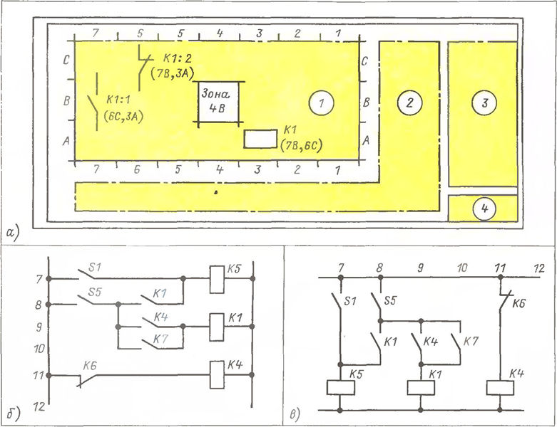
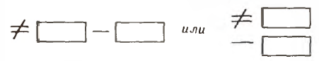
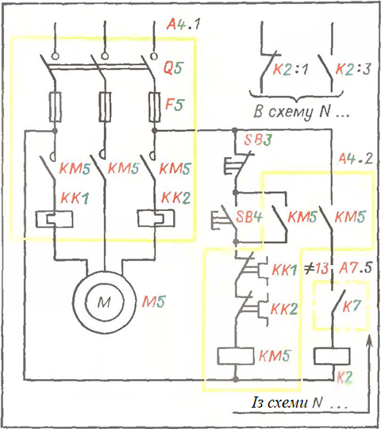

[<- До підрозділу](README.md)

# 4. Написи на схемах

Переклад та адаптація частини книги Е.А. Каминский. Практические приемы чтения схем электроустановок. 1988

Деякі частини тексту замінені більш актуальними на сьогоднішній день.

## 4.1. Загальні засади. Зони та рядки. Основний напис

Написи на схемах значно важливіші і складніші, ніж видається тим, хто не працював зі схемами на монтажі, при налагодженні та експлуатації. Суть справи у тому, що жодна схема може бути ні виконана, ні прочитана без написів. Йдеться, звичайно, не про словесний переказ змісту схеми. Такий переказ не тільки не потрібен, а й шкідливий. Він був би багатослівним і розпливчатим. Необхідні короткі написи, що конкретизують графічні позначення та доповнюють їх такими відомостями, які не можуть бути передані графічно.

До таких написів відносять: 

- а) позиційні позначення елементів та пристроїв, а також таблиці ”Перелік елементів”; 
- б) позначення типів, виконань у технічних характеристиках електричних машин, апаратів, приладів, комплектних пристроїв (станції управління, комплектні розподільні пристрої та ін.); 
- в) маркування виводів машин, трансформаторів, приладів, комутаційних апаратів; 
- г) маркування затискачів та роз'ємів; 
- д) позначення (маркування) різнопотенційних ділянок електричних кіл; 
- е) таблиці застосування; 
- ж) нумерація труб, кабелів, протяжних коробок; 
- з) посилання інші схеми, які слід розглядати разом із даною; 
- і) умови дії схеми та примітки; 
- к) розшифровка прийнятої системи позначень та маркування; 
- л) розшифрування позначень, що не є стандартними, якщо вони зустрічаються у схемі; 
- м) специфікації чи посилання ними; 
- н) позначення зон, у яких на схемі показані елементи пристрою та їх частини при рознесеному способі зображення, або нумерація рядків (ланцюгів);
- о) основний напис. 

Можуть бути й інші написи, якщо в конкретних умовах виникає необхідність.

На рис. 4.1,а показано взаємне розташування на кресленні: 1 — власне схеми, 2 — написів, що пояснюють, діаграм перемикань, приміток та ін., 3 — таблиці ”Перелік елементів”, 4 — основні написи (за старою термінологією кутового штампу).

**Основний напис** вказує найменування об'єкта (наприклад, насосна станція № 6), призначення схеми (управління насосами № 3-5), її вид (схема електрична), тип (принципова схема, схема з'єднань тощо), номер схеми, кількість листів (наприклад, 2), номер листа (наприклад, I). Можуть бути також зазначені: стадія розробки, наприклад, Р - робочі креслення, шифр схеми, наприклад, ЕЗ (схема електрична принципова) та ін. Зауважимо, що основні та низка інших написів на кресленнях виконують за СПДС (див. § 1.3). Забігаючи трохи вперед, підкреслимо, що ознайомлення з будь-якою схемою треба у всіх випадках починати з читання основного напису (у книзі — з підпису до рисунка). 

**Позначення зон** дозволяє вказати, в якому місці схеми знаходяться частини елементів, зображених рознесеним методом. Суть справи зводиться до того, що поле схеми поділяють на зони (клітини), подібно до шахівниці (рис. 4.1, а). З цією метою за вертикаллю пишуть літери A, B, C ... , по горизонталі - цифри 1, 2 .. Якщо подумки провести через вертикальні та горизонтальні межі зон лінії, то утворюються прямокутники – зони. Одна з них – зона 4В (або В4) показана на рис. 4.1,а. **Нумерація рядків (ланцюгів)** показано на рис. 4.1,б та в. Рядки можуть бути розташовані або горизонтально (рис. 4.1,6), або вертикально (рис. 4.1, в); рядки нумерують арабськими цифрами. Доцільність поділу схеми на зони та нумерації рядків з'ясується із вправи 4.1.

Ррис. 4.1. Розподіл схеми на зони. Нумерація рядків (ланцюгів). До вправи 4.1

Вправа 4.1. На рис. 4.1,а наведені вирізки зі схеми, де показано лише одне реле К1. Воно складається з трьох частин: 

- котушки К1, яка зображена на схемі у зоні 3А; 
- розмикаючого контакту К1:2 у зоні 6С 
- і замикаючого контакту К1:1 у зоні 7В.

Відповісти на запитання. 1. Що позначають написи у дужках? 2. У яких рядках розташовані частини реле К4 на рис. 4.1,б? 3. Не дивлячись на рис. 4„1,в, перерисувати схему рис. 4.1,6 так, щоб рядки були розташовані вертикально. 4. Чи потрібно одну і ту ж схему ділити на зони і вказувати на ній номери рядків?

Відповіді:

1. Написи у дужках показують, у яких зонах зображені інші частини реле К1. Наприклад, зображення в зоні В7 в дужках написало (6С, ЗА). Ці написи вказують на те, що інші частини реле показані в зонах 6С (контакт К1:2) та 3А (котушка К1). Читачам рекомендується самостійно вирішити, що має бути написано у дужках біля зображень -в зонах 6С і ЗА, а потім перевірити правильність своїх рішень, звернувшись до рис. 4.1,с.
2. Котушка у рядку 11, контакт ~ у рядку 9.
3. Правильна відповідь дано на рис. 4.1,в.
4. Не треба.

Звернемо увагу, що написів на схемі значно більше, ніж використаних у ній графічних позначень. Підкреслимо, що графічні позначення означені державними стандартами, завдяки чому їхнє різночитання безумовно виключено. Але до написів стандарти висувають лише загальні вимоги, а спосіб виконання написів встановлюють галузеві нормативні документи, різні у різних галузях. 

Переконаємось у справедливості сказаного, звернувшись до рис. 4.2. На ньому наведено вирізки зі схеми, в якій показано лише одне шестиконтактне реле. Його позиційне позначення К1 на рис. 4.2, повторено 7 разів: 1 раз у котушки і 6 разів у контактів. Крапками позначено їх виводи, біля яких написані червоні літери А і В і номери 13,14...64. Крім того, всі дроти, приєднані до виводів, мають марки 1,2...15 і 22 - сині цифри. На рис. 4.2,6 зображено те саме. Але на рис. 4.2.а, рядки перенумеровані - зелені цифри 1~8, а на рис. 4.2,6 поле схеми поділено на зони. Якщо подумки провести штрихпунктирні зелені лінії, то зрозуміло, що котушка знаходиться в зоні 4А, а контакт К1 з виводами 13 і 14 - в зоні 4В. 

Рис. 4.2. Найбільш поширені написи на схемах. До вправи 4.2

Під зображенням котушки вміщено табличку. У ній літери 3 і Р відповідно позначають1 замикаючий та розмикаючий контакти. На рис. 4.2,а у клітинах написані номери рядків (ланцюгів). З таблички випливає, що контакти, що замикають, входять у ланцюги 1, 4-6, а розмикаючі - в ланцюги 3 і 7. Табличку можна виконати інакше. Так, на рис. 4.2,а у центрі в клітинах написані дроби, де чисельники номера рядків, а знаменники — позначення виводів. Наприклад, рядок 4 показаний контакт з виводами 23 і 24. Праворуч ілюстрований ще один спосіб заповнення таблички. Тут чисельники, як і раніше, номери рядків, а знаменники — марки проводів, приєднаних до виводів контактів. Отже, до контакту у рядку 4 приєднані дроти 15 та 22. На рис. 4.2,6 у табличках замість номерів рядків вказані зони, у яких зображено контакти з ЗА показаний контакт з виводами 23 і 24 (табличка зліва) До цього ж контакту приєднані дроти 15 і 22 - табличка справа.

Зауважимо, що всі п'ять табличок, незважаючи на деякі відмінності, мають те саме призначення, всі правильні і всі вживані. Крім того, нод позиційним позначенням зображення контактів на рис. 4.2, а у дужках написаний номер рядка 2, а на рис. 4.2,6 - зона 4А, в якій показано котушка. Допустимо далі, що до схеми входить не одне, а десять таких же реле, і поставимо собі питання: 1) скільки умовних позначень потрібно для їхнього зображення? 2) скільки написів у схемі із десятьма реле? Відповіді, на перший погляд, виявляться неправдоподібними: 

1. Умовних позначень потрібно всього чотири - вони зображені на рис. 4.2,а праворуч і на них вказує червона стрілка. Вони прості, не допускають різних тлумачень, одним словом, у них не можна помилитись. 
2. Написів - 420, тобто в 105 разів більше (!), ніж умовних позначень: 7x10 = 70 позиційних позначень; 7x2x10 = 140 позначень виводів; 7x2x10 = 140 марок дротів; 6x10 = 60 посилань на номер ланцюга (зону), де зображено котушка; 10 табличок. Разом 70+140+140+60+10=420.

## 4.2. Позиційні позначення. Переліки елементів

Перш ніж докладно розглядати суть справи, підкреслимо, що з численних написів, які перераховані в § 4.1, далеко не всі можуть зустрітися в тій чи іншій схемі. Все залежить від її призначення, тобто від тих відомостей, які мають бути за допомогою схеми передані. Але у будь-якому разі на схемі мають бути позиційні позначення елементів. Без них; так само як і без графічних умовних позначень, схема може бути складена, ні прочитана.

### Позиційні позначення елементів

Позиційні позначення елементів будуються відповідно до ГОСТ 2.710 і складаються і прописних латинських або російських (рідше) літер та арабських цифр. Його пишуть на схемах праворуч від умовного графічного позначення або над ним (у книзі від цього правила через брак місця можуть бути відступи) і обов'язково в натурі: на панелях, табличках, якорях реле тощо, але не на кришках, що знімаються, так як кришки легко переплутати.

Позиційні позначення будують за певною системою. Вона визначена стандартом і ось у чому.
1. Літери та цифри розташовані у визначеному порядку без пробілів та без розділових знаків між ними.
2. У всіх без винятку випадках написано буквений код, що позначає вид елемента. У найпростішому випадку він складається з однієї, обов'язкової, літери, наприклад, R, С, Н, К і т. п.; більш складних з двох літер, наприклад НА, HL, КМ і т. п.
3. За літерним кодом обов'язково слідує порядковий номер у межах елементів даного виду, наприклад Rl, R2 ... R15 (резистори №1,2 і 15).
4. Ще правіше допускається (але не обов'язково!) писати ще одну або кілька букв, що означують функціональне призначення елемента. Наприклад, R2F - резистор №2, який використовується як захисний (запобіжний) - F.
5. Після власне позиційного позначення може бути поставлена (але не обов'язково!) або точка, або двокрапка, а за точкою (двокрапкою) слідує цифра (цифри). Якщо написана точка, то цифра (цифри) за нею – це номер частини елемента (пристрою) на схемі (але не в натурі) при рознесеному способі зображення. Наприклад, якщо частини елемента, що має позиційні позначення КМ4, зображені в трьох місцях схеми, їх умовно нумерують: КМ4.1 — перша частина, КМ4.2 ~ друга частина, КМ4.3 - третя частина.

Зверніть увагу: точку можна ставити у будь-якому випадку. Якщо потрібно підкреслити, що цифри ставляться до контакту, то точку замінюють двокрапкою. Наприклад, КМ4:2 та КМ4:5 відповідно позначають: другий та п'ятий контакти елемента КМ4. 

Підбиваючи підсумки, можна схематично уявити структуру позиційного позначення елемента наступним чином:

Таблица 4.1. Літерні коди видів елементів

Саме такі, прості, позначення найпоширеніші. Забігаючи трохи вперед (щоб в одному місці одразу ілюструвати всі можливі випадки), розглянемо ще одну структуру складеного позначення, а саме:

Тут знаки  $\ne$ не рівно і мінус $-$ це кваліфікуючі символи (докладніше див. нижче). Вони відповідно вказують на те, що в першому прямокутнику зліва позначено функціональну групу (наприклад, номер керованого механізму), а в другому власне позиційне позначення. Найпростіше зрозуміти суть справи, зіставивши записи так: $\ne4-SB1$ ; $\ne9-SB1$;  $\ne17-SB1$ З них випливає, що в однакових схемах трьох механізмів, а саме в схемах механізмів № 4, 9 та 7, використаний кнопковий вимикач SB1.

Літерні коди видів елементів утворюються за вказівками стандарту, де вони зведені до таблиці. Вирізки з неї у книзі наведено у табл. 4.1.
Звернімо увагу на таке. 1) Літерні коди, наведені у табл. 4.1. не вичерпують всього, що може зустрітися у конкретній схемі. І тут їх доповнює розробник, але має дати необхідні пояснення. 2) Не допуся застосовувати літери / і О, а також поєднання букв РЕ.

Дуже важливо не ускладнювати код без потреби. Це означає, що в тих випадках, коли можна обійтися однолітерним кодом, не потрібно застосовувати складніший дволітерний. Наприклад, якщо схема містить кілька магнітних пускачів, але в ній немає жодного реле, то магнітні пускачі позначають однією К (А7, К2, КЗ), а не двома КМ (КМ1, КМ2, КМЗ) літерами. І навпаки, якщо у схемі є і магнітні пускачі, і реле, то доводиться магнітні пускачі позначати двома літерами КМ (КМ1, КМ2, КМЗ), а реле – однією літерою К (КІ, К2, КЗ).

Літерні коди функціонального призначення елементів у схемах електроустановок застосовуються рідко. Тим не менш, читачам корисно мати про них поняття. Справа в тому, що з цими кодами можна зустрітися у обчислювальній техніці, схемах, побудованих на логічних елементах та аналогічних пристроях, що все ширше впроваджуються у схеми управління, автоматики, телемеханіки, захисту тощо. Ці коди наведені в табл. 4.2.

### Функціональні групи. Пристрої

Група елементів, що виконують певну функцію, але не об'єднані в єдину конструкцію, називається **функціональною групою**, яка позначається символом $\ne$. Наприклад, на рис. 4.4 функцію управління механізмом спільно виконують елементи Q5, КМ5, KKI, КК2, М5, SB3 і SB4. Деякі з них, а саме Q5, КМ5, КК1 і КК2 змонтовані на азбоцементній плиті, тобто конструктивно об'єднані, тому вони складають пристрій. Зверніть увагу: у функціональній групі більше елементів, ніж у пристрої; до пристрою не входять ні двигун M5, ні кнопкові вимикачі SB3 та SB4. Отже, пристрій у нашому разі - це лише частина функціональної групи; він називається функціональною частиною.

Типові приклади пристроїв: блок, плата, шафа управління, щит живлення, механізм, наприклад електропривод вимикача, і т. п. До пристроїв можуть бути віднесені прилади та апарати, призначені для певної мети, наприклад, манометри з електричними вихідними сигналами, електронні реле часу та т.п. Важливо усвідомити наступне. Пристрої можна розділити на дві великі групи.  До однієї з них відносяться ті, які мають самостійну принципову схему, призначені для певної мети і застосовуються в суворій відповідності з цією схемою. До них відносяться: блоки керування електродвигунами, стабілізовані джерела живлення, електронні реле часу і т. п. Іншу групу представляють пристрої, що не мають самостійної принципової схеми, як, наприклад, світлове табло, засувний привід, прості реле. Їх застосовують та приєднують тим чи іншим способом, дивлячись за конкретними умовами. Наприклад, кінцеві вимикачі приводу засувки можна з'єднувати різними способами. По-різному використовують лампи світлових табло, плати з наборами резисторів, діодів, реле тощо. Все це потрібно знати, як залежно від того, має будову самостійну принципову схему чи ні, пристрої на схемах графічно виділяють різними способами. Так, елементи, що входять у пристрій, що має самостійну схему, обводять суцільною лінією (контуром), що дорівнює товщині лініях зв'язку або вдвічі товщі (рис. 4.4 жовта). Елементи пристроїв, які не мають самостійної принципової схеми, обводять контуром зі штрихпунктирних ліній. Над контуром або праворуч від нього пишуть позиційне позначення пристрою. Позиційне позначення пристрою,
якщо воно сприймається як елемент схеми, складається з однієї обов'язкової літери А та порядкового номера.

Рис.4.4. Позиційні позначення елементів та пристроїв. До вправ 4.4 та 4.5

Іноді застосовують складове позначення, наприклад, $\ne5-А2$. Тут цифра 5 (у нашому прикладі) після кваліфікуючого символу $\ne$ (не дорівнює) є позначення функціональної групи, частиною якої є пристрій. Перед його позиційним позначенням А2 стоїть символ, що класифікує (мінус). У схемах, виконаних рознесеним способом, обійтися одним контуром зазвичай не вдається. Доводиться графічно (тобто на схемі) ділити пристрій на частини, а кожній з них надавати номер. Від позиційного позначення його відокремлюють крапкою. Наприклад, на рис. 4.4 таких частин дві: А4.1 та А4.2. Зауважимо тут, що у простих випадках, якщо схема невелика, номери частин опускають.

### Переліки елементів

Перелік елементів – це таблиця встановленої форми. Її поміщають або на першому аркуші схеми (якщо вона виконана на декількох аркушах) над основним написом (див. рис. 4.1), або на окремих аркушах. Якщо поле схеми розбите на зони (рядки), то перелік елементів доповнюють графою "зона" (рядок). Послідовність записів у переліку визначена стандартом.

Не вдаючись до деталей складання переліків, розглянемо кілька прикладів, щоб навчитися читати переліки. Попередимо читачів про те, що: 1) приклади ”не прив'язані” до конкретних схем; вони лише ілюструють типові записи; 2) записи скорочені порівняно з тими, які містять у переліках, а посилання на ГОСТ або інші документи, наприклад на технічні умови (ТУ), умовні; 3) фрагменти переліків зручності посилань ними названі таблицями. Розглянемо та порівняємо табл. 4.3 та 4.4

Таблиця 4 3. Перелік елементів. Перший спосіб

У них записано те саме, але різними способами: 

1) Після загального підкресленого заголовка ”Резистори” йдуть рядки, в яких вироби згруповані за типами та виконання. Прочитаємо перший рядок. З нього випливає, що тип резистора R1 - МЛТ. Його номінальна потужність, що розсіюється 0,5 Вт, опір 300 ком ± ± 57о. Резистор виконаний за ГОСТ ... Другий рядок відноситься до чотирьох резисторів (R2 - R5) типу ПЕВ, номінальною потужністю 10 Вт, опором 6 кОм ± ± 10% за ГОСТ...
2) Номери ДЕРЖСТАНДАРТ винесені в заголовок. Тому в наступних рядках вони не повторюються, завдяки чому записи в них виявилися коротшими.

Розглянемо фрагмент переліку елементів складної схеми (табл. 4.5), поле якої розділено на зони, а елементи у переліку розподілені за групами, у нашому прикладі: щит № 1; Ml 6; апаратура за місцем. Найменування груп підкреслені. На щиті № 1 встановлено: два реле К13 та К14 типу МКУ48-С (паспорт РАЧ.509.023П). Їхні котушки на схемі зображені в зонах 11В і 12А відповідно; .пост SB1 типу КУ-11У2 та амперметр РА1, показаний у зоні 2D. Далі слідує заголовок “Елементи управління електродвигунами М4 і М9”, а в графу “Позиційне позначення” записані не елементи, а позначення функціональних груп Ф4 та Ф9, до яких вони входять. Не вказано також зону. Звичайно, виникають питання: 1) Чому не вказана зона? 2) Чому до переліку елементів введено позначення не елементів, а функціональних груп? Відповімо на них. 1) Зона не зазначена тому, що написи $\ne4$ і $\ne9$ відносяться не до якогось одного елементу, а до всіх елементів, перерахованих у наступних рядках, у нашому прикладі HL1-HL3 y КТ1-КТЗ, а вони зображені в різних зонах. 2) Друге питання складніше. Справа в тому, що та сама схема відноситься не до однієї, а до двох функціональних груп. Через це на схемі зображення елементів і їх частин доводиться писати не просто позиційне, а складове позначення. У разі треба писати не М4 і М9У а ФМ4 і ФМ9 відповідно. Так, на схемі управління електродвигуном М4 пишуть Ф4 HLK Ф4 HL2, Ф4 HL3, Ф4 - КТ1, Ф4 - КТ2, Ф4-КТЗ, а на схемі управління двигуном М9 відповідно Ф9 HLL Ф9 HL2% Ф9 - HL3, Ф9 ~ КТ1, Ф9- КТ2, Ф9-КТЗ.

...

Таблиця 4.5. Перелік елементів складної схеми

Важливе зауваження. Форма переліку елементів (див. Табл. 4.3-4.5) встановлена стандартом. Але в ньому сказано, що в перелік елементів допускається вводити додаткові графи. І таке припущення має глибоке значення. Річ у тім, що схеми входять у систему ЕСКД і, отже, підпорядковані переважно потребам виробників електроустановок, а чи не наладчиків і експлуатаційних. У переліку вказані типи, номери стандартів та технічних умов, найменування документів та загальна кількість однотипних виробів. Все це потрібно конструкторам. Але експлуатаційнику важливо знати інше: навіщо служить кожен виріб. Перелік елементів не дає відповіді на це запитання. Тому налагоджувачі та експлуатаційники в ряді випадків змушені або доповнювати проектний перелік, або перебудовувати його, призводячи до вигляду, зручного для експлуатації. В результаті повинна вийти таблиця, що містить приблизно такі графи. містить приблизно такі графи.
1. Позиційне позначення, наприклад, S1.
2. Найменування та призначення – перемикач вибору режиму керування.
3. Тип УП531 2-С128.
4. Місце встановлення - станція управління.
5. Технічна характеристика – виконання відкрите, фіксація рукоятки в положеннях через 45°

...

### Повний склад буквено-цифрових позначень, які застосовуються в електричних схемах

Розглянуті вище позиційні позначення елементів, пристроїв та функціональних груп найбільш поширені у схемах електроустановок. Але крім них у складних схемах, наприклад у схемах обчислювальної техніки, застосовують складніші, складові буквено-цифрові позначення. Читачам вони можуть зустрітись. Тому, не вдаючись у деталі, повідомимо про них основні відомості

... не оброблено

### З якими позиційними позначеннями можна зустрітися практично

Все, що написано вище про позиційні позначення та переліки елементів, відповідає стандартам, що діють на час виходу книги. Але в схемах, випущених раніше і не втратили свого значення, як, наприклад, у виконавчій документації, а також у багатьох хороших і корисних книгах, можна зустрітися з іншими позиційними позначеннями та іншою формою переліків елементів. Повідомимо читачів про їх особливості

...

## 4.3. Позначення типів, виконань та видів елементів та комплектних пристроїв

У графі “Найменування” переліку елементів (див. табл. 4.3-4.5) наведено відомості, без знання яких не можна замовити електроустаткування. Серед них основними є типи, виконання та технічні характеристики елементів і пристроїв, встановлені підприємствами-виробниками, що містяться повністю в каталогах (див. § 6.2) і в скороченому вигляді в прейскурантах.Типи, виконання та технічні характеристики утворюються поєднанням літер та цифр, кожна з яких має строго певне значення. Воно визначається не тільки тією чи іншою літерою (цифрою), а й місцем, на якому вона розташована. Розглянемо кілька прикладів, попередивши читачів у тому, що наведені у яких типи з часом можуть змінитися, але суть справи, т. е. існування системи побудови позначень типів і виконань, збережеться.

...

## 4.4. Позначення виводів

Виводи елементів позначають декількома способами, спосіб визначається двома обставинами: конструкцією виробу та його розмірами. У найпростішому та найбільш сприятливому випадку, тобто якщо дозволяють розміри виробу і є місце для нанесення позначень, їх проставляють підприємства-виробники. Якщо місця немає, як, наприклад, у телефонних і кодових реле, напівпровідникових приладів, багатоконтактних проміжних реле у відкритому виконанні (приєднання пайкою), то виводи позначень не мають. Але в цих випадках домовляються за певною системою рахунку, що однозначно визначає місце виведення у виробі. Розглянемо ці питання докладніше, звернувшись до кількох типових прикладів.

### А. Виводи елементів позначені підприємством-виробником

### Б. Виводи елементів не позначені, але підприємства-виробники встановлюють сувору систему їхнього рахунку

### В. Виводи елементів не позначені. Систему їхнього рахунку визначають галузеві нормативні документи

Мал. 4.5. Позначення виводів елементів. До вправи 4.6

4.7. Позначення виводів комплектних пристроїв.

## 4.5. Система позначень (маркування) ланцюгів у електричних схемах

### Загальні положення

1. Порівняно недавно застосовувалися терміни: марка та маркування. В даний час слово маркування замінено словом позначення. Що таке марка? Марка - це позначення, наприклад номер (5, 17 ... ... 941), буква з цифрою (L1, О), буква зі знаком полярності (L+, L~) або просто знак (+, -). присвоєне ділянці ланцюга. Сукупність марок у схемі називається маркуванням. Маркуванням називають також процес нанесення марок на бирки-кінцівники провідників, панелі (поблизу вивідних шпильок апаратів) тощо. п.
2. Установлена стандартом система позначень ланцюгів застосовується тільки для ланцюгів управління, контролю та захисту електроустановок, але не поширюється на пристрої дротяного та радіозв'язку та інші спеціальні пристрої. 
3. Ділянки ланцюгів позначають незалежно від нумерації або умовних позначень затискачів (виводів) апаратів, приладів, електричних машин, до яких підходять (або відходять) кінці провідників (приклади дано на рис. 4.2).
4. Ділянки ланцюгів, розділені контактами апаратів, котушками, обмотками машин, резисторами, конденсаторами, діодами, вважаються різними ділянками та мають різні позначення. Ділянки, що сходяться в одному вузлі принципової схеми, а також проходять через нероз'ємні, розбірні або роз'ємні контактні з'єднання позначаються однаково. Однак дільницям ланцюга, що проходять через роз'ємні з'єднання, допускається надавати різні позначення (приклад дано на рис. 4.8,а).
5. Для позначень застосовують ряд послідовних чисел, а в необхідних випадках із літерною або числовою приставкою. Для цифрових позначень застосовують арабські цифри та великі літери латинського алфавіту. У електроустановках, виготовлених раніше, застосовувалися російські літери.
6. Ланцюги позначають у послідовності від введення джерела живлення до споживача, а ділянки, що розгалужуються, — зверху вниз у напрямку зліва направо. Зазвичай пропускають кілька номерів, залишаючи їх у резерві.
7. Допускається до позначення ланцюга включати позначення, що характеризують його функціональне призначення, наприклад, перед номером писати букву, запозичену з табл. 4.2. Приклад наведений нижче у вправі 4.11.
8. На схемі позначення (марки) проставляють біля кінців або всередині ділянки ланцюга: а) при вертикальному розташуванні ланцюгів — зліва (а не праворуч!) від зображення ланцюга; б) при горизонтальному розташуванні над зображенням ланцюга. Однак у технічно обґрунтованих випадках допускається проставляти позначення під зображенням ланцюга.

РНР. 4.8. Позначення виводів ланцюгів. До вправ 4.9-4.11

### Основні правила побудови позначень

У схемах постійного струму вхідні та вихідні ділянки позначають із зазначенням полярності: плюс "L+", мінус ”L-”, як показано на рис. 4.8,а, або просто ”+” та "-"(рис. 4.8,в). Середній провідник позначають буквою М (рис. 4.8 а). Ділянки позитивної полярності нумерують непарними, а негативної полярності – парними числами. Якщо в процесі роботи схеми ділянка змінює полярність, то ділянки, що не мають явно вираженої полярності (провідник, що з'єднує дві послідовно з'єднані котушки, резистори тощо), позначаються парними чи непарними числами.

У схемах однофазного змінного струму (фаза-нейтраль, фаза-фаза) ділянки ланцюгів позначають аналогічно ланцюгам постійного струму з додаванням індексу фази А, В, С або (IV). Індекс фази чи нейтралі пишуть перед цифровою частиною. Парні (непарні) числа можуть надаватися будь-яким ділянкам ланцюга будь-якої фази або нейтралі (нулю).

У схемах трифазного змінного струму ділянки ланцюгів позначають без поділу на парні та непарні з додаванням перед цифровою частиною індексу фази.

На рис. 4.8, наведений приклад, що показує трансформатор струму ТА1 фази А, вторинна обмотка якого живить амперметр РА1 і струмове реле КА1. Трансформатор струму ТА2 фази живить струмове реле КА2. Ділянки, що відносяться до фази А, мають позначення А40І і А402 до фази С401. Позначення нуля 0400.

Якщо індекс фази не потрібен, як, наприклад, в ланцюгах управління та сигналізації, його перед цифровою частиною позначення не вказують.

...

Мал. 4.10. Два варіанти виконання написів на одній схемі. До вправ 4.14 та 4.15. Схема програмного реле часу KTJ та діаграма перемикань його контактів показані нижче на рис. 5.8

Таблиця 4.7. Позиційні позначення до вправи 4.15

### Генеральне маркування

Термін генеральне маркування не є стандартним, але він широко застосовується у ряді провідних проектно-конструкторських організацій. Пояснимо суть справи, розглянувши такий приклад (рис. 4.11). У цьому прикладі три вентилятори: №9, 14 і 17 управляються за абсолютно однаковими схемами. Апаратура: 1 магнітний пускач КМ1; 2 - автоматичний вимикач QF1; 3 - перекли; Вибір режиму керування SA1 змонтовано в однакових блоках керування, які встановлені на загальному каркасі. Блоки виготовлені на електротехнічному заводі, і, природно, затискачі для приєднання зовнішніх провідників позначені абсолютно однаково - у прикладі 5, 7, 1! та 13. Припустимо, що від кожного блоку відходять кабелі № 32, 95 і 77 відповідно. Ці кабелі підходять до будь-якого пристрою, наприклад, до пульта керування. На пульті затискачі згруповані, але не за механізмами (як у блоках керування), а за призначенням. Наприклад, раніше йдуть три виведення 5, потім три виведення 13 і т.д. Або взагалі затискачі пульта мають номери, які не збігаються з номерами затискачів у блоках. Одним словом, якийсь ділянку ланцюга на схемі має одне позначення (одну марку), а в натурі - іншу. Наприклад, на блоці управління марка ділянки 5. на пульті 27, а на схемі 9-5, хоча ця ділянка одна потенційна і, отже, не може мати у схемі трьох марок. 

З цього скрутного, але неминучого становища виходять так: одне з позначень (одну марку) приймають за основну. Воно вказується на принциповій схемі і називається генеральним (головним) або, за термінологією, що склалася, генеральним маркуванням.

Рис. 4.11. Генеральне маркування. До вправи 4.16

## 4.6. Таблиці застосовності

Поширені споруди, в яких працюють кілька однотипних механізмів, наприклад, конвеєрів, вентиляторів, засувок з електричними проводами тощо. Схеми однотипних механізмів переважно однакові й розрізняються лише у деталях і маркування. У разі виконують схему лише з механізмів. На ній вказують, які зміни слід внести до схем інших, однотипних механізмів. Пояснимо суть справи, звернувшись до прикладу, який наведено на рис. 4.12.

З технологічної схеми, що пояснює, ясно, що дробарка не повинна працювати, якщо зупинено конвеєр № 5, в іншому випадку на ньому утворюється завал. Аналогічно конвеєр №6 (№7) не може працювати, якщо зупинено конвеєр №7 (№8). Одним словом, кожний попередній за технологічною схемою механізм має бути зблокований. з наступним. Але конвеєр №8 ні з чим блокувати не потрібно, тому що матеріал з нього надходить не на механізм, а в бункер. Інакше кажучи, у разі явно виражені два типи схем: з блокуванням (конвеєри № 5—7) і блокування — конвеєр № 8. Звідси випливає, що замість чотирьох схем, тобто. Для кожного конвеєра, можна обмежитися двома схемами (за кількістю типів). А у нашому випадку навіть однією схемою. Доведемо це за допомогою рис. 4.12. На рис. 4.12 наведено схему конвеєра № 5. На ній зображено три сині прямокутники П1-П3, в них укладені ті частини схеми, які при її застосуванні для інших конвеєрів повинні бути змінені. Зміст змін вказано в таблиці застосування. Розглянемо її рядок, що відноситься до конвеєра № 5 і позначимо вказівки, наведені в таблиці, зі схемою. Двигун конвеєра № 5 має позиційне позначення Ml – на схемі чорний напис. Але він входить до функціональної групи Ф5 (зелений напис). Тож на схемі написано не просто МІ, а Ф5-М1. Аналогічно, тобто. з додаванням позначення функціональної групи, побудовані позиційні позначення вимикача автоматичного ФЗ-QFl, запобіжника ФЗ-FUl, вимикачів кнопкових ФЗ-SBl і Ф5-БВ2, перемикача режимів управління Ф3-SA1, контактора ФЗ-КМ1, контакту датчика швидкості ФЗ-BVl. Крім того, перед позначеннями ділянок ланцюгів (чорні цифри 2, 5-7, 11, 12 і 13) поставлені зелені цифри 5. В результаті ділянки ланцюгів схем конвеєра N 5 будуть позначені
5-7; 5-5; 5-7; 5-77; 5-72 та 3-13. Далі слід звернутися до таблиці, в якій зазначено, що у прямокутниках П1-ПЗ повинні бути написи Ф6-КМ1, КТ1:4 та схему дробарки відповідно. Поступаючи аналогічно, легко уточнити написи на схемах інших конвеєрів.

Рис. 4.12. Таблиці застосування. До вправи 4.17

## 4.7. Інші написи на схемах

У цьому розділі докладно розглядалися найпоширеніші написи на схемах: позиційні позначення елементів та пристроїв (§ 4.2), позначення типів, виконань та видів елементів та комплектних пристроїв (§ 4.3), позначення виводів (§ 4.4), позначення ділянок ланцюгів в електричних схемах ( § 4.5), таблиці застосування (§ 4,6).

Крім цих дуже важливих і складних написів нерідко доводиться зображати таблиці перемикань апаратів зі складною схемою комутації, наприклад програмних реле, універсальних перемикачів, допоміжних контактів приводів, датчиків технологічного контролю тощо

Способи побудови та читання таких таблиць розглянуті в гл. 5. На схемах часом доводиться давати примітки. Наприклад, до схеми на рис. 4.12 слід було б дати таке: ''Схеми управління конвеєрами №6—8 аналогічні схемою управління конвеєром № 5 із змінами, зазначеними у таблиці застосування”.

Якщо в схемі є контакт (або інша частина апарату даної схеми), що входить (входить) в іншу схему, то зображення цього контакту (частини) пишуть, в яку схему він (вона) входить. Наприклад, на рис. 4.10 б близько контакту Ф6-КМ1 з виводами 9 і 10 написано ”У схему конвеєра № 5”. А у схемі конвеєра № 5 у зображення цього контакту має бути зазначено ”Зі схеми конвеєра № 6” тощо.

Щоб " " зв'язати " принципову схему з натурою, доводиться, якщо потрібно, наводити ескізи, пояснюють розташування контактів і котушок апаратів (приклади дано на рис. 4.2, 4.5, d і ж), або обумовлювати систему рахунки висновків (див. рис. 4.6). Це відноситься до роз'ємів, рядів затискачів, висновків електронних, іонних і напівпровідникових приладів, плат з наборами резисторів, конденсаторів і т.п.

Важливо підкреслити, що сказане вище сутнісно необхідно і правильно, але форма написів і місце їх розташування державними стандартами не визначено. Вони встановлюються галузевими нормативними документами.

