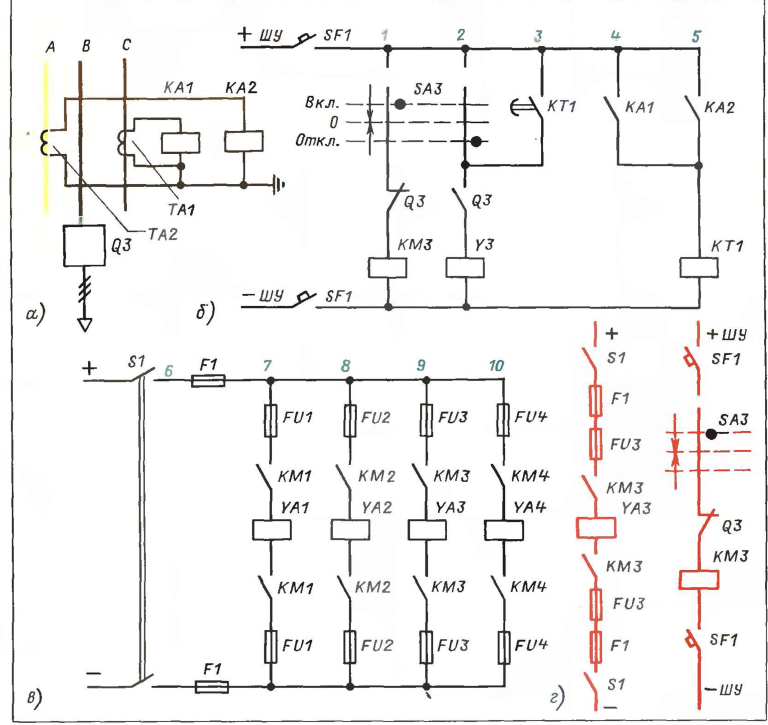

[<- До підрозділу](README.md)

# 8. Техніка читання та аналізу схем

Переклад та адаптація частини книги Е.А. Каминский. Практические приемы чтения схем электроустановок. 1988

Деякі частини тексту замінені більш актуальними на сьогоднішній день.

## 8.1. Основні відомості

Вивчаючи питання вище, ми, природно, усвідомлювали, що зображено на аналізованих схемах, оцінювали їх властивості, виявляли помилки і знаходили способи їх усунення. Одним словом, читали та аналізували схеми. В результаті накопичився достатній матеріал, щоб систематизувати та розвинути отримані відомості. А для цього потрібно встановити:

а) що означає “прочитати схему”;

б) що треба знати, крім умовних позначень, щоби читати схеми;

в) що треба знати на пам'ять і чого запам'ятовувати не слід;

г) які завдання вирішують, аналізуючи схеми;

д) якими критеріями керуються під час аналізу схем;

з) якими прийомами користуються під час читання та аналізу схем.

### Що означає прочитати схему

Прочитати схему - це означає почерпнути з неї відомості, необхідних для виконання певної роботи. Отже, читаючи розрахункову схему, одержують дані для складання схеми заміщення. Читаючи схему заміщення, дізнаються значення величин, які слід підставити у формули для обчислення кінцевого результату розрахунку.

Приклад 8.5. Читання принципової схеми рис. 8.4 має на меті знайти та усунути пошкодження, через яке не включається вимикач Q3.

1-й крок. Визначаємо, що зображено на схемі не вдаючись до переліку елементів. Це легко зробити, оскільки схема виконана у стандартних умовних позначеннях. Починати треба зі схеми головного ланцюга (рис. 8.4 а). На ній видно вимикач Q3, трансформатори струму ТА1 та ТА2 у фазах А і С, до вторинних обмоток яких приєднані струмові реле КА1 та КА2 відповідно. Отже, Q3 в ланцюгах 1 і 2 - це допоміжні контакти приводу вимикача, а КА1 і КА2 в ланцюгах 4 і 5 - контакти струмових реле (рис. 8.4,б). Далі міркуємо так. Вимикач має привід з двома електромагнітами: що включає і відключає. Отже, на схемі слід шукати позначення електромагнітів (у позиційному позначенні є обов'язковою літера Y). Але таких позначень на рис. 8.4 п'ять: Y3, YA1-YA4, а з них потрібно вибрати два, що відносяться до приводу вимикача Q3 (оскільки саме цей вимикач не включається), і визначити, який з них включає, а який відключає. Це питання допомагають вирішити такі безумовні факти: електромагніт, що відключає, споживає невеликий струм і тому безпосередньо включається в ланцюги управління (рис. 8.4,б). Електромагніт, що включає, живиться від потужної магістралі (рис. 8.4,в) через контакти проміжного контактора. Обмотка контактора живиться від ланцюгів керування. І дійсно, на схемі в ланцюзі 1 показана котушка контактора КМЗ, а в ланцюзі 2 електромагніт УЗ, мабуть, вони саме ті елементи, які ми шукаємо. Але як це перевірити? ....

рис.8.4. Схема керування вимикачем для прикладу 8.5.

### Що потрібно знати, крім умовних позначень, щоб читати схеми

Висновок 1

Щоб читати схему, потрібно мати достатні для кожного конкретного випадку знання з електротехніки. Уявімо собі людину, яка знає мову, але читає не зліва направо і зверху вниз і не рядок за рядком, а абияк, вихоплюючи окремі слова, читає з перепустками. Чи вийде щось путнє з такого “читання”? Також нічого не вийде з читання схеми, якщо не дотримуватись певного порядку. Читачі, які бажають переконатися у справедливості цього твердження, можуть спробувати вирішити приклад 8.3, починаючи, скажімо, не з 8-го, а з 2-го елемента, або, наприклад, змінити порядок у вирішенні прикладу 8.4.

Висновок 2

Потрібно знати порядок, у якому слід читати схеми. Це питання докладно розглянуто у § 8.5. Вирішуючи арифметичну задачу, можна перевірити правильність додавання відніманням, множення — поділом, вилучення кореня — зведенням у ступінь і т. п. Так само є ряд прийомів, за якими можна перевірити, чи правильно прочитана схема. Ми вже зустрічалися з такими прийомами на прикладі 8.4, де зіставлялося таке. По-перше, ми знали, що у приводу вимикача повинен бути електромагніт, що відключає, шукали його і знайшли. По-друге, знали, що в ланцюзі електромагніту повинен бути допоміжний контакт приводу, що замикає, шукали його і знайшли. По-третє, переконалися в тому, що до електромагніту, що відключає, приєднані і контакт реле часу струмового захисту, і той контакт ключа управління, який замикається, коли його рукоятку повертають у положення Вимк.

Висновок 3

У процесі читання схеми треба перевіряти правильність зроблених припущень, користуючись прийомами, або підтверджують або спростовують припущення. Отже, потрібно знати прийоми перевірки та вміти ними користуватися. Нерідко висновки, зроблені внаслідок читання схеми, не збігаються з фактами, отриманими у процесі випробування. І схема прочитана начебто правильно, але й фактам не можна не вірити. У цих випадках схема, мабуть ''надто схематична'', тобто в ній не відображені суттєві для даного випадку подробиці.

### Що потрібно знати на пам'ять і чого запам'ятовувати не слід

З наведених вище прикладів ясно, що заучувати схеми — марна справа. І разом з тим, щоб читати схеми, потрібно дещо знати на згадку так само, як потрібно пам'ятати таблицю множення і формули скороченого множення: 

1) потрібно пам'ятати найбільш поширені умовні позначення обмоток, котушок, контактів, трансформаторів, двигунів, випрямлячів ламп і т. п.;

2) треба пам'ятати умовні позначення, що застосовуються в тій галузі, з якою доводиться переважно стикатися з професії;
3) корисно пам'ятати схеми найбільш поширених вузлів електроустановок, наприклад схеми двигунів, випрямлячів, підсилювачів, схеми освітлення лампами розжарювання та газорозрядними лампами тощо (див. гл. 9);
4) потрібно знати властивості послідовного та паралельного з'єднань контактів, котушок індуктивностей, ємностей, опорів, видів з'єднань у зірку та трикутник. Ці властивості докладно розглянуті у § 7.3.

## 8.2. Схемні рішення не завжди реальні

## 8.3. Аналіз схем та його завдання

Принципові схеми, складені за умовами дії, коригують, виходячи з можливостей та особливостей обраної апаратури, умов експлуатації, монтажних та інших міркувань. Нарешті, при перекресленні схем, уточненні позиційних позначень та позначень ділянок ланцюгів можуть вкрастися помилки. Отже, схему потрібно перевірити або, як іноді кажуть, проаналізувати, щоб виявити та усунути недоліки. Аналіз схем - справа складна, копітка, що вимагає великої уваги та акуратності. Виклад у цьому параграфі побудовано в такий спосіб. Спочатку розглянуто допоміжну схему (рис. 8.9), на яку ми посилатимемося, щоб ілюструвати результати аналізу. Потім сформульовані основні завдання аналізу. тобто складено своєрідну програму дій. Далі розказано про вимоги, які не можна пред'являти до схем, і, нарешті, перелічені неполадки, які мають вважатися можливими, тобто такі неполадки, наслідки яких слід оцінювати під час аналізу схем.

...

## 8.4. Порівняння схем

## 8.5. В якому порядку доцільно читати схеми

### Загальні засади. 

Читання схеми завжди має певну мету, тобто підпорядковане завданням виконуваної роботи. Так, якщо потрібно дізнатися про систему електропостачання, схему читають зверху вниз (зліва направо), тобто від джерел енергії до споживачів (див. приклад 8.23). Якщо потрібно з'ясувати можливі варіанти живлення електроприймача, схему читають знизу вгору, тобто читання починають з цього електроприймача і потім йдуть до джерела енергії (див. приклад 8.24). І нарешті, якщо якийсь елемент схеми відмовив (див. приклад 8.5) або працює явно неправильно (див. рис. 8.6), то читання схеми починають з цього елемента і від нього йдуть до джерела живлення.

Майже на кожній схемі, що розглядається, є зазвичай посилання на інші схеми: як на ті схеми, з яких запозичені будь-які частини елементів (наприклад, контакти апаратів, повністю показаних на іншій схемі), так і на схеми, в які входять частини елементів даної схеми . (Приклад дано вище на рис. 4.4.). Зрозуміло, що спочатку треба підібрати всі взаємно пов'язані схеми, а також добре усвідомити прийняту систему позначень.

На схемі слід прочитати всі написи, починаючи з основної (див. гл. 4), і розібратися в схемах, що пояснюють, і таблицях перемикань (див. гл. 5). Читаються переліки елементів (§ 4.2) і обов'язково перебуває на схемі перелічене у переліку. Якщо наведені посилання інші схеми, треба розібратися у кожному їх. Наприклад, у схему входить контакт апарату, зображеного на іншій схемі. Отже, треба усвідомити, що це за апарат, навіщо служить, у яких працює і т.п. 

Читання схеми електропостачання ілюструють приклади 8.23 та 8.24. На рис. 8.11 наведена з деякими скороченнями (не показані, наприклад, роз'єднувачі) загальна схема електропостачання промислового підприємства. Воно отримує живлення від ТП4. На схемі прийняті скорочення: ПЛ - повітряна лінія, ГПП - головна низька підстанція, АВР ~ пристрій автоматичного включення резерву, РП1-РПЗ - розподільчі пункти, ТП1-ТП4 - трансформаторні підстанції. Ці скорочення є загальноприйнятими, тому вони в підписі до малюнків не розшифровані. Розібравшись у написах, звертаємось до графічних умовних позначень. Серед них немає нестандартних та загальноприйнятих. Тому можна приступити до читання схеми

