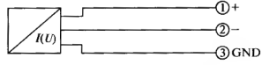
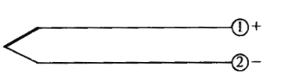
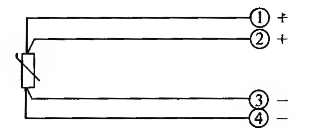
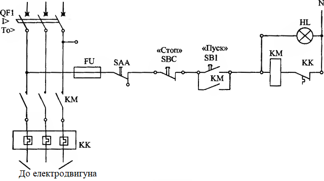
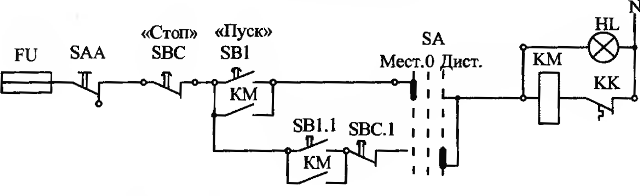
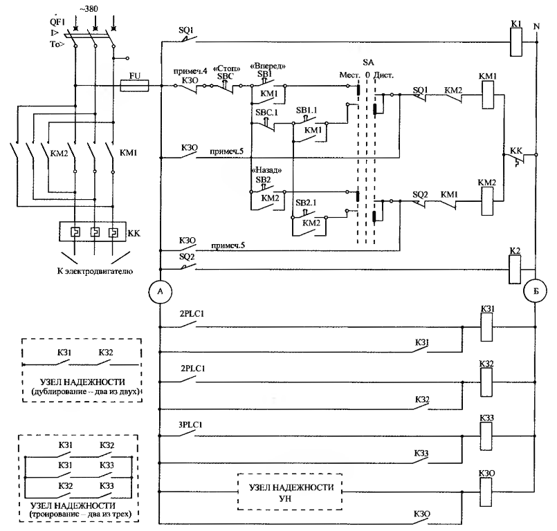
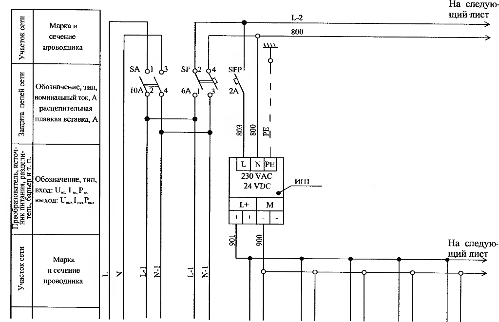
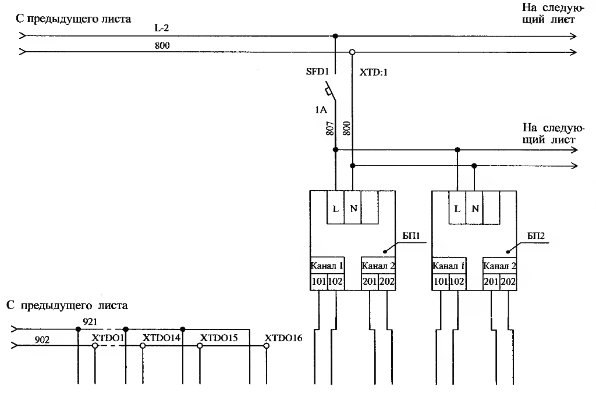

[<- До підрозділу](README.md)

# Позначення умовні графічні для електричних схем

Переклад та адаптація частини книги А.Л.Нестеров. Проектирование АСУТП. Методическое пособие.2009г.

## 13.1. Загальні вимоги

Принципові електричні схеми визначають дії апаратів, пристроїв та приладів щодо забезпечення вирішення задач контролю, вимірювання, захисту, блокувань, сигналізації, керування та регулювання автоматизованої системи керування технологічним процесом. Принципові схеми дозволяють проаналізувати дії всієї системи в цілому, а також окремих її елементів та кіл у взаємозв'язку їх з іншими колами та елементами. Принципові схеми є основою розробки інших матеріалів проектної документації: загальних видів щитів і пультів, схем з'єднань, підключень, специфікацій, кошторисних розрахунків та інших. 

Принципові електричні схеми по суті поєднують усі види функцій АСУТП — вимірювання, контроль, сигналізація, блокування, регулювання, захист, управління. Тому розробка принципових електричних схем передбачає виконання вимог створення АСУТП, викладених у розділі 5.

Окремі самостійні прилади, установки, пристрої та ділянки припускають створення їм принципових електричних схем. Окремі схеми, зазвичай, об'єднуються у принципових електричні схеми, які охоплюють комплекс приладів, установок і пристроїв, що становлять технічне забезпечення АСУТП.

Принципові електричні схеми АСУТП повинні дати повне уявлення про функціональну працездатність АСУТП, зв'язки між собою всіх елементів контролю, сигналізації, захисту, блокувань та управління.

Елементарні електричні кола, об'єднані у загальну принципову електричну схему у процесі проектування, проходять ітеративні доопрацювання з метою чіткого виконання вимог до системи, спрощення схем, їхньої мінімізації.

Розробник схем із застосуванням різноманітних програм САПР або без них обмежений низкою проектних, закупівельних та експлуатаційних вимог.

Серед обмежень, що накладаються на розробку електричних схем, зазначимо такі:
- Система електроживлення на проектованому об'єкті управління;
- Рід струму і величина напруги;
- електричні схеми електрообладнання, що включається до електросхем АСУТП для контролю, сигналізації, захисту, блокування та управління (є на об'єкті або обраного в частині ЕМ проекту);
- Наявність конкретних засобів автоматизації (датчиків, виконавчих механізмів та ін) на реконструйованому ТОУ;
- місця встановлення елементів електросхем (щити, приміщення, зовнішні установки);
— вибухо- та пожежонебезпечність приміщень та зовнішніх установок, у яких передбачається застосування окремих елементів АСУТП;
- Особливості експлуатації та режиму роботи АСУТП;

- Передбачуваний до використання банк засобів автоматизації (датчиків, перетворювачів, вторинних приладів, виконавчих механізмів, контролерів, сигнальної та керуючої апаратури, релейно-контактної апаратури, діодів, транзисторів, джерел живлення тощо);
- Передбачувана мережа передачі даних, вид кабельної продукції.

З урахуванням накладених обмежень принципова електрична схема має забезпечувати:
- Безпека роботи технологічного об'єкта управління;
- Зручність застосування запропонованих схемою рішень;
- Безпека обслуговування елементів електричної схеми;
- Надійність виконання функціональних дій технічного забезпечення АСУТП;
- Необхідне резервування малонадійних або найбільш відповідальних елементів і кіл;
- необхідні захисні внутрішньосхемні блокування проти хибних спрацьовувань;
- скорочення електроспоживання та часу знаходження окремих елементів схеми під напругою;
- скорочення числа елементів у схемі та обмеження їх номенклатури;
- запобігання розвитку аварійних ситуацій у колах електросхеми.

Принципова електрична схема повинна містити мінімально необхідну кількість органів управління з простим і ясним їх призначенням на вибір режимів роботи (автоматичний, дистанційний, ручний) та управління (пуск, стоп, вперед, назад, знімання звукового сигналу, випробування сигналізації тощо) .
У всіх випадках принципова електрична схема:

- Повинна бути виконана ясно, чітко;
- має бути легко читаною та мати необхідні написи, пояснення, примітки;
- має містити перелік елементів схеми як таблиці.

Перелічене повинне дозволити легко проаналізувати роботу електросхеми, визначити можливі несправності у схемі та їх наслідки.

## 13.2. Порядок розробки схеми

Розробка принципової електричної схеми є творчою роботою, що враховує наявну бібліотеку елементарних електричних кіл і функціональних вузлів, вид і розташування елементів схеми, вимоги «Технічного завдання», вимоги функціональної схеми АСУТП, передбачуваний банк засобів автоматизації та обчислювальної техніки.

Рекомендований порядок розробки електричних схем:
- Аналіз вимог до створення АСУТП;
- Аналіз вимог до схеми з боку схем функціональної та організаційної структур АСУТП;
- Встановлення типу електроживлення;

- визначення місця розташування датчиків, перетворювачів, виконавчих механізмів, регулюючих органів, умови вибухо- та пожежної безпеки в місцях їх встановлення;
- Визначення місця розташування апаратів вторинних кіл управління та контролю електрообладнання, пов'язаного з роботою принципової електричної схеми;
- Визначення місця розташування сигнально-командної апаратури, яка функціонуватиме в АСУТП;
- укрупнене визначення умов та послідовності дій основних елементів та вузлів схеми;
- підбір або розробка елементарних кіл для реалізації функцій АСУТП (вимірювання, контроль, блокування, захист, сигналізація, керування);
- Визначення типу програмованого контролера, засобів введення/виведення інформації, сигнально-командного обладнання;
- Визначення типу релейно-контакторної апаратури для схем управління, захисту та блокування;
- чітке уявлення територіально-просторового розташування елементів, які будуть використані в принциповій електричній схемі, при цьому обрані типи обладнання АСУТП та елементарних кіл дозволяють компонувати загальну принципову електричну схему, здатну реалізувати функціональні вимоги щодо створення АСУТП;
- визначення конкретних параметрів електроапаратів (числа та виду контактів, обмоток реле, живильних та захисних апаратів тощо);

- Вибір апаратури, що входить в принципову електричну схему;
- Коригування електросхеми, пов'язана з вибором апаратури;
- перевірка схеми з метою з'ясування хибних та обхідних кіл, аналіз роботи схеми при передбачуваних ушкодженнях елементарних кіл, контактів, джерел живлення;
- Розробка остаточної принципової електричної схеми;
- у разі потреби для складних схем проведення експериментальної перевірки та налагодження схеми на макетній або дослідній установці;
- Нанесення позначень кіл, контактів;
- Складання переліку елементів схеми по функціональним групам;
- Оформлення креслення за прийнятою в організації формі.

Рекомендований порядок розробки електросхем досить традиційний, проте вимагає творчого підходу проектувальника, який має достатній досвід розробки електросхем АСУТП. 

## 13.3. Правила виконання схем

У таблиці 13.Т1 наведено перелік стандартів за правилами виконання схем, умовним графічним зображенням елементів схем та позначення кіл принципових електричних схем проектів АСУТП.

| Позначення    | Найменуванн                                                  |
| ------------- | ------------------------------------------------------------ |
| ГОСТ 2.702-75 | ЕСКД. Правила виконання електричних схем                     |
| ГОСТ 2.709-89 | ЕСКД. Позначення умовних проводів та контактних з'єднань електричних елементів, обладнання та ділянок кіл в електричних схемах |
| ГОСТ 2.710-81 | ЕСКД. Позначення буквено-цифрові в електричних схемах        |
| ГОСТ 2.721-74 | ЕСКД. Позначення умовні графічні у схемах. Позначення загального застосування |
| ГОСТ 2.722-68 | ЕСКД. Позначення умовні графічні у схемах. Машини електричні |
| ГОСТ 2.723-68 | ЕСКД. Позначення умовні графічні у схемах. Котушки індуктивності, дроселі, трансформатори, автотрансформатори та магнітні підсилювачі |
| ГОСТ 2.727-68 | ЕСКД. Позначення умовні графічні у схемах. Розрядники, запобіжники |
| ГОСТ 2.728-74 | ЕСКД. Позначення умовні графічні у схемах. Резистори, конденсатори |
| ГОСТ 2.729-68 | ЕСКД. Позначення умовні графічні у схемах. Прилади електровимірювальні |
| ГОСТ 2.741-68 | ЕСКД. Позначення умовні графічні у схемах. Прилади акустичні |
| ГОСТ 2.747-68 | ЕСКД. Позначення умовні графічні у схемах. Розмір умовних графічних позначень |
| ГОСТ 2.755-87 | ЕСКД. Позначення умовні графічні в електричних схемах. Пристрої комутаційні та контактні з'єднання |

ГОСТ 2.701-84 присвячений класифікації схем, загальним вимогам до їх виконання та визначення основних понять, що використовуються у стандартах ЕСКД. Пунктом 1.3 ГОСТ визначається код принципової електричної схеми. Код складається з буквеної частини, що відповідає виду схеми - Е (електрична) та цифрової частини, що відповідає типу схеми - 3 (принципова або повна). Таким чином, код принципової електричної схеми позначається ЕЗ.

По ГОСТ 34.201-89 принципова електрична схема має код РБ (див. розділ 11).

Додаткова таблиця до принципової електричної схеми, що випускається як самостійний документ, має код ТЕЗ. В основний напис такого документа вказують найменування схеми та найменування документа, наприклад, «Перелік елементів» або «Характеристика вхідних і вихідних кіл ПЛК (4)».
Дозволяється виконувати схему на кількох аркушах або замість однієї схеми ЕЗ виконувати сукупність схем ЕЗ. У цьому кожна схема оформляється як самостійний документ. У найменуванні таких документів слід зазначати найменування схеми та назву функціональної групи або функціонального кола (наприклад, схема електрична принципова живлення ПЛК (4)). До коду схеми позначення додається через точку порядковий номер, виконаний арабськими цифрами (Е3.1, Е3.2 і т. д.).

Загальні вимоги до виконання схем викладено у розділі 11.2 «Посібника», які необхідно враховувати під час розробки принципових електричних схем (комплектність, формат, масштаб, лінії зв'язку, перелік елементів, текстова інформація).

У розділі конкретизуються правила виконання принципових електричних схем відповідно до ГОСТ 21.408-93.

## 13.4. Позначення в електричних схемах

### 13.4.1. Умовні графічні позначення

На схемі зображуються всі електричні елементи та пристрої, необхідні для виконання функціонального завдання та здійснюють електричні процеси, а також електричні зв'язки між ними та вхідні/вихідні елементи електричних кіл. Наведемо скориговані пояснення термінів, застосованих у розділі.

**Електричний елемент схеми** - складова частина електричної схеми, яка виконує певну функцію у схемі і не може бути розділена на частини, що мають самостійні призначення (резистор, трансформатор, автоматичний вимикач, реле тощо).

**Електричний пристрій** - сукупність електроелементів, що представляє єдину конструкцію (шафа, пульт, виконавчий механізм, сполучна коробка тощо).

**Електричне коло** - лінія, канал, тракт певного призначення (включення обмотки реле, живлення електроприладу тощо).
Ділянка електричного кола - частина лінії, що зв'язує канали окремі електричні елементи між собою.

Схема виконується у стані, відключеному від джерела електроживлення та без зовнішнього впливу на механічні частини електричних пристроїв та елементів.

При необхідності допускається зображати елементи та пристрої, що знаходяться під зовнішнім навантаженням або при включеному електроживленні з обов'язковою вказівкою про це на полі креслення.

Елементи та пристрої на схемі зображуються у вигляді умовних графічних позначень, які наведені у таблиці [13.Т 2](нетсеровуго.md) .

Елементи та пристрої зображуються суміщеним або рознесеним способом, допускається часткове неповне зображення з показом лише частин або пристроїв, що використовуються.

При суміщеному способі складові елементів або пристроїв зображуються на схемі в безпосередній близькості один до одного.

При рознесеному способі складові елементів або пристроїв зображуються на схемі в різних місцях, що дозволяє окремі кола зображати наочно.
В одній схемі можна використовувати одночасно обидва способи зображення. При рознесеному способі рекомендується вільному полі креслення поміщати умовні графічні позначення елементів, виконані суміщеним способом.

Схеми виконуються без дотримання масштабу (розміри умовних графічних позначень встановлюються ГОСТ 2.747-68 або у стандартах на відповідні позначення)

Просторове положення пристроїв або елементів зазвичай не враховується. Однак переважним є зображення елементів та пристроїв функціональної групи або установки (щит, пульт, приміщення, зовнішня установка тощо) у суміжних колах електросхеми з окресленням (виділенням) штрих-пунктирною лінією та зазначенням найменування або позначення функціональної групи, установки або приміщення .
При рознесеному способі схеми ЕЗ, як правило, виконуються так званим малим способом.

Електричне коло зображується прямою лінією, в яку послідовно (частково паралельно) включаються умовні графічні позначення елементів або їх складових частин. Окремі кола зображуються поруч, утворюючи паралельні рядки. Рядки можуть бути вертикальними або горизонтальними. Рядки не повинні мати зламів і мати мінімальну кількість перетинів. Так, наприклад, електрична схема живлення зазвичай виконується вертикальними рядками.

Принципова електрична схема з текстовими поясненнями призначення кіл чи найменуванням окремих елементів кіл (текстові пояснення наводяться у прямокутниках навпроти електричного кола) виконується горизонтальними рядками, оскільки текст зручніше розміщувати горизонтально.

Рядки допускається нумерувати арабськими цифрами, що дозволить спростити читання схеми та знаходження окремих складових частин елементів та пристроїв. Про це буде сказано докладніше у розділі 13.4.2 «Літерно-цифрові позначення».

Схеми зазвичай виконуються в багатолінійному зображенні, коли кожне коло зображується окремою лінією, а елементи кола окремими умовними графічними позначеннями.

Іноді, найчастіше для схеми живлення, використовують однолінійне зображення кіл, що виконують ідентичні функції, коли кола зображуються однією лінією, а однакові елементи цих кіл - одним графічним позначенням.

### 13.4.2. Літерно-цифрові позначення

ГОСТ 2.709-89 встановлює систему позначень та правила нанесення позначень кіл у принципових електричних схемах.

ГОСТ 2.710-81 встановлює систему позначень електричних елементів, пристроїв, функціональних груп, що зображені на схемі ЕЗ.

Літерно-цифрові (цифрові, буквені) позначення мають на меті ідентифікувати кожен з елементів або пристроїв, показаних на схемі у графічному вигляді, дати короткі відомості про них (резистор R, конденсатор С, діод Д тощо), робити посилання на них у переліку елементів, поясненнях, примітках робити посилання на інших схемах (з'єднань, підключень). Крім того, буквено-цифрові позначення, прийняті у схемі ЕЗ, наноситимуться на елементи, фактично встановлені на виробах, виготовлених за цим проектом (проводи, кабелі, труби та ін.).

ГОСТ 2.710-81 встановлює такі типи умовних буквено-цифрових позначень:
- Вищий рівень;
- функціональна група;
- Конструктивне розташування;

- позиційне розташування;
- Електричний контакт;
- адреса

Крім перелічених типів встановлено складове позначення.

У таблиці 13.T3 наведено типи умовного буквено-цифрового позначення, їх кваліфікуючі символи, призначення та застосовність.

Таблиця 13.Т3. 

| Тип умовного позначення                     | Кваліфікаційний символ                                       | Призначення умовного позначення та його символа              |
| ------------------------------------------- | ------------------------------------------------------------ | ------------------------------------------------------------ |
| Вищий рівень пристрою                       |  | Об'єкт, що має схему та перелік елементів (застосовуємо лише у складових позначеннях) |
| Функціональна група                         |  | Функціональна група (зазначає призначення функціональної групи) |
| Конструктивне розташування                  |  | Вказує місце розташування елемента або пристрою в системі    |
| Позиційне розташування елемента чи пристрою |  | Елемент або пристрій, що входить до системи (вказує вид елемента, його порядковий номер, функцію елемента системи) |
| Електричний контакт                         |  | Електричний контакт (виведення) елемента або пристрою в системі |
| Адреса                                      |  | Місце на документі, в якому міститься графічне позначення або опис елемента (пристрою, функціональної групи), (застосовується лише у складовому позначенні) |

Дозволяється застосовувати не встановлені стандартом позначення. Зміст та спосіб запису таких позначень пояснюють на полі схеми.

Для побудови позначень використовують великі літери латинського алфавіту, арабські цифри, а також символи, що кваліфікують. Позначення записують у вигляді послідовності букв, цифр та знаків в один рядок без пробілів. Кількість знаків у позначенні стандартом не встановлюється.

Розробник схеми Е3 визначає необхідність застосування тих чи інших типів позначень. У важливих електричних схемах проектів АСУТП, зазвичай, застосовуються:
- Позиційне позначення елементів схем;
- Позначення електричного контакту;
- Складове позначення.

Позначення вищого рівня - це додаткове, але не обов'язкове позначення, яке визначає більшу частину об'єкта управління, ніж частина цього об'єкта.
Позначення конструктивного розташування призначене для вказівки місця будь-якої частини об'єкта в системі управління.

Позначення конструктивного розташування застосовується в АСУТП і під час структурної схеми комплексу технічних засобів і схеми автоматизації.

Надане позначення конструктивного розташування частини об'єкта використовується при розробці принципової електричної схеми.

Прикладом може служити схема вимірювання, схема введення аналогового сигналу модуль Ai контролера ПЛК11 за [схемою 17.Сх6](nesterov17cx6.md). На схемі вказано позначення первинного вимірювального перетворювача за схемою автоматизації. Це позначення прив'язане до розташування перетворювача, який у свою чергу прив'язаний до частини технологічного об'єкта, а саме до насосного агрегату (211, 212).

Умовне позначення, що складається з більш ніж одного умовного позначення різного типу і передає сукупність відомостей, що становлять його умовних позначень, називається складовим позначенням.

Останнє (складове) позначення утворюється з позначення функціональної групи та позиційного позначення, а також можливо, позначення електричного контакту.

### 13.4.3. Позначення функціональних груп

Позначення функціональної групи утворюється з літер, що в скороченій формі вказують призначення або функцію групи, і цифри/цифр порядкового номера цієї групи в числі ідентичних груп. Наприклад, група, яка входить у сферу дії програмованого логічного контролера №2 або №5, позначається $\ne$ПЛК2 або $\ne$ПЛК5.

### 13.4.4. Позначення позиційного розташування

Позиційні позначення елементів і пристроїв присвоюються в межах кожної електричної схеми, починаючи з одиниці в межах групи елементів або пристроїв, яким на схемі присвоюється однакове літерне позначення (`R1`, `R2`, `R3` і т. д., `C1`, `С2`, `СЗ` і т.д.). Позиційне позначення елемента складається в загальному випадку з трьох частин, що записуються без розділових знаків і пробілів, і вказують:
- Вид елемента;
- Номер елемента;
- Функцію елемента.

При цьому перші дві частини є обов'язковою частиною умовного буквено-цифрового позначення, а третя (функція елемента) не є обов'язковою.

Вид елемента має дволітерний код відповідно до таблиці 13.Т4 А. Елементи розбиті на групи за видами, що мають однозначне позначення (А, В, С, D тощо) - таблиця 13.Т4.

| Літерний код | Функціональне значення елемента                              |
| ------------ | ------------------------------------------------------------ |
| А            | Допоміжний                                                   |
| В            | Напрямок руху (вперед, назад, вгору, вниз, за годинниковою стрілкою, проти годинникової стрілки) |
| С            | Зчитуючий                                                    |
| D            | Диференційний                                                |
| F            | Захисний                                                     |
| G            | Випробовувальний                                             |
| Н            | Сигнальний                                                   |
| I            | Інтегруючий                                                  |
| К            | Що штовхає                                                   |
| М            | Головний                                                     |
| N            | Вимірювальний                                                |
| Р            | Пропорційний                                                 |
| Q            | Стан (старт, стоп, обмеження)                                |
| R            | Повернення, скидання                                         |
| S            | Запам'ятовування, запис                                      |
| Т            | Синхронізація, затримка                                      |
| V            | Швидкість (прискорення, гальмування)                         |
| W            | Додавання                                                    |
| X            | Розмноження                                                  |
| Y            | Аналоговий                                                   |
| Z            | Цифровий                                                     |

Уточнення виду елемента провадиться присвоєнням двозначного коду.

Порядкові номери надаються залежно від:

- послідовності розташування елементів або пристроїв на схемі зліва направо при горизонтальних рядках і зверху вниз при вертикальних рядках і далі у напрямку рядків;
- Розміщення елементів в щитах, пультах, приміщеннях;
- Напрямки проходження сигналів;
- функціональної послідовності процесу.

При внесенні змін до раніше випущеної схеми послідовність присвоєння порядкових номерів може бути порушена. Якщо пристрій, зображене на схемі, немає самостійної принципової електричної схеми, то позиційні позначення елементів присвоюються межах даного пристрою порядку, викладеному вище. Функція елемента (якщо розробник вважає її за необхідне вказувати) має літерний код за таблицею 13.Т4А з цифровим або літерним доповненням, яке пояснюється на полі схеми. У переліку елементів схеми можна вказувати лише першу та другу частини позначення

Таблиця 13.Т4 А

| Перша буква в коді (обов'язкова) | Група елементів                                              | Типи елементів                                               | Двобуквений код |
| -------------------------------- | ------------------------------------------------------------ | ------------------------------------------------------------ | --------------- |
| **А**                            | Пристрої (загальне призначення)                              | Підсилювачі, прилади, телекерування, лазери, мазери          | -               |
| **В**                            | Перетворювачі неелектричних величин на електричні (крім генераторів та джерел живлення) або, навпаки, аналогові або багаторозрядні перетворювачі або датчики для вказівки або вимірювання | Гучномовець                                                  | ВА              |
|                                  |                                                              | Магнітострикційний елемент                                   | ВВ              |
|                                  |                                                              | Детектор іонізуючих випромінювань                            | BD              |
|                                  |                                                              | Сельсин-приймач                                              | BE              |
|                                  |                                                              | Телефон (капсюль)                                            | BF              |
|                                  |                                                              | Сельсин-датчик                                               | ВС              |
|                                  |                                                              | Тепловий датчик                                              | ВК              |
|                                  |                                                              | Фотоелемент                                                  | BL              |
|                                  |                                                              | Мікрофон                                                     | BM              |
|                                  |                                                              | Датчик тиску                                                 | ВР              |
|                                  |                                                              | П'єзоелемент                                                 | ВО              |
|                                  |                                                              | Датчик частоти обертання                                     | BR              |
|                                  |                                                              | Звукознімач                                                  | BS              |
|                                  |                                                              | Датчик швидкості                                             | BV              |
| **С**                            | Конденсатори                                                 |                                                              | -               |
| **D**                            | Мікросхеми                                                   | Пристрої зберігання інформації                               | DS              |
|                                  |                                                              | Пристрій затримки                                            | DT              |
| **Е**                            | Елементи різні (освітлювальні, нагрівальні)                  | Нагрівальний елемент                                         | ЕК              |
|                                  |                                                              | Лампа освітлювальна                                          | EL              |
| **F**                            | Розрядники, запобіжники, пристрої захисні                    | Дискретний елемент захисту за струмом миттєвої дії           | FA              |
|                                  |                                                              | Дискретний елемент захисту струму інерційної дії             | FP              |
|                                  |                                                              | Розрядний елемент                                            | FR              |
|                                  |                                                              | Розрядний елемент для захисту струму миттєвої дії            | FS              |
|                                  |                                                              | Запобіжник плавкий                                           | FU              |
|                                  |                                                              | Дискретний елемент захисту напруги, розрядник                | FV              |
| **G**                            | Генератори, джерела живлення                                 | Батарея                                                      | GB              |
| **Н**                            | Пристрої індикаційні та сигнальні                            | Прилад звукової сигналізації                                 | НА              |
|                                  |                                                              | Індикатор символьний                                         | HG              |
|                                  |                                                              | Прилад світлової сигналізації                                | HL              |
| **К**                            | Реле, контактори, пускачі                                    | Реле струмове                                                | КА              |
|                                  |                                                              | Реле вказівне                                                | КН              |
|                                  |                                                              | Реле електротеплове                                          | КК              |
|                                  |                                                              | Контактор, магнітний пускач                                  | КМ              |
|                                  |                                                              | Реле поляризоване                                            | КР              |
|                                  |                                                              | Реле часу                                                    | КТ              |
|                                  |                                                              | Реле напруги                                                 | KV              |
| **L**                            | Котушка індуктивності, дроселі                               | Дросель люмінесцентного освітлення                           | LL              |
| **М**                            | Двигуни електричні                                           |                                                              | -               |
| **P**                            | Прилади, вимірювальне обладнання (сполучення `PE` не допускається) | Амперметр                                                    | РА              |
|                                  |                                                              | Лічильник імпульсів                                          | PC              |
|                                  |                                                              | Частотомір                                                   | PF              |
|                                  |                                                              | Лічильник активної енергії                                   | PI              |
|                                  |                                                              | Лічильник реактивної енергії                                 | РК              |
|                                  |                                                              | Омметр                                                       | PR              |
|                                  |                                                              | Реєструючий прилад                                           | PS              |
|                                  |                                                              | Годинник, вимірювач часу                                     | РТ              |
|                                  |                                                              | Вольтметр                                                    | PV              |
|                                  |                                                              | Ваттметр                                                     | PW              |
| **Q**                            | Вимикачі та роз'єднувачі в силових колах                     | Вимикач автоматичний                                         | OF              |
|                                  |                                                              | Короткозамикач                                               | QK              |
|                                  |                                                              | Роз'єднувач                                                  | QS              |
| **R**                            | Резистори                                                    | Терморезистор                                                | RK              |
|                                  |                                                              | Потенціометр                                                 | RP              |
|                                  |                                                              | Шунт вимірювальний                                           | RS              |
|                                  |                                                              | Варістор                                                     | RV              |
| **S**                            | Пристрої комутаційні в колах керування, сигналізації та вимірювальних | Вимикач або перемикач                                        | SA              |
|                                  |                                                              | Вимикач кнопковий                                            | SB              |
|                                  |                                                              | Вимикач автоматичний (застосовують для апаратів, що не мають контактів силових кіл) | SF              |
|                                  | Вимикачі, які спрацьовують від різних впливів:               |                                                              |                 |
|                                  |                                                              | - рівня                                                      | SL              |
|                                  |                                                              | - тиску                                                      | SP              |
|                                  |                                                              | - Положення (шляховий)                                       | SQ              |
|                                  |                                                              | - Частоти обертання                                          | SR              |
|                                  |                                                              | - температури                                                | SK              |
| **T**                            | Трансформатори, автотрансформатори                           | Трансформатор струму                                         | ТА              |
|                                  |                                                              | Електромагнітний стабілізатор                                | TS              |
|                                  |                                                              | Трансформатор напруги                                        | TV              |
| **U**                            | Пристрої зв'язку. Перетворювачі електричних величин на електричні | Модулятор                                                    | UB              |
|                                  |                                                              | Демодулятор                                                  | UR              |
|                                  |                                                              | Дискримінатор                                                | UI              |
|                                  |                                                              | Перетворювач частотний інвертор, генератор частоти, випрямляч | UZ              |
| **V**                            | Прилади електровакуумні та напівпровідникові                 | Діод, стабілітрон                                            | VD              |
|                                  |                                                              | Прилад електровакуумний                                      | VL              |
|                                  |                                                              | Транзистор                                                   | VT              |
|                                  |                                                              | Тиристор                                                     | VS              |
| **W**                            | Лінії та елементи НВЧ, антени                                | Відгалужувач                                                 | WE              |
|                                  |                                                              | Короткозамикач                                               | WK              |
|                                  |                                                              | Антена                                                       | WA              |
| **X**                            | З'єднання контактні                                          | Струмознімач, контакт ковзний                                | ХА              |
|                                  |                                                              | Штир                                                         | ХР              |
|                                  |                                                              | Гніздо                                                       | XS              |
|                                  |                                                              | З'єднання розбірне                                           | XT              |
|                                  |                                                              | Високочастотний з'єднувач                                    | XW              |
| **Y**                            | Пристрої механічні з електромагнітним приводом               | Електромагніт                                                | YA              |
|                                  |                                                              | Гальмо                                                       | YB              |
|                                  |                                                              | Муфта                                                        | YC              |
|                                  |                                                              | Електромагнітний патрон                                      | YH              |
| **Z**                            | Пристрої кінцеві, фільтри, обмежувачі                        |                                                              | **-**           |

### 13.4.5. Позначення електричного контакту

Позначення електричного контакту складається з комбінації літер та цифр. Позначення контакту повинно відповідати маркуванню на виробі або маркуванню, зазначеному в документації на виріб. Якщо позначення контактам надають при розробці проекту, їх позначають номерами. Дозволяється позначати номерами конструктивні групи контактів.

Для відмінності на схемі позначень виводів електричних контактів з інших позначень (електрокіл та ін.) слід записувати позначення виводів з відповідним кваліфікуючим символом (див. таблицю 13.T3); на важливих електричних схемах вказують умовні точки у виводів від елемента з позначенням номерів контактів.

### 13.4.6. Адресне позначення

Адресне позначення - умовне позначення складається з трьох частин:
- позначення документа, з яким сполучається даний документ;
- позначення номера аркуша зазначеного документа;
- адреса частини аркуша документа, з яким сполучається цей елемент.

Усі частини адресного позначення записуються в дужках у вказаному порядку та відокремлюються один від одного крапками. Адреса частини аркуша відповідає номеру рядка, або позначенню зони аркуша, де розташоване зображення або опис елемента або групи. Зона аркуша визначається полем аркуша схеми, позначення поля по вертикалі здійснюється літерами латинського алфавіту, а по горизонталі – арабськими цифрами (наприклад, А5, В1, С4 тощо)

### 13.4.7. Позначення кіл/маркування кіл

ГОСТ 2.709-89 встановлює систему позначень та правила нанесення позначень кіл (силових, керування, захисту, сигналізації, автоматики, вимірювання) в електричних схемах. Позначення ділянок кола служить їхнього розпізнавання і відбиває їх функціональне призначення електричної схемою.

Ділянки кола, розділені контактами апаратів, обмотками реле, приладів, машин, резисторами та іншими елементами повинні мати різні позначення, а ділянки, що проходять через роз'ємні, розбірні або нерозбірні контактні з'єднання — однакові.

При розробці принципових електричних схем АСУТП використовуються два способи позначення електричних кіл або маркування кіл:

- Потенційний;
- адресний чи зустрічний.

Потенційний спосіб маркування кіл виходить із положення, що всі кола, що мають однаковий потенціал, тобто кола, що сходяться в одному вузлі електричної схеми або проходять через роз'ємні контактні з'єднання, повинні мати однакові позначення/маркування. При потенційному маркуванні ділянки кіл позначаються незалежно від позначення чи нумерації клем, затискачів, контактів тощо. п., до яких приєднуються кінці маркованих ділянок кіл. Послідовність позначення здійснюється від введення джерела живлення до споживача, а ділянки, що розгалужуються, — зверху вниз у напрямку зліва направо.

Для позначення використовують великі літери латинського алфавіту та арабські цифри, виконані одним розміром шрифту. Не рекомендується застосовувати літери `І` та `О`. Для зручності користування схемою допускається при позначенні кіл залишати резервні номери або пропускати номери.

Для силових кіл змінного струму прийняті позначення `L1, L2, L3` та послідовні числа. Наприклад, ділянки кола першої фази `L1` позначають `L11, L12, L13, ...`, другої фази `L2` - `L21, L22, L23, ...,` третьої фази `L3`-`L31, L32, L33` і т.д. буд. Допускається, якщо це не викличе помилкового підключення, позначати 1,2 і 3 фази відповідно літерами `А`, `В`, `С`. Нейтральний провід позначають літерою `N`.

Силові кола постійного струму позначають: ділянки кіл позитивної полярності – непарними числами, негативної полярності – парними числами. Вхідні та вихідні ділянки кола позначають із зазначенням полярності плюс `L+` та мінус `L-`. Дозволяється застосовувати лише знаки `+` та `-`. Середній провід позначають літерою `М`. 

Дозволяється позначати кола послідовними числами. Кола управління, захисту, сигналізації, автоматики, вимірювання позначають послідовними числами в межах виробу або установки. Допускається позначення кола включати позначення, що характеризує функціональне призначення кола. І тут послідовність чисел допускається встановлювати не більше функціонального кола. Допускається в позначення кіл управління, захисту, сигналізації, автоматики, вимірювання включати позначення фаз, наприклад, `А 401`, `С 401`, а також 1-фазних (фаза-нуль) і 2-фазних (фаза-фаза) несилових колах змінного струму ділянки кіл позначати парними та непарними числами

Маркування кіл в АСУТП слід проводити за функціональною ознакою (наприклад):
- кола управління, регулювання - група чисел від 1 до 399;
- кола сигналізації - 400-799;
- кола живлення - 800-999.

Позначення проставляють близько кінців чи середині ділянки електричного кола: при вертикальному розташуванні кіл — ліворуч від зображення, при горизонтальному — над зображенням кола. У технічно обґрунтованих випадках дозволяється проставляти позначення під зображенням кола.
Адресний або зустрічний спосіб маркування враховує ту обставину, що електрична схема має позначення затискачів, виводів елементів, засобів автоматизації. Це дозволяє на кожному кінці ділянки кола вказувати марку елемента або засоби автоматизації, що приєднується до протилежного кінця цієї ділянки, що визначаються згідно з ГОСТ 2.710-81.

Спосіб позначення електричного кола визначається розробником схеми з урахуванням складності схеми, складності виконання та обсягу монтажної схеми та вимог підприємств-виробників щитів, пультів та монтажних організацій. Потенційний спосіб маркування, як правило, застосовується при розробці нескладних схем, що передбачають невеликі схеми комутації, що виконуються графічним способом цієї електричної схеми.

Деякі підприємства-виробники щитової продукції використовують адресний/зустрічний метод маркування або табличний метод, при якому за певною формою записуються або адреса початку та кінця ділянок кола, або одночасно марка електрокола та адреса початку та кінця ділянок кола.

## 13.5. Електричні кола

### 13.5.1. Види електричних кіл

Елементарні або окремі електричні кола за призначенням можна поділити на такі види:
- Вимірювання;
- Контролю;
- Сигналізації;
- Захисту;
- Блокування;
- Управління;
- Регулювання;
- Живлення.

У нормативних документах є список кіл, але немає визначення видів електричних кіл. Іноді змішуються поняття кіл контролю та вимірювання, захисту та блокування, сигналізації та контролю.

Нижче наводяться визначення видів електрокіл, які відбивають функціональне призначення кіл в електричних схемах АСУТП.

**Електричне коло вимірювання параметра** - електричне коло передачі електричного сигналу, пропорційного величині параметра вимірюваного технологічного процесу.

**Електричне коло контролю параметра** - електричне коло передачі дискретного електричного сигналу про досягнення вимірюваним параметром певного значення або зміну положення елемента, який контролює стан апарата або пристрою.

**Електричне коло сигналізації** - електричне коло світлового та/або звукового сигналу, отриманого з кіл контролю параметра, кіл захисту, управління, регулювання.

**Електричне коло захисту** - електричне коло із встановленим у ньому пристроєм (апаратом) захисту, який служить для безумовного автоматичного відключення або включення даного електричного кола у разі виникнення аварійної ситуації в технологічному або електричному устаткуванні.

**Електричне коло блокування** — електричне коло із встановленими в ньому елементами, які запобігають або обмежують виконання операцій в одному з кіл управління, регулювання, сигналізації з метою запобігання виникненню цього кола неприпустимих станів при певних станах або положеннях елементів в іншому електричному колу.

**Електричне коло управління** — електричне коло, яким передаються сигнали включення/відключення електроустаткування, електроприймача.

**Електроустаткування** – це сукупність електричних пристроїв, об'єднаних загальними ознаками (призначенням, умовами застосування, належністю до об'єкта чи електричного/технологічного агрегату).

**Електроприймач** за пунктом 1.2.8 ПУЕ - апарат, агрегат, механізм, призначений для перетворення електричної енергії на інший вид енергії. Електроприймачем може бути електродвигун, блок безперебійного живлення, прилад, сигнальна лампа, електромагнітне реле, трансформатор силовий, стабілізатор напруги, магнітний пускач, перетворювач напівпровідниковий, контактор, виконавчий механізм, автоматичний регулятор і т. д.

**Електричне коло регулювання** - форма електричного кола управління, призначена для автоматичного підтримування заданої величини параметра шляхом виявлення та усунення відхилень величини параметра або зміни параметра за заданою програмою.

**Електричне коло живлення АСУТП** - електричне коло, призначений для забезпечення електроенергією електрообладнання, електроприймачів та технічних засобів АСУТП. Кола електричного живлення розглянуті у розділі 13.6.

У конкретних важливих електричних схемах деякі електричні кола може бути віднесено до різних видів кіл.

Види електричних кіл освітлені у підрозділах даного розділу, приклади видів кіл наведені на відповідних схемах, що належать до підрозділів.

### 13.5.2. Коло вимірювання

У цьому розділі розглядаються кола передачі електричного сигналу від первинного приладу, датчика до вхідних клем вторинного приладу або засобів введення інформації обчислювальної техніки.  Кола вимірювання кореспондуються з одного боку з вихідними елементами/клемами первинного приладу або засобу вимірювання та з клемами різноманітних перетворень, обмежувачів напруги, гальванічної розв'язки, а також вторинних приладів, засобів обчислювальної техніки — з іншого боку.

Конкретні схеми з'єднань різних засобів автоматизації та обчислювальної техніки, підключення кіл виміру до їх вхідних/вихідних елементів повністю залежать від вибраних засобів автоматизації. За колами виміру передаються такі види сигналів за ГОСТ 26.011 -80:
- 1-10 В з можливими рівнями сигналів в межах 0-60 мВ до 0-20 В;
- 0 (4) - 20 мА;
- датчик температури (термометр опору) за 2-, 3-, 4-провідною схемою з діапазоном температур за ГОСТ 6651-94;
- Термопари різних типів, згідно з ГОСТ 6616-94, ГОСТ Р 8.585-2001;
- Лінійні мВ - сигнали в діапазоні від - 20 мВ до - 2400 мВ;
- Опір (двопровідна схема), потенціометр (трьохпровідна схема) в діапазоні до 8 кОм;
- Постійний струм або змінний в діапазоні 0,2-5 А;

Крім перелічених сигналів можуть передаватися сигнали:
- з HART-протоколом;

- частотні в діапазоні від 0,1 Гц до 120 кГц;
- З SSI-інтерфейсом.

З HART-протоколом (Highway Addressable Remote Transducer) знайомить стаття Ст. Половінкіна у журналі СТА «Сучасна технологія та автоматизація» 2002 №1. Відомості про інтерфейс SSI (Synchronous Serial Interface) викладені у статті Ст. Жданкіна у журналі СТА 2004, № 1.

Елементарні кола виміру показані на схемі 13.Сх1.

Схема 13.Сх1. кола вимірювання

| Кола вимірювання                                            | Схема                                                        |
| ----------------------------------------------------------- | ------------------------------------------------------------ |
| Двопровідне коло вимірювання струму (напруги)               |  |
| Трипровідне коло вимірювання струму (напруги)               |  |
| Індуктивний сенсор постійного струму                        |  |
| Індуктивний сенсор змінного струму                          |  |
| Термопара                                                   |  |
| «Сухий контакт»                                             |  |
| "Сухий контакт" з контролем справності лінії (LFD)          |  |
| Термометр опору, потенціометр, резистор Двопровідне коло    |  |
| Термометр опору, потенціометр, резистор Трипровідне коло    |  |
| Термометр опору, потенціометр, резистор Чотирипровідне коло |  |

Як бачимо більшість кіл є двопровідними. Лише підключення термометрів опору можливе за 2-, 3-, 4-провідною схемою, а в колах вимірювання з використанням SSI-інтерфейсу задіяні три кручені пари проводів. 

Таким чином, кола вимірювання в графічному плані особливого інтересу не представляють, тому доцільніше кола вимірювання зображати не в принциповій електросхемі, а безпосередньо на схемах з'єднання та схемах підключення. Такі види схем розглянуті у 14 та 15 розділах «Посібника».

### 13.5.3. Коло контролю

Коло контролю характеризується тим, що в певний момент зміни величини параметра або положення механічного предмета елемент контролю замикає електричне коло, в якому лавиноподібно наростає струм, достатній для спрацьовування приймального елемента, або розмикає електричне коло, в якому струм знижується до величини, достатньої для відключення приймального елемент.

Як елемент контролю може бути застосований «сухий контакт» засобу автоматизації або командоапарата, транзистор, керований діод, оптрон, індуктивний або ємнісний датчик і т.п. буд.

Більшість кіл контролю є двопровідними колами. Виняток становлять кола PNP або NPN постійного струму, що мають у ланцюзі три дроти.
У зв'язку з викладеним принциповий електричне коло контролю графічно простий і відрізняється від інших кіл контролю маркуванням (позначенням) вхідних і вихідних елементів і проводів кола.

Тому в проекті АСУТП виконувати принципову електричну схему контролю недоцільно, всі необхідні для проектування дані вказуються на схемах з'єднання та підключення. 

У багатьох випадках системи автоматизації містять релейні схеми сигналізації, захисту та управління, які складовими елементарними колами входять кола контролю. У цьому випадку кола контролю зображуються у складі відповідної принципової електричної схеми.

### 13.5.4. Коло сигналізації

Коло сигналізації в деяких випадках важко відокремити від інших кіл - управління, захисту, регулювання або контролю. Водночас із кіл сигналізації складаються електричні схеми сигналізації. Схеми сигналізації в АСУТП різноманітні. Розрізняють схеми сигналізації за призначенням, видом сигналів, за родом електричного живлення схеми.

Різновиди схем сигналізації показано на схемі 13.Сх2.

 Cхемі 13.Сх2.  Різновиди схем сигналізації

За призначенням схеми сигналізації поділяються на схеми технологічної та командно-переговорної сигналізації. **Технологічна сигналізація** служить подання оперативному персоналу сигналів:

- про стан механізмів технологічного, електротехнічного, вентиляційного, каналізаційного та іншого обладнання (насос увімкнений або вимкнений, вентилятор у роботі, напруга в ланцюзі живлення є, шибер піднято або опущено, засувка відкрита або закрита тощо);
- про стан параметрів технологічного процесу (відхилення параметра від встановленої величини, наявність чи відсутність у конкретному місці тих чи інших предметів чи речовин у певному обсязі та концентрації тощо).

Цей вид технологічної сигналізації може бути двох підвидів: попереджувальної та аварійної.

**Попереджувальна технологічна сигналізація** - сигналізація про ненормальні, але ще допустимі значення контрольованих або регульованих величин, про порушення нормального режиму роботи окремих агрегатів або всієї установки в цілому. Поява попереджувальних сигналів вказує оперативному персоналу на необхідність вжиття певних заходів для усунення несправностей. Попереджувальна сигналізація зазвичай виконується індивідуально у вигляді табло або транспаранту, що займаються при подачі сигналу, що визначає характер і місце виникнення несправного режиму, а також у вигляді загального щита управління звукового сигналу, призначеного для привернення уваги експлуатаційного персоналу.

**Аварійна технологічна сигналізація** — сигналізація про неприпустимі значення контрольованих величин, про аварійні стани на окремих ділянках технологічного процесу або про аварійні відхилення контрольованих об'єктів. Поява аварійних сигналів часто супроводжується дією пристроїв автоматичного захисту чи блокування. Аварійна сигналізація, потребує, зазвичай, негайного втручання оперативного персоналу, здійснюється, на відміну попереджувальної сигналізації, миготливим світлом і звуком різкого тону.

Поділ сигналізації на поепереджувальну та аварійну забезпечує різну реакцію оператора на отриману інформацію в залежності від характеру сигналу, що визначає ступінь порушення технологічного процесу. Характер технологічного процесу деяких об'єктах допускає короткочасне відхилення технологічних параметрів від норми з наступним його відновленням. У подібних випадках схеми сигналізації повинні забезпечувати подачу сигналів з витримкою часу, дещо більшою за допустимий час відхилення параметра від норми.

По виду сигналізації розрізняють світлову, звукову та світлозвукову сигналізацію. Тільки світлова або звукова сигналізація застосовуються рідко. Так, найпростішим електричним колом світлової сигналізації є коло зі світловим елементом (лампа, табло, світлодіод), який вказує на наявність електричної напруги в електричній схемі або колі.

Як приклад суто звукової сигналізації можна навести включення спеціального ревуна при аварійній ситуації в приміщенні, в якому з'явилася вибухонебезпечна атмосфера

**Світлозвукова сигналізація** поділяється на дві частини: світлову та звукову.

Світлова частина схеми технологічної сигналізації може будуватися використання лише рівного світла (схема Р), або рівного і миготливого світла (схема М). Сигналізація рівним світлом (схема Р) застосовується при невеликій кількості сигналів та/або сигналізації параметрів або положень, які рідко змінюють стан. При значній кількості сигналів або для сигналів з частою зміною свого стану застосовується схема з рівним і миготливим світлом (схема М).

Алгоритм схеми технологічної сигналізації наступний (таблиця 13. Т5). Лампа сигнальна не горить - контрольований параметр не досяг заданої величини (рядок 1). При досягненні параметром заданого значення (рядок 2) у колі контролю параметра замикається контакт КП, який входить первинним елементом в схему сигналізації.

| Рядок | Технологічний сигнал або дія оператора               | Елемент     | Елемент    | Елемент    | Елемент     | Схема Р      | Схема Р | Схема М      | Схема М       | Схема М        | Схема М   | Схема М   |
| ----- | ---------------------------------------------------- | ----------- | ---------- | ---------- | ----------- | ------------ | ------- | ------------ | ------------- | -------------- | --------- | --------- |
|       |                                                      | КП          | КА         | SBK        | SBП         | HLA          | HA      | HL           | HL            | HL             | дзвн. HAП | дзвн. HAA |
|       |                                                      | попер. сигн | авар. сигн | квіт. сигн | перев. сигн | рівне світло | дзвон.  | рівне світло | повл. мигання | швидке мигання | попердж.  | авар.     |
| 1     | Параметр (Р, П, А) у нормі                           | --          |            |            |             |              |         |              |               |                |           |           |
| 2     | Параметр (Р, П) поза нормою (попередній сигнал)      | +           | -          | -          | -           | +            | +       | -            | +             | -              | +         | -         |
| 3     | Оператор приймає сигнал (квітує) (Р, П)              | +           |            | +          |             | +            |         | +            |               |                |           |           |
| 4     | Параметр (Р, П) поза нормою, оператор сигнал прийняв | +           |            |            |             | +            |         | +            |               |                |           |           |
| 5     | Параметр А поза нормою (аварійний сигнал)            | +           | +          |            |             | +            | +       |              |               | +              |           | +         |
| 6     | Оператор приймає аварійний сигнал                    | +           | +          | +          |             | +            |         | +            |               |                |           |           |
| 7     | Параметр А поза нормою, оператор сигнал прийняв      | +           | +          |            |             | +            |         | +            |               |                |           |           |
| 8     | Параметр (Р, П, А) у нормі                           |             |            |            |             |              |         |              |               |                |           |           |
| 9     | Випробування сигнальних елементів                    |             |            |            | +           | +            | +       |              |               | +              | +         | +         |

Контакт КП створює коло живлення:

- Індивідуального світлового елемента (сигнальної лампи HL);
- Загального звукового елемента (НА або НАП).

Сигнальна лампа в схемі Р світить рівним світлом, а в схемі М - миготливим світлом, яке виділяє сигнал на фоні постійно світящихся або невключених ламп сигналізації інших параметрів і т.д. п. Оператор (оперативний працівник, що обслуговує технологічний процес), приймає світлозвуковий сигнал шляхом його квитування (короткочасного натискання кнопки знімання звукового сигналу SBK) — рядок 3. При цьому звуковий елемент НА/НАП відключається, лампа HL у схемі Р продовжує горіти рівним світлом, а у схемі М лампа з блиманням переводиться на горіння рівним світлом – рядок 4.
Якщо параметр продовжує несанкціоновану зміну, замикається контакт КА, який відповідає досягненню параметром аварійного значення.

Контакт КА (рядок 5) створює кола живлення індивідуальної сигнальної лампи (HLA або HL) та загального звукового елемента (НА або НАА). У схемі Р лампа HLA має рівне світло, а в схемі М лампа HL з рівного світіння переводиться на миготіння або з малою частотою миготіння (як у випадку з попереджувальним сигналом - рядок 2), або з миготінням підвищеної частоти, так зване швидке миготіння. У схемі Р дзвонить дзвінок НА, а схемі М приводиться в дію дзвінок НАА, який має інший тембр і звук, ніж дзвінок НАП. Оператор реагує на аварійний сигнал, квітує його натисканням кнопки SBK, чим відключає ланцюг дзвінка і переводить сигнальну лампу на горіння рівним світлом. Можливі варіанти, коли квитування попереджувального або аварійного сигналу відключає тільки звуковий сигнал, а сигнальна лампа в схемі М продовжує живитися імпульсним тоном, що миготить.
При поверненні параметра до нормальних меж відключаються ланцюги сигнальних ламп — рядок 8.

За необхідності перевірки справності сигнальних ламп та дзвінків оператор натискає кнопку випробування сигналів SBП, чим створює кола живлення ламп (у схемі М - від джерела миготливого світла) та дзвінків. Кола живлення при випробуванні існують лише на час натискання кнопки БВП - рядок 9.

Схеми попереджувальної та аварійної технологічної сигналізації наведені на схемі 13.СхЗ. Схема розділена на кілька функціональних підсхем:
- Схема технологічного контролю параметрів;
- Схема світлової сигналізації;
- Схема релейної логіки;
- Схема команд оператора (управління технологічною сигналізацією);
- Схема звукової сигналізації;
- Схема управління імпульсними елементами (елементами створення миготливого світла).

Кожна з наведених підсхем отримує електричне живлення від розподільної мережі живлення. При цьому проектувальник АСУТП має право здійснити вибір напруги та роду струму в залежності від виду контактів датчиків контролю технологічних параметрів, від наявності джерел живлення, відстані від датчиків контролю та світлозвукової апаратури від релейної шафи (коробки), від умов експлуатації, кількості сигналів та інших факторів. Тому наведений умовний поділ схеми на підсхеми зі своїми джерелами електроживлення у разі потреби можна об'єднувати в будь-якій комбінації.

Нижче розглядається схема технологічної сигналізації у найбільш загальному вигляді. Схема контролю з напругою `Uk` може бути розділена на окремі або групові кола контролю залежно від наведених вище факторів. Реле `1КР` представляє елемент частини загальної схеми з використанням світлової сигналізації рівного світла (`Р` означає «рівне світло» в позначенні елементів схеми).

 13.СхЗ.

Реле `1КП` - один з елементів частини схеми попереджувальної сигналізації з використанням миготливого світла однієї частоти (літера `П` означає приналежність до частини попереджувальної сигналізації). Реле `1КА` - один з елементів схеми аварійної сигналізації з використанням миготливого світла двох різних частот (літера `А` означає приналежність до частини аварійної сигналізації).

На схемі відмічені умовним знаком ті точки, які можна підключати до програматорів, логічних контролерів та інших видів обчислювальної техніки для вирішення завдань технологічної сигналізації технологічного об'єкта керування. Схема світлової сигналізації, напруги живлення якої `Ucc`, складена для чотирьох можливих частин схеми сигналізації, три з яких відповідають колам контролю `Р`, `П` і `А`, четверта частина об'єднує частини `П` і `А` при використанні однієї загальної сигнальної лампи для попереджувальної та аварійної сигналізації із застосуванням повільного (для попередження) та швидкого (аварійний сигнал) миготіння. Спрацьовування реле контролю (`1КР`, `1КП`, `1КА`) замикає коло живлення відповідної лампи `1HLP`, `1HLIT`, `1HLA` через розмикаючий контакт реле квітації (реле прийому) сигналу `1КР1`, `1КП1`,`1КА1` на шину живлення рівним, що повільно миготить або швидко блимає або швидко миготить або швидко блимає.

Одночасно в схемі релейної логіки через розмикаючий контакт реле квітування `1КР1`, `1КП1` включається реле на напругу `Up` звукового сигналу КЗП або через контакт реле `1КА1` включається реле `КЗА`. Контактами цих реле включаються звукові апарати на напругу з - або `НАЛ`, або `НАА`, які відрізняються один від одного різним звуком. Реле `КЗП` і `КЗА` включають або одне джерело з двома різними імпульсними виходами, або відповідне виду сигналу (`П` або `А`) імпульсне джерело в ланцюзі напруги іміг.

Оперативний працівник (оператор, диспетчер тощо) реагує на звуковий та світловий сигнал. Короткочасним натисканням кнопки квітації чи зняття звукового сигналу SBK порушується реле квітації ККО, контакт який подає живлення на обмотку реле — повторювача КК1 (КК2,...). Замикаючий контакт реле квітації КК1, включає реле фіксації отриманого сигналу КР1, КП 1 або КА1 тільки в тому ланцюгу, в якій отриманий сигнал від датчика сигналізації Р, П або А. Одночасно розмикаючі контакти реле квитації КК розривають усі ланцюги включення реле звукового сигналу. Цим виключаються обхідні кола, які можуть спричинити хибне спрацьовування реле. Увімкнене реле фіксації стає на самоблокування і розмикаючим контактом розриває ланцюг включення реле звукового сигналу. У релейній схемі на кожен сигнал витрачається два контакти реле квітації КК - один замикаючий і один, що розмикає. Тому за значної кількості сигналів у схемі знадобиться збільшене число реле — повторювачів КК.

Релейна схема на напрузі постійного струму дозволяє відмовитися від повторювачів реле квітації шляхом включення замість контактів реле КК напівпровідникових елементів - діодів та підключення ланцюжків включення до загального ланцюга квітації, як показано на схемі вузла Д.
У схемі світлової сигналізації, в якій використовується принцип відповідності та невідповідності між станом реле контролю 1КР, 1КП або 1КАі 1КР1, 1КП1 або 1КА1, спрацьовування останніх наводить сигнальний ланцюжок за принципом відповідності стан включення світлових елементів на рівне світло.

Повернення параметра до встановленого нормального значення вимикає реле контролю КР, КП або КА. Останнє розриває кола живлення відповідної сигнальної лампи у схемі світлової сигналізації та реле квітації (прийому) сигналу у релейній схемі.

Схема сигналізації входить у вихідний стан: все реле знеструмлені, сигнальні елементи відключені. Натисканням кнопки БВП можна випробувати схему попереджувальної сигналізації шляхом включення джерела повільного миготіння та подачі миготливих імпульсів струму на всі відключені сигнальні світлові елементи; одночасно дзвонить дзвінок НАЛ. Аналогічно перевіряється робота схеми аварійної сигналізації шляхом натискання кнопки SBA.
Можливе поєднання обох схем випробування. Особливо відзначимо роботу схеми сигналізації під час використання однієї загальної сигнальної лампи для попереджувальної та аварійної сигналізації стану параметра (вузол ПА). Попереджувальний сигнал викликає свічення лампи повільним миготінням, а аварійний сигнал індикується світлом, що швидко миготить тієї ж лампи.

 13.СхЗ.

Кроме рассмотренной схемы, построенной на индивидуальных реле приема сигнала, существуют схемы импульсной сигнализации. Это схемы, в которых при отклонении контролируемого параметра от заданного значения или при возникновении несанкционированного (в том числе аварийного) состояния, сигналы датчиков преобразуются из длительных в кратковременные импульсы.
Кратковременный импульс вызывает срабатывание специального реле.

Импульсное двухобмоточное реле может работать в схемах на постоянном и переменном токе, однако эти схемы не позволяют создать схемы с мигающим светом и при неисправности сигнальной лампы теряется как световой, так и звуковой сигнал.

Схемы с использованием напряжения постоянного тока и конденсатором в цепи каждого контролируемого параметра могут создаваться для сигнализации либо ровным светом, либо мигающим светом. Схемы, создаваемые на большое число контролируемых параметров со значительным количеством конденсаторов в схеме, требуют соответствующего выбора аппаратуры и напряжения постоянного тока.

Схемы технологической сигнализации состояния электродвигателя механизма длительного действия приведены на схеме 13.Сх4.
В АСУТП рекомендуется использовать схемы вариантов а), в), или д) с передачей сигналов на технические средства ВТ в точках, отмеченных специальным значком.

Вариант а) предполагает подачу на техническое средство сигнала напряжением вторичной цепи (чаще всего - 220 В переменного тока).
Варианты в) и д) используют напряжение сигнальных цепей по выбору проектировщика АСУТП.

Схемы технологической сигнализации положения механизмов регулирующих или переключающих поток приведены на схеме 13.Сх5.
В технической литературе употребляется понятие «запорный орган».

Вместе с тем в отраслях промышленности эксплуатируются многочисленные устройства и механизмы, предназначенные для изменения направления потока жидких, газообразных, сыпучих сред и штучных материалов. Механизмы имеют различные наименования: шибер, распределитель, переключатель, затвор, заслонка, поворотное устройство и т. д. Эти механизмы, как правило, не являются запорными, к запорным относятся: задвижка, кран, клапан, клинкет, вентиль и т. д.

Ко всем механизмам и устройствам, имеющим два рабочих конечных положения: «открыто-закрыто», «вверх-вниз», «вправо-влево» и другие в «Пособии» применяется термин «механизм переключающий или регулирующий поток».

На схеме 13.Сх5 приведены варианты включения элементов для сигнализации положения механизмов регулирующих или переключающих поток.
Сигнальные лампы HL1 и HL2 в вариантах а), б) и г) свечением ровным светом указывают соответствующее конечное положение механизма.
Вариант б) предусматривает дополнительную сигнальную лампу Н1Л, которая мигающим светом указывает на нахождение механизма в промежуточном положении.

Вариант в) имеет следующие сигнальные знаки. В крайнем положении ровным светом подсвечивается соответствующая лампа HL1 или HL2. При подаче управляющего сигнала на перемещение механизма в другое положение (КП1 из закрытого или промежуточного положения в открытое положение, КП2 - в противоположном направлении) мигает сигнальная лампа положения, к которому должен перемещаться механизм (цепь лампы HL1 через замыкающий контакт реле управления КП1 и размыкающий контакт реле положения механизма К1; цепь лампы HL2 через контакты КП2 и К2).
В начале движения механизма из крайнего положения сигнальная лампа этого положения гаснет, так как размыкается контакт К2 или К1.

В схемах специальным значком отмечены точки элементарных цепей, к которым могут быть подключены входные элементы вычислительной или информационной техники АСУТП для визуализации положения механизма.

Командно-переговорная сигнализация для односторонней или двусторонней передачи сигналов между двумя группами оперативного персонала объекта управления, а также сигналов об их принятии.

Командно-переговорная сигнализация может обеспечивать и двустороннюю, и одностороннюю передачу сигналов, а также контроль их приема.
Двусторонняя передача сигналов на схеме 13.Сх6 построена на принципе сов- падения/несовпадения положения командоаппаратов на сторонах переговорщиков. В качестве командоаппаратов применяются различного вида переключатели, котр~ " рые имеют по одному замыкающему контакту в каждой из двух позиций (положений) командоаппарата. При одинаковом положении командоаппаратов в цепи сигнализации лампы HL1 и HL2 шунтированы, подключены на один и тот же провод электропитания. Переключение одного из командоаппаратов в противоположное положение приводит к включению ламп как на стороне передающей, так и на стороне приемной. На приемной стороне принятие сигнала осуществляется переводом командоаппарата в противоположное положение. Сигнальные лампы вновь шунтируются подключением на один и тот же провод.
Цепь вновь готова к работе в любом направлении.

Звуковую сигнализацию можно организовать двумя способами.

Первый способ предполагает, что звуковой сигнал будет подаваться только во время нажатия специальной кнопки со стороны подающего команду.
Второй способ использует схему, которая аналогична схеме световой сигнализации, где вместо светового элемента включен звуковой. От специального командоаппарата «Звуковой сигнал» включаются звонки на обеих сторонах подачи и приема сигнала. Звонки остаются включенными до перевода одного из командоаппаратов в другое (новое) положение.

Односторонняя передача сигнала по схеме 13.Сх7 (сигнал 1) использует нажимные кнопки или переключатели с возвратом в исходное состояние.
Нажатие кнопки 1SB (2SB,...) возбуждает последовательно одно за другим реле 1К1 и 1К2; реле 1К1 самоблокируется.
Звонок вызова НА звонит только в период нажатия кнопки.
Сигнальная лампа горит до момента приема светового сигнала и снятия реле с самоблокировки.

Тем самым схема возвращается в исходное состояние.
Часть схемы (сигнал 11) показывает, что сигнальные элементы (общий звонок НА и индивидуальная лампа 11HL (12HL,...) функционируют только на время нажатия кнопки вызова 11SB (12SB,...). Общие замечания по схемам сигнализации в АСУТП следующие. Технологическая сигнализация о положении механизмов во многих случаях должна быть дополнена звуковой сигнализацией изменения положения или состояния механизмов.
В этих случаях элементы, которые контролируют положение или состояние механизмов, следует использовать в качестве первичных элементов в схеме предупредительной и аварийной технологической сигнализации.

Использование релейной схемы или схемы на базе вычислительной техники для сигнализации положения механизмов решается проектировщиком АСУТП. Алгоритм командно-переговорной сигнализации в АСУТП с использованием средств вычислительной техники выполняется для предупредительной сигнализации перед запуском отдел ьных или связанных между собой механизмов, для оповещения оперативного эксплуатационного персонала о необходимости выполнения определенной ручной технологической операции и т. п.

### 13.5.5. Коло керування

У технологічному процесі беруть участь різноманітні машини, механізми та пристрої, що приводяться в дію електроприводами **Електропривод** - пристрій, що складається з електродвигуна, апаратури керування ним та механічних передач, що зв'язують електродвигун з робочими органами технологічного механізму або машини. Технологічні механізми та пристрої наводяться в рух переважно асинхронними двигунами з короткозамкненим ротором.

При керуванні електродвигуном розрізняють режими, зумовлені веденням технологічного процесу:

- Тривалий режим з постійним навантаженням;
- тривалий режим зі змінним навантаженням;
- короткочасний режим;
- Повторно-короткочасні режими.

Тривалий постійний режим роботи характеризується тривалим включенням електродвигуна з постійним за величиною навантаженням. Такий режим роботи характерний для приводів вентиляторів, насосів, компресорів, транспортерів та інших промислових механізмів. Тривалий змінний режим роботи характеризується тривалим включенням електродвигуна зі змінним за величиною навантаженням. Такий режим характерний для металорізальних верстатів, що обробляють однотипні деталі та мають фрикційну муфту в ланцюзі головного руху. Короткочасний режим роботи двигуна характерний для електроприводів монтажних кранів, розвідних мостів, точил, штовхачів, допоміжних приводів металорізальних верстатів, засувок, клапанів, шиберів. Повторно-короткочасний режим роботи характеризується тим, що робочі періоди чергуються з паузами. Час циклу в повторно короткочасному режимі становить не більше 10 хв. Типовим прикладом таких приводів є крани, ліфти, транспортні пристрої, деякі металорізальні верстати, преси, виконавчі механізми регулюючих пристроїв.

Для АСУТП характерні контроль та керування електродвигунами з режимами: тривалим з постійним навантаженням, короткочасним та повторно-короткочасним. Апаратура управління повинна враховувати частоту вмикання/відключення за механічною та електричною зносостійкістю, пускові струми та струми відключення, а також необхідність забезпечення нульового захисту електродвигуна. Електрична схема керування електроприводом повинна забезпечувати режими керування електроприводом, які різняться залежно від:

- Відстані від органів управління до об'єкта управління;
- Ступеня участі оперативного персоналу в процесі управління.

Блок-схема режимів керування електроприводом наведено на схемі 13.Сх8. Залежно від відстані до об'єкта управління розрізняють режими:
- місцеве управління;
- Дистанційне управління;
- режим Вимкнено .

У свою чергу ці режими поділяються на режими в залежності від ступеня участі людини в процесі управління:

- ручне місцеве;
- Ручне зблоковане місцеве;
- Автоматичне (місцеве);
- Ручне дистанційне;
- Ручне зблоковане дистанційне;
- Автоматичне централізоване.

Схема 13.Сх8 Блок-схема режимів керування електроприводом

Примітки:

1. Режим керування "дистанційне керування " може мати назву "централізоване керування " або "диспетчерське керування ".

2. «Ручне зблоковане керування» може мати назву «напівавтоматичне керування».

3. "Ручне місцеве" або "ручне незблоковане" може мати назву "ручне керування " або "місцеве керування ".

4. Термін «дистанційне» може бути виключений або замінений (див. примітку 1).

5. Термін «місцеве» вказує на розташування апаратури управління і може бути виключений.

Під місцевим режимом керування розуміється керування електроприводом за допомогою органів керування (кнопок, ключів, командоапаратів тощо), розташованих поблизу механізмів, у прямій видимості механізму; при цьому оперативний працівник має можливість безпосередньо контролювати роботу механізму візуально, з слуху, з приладів, з вібрації тощо. Місцеве керування може бути передбачене для проведення випробування, налагодження, введення в експлуатацію після монтажу або ремонту механізмів з електроприводом. Місцеве зблоковане керування застосовується для групи взаємопов'язаних механізмів або окремого механізму з групи взаємопов'язаних, зблокованих по пуску механізмів у тих випадках, коли механізми потребують оперативного місцевого контролю (візуального, слухового тощо) з боку персоналу, коли дистанційний або автоматичний контроль неможливий , а також механізмів так званого «важкого пуску» (наприклад, стрічкових транспортерів значної протяжності, стрічкових живильників, дробарок та млинів великої продуктивності тощо). У цьому випадку блокований пуск механізму може бути здійснений оперативним персоналом з місцевого поста управління після отримання дозволу від механізму зблокованого або з місцевого поста управління.

Режим «Дистанційне керування » має на увазі необхідний контроль за роботою механізму, його пуск та зупинка з боку оператора, що знаходиться на значній відстані від механізму, без прямої видимості об'єкта керування.  Дистанційне керування може бути незблокованим (ручним, індивідуальним для кожного механізму) та зблокованим (аналогічно викладеному для місцевого зблокованого керування).

В автоматичному режимі керування  всі команди керування , контроль роботи механізмів здійснюється автоматично, без участі оперативного персоналу. Автоматичний режим можливий при дистанційному та місцевому розташуванні апаратури автоматичного керування, що вносить певну специфіку не тільки до схем керування , але й до структури АСУТП. 

Вибір режиму керування "відключено", "місцеве керування", "дистанційне керування" здійснюється спеціальним перемиканням. Перемикач режимів керування не повинен виконувати функції керування "Пуск", "Стоп", "Вперед", "Назад". Перемикачі можуть встановлюватись у різних місцях:

- За місцем біля механізму;
- На щиті станції керування в розподільчому пристрої;
- на щиті дистанційного керування; 
- на щиті у приміщенні оператора.

Розміщення перемикача режимів керування має специфічні особливості з урахуванням вимог ПУЕ 5.3.31. «За наявності дистанційного або автоматичного керування електродвигуном будь-якого механізму поблизу останнього має бути встановлений апарат аварійного відключення, що виключає можливість дистанційного або автоматичного пуску електродвигуна до примусового повернення цього апарата у вихідне положення.
Не потрібно встановлювати апарати аварійного відключення у механізмів:

- а) розташованих у межах видимості з місця керування;
- б) доступних тільки кваліфікованому обслуговуючому персоналу (наприклад, вентилятори, що встановлюються на дахах, вентилятори та насоси, що встановлюються в окремих приміщеннях);
- в) конструктивне виконання яких виключає можливість випадкового дотику до частин, що рухаються і обертаються; біля цих механізмів має бути передбачено вивішування плакатів, що попереджають про можливість дистанційного або автоматичного запуску;
- г) які мають апарат місцевого управління з фіксацією команди на відключення.

Доцільність встановлення апаратів місцевого управління (пуск, зупинка) поблизу дистанційно або автоматично керованих механізмів повинна визначатися під час проектування залежно від вимог технології, техніки безпеки та організації управління цією установкою». Особливості розміщення перемикача режимів наведено у таблиці 13.Т6.

Установка місцевих апаратів управління (пуск, стоп, вперед, назад та ін.), місце встановлення перемикача режимів та режими роботи електроприводу визначаються технічними вимогами вихідних матеріалів замовника на проектування або письмовим погодженням із замовником (генеральним проектувальником), проектувальниками електротехнічної, технологічної частин та АСУТП . Різними підприємствами у світі випускається різноманітне комплектне устаткування реалізації схеми управління електроприводом. Низьковольтні комплектні пристрої управління ПКУ називають станціями управління.

Станція управління - комплектний пристрій, призначений для місцевого та дистанційного керування електроприводом, об'єднаного загальною конструкцією і що складається з ряду окремих електричних апаратів та елементів, електрично пов'язаних між собою у певну електросхему для виконання функцій управління, контролю, захисту, сигналізації стану електроприводу. Крім станцій управління на релейно-контактній апаратурі випускаються комплектні пристрої з тиристорними елементами в силових колах та колах керування. Застосування комплектних пристроїв, якими є стандартизовані станції керування або комплектні тиристорні пристрої, не лише спрощує розробку схем керування електроприводами при проектуванні систем автоматизації та технологічних процесів, але водночас сприяє підвищенню якості та надійності роботи електроустановок, скороченню термінів, обсягів та вартості будівельно-монтажних робіт .

#### 13.5.5.1. Принципова електрична схема керування нереверсивним електродвигуном

На схемі 13.Сх9 наведено схеми керування нереверсивним асинхронним електродвигуном у різних режимах керування; місцевому, дистанційному та автоматичному з програмованим логічним контролером. Електродвигун запитується фідером напругою 380 змінного струму. Захист за максимальним струмом і температурою здійснюється автоматичним вимикачем `QF`, за тривалим струмом навантаження - тепловим реле `КК` з включенням контакту КК, що розмикає коло керування контактора. Контактор керування може бути включений на міжфазну напругу 380 В (у ланцюзі кожної фази контактора встановлюються запобіжнику `FU1` і `FU2`) або на фазну напругу 220 В (у ланцюзі встановлюється фазний запобіжник `FU1`, а обмотка контактора включена на нульовий робочий провід `N`, `PEN`). 

Замість трифазного автоматичного вимикача `QF` можна встановити послідовно рубильник (або інший роз'єднувач, вимикач) `SA` та запобіжники `FU` (розділ 13.6.1). При цьому для забезпечення одночасного відключення всіх трьох фаз при включенні контактора на фазну напругу передбачається спеціальний пристрій, що діє на відключення контактора при згорянні запобіжників в одній або будь-яких фазах (5.5.38 ПУЕ). За п. 5.5.38 "при включенні обмотки контактора на фазну напругу (у наведеному вище прикладі - 220 В) її нульовий вивід повинен бути надійно приєднаний до нульового робочого провідника живильної лінії або окремого ізольованого провідника, приєднаного до нульової точки мережі".

##### Місцеве керування (схема а).

Увімкнення двигуна здійснюється короткочасним натисканням пускової кнопки `SB1` та замиканням кола живлення обмотки контактора `КМ`.
Після цього:

- Замикаються контакти на включення `КМ` в колі електродвигуна;
- замикається блок-контакт `КМ` у колі контактора, останній самоблокується та забезпечує нульовий захист або захист від довільного самозапуску (без натискання пускової кнопки `SB1`) після зникнення або різкого зниження напруги мережі живлення;
- Вмикається сигнальна лампа `HL` «двигун включений».

Відключення електродвигуна відбувається короткочасним натисканням кнопки «стоп» `SBC`, чим відключається живлення контактора.

Схема 13.Сх9 а)  Нереверсивний електродвигун. Схеми управління. а) Місцеве керування 

##### Дистанційне керування (схема б)

Для здійснення керування оператором із приміщення, віддаленого від електродвигуна, і неможливості при цьому включати електродвигун місцевою кнопкою «пуск» послідовно з обмоткою контактора включається перемикач режимів `SA`.У нашому прикладі цей перемикач використовується для вибору трьох режимів:

- «відключено» `О` - середнє положення; ланцюг контактора розірвано 
- «Місцеве управління» `М` - ліве положення; керування електродвигуном здійснюється так, як викладено для схеми а.
- «Дистанційне управління» `Д` - праве положення перемикача режиму.

включає в коло контактора ділянку кола, яке дозволяє дистанційно запускати і зупиняти електродвигун за допомогою кнопок `SB1.1` і `SBC.1`.
Дія цих кнопок аналогічна до дії кнопок `SB1` і `SBC`. При цьому відключити електродвигун можна також натисканням місцевої кнопки «стоп» `SBC`.
Однак в режимі "місцеве керування" оператор не має можливості відключити електродвигун кнопкою "стоп" `SBC.1`.

Схема 13.Сх9 б)  Нереверсивний електродвигун. Схеми управління. б) Дистанційне керування

Схема 13.Сх9 в)  Нереверсивний електродвигун. Схеми управління. в) Дистанційне керування з блокуванням

##### Автоматичне керування (схеми г і д)

У цьому випадку перемикач режиму замість положення Д «Дистанційне керування» має положення `А` «Автоматичне керування». При положенні перемикача `М` здійснюється місцеве керування електродвигуном. При положенні перемикача режиму `А` операції керування виконуються:
- за програмою контролера ПЛК (PLC) контактами модуля (блоку) виведення дискретної інформації - умовно названих `КП` (пуск) та `КС` (стоп);

- по телемеханічних команд, що передаються мікроконтролером з контактами КП (пуск) та КС (стоп); у цьому виді керування блокування здійснюються у колах автоматичного керування (можливо також за програмою комплекту диспетчерського пункту системи телемеханіки).

При програмному введенні блокувань керуюче коло `А` виглядає як показано на схемах г і д, і функціонує наступним чином.

- Програмно видається команда «пуск» шляхом короткочасного замикання контакту `КП`, замикається коло включення контактора `КМ`, що самоблокується замикаючим контактом `КМ`. Електродвигун вмикається силовими контактами контактора КМ.

- Програмне відключення контактом `КС`, що коротко замикається, збуджує проміжне реле `КС1`, яке служить для інверсії сигналу «замкнути» на сигнал «розімкнути». Таким чином, розмикаючий контакт `КС1` інверсно контакту `КС` розриває коло контактора `КМ` і відключає живлення електродвигуна. 
- Повторний пуск можливий під час отримання нової команди «пуск». Зупинка електродвигуна можлива місцевою кнопкою «стоп» `SBC`.  Введення блокувань в коло контактора показано на схемі 13. Сх9 (д).

Схема 13.Сх9  г) Нереверсивний електродвигун. Схеми управління. г) Автоматичне керування

Блокування, які діють як при запуску, так і при нормальній роботі електродвигуна, включаються до загальної частини кола автоматичного керування — контакт `КПВ`. Блокування, дія яких поширюється тільки на час пускового режиму електродвигуна, включаються в ділянку ланцюга послідовно з контактом `КП` (контакт `КБП`). Блокування, які починають впливати тільки після запуску електродвигуна, включаються послідовно до ланцюга контактів `КС1` та `КМ` (контакт `КБС`).

Схема 13.Сх9 д)  Нереверсивний електродвигун. Схеми управління. д) Автоматичне керування з блокуванням

Прикладом двох останніх видів блокувань може служити механізм (установка), який порошить при нормальній роботі та оснащений аспіраційною установкою для утилізації частинок пилу (гуркіт, транспортер з пересипанням матеріалів, що пилять, на інший агрегат або в ємність зберігання). Запуск такого механізму можливий після попереднього включення аспіраційної установки, що створює вакуум у місці передбачуваного пилу матеріалу. Це є пусковим блокуванням. При відключенні з різних причин аспіраційної установки основний механізм може продовжувати роботу протягом певного часу. Час задається заздалегідь чи означується керівником технологічного процесу під час отримання сигналу «Аспіраційна установка вимкнена».

##### Місцеве блоковане управління (схема е)

Режим потребує перемикача відповідного положення (Сх.е2). Якщо механізм оснащується апаратом аварійного відключення за п. 5.3.31 ПУЕ, то можливе використання положення «Відключено» `О` перемикача режимів для організації режиму «Місцеве зблоковане управління» `МС`. Запуск такого механізму з електродвигуном здійснюється натисканням кнопки `SB1` "Пуск" при замкнутому контакті (контактах) реле роботи блокованих пристроїв, при роботі можливе відключення місцевою кнопкою `SBC` "Стоп" або розмиканням контакту реле блокованого пристрою. Режим "Вимкнено" організується за допомогою апарата аварійного відключення `SAA`. Можливо замість режиму «Дистанційне керування» положення перемикача режимів використовуватиме режим «Зблоковане керування». Тоді необхідно послідовно з контактом перемикача режимів увімкнути контакти додаткового перемикача на два положення: «Місцеве зблоковане керування» та «Дистанційне керування». Те саме можна здійснити для режиму «Автоматичне управління». Приклад такого рішення наведено на схемі 13.Сх9 (e1)

Схема 13.Сх9 e1) Нереверсивний електродвигун. Схеми управління.  е) Дистанційне керування з блокуванням та місцевим пуском. e1) З додатковим перемикачем SA1 на дві позиції

Схема 13.Сх9 е2)  Нереверсивний електродвигун. Схеми управління.  е) Дистанційне керування з блокуванням та місцевим пуском. е2) Зі зміненим перемикачем SA

Примітки:

- `МС` - дистанційне керування з місцевим пуском (місцеве зблоковане керування). 
- `ДС` - дистанційне блоковане управління.
- `СУ` – зблоковане управління.
- `МУ` - місцеве управління.

#### 13.5.5.2. Принципова електрична схема керування реверсивним електродвигуном механізму тривалої дії

На схемі 13.Сх10 наведено схеми керування реверсивним асинхронним електродвигуном механізму двонаправленої тривалої дії. Кожна схема має два контактори, які змінюють фази, що підключаються до електродвигуна, чим досягається механізм реверсу. У коло контактора включений контакт контактора, що розмикає, протилежного напрямку руху механізму з метою виключення одночасного спрацьовування двох контакторів.

Схема 13.Сх10 а) Реверсивний електродвигун механізму тривалої дії. Схема керування а) Місцеве керування

Схема 13.Сх10 б) Реверсивний електродвигун механізму тривалої дії. Схема керування б) Дистанційне керування

Режими керування електродвигуном аналогічні режимам керування нереверсивного механізму. Кола кожного із двох контакторів також аналогічні колам контактора для нереверсивного електродвигуна з зазначеним вище доповненням блокуючого контакту. Наводимо кілька зауважень кіл блокувань у схемах 13.Сх10. У схемі 13.Сх10в блокування загальні для руху механізму обидві сторони включені в загальне коло керування `ДУ` (контакт `КПВ`). Контакти блокувань, що діють лише під час запуску механізму `КБП1` та `КБП2`, включені у відповідні ланцюги пуску. Контакти блокувань, що діють у процесі роботи в той (`КБС1`) або інший (`КБС2`) бік, відповідно включені до кола самоблокування контакторів. 

Схема 13.Сх10 в) Реверсивний електродвигун механізму тривалої дії. Схема керування  в) Дистанційне керування з блокуванням

Схема 13.Сх10  г)  Реверсивний електродвигун механізму тривалої дії. Схема керування  г) Автоматичне керування

У схемі 13.Сх10д загальне блокування поділено на загальні блокування, що діють на рух механізму тільки в одну зі сторін (`КБ01` та `КБ02`). Інші блокування аналогічні викладеним для схеми `13.Сх10<?`.

Схема 13.Сх10 д)  Реверсивний електродвигун механізму тривалої дії. Схема керування д) Автоматичне керування з блокуванням

Схема 13.Сх10 e1) Дистанційне керування з блокуванням та місцевим пуском та з додатковим перемикачем SA1 на дві позиції

Схема 13.Сх10 е2) Дистанційне керування з блокуванням та місцевим пуском із зміненим перемикачем SA

#### 13.5.5.3. Принципова електрична схема управління реверсивним електродвигуном механізму, що регулює або перемикає потік

Схеми 13.Сх11 відрізняються від схем 13.Сх10 тільки наявністю в колах контакторів контактів, що розмикають, що обмежують переміщення механізму в той чи інший бік. Зазначені контакти відключають електродвигун при досягненні механізмом кінцевого положення або у разі перевищення моменту, що крутить, на валу електропривода. Для управління засувками в АСУТП використовуються різні електроприводи. Деякі електроприводи імпортного виробництва використовують принципи програмованого керування. При цьому комплектний пристрій керування електроприводом спільно з пунктом місцевого керування (перемикач режимів, кнопки керування, світлодіоди стану приводу) розташований безпосередньо на електроприводі.
На схемах 13.Сх12 - 13.Сх18 наведено схеми управління електроприводами різних виробників.

Схема 13.Сх11 а) Реверсивний електродвигун механізму, що рейдує або перемикає потік. Схеми управління а) Місцеве управління

Схема 13.Сх11 б)  Реверсивний електродвигун механізму, що рейдує або перемикає потік. Схеми управління б) Дистанційне керування

Схема 13.Сх11  в) Реверсивний електродвигун механізму, що рейдує або перемикає потік. Схеми управління в) Дистанційне керування з блокуванням

Схема 13.Сх11  г) Реверсивний електродвигун механізму, що рейдує або перемикає потік. Схеми управління г) Автоматичне керування 

Схема 13.Сх11 д)  Реверсивний електродвигун механізму, що рейдує або перемикає потік. Схеми управління д) Автоматичне керування з блокуванням

### 13.5.6. Коло регулювання

Регулювання потоку може здійснюватись або від регулюючого засобу автоматизації або від кнопок (ключів) регулювання шляхом короткочасного замикання контактів у ланцюгах керування реверсивного електродвигуна, який механічно пов'язаний із регулюючим органом потоку.
Ланцюги дистанційного та автоматичного керування у схемах 13.Сх11б, г є ланцюгами регулювання. 

Ланцюг аналогового регулювання приводом ROTORK видно в нижній частині схеми 13.Сх17, приводом LIMITORQUE - на схемі 13.Сх18

### 13.5.7. Коло блокування

Кола блокувань входять невід'ємною частиною в схему управління електродвигуном. Кола блокувань слід проектувати та аналізувати спільно з колами управління у схемах управління електродвигунами. Конкретні схеми блокування можна звести до кількох загальних елементів блокування.
На схемах 13.Сх9, 13.Сх10і 13.Сх11 кола блокувань умовно позначені замикаючими контактами реле КБО (КБ01, КБ02), КБП (КБП1, КБП2), КБС (КБС1, КБС2). Призначення контактів блокувань зазначено у підрозділах 13.5.5.1, 13.5.5.2. Нагадаємо, що блокування у схемах мають три види дії.

- Загальне блокування діє в колі управління електродвигуна постійно - при запуску, роботі та при відключенні.
- Блокування КБП діє лише під час запуску, запобігаючи запуску електродвигуна в невідповідних умовах.
- Блокування КБС діє у тих колах самоблокування, які мають впливати на відключення електродвигуна за певних обставин його роботи.

### 13.5.8. Коло захисту

Електричне коло захисту є частиною системи протиаварійного автоматичного захисту ПАЗ. ПАЗ має відповідати вимогам чинної нормативно-технічної документації для потенційно небезпечних виробництв, а також регламентів та проектів технологічного об'єкта управління. Не слід плутати протиаварійний захист ПАЗ із захистом людей від ураження електричним струмом при пошкодженні ізоляції (із захисними заходами електробезпеки) та із захистом електричних мереж та електроспоживачів від струмів короткого замикання та перенапруг, у тому числі від ударів блискавки та електростатичної електрики.

Основні вимоги до ПАЗ наведені у вигляді виписки з ПБ 09-540-03 «Загальні правила вибухобезпеки для вибухопожежонебезпечних хімічних, нафтохімічних та нафтопереробних виробництв» у додатку 13.Пр1. Для окремих виробництв керівними документами РД встановлено додаткові чи уточнюючі вимоги до наведених загальних вимог ПБ 09-540-03. ПАЗ повинна забезпечити задану надійність та безпеку проведення технологічних процесів при забезпеченні заданої точної підтримки технологічних параметрів.

АСУТП має дозволити проводити:

- реєстрацію спрацьовування та контроль за працездатним станом засобів та ланцюгів ПАЗ;
- дія (включення, відключення) засобів ПАЗ, які припиняють розвиток небезпечної ситуації.

У системі ПАЗ має бути виключена можливість її спрацьовування від випадкових та короткочасних сигналів порушення нормального перебігу технологічного процесу, у тому числі у разі перемикань на резервне або аварійне джерело електроживлення.

Виконавчі механізми систем ПАЗ повинні мати пристрої індикації у приміщенні оператора крайніх положень виконавчих механізмів.
Надійність системи ПАЗ забезпечується апаратним резервуванням (дублювання, троювання), функціональною надмірністю, діагностикою та самодіагностикою. Резервування має бути обґрунтовано у проекті АСУТП.

Контроль та вимір параметрів, що визначають небезпеку технологічного процесу блоків 1 категорії вибухонебезпеки, здійснюються не менше ніж від двох незалежних датчиків з роздільними точками відбору; контрольні параметри, уставки захисту цих параметрів, що визначають вибухо-, пожежонебезпечність процесу встановлюються в технологічній частині проекту.

У цьому підрозділі наводяться приклади реалізації дублювання та троювання ланцюгів управління механізмами.

Алгоритми протавоаварійних захистів у «Посібнику» не розглядаються. Приймається за очевидне вирішення завдань ПАЗ шляхом видачі впливів керуючих від двох або трьох незалежних засобів керуючої обчислювальної техніки для організації забезпечення впливу на пристрої, що запобігають розвитку небезпечної ситуації на об'єкті управління.

На схемах 13.Сх19 і 13.Сх20 наведено приклади ланцюгів ПАЗ для електроприводів механізмів тривалої дії (вентилятор, димосос, насос і т. д.) та реверсивної дії, що перекриває потік матеріалу (шибер, засувка, кульовий кран і т. д.) . Наводимо короткий опис дії ланцюгів протиаварійного захисту, зображених цих схемах. Реле протиаварійного захисту К31, К32, КЗЗ є повторювачами короткочасних незалежних дискретних сигналів програмованих логічних контролерів або інших джерел сигналів порушення нормального ходу технологічного процесу об'єкта управління. Контакти реле К31, К32 та КЗЗ створюють «вузол надійності» УН (дублювання незалежних сигналів — два з двох; троювання незалежних сигналів — два з трьох). Через «вузол надійності» включається загальне реле протиаварійного захисту КЗО. Контакти КЗО створюють кола управління електроприводом механізму.
Розмикаючий контакт КЗО вимикає ланцюги керування механізмом у місцевому, дистанційному чи автоматичному режимі. Замикаючий контакт КЗО за необхідності виконання алгоритму включає або підтримує включений стан виконавчого контактора КМ механізму тривалої дії.
При необхідності виконання алгоритму ПАЗ замикаючий контакт реле КЗО включає обмотку відповідного контактора КМ 1 або КМ2, шунтуючи кола управління місцевого, дистанційного або автоматичного режиму реверсивного механізму. Ланцюги реле протиаварійного захисту К31,..., КЗО можуть отримувати живлення від вторинних ланцюгів електроприводу механізму, що входить до системи ПАЗ, або від незалежного джерела безперебійного живлення. Відключення електроживлення реле здійснюється за спеціальним регламентом

Схема 13. Сх19 Протиаварійний захист механізму тривалої дії

Примітки:

1. Ланцюги реле протиаварійного захисту КЗ 1, К32, КЗЗ можуть отримувати живлення — точки А і Б або від вторинних ланцюгів механізму електроприводу, або від незалежного джерела безперебійного живлення. Відключення електроживлення реле здійснюється за спеціальним регламентом.

2. Реле протиаварійного захисту К31, К32, КЗЗ є повторювачами короткочасних дискретних незалежних сигналів програмованих логічних контролерів чи інших джерел сигналів порушення нормального перебігу технологічного процесу об'єкта управління.

3. Контакти реле К31, К32, КЗЗ створюють "вузол надійності" УН (дублювання незалежних сигналів - два з двох; троювання незалежних сигналів - два з трьох). Через "вузол надійності" включається загальне реле протиаварійного захисту КЗВ. Контакти КЗО створюють кола управління електроприводом механізму.

4. Розмикаючий контакт КЗО вимикає ланцюги керування механізмом у місцевому, дистанційному чи автоматичному режимі.

5. Замикаючий контакт КЗО за необхідності виконання алгоритму ПАЗ включає або підтримує включений стан виконавчого контактора КМ.

Схема 13.Сх20 Протиаварійний захист реверсивного механізму, що перекриває потік

Примітки:

1. Ланцюги реле протиаварійного захисту К31, К32, КЗЗ можуть отримувати живлення — точки А і Б або від вторинних ланцюгів механізму електроприводу, або від незалежного джерела безперебійного живлення. Відключення електроживлення реле здійснюється за спеціальним регламентом.

2. Реле протиаварійного захисту К31, К32, КЗЗ є повторювачами короткочасних дискретних незалежних сигналів програмованих логічних контролерів чи інших джерел сигналів порушення нормального перебігу технологічного процесу об'єкта управління.

3. Контакти реле КЗ 1, К32, КЗЗ створюють «вузол надійності» УН (дублювання незалежних сигналів — два з двох; троювання незалежних сигналів — два з трьох). Через "вузол надійності" включається загальне реле протиаварійного захисту КЗВ. Контакти КЗО створюють кола управління електроприводом механізму.

4. Розмикаючий контакт КЗО вимикає ланцюги керування механізмом у місцевому, дистанційному чи автоматичному режимі.

5. При необхідності виконання алгоритму ПАЗ замикаючий контакт реле КЗО включає обмотку відповідного контактора КМ1 або КМ2, шунтуючи кола управління місцевого, дистанційного або автоматичного режиму.

## 13.6. ПРИНЦИПІАЛЬНА ЕЛЕКТРИЧНА СХЕМА ЖИВЛЕННЯ АСУТП

### 13.6.1. Мережа живлення АСУТП

Схема електрична принципова (ЕЗ) живлення автоматизованої системи керування технологічним процесом є основним документом створення та експлуатації системи електричного живлення технічних та допоміжних електричних засобів автоматизації та обчислювальної техніки АСУТП.
Усі електроприймачі АСУТП повинні отримувати відповідне електроживлення від системи живлення в частині:

- Безперебійності;
- якості;
- Безпеки;
- Екологічності.

Безумовно, система електроживлення АСУТП залежить від параметрів системи електропостачання технологічного об'єкта управління.
На об'єкті керування для розподілу електроенергії застосовується, як правило, одна із системи `TN`, `ТТ` або `IT` змінного струму (глава 7 «Посібника») з різним числом проводів (3, 4, 5), а також системи постійного струму. Напруга систем змінного струму можуть бути 380/220, 220/127, 380, 500, 660 і 42 (для переносного освітлення та електроінструментів).

У той же час більшість засобів автоматизації СА та обчислювальної техніки СВТ, перетворювачі для СА та ВТ розроблені на вхідну номінальну напругу 220 В, 50 Гц. Є також СА, СВТ та перетворювачі, що використовують інші вхідні параметри електроживлення. Тому бажано для уніфікації рішень та управління організаційно-технічної взаємодії між АСУТП та системою електропостачання об'єктів управління: гарантовано отримувати із системи електропостачання об'єкта електропотужності напруги 380/220 або 220 В за системою TN-C-S або TN-S. З цією метою слід видати завдання суміжну частину проекту з електроживлення АСУТП з необхідними параметрами.

Таким чином, в електротехнічній частині проекту повинна бути передбачена мережа живлення АСУТП.
Усі подальші перетворення та використання електричної енергії передбачаються принциповою схемою живлення АСУТП, на підставі якої реалізується розподільна мережа електроживлення (схема 13.Сх21).

схема 13.Сх21. Розподільна мережа живлення АСУТП

схема 13.Сх21. Розподільна мережа живлення АСУТП

схема 13.Сх21. Розподільна мережа живлення АСУТП

схема 13.Сх21. Розподільна мережа живлення АСУТП

схема 13.Сх21. Розподільна мережа живлення АСУТП

схема 13.Сх21. Розподільна мережа живлення АСУТП

схема 13.Сх21. Розподільна мережа живлення АСУТП

схема 13.Сх21. Розподільна мережа живлення АСУТП

Мережа живлення живиться захищається за схемою електропостачання об'єкта на підставі параметрів потужності і напруги, розташування щитів живлення АСУТП (або суміщених щитів АСУТП), надійності та безперебійності електрозабезпечення технічних засобів АСУТП (схема 13.Сх22). Мережа живлення АСУТП відноситься, як правило, до мереж, що захищаються тільки від коротких замикань і не вимагають захисту від перевантаження. Виняток становлять окремі електроприводи засувок чи виконавчих механізмів.

### 13.6.2. Надійність електропостачання

Необхідно на підставі вихідних матеріалів Замовника та за погодженням з ним визначити категорію АСУТП (як системний набір електроприймачів) щодо надійності електропостачання.

ПУЕ, глава 1.2, п.п. 1.2.18-1.2.21,... поділяє всі електроприймачі на три категорії щодо забезпечення надійності електропостачання.

Електроприймачі першої категорії - (п. 1.2.18.). Електроприймачі І категорії повинні забезпечуватись електроенергією від двох незалежних взаємно резервуючих джерел живлення, і перерва їхнього електропостачання при порушенні електропостачання від одного з джерел живлення може бути допущена лише на час автоматичного відновлення живлення.

Для електропостачання особливої групи електроприймачів I категорії має передбачатися додаткове харчування від третього незалежного джерела живлення, що взаємно резервує.

Як третє незалежне джерело живлення для особливої групи електроприймачів і як друге незалежне джерело живлення для інших електроприймачів I категорії можуть бути використані місцеві електростанції, електростанції енергосистем (зокрема, шини генераторної напруги), спеціальні агрегати безперебійного живлення, акумуляторні батареї і т.д. п

Якщо резервуванням електропостачання не можна забезпечити необхідної безперервності технологічного процесу або якщо резервування електропостачання економічно недоцільне, має бути здійснено технологічне резервування, наприклад, шляхом встановлення взаємно резервуючих технологічних агрегатів, спеціальних пристроїв безаварійного зупинення технологічного процесу, що діють при порушенні електропостачання

Електропостачання електроприймачів І категорії з особливо складним безперервним технологічним процесом, що потребує тривалого часу на відновлення робочого режиму, за наявності техніко-економічних обґрунтувань рекомендується здійснювати від двох незалежних взаємно резервуючих джерел живлення, до яких висуваються додаткові вимоги, що визначаються особливостями технологічного процесу.

Електроприймачі другої категорії - (п. 1.2.19) електроприймачі ІІ категорії рекомендується забезпечувати електроенергією від двох незалежних взаємно резервуючих джерел живлення.

Для електроприймачів II категорії при порушенні електропостачання від одного із джерел живлення допустимі перерви електропостачання на час, необхідний для включення резервного живлення діями чергового персоналу або виїзної оперативної бригади.

Допускається живлення електроприймачів ІІ категорії по одній ПЛ, у тому числі з кабельною вставкою, якщо забезпечено можливість проведення аварійного ремонту цієї лінії за час не більше 1 доби. Кабельні вставки цієї лінії повинні виконуватися двома кабелями, кожен з яких вибирається найбільшим тривалим струмом ПЛ. Допускається живлення електроприймачів ІІ категорії по одній кабельній лінії, що складається не менше ніж із двох кабелів, приєднаних до одного загального апарату.

За наявності централізованого резерву трансформаторів та можливості заміни пошкодженого трансформатора за час не більше 1 доби. допускається живлення електроприймачів ІІ категорії від одного трансформатора.

Електроприймачі третьої категорії - ПУЕ пп. 1.2.20, 1.2.21. Для електроприймачів III категорії електропостачання може виконуватися від одного джерела живлення за умови, що перерви електропостачання, необхідні для ремонту або заміни пошкодженого елемента системи електропостачання, не перевищують 1 добу.

Для електричних мереж слід передбачати технічні заходи щодо забезпечення якості напруги електричної енергії відповідно до вимог ГОСТ 13109-67* «Електрична енергія. Норми якості електричної енергії її приймачів, приєднаних до електричних мереж загального призначення».

Однак до якої категорії не ставилися електроприймачі об'єкта управління (1,2 або 3), але АСУТП цього об'єкта відноситься до споживачів вищої категорії, а в певній частині - до особливої групи електроприймачів 1 категорії. Залежно від виду АСУТП, її складності, функціональності, надійності, відповідальності та числа особливо відповідальних електроспоживачів АСУТП слід визначити її категорійність щодо надійності електропостачання. При малій кількості особливо відповідальних електроспоживачів у складі АСУТП, з невеликою споживаною потужністю, резервування їх електроживлення можна організувати у розподільній мережі за проектом створення АСУТП з використанням джерел безперебійного живлення, акумуляторних батарей. Велике електроспоживання і значна кількість споживачів вимагатиме певних рішень вже в мережі живлення, що проектується в електротехнічній частині проекту.

### 13.6.3. Розподільна мережа

У «Посібнику» розглядається розподільна мережа електроживлення АСУТП.
Розподільна мережа будується, як правило, за радіальним принципом: щит живлення або пристрій, що його заміщає, з'єднується з окремим електроприймачем окремою радіальною лінією (Схема 13.Сх21).
Апаратура захисту та керування системи електроживлення АСУТП повинна забезпечувати:
— увімкнення та відключення електроприймачів та ділянок розподільчої мережі за нормального режиму роботи;
- гарантоване від'єднання електроприймачів та ділянок розподільчої мережі для проведення контрольних та ремонтних робіт;
- захист ланцюгів від усіх видів порушень електробезпеки (ураження електричним струмом при прямому та непрямому дотику, теплових впливів, надструмів навантаження та короткого замикання, зниження напруги).
Слід розрізняти ланцюги електроживлення ВСН 205-84 (п. 2.3.6.):

1. Ланцюги електродвигунів виконавчих механізмів, електроприводів різного виду запірних органів (засувок, клапанів, кранів, вентилів тощо).
2. Ланцюги засобів автоматизації (прилади, КВП, регулюючі пристрої, перетворювачі, трансформатори, випрямлячі, джерела безперебійного живлення тощо).
3. Ланцюги передпускової та іншої виробничої сигналізації.
4. Ланцюги стаціонарного освітлення щитів.

У ланцюгах електроживлення рекомендується застосовувати поєднання апаратів керування та захисту за таблицею 13.Т10.
Розподільна мережа електроживлення АСУТП є в основному мережею, яка не вимагає захисту від перевантаження, але повинна захищатися від коротких замикань. Винятком є електроприводи засувок та виконавчих механізмів, які за функціональністю своєї роботи піддаються технологічним навантаженням (в'язке середовище, рідке середовище з дрібнодисперсними частинками, застигаюче середовище тощо) та вимагають захисту від перевантаження.
Апарати керування та захисту встановлюються у всіх місцях приєднання розподільної мережі. Можливо передбачати загальні апарати керування та захисту для групи електроприймачів, пов'язаних загальним технологічним процесом та які не потребують індивідуального захисту (ВСН 205-84, п. 2.39).
За п. 2.41 ВСН у ланцюгах електроприймачів, які мають вбудовані вимикачі та запобіжники, апарати управління та захисту можуть не передбачатися, якщо щит живлення поєднаний із щитом, де встановлений даний електроприймач: при окремому щиті живлення (на відстані більше 6 м), коли провідники , що живлять електроприймач, виходять за межі щита, на початку відгалуження повинні встановлюватися апарати управління та захисту.
У ланцюгах електроприймачів, що мають лише вбудований запобіжник, апарат управління повинен передбачатися незалежно від місця встановлення щита живлення.
Пункт 2.42. У живильній та розподільній мережах (одно- та двофазних двопровідних, трифазних, трьох- та чотирипровідних систем з ізольованою та глухозаземленою нейтраллю, у двопровідних мережах постійного струму) апарати управління та захисту повинні встановлюватися в нормально не занулених та не заземлених фазних провідниках.

#### 13.6.3.1. Ланцюги живлення засобів автоматизації

У ланцюгах живлення регуляторів та приладів, що складаються з декількох елементів, що працюють взаємопов'язано (наприклад, окремі блоки регуляторів, датчики та вторинні прилади), повинні встановлюватись загальні апарати управління та захисту. На відгалуженнях до окремих елементів регуляторів, які можуть при необхідності відключатися (наприклад, прилад, що регулює, при дистанційному керуванні), по можливості повинні додатково встановлюватися індивідуальні вимикачі.
При живленні від систем TN-C, TN-C-S допускається в двопровідних ланцюгах вторинної напруги понижувальних трансформаторів, вторинних ланцюгах випрямлячів, що передбачаються в системах електроживлення, обмежуватись установкою апаратів захисту лише в одному дроті.
У ланцюгах понижуючих трансформаторів при розгалуженій вторинній мережі апарати управління та захисту повинні встановлюватися з боку первинної та вторинної напруги в кожному приєднанні, де відсутні вбудовані в електроприймачі запобіжники.
При одному приєднанні на стороні вторинної напруги апарати керування та захисту цього ланцюга можуть не передбачатися. Для забезпечення селективності дії апарати захисту з боку первинної напруги трансформаторів повинні відрізнятися за номінальним струмом не менше ніж на один ступінь у велику сторону від апаратів захисту з боку вторинної напруги з урахуванням коефіцієнта трансформації.

#### 13.6.3.2. Ланцюги живлення зовнішнього освітлення щитів АСУТП

У ланцюгах живлення стаціонарно встановленого освітлення шафових щитів та місцевого стаціонарного освітлення шафових та панельних щитів повинні передбачатися вимикач та запобіжник у фазному проводі.

#### 13.6.3.3. Електродвигуни виконавчих механізмів та електроприводи засувок

З пунктів 2.47—2.50 ВСН 205-84 (схема 13.Сх11) випливає: прості нерозгалужені ланцюги управління електродвигунів виконавчих механізмів та електроприводів засувок (вентилів) повинні, як правило, живитися від головних (силових) ланцюгів. При включенні котушок на міжфазну напругу електродвигуни можуть захищатися автоматичними вимикачами або запобіжниками.
При включенні котушок на фазну напругу як захисні апарати повинні застосовуватись триполюсні автоматичні вимикачі. Один кінець котушки магнітного пускача повинен бути надійно приєднаний до нульового провідника лінії живлення або окремого ізольованого провідника, приєднаного до нульової точки мережі (N або PE/PEN).Примітка. Допускається при включенні котушок магнітних пускачів на фазну напругу застосовувати запобіжники, якщо передбачені спеціальні пристрої, що діють на відключення пускача при згорянні запобіжників в одній або двох фазах. Запобіжники для захисту зазначених електродвигунів при міжфазному та фазному включенні котушок магнітних пускачів рекомендується застосовувати лише в тих випадках, коли встановлення автоматичних вимикачів з яких-небудь причин не може бути забезпечене (неможливість постачання автоматів, реконструкція чинного підприємства тощо).
У складних розгалужених взаємозалежних схемах управління групою електроприводів засувок (вентилів) ланцюги управління електродвигунів можуть живитися як від головних (силових) ланцюгів, так і від стороннього джерела живлення, наприклад, окремого трансформатора, що підключається по можливості до тієї ж збірки, від якої живляться силові ланцюги електродвигунів.
При живленні ланцюгів управління групи електродвигунів від стороннього джерела живлення повинні бути передбачені блокувальні залежності, що забезпечують:

а) відключення ланцюгів управління кожного електродвигуна при спрацьовуванні його автомата захисту (наприклад, шляхом введення в ланцюг управління електродвигуна блок-контакту автомата захисту чи іншим способом);
б) відключення головних ланцюгів електродвигунів у всіх випадках зникнення напруги та неприпустимості самозапуску електродвигунів (при зникненні та подальшому відновленні напруги).
Напруга ланцюгів керування електродвигунів у складних розгалужених схемах, що живляться від стороннього джерела, не повинно, як правило, перевищувати 220 В; захист електродвигунів повинен здійснюватись триполюсними автоматичними вимикачами.
Захист ланцюгів управління електродвигунів виконавчих механізмів та електроприводів засувок (вентилів), що живляться від головних (силових) ланцюгів, коли ланцюги управління та силові ланцюги виконані провідниками одного перерізу, здійснюється, як правило, захисними апаратами, встановленими в головних ланцюгах електродвигунів; захист ланцюгів управління, що живляться від стороннього джерела, повинен здійснюватися відповідно до вимог розподіленої мережі (підрозділ 13.6.3).
При керуванні електродвигунами виконавчих механізмів та електроприводів засувок (вентилів) з кількох місць або за наявності кількох видів управління (наприклад, автоматичного та дистанційного) повинні передбачатися перемикаючі апарати (ключі вибору режиму), що унеможливлюють пуск електродвигунів з кількох місць.
Ключі вибору режиму в залежності від вимог зручності експлуатації можуть встановлюватися як за місцем безпосередньо біля механізму, так і на щиті, з якого ведеться керування; не слід поєднувати в одному ключі функції ключа вибору режиму та апаратів керування електродвигунами (таблиця 13.Т6).
Апарати керування за місцем, якщо електроприводи керуються з кількох місць, повинні передбачатися тільки в тих випадках, коли утруднена можливість випробування з щита керування (наприклад, щит і засувки в різних приміщеннях), або коли це диктується необхідністю, крім інших видів керування, мати можливість незалежного керування за місцем (наприклад, за необхідності пуску першої черги виробництва без централізованого або автоматичного керування).

### 13.6.4. Вибір апаратів управління та захисту

Вибір апаратів управління та захисту в системах електроживлення повинен проводитися з урахуванням таких основних вимог (п. 2.38 ВСН 205-84):
а) напруга та номінальний струм апаратів повинні відповідати напрузі та допустимому тривалому струму ланцюга;
Номінальні струми апаратів захисту слід вибирати по можливості найменшими за розрахунковими струмами окремих електроприймачів; при цьому апарати захисту не повинні відключати ланцюг при короткочасних навантаженнях (наприклад, при пусках електродвигунів);
б) апарати керування повинні включати та при необхідності відключати пусковий струм електроприймача та відключати повний робочий струм;
в) апарати захисту за своєю відключаючою здатністю повинні відповідати струмам короткого замикання на початку ділянки, що захищається; відключення лінії або електроприймача, що захищається, повинно здійснюватися з найменшим часом;
г) при коротких замиканнях по можливості повинна бути забезпечена селективність роботи захисних апаратів з нижчими і вище захисними апаратами, що стоять;
Рекомендується номінальні струми кожного наступного за напрямом струму апарату захисту (запобіжників та теплових розчеплювачів) приймати на два ступені нижче, ніж попереднього, якщо це не призводить до завищення перерізу дротів;
д) апарати захисту повинні забезпечувати надійне автоматичне відключення одно- і багатофазних коротких замикань у мережах TN-C, TN-C-S і дво-, трифазних коротких замикань у мережах з ізольованою нейтраллю в найбільш віддаленій точці ланцюга, що захищається; для цього струми однофазного короткого замикання в мережах TN-C і TN-C-S та дво-, трифазного короткого замикання в мережах з ізольованою нейтраллю повинні перевищувати не менше ніж: у 3 рази номінальний струм плавкою вставки запобіжника даного ланцюга; в 3 рази номінальний струм нерегульованого розчіплювача автоматичного вимикача, що має зворотнозалежну від струму характеристику; в 1,4 рази струм уставки миттєвого спрацьовування автоматичного вимикача, що має тільки електромагнітний розчіплювач (відсікання) з номінальним струмом до 100 А.
При виборі апаратів слід враховувати умови довкілля та інші умови майбутньої експлуатації апаратів.

#### 13.6.4.1. Вимикачі, перемикачі

Для включення та відключення електроприймачів та ділянок розподільчої мережі при нормальній роботі та під час проведення ремонтних робіт використовується:
- пакетні вимикачі типів ПВ та ПП;
- рубильники Р-16;
- Тумблери-перемикачі типів ТВ1, ТВ2, ТП1.

є велика кількість різних вимикачів (перемикачів, які за своїми тактико-технічними характеристиками (напруга до 250 В, струм перемикання до 10 А, частота 50-400 Гц, число полюсів 1, 2, 3 та ін)) задовольняють вимогам систем автоматизації.
Для цілей відключення ланцюгів також широко використовуються автоматичні вимикачі.

#### 13.6.4.2. Запобіжники

Для захисту ланцюгів та електроприймачів від струмів короткого замикання та перевантаження використовуються запобіжники.
У запобіжниках встановлюється так звана плавка вставка (в побуті — запобіжник), яка під дією електричного струму, що проходить через неї, нагрівається і при певному значенні струму розплавляється, перегорає, тим самим розриваючи ланцюг електроструму.
Запобіжники при підвищеній силі струму плавляться дуже швидко, тому струм короткого замикання виникає на вкрай короткий час. Запобіжники в АСУТП характеризуються номінальною напругою до 250 В, номінальним струмом від 0,15 до 20 А, граничним струмом, що відключається, короткого замикання, при якому дуга гаситься без механічного пошкодження конструктивів запобіжника (цоколь, патрон, розетка, основа і т.п.
Запобіжник є апаратом разової дії, що вимагає заміни плавної вставки відновлення працездатності. Запобіжник встановлюється у кожну лінію ланцюга. Так як природний розкид характеристик плавних вставок за часом плавлення при різних струмах значний, то в багатофазних ланцюгах можуть з'являтися неповнофазні відключення (запобіжники перегорають не у всіх фазах ланцюга, що захищається).
Неповнофазні відключення можуть призводити до аварійних ситуацій та не забезпечують електробезпеку ланцюга. Такі відключення вимагають додаткових засобів контролю, сигналізації та керування. Відключення одночасно всіх фаз ланцюга досягається застосуванням автоматичного вимикача (автомата).

#### 13.6.4.3. Автоматичні вимикачі

Автоматичний вимикач може замінити рубильник та запобіжник, а певною мірою магнітний пускач з ручним керуванням, що зручно в експлуатації.
Автоматичний вимикач - апарат багаторазової дії, безпечний і точний у роботі. У той же час автоматичний вимикач дорожчий і складніший, ніж рубильник і набір запобіжників. Сьогоднішнє компактне виконання автоматичного вимикача таке, що набір тримача із запобіжником і перемикач (рубильник) займає в щиті більшу поверхню, ніж поверхня, яку займає автомат. Це важливо при значній кількості електричних ланцюгів, що захищаються на одному щиті (панелі) живлення, наприклад, ланцюга введення/виведення аналогових і дискретних сигналів контролера. Компонування апаратів захисту у щиті PLC буде розглянуто у відповідному розділі «Загальний вигляд щита».

За видами захисту автоматичні вимикачі поділяються на основні типи:
- Для захисту від короткого замикання (з електромагнітним розчіплювачем);
- для захисту від струмів перевантаження (з тепловим розчеплювачем або з електромагнітним розчіплювачем з гідравлічним уповільненням спрацьовування);
- для захисту від струмів короткого замикання та від струмів перевантаження (з комбінованим розчіпувачем - електромагнітним і тепловим або електромагнітним з гідроуповільненням спрацьовування);
- З напівпровідниковим розчіплювачем.

Автоматичний вимикач може мати також розчіплювач мінімальної напруги, розчіплювач дистанційного відключення та ін.
Електромагнітний розчіплювач — електромагнітне реле максимального струму та пов'язаний з ним спеціальний механізм відключення із пружиною, який впливає на контакти автоматичного вимикача.
Тепловий розчіплювач містить біметалічну пластину, яка при згинанні під дією електричного струму впливає на механізм розчеплення.

Електромагнітний розчіплювач з гідравлічним уповільненням спрацьовування - електромагнітний розчіплювач, забезпечений спеціальним гідравлічним пристроєм, який створює витримку часу зворотнозалежну від струму, що протікає (чим більше струм в лінії, тим швидше відбувається відключення ланцюга).

Механізм відключення автоматичного вимикача сконструйований на принципі вільного розчеплення, яке здійснює моментне розмикання контактів, незалежне від положення ручного органу управління автоматичного вимикача (включено/відключено) і швидкості його руху при ручному відключенні, а також моментне замикання контактів тільки під дією ручного органу управління.
Напівпровідниковий розчіплювач створений на базі напівпровідникових елементів (діодів, тиристорів і т. д.), має велику стабільність спрацьовування, зручний (як усі електронні пристрої) в налаштуванні, здійснює спрацювання механізму відключення в зоні навантаження з витримкою часу, зворотно залежного від струму захищається ланцюга.

Часоточна характеристика автоматичного вимикача є графіком з логарифмічною системою координат, що має дві гілки, при цьому час спрацьовування вимикача знаходиться в зоні, обмеженій цими гілками.
Часоточні характеристики представлені у вигляді таблиць та графіків в описі конкретних виробів. У таблицях для зручності компонування як відправних точок використані значення струмів, притаманних всіх видів вимикачів (характерні точки). Ці точки визначені за однакових тандартних умов (температурі навколишнього повітря, що дорівнює 40 °С і одночасному навантаженню всіх полюсів).
Як характерні точки в зоні струмів перевантаження, де спрацьовує тільки тепловий або напівпровідниковий розчіплювач, обрані:

- Струм неспрацьовування розчіплювача - 1,05;
- 1н - з холодного стану вимикача;
- Струм спрацьовування розчіплювача, рівний 1,25 1н, 1,3 1н або 1,35 1н;
- 1,51н - з нагрітого стану вимикача (умови нагріву наведені у відповідних таблицях).
У вимикачах з тепловими та електромагнітними розчіплювачами (рис. 13.Р1) залежно від розташування гілок частокової характеристики в системі координат можливі три варіанти положення зазначених вище характеристик точок (точки А):
I - точка А не лежить на жодній із гілок характеристик (у таблиці це положення представлене як «не спрацьовує при...»);
II - точка А 'належить тільки нижній гілки характеристики (у таблиці представлена однією координатою спрацьовування вимикача);
III - точки А" і А" належать двом гілкам характеристики (у таблиці представлений інтервал спрацьовування).
Характерними точками в зоні великих струмів порядку 6 1н, 7 1н і вище, де в залежності від характеру струму (струм КЗ і перевантаження) може спрацювати електромагнітний або тепловий розчіплювач, є уставки по струму спрацьовування електромагнітного розчіплювача. При цьому слід звернути увагу на те, що в цих характерних точках час спрацьовування вимикача визначається за часовими характеристиками теплового розчеплення (положення IV, точки Б і Б'). Якщо уставка по струму спрацьовування електромагнітного розчіплювача представлена зоною спрацьовування, то як характерні точки взяті точки перетину зон спрацьовування теплового та електромагнітного розчіплювачів (точки Б1" і Б1положення V).
У селективних вимикачах з напівпровідниковими розчіплювачами (рис. 13.Р2) часточні характеристики залежать від уставки за часом спрацьовування напівпровідникового розчіплювача в зоні 5- або 6-кратного навантаження (уставки 4, 8, 16 с) та в зоні струмів КЗ (в зоні селективності) ) - уставки 0,1; 0,25; 0,4 с).
У таблиці 13.Т7 наведено умови спрацьовування вимикачів при КЗ та перевантаження залежно від уставок часу.

#### 13.6.4.4. Магнітні пускачі

Магнітний пускач виконує функції дистанційного або автоматичного включення та відключення електроприймачів різного типу.
В АСУТП магнітний пускач управляє електродвигуном виконавчого механізму чи електроприводом засувок.
Магнітний пускач також виконує функції захисту від навантаження та зниження напруги, від самопуску, забезпечує різного виду блокування, у тому числі при реверсуванні. Основною частиною магнітного пускача є контактор. Його котушка забезпечує захист від зниження напруги. Захист від перевантаження здійснюють теплові реле, які можуть вбудовуватись у магнітний пускач. Блокування з іншими апаратами здійснюється за допомогою блокувальних контактів пускача, а реверсування – за допомогою реверсних пускачів (останні складаються з двох нормальних пускачів, електрично та механічно зблокованих між собою).
Для електродвигунів виконавчих механізмів та електроприводів засувок переважно використовуються магнітні пускачі серії ПМЕ та ін.
13.6.4.5. Умови вибору апаратів
У підрозділах 13.6.4.1-13.6.4.4 наведено короткі описи апаратів захисту та керування для ланцюгів електроприймачів.

Вибір конкретного апарату захисту та управління проводиться з урахуванням параметрів як апаратів захисту та управління, так і мережі/ланцюга електроприймачів, найменування та характеристики яких зазначені в таблиці 13.Т8.
У ланцюгах електроживлення АСУТП рекомендується пунктами 2.36, 2.40, 2.41, 2.47, 2.48 ВСН 205-84 застосування запобіжників разом із вимикачами, і навіть автоматичних вимикачів, що у таблиці 13.Т10.
Співвідношення параметрів різного виду апаратів та ланцюгів зведено до таблиці 13.Т.9. Для вибору виду апарата по вертикальній графі необхідно виконати умови, вказані у рядках таблиці та позначені знаком «+» у відповідній графі.

### 13.6.5. Виконання принципових електричних схем живлення

Принципові електричні ланцюги живлення АСУТП виконуються окремо для живильної та розподільної мереж. Мережа живлення, відповідно до ГОСТ 21.613-88 «СПДС. Силове електроустаткування. Робочі креслення» зображують на окремому аркуші при однолінійному зображенні (схема 13.Cx.24). Іноді при малій кількості електроприймачів у розподільчій мережі доцільно обидві мережі зображати на одному аркуші в проектній частині «КІП та автоматика» марки АТХ.
Схема розподільчої мережі показано на 13.Сх.21.
У нижній частині схеми розташована таблиця, де вказуються характеристики електроприймачів розподільчої мережі. Цей так званий «підвал» схеми містить такі дані (згори донизу):
- позиція щодо специфікації та схеми автоматизації;
- Тип електроприймача;
- Напруга номінальна електроприймача, В;
- Струм (при номінальних режимах), А;
- Потужність споживана, Вт;
- Місце встановлення електроприймача.

Перелічені дані необхідні вибору засобів електрозахисту та провідників електроживлення.
Вище "підвалу" з лівого боку міститься таблиця із даними елементів ланцюгів живлення. Зверху вниз у напрямку подачі електроживлення до приймачів (виключення становить введення живлення у розподілену мережу, що показується знизу)

- ділянка мережі загальної для всієї розподіленої мережі після вступних пристроїв управління та захисту (позначення, марка та переріз провідників *);
- апарати управління та захисту мереж мереж за рекомендаціями підрозділу 13.6.3 та схемою 13.Сх23 "Посібники" - позначення, тип, номінальний струм (А), встановлення розчіплювача автомата QF або плавка вставка запобіжника FU (А);
- ділянку мережі між апаратами управління та захисту та апаратами допоміжними (перетворювач, джерело живлення, роздільник, бар'єр іскробезпеки тощо) або (за відсутності допоміжних апаратів) безпосередньо з електроприймачами (позначення, марка та переріз провідників*);
- Допоміжні апарати (перетворювачі, трансформатори, джерела живлення, роздільники, бар'єри тощо) там, де вони застосовуються. ); вихідні електричні параметри: Ubbix (В), 1вих макс. (А), потужність вихідна Рвіх (Вт*);
- Ділянка мережі від допоміжних апаратів до електроприймача (позначення, марка та переріз провідників *).
 У певних випадках деякі дані, зазначені знаком*, можуть бути не вказані (марка та переріз провідників, вихідна потужність, струм вхідний, вихідний струм та ін.).

*На лініях розподільної мережі АСУТП, як правило, не вказують дані, які відповідно до ГОСТ 21.608-84 (додаток 4) наводять у ланцюгах схеми мережі живлення. Це тим, що електроприймачі АСУТП мають малу споживану потужність і малі струми, і незначні моменти навантаження.
На полі креслення кожного електроприймача лише на рівні відповідних рядків вертикальної таблиці зображуються умовними позначеннями по ГОСТ 21.608-84 лінії мережі з апаратами управління, захисту, перетворення та інших. Біля умовних позначень проставляються дані відповідно до вертикальної таблиці, розміщеної на схемі.
Елементи ланцюгів електричної схеми живлення записують до переліку елементів таким чином, як зазначено у розділі 11.
Креслення мережі живлення виконується наступним чином. У нижній частині креслення розташовується таблиця «Електроприймачі» з характеристиками щитів живлення або збирання живлення АСУТП. У рядках таблиці відповідно для кожного щита/складання вказується:
- № електроспоживача за планом чи специфікацією;
- Найменування щита/складання;
- тип щита/складання або креслення загального виду (у разі нестандартного типу щита/складання);
- місце встановлення;
- Встановлена потужність Руст (кВт або Вт);
- Номінальний струм споживання 1ном (А);
У лівій частині креслення розташовується таблиця з даними мережі живлення (зверху вниз):
- Апарат на введенні, позначення, тип, номінальний струм 1ном(А), розчіплювач (А), напруга (В), встановлена потужність (кВт), розрахунковий струм 1расч. (А);
- Апарат відвідної лінії (живильного ланцюга) - позначення, тип, 1ном (А), розчіплювач або головна вставка (А);
- Позначення, марка і переріз провідника мережі живлення, довжина ділянки (м), захисна труба (тип і довжина);
- пусковий апарат (у разі потреби) - позначення, тип, 1ном (А), розчіплювач (А), уставка теплового реле (А);
- Позначення, марка і переріз провідника до споживача з відповідними характеристиками.
На полі креслення для кожного щита/складання на рівні відповідних рядків таблиці зображується умовними позначеннями за ГОСТ 21.608-84 лінії мережі живлення з апаратами управління, захисту, обліку, перетворення. Під умовних зображень вказуються дані апаратів і проводів. Рекомендується при однолінійному зображенні ланцюга живлення зліва від вертикальної лінії (згори при горизонтальному зображенні лінії) вказувати через тире в наступному порядку (рис. 13.P3):
Л1: Маркування ланцюга за кабельним журналом та схемою з'єднань;
Л2. Розрахункове навантаження Ррозч у кВт;
ЛЗ. Коефіцієнт потужності;
Л4. Розрахунковий струм 1н А;
Л5. Довжина ділянки провідника (кабелю, троса, дроти і т. п.) в м.
Праворуч від вертикальної лінії (знизу при горизонтальному зображенні лінії) рекомендується вказувати через тиру такі дані:
П1. Розрахунковий момент навантаження (Ма = Розрахунок х 1) у кВтм;
П2. Втрата напруги до приймача (AU) %;
ПЗ. Марка та переріз провідника ланцюга;
П4. Спосіб прокладання.

Схема 13.Сх22 Схема захисту мережі АСУТП

Схема 13.Сх23 Схема живлення електроприймачів розподільчої мережі АСУТП

Схема 13.Сх24 Мережа живлення АСУТП

Схема 13.Сх24 Мережа живлення АСУТП
