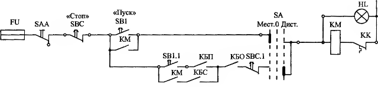

[<- До підрозділу](README.md)

# Схеми електричні принципові: теоретична частина

Даний теоретичний матеріал дає основи побудови принципових електричних схем в системах автоматизованого керування технологічними процесами.    

## 1. Види та типи схем

В залежності від видів елементів та зв'язків між ними, а також енергоносія, який необхідний для дії елементів схеми відрізняються за видами: 

- електричні, в яких елементами є електротехнічні вироби, зв'язками – провідники, енергоносієм - електричний струм; 

- гідравлічні, в яких елементами є насоси, засувки, вентилі, зв'язки - трубопроводи, енергоносій - рідина під тиском, наприклад вода, масло. 
- пневматичні, в яких елементами є компресори, клапани, золотники, зв'язками – трубопроводи, енергоносієм – стислий газ, пара, повітря; 
- кінематичні схеми, в яких елементами є частини механізмів, зв'язками - важелі, тяги, кола, енергоносієм – механічна енергія.
- схеми автоматизації, до складу яких можуть входити схеми різних видів із відповідними зв'язками; у цьому випадку підкреслюється призначення схеми, а не вид елементів і зв'язків;
- комбіновані (сумісні) схеми, наприклад електрогідравлічна, тобто така схема, яка містить і електричні та гідравлічні елементи. 

У межах кожного виду в залежності від призначення схеми поділяються на кілька типів: 

- структурна схема означує основні функціональні частини виробу. 
- функціональна схема пояснює процеси, які у ньому відбуваються через відображення взаємопов'язаних функцій. 
- принципова (повна) схема означує повний склад елементів і зв'язків між ними і, дає детальне уявлення про принцип роботи.

На основі принципових схем розробляють (або генерують, якщо таке передбачено в САПР), схеми інших типів, які дають можливість проводити за ними певні роботи по реалізації системи: схеми з'єднань (монтажні, для з'єднання між собою частин системи), схеми підключення (для підлключення провідників до засобів), загальні (наприклад щитових конструкцій), розташування (відображає розміщення частин в просторі) та об'єднані (комбінація з кількох типів).

Надалі в даній лекції ми зосередимося виключно на принципових електричних схемах, а саме з точки зору їх читання.    

## 2. Загальні підходи до побудови принципових електричних схем

### Стандарти виконання схем

Схеми виконують, керуючись відповідними стандартами. В Україні наразі документацію можна виконувати за кількома стандартами - європейськими (здебільшого IEC), та ЄСКД (Єдина система конструкторської документації, зокрема 7-ї групи, історично пострадянський стандарт) які мають спільну базу, але мають відмінності. Стандарти означують як саме графічно та текстово позначуються елементи та зв'язки між ними, як їх розміщувати на аркушах, як комплектується документація та багато іншого. Стандарти не можуть передбачати усіх випадків, тому розробник може вводити свої позначення, які також наводяться в документації. Тому перед ознайомленням зі змістом того чи іншого документу, варто дізнатися стандарти, які використовувалися та прийняті в документації умовні графічні та текстові (літерно-цифрові) позначення. У цій лекції ми не будемо зупинятися на деталях виконання схем згідно всіх прийнятих стандартів, однак за базу будуть взяті правила системи однієї з редакцій ЄСКД, якщо інше не буде вказано явно.

Елементи та пристрої на схемі зображуються суміщеним або рознесеним способом, допускається часткове неповне зображення з показом лише частин або пристроїв, що використовуються. При **суміщеному способі** складові елементів або пристроїв зображуються на схемі в безпосередній близькості один до одного. При **рознесеному способі** складові елементів або пристроїв зображуються на схемі в різних місцях, що дозволяє окремі кола зображати наочно. В одній схемі можна використовувати одночасно обидва способи зображення. При рознесеному способі рекомендується вільному полі креслення поміщати умовні графічні позначення елементів, виконані суміщеним способом. Схеми виконуються без дотримання масштабу. 

### Умовні графічні та текстові позначення

На принципових електричних схемах зображуються всі електричні елементи та пристрої, необхідні для виконання функціонального завдання та здійснюють електричні процеси, а також електричні зв'язки між ними та вхідні/вихідні елементи електричних кіл. **Електричний елемент схеми** - це складова частина електричної схеми, яка виконує певну функцію у схемі і не може бути розділена на частини, що мають самостійні призначення (резистор, трансформатор, автоматичний вимикач, реле тощо). **Електричний пристрій** - сукупність електроелементів, що представляє єдину конструкцію (шафа, пульт, виконавчий механізм, сполучна коробка тощо). **Електричне коло** - лінія, канал, тракт певного призначення (включення обмотки реле, живлення електроприладу тощо). **Ділянка електричного кола** - частина лінії, що зв'язує канали окремі електричні елементи між собою.

Принципова схема виконується у стані, відключеному від джерела електроживлення та без зовнішнього впливу на механічні частини електричних пристроїв та елементів. 

На схемах використовують **умовні графічні позначення (УГП)** елементів, **літерно-цифрові позиційні позначення** елементів та у ряді випадків позначення ділянок кіл в електричних установках. Літерно-цифрові позиційні позначення потрібні для ідентифікації елементів, апаратів, встановити приналежність деталей (котушок, контактів) тому чи іншому апарату, враховуючи що їх графічні позначення однакові. Наприклад котушки будь-яких реле, магнітних пускачів і контакторів і багато чого іншого мають однакове графічне позначення, тому мають мати різні позиційні. Наприклад на рис.1а рубильники `S1`, `S2`, контакти котушок реле `К1`-`КЗ`  графічно однакові, але мають різні позиційні позначення (`S1`, `S2`, `K1` ...). Окрім потреби в ідентифікації елементів, вони встановлюють зв'язки між частинами одного виробу, які зображені в різних електричних колах. Зокрема на рис.1 показані котушка та контакт тих самих реле. Наприклад реле `K1` має котушку, що позначена графічно прямокутником, та контакт. Зокрема, у коло лампи `Н1` введені контакти реле `К1` і `КЗ`, у коло лампи `Н2` — контакти реле `К2` і `КЗ`, коло котушки `КЗ` — рубильник `S2` і контакт реле `К1`. Достатньо змінити позиційні позначення, і ця ж схема зобразить зовсім іншу електронну установку.

Рис.1. Апарати розрізняють за допомогою позиційних позначень. Приналежність частин апаратів до того чи іншого кола визначається позначенням (маркуванням) ділянок кіл

Поряд з літерно-цифровою ідентифікацією елементів, позначають також ділянки кіл. На рис.1а ділянки кіл позначені цифрами, які розміщені зверху або ліворуч від зображення електричного з'єднання. Система маркування ділянок кіл передбачає, що частини кола з однаковим потенціалом мають те саме позначення, тобто те саме маркування, у нашому випадку це номер. Наприклад, верхній провід живлення і відгалуження від нього мають маркування `1` (червоні лінії), нижнього проводу живлення і відгалужень від нього - `2` (сині лінії). Коли потенціал ділянки може набувати інших значень, номер змінюється. Позначення ділянок кіл дозволяють знайти необхідну частину апарату. 

Умовні графічні позначення утворюються з найпростіших геометричних фігур: квадратів, прямокутників, колів, трикутників, з суцільних і штрихових ліній і точок, що дає можливість зобразити: 

- електричні машини, апарати, прилади та їх складові (обмотки, котушки, контакти тощо);
- дроти, шини, кабелі, їх перетин та з'єднання;
- лінії механічного зв'язку частин машин, апаратів та приладів (наприклад, механічний привід контакту);
- вид з'єднання обмоток (зірка, трикутник тощо);
- рід струму (постійний, змінний), частоту, напругу, полярність тощо. п.

Умовні графічні позначення показують лише те, що необхідно для конкретного застосування, без зайвої деталізації, лишньої інформації та очевидних речей. 

## 3. Умовні графічні позначення

У даній частині розглянемо тільки загальні правила використання умовних графічіних позначень (УГП) а також УГП які найбільш вживані в системах керування технологічними процесами.  

### Позначення загального застосування

Система побудови передбачає такі позначення, які можна з огляду на обставини графічно приєднувати до інших позначень, щоб конкретизувати їх значення. Такі позначенням загального застосування слугують, наприклад, для вказівки напрямку руху, механічного зв'язку, характеру та способу регулювання, виду приводу та ніше. Розглянемо найбільш уживані із цих позначень, керуючись рис.2 та 3.

#### Напрямок руху

На рис.2а показане зображення напрямку руху. 1 - Прямолінійне одностороннє, в нашому прикладі вправо; 2 - рух прямолінійний зворотний; 3 - обертальне одностороннє, у нашому прикладі за годинниковою стрілкою.

#### Механічний зв'язок 

Лінія механічного зв'язку в електричних схемах позначається штриховою лінією 4 (рис. 2а) щоб показати: а) зв'язки між елементами електроустановки, наприклад, між двигуном і генератором; б) зв'язки між частинами елемента, наприклад між котушкою магнітного пускача та його контактами; в) зв'язку контактів не електричних реле з їх приводами, наприклад, зв'язок контакту з поплавком. Однак при невеликих відстанях між елементами та їх складовими частинами незручно використовувати штрихову лінію, тому допускається замінювати її двома паралельними суцільними лініями 5 (рис.2а).

#### Регулювання

Загальне позначення лінійного регулювання, тобто без конкретизації характеру та способу регулювання, показано на рис.2б під позицією 6. Характер регулювання конкретизують такі позначення: 7 - плавне, 8 - ступінчасте (у нашому прикладі п'ять ступенів), 9 - підстроювальне. Позначення 10 і 11 вказують на саморегулювання (тобто автоматичне регулювання) лінійне 10 та нелінійне 11. Приклади застосування позначень наведені за номерами 6П-11П. Так, приклад 6П показує, що резистор `R1` регульований, але без конкретики яким чином; 7П - конденсатор `С1`, ємність якого регулюється плавно (так, наприклад, позначають конденсатор `С1` змінної ємності для налаштування радіоприймача на необхідну станцію); 8П - ступінчасте регулювання напруги трансформатора `Т1` за допомогою перемикання п'яти відводів; 9П - підстроювальний конденсатор `С2`, його ємкості підбирається при налагодженні виробу та фіксується; 10П - зображення термометрі опору, тобто такого резистора `Rt` опір якого плавно змінюється в залежності від температури; 11П — котушка `L1`, індуктивність якої означується значенням напруги `U`, ця залежність нелінійна.

На спосіб регулювання вказують позначення на рис.2,в. Тут: 12 - регулювання ручкою, виведеної назовні; 13 - те саме, але стрілка уточнює, що значення регульованої величини збільшується при повертанні ручки за годинниковою стрілкою; 14 — елемент регулювання (наприклад, вісь потенціометра) виведено назовні, проте повернути її можна тільки інструментом; 15 — те саме, але вісь потенціометра знаходиться всередині пристрою. Приклади застосування позначень наведені під номерами 14П і 15П. Так приклад 14П показує резистор `R2` значення опору якого можна встановити за допомогою інструмента, не розкриваючи приладу; 15П - те саме, але, щоб встановити потрібну ємність конденсатора `СЗ`, прилад треба розкрити.

Рис.2. Позначення загального застосування: напрямок руху, лінії механічного зв'язку, регулювання

#### Приводи

Позначення приводів ілюструє рис.3. Тут: 1 - загальне позначення (тобто без конкретизації) ручного приводу, 2 - привід, що приводиться в рух натисканням, 3 - те ж витягуванням, 4 - поворотом кнопки, 5 - важільний привід, 6 - ножний привід. Загальне позначення акумулятора механічної енергії (будь-якого приводу, крім ручного) 7, електромагнітного приводу 8, електромашинного 9, 10 поплавця, відцентрового 11, за допомогою біметалу 12. Приклади застосування наведені під номерами 8П, 9П, 11П, 5П та 6П. Приклад 8П – регулювання опору резистора `R1` за допомогою електромагніту `YA1`; 9П - руховий привід роз'єднувача `QS1`; 11П - управління контактом `S1` за допомогою відцентрового регулятора (такий пристрій застосовується, наприклад, у приводі пральної машини для відключення пускової обмотки двигуна, при досягненні номінальної частоти обертання); 5П - важільне управління (чорні лінії) контактом (сині лінії) `S2`; 6П - ножний привід (чорні лінії) контактом (сині лінії) `S3`.

Рис.3. Позначення загального застосування: приводи. Кожному номеру 1—12 відповідають два позначення: зверху лінія механічного зв'язку зображена штриховою лінією, знизу двома суцільними лініями. Обидва позначення рівноцінні (див. рис.2а, поз. 4 і 5).

#### Похідні позначення через об'єднання

Якщо у конкретному випадку бракує простих загальних позначень щоб передати необхідну інформацію, то застосовують похідні позначення. Систему побудови похідних позначень ілюструє рис.4. На рис. 4а дано загальне позначення 1 електричного дзвінка. Якщо потрібно підкреслити рід струму, то, вписуючи в 1-ше позначення постійного 2 або змінного 3 струму, отримують похідні позначення: дзвінок постійного 4 і змінного 5 струму. На рис.4,б показано, що, застосовуючи поєднання електричного з'єднання 6 і дроту 7, легко отримати похідне позначення 8, з якого випливає, що дроти II, V і VI з'єднані. З'єднані також дроти III і IV, а дроти I до IV, 1 і V, I і VI, II і IV, III і V не з'єднані, тільки перетинаються. Провід VI відгалужується від дроту II. Поєднуючи на рис.4,в позначення 9 (обмотки статора машини, що обертається), 10 (короткозамкнутого ротора), 11 (з'єднання трифазної обмотки в зірку) та 12 (трьох проводів - три рисочки), зображують 13 - асинхронний двигун з короткозамкненим ротором, статор якого з'єднаний в зірку.

Рис.4. Поєднання загальних позначень з іншими утворюють конкретніші - похідні позначення

#### Багатолінійне та однолінійне позначення

Для спрощення читання схеми, кілька провідників можуть зображувати однією лінією. Так, наприклад (див. рис.4), проводи, шини, кабелі і взагалі будь-які лінії електричного зв'язку можуть бути зображені або однією лінією 12, кількість рисок на якій вказує кількість проводів, або кількома лініями - 15. Як приклад на рис.4в, дані як однолінійне 13, так і трилінійне 14 зображення одного і того ж двигуна. На рис.4г із загального позначення 16 вимикача за допомогою трьох рисок отримано однолінійне позначення 18 триполюсного вимикача. Поєднання позначення 16, повторене 3 рази, з позначенням лінії 17 механічного зв'язку дало багатолінійне позначення 19. У ряді випадків досить простого однолінійного позначення, проте окремі ділянки схеми потрібно показати докладніше. У цьому випадку до цих ділянок застосовують багатолінійне позначення. Так, на рис.4,д дана однолінійна схема асинхронного двигуна 21, але ділянка з трансформаторами струму 20 показана в три лінії.

#### Електричні машини, трансформатори та автотрансформатори

Електричні машини, трансформатори та автотрансформатори можуть бути зображені або спрощеним способом (однолінійним або багатолінійним) або розгорнутим, де показують обмотки окремо. В основу зображень покладено позначення обмоток 1 і 2 та видів з'єднання 3-5 (рис.5а). Позначення виду з'єднання утворюється рисками, кожна з яких зображує обмотку однієї фази. Отже, 3 - це однофазна обмотка, а 4 і 5 - трифазні обмотки, які з'єднані в зірку і трикутник відповідно. На рис.5,б показаний двообмотковий трансформатор в однолінійному (6) і багатолінійному (7) зображенні у спрощеній формі (**форма I**). Первинна обмотка з'єднана в зірку з виведеною нейтральною точкою, а вторинна - в трикутник. На зображенні 8 цей же трансформатор показаний розгорнутим способам (**форма II**), де видно його обмотки і з'єднання між ними. 

Дві форми позначення асинхронного двигуна із фазним ротором ілюструє рис.5,в. Статор з'єднаний у трикутник, а ротор - у зірку. Спрощене зображення 9 (форма I) дано однолінійному зображенні. Зображення у формі II наведено у двох варіантах. У варіанті 10 обмотка статора показана докладно, а обмотка ротора спрощено. У варіанті 11 навпаки: обмотка статора зображена спрощено, а обмотка ротора - докладно. Можливо і третій варіант, у якому обидві обмотки показують докладно. Все залежить від того, з якою метою виконують схему

Рис.5. Трансформатори (автотрансформатори) та електричні машини зображують або спрощеним, або розгорнутим способом

#### Контакти

Умовні графічні позначення не відображають конструктивні особливості виробів, але можуть наголошувати на їх важливих експлуатаційних властивостях. Наприклад на рис.6а показані три абсолютно різні конструкції контактів, причому це не всі виконання. Верхні контакти замикають, тобто вони замикаються при спрацьовуванні апарату, але розмикаються при поверненні. Нижні контакти замкнуті, поки апарат перебуває у вихідному положенні, але розмикаються при його спрацьовуванні. Зауважимо, що на рис.6 прийнято умовність, необхідну для полегшення викладання, а саме: замикаючі контакти позначені одиницею, а розмикаючі — двійкою. 

Рис.6. Умовні позначення не відображають конструктивних особливостей виробів, але можуть наголошувати на їх важливих експлуатаційних властивостях.

На рис.6б у кількох варіантах показані загальні позначення контактів, що по різному зображуються але рівноцінні (так склалося історично). Ці загальні позначення можна застосовувати у будь-якому випадку, але вони не відображають особливості виконання, що не завжди зручно при читанні схеми. Розглянемо деякі доповнення, які вказують на особливості. На рис.6 перша цифра 1 вказує на те, що приклад відноситься до замикаючого контакту, а 2 - до розмикаючого. Для полегшення викладення, доповнення виділено червоним: 

- 1.3 - контакт без самоповернення, наприклад контакт вимикача з ручним приводом; 
- 1.4 - контакт із самоповерненням (не слід застосовувати це позначення для контактів, самоповернення яких очевидне; 
- 1.5 - контакт для комутації сильнострумового електричного кола, наприклад контакт у колі обмотки електродвигуна; 
- 1.6 - контакт із дугогасним пристроєм, наприклад, з камерою магнітного дуття або іншим конструктивним елементом, призначеним для дугогасіння.
- 1.7 - контакти, які із уповільненням замикаються, 
- 1.8 - контакти, які із уповільненням розмикаються, 
- 1.9 - контакти, які із уповільненням і замикаються, і розмикаються.
- 1.10 - вимикачі з кнопковим приводом (раніше їх називали кнопками), які замикаються при натисканні , 1.11 - ... при витягуванні, 1.12 - ... при повороті кнопки 7.72.
- 1.13 - загальне позначення контакту неелектричних реле з лінією механічного зв'язку до якої приєднано позначення приводів
- 1.14 - контакт, що перемикається за допомогою біметалу, тобто контакт електротеплового реле, наприклад реле, яке служить захисту електродвигуна від перевантаження; 
- 1.15 – контакт поплавкового реле.

### Провід, шини, кабелі, з'єднання

**Провід, шини, кабелі** та взагалі будь-які лінії електричного зв'язку позначають рискою 1 (рис.7). Позначення шин товстіше, причому поширені два варіанти позначень для цього: 2 і 3 (який обведений на рисунку - застарів). У трифазній системі (16) з нейтраллю `N` шини фаз `А`, `В`, `С` товщі  ніж шина нейтралі `N`. Однак кілька десятків років тому нейтральну (за старою термінологією нульову) шину зображували не більш тонкою, а штриховою лінією (17). У даний час штриховою лінією позначають екран (див. рис.7).

#### Електричні з'єднання

Електричні з'єднання бувають нерозбірними, розбірними та роз'ємними. Нерозбірне з'єднання позначають точкою (4). Їх виконують паянням, зварюванням, обпресуванням. Для позначення з'єднання, якщо не потрібно підкреслити його характер, як, наприклад, у принципових схемах, також використовують точку. Розбірне з'єднання 5, яке виконується за допомогою гвинтів, затискачів, позначають кружком. Поруч показано старе позначення розбірного з'єднання 6 - воно обведене хвилястою лінією і зараз не використовується. Роз'ємне з'єднання зображують двома способами: 18 і 21. Роз'єм складається з штиря 19 (або штирьової частини роз'єму 22) і гнізда 20 (гніздової частини роз'єму 23). При цьому позначення 18 — роз'єм однопровідний, а 21 — багатопровідний. Отже, 22 це не штир, а кілька штирів на загальній ізолюючій основі, а 23 - відповідна йому гніздова частина роз'єму. Позначення 21 доповнюють табличкою, в якій перераховані (перенумеровані) усі електричні кола. 

Рис.7. Графічні з'єднання та перетину проводів, шин та кабелів (обведене - застарілий варіант)

**Контактні перемички** показані наступними зображеннями: 24 - нерозбірна, 25 - з одним нерозбірним (точка) та одним розбірним (кружок) контактами; 26 - з обома розбірними контактами; 27 - комутаційна перемичка з роз'ємними контактами. 28 - двополюсний роз'єм, 33 - старий варіант позначення. 

Один із способів зображення контактних з'єднань ілюструють 29-32 (зверніть увагу на графічні познаки вгорі). Тут 29 - з'єднання розбірне: дроти до нього підведені з обох боків; 30, 31 і 32 - роз'ємне з'єднання: 30 - його штирева частина, а 31 - гніздова. Зверніть увагу: дроти до них підходять з різних боків; 32 - роз'ємне з'єднання зібране.

#### Перетин, з'єднання та відгалуження проводів і шин

Графічно перетин, з'єднання та відгалуження проводів і шин показано наступними способами: 7 - проводи 1 і 11 графічно перетинаються (немає точки), 8 - проводи III і IV з'єднані (точка), 9 - провід відгалужується від проводу. Аналогічно 13 - шини графічно перетинаються, 14 - шина відгалужується від шини, 15 - провід відгалужується від шини. Під номером 11 показані помилки, що зустрічаються в старих книгах та схемах, що додаються до старих побутових електроприладів. Помилки полягають у тому, що на одному з проводів, що перетинаються, малюють півколо, а в місці з'єднання проводів пропускають точку. Правильне зображення 10. Тим не менше, зображення півкола при перетині проводів правомірне, вживане і має певний сенс. Півколо показує, який із проводів повинен бути розташований вище. Так, в позначенні 12 провід IX проходить над проводом Х, а провід XI — під ним. Якщо зображення шин не залиті, то приєднання до них зображують точкою -15, якщо залиті - кружком (16). 

#### Злиття та розгалуження проводів та жил кабелів 

Групові лінії електричного зв'язку ілюструє рис.8а. Під номерами 1-4 показані різні вживані зображення злиття проводів `а`-`и` в джгут, кабель або, в загальному випадку, в групову лінію зв'язку. Зверніть увагу: а) у цих позначеннях немає точок, оскільки дроти один від одного ізольовані; б) лінія групового зв'язку в позначеннях 1, 2 і 4 товстіша, але при виконанні схем автоматичним способом її допускається не потовщувати. Позначення 1 незручно і використовується рідко. Справа в тому, що при кількох кабелях, що підходять до ряду затискачів, легко помилитися: "перевести" або "недовести" лінію, тобто потрапити не в той джгут (кабель), що потрібно. Тому позначення 2 та 3 (застаріло) зручніше. У позначенні 4 дроти `е` -`и` - це жили кабелю. Щоб це підкреслити, іноді зображують обробку кабелю у вигляді півкола (застаріло) або трикутника 16. 

рис.8. Злиття та розгалуження проводів та жил кабелів. Екранування

#### Екранування, заземлення, занулення 

Для запобігання впливам магнітних і електростатичних полів на дроти та прилади застосовують їхнє екранування, тобто захищають провід, прилад, кабель металевою оболонкою екраном. Екран на схемах зображують штриховою лінією (5 на рис.8б). У штриховий прямокутник (6) укладають екрановану частину електроустановки, наприклад котушку реле. Позначення 7 - це провід або кабель, частково екранований, а 8 - група з шести ліній електричного зв'язку в загальному екрані. Позначення екранування – штрихове коло – показано на початку кабелю. Воно може бути показано в кінці, а при необхідності в проміжках між кінцем і початком екранованого кабелю. Іноді біля зображення екрану пишуть літеру `Е` (раніше писали `Сu` — мідь), якщо екранування електростатичне, або `Н` (раніше писали `Fe` — залізо), якщо електромагнітне екранування.

Металеві струмопровідні частини електричних машин і апаратів, каркаси щитів і пультів, труби, в яких прокладені дроти та кабелі, заземлюють або зануляють. У ряді випадків корпуси та конструкції використовують як частини електричного кола. Так, наприклад, у мережах з глухозаземленою нейтраллю (у випадках живлення котушок магнітних пускачів від фази і нейтралі, коли це допустимо) один із виводів котушки всередині пускача приєднують до його заземленого корпусу. Якщо потрібно підкреслити з'єднання з корпусом (тобто якщо воно не очевидне, а потрібно, наприклад, для дії електричного захисту), то використовують позначення 9 (рис.8в). Наприклад, 12 зображує з'єднання екрана з корпусом. Позначення заземлення 10 застосовується, якщо заземлення (занулення) необхідне для створення умов нормальної експлуатації, або як засіб електробезпеки. Однак заземлення або неприпустиме з'єднання між провідниками може виникнути через пошкодження. Позначення пошкодження ізоляції - 11. Його застосування ілюструють: 13 - ізоляція пошкоджена між проводами і 14 - в результаті пошкодження відбулося з'єднання проводу з ''землею''.

#### Приєднання до апаратів, приладів та електричних машин

Приєднання до апаратів, приладів та електричних машин ілюструє рис.8г. Позначати електричне з'єднання, тобто вставити точки (кружки), потрібно лише в тих випадках, якщо можуть виникнути сумніви, чи приєднаний провідник чи ні. Якщо місце приєднання є безсумнівним, то точку (кружок) не ставлять. Так, наприклад, під номерами 15 і 16 показано з'єднання між рядами затискачів `X1` і `X2` за допомогою п'ятижильного кабелю (на лінії, що зображує кабель, зроблено засічку і біля неї написано цифру 5 - п'ять жил). Провід та жили кабелю до ряду затискачів `X1` приєднані без крапок. Це правильно, оскільки приєднання очевидно. У ряді затискачів `X1` показані дві перемички: між затискачами 1 і 2 без крапок і між затискачами 4 і 5 з крапками. З'єднані затискачі розташовані поряд. Значить, точки не потрібні і, отже, перемичка 1—2 показана правильно, а перемичка 4—5 — неправильно. Інша справа перемичка в ряді `Х2` між затискачами 7 і 9. Тут без крапок обійтися не можна, оскільки між з'єднаними затискачами є затискач 8, який з ними не з'єднується. 

Розглянемо приєднання до статора (коло більшого діаметра) і ротора (коло меншого діаметра) електродвигуна з фазним ротором. Приєднання 17 - без точок - правильно, приєднання 18 - з точками - неправильно, тому що інших варіантів приєднання до статора та ротора бути не може.

### Дроселі, конденсатори, резистори

На рис.9 показані: котушка індуктивності без магнітопроводу 1, те ж з відведеннями 2, з ковзними контактами (наприклад, двома) 3, дросель з феромагнітним магнітопроводом 4, реактор 5. Позначення 5 застосовується в схемах електропостачання. Котушки індуктивності можуть мати не тільки феромагнітні магнітопроводи, як у дроселів, а й магнітопроводи зі спеціальними властивостями. Вони розглянуті нижче.

Також на рис.9 показані конденсатори постійної ємності: загальне позначення 6, поляризований 7, електролітичні поляризований 8 і 9 і неполяризований 10 (позначення 9 застаріло), загальне позначення конденсатора змінної ємності 11, підстроєчного 12, варіконда 13, тобто конденсатора з залежністю ємності від напруги. Якщо потрібно показати рухому обкладку конденсатора (його ротор), її зображують у вигляді дуги 14. У застарілому позначенні 15 замість дуги ставили точку. 

Рис.9. Дроселі, конденсатори, резистори

На рис.10 показаний постійний (нерегульований) резистор 1 і резистор з додатковими відведеннями 2. Щоб показати розімкнуту позицію резистора, застосовують позначення 5. Поєднання позначення 1 із позначеннями, наведеними вище на рис.9 дає можливість зобразити 3 і 4 - змінний резистор (загальне позначення), а також підкреслити характер регулювання: плавне 6 і 7 або ступінчасте 8 і 9. Тут буква `n` замінюється цифрою, що вказує число ступенів. У прикладі 10 ступінчасте регулювання розжарювання лампи досягається перемиканням відводів. На рис.10, 11 це змінний резистор з нелінійним регулюванням, на що вказує злам у позначенні регулювання. Якщо ж звернутися до зображення 12, то в ньому конкретизовано як регулювання, так і спосіб його здійснення. У разі регулювання пропорційно натуральному логарифму х (`lпх`) і виконується рукояткою, виведеної назовні. Логарифмічна залежність досягнута завдяки намотуванні дроту на основу 13, якому надано відповідну форму. Нагрівальні елементи показуються як на  14 з рис.10.

рис.10. Резистори

Для позначення саморегулювання (автоматичного регулювання) застосовують похилу рису без стрілки, тому на рис.10 15 і 16 - це лінійне плавне саморегулювання, 17 - лінійний терморезистор (термометр) , 18 - лінійний тензорезистор (його опір прямо пропорційний тиску `p`), а 20 - нелінійний тензорезистор. На рис.2.7 наведено три приклади позначень нелінійних терморезисторів: 21 - Прямого підігріву з позитивним температурним коефіцієнтом (t°); 22 - те саме, але з негативним температурним коефіцієнтом (-t°) і 23 - терморезистор непрямого підігріву. Тут червона дужка – позначення підігрівача. Підстроювальний резистор 24 слугує, щоб у процесі налагодження будь-якого приладу, наприклад телевізора, встановити потрібне положення хомутика на регульованому резисторі. Під номером 19 дано загальне позначення фоторезистора, тобто такого резистора, опір якого змінюється під впливом світла. Тут позначення резистора укладено в коло, що зображує корпус напівпровідникового приладу, а стрілки, спрямовані до нього, вказують на фотоелектричний ефект. 

На схемах іноді вказують значення номінальної потужності, перевищувати які не можна. Так, під номерами 25-30 зліва направо позначені номінальні потужності: 1; 2; 5 (римські червоні цифри I, II та V); 0,5; 0,25; 0,125 Вт. Римські цифри застосовуються за потужностей до 5 Вт.

### Термоперетворювачі

Термоперетворювачі (термоелементи, термопари, термобатареї) безпосередньо перетворюють тепло на електричну енергію. На рис.11 показані термоперетворювачі: 1 - без підігрівача, 2 - з підігрівачем (дужка), який стосується термоперетворювача і тому називається контактним, і 3 - безконтактний: підігрівач і термоперетворювач не торкаються, тобто не мають контакту. Плюс це знак полярності. 

Рис.11. Термоперетворювачі

### Електродвигуни

Загальне позначення двигуна показано на рис.12,а. В коло допускається вписувати дані, що вказують: двигун `М`, рід струму (`-` постійний, `~` змінний), вид з'єднання обмоток (зірка, трикутник) і т. п. Вище наводилися принципи та приклади створення похідних позначень для електродивгунів. Так, на рис.12 а дані однолінійне 1 і багатолінійне 2 позначення двигуна, статор якого з'єднаний в зірку. При однолінійному позначенні немає рисок, що вказують на кількість проводів, тому що і без них ясно, що до двигуна, з'єднаного в зірку, підходять три дроти. Обмотки позначають, як показано на рис.12,в, причому кількість півкіл має значення. Одне півколо (3) - обмотки допоміжного полюса; два півкола (4) - обмотка компенсаційна; три півкола (5) - обмотка статора (кожної фази) двигуна змінного струму і обмотка послідовного збудження двигуна постійного струму; чотири півкола (6) - обмотка паралельного збудження двигуна постійного струму. 

Рис.12.Система побудови позначень електродвигунів

**Статори**. Приклади позначення статорів у формі I (спрощений спосіб) та у формі II (розгорнутий спосіб) ілюструє рис.12,б де 7 і 8 з'єднання обмоток в трикутник, а 9 і 10 - в зірку. Зверніть увагу: у вершинах трикутника, а також при з'єднанні в зірку крапок немає (як іноді роблять), оскільки з'єднання очевидні і без крапок.  

**Ротори**. На рис.12,г показані ротори без обмотки: 11 - порожнистий немагнітний або феромагнітний; 12 - з явно вираженими полюсами - явнополюсний (з прорізами по колу); 13 - явно полюсний з постійними магнітами. Ротори із розподіленою обмоткою ілюструє рис.12,д: 14 - розподілена трифазна обмотка, з'єднана в зірку; 15 - однофазна обмотка або обмотка постійного струму; 16 - короткозамкнений ротор. Ротори із зосередженою обмоткою зображені на рис.12,е: 17 - ротор з явно вираженими полюсами; 18 — ротор явнополюсний (штрихове коло) з розподіленим коротко-замкненим (суцільне коло) заспокійливою або пусковою обмоткою; 19 - ротор з обмоткою, колектором та щітками. У позначенні колекторної машини допускається щітки не зображати, якщо це не призведе до помилок.

Виводи обмотки статора у формі I допускається спрямовувати у будь-який бік. Виводи обмотки ротора можна направляти вправо, вліво, вгору або вниз, а також діаметром кола, але вони не повинні збігатися з висновками статора обмотки.

### Магнітні пускачі, контактори, реле електричні

Зупинимося на деяких означеннях, прийнятих в стандартах. Слово "**обмотка**" застосовується у електричних машинах, трансформаторах, автотрансформаторах, магнітних підсилювачах, вимірювальних приладах. Слово "**котушка**" відноситься до електромеханічних пристроїв, а саме до магнітних пускачів, реле, контакторів, електромагнітів. Однак котушка електромеханічного пристрою може мати декілька обмоток. 

Кажуть, що  електромеханічний пристрій "**спрацьовує**" (при досить великому струмі) і "**повертається**" при відключенні або значному зменшенні струму. Таким чином, вживаються, як правило, терміни: спрацьовування та повернення. Але іноді використовуються також терміни "**притягування**" та "**відпускання**", якщо в конкретному випадку вживання цих слів чіткіше відображає суть справи.

Про контакти говорять: "**замикаючі**" та "**розмикаючі**". Замикаючий контакт замикається під час спрацьовування, але розмикається під час повернення. Розмикаючий розмикається під час спрацьовування, але замикається при поверненні.

#### Котушки реле

Котушки позначають, як 1 та 2 на рис.13, які відрізняються тільки направленням виводів. Принципи позначення контактів наведені вище. У пристроях автоматики, телемеханіки, телефонії застосовують реле як однообмоткові, так і з котушками, що мають кілька обмоток. Якщо потрібно наголосити, що котушка є однообмотковою, то застосовують відповідне позначення - похилу межу. Двохобмоткові котушки позначають 4 або 5. Якщо ж обмотки двообмотувального реле розносять за схемою (тобто зображують їх у різних її місцях), то на їхню приналежність до двообмотувальної котушки вказують дві похилі рис 6. Буква `n`, що замінює цифри в поз. 7 вказує на те, що котушка має `n` обмоток.  Числа, написані біля прямокутника 8 чи прямокутниках 9, — це опір обмоток. У прикладі опір однієї обмотки 50, а інший 990 Ом. Деякі реле мають котушки 10 із двома зустрічними обмотками; одна з них намагнічує магнітопровід, інша - розмагнічує. Якщо зустрічні обмотки однакові, то котушка 11 біфілярна — вона дорівнює дротяному безіндуктивному опору. Раніше біфілярні обмотки зображували просто як резистор 12, цифри над яким вказували його опір, у прикладі 800 Ом. Обмотка трифазного струму — 13. Якщо обмотка має відвід, її зображують, користуючись позначенням 14. Якщо потрібно конкретизувати позначення котушки, то додаткові графічні поля вписують літери. Котушка з одним додатковим полем -15, з двома - 16. Лінію між додатковими полями допускається опускати (не показано). Приклади використання додаткових полів: 17 - котушка змінного струму; 18 або 19 - котушка з обмоткою напруги (позначення 19 трьома півколами застаріло); 22 або 23 - котушка з струмовою обмоткою (позначення 23 двома півколами застаріло). Можлива ще більша конкретизація: так, 20 і 21 - котушки з обмотками мінімальної напруги, а 24 і 25 ~ максимального струму. У схемах релейного захисту нерідко застосовують позначення 26 але воно стандартом не передбачено.

рис.13. Позначення котушок реле, що не мають спеціальних властивостей 

#### Котушки реле зі спеціальним призначенням

У деяких випадках доводиться застосовувати реле, конструкції котушок яких надають цим реле спеціальні властивості. Розглянемо ці позначення, скориставшись рис.15. На рисунку показано: 1 і 2 - котушки поляризованого реле, тобто такого реле, яке спрацьовує тільки при певному напрямку струму, на що вказує зображення магніту в додатковому полі позначення 1 або буква Р у позначенні 2. Зверніть увагу: у прикладах застосування позначення 2 виведення котушки, на яку має бути поданий `+` щоб реле спрацювало (тобто щоб контакт переключився), позначений точкою (3) або рисою (4 - застаріле). Котушку, що має залишковий магнетизм, позначається як `5`, що має механічне блокування - `6`, нечутливу до змінного струму - `7`, що сприймає частину електротеплового реле (тобто біметалічну пластину або її нагрівач) - `8`. Якщо а електромеханічний пристрій працює з механічним резонансом, то для позначення котушки пристрою користуються позначенням `9`, де напис 400Hz (у прикладі) — це резонансна частота. Позначення 10 і 15(застаріле) - котушка електромеханічного пристрою, що працює з прискоренням при спрацьовуванні; 11 - те ж при спрацьовуванні та поверненні; 12 - із уповільненням при спрацьовуванні; 13 і 16(застаріле) - те саме при поверненні; 14 і 17(застаріле) - при спрацьовуванні та поверненні. 

Рис.15. Позначення котушок реле, що мають спеціальні властивості.

#### Контакти

На рис.16 показані загальні позначення контактів, тобто такі позначення, які можна застосовувати у всіх випадках. Якщо ж потрібні уточнення, то мають більш складні позначення, які наведені нижче на рис.17. Рис.16 розділений вертикальними лініями на чотири частини. У першій, починаючи ліворуч, дані ескізи, що пояснюють, як перемикаються контакти, причому для полегшення викладу контактні пружини на рисунку умовно перенумеровані, а саме: пружини 2 і 3 замикаються при спрацьовуванні, але розмикаються при поверненні; пружини 1 і 2 розмикаються під час спрацьовування, але замикаються при поверненні. Під ескізами розміщені діаграми перемикань, де червоні прямокутники показують, що контакт замкнутий. Прямокутники, які розташовані над віссю часу, відповідають контактам 2-3, під віссю - контактам 1-2. Правіше показано сучасні позначення контактів. А ще правіше - скасовані; вони обведені хвилястою лінією. 

Рис.16. Загальні позначення контактів

На рис.16 б показані можливі варіанти зображень замикаючих контактів, які при описі схем позначають буквою `3`, а на рис.16,б дано позначення розмикаючих контактів `р`. Перемикаючий контакт `п` (рис.16,в) є поєднанням замикаючого 2-3 і розмикаючого 1-2 контактів із загальною пружиною 2. Особливість перемикаючого контакту полягає в наступному: в процесі перемикання обидва контакти ніколи не бувають одночасно замкнутими, що виявляється з діаграми : між двома прямокутниками видно розрив. Контакт, що перемикає без розриву кола, `бр` показано на рис.16,г. При спрацьовуванні раніше з'єднуються пружини 2 і З, а потім пружина 2 піднімається. В результаті між нею та пружиною 1 утворюється розрив. При поверненні явища протікають у зворотній послідовності. Але, так чи інакше, в процесі перемикання обидва контакти деякий час одночасно замкнуті. Утворюється щось на кшталт містка, звідки і походить поширена назва: контакт що мостить.

Позначення уповільнення контактів ілюструє рис.17. Познайомимося спочатку із системою позначень; її пояснює рис. 17,а. Уповільнення відбувається під час руху у бік від дуги до її центру. Отже, на рис.17.а 1 зображує уповільнення при русі вправо, 2 - при русі вліво, 3 - при русі в обох напрямках.  Графічний зв'язок дуги із зображенням контакту показують або штриховою лінією, або двома паралельними суцільними лініями. Значення уповільнення, якщо потрібно, можна проставляти біля зображення уповільнювача, у прикладі 0,7s. Уповільнювач (дугу) допускається зображати з боку контакту, але, зрозуміло, направляти дугу потрібно з урахуванням уявного напрями руху, яке на рис.17 показано синіми стрілками. Стрілки на схемах, звісно, не зображують. Отже, на рис.17,б: 4 і 5 - це замикаючі контакти, які замикаються із уповільненням; 6 і 7 - замикаючі контакти, що розмикаються з уповільненням; 8 - контакт, що замикається з уповільненням; 9 - контакт, що розмикається, що розмикається з уповільненням. Наслідуючи цю умовність, легко зрозуміти, що уповільнення при спрацьовуванні замикаючих контактів показано на рис. 17,е, що розмикають - на рис.17,г. Уповільнення при поверненні контактів, що замикають і розмикають, ілюструють рис.17,д і е відповідно. Уповільнення обох напрямах, так як е. і при спрацьовуванні та при поверненні, показано на рис.17, ж і з відповідно. Зверніть увагу: хвилястою лінією обведені застарілі позначки, що ще широко застосовуються. Позначення послідовності перемикання контактів.  

рис.17. Позначення уповільнення контактів

### Вимикачі

На рис.18,а показано: 

- 1 - загальне позначення вимикача, тобто таке позначення, яке можна застосовувати у будь-якому випадку; 
- 2 і 3 - позначення, в яких підкреслено відсутність самоповернення, на що вказує червоний кружок. Відсутність самоповернення притаманно вимикачам з ручним приводом: рубильників, вимикачів в освітлювальних мережах тощо.; 
- 4 – вимикач-запобіжник; 
- 5 – вимикач з автоматичним поверненням. Такі вимикачі часто називають автоматичними або інакше автоматами. 

Якщо потрібно вказати, при зміні якої величини відбувається повернення (спрацьовування) автоматичного вимикача, то графічне позначення доповнюють знаками: `I >` - вимикач максимального струму, `I <` - мінімального струму, `I <-` - зворотного струму, `U>` - максимальної напруги, `U <` - мінімальної напруги, `T°>` - максимальної температури. Як приклад на рис. 2.39 а, поз. 6 показаний двополюсний автоматичний вимикач максимального струму.

Рис. 18. Вимикачі

На рис.18,б показані кнопкові вимикачі. Тут: 

- 7-9 - вимикачі з замикаючими, 
- 13-15 - з контактами, що розмикають, причому 7 і 13 - натискні, 8 і 14 - витяжні, а 9 і 15 - поворотні. 

Передбачається, що кнопкові вимикачі мають самоповернення. Якщо ж потрібно в якомусь конкретному випадку наголосити на відсутності самоповернення, то користуються позначеннями, які наведені на рис.18,в. Тут: 10-вимикач, замикаючий контакт якого замикається під час натискання кнопки. Але спосіб розмикання контакту визначається конструкцією вимикача. В одних випадках кнопку доводиться потягнути ”на себе”, в інших (як клавішних вимикачах для освітлювальних мереж) клавіша може повертатися. Якщо натиснути її верхній кінець, то контакт замкнеться; якщо ж натиснути на нижній – розімкнеться. Вимикач 11 має фіксуючий механізм , завдяки якому після натискання кнопки контакт залишається замкнутим. Для повернення потрібно ще раз натиснути на ту ж кнопку. Вимикач 12 має фіксуючий механізм, наприклад засувку. Щоб її звільнити, треба натиснути на іншу кнопку. 

Кінцеві вимикачі фіксують граничне положення будь-якого механізму, наприклад візки мостового крана, ліфта, деталей металорізального верстата і т. п. Дорожні вимикачі спрацьовують при проходженні контрольованим механізмом проміжної позиції. Типовий приклад – поверхові вимикачі ліфтів. Загальне позначення механічних вимикачів показано на рис. 18,г. Діють вони наступним чином (приклад): контрольований механізм, підходячи до кінцевого вимикача, тисне на його ролик `Р` і повертає таким чином пов'язаний з ним повідець `П`, який перемикає контакти, що знаходяться в коробці `К`.  

Позначення безконтактних вимикачів на схемах означують принцип дії, тому позначення 16 їм незастосовно. Наприклад на рис.18 г (поз. 17) показаний П-подібний корпус вимикача, всередині якого знаходиться електронна схема. При введенні в зазор металевої пластинки `М` (яка прикріплена до контрольованого механізму) режим електронної схеми різко змінюється. В результаті спрацьовує вихідне реле і здійснює необхідні перемикання. Вимикачі такого роду треба позначати  за 18 (рис.18, г), де жовтий прямокутник - це електронна схема, а прямокутник праворуч - вихідне реле, поруч з яким показаний його контакт. 

На рис.18,д дано зображення колійного вимикача, в якому використаний магнітокерований контакт - Геркон. Контакт укладено у балон. Рухлива частина контакту виготовлена з феромагнітного матеріалу. Тому контакт перемикається під впливом постійного магніту (або електромагніту), коли він наближається до геркона. У прикладі до механізму прикріплений постійний магніт. Коли механізм, переміщаючись, досягає потрібної позиції, саме тієї, у якій встановлено геркон, його контакт спрацьовує і включає проміжне реле `КЗ`. Контакти реле `КЗ` здійснюють необхідні перемикання. Для герконів немає спеціального позначення, але його можна позначити похідним способам - позначення контакту укласти в коло (стандартне позначення балона), а поруч показати стандартне позначення магніту. Оскільки магніт механічно пов'язані з контрольованим механізмом, це корисно підкреслити з допомогою кола, що характеризує позначення колійного вимикача. Саме так і зроблено на рис.18, д, поз. 20. 

### Перемикачі

Стандарти встановлюють кілька позначень перемикачів, що дає можливість у кожному конкретному випадку використовувати той з них, який наочний. Один із способів зображення перемикачів зі складною комутацією, найпоширеніший у схемах енергетичних установок, показано на рис.19. Тут електричні кола що перемикаються, позначені умовно літерами `а`—`г`, можуть бути розташовані горизонтально, як у рис.19, зліва або вертикально -  (рис.19, а в центрі). Позиції перемикача, умовно позначені цифрами `1`—`3` зображують штриховими лініями, оскільки за змістом - це лінії механічного зв'язку. Жирна точка (зелена) на штриховій лінії показує, що в цій позиції контакт перемикача замкнений. Схему перемикача зазвичай доповнюють таблицею (рис. 19 а, праворуч). У таблиці замкнене положення позначено хрестом. Порівнюючи таблицю зі схемою, бачимо, що у них зображено одне й те саме, саме: контакт у колі а замкнутий у позиції 1; контакт у колі б — лише позиції 3, контакти в кіл в і г — лише позиції 2.

Рис.19. Перемикачі зі складною комутацією. 

Як видно із рис. 19 a, провідники а-г поблизу зображення перемикача мають графічні розриви, хоча фактично дроти до перемикача приєднані і розриви здійснюються тільки на його контактах, але в схемах біля місць графічних розривів нерідко малюють товсті крапки (у книзі — червоні) і позначають їх цифрами (літерами, поєднанням літер та цифр). Щоб зрозуміти, що саме позначають ці крапки та написи поблизу них, звернемося до рис. 19,в. На ньому зверху показаний фасад перемикача, руків'я якого може займати позиції -45 °, Про +45 °. Знизу наведено "монтажне зображення", з якого ясно, що комутуючі контакти в колі лампи `Н2` приєднані між контактами (виводами) для приєднання проводів `1` і `2` контакти в колі лампи `Н2` - між виводами `3` і `4` контакти в колі лампи `НЗ` - між виводами `5` та `6`. Тут червоні крапки на рис.19,б – це позначення контактів, до яких приєднують дроти. 

## 4. Написи на схемах

### Загальні підходи

Жодна схема може бути ні виконана, ні прочитана без написів, тому на схему можуть наносити наступні написи: 

- позиційні позначення елементів та пристроїв, а також таблиці ”Перелік елементів”; 
- позначення типів, виконань у технічних характеристиках електричних машин, апаратів, приладів, комплектних пристроїв (станції управління, комплектні розподільні пристрої та ін.); 
- маркування виводів машин, трансформаторів, приладів, комутаційних апаратів, затискачів та роз'ємів; 
- позначення (маркування) різнопотенційних ділянок електричних кіл; 
- таблиці застосування; 
- нумерація труб, кабелів, протяжних коробок; 
- посилання на інші схеми, які слід розглядати разом із даною; 
- умови дії схеми та примітки; 
- розшифрування прийнятої системи позначень та маркування; 
- розшифрування позначень, що не є стандартними, якщо вони зустрічаються у схемі; 
- специфікації чи посилання на них; 
- позначення зон, у яких на схемі показані елементи пристрою та їх частини при рознесеному способі зображення, або нумерація рядків (кіл);
- основний напис. 

На рис.20,а показано взаємне розташування на кресленні: 1 — власне самої схеми, 2 — написів, що пояснюють, діаграм перемикань, приміток та ін., 3 — таблиці ”Перелік елементів”, 4 — основні написи.

**Основний напис** (див 4 на рис.20.а) вказує найменування об'єкта (наприклад, насосна станція № 6), призначення схеми (керування насосами № 3-5), її вид (схема електрична), тип (принципова схема, схема з'єднань тощо), номер схеми, кількість листів (наприклад, 2), номер листа (наприклад, I). Можуть бути також зазначені: стадія розробки, наприклад, `Р` - робочі креслення, шифр схеми, наприклад, `ЕЗ` (схема електрична принципова) та ін. Зауважимо, що основні та низка інших написів на кресленнях виконують відповідно до стандартів, згідно яких розробляється документація. Ознайомлення з будь-якою схемою треба у всіх випадках починати з читання основного напису, як у книзі — з підпису до рисунка. 

Ррис.20. Розподіл схеми на зони. Нумерація рядків (кіл).

**Позначення зон** (див всередині 1 на рис.20.а) дозволяє вказати, в якому місці схеми знаходяться частини елементів, зображених рознесеним методом. Схеми поділяють на зони (клітини), подібно до шахівниці. З цією метою за вертикаллю пишуть літери `A`, `B`, `C` ... , по горизонталі - цифри `1`, `2` .. Якщо подумки провести через вертикальні та горизонтальні межі зон лінії, то утворюються прямокутники – зони. Одна з них – зона 4В (або В4) показана на рис. 20,а. **Нумерація рядків (кіл)** показано на рис.20,б та в. Рядки можуть бути розташовані або горизонтально (рис.20,6), або вертикально (рис.20, в); рядки нумерують арабськими цифрами. Доцільність поділу схеми на зони та нумерації рядків покажемо на наступному прикладі. На рис.20,а наведені вирізки зі схеми, де показано лише одне реле `К1`. Воно складається з трьох частин: 

- котушки `К1`, яка зображена на схемі у зоні `3А`; 
- розмикаючого контакту `К1:2` у зоні `6С` 
- і замикаючого контакту `К1:1` у зоні `7В`.

Написи у дужках показують, у яких зонах зображені інші частини реле `К1`. Наприклад, зображення в зоні `В7` в дужках написало (`6С`, `ЗА`). Ці написи вказують на те, що інші частини реле показані в зонах `6С` (контакт `К1:2`) та `3А` (котушка `К1`). 

**Перелік елементів** – це таблиця встановленої форми. Її розміщують або на першому аркуші схеми (якщо вона виконана на декількох аркушах) над основним написом (див. рис.20), або на окремих аркушах. Якщо поле схеми розбите на зони (рядки), то перелік елементів доповнюють графою "зона" (рядок). 

### Позиційні позначення 

Позиційні позначення елементів складаються з прописних літер та арабських цифр. Його пишуть на схемах праворуч від умовного графічного позначення або над ним і обов'язково на реальному обладнанні: на панелях, табличках, якорях реле тощо (але не на кришках, що знімаються, так як кришки легко переплутати). Позиційні позначення будують за певною системою.

1. Літери та цифри розташовані у означеному порядку без пробілів та без розділових знаків між ними.
2. У всіх без винятку випадках написано буквений код, що позначає вид елемента. У найпростішому випадку він складається з однієї, обов'язкової, літери, наприклад, `R`, `С`, `Н`, `К` і т. п.; більш складних з двох літер, наприклад `НА`, `HL`, `КМ` і т. п.
3. За літерним кодом обов'язково слідує порядковий номер у межах елементів даного виду, наприклад `R1`, `R2` ... `R15` (резистори №1,2 і 15).
4. Ще правіше допускається (але не обов'язково) писати ще одну або кілька букв, що означують функціональне призначення елемента. Наприклад, `R2F` - резистор №2, який використовується як захисний (запобіжний) - `F`.
5. Після власне позиційного позначення може бути поставлена (але не обов'язково) або крапка, або двокрапка, а за якою слідують цифри. Якщо написана крапка, то цифри за нею – це номер частини елемента (пристрою) на схемі при рознесеному способі зображення. Наприклад, якщо частини елемента, що має позиційні позначення `КМ4`, зображені в трьох місцях схеми, їх умовно нумерують: `КМ4.1` — перша частина, `КМ4.2` ~ друга частина, `КМ4.3` - третя частина.

Зверніть увагу: крапку можна ставити у будь-якому випадку. Якщо потрібно підкреслити, що цифри ставляться до контакту, то крапку замінюють двокрапкою. Наприклад, `КМ4:2` та `КМ4:5` відповідно позначають: другий та п'ятий контакти елемента `КМ4`. 

Таблиця 1. Літерні коди видів елементів

| Однолітерний код | Групи видів елементів та пристроїв                           | Приклади (Дволітерний код)                                   |
| ---------------- | ------------------------------------------------------------ | ------------------------------------------------------------ |
| A                | Пристрій                                                     | Станція керування, блок; Пульт; Щит; Підсилювач; ПЛК         |
| B                | Перетворювач неелектричних величин в електричні або навпаки  | Гучномовець (ВА); Магнітострикційний елемент (ВВ); Сельсин-приймач (BE), сельсин-датчик (BC); Тепловий датчик (BK); фотоелемент (BL);  Датчик тиску (BP); П'єзоелемент (BO); Датчик частоти обертання (BR); Датчик швидкості (BV) |
| C                | Конденсатор                                                  |                                                              |
| D                | Схеми інтегральні, мікросхеми                                | Логічний елемент (DD); Пристрої зберігання інформації (DT); Пристрій затримки (DT) |
| E                | Елементи                                                     | Нагрівальний елемент (EK), лампа освітлювальна (EL)          |
| F                | Розрядники, запобіжники, захисні пристрої                    | Дискретний елемент захисту за струмом миттєвої дії (FA); Дискретний елемент захисту струму інерційної дії (FP); Розрядний елемент (FR); Розрядний елемент для захисту струму миттєвої дії (FS); Запобіжник плавкий (FU); Дискретний елемент захисту напруги, розрядник (FV) |
| G                | Генератори, джерела живлення                                 | Батарея (GB)                                                 |
| H                | Пристрої індикаторні і сигнальні                             | Прилад звукової сигналізації (HA); Індикатор символьний (HG); Прилад світлової сигналізації (HL) |
| K                | Реле, контактори, пускачі                                    | Реле вказівне (KH); Реле струмове (KA); реле електротеплове (KK); реле часу (KT); реле напруги (KV); контактор, магнітний пускач (KM); Реле поляризоване (KP); Реле часу (KT) |
| L                | Котушки індуктивності, дроселі                               | Дросель люмінісцентного освітлення (LL)                      |
| M                | Двигуни                                                      |                                                              |
| P                | Прилади, вимірювальне обладнання                             | Амперметр (PA); Лічильник імпульсів (PC); Частотомір (PF); Лічильник активної енергії(PI); лічильник реактивної енергії (PK); Омметр(PR); Реєструючий прилад (PS); Годинник, вимірювач часу (PT); Вольтметр(PV); Ваттметр (PW) |
| Q                | Вимикачі та роз'єднувачі в силових колах (енергопостачання, живлення обладнання і т.п.) | Вимикач автоматичний (QF); Роз'єднувач (QS); Короткозамикач(QK) |
| R                | Резистори                                                    | Терморезистор (RK), Потенціометр (RP); Шунт вимірювальний (RS); Варістор (RV) |
| S                | Пристрої комутаційні в колах керування, сигналізації та вимірювання | Вимикач або перемикач (SA), Вимикач кнопковий (SB), Вимикач автоматичний (SF), Вимикач що спрацьовує від рівня (SL): від тиску (SP); від положення (шляховий) (SQ); температури (SK) |
| T                | Трансформатори і автотрансформатори                          | Трансформатор струму (TA); Трансформатор напруги (TV); Елеткромагнітний стабілізатор (TS) |
| U                | Пристрої зв'язку. Перетворювачі електричних величин в електричні | Модулятор (UB); Демодулятор (UR); Дискримінатор (UI); Перетворювач частоти, інвертор, генератор частоти, випрямляч (UZ) |
| V                | Прилади електровакуумні та напівпровідникові                 | Діод, стабілітрон (VD); Прилад електровакуумний (VL); Транзистор (VT); Тиристор (VS) |
| W                | Лінії та елементи надвисоких частот (НВЧ). Антени            | Відгалужувач (WE); Короткозамикач (WK); Антена (WA)          |
| X                | З'єднання контактні                                          | Струмоприймач, ковзний контакт (XA); Штир (XP); Гніздо (XS); З'єднання розбірне, клемна колодка (XT); Високочастотний з'єднувач (XW) |
| Y                | Пристрої механічні з електромагнітним приводом               | Електромагніт (YA); Гальмо з електромагнітним приводом (YB); Муфта  з електромагнітним приводом (YC); Електромагнітний патрон або плита (YH) |
| Z                | Пристрої кінцеві, фільтри, обмежувачі                        |                                                              |

Дуже важливо не ускладнювати позначення без потреби. Коли можна обійтися однолітерним кодом, не потрібно застосовувати складніший дволітерний. Наприклад, якщо схема містить кілька магнітних пускачів, але в ній немає жодного реле, то магнітні пускачі позначають однією `K` (`K1`, `К2`, `КЗ`), а не двома літерами `КМ` (`КМ1`, `КМ2`, `КМЗ`) . І навпаки, якщо у схемі є і магнітні пускачі, і реле, то доводиться магнітні пускачі позначати двома літерами `КМ` (`КМ1`, `КМ2`, `КМЗ`), а реле – однією літерою `К` (`К1`, `К2`, `КЗ`).

### Функціональні групи, частини та пристрої

Група елементів, що виконують певну функцію, але не об'єднані в єдину конструкцію, називається **функціональною групою**, яка позначається символом $\ne$. Наприклад, на рис.21 функцію керування механізмом спільно виконують елементи `Q5`, `КМ5`, `KK1`, `КК2`, `М5`, `SB3` і `SB4`. Деякі з них, а саме `Q5`, `КМ5`, `КК1` і `КК2` конструктивно об'єднані, тому вони складають єдиний пристрій. Зверніть увагу: у функціональній групі більше елементів, ніж у пристрої: до пристрою не входять ні двигун `M5`, ні кнопкові вимикачі `SB3` та `SB4`. Отже, пристрій у нашому разі - це лише частина функціональної групи, яка називається **функціональною частиною**.

Рис.21. Позиційні позначення елементів та пристроїв. 

Типовими прикладами пристроїв є блок, плата, шафа керування, щит живлення, механізм і т. п. До пристроїв можуть бути віднесені прилади та апарати, призначені для певної мети, наприклад, манометри з електричними вихідними сигналами, електронні реле часу та т.п. Пристрої можна розділити на дві великі групи, які по різному відображаються на схемі:

- Які мають самостійну принципову схему, призначені для певної мети і застосовуються в суворій відповідності з цією схемою. До них відносяться: блоки керування електродвигунами, стабілізовані джерела живлення, електронні реле часу і т. п. Такі пристрої обводять суцільною лінією (контуром), що дорівнює товщині лінії зв'язку або вдвічі товщі (рис.21 жовта). 
- Які не мають самостійної принципової схеми, як, наприклад, світлове табло, засувний привід, прості реле. Їх застосовують та приєднують тим чи іншим способом, дивлячись за конкретними умовами. Наприклад, кінцеві вимикачі приводу засувки можна з'єднувати різними способами. Елементи пристроїв, які не мають самостійної принципової схеми, обводять контуром зі штрихпунктирних ліній. Над контуром або праворуч від нього пишуть позиційне позначення пристрою. 

Позиційне позначення пристрою, якщо воно сприймається як елемент схеми, складається з однієї обов'язкової літери `А` та порядкового номера. Іноді застосовують складове позначення, наприклад, $\ne5-А2$. Тут цифра `5` (у нашому прикладі) після кваліфікуючого символу $\ne$ (не дорівнює) є позначення функціональної групи, частиною якої є пристрій. Перед його позиційним позначенням `А2` стоїть символ, що класифікує (мінус). У схемах, виконаних рознесеним способом, обійтися одним контуром зазвичай не вдається. Доводиться графічно (тобто на схемі) ділити пристрій на частини, а кожній з них надавати номер. Від позиційного позначення його відокремлюють крапкою. Наприклад, на рис.21 таких частин дві: `А4.1` та `А4.2`. Зауважимо тут, що у простих випадках, якщо схема невелика, номери частин опускають.

### Система позначень (маркування) кіл у електричних схемах

**Марка** - це позначення, наприклад номер (`5`, `17` ... ... `941`), або буква з цифрою (`L1`), або буква зі знаком полярності (`L+`, `L~`) або просто знак (`+`, `-`), яке присвоєне ділянці кола. Сукупність марок у схемі називається **маркуванням**. Маркуванням називають також процес нанесення марок на бирки-кінцівники провідників, панелі (поблизу вивідних шпильок апаратів) тощо. Для цифрових позначень застосовують арабські цифри та великі літери латинського алфавіту.

У стандартах ЄСКД система позначень кіл застосовується тільки для кіл керування, контролю та захисту електроустановок, але не поширюється на пристрої дротяного та радіозв'язку та інші спеціальні пристрої. 

Ділянки кіл позначають незалежно від нумерації або умовних позначень затискачів (виводів) апаратів, приладів, електричних машин, до яких підходять (або відходять) кінці провідників. Ділянки кіл, розділені контактами апаратів, котушками, обмотками машин, резисторами, конденсаторами, діодами, вважаються різними та мають відповідно різні позначення. Ділянки, що сходяться в одному вузлі принципової схеми, а також проходять через нероз'ємні, розбірні або роз'ємні контактні з'єднання позначаються однаково. Однак ділянкам кола, що проходять через роз'ємні з'єднання, допускається надавати різні позначення.

Кола позначають у послідовності від введення джерела живлення до споживача, а ділянки, що розгалужуються, — зверху вниз у напрямку зліва направо. Зазвичай пропускають кілька номерів, залишаючи їх у резерві. Допускається до позначення кола включати позначення, що характеризують його функціональне призначення, наприклад, перед номером писати букву. На схемі позначення (марки) проставляють біля кінців або всередині ділянки кола: а) при вертикальному розташуванні кіл — зліва (а не праворуч!) від зображення кола; б) при горизонтальному розташуванні над зображенням кола. Однак у технічно обґрунтованих випадках допускається проставляти позначення під зображенням кола.

При розробці принципових електричних схем в автоматизованих системах керування використовуються два способи позначення електричних кіл або маркування кіл:

- Потенційний;
- адресний чи зустрічний.

**Потенційний спосіб маркування** кіл виходить із положення, що всі кола, що мають однаковий потенціал, тобто кола, що сходяться в одному вузлі електричної схеми або проходять через роз'ємні контактні з'єднання, повинні мати однакові позначення/маркування. При потенційному маркуванні ділянки кіл позначаються незалежно від позначення чи нумерації клем, затискачів, контактів тощо, до яких приєднуються кінці маркованих ділянок кіл. Послідовність позначення здійснюється від введення джерела живлення до споживача, а ділянки, що розгалужуються, — зверху вниз у напрямку зліва направо. Для позначення використовують великі літери латинського алфавіту та арабські цифри, виконані одним розміром шрифту. Не рекомендується застосовувати літери `І` та `О`. Для зручності користування схемою допускається при позначенні кіл залишати резервні номери або пропускати номери.

Для силових кіл змінного струму прийняті позначення `L1, L2, L3` та послідовні числа. Наприклад, ділянки кола першої фази `L1` позначають `L11, L12, L13, ...`, другої фази `L2` - `L21, L22, L23, ...,` третьої фази `L3`-`L31, L32, L33` і т.д. Допускається, якщо це не викличе помилкового підключення, позначати 1,2 і 3 фази відповідно літерами `А`, `В`, `С`. Нейтральний провід позначають літерою `N`. Силові кола постійного струму позначають: ділянки кіл позитивної полярності – непарними числами, негативної полярності – парними числами. Вхідні та вихідні ділянки кола позначають із зазначенням полярності плюс `L+` та мінус `L-`. Дозволяється застосовувати лише знаки `+` та `-`. Середній провід позначають літерою `М`. 

Дозволяється позначати кола послідовними числами. Кола управління, захисту, сигналізації, автоматики, вимірювання позначають послідовними числами в межах виробу або установки. Допускається позначення кола включати позначення, що характеризує функціональне призначення кола. І тут послідовність чисел допускається встановлювати не більше функціонального кола. Допускається в позначення кіл управління, захисту, сигналізації, автоматики, вимірювання включати позначення фаз, наприклад, `А 401`, `С 401`, а також 1-фазних (фаза-нуль) і 2-фазних (фаза-фаза) несилових колах змінного струму ділянки кіл позначати парними та непарними числами

Маркування кіл в АСКТП слід проводити за функціональною ознакою (наприклад):

- кола керування, регулювання - група чисел від 1 до 399;
- кола сигналізації - 400-799;
- кола живлення - 800-999.

Позначення проставляють близько кінців чи середині ділянки електричного кола: при вертикальному розташуванні кіл — ліворуч від зображення, при горизонтальному — над зображенням кола. У технічно обґрунтованих випадках дозволяється проставляти позначення під зображенням кола.
Адресний або зустрічний спосіб маркування враховує ту обставину, що електрична схема має позначення затискачів, виводів елементів, засобів автоматизації. Це дозволяє на кожному кінці ділянки кола вказувати марку елемента або засоби автоматизації, що приєднується до протилежного кінця цієї ділянки.

Деякі підприємства-виробники щитової продукції використовують адресний/зустрічний метод маркування або табличний метод, при якому за певною формою записуються або адреса початку та кінця ділянок кола, або одночасно марка кола та адреса початку та кінця ділянок кола.

## 5. Електричні кола в автоматизованих системах керування

### Види електричних кіл

Елементарні або окремі електричні кола за призначенням можна поділити на такі види:

- Вимірювання параметра:  електричне коло передачі електричного сигналу, пропорційного величині параметра вимірюваного технологічного процесу.
- Контролю параметра: електричне коло передачі дискретного електричного сигналу про досягнення вимірюваним параметром певного значення або зміну положення елемента, який контролює стан апарата або пристрою.
- Сигналізації: електричне коло світлового та/або звукового сигналу, отриманого з кіл контролю параметра, кіл захисту, керування, регулювання.
- Захисту:  електричне коло із встановленим у ньому пристроєм (апаратом) захисту, який служить для безумовного автоматичного відключення або включення даного електричного кола у разі виникнення аварійної ситуації в технологічному або електричному устаткуванні
- Блокування: електричне коло із встановленими в ньому елементами, які запобігають або обмежують виконання операцій в одному з кіл керування, регулювання, сигналізації з метою запобігання виникненню цього кола неприпустимих станів при певних станах або положеннях елементів в іншому електричному колу.
- Керування: електричне коло, яким передаються сигнали включення/відключення електроустаткування, електроприймача.
- Регулювання:  форма електричного кола керування, призначена для автоматичного підтримування заданої величини параметра шляхом виявлення та усунення відхилень величини параметра або зміни параметра за заданою програмою.
- Живлення: електричне коло, призначений для забезпечення електроенергією електрообладнання, електроприймачів та технічних засобів АСКТП . 

У конкретних важливих електричних схемах деякі електричні кола може бути віднесено до різних видів кіл.

### Кола вимірювання та контролю

Кола вимірювання кореспондуються з одного боку з вихідними елементами/клемами первинного приладу або засобу вимірювання та з клемами різноманітних перетворень, обмежувачів напруги, гальванічної розв'язки, а також вторинних приладів, засобів обчислювальної техніки — з іншого боку. Конкретні схеми з'єднань різних засобів автоматизації та обчислювальної техніки, підключення кіл виміру до їх вхідних/вихідних елементів повністю залежать від вибраних засобів автоматизації. За колами виміру передаються такі види сигналів:

- 1-10 В з можливими рівнями сигналів в межах 0-60 мВ до 0-20 В;
- 0 (4) - 20 мА;
- датчик температури (термометр опору) за 2-, 3-, 4-провідною схемою;
- Термопари різних типів;
- Лінійні мВ - сигнали в діапазоні від - 20 мВ до - 2400 мВ;
- Опір (двопровідна схема), потенціометр (трьохпровідна схема) в діапазоні до 8 кОм;
- Постійний струм або змінний в діапазоні 0,2-5 А;

Крім перелічених сигналів можуть передаватися сигнали:

- з HART-протоколом;

- частотні в діапазоні від 0,1 Гц до 120 кГц;
- З SSI-інтерфейсом.

Елементарні кола виміру показані в таблиці 2.

Таблиця 2. Приклад кіл вимірювання

| Коло вимірювання                                            | Схема                                                        |
| ----------------------------------------------------------- | ------------------------------------------------------------ |
| Двопровідне коло вимірювання струму (напруги)               |  |
| Трипровідне коло вимірювання струму (напруги)               |  |
| Індуктивний датчик постійного струму                        |  |
| Індуктивний датчик змінного струму                          |  |
| Термопара                                                   |  |
| «Сухий контакт»                                             |  |
| "Сухий контакт" з контролем справності лінії (LFD)          |  |
| Термометр опору, потенціометр, резистор Двопровідне коло    |  |
| Термометр опору, потенціометр, резистор Трипровідне коло    |  |
| Термометр опору, потенціометр, резистор Чотирипровідне коло |  |

Як бачимо більшість кіл є двопровідними. Лише підключення термометрів опору можливе за 2-, 3-, 4-провідною схемою, а в колах вимірювання з використанням SSI-інтерфейсу задіяні три кручені пари проводів. 

Коло контролю характеризується тим, що в певний момент зміни величини параметра або положення механічного предмета елемент контролю замикає електричне коло, в якому лавиноподібно наростає струм, достатній для спрацьовування приймального елемента, або розмикає електричне коло, в якому струм знижується до величини, достатньої для відключення приймального елемента. Як елемент контролю може бути застосований «сухий контакт» засобу автоматизації або командоапарата, транзистор, керований діод, оптрон, індуктивний або ємнісний датчик і т.п. 

### Коло сигналізації 

Коло сигналізації в деяких випадках важко відокремити від інших кіл - керування, захисту, регулювання або контролю. Водночас із кіл сигналізації складаються електричні схеми сигналізації. В системах АСКТП розрізняють схеми сигналізації за призначенням, видом сигналів, за родом електричного живлення схеми.

За призначенням схеми сигналізації поділяються на схеми технологічної та командно-переговорної сигналізації. **Технологічна сигналізація** служить подання оперативному персоналу сигналів:

- про стан механізмів технологічного, електротехнічного, вентиляційного, каналізаційного та іншого обладнання (насос увімкнений або вимкнений, вентилятор у роботі, напруга в ланцюзі живлення є, шибер піднято або опущено, засувка відкрита або закрита тощо);
- про стан параметрів технологічного процесу (відхилення параметра від встановленої величини, наявність чи відсутність у конкретному місці тих чи інших предметів чи речовин у певному обсязі та концентрації тощо).

Цей вид технологічної сигналізації може бути двох підвидів: попереджувальної та аварійної. **Попереджувальна технологічна сигналізація** - сигналізація про ненормальні, але ще допустимі значення контрольованих або регульованих величин, про порушення нормального режиму роботи окремих агрегатів або всієї установки в цілому. Поява попереджувальних сигналів вказує оперативному персоналу на необхідність вжиття певних заходів для усунення несправностей. **Аварійна технологічна сигналізація** — сигналізація про неприпустимі значення контрольованих величин, про аварійні стани на окремих ділянках технологічного процесу або про аварійні відхилення контрольованих об'єктів. Поява аварійних сигналів часто супроводжується дією пристроїв автоматичного захисту чи блокування. Аварійна сигналізація, потребує, зазвичай, негайного втручання оперативного персоналу, здійснюється, на відміну попереджувальної сигналізації, миготливим світлом і звуком різкого тону. Поділ сигналізації на поепереджувальну та аварійну забезпечує різну реакцію оператора на отриману інформацію в залежності від характеру сигналу, що означує ступінь порушення технологічного процесу. Характер технологічного процесу деяких об'єктах допускає короткочасне відхилення технологічних параметрів від норми з наступним його відновленням. У подібних випадках схеми сигналізації повинні забезпечувати подачу сигналів з витримкою часу, дещо більшою за допустимий час відхилення параметра від норми.

По виду сигналізації розрізняють світлову, звукову та світлозвукову сигналізацію. Просто світлова або просто звукова сигналізація застосовуються рідко. Так, найпростішим електричним варіантом світлової сигналізації є коло зі світловим елементом (лампа, табло, світлодіод), який вказує на наявність електричної напруги в електричній схемі або колі. Як приклад суто звукової сигналізації можна навести включення спеціального ревуна при аварійній ситуації в приміщенні, в якому з'явилася вибухонебезпечна атмосфера.  **Світлозвукова сигналізація** поділяється на дві частини: світлову та звукову. Світлова частина схеми технологічної сигналізації може будуватися використання лише рівного світла, або рівного і миготливого світла. 

### Коло керування

У технологічному процесі беруть участь різноманітні машини, механізми та пристрої, що приводяться в дію електроприводами. **Електропривод** - пристрій, що складається з електродвигуна, апаратури керування ним та механічних передач, що зв'язують електродвигун з робочими органами технологічного механізму або машини. Технологічні механізми та пристрої наводяться в рух переважно асинхронними двигунами з короткозамкненим ротором. 

Електрична схема керування електроприводом повинна забезпечувати режими керування електроприводом, які різняться залежно від відстані від органів керування та до об'єкта керування а також ступеня участі оперативного персоналу в процесі. Залежно від відстані до об'єкта керування розрізняють режими: 

- **Місцеве керування**. Керування електроприводом за допомогою органів керування (кнопок, ключів, командоапаратів тощо), розташованих поблизу механізмів, у прямій видимості механізму; при цьому оперативний працівник має можливість безпосередньо контролювати роботу механізму візуально, з слуху, з приладів, з вібрації тощо. Місцеве керування може бути передбачене для проведення випробування, налагодження, введення в експлуатацію після монтажу або ремонту механізмів з електроприводом. Місцеве зблоковане керування застосовується для групи взаємопов'язаних механізмів або окремого механізму з групи взаємопов'язаних, зблокованих по пуску механізмів у тих випадках, коли механізми потребують оперативного місцевого контролю (візуального, слухового тощо) з боку персоналу, коли дистанційний або автоматичний контроль неможливий , а також механізмів так званого «важкого пуску» (наприклад, стрічкових транспортерів значної протяжності, стрічкових живильників, дробарок та млинів великої продуктивності тощо). У цьому випадку блокований пуск механізму може бути здійснений оперативним персоналом з місцевого поста управління після отримання дозволу від механізму зблокованого або з місцевого поста управління.
- **Дистанційне керування**. Передбачає необхідний контроль за роботою механізму, його пуск та зупинка з боку оператора, що знаходиться на значній відстані від механізму, без прямої видимості об'єкта керування.  Дистанційне керування може бути незблокованим (ручним, індивідуальним для кожного механізму) та зблокованим (аналогічно викладеному для місцевого зблокованого керування). 
- **Режим "Вимкнено"**.
- **Автоматичне керування**. В автоматичному режимі керування  всі команди керування , контроль роботи механізмів здійснюється автоматично, без участі оперативного персоналу. Автоматичний режим можливий при дистанційному та місцевому розташуванні апаратури автоматичного керування, що вносить певну специфіку не тільки до схем керування , але й до структури АСУТП. 

Вибір режиму керування "вимкнено", "місцеве керування", "дистанційне керування" здійснюється спеціальним перемиканням. Перемикач режимів керування не повинен виконувати функції керування "Пуск", "Стоп", "Вперед", "Назад". Перемикачі можуть встановлюватись у різних місцях: за місцем біля механізму, на щиті станції керування в розподільчому пристрої, на щиті дистанційного керування або на щиті у приміщенні оператора. 

Установка місцевих апаратів керування (пуск, стоп, вперед, назад та ін.), місце встановлення перемикача режимів та режими роботи електроприводу визначаються технічними вимогами вихідних матеріалів замовника на проектування або письмовим погодженням із замовником (генеральним проектувальником), проектувальниками електротехнічної, технологічної частин та АСКТП . Різними підприємствами у світі випускається різноманітне комплектне устаткування реалізації схеми управління електроприводом. Низьковольтні комплектні пристрої управління ПКУ називають станціями управління.

На схемах з рис.22-25 наведено схеми керування нереверсивним асинхронним електродвигуном у різних режимах керування; місцевому, дистанційному та автоматичному з програмованим логічним контролером. Електродвигун запитується фідером напругою 380 змінного струму. Захист за максимальним струмом і температурою здійснюється автоматичним вимикачем `QF`, за тривалим струмом навантаження - тепловим реле `КК` з включенням контакту `КК`, що розмикає коло керування контактора. Контактор керування може бути включений на міжфазну напругу 380 В (у ланцюзі кожної фази контактора встановлюються запобіжнику `FU1` і `FU2`) або на фазну напругу 220 В (у ланцюзі встановлюється фазний запобіжник `FU1`, а обмотка контактора включена на нульовий робочий провід `N`, `PEN`). 

Рис.22  Нереверсивний електродвигун. Місцеве керування 

Замість трифазного автоматичного вимикача `QF` можна встановити послідовно рубильник (або інший роз'єднувач, вимикач) `SA` та запобіжники `FU`. При цьому для забезпечення одночасного відключення всіх трьох фаз при включенні контактора на фазну напругу передбачається спеціальний пристрій, що діє на відключення контактора при згорянні запобіжників в одній або будь-яких фазах. При включенні обмотки контактора на фазну напругу (у наведеному вище прикладі - 220 В) її нульовий вивід повинен бути надійно приєднаний до нульового робочого провідника живильної лінії або окремого ізольованого провідника, приєднаного до нульової точки мережі".

При місцевому керуванні (рис.22) увімкнення двигуна здійснюється короткочасним натисканням пускової кнопки `SB1` та замиканням кола живлення обмотки контактора `КМ`. Після цього:

- Замикаються контакти на включення `КМ` в колі електродвигуна;
- замикається блок-контакт `КМ` у колі контактора, останній самоблокується та забезпечує нульовий захист або захист від довільного самозапуску (без натискання пускової кнопки `SB1`) після зникнення або різкого зниження напруги мережі живлення;
- Вмикається сигнальна лампа `HL` «двигун включений».

Відключення електродвигуна відбувається короткочасним натисканням кнопки «стоп» `SBC`, чим відключається живлення контактора.

Для здійснення керування оператором із приміщення, віддаленого від електродвигуна (дистанційне керування, рис.23), і неможливості при цьому включати електродвигун місцевою кнопкою «пуск» послідовно з обмоткою контактора включається перемикач режимів `SA`.У нашому прикладі цей перемикач використовується для вибору трьох режимів:

- «відключено» `О` - середнє положення; ланцюг контактора розірвано 
- «Місцеве управління» `М` - ліве положення; керування електродвигуном здійснюється так, як викладено для схеми а.
- «Дистанційне управління» `Д` - праве положення перемикача режиму включає в коло контактора ділянку кола, яке дозволяє дистанційно запускати і зупиняти електродвигун за допомогою кнопок `SB1.1` і `SBC.1`. Дія цих кнопок аналогічна до дії кнопок `SB1` і `SBC`. При цьому відключити електродвигун можна також натисканням місцевої кнопки «стоп» `SBC`.

Однак в режимі "місцеве керування" оператор не має можливості дистанційно відключити електродвигун кнопкою "стоп" `SBC.1`.

Рис.23. Нереверсивний електродвигун. Дистанційне керування

На рис.24 показаний дистанційний режим з блокуванням, що включає послідовно контакти `КБП` і `КБС`, які блокують можливість запуску.   

Рис.24. Нереверсивний електродвигун. Дистанційне керування з блокуванням

В режимі автоматичного керування (рис.25, 26), перемикач режиму замість положення `Д` «Дистанційне керування» має положення `А` «Автоматичне керування». При положенні перемикача `М` здійснюється місцеве керування електродвигуном. При положенні перемикача режиму `А` операції керування виконуються:

- за програмою контролера ПЛК (PLC) контактами модуля (блоку) виведення дискретної інформації - умовно названих `КП` (пуск) та `КС` (стоп);

- по телемеханічних команд, що передаються мікроконтролером з контактами `КП` (пуск) та `КС` (стоп); у цьому виді керування блокування здійснюються у колах автоматичного керування (можливо також за програмою комплекту диспетчерського пункту системи телемеханіки).

Рис.25. Нереверсивний електродвигун. Автоматичне керування

Теоретичне заняття розробив [Олександр Пупена](https://github.com/pupenasan). 

**Ця лекція потребує критичного оцінювання та правок.**

Про проект народного посібника "Автоматизація технологічних процесів та виробництв" і як допомогти проекту читайте [у описі проекту](../../README.md)

Свої зауваження та пропозиції в тому числі стосовно перекладів можете написати в створених для цього групах та темах, зокрема 

- [Обговорення в Телеграм](https://t.me/+GA2smCKs5QU1MWMy)
- [Обговорення у WhatsApp](https://chat.whatsapp.com/BRbPAQrE1s7BwCLtNtMoqN)
- [Пост у Facebook](https://www.facebook.com/groups/asu.in.ua/posts/26427774536869927/)
- [Пост у Linkedin](https://www.linkedin.com/in/oleksandr-pupena-67aa0b33/)

## При створенні лекції використані матеріали

- Е.А. Каминский. Практические приемы чтения схем электроустановок. 1988
- А.Л. Нестеров. Проектирование АСУТП. Методическое пособие.2009г.

## Примітки для майбутніх редакцій 

Таблиця. Перелік стандартів ЄСКД 2.7 діючих в Україні станом на 2024 рік https://csm.kiev.ua/nd/nd.php?z=%D0%B3%D0%BE%D1%81%D1%82+2.7&st=0&b=1 
