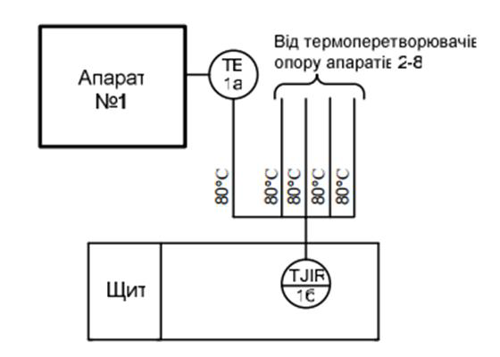

[<- До підрозділу](README.md)

# Схема автоматизації згідно ДСТУ: теоретична частина

Стандарти

- умовні зображення і познаки трубопроводів та їх елементів ДСТУ Б А.2.4-1:2009
- 

## Призначення схем автоматизації

Загальна інформація, яка означає процес, підтримується у формі, яка є одночасно простою та легкою для читання, але без усієї детальної інформації, необхідної спеціалісту. Прикладом загального документа є креслення трубопроводів і приладів (P&ID). Загальний документ служить ключем до більш детальних документів. Представлення та зберігання інформації стало більш ефективним. Загальна картина та спільна інформація, корисна для більшості людей, містяться в загальному документі. У детальному документі зберігається інформація, яка буде використана фахівцями для конкретизації проекту.

Документи, що описують сучасні промислові процеси, як і більшість технічних робіт, припускають певний рівень розуміння з боку читача. У документах використовується схематична «мова», заснована на символах, яка може нагадувати ієрогліфи майя для тих, хто не знайомий з номенклатурою процесу. Однак символи містять велику кількість інформації для тих, хто навчений їх перекладати. Традиція та стандарти також регулюють представлення цих символів на документі. Дійсно, саме існування деяких типів документів може здатися дивним, якщо спостерігач не розуміє їх призначеної функції. Як і будь-яка сучасна сучасна мова, символи та їх застосування постійно вдосконалюються, щоб відповідати новим викликам.

Для того щоб зобразити механічне обладнання, трубопроводи, елементи трубопроводів, клапани, двигуни, прилади контролю та керування використовуються набори позначень. Ці позначення показуються на схемі автоматизації таким чином, щоб чітко означити технологічний процес. Позначення для приладів контролю та керування (instrumentation and control, I&C) що використовуються в схемах P&ID в основному беруться з ISA-5.1-1984-(R1992), Instrumentation Symbols and Identification.  

Ця книга допоможе у вирішенні довго існуючої до сих пір заплутаності інформації про P&ID. Існування плутанини зрозуміле, бо немає універсального стандарту для означення того, яка інформація повинна бути включена в P&ID, ба навіть значення літер "P","I" та "D". Ви можете стопроцентово знати що значать ці літери і сама абревіатура P&ID, але спец на об’єкті може з цими трактуваннями не погодитися. Наприклад "P" може значити Process (процес) чи Piping (трубопровід). Літера "I" може значити[Instrument](http://asu.in.ua/viewtopic.php?f=251&t=135) (прилад) або[ Instrumentation](http://asu.in.ua/viewtopic.php?f=251&t=135) (засоби КВП). "D" можна трактувати як Drawing (креслення, схема) або Diagram (діаграма, схема). P&ID можуть називати "Потоковими діаграмами" (Flow Diagrams), які не треба плутати з тими, що розглянуті в попередній главі. P&ID інколи називають "потоковими листами" (Flow Sheets). Термін часто означується відділом, який ініціює або розробляє їх, наприклад Інженери або Автоматники. У цій книзі для простоти, ми будемо звертатися до цього документу просто по абревіатурі P&ID.    

> Переклад деяких термінів дається та обговорюється на[ форумі АСУ в Україні](http://asu.in.ua/viewforum.php?f=251).  

Немає універсального, національного або міжнародного, багатопрофільного стандарту, що охоплює розвиток і зміст P&ID. Тим не менше, більша частина інформації про використання P&ID розглядається в ISA-5.1, який є чудовим, гнучким елементом, що означує, в першу чергу, позначення приладів. 

У цій книзі в якості кінцевого посилання використовується ISA-5.1. Ми розуміємо, що цей документ на момент написання книги, на початку 2004 року, знаходиться на стадії розгляду і перегляду. Після переробки, в стандарт ймовірно будуть внесені деякі зміни, але ми впевнені, що наміри та фокус стандарту будуть збережені. 

Інша професійна організація, Process Industry Practices (PIP), розробила та опублікувала багато рекомендованих практик. Серед них одна на P&ID. Додаткову інформацію про PIP можете отримати з розділу [10](10.md).

Ймовірно, що на вашому підприємстві схеми P&ID були розроблені та перероблені протягом багатьох років декількома розробниками. Для вдосконалення та доповнення технологічного процесу а також зміни системи керування, до редагування змісту і навіть набору позначень на ваших P&ID допущено багато різних людей. Якщо ви тільки не є неймовірно везучим в наявності підтримки корпоративних стандартів, деякі з ваших схем P&ID будуть використовувати позначення та формат відмінний від оригіналу, та навіть один від одного. Як Ви добре розумієте, непослідовність використання позначень та формату P&ID може дратувати, плутати і що більш важливо, робить інформацію на цих схемах суб’єктом непорозумінь. 

Хоч схема P&ID є документом, що використовується для означення процесу, перший документ, що розробляється при проектуванні технологічного процесу є схема технологічного процесу (PFD, Process Flow Diagram), що розглядається в розділі [1](1.md). Після того як PFD випускається для подальшого проектування, схема може бути використана для створення P&ID. 

Схеми P&ID розробляються покроково. Ключові члени команди розробників, можливо технологи, монтажники, проектувальники викладають концептуальний підхід щодо зображення резервуарів, обладнань та основних трубопроводів. Засоби КВПіА як правило добавляються опісля, так як вони часто потребують значного додаткового місця на схемі. Як сказав один із менеджерів проекту, "у вас, хлопці, багато бульбашок". Ці спеціалісти заповнюють інформаційні блоки що вміщують номера обладнання, титули та кінцевий текст зарезервований для критичної інформації про обладнання: розмір, потужність, пропускна здатність, необхідність в дод. обладнанні. Процес проектування є ітеративним. Інформація добавляється покроково до тих пір, поки документ не стане заповнений всіма необхідними деталями.

Схеми P&IDs – це офіційні документи, які контролюються на різних стадіях. Контроль означає зміни в схемах, що ідентифікуються і чітко документуються належним чином, які перевіряються або проходять інші процедури якісної перевірки. Такий догляд за контролем наповнення схеми P&ID може бути зрозумілим у світлі того факту, що P&ID несуть остаточну інформацію з якою працюють багато різних учасників проекту. З P&ID беруться відомості (переліки) приладів (Instrument List) а також специфікація, придбання та встановлення всіх засобів КВПіА, переліки двигунів з їх потужністю (motor list with horsepower). З P&ID беруться перелік ліній трубопроводів (piping line list), розміри, призначення та обслуговування. На схемах навіть зазначають важливу інформацію про резервуари, ємності та інше обладнання – все що використовується для створення специфікації і закупки обладнання. У деяких штатах, P&ID мають штампи професійних інженерів.

Після якісної контрольної перевірки P&ID-схеми розповсюджуються серед учасників проектної групи і зацікавленого персоналу клієнту. Цей формальний випуск (issue) проходить декілька раз в ході проектних робіт. Ці схеми настільки важливі, що ключові етапи часто вписуються в графік проектних робіт з урахуванням різних випусків P&ID. Деякі типові формальні випуски P&ID схем можуть містити:

A – випуск для означення області дії

B – випуск для затвердження клієнтом

C – випуск для замовлення та закупки основного обладнання

D – випуск для детального проектування

0 – випуск для побудови (або 1, чи 2, чи 3, і.т.д.)

Перш, ніж ми почнемо розглядати P&ID означимо декілька термінів, з особливим акцентом на прилади та елементи керування.

Нижче наведено декілька простих означень. 

- **Прилад** (Instrument) - Пристрій для вимірювання, показу або керування

- **Керування процесом** (Process control) - все керування на першому рівні – процесне або дискретне – складається з трьох частин:

  - ​    зчитування, отримання інформації з об’єкту (sensing)

  - ​    порівняння з необхідним (comparing)

  - ​    коригування, внесення змін в процес (correcting)

Прилад (Instrument) - це пристрій для вимірювання, відображення або керування процесом. Прилади можуть бути як простими так і складними пристроями. Манометри (Pressure gauges) або стрілкові термометри (dial thermometers) – це типові прості пристрої. Складні пристрої можуть включати аналізатори процесу – припустимо газовий хроматограф, що визначає тип і кількість компонентів газу в технологічному потоці. Термін "Керування процесом" (“Process Control”) можна зрозуміти з будь-якого словникового визначення двох слів. У найпростішій формі, процес (Process) є послідовністю кроків, а керувати (Control) - може бути регулювати (regulate). Таким чином Process Control є регулювання послідовністю кроків. Усі типи керування процесом включають три функції: зчитування, порівняння та коригування.

Стандарт ДСТУ Б А.2.4-16:2008 встановлює умовні зображення приладів, засобів автоматизації і ліній зв'язку, які застосовуються при виконанні схем автоматизації технологічних процесів. 

Стандарт ДСТУ Б А.2.4-16:2008 став на заміну скасованому в Україні ГОСТ 21.404-85 і по факту є повністю перекладеним українською мовою російськомовний ГОСТ 21.404-85.

## Графічні позначення

Допускається використовувати додаткові графічні зображення, не передбачені даним стандар-том. Додаткові графічні зображення повинні бути розшифровані на схемі.

| Найменування                                                 | Зображення                                                   | Примітка |
| ------------------------------------------------------------ | ------------------------------------------------------------ | -------- |
| Прилад, що встановлюється поза щитом (за місцем)             |  або  |          |
| Прилад, що встановлюється на щиті, пульті                    |  або  |          |
| Виконавчий механізм. Загальне зображення                     |  |          |
| Виконавчий механізм, який при припиненні подачі енергії або керуючого сигналу відкриває регулюючий орган |  |          |
| Виконавчий механізм, який при припиненні подачі енергії або керуючого сигналу закриває регулюючий орган |  |          |
| Виконавчий механізм, який при припиненні подачі енергії або керуючого сигналу залишає регулюючий орган у незмінному положенні |  |          |
| Виконавчий механізм із додатковим ручним приводом  Зображення може застосовуватися з будь-яким із додаткових знаків, що характеризують положення регулюючого органу при припиненні подачі енергії або керуючого сигналу |  |          |
| Лінія зв'язку                                                |  |          |
| Перетин ліній зв'язку без з'єднання між собою                |  |          |
| Перетин ліній зв'язку зі з'єднанням між собою                |  |          |

Якщо підключення приладу відбувається через відбірний пристрій (на постійній основі), лінію відбору зображають суцільною тонкою лінією, що з'єднує технологічний трубопровід або апарат з приладом (рисунок 1).

За необхідності вказати конкретне місце розташування пристрою для відбору (всередині контура технологічного апарата) його позначають колом діаметром 2,5 мм (рисунок 2).

## Літерні позначення

Основні літерні позначення вимірюваних величин і функціональних ознак приладів повинні відповідати наведеним у таблиці 2 та 3 відповідно. Для позначення величин та функціональних ознак, не передбачених даним стандартом, допускається використовувати резервні літери. Застосування резервних літер повинне бути розшифроване на схемі.  

Порядок розташування букв у літерному позначенні наступний: 

- основне позначення вимірюваної величини; 
- додаткове позначення вимірюваної величини (за необхідності); 
- позначення функціональної ознаки приладу. 

Таблиця 2. Літери на перших позиціях символьного позначення - вимірювальна величина: `+` значить резервна), `-` - значить не використовується)

| Позначення | основне позначення вимірюваної величини          | додаткове позначення, що уточнює вимірювану величину   | Приклади                                                     | Примітка                                                     |
| ---------- | ----------------------------------------------------- | ----------------------------------------------------------- | ------------------------------------------------------------ | ------------------------------------------------------------ |
| A          | +                                                     | -                                                           |                                                              |                                                              |
| B          | + (наприклад полум'я)                                 | -                                                           | `BS` - Прилад для контролю згасання факела в печі безшкальний із контактним пристроєм. Наприклад, вторинний прилад запально-захисного пристрою. | Застосування резервної літери B повинно бути обумовлено на полі схеми |
| C          | +                                                     | -                                                           |                                                              |                                                              |
| D          | Густина                                               | Різниця, перепад                                            | `DT` - Прилад для вимірювання густини розчину безшкальний із дистанційною передачею показань.  `PDI` - Прилад для вимірювання і показу перепаду тиску. Наприклад, дифманометр показувальний |                                                              |
| E          | Електрична величина                                   | -                                                           | `EI` Прилад для вимірювання і показу будь-якої електричної величини, наприклад напруга, сила струму, потужність. | За необхідності конкретизації вимірюваної величини праворуч від графічного зображення приладу допускається вказувати найменування або символ цієї величини. Написи, що розшифровують конкретну вимірювану електричну величину, розташовуються або поряд із приладом, або у вигляді таблиці на полі креслення |
| F          | Витрата                                               | Співвідношення, частка, дріб                                | `FI` - Прилад для вимірювання і показу витрати, встановлений за місцем. Наприклад, дифманометр показувальний. `FFR` Прилад для вимірювання співвідношення витрат. |                                                              |
| G          | Розмір, положення, переміщення                        | -                                                           | `GS` - датчик кінцевого положення регулюючого органу (наприклад "закрито") |                                                              |
| H          | Ручна дія                                             | -                                                           | `H` - Апаратура, призначена для ручного дистанційного керування (включення, виключення двигуна; відкриття, закриття замкового пристрою, зміна завдання регулятору). Наприклад, кнопка, ключ керування тощо | Літерні позначення пристроїв, виконаних у вигляді окремих блоків і призначених для ручних операцій, незалежно від того, до складу якого комплекту вони входять, повинні починатися з букви `Н`. |
| I          | +                                                     | -                                                           |                                                              |                                                              |
| J          | +                                                     | Автоматичне перемикання, оббігання                          | `TJR` - Прилад для вимірювання температури з автоматичним оббігаючим пристроєм, ре-єструючий. Наприклад, багатоточковий самописний потенціометр, міст автоматичний тощо |                                                              |
| K          | Час, часова програма                                  | -                                                           | `KS` - Прилад для керування процесом за тимчасовою програмою. Наприклад, багатоланцюгове реле часу |                                                              |
| L          | Рівень                                                | -                                                           | `LSA` - Прилад для вимірювання рівня з контактним пристроєм. Наприклад, реле рівня, що використовується для блокування і сигналізації верх-нього рівня |                                                              |
| M          | Вологість                                             | -                                                           | `MR` - Прилад для вимірювання вологості реєструючий. Наприклад, вторинний прилад вологоміра |                                                              |
| N          | +  (наприклад магнітна величина)                      | -                                                           | `NS` - Пускова апаратура для керування електродвигуном (включення, виключення насоса; відкриття, закриття засувки тощо).  Наприклад, магнітний пускач, контактор тощо. | Застосування резервної літери N повинне бути обумовлене на полі схеми |
| O          | +                                                     | -                                                           |                                                              |                                                              |
| P          | Тиск, вакуум                                          | -                                                           | `PY` - перетворювач сигналу. Вхідний сигнал пневматичний, вихідний сигнал електричний (вказується в праворуч згори від зображення приладу) |                                                              |
| Q          | Величина, що характеризує якість: склад, концентрація | Інтеграція, підсумову-вання за часом                        | `QE` -  первинний вимірювальний перетворювач (чутливий елемент) для вимірювання якості продукту. Наприклад, датчик рН-метра `FQI` - Прилад для вимірювання витрати інтегруючий. Наприклад, будь-який безшкальний лічильник-витратомір із інтегратором |                                                              |
| R          | Радіоактивність                                       | -                                                           | `RIA` -  Прилад для вимірювання і показу радіоактивності з контактним пристроєм. Наприклад, прилад для показу і сигналізації гранично-допустимих концентрацій α- і β-променів |                                                              |
| S          | Швидкість, частота                                    | -                                                           | `SR` - Прилад для вимірювання швидкості обертання приводу реєструючий. Наприклад, вторинний прилад тахогенератора |                                                              |
| T          | Температура                                           | -                                                           | `TT` - Датчик температури з вбудованим передавачем 4-20 мА   |                                                              |
| U          | Декілька різнорідних вимірюваних величин              | -                                                           | `UR` - прилад для вимірювання декількох різнорідних величин реєструючий. Наприклад, самописний дифманометр-витратомір із додатковим записом тиску. Напис, що розшифровує вимірювані величини, наноситься праворуч від приладу |                                                              |
| V          | В'язкість                                             | -                                                           | `VI`  - Прилад для вимірювання і показу в'язкості розчину. Наприклад, віскозиметр показувальний |                                                              |
| W          | Маса                                                  | -                                                           | `WIA` - прилад для вимірювання і показу маси продукту з контактним пристроєм. Наприклад, пристрій електронно-тензометричний сигнальний |                                                              |
| X          | Нерекомендована резервна буква                        | -                                                           |                                                              |                                                              |
| Y          | +                                                     | -                                                           |                                                              |                                                              |
| Z          | +                                                     | -                                                           |                                                              |                                                              |

При побудові літерних позначень вказують не всі функціональні ознаки приладу, а лише ті, які використовують у даній схемі. Порядок розташування літерних позначень функціональних ознак приладу приймають із дотриманням послідовності позначень: I, R, C, S, А. 

Таблиця 3. Літери на других позиціях символьного позначення - Функціональна ознака приладу: `+` значить резервна), `-` - значить не використовується)

| Позначення | відображення інформації | формування вихідного сигналу                    | додаткове значення               | Приклади                                                     | Примітка                                                     |
| ---------- | ----------------------- | ----------------------------------------------- | -------------------------------- | ------------------------------------------------------------ | ------------------------------------------------------------ |
| A          | Сигналізація            | -                                               | -                                | `LIA` - Прилад для вимірювання і показу рівня з контактним пристроєм. Наприклад, вторинний показувальний прилад з сигнальним пристроєм. | Граничні значення вимірюваних величин, за якими здійснюється, наприклад, включення, відключення, блокування, сигналізація, допускається конкретизувати додаванням літер `Н` і ` L`. Ці літери наносять праворуч від графічного зображення.  Літеру А застосовують для позначення функції "сигналізація" незалежно від того, чи винесена сигнальна апаратура на який-небудь щит або для сигналізації використовуються лампи, вбудовані у сам прилад. |
| B          | -                       | -                                               | -                                |                                                              |                                                              |
| C          | -                       | Автоматичне регулювання, управління             | -                                | `TC` - Регулятор температури безшкальний. Наприклад, ділатометричний регулятор температури |                                                              |
| D          | -                       | -                                               | -                                |                                                              |                                                              |
| E          | Чутливий елемент        | -                                               | -                                | `TE` - Первинний вимірювальний перетворювач (чутливий елемент) для вимірювання температури. Наприклад, перетворювач термоелектричний (термопара), термоперетворювач опору, термобалон манометричного термометра, датчики пірометра тощо | Пристрої, що виконують первинне перетворення: перетворювачі термоелектричні, термоперетворювачі опору, датчики пірометрів, звужуючі пристрої витратомірів тощо. Літера зазначена в стандарті як додаткова |
| F          | -                       | -                                               | -                                |                                                              |                                                              |
| G          | +                       | -                                               | -                                |                                                              |                                                              |
| H          | -                       | -                                               | Верхня межа вимірюваної величини |                                                              |                                                              |
| I          | Показання               | -                                               | -                                | `TI` - Прилад для вимірювання і показу температури. Наприклад, термометр рідинний, термометр манометричний тощо |                                                              |
| J          | -                       | -                                               | -                                |                                                              |                                                              |
| K          | -                       | Станція управління                              | -                                |                                                              | Прилади, що мають перемикач для вибору виду керування і пристрій для дистанційного керування. Літера зазначена в стандарті як додаткова |
| L          | -                       | -                                               | Нижня межа вимірюваної величини  |                                                              |                                                              |
| M          | -                       | -                                               | -                                |                                                              |                                                              |
| N          | -                       | -                                               | -                                |                                                              |                                                              |
| O          | -                       | -                                               | -                                |                                                              |                                                              |
| P          | -                       | -                                               | -                                |                                                              |                                                              |
| Q          | -                       | +                                               | -                                |                                                              |                                                              |
| R          | Реєстрація              |                                                 | -                                | `TR` - Прилад для вимірювання температури одноточковий, реєструючий. Наприклад, логометр, потенціометр тощо |                                                              |
| S          | -                       | Включення, відключення, перемикання, блокування | -                                | `LSA` - Прилад для вимірювання рівня з контактним пристроєм. Наприклад, реле рівня, що використовується для блокування і сигналізації верх-нього рівня | Літеру `S` застосовують для позначення контактного пристрою приладу, що використовується тільки для включення, відключення, перемикання, блокування. При застосуванні контактного пристрою приладу для включення, відключення і одночасно для сигналізації в позначенні приладу використовують обидві літери: `S` і `А`.  Граничні значення вимірюваних величин, за якими здійснюється, наприклад, включення, відключення, блокування, сигналізація, допускається конкретизувати додаванням літер `Н` і `L`. Ці літери наносять праворуч від графічного зображення. |
| T          | -                       | Дистанційна передача                            | -                                | `TT` - Прилад для вимірювання температури безшкальний із дистанційною передачею показань. Наприклад, термометр манометричний (або будь-який інший датчик температури), безшкальний із пневмо- або електропередачею | Прилади безшкальні з дистанційною передачею сигналу: манометри, дифманометри, манометричні термометри. Літера зазначена в стандарті як додаткова |
| U          | -                       | -                                               | -                                |                                                              |                                                              |
| V          | +                       | -                                               | -                                |                                                              | У міжнародних стандартах - клапан, заслінка                  |
| W          | -                       | -                                               | -                                |                                                              |                                                              |
| X          | -                       | -                                               | -                                |                                                              |                                                              |
| Y          | -                       | Перетворення, обчислювальні функції             | -                                | `FY` - Обчислювальний пристрій, що виконує функцію множення. Наприклад, множник на постійний коефіцієнт `K` | Для побудови позначень перетворювачів сигналів і обчислювальних пристроїв. Літера зазначена в стандарті як додаткова |
| Z          | -                       | +                                               | -                                |                                                              |                                                              |

- 

## Правила побудови умовних зображень

Стандарт встановлює два методи побудови умовних зображень: спрощений і розгорнутий. 

При спрощеному методі прилади і засоби автоматизації, що здійснюють складні функції, наприклад, контроль, регулювання, сигналізацію, і виконані у вигляді окремих блоків, відтворюють одним умовним зображенням. При цьому первинні вимірювальні перетворювачі і всю допоміжну апаратуру не зображають. 

При розгорнутому методі побудови кожен прилад або блок, що входить в єдиний вимірювальний, регулюючий або керуючий комплект засобів автоматизації, вказують окремим умовним зображенням. 

Умовні зображення приладів і засобів автоматизації, які застосовуються в схемах, включають графічні зображення, літерні і цифрові позначення. У верхній частині графічного зображення наносять літерні позначення вимірюваної величини і функціональної ознаки приладу, що визначає його призначення. У нижній частині графічного зображення наносять цифрове (позиційне) позначення приладу або комплекту засобів автоматизації. 

При побудові зображень комплектів засобів автоматизації перша літера в позначенні кожного приладу або пристрою (окрім пристроїв ручного управління), які входять у комплект, є найменуванням вимірюваної комплектом величини. 

Підведення ліній зв'язку до приладу зображають у будь-якій точці графічного зображення (зверху, знизу, збоку). За необхідності вказівки напряму передачі сигналу на лініях зв'язку наносять стрілки. 

Принцип побудови умовного зображення приладу наведений на рисунку 3. 4.17 Приклади побудови умовних зображень приладів і засобів автоматизації наведені у додатку Б.

4 При побудові умовних позначень перетворювачів сигналів, обчислювальних пристроїв написи, що
визначають вид перетворення або операції, які здійснюються обчислювальним пристроєм, наносять праворуч від графічного зображення приладу.

Додаткові літерні позначення, які застосовуються для побудови перетворювачів сигналів, обчислювальних пристроїв, наведені в таблиці 3.

3 

Теоретичне заняття розробив [Прізвище або нік розробника Імя](https://github.com). 
