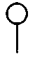
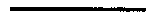
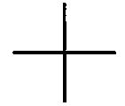
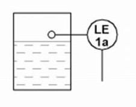

[<- До підрозділу](README.md)

# Схеми автоматизації та P&ID: теоретична частина

## Схеми автоматизації в життєвому циклі установок 

При розробці технології та її реалізації в залізі користуються технологічними схемами,  про які можна почитати в [цій лекції посібника](../pfd/teor.md). На схемах технологічних потоків (PFD) може показуватися тільки загальна інформація щодо засобів КВПіА (контрольно-вимірювальні прилади та автоматизація), яка надає  представлення про місце вимірювання, керування та загальну інформацію про функції засобів автоматизації. Більше детальну інформацію про всі технічні засоби керування які стосуються обладнання та технологічного процесу показуються на схемах, які у вітчизняній та міжнародній практиці називаються по різному:

- **схема автоматизації** (згідно ДСТУ), які також часто називають **функціональними схемами автоматизації** (**ФСА**)
- **P&ID**, або **PID** які мають в різних джерелах різне трактування, зокрема:
  - Process and Instrumentation Diagram (ISO 15519)
  - Piping and Instrumentation Diagram (ISO 10628, ISA 5.1) 
  - та інші комбінації слів Piping/Process, Instrumentation/Instrument, Diagram/Drawing       

Як і назва схем, правила їх виконання залежить від прийнятих стандартів або корпоративних правил. Зокрема сьогодні можна виділити кілька стандартів, які так чи інакше можуть стосуватися українського інжинірингу в напрямку P&ID:

- Стандарт ДСТУ Б А.2.4-16:2008, умовні зображення і познаки трубопроводів та їх елементів, який став на заміну скасованому в Україні ГОСТ 21.404-85
- ISO 15519 - Specifications for diagrams for process industry, міжнародний стандарт, який стосується усіх промисловостей 
- ISA 5.1 (2009) Instrumentation Symbols and Identification, які здебільшого стосуються країн США, північної Америки, деякі країни середньої Азії, Австралія та інші

Додатково до них можна віднести міжнародний стандарт ISO 10628 - Diagrams for the chemical and petrochemical industry, який стосується хімічних та нафтопереробних підприємств, однак там немає детальної інформації щодо виконання P&ID. У той же час є стандарт IEC 64424 "Representation of process control engineering – Requests in P&I diagrams and data exchange between P&ID tools and PCE-CAE tools" який ставить вимого щодо виконання схем P&ID для їх експорту/імпорту в/з системами автоматизованого проектування.  Також для повноти картини варто сказати, що стандарт ISO 15519 замінює ISO 14617-6 в частині умовного позначення засобів та функцій автоматизації.

Не дивлячись на спільні ідеї виконання схеми, ці стандарти інколи мають досить серйозні протиріччя, тому нижче ми зупинимося на загальних концепціях побудови схем автоматизації (надалі буде вживатися саме цей термін як узагальнюючий), а в окремих пунктах особливості їх виконання. у будь якому випадку варто спочатку прочитати лекцію [Технологічні схеми: теоретична частина](../pfd/teor.md) для кращого розуміння матеріалу.

Схеми автоматизації представляють конфігурацію технологічної системи та засобів КВП, тому стосуються кількох інженерних дисциплін, зокрема технологія, механіка, КВПіА, електрика, автоматизоване керування. На рис.1 показаний фрагмент схеми автоматизації з виділенням умовної області діяльності кожної з дисциплін:

- 1 - технологія
- 2 - механіка
- 3 - КВП
- 4 - електрика
- 5 - керування
- A - вимірювання
- B - реалізація керувальної дії

рис.1. Взаємозв'язки інженерних дисциплін  (джерело ISO 15519-2).

Розроблення технологічного процесу передбачає як зосередження на окремих дисциплінах так і пересікання їх. Тому схема автоматизації є тією схемою, яка повинна використовуватися усіма учасниками розроблення та експлуатування технологічного процесу. Оскільки інженерія технологічних процесів за традицією є дисципліною ISO, а інженерія систем керування є дисципліною IEC, представлення КВПіА на діаграмах має бути скоординованим і однозначним. Тому ці міжнародні стандарти взаємозв'язані. Як видно з рис.2, PFD (Process Flow Diagram) стає в основі розроблення P&ID (Process and Instrumentation Digram), а також PCD (Process Control diagram), які є основою для розроблення електричних, пневматичних, гідравлічних принципових схем, що є областю діяльності стандартів IEC.      

рис.2. Взаємозв'язок між схемами стандартів ISO та IEC (джерело ISO 15519-2).

У вітчизняній практиці інжинірингу автоматизації, яка по факту наслідує практику використання старих ГОСТ СРСР, діяли стандарти кількох серій 2 - ЄСКД (єдина система конструкторської документації), 21 - СПДС (система проектної документації для будівництва), 19 - ЄСПД (єдина система програмної документації) та 34 - комплекс стандартів на автоматизовані системи. Саме остання група координувала роботи по ЖЦ систем автоматизації, однак схеми автоматизації були в комплекті будівельних стандартів 21. 

Надалі в цій лекції ми будемо притримуватися здебільшого практик ISO, тоді як практики ДСТУ Б (по факту ГОСТ) викладені в старих доступних матеріалах по проектуванню з часів СРСР. Тим не менше, правила які стосуються виконання схем автоматизації наведені нижче у відповідному пункті.   

## Основні поняття

Розроблення частини схеми автоматизації в частині КВПіА базується на понятті **технологічної змінної**, яку також називають **змінною процесу (process variable, PV)** - це кількість, якість або стан середовища технологічного процесу, або об'єкта процесу, значення якого може бути змінено і зазвичай може бути виміряно (ISO 15519-2). Другим важливим поняттям є **функція керування (control function)** - маніпулювання (вплив) через кінцевий елемент керування технологічного середовища або технологічних об’єктів з метою приведення середовища або об’єкта до умов або стану, що означений системою керування технологічним процесом на основі виміряних технологічних змінних та попередньо означених заданих значень (ISO 15519-2). Це узагальнене означення, яке у свою чергу передбачає виконання кількох функцій. Це відбувається наступним чином:

- вимірювання стану технологічного процесу (технологічних змінних);
- порівняння виміряних значень із попередньо означеними заданими значеннями;
- ініціювання дії функції керування на керуюче обладнання (виконавчі механізми) та/або безпосереднє втручання оператора на кінцеві елементи керування.

рис.3. Ілюстрація взаємозв'язків між технологічними змінними та функціями керування  (джерело ISO 15519-2).

Як видно з рис.3 для реалізації керування використовуються різні функції, зокрема індикація, оповіщення (сигналізація), реєстрація, захист і т.д. Тому надалі під "функціями керування" будемо розуміти саме це тлумачення функції.  

## Умовні позначення

Усі практики виконання схем автоматизації використовують графічні та текстові умовні позначення. Загальні правила їх використання описані в лекції  [Технологічні схеми: теоретична частина](../pfd/teor.md), тут повторимо ту частину, яка стосується саме позначення засобів КВПіА.  

Інформація про керування технологічним процесом представлений у спеціальному символі у вигляді кружка, в якому у верхній частині текстом вказується технологічна змінна та перелік функцій керування, а у нижній - позиційне позначення (рис.4). Сам кружечок може означувати прилад, або перелік функцій в різних приладах, в залежності від прийнятих практик пректування та використаних стандартів. Якщо текстові позначення не поміщаються в кружечку, можна використовувати зображення овалу. Інформація про функції розміщується як всередині так і поза межами кружка. 

рис.4. Умовне позначення інформації про керування технологічним процесом:   

- a) змінна процесу (process variables)
- b) функції керування/контролю (control functions)
- c) позиційне позначення (reference designation) 

Концепція формування текстового позначення, в якому вказується технологічна змінна та функції керування спільна для всіх практик. Однак перелік і призначення самих літер відрізняються в залежності від прийнятих стандартів. Це показано в порівняльних таблицях (таб.1 та таб.2), які детальніше будуть розглянуті у відповідних пунктах лекції. Позиційне позначення також відрізняється як від прийнятих стандартів так і практик, які ці стандарти допускають. У свою чергу поза кружком/овалом може міститися додаткова уточнююча текстова інформація про функції, правила яких звісно також залежать від прийнятих стандартів та практик. 

Графічне позначення кружечка або овалу також може мати додаткові розділові лінії, які уточнюють розміщення технічного засобу (приладу), який реалізовує ці функції. Так, наприклад згідно ДСТУ Б А.2.4-16, якщо прилад для реалізації функції розміщується в щиті перетворювачів, він містить одинарну горизонтальну полосу (рис.5). 

  

рис.5. Умовне графічне позначення приладу, розміщеного в шафі або щиті перетворювачів відповідно до ДСТУ Б А.2.4-16

Ряд стандартів, для зображення інформації про керування змінною використовують не тільки кружки та овали, а також інші фігури - прямокутники, ромби, 6-кутники та їх комбінації. Цим самим вони уточнюють особливість реалізації функції, наприклад в програмованому контролері, інтелектуальному засобі або HMI. Таким чином комбінація фігур та розділових ліній в кружку дають можливість надати більше інформації щодо реалізації функцій. Так на рис.6 показаний фрагмент стандарту ISA-5.1 (2009) в якому показані графічні позначення функцій та приладів КВПіА.   

Рисунок 6. Загальні позначення приладів або функцій згідно ISA-5-1(2009)

Графічні позначення функцій та засобів КВПіА з'єднуються між собою лініями, вказуючи на фізичні або логічні зв'язки між собою. Зрештою вони можуть формувати графічне зображення контурів керування. Так, наприклад, на рис.7 показаний простий приклад фрагменту схеми автоматизації в якому показаний контур регулювання рівня. Засіб з умовним позначенням `P-L1` виконує функцію регулювання рівня, бо має наступне символьне позначення:

- перша літера `L` вказує на рівень (див. таб.1)
- друга літера `C` вказує на автоматичне регулювання (див.таб.2)

Лінія поєднує  `P-L1` з іншим засобом `P-M1`, який виконує функцію керування частотою або швидкістю, бо:

- перша літера `S` вказує на частоту або швидкість
- друга літера `C` вказує на автоматичне регулювання

`P-M1` у свою чергу з'єднаний з двигуном (графічне позначення з літерою `M`), а той з насосом. На даній схемі вони не мають позиційного позначення, це може бути пов'язано з прийнятими практиками проектування. 

рис.7. Приклад фрагменту схеми автоматизації

Функції представлені як `P-L1` та `P-M1` можуть бути по різному реалізовані. З даної схеми це не видно, для цього потрібна уточнююча інформація, яка надається в супутніх таблицях, наприклад відомостях чи специфікаціях. Однак видно, що вимірюється рівень, який регулюється (`LC`) за допомогою насосу з двигуном шляхом регулювання частоти обертання (`SC`) через відповідний засіб (очевидно перетворювач частоти двигуна). Інколи цієї інформації достатньо для читання схеми, однак вона не повністю розкриває реалізацію КВПіА. Якщо ця схема є деталізованою, то ми маємо два технічних засоби:

- датчик температури з вбудованим регулятором, з позицією `P-L1` встановлений по місцю (немає лінії посередині)
- пристрій керування частотою з позицією `P-M1`, встановлений на щиті (є лінія посередині)

Однак якщо це не так, враховуючи наведене вище, ця схема може мати зовсім інший вигляд, з урахуванням інших практик проектування та виконання схеми автоматизації. Так, `LC` можна представити як кілька окремих функцій в різних засобах: `LT` - датчик рівня з вбудованим перетворювачем (наприклад 4-20 мА), та `LC` - окремий регулятор (наприклад апаратний ПІ-регулятор). У свою чергу, `SC` можна показати як `LC` , адже зрештою підтримується рівень. Тому в проекті дуже важливо узгодити ці правила, а в документації необхідно надати всю необхідну інформації щодо читання таких схем.

На рис.7 з'єднання між функціями показані пунктиром. Однак це можуть бути суцільні лінії або різноманітні варіанти пунктирних, штрихових, штрих-пунктирних та інших варіантів зображення, які уточнюють характер сигналу або носія (електричний, пневматичний, гідравлічний, механічний і т.д). 

У таблиці 1 наведений перелік текстових позначень технологічних змінних, що надаються в різних стандартах. Знаком `+`  позначені функції на вибір користувача, якими можна ідентифікувати відсутні в переліках технологічні змінні. Хоч більшість з літер є спільними для всіх стандартів, що спрощує читання схем незалежно від прийнятих при проектуванні практик та стандартів, є досить принципові відмінності в інших літерах.     

Таблиця 1. Текстове позначення технологічної змінної (перша літера)

| Позначення | ДСТУ Б А.2.4-16                                       | ISO 15519-2                                                  | IEC 62424                                                    | ISA 5.1 2009                             |
| ---------- | ----------------------------------------------------- | ------------------------------------------------------------ | ------------------------------------------------------------ | ---------------------------------------- |
| A          | +                                                     | Електрична напруга                                           | Аналіз                                                       | Аналіз                                   |
| B          | + (наприклад полум'я)                                 | +                                                            | Оптичні вимірювання, напр. виявлення полум'я                 | Пальник, запалювання                     |
| C          | +                                                     | Електричний струм                                            | +                                                            | +                                        |
| D          | Густина                                               | Густина                                                      | Густина                                                      | +                                        |
| E          | Електрична величина                                   | Електрична або електромагнітна величина (за виключенням `A` та `C`) | Електрична напруга                                           | Електрична напруга                       |
| F          | Витрата                                               | Витрата                                                      | Витрата                                                      | Витрата, швидкість потоку                |
| G          | Розмір, положення, переміщення                        | Розмір, положення, відстань                                  | Довжина, положення, відстань                                 | +                                        |
| H          | Ручна дія                                             | Ручна дія                                                    | Ручна дія                                                    | Ручна дія                                |
| I          | +                                                     | не дозволяється                                              | Електричний струм                                            | Електричний струм                        |
| J          | +                                                     | Потужність                                                   | Потужність                                                   | Потужність                               |
| K          | Час, розклад                                          | Час                                                          | Час                                                          | Час, розклад                             |
| L          | Рівень                                                | Рівень                                                       | Рівень                                                       | Рівень                                   |
| M          | Вологість                                             | Вологість                                                    | Вологість                                                    | +                                        |
| N          | +  (наприклад магнітна величина)                      | +                                                            | Приведення в дію електричних засобів (усі типи споживачів електроенергії, наприклад двигун, нагрівач) | +                                        |
| O          | +                                                     | не дозволяється                                              | +                                                            | +                                        |
| P          | Тиск, вакуум                                          | Тиск, вакуум                                                 | Тиск                                                         | Тиск                                     |
| Q          | Величина, що характеризує якість: склад, концентрація | Якість                                                       | Якість або лічильник                                         | Кількість                                |
| R          | Радіоактивність                                       | Випромінювання                                               | Випромінювання                                               | Випромінювання                           |
| S          | Швидкість, частота                                    | Швидкість, частота                                           | Швидкість, частота                                           | Швидкість, частота                       |
| T          | Температура                                           | Температура                                                  | Температура                                                  | Температура                              |
| U          | Декілька різнорідних вимірюваних величин              | Декілька різнорідних вимірюваних величин                     | Використовується для функції керування PCE                   | Декілька різнорідних вимірюваних величин |
| V          | В'язкість                                             | +                                                            | Вібрація, механічний аналіз, крутний момент                  | Вібрація, механічний аналіз              |
| W          | Маса                                                  | Маса, сила                                                   | Вага, маса, сила                                             | Вага, сила                               |
| X          | Нерекомендована резервна буква                        | +                                                            | Некласифікована літера X                                     | Некласифікована літера                   |
| Y          | +                                                     | +                                                            | Приведення в дію неелектричних засобів, таких як гідравлічні або пневматичні (перемикання, зміна, обмеження, наприклад, керовані клапаном) | Подія, стан, наявність                   |
| Z          | +                                                     | номер події, кількість (подієорієнтованість в противагу `K`) | +                                                            | Позиція, розмір                          |

В таблиці 2 наведені наступні літери, які позначують функції. Тут треба відмітити, що функцій може бути кілька, і в залежності від позиції літери (друга, третя ... остання) вони можуть мати різне значення (щоб не ускладнювати таблицю це в ній не показано). До таблиці 2 треба відноситися як не до довідкової, а як порівняльної, бо деталізовані дані будуть наведені у відповідних пунктах лекції. Якщо в кружку необхідно вказано кілька функцій, послідовність має значення і також описується в правилах. Частина функцій може бути показано поза кружком.  

Деякі з літер є спільними для всіх стандартів. Хоч їх не так вже й багато, вони покривають більшість з потрібних:

- `A` - сигналізація; це засоби виявлення і оповіщення про ненормальний стан процесу
- `C` - регулювання, керування в замнкутому контурі; це різноманітні регулятори в тому числі реалізовані програмно
- `D` - різниця; дана літера завжди йде другою і уточнює що вимірюється не сама технологічна змінна, а різниця, наприклад  `PD` - перепад тисків, а `PDT` - датчик що вимірює перепад тисків.     
- `I` - показання, індикація; це відображення значення, у видимому і зрозумілому для людини вигляді  
- `R` - реєстрація; це засоби фіксації інформації на носій з можливістю її відновлення за необхідності 
- `S` - переключення/включення, здебільшого стосується двохпозиційного керування, однак використання має ньюанси в залежності від прийнятого стандарту та практик 

Таблиця 2. Текстове позначення функції (наступні літери)

| Позначення | ДСТУ                                            | ISO 15519                                                    | IEC 62424                                                    | ISA 5.1 (2009)                                            |
| ---------- | ----------------------------------------------- | ------------------------------------------------------------ | ------------------------------------------------------------ | --------------------------------------------------------- |
| A          | Сигналізація                                    | Тривога, повідомлення                                        | Тривога, повідомлення                                        | Тривога                                                   |
| B          | не дозволяється                                 | +                                                            | Обмеження                                                    | +                                                         |
| C          | Автоматичне регулювання, управління             | Керування (в замкнутому контурі)                             | Керування (усі види в т.ч ПІД, вкл/откд, зазвичай в замкнутому контурі) | Керування, регулювання                                    |
| D          | Різниця (уточнює першу літеру)                  | Різниця (уточнює першу літеру)                               | Різниця (уточнює першу літеру)                               | Різниця, диференційний (уточнює першу літеру), відхилення |
| E          | Чутливий елемент                                | +                                                            | не дозволяється                                              | Датчик, первинний елемент                                 |
| F          | не дозволяється                                 | +                                                            | співвідношення                                               | співвідношення                                            |
| G          | +                                               | +                                                            | не дозволяється                                              | Скло, мірчий прилад, пристрій спостереження               |
| H          | Верхня межа вимірюваної величини                | Верхня межа (вказується поза кружком)                        | Верхня межа, увімкнено, відкрито                             | Верхня межа (мод.функц)                                   |
| I          | Показання                                       | Показання                                                    | Показання аналогових величин                                 | Показання                                                 |
| J          | не дозволяється                                 | +                                                            | не дозволяється                                              | Сканування                                                |
| K          | Станція управління                              | +                                                            | Швидкість зміни в часі, напр. прискорення                    | Швидкість зміни                                           |
| L          | Нижня межа вимірюваної величини                 | Нижня межа (вказується поза кружком)                         | Нижня межа, вимкнено, закрито                                | Світло, Нижня межа (мод.функц)                            |
| M          | не дозволяється                                 | +                                                            | не дозволяється                                              | Середній, проміжний (мод.функц)                           |
| N          | не дозволяється                                 | +                                                            | не дозволяється                                              | +                                                         |
| O          | не дозволяється                                 | +                                                            | Локальна або PCS індикація стану двійкових сигналів          | отвір, обмеження; відкрито (мод.функц)                    |
| P          | не дозволяється                                 | підключення відбору проби                                    | підключення відбору проби                                    | підключення відбору проби                                 |
| Q          | +                                               | +                                                            | Інтегрування, кількість або підрахунок                       | Інтегрування, підсумовування                              |
| R          | Реєстрація                                      | Реєстрація                                                   | Записане значення                                            | Реєстрація, запуск (мод.функц)                            |
| S          | Включення, відключення, перемикання, блокування | Переключення (в розімкнутому контурі)                        | Двійкова функція керування або функція перемикання (не стосується безпеки) | Безпека, Перемикання, Зупинка (мод.функц)                 |
| T          | Дистанційна передача                            | +                                                            | не дозволяється                                              | Дистанційна передача                                      |
| U          | не дозволяється                                 | +                                                            | не дозволяється                                              | Декілька функцій                                          |
| V          | +                                               | +                                                            | не дозволяється                                              | Клапан,заслінка, жалюзі                                   |
| W          | не дозволяється                                 | +                                                            | не дозволяється                                              | Проба                                                     |
| X          | не дозволяється                                 | +                                                            | Некласифікована літера X                                     | X-вісь, Допоміжний пристрій                               |
| Y          | Перетворення, обчислювальні функції             | +                                                            | Обчислювальна функція                                        | Y-вісь                                                    |
| Z          | +                                               | Переключення (в розімкнутому контурі), орієнтована на безпеку | Двійкова функція керування або функція перемикання (безпекова) | Z-вісь, аварійний захист                                  |

Таким чином, для розуміння схеми автоматизації необхідно знати за якими стандартами та правилами вона виконується, та мати відповідні супровідні таблиці та описи до неї. Нижче розглядається кілька варіантів виконання таких схем.  

## Виконання схем автоматизації відповідно до ДСТУ Б А.2.4-16

Стандарт ДСТУ Б А.2.4-16:2008 встановлює умовні зображення приладів, засобів автоматизації і ліній зв'язку, які застосовуються при виконанні схем автоматизації технологічних процесів. Він став на заміну скасованому в Україні ГОСТ 21.404-85 і по факту є повністю перекладеним українською мовою російськомовний ГОСТ 21.404-85. 

### Умовні позначення

Перелік умовних графічних позначень показаний в таблиці 3. Допускається використовувати додаткові графічні зображення, не передбачені даним стандартом. Додаткові графічні зображення повинні бути розшифровані на схемі. Усі засоби є фізичними приладами, а не зображенням груп функцій в межах іншого приладу.

Таблиця 3. Умовні графічні позначення на схемі автоматизації. 

| Найменування                                                 | Зображення                                                   | Примітка |
| ------------------------------------------------------------ | ------------------------------------------------------------ | -------- |
| Прилад, що встановлюється поза щитом (за місцем)             |  або  |          |
| Прилад, що встановлюється на щиті, пульті                    |  або  |          |
| Виконавчий механізм. Загальне зображення                     |  |          |
| Виконавчий механізм, який при припиненні подачі енергії або керуючого сигналу відкриває регулюючий орган |  |          |
| Виконавчий механізм, який при припиненні подачі енергії або керуючого сигналу закриває регулюючий орган |  |          |
| Виконавчий механізм, який при припиненні подачі енергії або керуючого сигналу залишає регулюючий орган у незмінному положенні |  |          |
| Виконавчий механізм із додатковим ручним приводом. Зображення може застосовуватися з будь-яким із додаткових знаків, що характеризують положення регулюючого органу при припиненні подачі енергії або керуючого сигналу |  |          |
| Лінія зв'язку                                                |  |          |
| Перетин ліній зв'язку без з'єднання між собою                |  |          |
| Перетин ліній зв'язку зі з'єднанням між собою                |  |          |

Якщо підключення приладу відбувається через відбірний пристрій (на постійній основі), лінію відбору зображають суцільною тонкою лінією, що з'єднує технологічний трубопровід або апарат з приладом (рисунок 8).

рис.8. Підключення через відбірний пристрій.

За необхідності вказати конкретне місце розташування пристрою для відбору (всередині контура технологічного апарата) його позначають колом діаметром 2,5 мм (рис.9).

рис.9. Позначення місце розташування пристрою відбору

Умовні зображення приладів і засобів автоматизації, які застосовуються в схемах, включають графічні зображення, літерні і цифрові позначення. Як і для інших стандартів у верхній частині графічного зображення наносять літерні позначення вимірюваної величини (технологічної змінної) і функціональної ознаки приладу, що означує його призначення.  У нижній частині графічного зображення наносять цифрове (позиційне) позначення приладу або комплекту засобів автоматизації. Принцип побудови умовного зображення приладу наведений на рисунку 3. 4.17 Приклади побудови умовних зображень приладів і засобів автоматизації наведені у додатку Б.

рис.10. Принцип побудови умовного зображення приладу

Підведення ліній зв'язку до приладу зображають у будь-якій точці графічного зображення (зверху, знизу, збоку). За необхідності вказівки напряму передачі сигналу на лініях зв'язку наносять стрілки.

Основні літерні позначення вимірюваних (технологічних) величин і функціональних ознак приладів повинні відповідати наведеним у таблиці 4 та 5 відповідно. Для позначення величин та функціональних ознак, не передбачених стандартом, допускається використовувати резервні літери. Застосування резервних літер повинне бути розшифроване на схемі.  

Порядок розташування букв у літерному позначенні наступний: 

- основне позначення вимірюваної величини; 
- додаткове позначення вимірюваної величини (за необхідності); 
- позначення функціональної ознаки приладу. 

Таблиця 4. Літери на перших позиціях символьного позначення - вимірювальна величина: `+` значить резервна), `-` - значить не використовується)

| Позначення | основне позначення вимірюваної величини          | додаткове позначення, що уточнює вимірювану величину   | Приклади                                                     | Примітка                                                     |
| ---------- | ----------------------------------------------------- | ----------------------------------------------------------- | ------------------------------------------------------------ | ------------------------------------------------------------ |
| A          | +                                                     | -                                                           |                                                              |                                                              |
| B          | + (наприклад полум'я)                                 | -                                                           | `BS` - Прилад для контролю згасання факела в печі безшкальний із контактним пристроєм. Наприклад, вторинний прилад запально-захисного пристрою. | Застосування резервної літери B повинно бути обумовлено на полі схеми |
| C          | +                                                     | -                                                           |                                                              |                                                              |
| D          | Густина                                               | Різниця, перепад                                            | `DT` - Прилад для вимірювання густини розчину безшкальний із дистанційною передачею показань.  `PDI` - Прилад для вимірювання і показу перепаду тиску. Наприклад, дифманометр показувальний |                                                              |
| E          | Електрична величина                                   | -                                                           | `EI` Прилад для вимірювання і показу будь-якої електричної величини, наприклад напруга, сила струму, потужність. | За необхідності конкретизації вимірюваної величини праворуч від графічного зображення приладу допускається вказувати найменування або символ цієї величини. Написи, що розшифровують конкретну вимірювану електричну величину, розташовуються або поряд із приладом, або у вигляді таблиці на полі креслення |
| F          | Витрата                                               | Співвідношення, частка, дріб                                | `FI` - Прилад для вимірювання і показу витрати, встановлений за місцем. Наприклад, дифманометр показувальний. `FFR` Прилад для вимірювання співвідношення витрат. |                                                              |
| G          | Розмір, положення, переміщення                        | -                                                           | `GS` - датчик кінцевого положення регулюючого органу (наприклад "закрито") |                                                              |
| H          | Ручна дія                                             | -                                                           | `H` - Апаратура, призначена для ручного дистанційного керування (включення, виключення двигуна; відкриття, закриття замкового пристрою, зміна завдання регулятору). Наприклад, кнопка, ключ керування тощо | Літерні позначення пристроїв, виконаних у вигляді окремих блоків і призначених для ручних операцій, незалежно від того, до складу якого комплекту вони входять, повинні починатися з букви `Н`. |
| I          | +                                                     | -                                                           |                                                              |                                                              |
| J          | +                                                     | Автоматичне перемикання, оббігання                          | `TJR` - Прилад для вимірювання температури з автоматичним оббігаючим пристроєм, ре-єструючий. Наприклад, багатоточковий самописний потенціометр, міст автоматичний тощо |                                                              |
| K          | Час, часова програма                                  | -                                                           | `KS` - Прилад для керування процесом за тимчасовою програмою. Наприклад, багатоланцюгове реле часу |                                                              |
| L          | Рівень                                                | -                                                           | `LSA` - Прилад для вимірювання рівня з контактним пристроєм. Наприклад, реле рівня, що використовується для блокування і сигналізації верх-нього рівня |                                                              |
| M          | Вологість                                             | -                                                           | `MR` - Прилад для вимірювання вологості реєструючий. Наприклад, вторинний прилад вологоміра |                                                              |
| N          | +  (наприклад магнітна величина)                      | -                                                           | `NS` - Пускова апаратура для керування електродвигуном (включення, виключення насоса; відкриття, закриття засувки тощо).  Наприклад, магнітний пускач, контактор тощо. | Застосування резервної літери N повинне бути обумовлене на полі схеми |
| O          | +                                                     | -                                                           |                                                              |                                                              |
| P          | Тиск, вакуум                                          | -                                                           | `PY` - перетворювач сигналу. Вхідний сигнал пневматичний, вихідний сигнал електричний (вказується в праворуч згори від зображення приладу) |                                                              |
| Q          | Величина, що характеризує якість: склад, концентрація | Інтеграція, підсумовування за часом                         | Первинний вимірювальний перетворювач (чутливий елемент) для вимірювання якості продукту. Наприклад, датчик рН-метра `FQI` - Прилад для вимірювання витрати інтегруючий. Наприклад, будь-який безшкальний лічильник-витратомір із інтегратором | За необхідності конкретизації вимірюваної величини праворуч від графічного зображення приладу допускається вказувати найменування або символ цієї величини. |
| R          | Радіоактивність                                       | -                                                           | `RIA` -  Прилад для вимірювання і показу радіоактивності з контактним пристроєм. Наприклад, прилад для показу і сигналізації гранично-допустимих концентрацій α- і β-променів |                                                              |
| S          | Швидкість, частота                                    | -                                                           | `SR` - Прилад для вимірювання швидкості обертання приводу реєструючий. Наприклад, вторинний прилад тахогенератора |                                                              |
| T          | Температура                                           | -                                                           | `TT` - Датчик температури з вбудованим передавачем 4-20 мА   |                                                              |
| U          | Декілька різнорідних вимірюваних величин              | -                                                           |  - прилад для вимірювання декількох різнорідних величин реєструючий. Наприклад, самописний дифманометр-витратомір із додатковим записом тиску. Напис, що розшифровує вимірювані величини, наноситься праворуч від приладу |                                                              |
| V          | В'язкість                                             | -                                                           | `VI`  - Прилад для вимірювання і показу в'язкості розчину. Наприклад, віскозиметр показувальний |                                                              |
| W          | Маса                                                  | -                                                           | `WIA` - прилад для вимірювання і показу маси продукту з контактним пристроєм. Наприклад, пристрій електронно-тензометричний сигнальний |                                                              |
| X          | Нерекомендована резервна буква                        | -                                                           |                                                              |                                                              |
| Y          | +                                                     | -                                                           |                                                              |                                                              |
| Z          | +                                                     | -                                                           |                                                              |                                                              |

При побудові літерних позначень вказують не всі функціональні ознаки приладу, а лише ті, які використовують у даній схемі. Порядок розташування літерних позначень функціональних ознак приладу приймають із дотриманням послідовності позначень: `I`, `R`, `C`, `S`, `А`. 

Таблиця 5. Літери на других позиціях символьного позначення - Функціональна ознака приладу: `+` значить резервна), `-` - значить не використовується)

| Позначення | відображення інформації | формування вихідного сигналу                    | додаткове значення               | Приклади                                                     | Примітка                                                     |
| ---------- | ----------------------- | ----------------------------------------------- | -------------------------------- | ------------------------------------------------------------ | ------------------------------------------------------------ |
| A          | Сигналізація            | -                                               | -                                | `LIA` - Прилад для вимірювання і показу рівня з контактним пристроєм. Наприклад, вторинний показувальний прилад з сигнальним пристроєм. | Граничні значення вимірюваних величин, за якими здійснюється, наприклад, включення, відключення, блокування, сигналізація, допускається конкретизувати додаванням літер `Н` і ` L`. Ці літери наносять праворуч від графічного зображення.  Літеру А застосовують для позначення функції "сигналізація" незалежно від того, чи винесена сигнальна апаратура на який-небудь щит або для сигналізації використовуються лампи, вбудовані у сам прилад. |
| B          | -                       | -                                               | -                                |                                                              |                                                              |
| C          | -                       | Автоматичне регулювання, управління             | -                                | `TC` - Регулятор температури безшкальний. Наприклад, ділатометричний регулятор температури |                                                              |
| D          | -                       | -                                               | -                                |                                                              |                                                              |
| E          | Чутливий елемент        | -                                               | -                                | `TE` - Первинний вимірювальний перетворювач (чутливий елемент) для вимірювання температури. Наприклад, перетворювач термоелектричний (термопара), термоперетворювач опору, термобалон манометричного термометра, датчики пірометра тощо | Пристрої, що виконують первинне перетворення: перетворювачі термоелектричні, термоперетворювачі опору, датчики пірометрів, звужуючі пристрої витратомірів тощо. Літера зазначена в стандарті як додаткова |
| F          | -                       | -                                               | -                                |                                                              |                                                              |
| G          | +                       | -                                               | -                                |                                                              |                                                              |
| H          | -                       | -                                               | Верхня межа вимірюваної величини |  - Прилад для вимірювання і показу рівня з контактним пристроєм, встановлений на щиті. Наприклад, вторинний показувальний прилад з сигнальним пристроєм. Літери Н і L означають сигналізацію верхнього та нижнього рівнів |                                                              |
| I          | Показання               | -                                               | -                                | `TI` - Прилад для вимірювання і показу температури. Наприклад, термометр рідинний, термометр манометричний тощо |                                                              |
| J          | -                       | -                                               | -                                |                                                              |                                                              |
| K          | -                       | Станція управління                              | -                                |                                                              | Прилади, що мають перемикач для вибору виду керування і пристрій для дистанційного керування. Літера зазначена в стандарті як додаткова |
| L          | -                       | -                                               | Нижня межа вимірюваної величини  |  - Прилад для вимірювання і показу рівня з контактним пристроєм, встановлений на щиті. Наприклад, вторинний показувальний прилад з сигнальним пристроєм. Літери Н і L означають сигналізацію верхнього та нижнього рівнів |                                                              |
| M          | -                       | -                                               | -                                |                                                              |                                                              |
| N          | -                       | -                                               | -                                |                                                              |                                                              |
| O          | -                       | -                                               | -                                |                                                              |                                                              |
| P          | -                       | -                                               | -                                |                                                              |                                                              |
| Q          | -                       | +                                               | -                                |                                                              |                                                              |
| R          | Реєстрація              |                                                 | -                                | `TR` - Прилад для вимірювання температури одноточковий, реєструючий. Наприклад, логометр, потенціометр тощо |                                                              |
| S          | -                       | Включення, відключення, перемикання, блокування | -                                | `LSA` - Прилад для вимірювання рівня з контактним пристроєм. Наприклад, реле рівня, що використовується для блокування і сигналізації верх-нього рівня | Літеру `S` застосовують для позначення контактного пристрою приладу, що використовується тільки для включення, відключення, перемикання, блокування. При застосуванні контактного пристрою приладу для включення, відключення і одночасно для сигналізації в позначенні приладу використовують обидві літери: `S` і `А`.  Граничні значення вимірюваних величин, за якими здійснюється, наприклад, включення, відключення, блокування, сигналізація, допускається конкретизувати додаванням літер `Н` і `L`. Ці літери наносять праворуч від графічного зображення. |
| T          | -                       | Дистанційна передача                            | -                                | `TT` - Прилад для вимірювання температури безшкальний із дистанційною передачею показань. Наприклад, термометр манометричний (або будь-який інший датчик температури), безшкальний із пневмо- або електропередачею | Прилади безшкальні з дистанційною передачею сигналу: манометри, дифманометри, манометричні термометри. Літера зазначена в стандарті як додаткова |
| U          | -                       | -                                               | -                                |                                                              |                                                              |
| V          | +                       | -                                               | -                                |                                                              | У міжнародних стандартах - клапан, заслінка                  |
| W          | -                       | -                                               | -                                |                                                              |                                                              |
| X          | -                       | -                                               | -                                |                                                              |                                                              |
| Y          | -                       | Перетворення, обчислювальні функції             | -                                |  - Обчислювальний пристрій, що виконує функцію множення. Наприклад, множник на постійний коефіцієнт `K` - Перетворювач сигналу, встановлений за місцем. Вхідний сигнал пневматичний, вихідний сигнал електричний | Для побудови позначень перетворювачів сигналів і обчислювальних пристроїв. Літера зазначена в стандарті як додаткова |
| Z          | -                       | +                                               | -                                |                                                              |                                                              |

При побудові умовних позначень перетворювачів сигналів, обчислювальних пристроїв написи, що означують вид перетворення або операції, які здійснюються обчислювальним пристроєм, наносять праворуч від графічного зображення приладу. Додаткові літерні позначення, які застосовуються для побудови перетворювачів сигналів, обчислювальних пристроїв, наведені в таблиці 6.

Таблиця 6. Додаткові літерні позначення.

### Правила побудови умовних зображень

Стандарт встановлює два методи побудови умовних зображень: спрощений і розгорнутий. 

- При спрощеному методі прилади і засоби автоматизації, що здійснюють складні функції, наприклад, контроль, регулювання, сигналізацію, і виконані у вигляді окремих блоків, відтворюють одним умовним зображенням. При цьому первинні вимірювальні перетворювачі і всю допоміжну апаратуру не зображають. 

- При розгорнутому методі побудови кожен прилад або блок, що входить в єдиний вимірювальний, регулюючий або керуючий комплект засобів автоматизації, вказують окремим умовним зображенням. 

Далі буде.

### Виконання схем автоматизації відповідно до ISO 15519-2

даний розділ планується дописати в майбутньому

Теоретичне заняття розробив [Прізвище або нік розробника Імя](https://github.com). 

Про проект народного посібника "Автоматизація технологічних процесів та виробництв" і як допомогти проекту читайте [у описі проекту](../../README.md)

Свої зауваження та пропозиції в тому числі стосовно перекладів можете написати в створених для цього групах та темах, зокрема 

- [Обговорення в Телеграм](https://t.me/+GA2smCKs5QU1MWMy)
- [Обговорення у WhatsApp](https://chat.whatsapp.com/BRbPAQrE1s7BwCLtNtMoqN)
- [Пост у Facebook](https://www.facebook.com/groups/asu.in.ua/posts/26427774536869927/)
- [Пост у Linkedin](https://www.linkedin.com/in/oleksandr-pupena-67aa0b33/)
