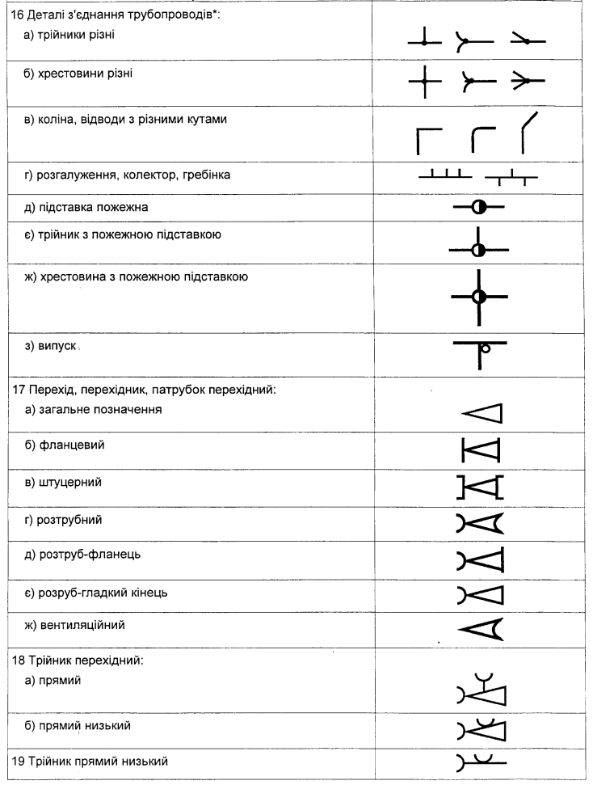

[Графічні символи для технологічних схем](symbols.md)

# Графічні символи для трубопроводів (Graphical symbols for piping) 

## ISO 10628-2 та ISO 14617

| Номер | Реєстр. номер | графічний символ                                             | Опис (Англ)                           | Опис (укр)                                                   | Опис (Нім)                              |
| ----- | ------------- | ------------------------------------------------------------ | ------------------------------------- | ------------------------------------------------------------ | --------------------------------------- |
| 25.1  | 405           |                            | Pipeline                              | Трубопровід                                                  | Rohrleitung                             |
| 25.2  | X8156         |                 | Secondary pipeline                    | Вторинний трубопровід                                        | Nebenleitung                            |
| 25.3  | 241           |  | Flowmotion in direction of arrow      | Рух потоку в напрямку стрілки                                | Bewegung in Flussrichtung               |
| 25.4  | 3061          |                                   | Slope                                 | нахил                                                        | Gefälle                                 |
| 25.5  | 2038          |                                   | Siphon                                | Сифон                                                        | Siphon                                  |
| 25.6  | C0106         |  | Tracer for heating or cooling         | Теплоносій для обігріву або охолодження                      | Rohr, beheizt oder gekühlt              |
| 25.7  | X409          |  | Jacketed pipeline                     | Трубопровід з обшивкою                                       | Rohr mit Mantelrohr oder mit Schutzrohr |
| 25.8  | X8174         |  | Piping heated or cooled and insulated | Трубопровід, що обігрівається або охолоджується і ізольований | Rohr, beheizt oder gekühlt und gedämmt  |
| 25.9  | X322          |  | Pipeline with thermal insulation      | Трубопровід з термоізоляцією                                 | Rohr, gedämmt                           |

## ДСТУ Б А.2.4-1:2009

Таб. 1. Ліерно-цифрові по[з](http://www.dbn.com.ua/)наки трубопроводів зовнішніх мереж водопостачання, каналізації, теплових мереж, га[з](http://www.dbn.com.ua/)опроводів, внутрішнього водопроводу і каналізації, гарячого водопостачання, опалення, вентиляції.

| Найменування                                                 | Літерно-цифрові познаки |
| ------------------------------------------------------------ | ----------------------- |
| **1 Водопровід:**                                            |                         |
| а) загальне позначення                                       | ВО                      |
| б) господарсько-питний                                       | В1                      |
| в) протипожежний                                             | В2                      |
| г) виробничий                                                |                         |
| - загальне позначення                                        | ВЗ                      |
| - оборотної води подавальний                                 | В4                      |
| - оборотної води зворотний                                   | В5                      |
| - зм'якшеної води                                            | В6                      |
| - річкової води                                              | В7                      |
| - річкової освітленої води                                   | В8                      |
| - підземної води                                             | В9                      |
| **2 Каналізація:**                                           |                         |
| а) загальне позначення                                       | КО                      |
| б) побутова                                                  | К1                      |
| в) дощова                                                    | К2                      |
| г) виробнича:                                                |                         |
| - загальне позначення                                        | КЗ                      |
| - вод, що містять шлам                                       | К6                      |
| - хімічно забруднених вод                                    | К7                      |
| - кислих вод                                                 | К8                      |
| - лужних вод                                                 | К9                      |
| - кислотолужних вод                                          | К10                     |
| - вод, що містять ціан                                       | К11                     |
| - вод, що містять хром                                       | К12                     |
| **3 Теплопровід:**                                           |                         |
| а) загальна познака                                          | ТО                      |
| б) трубопровід гарячої води для опалення і вентиляції (в тому числі кондиціювання), а також загальний для опалення, вентиляції, гарячого водопостачання і технологічних процесів: |                         |
| - подавальний                                                | Т1                      |
| - зворотний                                                  | Т2                      |
| в) трубопровід гарячої води для гарячого водопостачання:     |                         |
| - подавальний                                                | ТЗ                      |
| - циркуляційний                                              | Т4                      |
| г) трубопровід гарячої води для технологічних процесів:      |                         |
| - подавальний                                                | Т5                      |
| - зворотний                                                  | Т6                      |
| д) трубопровід:                                              |                         |
| - пари (паропровід)                                          | Т7                      |
| - конденсату (конденсатопровід)                              | Т8                      |
| **4 Газопровід:**                                            |                         |
| а) загальна познака                                          | ГО                      |
| б) низького тиску до 5 кПа (0,05 кгс                         | см2)                    |
| в) середнього тиску більше 5 кПа (0,05кгс                    | см2) до 0,3 МПа (3 кгс  |
| г) високого тиску більше 0,3 (3) до 0,6 МПа (6 кгс           | см2)                    |
| д) високого тиску більше 0,6 (6) до 1,2 МПа (12 кгс/см2)     | Г4                      |
| є) газопровід продувочний                                    | Г5                      |
| ж) трубопровід на розрідження                                | Г6                      |