[Графічні символи для технологічних схем](symbols.md)

# Умовні графічні зображення і познаки елементів санітарно-технічних систем відповідно до ДСТУ Б А.2.4-8:2009

Таблиця 1. Умовні графічні зображення елементів загального застосування

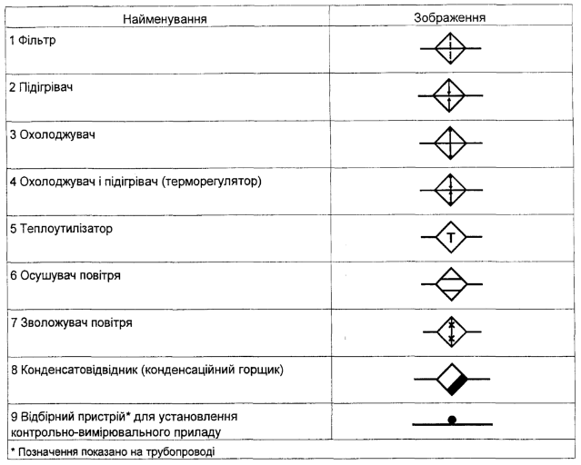

Таблиця 2. Умовні графічні зображення елементів систем внутрішніх водопроводу і каналізації

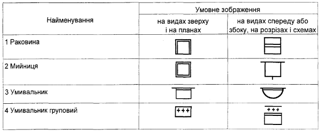

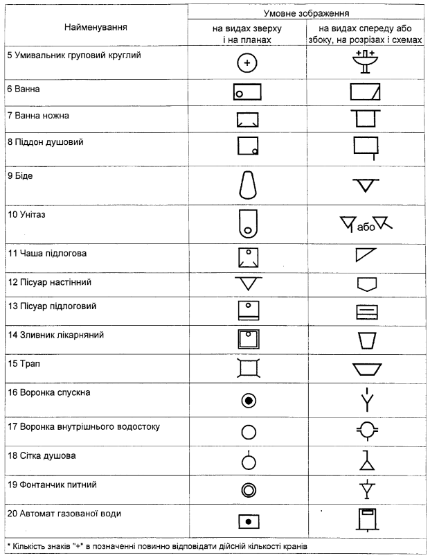

Таблиця 3. Умовні графічні зображення елементів систем опалення, вентиляції і кондиціювання наведені

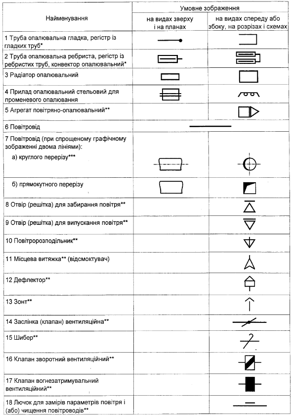

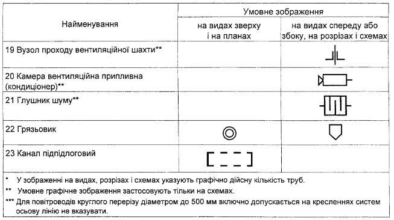

Таблиця 4. Умовні графічні зображення напрямку потоку рідини, повітря, лінії механічного зв'язку, регулювання, елементів приводу.

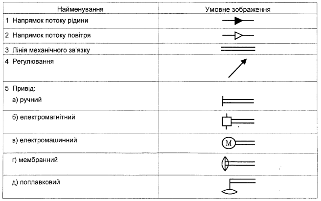

Таблиця 5. Умовні графічні зображення баків, насосів, вентиляторів.

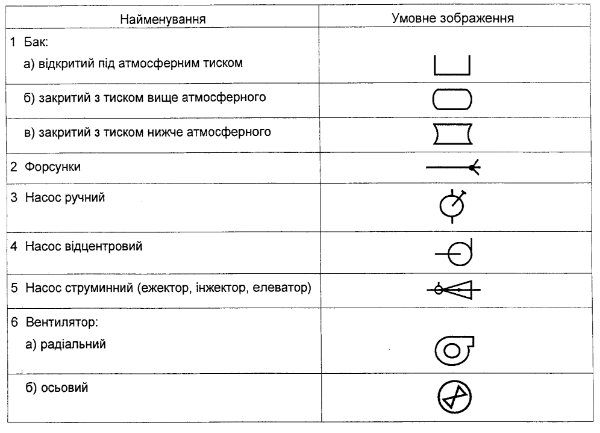

Таблиця 6. Умовні графічні зображення елементів трубопроводів санітарно-технічних систем.

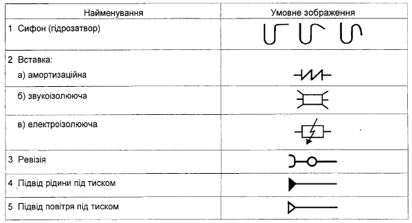

Таблиця 7. Умовні графічні зображення трубопровідної арматури

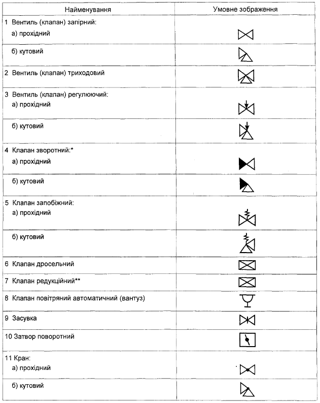

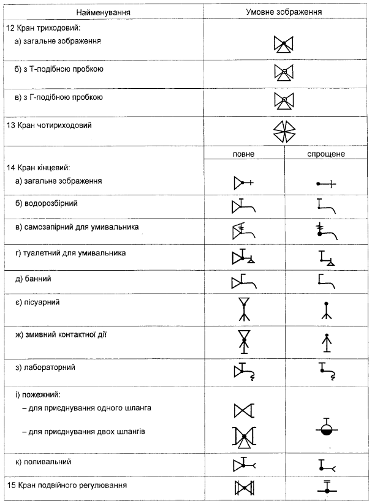

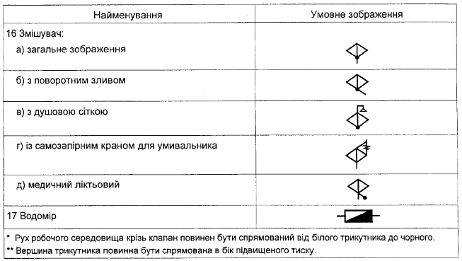

Таблиця 8. Приклади побудови зображень елементів систем

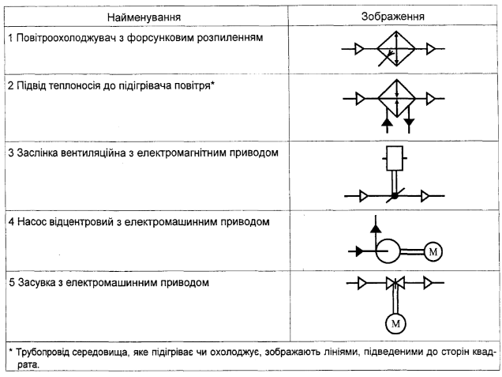