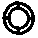
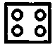
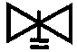
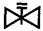

[Графічні символи для технологічних схем](symbols.md)

# Додаткові зображення та літерні познаки для газопостачання відповідно до вимог стандарту ДСТУ Б А.2.4-25:2008 

| Найменування                             | Зображення                                  |
| ---------------------------------------- | ------------------------------------------- |
| 1 Лічильник газовий                      |  |
| 2 Плита газова побутова двоконфоркова    |  |
| 3 Плита газова побутова чотириконфоркова |  |
| 4 Апарат опалювальний газовий побутовий  |  |
| 5 Піч опалювально-варочна                |  |
| 6 Камін газовий                          |  |
| 7 Регулятор тиску                        |  |
| 8 Запобіжний запірний клапан             |  |
| 9 Регулятор керування                    |  |

| Найменування                                                 | Літерно-цифрове позначення |
| ------------------------------------------------------------ | -------------------------- |
| 1 Газопровід:                                                |                            |
| а) загальне 		позначення;                              | Г0                         |
| б) низького 		тиску до 5 кПа (0,05 кгс/см2);           | Г1                         |
| в) середнього 		тиску більше 5 кПа (0,05 кгс/см2) 		до 0,3 МПа (3 кгс/см2); | Г2                         |
| г) високого 		тиску більше 0,3 (3) до 0,6 МПа (6 кгс/см2); | Г3                         |
| д) високого 		тиску більше 0,6 (6) до 1,2 МПа (12 кгс/см2) | Г4                         |
| 2 Газопровід 		продувний                               | Г5                         |
| 3 Трубопровід на 		розрідження                         | Г6                         |