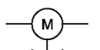
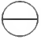
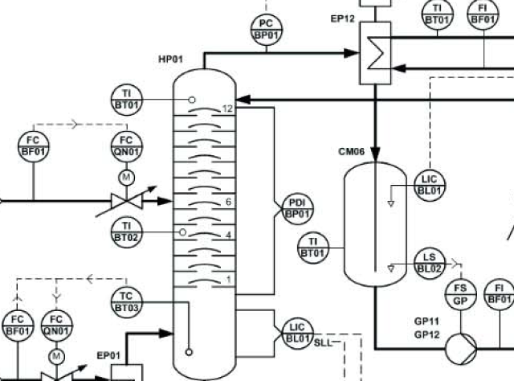
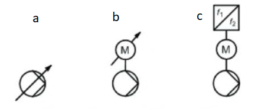

[<- До підрозділу](README.md)

# Технологічні схеми: теоретична частина

Ця лекція призначена для ознайомлення з принципами побудови технологічних схем.

## 1. Види, призначення та огляд технологічних схем

Технологічні схеми показують структуру та функції технологічних установок і є частиною всього набору технічних документів, необхідних для планування, монтажу, будівництва, керування, введення в дію, експлуатації, технічного обслуговування, зупинки та виведення з експлуатації установок. Технологічні схеми є засобом, за допомогою якого відбувається обмін інформацією між сторонами, залученими до процесів життєвого циклу (ЖЦ) цих установок. Вони можуть виконуватися з використанням стандартів або за заздалегідь означеними правилами.

Залежно від необхідної інформації розрізняють різні види технологічних схем, зокрема (згідно ISO) прийняті такі види:

- технологічні блок-схеми (block diagrams) 
- схеми технологічних потоків (process flow diagrams) 

На базі наведених вище схем розробляються інші схеми, які мають відношення до технології, зокрема схема технологічних процесів і приладів (P&ID) також відома для українців як схема автоматизації або ФСА, які розглядаються в підрозділі посібника [Схеми автоматизації та P&ID](../fsa/teor.md).

**Технологічна блок-схема** (block diagram) зображує технологічний процес або технологічну установку у спрощеній формі за допомогою прямокутних блоків, які з’єднані між собою лініями потоку. На рис.1 показаний приклад технологічної блок схеми, яка виконана згідно рекомендацій ISO 10628. Кольором виділені різні елементи для спрощення пояснення. 

рис.1. Приклад технологічної блок-схеми (джерело ISO 15519-1), кольором виділено для спрощення пояснення.

Блоки (на рис.1 показано блакитним) на схемі можуть представляти як процеси та їх частини так і обладнання, зокрема:

- технологічні процеси
- етап технологічного процесу
- операції в технологічному обладнанні
- технологічні установки або групи технологічних установок
- секції установок
- обладнання 

Лінії потоку можуть представляти потоки матеріалів або потоки енергії. Кожен блок має мати назву, яка вказується в середині нього. Також має бути вказаний напрямок та назва потоку матеріалу (або енергії),наприклад на рис.1 це вказується в прямокутнику сірого кольору, який з'єднується з лінією потоку. Додатково на блок-схемі може бути вказані витрати для потоків (наприклад в кг/год на рис.1) або кількість, умови проходження процесу (наприклад біля  блока `Reaction` на рис.1). 

Таким чином технологічні блок схеми є найбільш оглядовими і найменш конкретними серед усього переліку схем і розробляються на ранніх стадіях життєвого циклу установок. Вони здебільшого зосереджені на технологічній частині, і менше стосуються конкретного обладнання. На базі технологічних блок-схем можна обговорювати питання технології, а при проектуванні обладнання установки для її реалізації використовують схеми PFD.      

**Схема технологічних потоків** (**Process flow diagram, PFD**) - представляє конфігурацію технологічної установки або технологічної системи за допомогою графічних зображень (**символів**). На відміну від блок-схем, PFD представляє технологічну систему у вигляді обладнання, яке зображується та ідентифікується відповідно до умовних позначень. Приклад схеми технологічних потоків показаний на рис.2.     

рис.2. Приклад схеми технологічних потоків (джерело ISO 15519-1).

Щоб зрозуміти блок схему, нижче наведена перелік умовних графічних позначень (легенда) з деякими коментарями.

Таблиця 1. Умовні графічні позначення до прикладу

| Умовне графічне позначення                                   | Призначення символу                                          | Примітка                                                     |
| ------------------------------------------------------------ | ------------------------------------------------------------ | ------------------------------------------------------------ |
|  | Колона з тарілками (загальна)                                | Символ X8101 зі стандарту ISO 10628-2 Символ X2625 зі стандарту ISO 14617 |
|  | Тарілка в колоні (загальний вигляд)                          | Символ C2044 зі стандарту ISO 10628-2                        |
|  | Резервуар, апарат з витягнутими кінцями                      | Символ 2062 зі стандарту ISO 14617                           |
|  | Теплообмінник (M-подібне зображення)                         | Символ X8017 зі стандарту ISO 10628-2   |
|  | Клапан регулювальний, з безперервною роботою                 | Символ X8087 зі стандарту ISO 10628-2 Символ 201 зі стандарту  ISO 14617 |
|  | Електродвигунний привод                                      | Як привод (виконавчий механізмі) для клапану                 |
|  | Насос, рідинний (загальний вигляд)                           | Символ 2301 зі стандарту  ISO 14617                          |
|  | Інформація про керування технологічним процесом (засоби КВПіА) | Символ 1101 зі стандарту  ISO 15519-2. У верхній частині вказується вимірювальна/керована величина та функції системи керування, у нижній частині може бути вказане позиційне позначення |
|  | Вхідний/вихідний потік                                       | Може бути зазначена адресна інформація для переходу на іншу PFD (конектор на аркуш, обладнання і т.ін), назва середовища, параметри (тиск, витрата та ін) |

Як бачимо з прикладу, схема може містити як технологічне обладнання так і інформацію про керування ним, зокрема засоби **КВПіА** (контрольно-вимірювальні прилади та засоби автоматизації). 

Вхідні та вихідні потоки схеми "обриваються" на символах, які на даній схемі позначені трапеціями. Як правило додатково на них вказують інформацію про матеріал або енергію, адреса надходження/призначення (номер аркушу схеми, обладнання, тощо) також параметри потоку. Позначення входів і виходів можуть відрізнятися в залежності від прийнятих правил побудови схеми.   

Самі потоки представлені товстими лініями з зображенням стрілок на них для вказівки напрямку потоку. Обладнання має різне графічне позначення (символи) та текстове позначення, які виконуються відповідно до прийнятих для документації умовних графічних та текстових позначень.  

Крім обладнання та потоків, на схемі може бути показана інформація про засоби КВПіА. Для цього використовуються кола або овали з відповідним символьним позначенням у верхній частині. Це символьне позначення вказує на вимірювальну величину (перша літера) та функцію або функції (другі літери) які виконуються системою керування або її частиною. Так наприклад `FC` складається з двох літер: 

- `F` - перша літера вказує на змінну процесу, в даному випадку вимірювальну величину - витрата
- `C` - друга літера вказує на регулювання 

Таким чином `FC` вказує на використання функції регулювання витрати. Детальний огляд літерних позначень розглядається в інших розділах посібника. Тут наведемо деякі приклади для розуміння прикладів. Перша літера вказує на технологічну змінну, якої стосується контроль або керування:

- `F` - витрата
- `L`  - рівень
- `P` - тиск, `PD` - різниця тисків
- `T` - температура

Якщо після першої літери слідує `D` то технологічною змінною є різниця. 

Другими літерами позначаються функції, зокрема:

-  `A` - сигналізація
- `I` - індикація, відображення
- `C` - регулювання
- `S` - включення/відключення 

Якщо використовуються кілька функцій, то літери функцій перераховуються.

Хоч для схем PFD не вказують деталізацію щодо КВПіА, деякі стандарти передбачають їх ідентифікацію вже на цих схемах. Для цього в нижній частині кола може бути вказано позиційне позначення, яке посилається на ідентифікатор приладу де реалізована дана функція.

Правила виконання та умовні позначення для PFD як правило беруться зі стандарту, на базі якого розробляються технологічні схеми потоків. Це може бути  ISO 15519 (для всіх типів заводів переробної галузі), а також в ISO 10628 (для хімічних та нафтопереробних заводів), які у свою чергу використовують символи та позначення з ISO 14617, або галузеві чи корпоративні стандарти. У вітчизняній практиці технологічні схеми можуть виконуватися за стандартами СПДБ. Тому при читанні схеми варто скористатися супутніми документами, які мають бути зазначені в комплекті документації. У свою чергу розробники мають навести перелік умовних позначень (легенду) для того щоб уникнути плутанини у залучених до процесів учасників ЖЦ. Ви можете познайомитися з графічними умовними позначеннями наданими в даному посібнику за [цим посиланням](symbols.md)

Деякі PFD показують мінімум деталей, тоді як інші можуть містити більш значну деталізацію. Ступінь деталізації залежить від етапу життєвого циклу та залучених до її використання сторін. Враховуючи що зрештою на базі PFD розробляється P&ID, яка представляє усю необхідну інформацію для засобів КВПіА, вона поступово наповнюється деталізацією, необхідною для P&ID. При мінімальній деталізації зображуються лише основні етапи процесу, деталі зведені до мінімуму. Наприклад, на PFD показано дуже мало інформації про керування, оскільки це обладнання не є критичним для розрахунків матеріальних балансів та вибору обладнання. Деталі про засоби керування будуть показані пізніше на схемах P&ID та інших документах проекту. Тому за цього підходу показують тільки те обладнання, яке має значний вплив на матеріальний баланс, або якщо ця інформація потрібна для означення чогось особливого щодо цього обладнання. При максимальній деталізації до розроблення залучають інженерів систем керування вже на початку проекту, і вони беруть участь у розробці PFD. Тоді PFD можуть містити деталі конструкції, такі як основні вимірювальні точки, методи керування, регулюючі клапани та аналізатори процесу. PFD використовуються як орієнтир або, можливо, навіть як перший крок у розробці P&ID. Деталі показують (або дублюють) у P&ID та інших документах проекту. 

Нижче розглянемо кілька стандартів, згідно яких можуть виконувати схеми PFD. 

## 2. Створення PFD згідно ISO 15519

Стандарт ISO 15519 "Вимоги до схем для переробної промисловості" містить правила та рекомендації щодо застосування відповідних стандартів у діаграмах, наприклад, графічних символів і позначень посилань. До переліку схем, яких стосується цей стандарт відноситься технологічна блок схема та PFD, як це показано на рисунку 3. Як видно, PFD (Process Flow Diagram) стає в основі розроблення P&ID (Process and Instrumentation Digram), а також PCD (Process Control diagram), які є основою для розроблення електричних, пневматичних, гідравлічних принципових схем, що є областю діяльності стандартів IEC.      

рис.3. Взаємозв'язок між схемами стандартів ISO та IEC (джерело ISO 15519-2).

У стандарті зазначені загальні правила виконання, які стосуються схем як PFD так і P&ID. У цьому розділі розглянемо тільки ті, які стосуються технологічної частини, тоді як в іншому розділі посібника, присвяченому P&ID розглянемо речі, які стосуються функцій систем керування та приладів.

Символи для графічних умовних позначень беруть із серії ISO 14617 - це стандарт, який включає багато частин, кожна з яких відображає умовні позначення для конкретного типу обладнання. Так, в приведеній вище таблиці 1 наведено кілька символів з даного стандарту. Якщо необхідний символ не включено до ISO 14617, його слід розробити відповідно до правил, наведених у ISO 14617 та ISO 15519-1. Додаток А у ISO 15519-2 також містить набір графічних символів для основного технологічного обладнання, вимірювання, приведення в дію та керування. Таким чином умовні позначення (графічні та текстові) беруться з ISO 15519-2, ISO 14617 або розробляються власні, якщо немає відповідника.

Інформація між системою процесу та системою керування повинен бути представлений у спеціальному символі **інформації керування процесом** (**PCI**, process control information), який показує функції засобів КВПіА. Вище ми вже розглядали його, це символ кола, в якому вказується текстове позначення. Якщо недостатньо місця для представлення інформації в одному текстовому рядку, використовується овал. Інформація розміщується як всередині так і поза символами PCI. Літерні коди змінних процесу та функцій керування, повинні бути розміщені у верхній частині символу, а позиційне позначення – у нижній частині символу (рис.4.)

рис.4. Літерні позначення всередині символу PCI  

- a) змінна процесу (process variables)
- b) функції керування/контролю (control functions)
- c) позиційне позначення (reference designation) 

Вище ми вже розглядали приклади такого позначення, в стандарті ISO 15519 прийнята класична схема такого позначення. Зазначимо лише, що згідно стандарту  **технологічна змінна**, також відома як **змінна процесу (process variables)** - це кількість, якість або стан середовища технологічного процесу, або об'єкта процесу, значення якого може бути змінено і зазвичай може бути виміряно. Крім змінної і функції, в стандарті в нижній частині PCI використовується позиційне позначення, яке формується за загальними правилами ідентифікації обладнання а не тільки символів PCI. 

**Позиційне позначення** (**Reference designation**, позначення для посилання) - це ідентифікатор конкретного об'єкта по відношенню до системи, складовою якої є об'єкт, на основі одного або кількох аспектів цієї системи. У стандарті ISO 15519 позиційні позначення повинні формуватися за правилами IEC 81346-1, IEC 81346-2 та ISO/TS 81346-3, що стандартизує назви та позначення для різних елементів, наприклад, обладнання, трубопроводів, клапанів або вимірювальних пристроїв, що полегшує їх ідентифікацію на схемах і в документації. Розгляд стандарту IEC 81346 виходить за рамки цього розділу, але для ілюстрації розглянемо приклад з рис.5. 

Для ідентифікації колони використовується `HP01` де `HP` - префікс, який вказує на тип обладнання. Відповідно до IEC 81346-2, який класифікує усі сутності за функціональною ознакою, обладнання що позначено `HP` має функцію "розділення сумішей речовин з використанням термічних процесів".  Натомість `EP12` за суфіксом проводить "генерування тепла конвективним способом", а `CM06` - "закрите зберігання матеріалів у фіксованому місці (колекція, зберігання)".    

рис.5. Приклади позиційних позначень обладнання. 

Як вже було зазначено, позиційне позначення також надається для приладів КВПіА, зазначаючи їх в нижній частині символу PCI. На рис.5 літерний код `PC` у верхньому рядку символу PCI показує вимірювання тиску, яке буде використовуватися для керування, а у позиційному позначенні `BP01` літерний код `BP` означає "перетворення вхідної змінної (в даному випадку тиску) у сигнал для подальшого оброблення". Слід зазначити що згідно стандарту IEC 81346-2, літера перша літера `B` завжди буде свідчити про функцію вимірювання, а наступна літера буде вказувати на вимірювальну змінну, яка позначається тією самою літерою, що у верхній частині PCI. Тому `BT`, `BP` та  `BF` відповідно вказує на вимірювання температури, тиску та витрати.   

Код `FC` у верхньому рядку відповідно ілюструє керування витратою, який виконується клапаном регулювання потоку `QN01`. Літерний код `QN` в позиційному позначенні вказує на «зміна витрати речовини в закритих камерах».

Поряд з PCI, може бути також вказана додаткова інформація, що розміщена за межами символу PCI в чотирьох квадрантах навколо символу (рис.6).

рис.6. Інформація навколо символу PCI 

- a) Посилання на типову схему, інформацію про безпеку, напр. ідентифікатори `SIL` або `SIF`;
- b) Специфікація типу вимірюваної змінної при використанні літерного коду `U` (багатопараметрична), наприклад `рН`, `pS`, `МДж/с` тощо;
- c) Інформація про функції високого виходу/введення, наприклад сигналізація або перемикання;
- d) Інформація про функцію низького вихідного/вхідного сигналу, наприклад сигналізація або перемикання.

Одна і та ж функція на схемі може бути представлена в різних типах діаграм з різним графічним виглядом (рис.7). 

рис.7. Різниця ступінь деталізації для насосу зі змінною швидкістю: a) принцип керування потоком не вказаний; b) керування відбувається з використанням двигуна зі змінною швидкістю обертання; c) керування відбувається з використанням двигуна керованого перетворювачем частоти.

Згідно ISO 15519 схема PFD може виконуватися в базовому та розширеному варіанті. Відмінності заключаються в поданні інформації щодо КВПіА. Загальні правила подання основної (для базового) та додаткової інформації на PFD наведено в таблиці 2.

Таблиця 2. Правила подання основної та додаткової інформації на PFD

| Аспект                                                 | Основна інформація                                           | Додаткова інформація                                         |
| ------------------------------------------------------ | ------------------------------------------------------------ | ------------------------------------------------------------ |
| Графічні символи для об'єктів і зв'язків               | - загальні графічні символи для технологічного обладнання, приводів арматури, символи контролю та керування  - загальні графічні позначення з'єднань | — для систем безпеки та запобіжного обладнання — для функціональності основних об’єктів керування процесом, наприклад нормально закритий для приводів клапанів — сигнальні лінії між об’єктами вимірювання та виконавчими механізмами — спеціальні графічні символи, наприклад приводи клапанів |
| Позиційне позначення (вказується в нижній частині PCI) |                                                              | — технологічне обладнання — елементи керування процесом  |
| Технічна інформація                                    |                                                              | — додаткова інформація PCI, наприклад Ідентифікатор SIF або SIL — характерні умови експлуатації, наприклад витрати, тиск, температура тощо. — додаткові умови експлуатації — характерні дані обладнання — назви основного обладнання — параметри конструкції, наприклад тиск, температура, витрата тощо. — найменування приводів і характерні дані приводів — розмір магістральних трубопроводів, каналів тощо. |
| Інформація про схему                                   |                                                              | — найменування вхідних і вихідних систем — взаємодія між постачальниками, партнерами тощо. |

Функціональні зв’язки між виміряними змінними процесу та активованим/кінцевим об’єктом керування можуть бути представлені сигнальними лініями у формі пунктирних ліній (рис.8). Для функцій регулювання в нормальному операційному режимі що вказується літерним кодом `C`, і функцій перемикання (`S`), сигнальна лінія «пов’язує» символи PCI в єдиний логічний ланцюг. Так наприклад, на рис.7 показано, що витрата (поз.`QN01`) регулюється за рівнем в баку (`BL01`). 

рис.8. Використання контурів контролю і керування на PFD

Для функцій перемикання (`S`) в неопераційному режимі а також функцій перемикання що відповідає безпеці/захисту (`Z`), сигнальна лінія повинна «пов’язувати» рядки літерного коду, які розміщені за межами символів PCI. Сигнальні лінії для різних типів функцій керування не повинні з'єднуватися.

Нижче для порівняння наведені схеми PFD виконані в базовому (рис.2) та розширеному (рис.8) варіанті.  

рис.2. Приклад схеми PFD з основною інформаціє, виконана відповідно до ISO 15519-2

Рис.8. Приклад схеми PFD з вказаною додатковою інформацією, виконана відповідно до ISO 15519-2

## 3. Створення технологічних схем згідно ДСТУ Б.А.2.4

Традиційні практики розроблення технологічних схем в Україні регламентуються серією будівельних стандартів системи ДСТУ Б.А.2.4, які здебільшого по суті є українською локалізацією радянських ГОСТ, та їх похідних. Система проектної документації для будівництва (СПДБ) – це комплекс нормативних організаційно-методичних документів, що установлюють загальнотехнічні вимоги, необхідні для розроблення, обліку, зберігання і застосування проектної документації для будівництва об'єктів різного призначення. Про комплектність документації згідно СПДБ можна почитати в [цій лекції](../spds/teor.md). 

### Технології виробництва

Особливість стандартів в групі є направленість на різні типи об'єктів для застосування. Частина що стосується, що стосується складу і правил оформлення робочих креслень технології виробництва описується в ДСТУ Б А.2.4-22:2008 "Технологія виробництва. Основні вимоги до робочих креслень". Згідно цього стандарту до складу робочих креслень технології виробництва входять робочі креслення, які призначені для монтажу обладнання та технологічних трубопроводів, що входять до основного комплекту робочих креслень марки ТХ, який у свою чергу допускається робити в двох комплектах: 

- ТХ -технологія виробництва (технологічні схеми)
- ТХМ - монтажні креслення - (обладнання та трубопроводи);

До складу цього основного комплекту  входять наступні документи:

- загальні дані по робочих кресленнях;
- план розміщення компоновки обладнання без трубопроводів (плани та розрізи);
- монтажно-технологічна схема;
- креслення розташування обладнання і трубопроводів (плани та розрізи).

- специфікація обладнання, виробів і матеріалів згідно з ДСТУ Б А 2.4-10;
- відомість трубопроводів;
- опитувальні листи на обладнання і габаритні креслення на відповідні види обладнання

У стандарті також наведено означення деяких термінів, зокрема:

Таблиця 3. Деякі терміни ДСТУ Б А.2.4-22:2008

| Термін                    | Пояснення                                                    |
| ------------------------- | ------------------------------------------------------------ |
| Технологічний вузол       | Конструктивно і технологічно відособлена частина об'єкта будівництва, технічна готовність якої дозволяє автономно, незалежно від готовності об'єкта в цілому, проводити пуско-налагоджувальні роботи, індивідуальні випробування і комплексне випробування цієї частини об'єкта. Технологічні вузли, як правило, виділяють стадії технологічного процесу об'єкта - підготовку сировини, етапи її переробки, виділення кінцевого продукту, зберігання тощо |
| Обладнання                | Технологічні блоки, машини, апарати, вантажопідйомні засоби  |
| Технологічний блок        | Комплекс або складальна одиниця (згідно ГОСТ 2.101-68) технологічного обладнання заданого рівня заводської готовності і виробничої технологічності, що призначені для здійснення основних або допоміжних технологічних процесів. До складу бло­ка включають машини, апарати, первинні засоби контролю та управління, трубопроводи, опорні і обслуговуючі конструкції, теплову ізоляцію і хімічний захист. Блоки, як правило, формують для здійснення теплообмінних, масообмінних, гідродинамічних, хімічних і біологічних процесів. Номенклатура блоків встановлюється відомчими нормативними документами, узгодженими з міністерствами, що здійснюють монтажні роботи |
| Технологічні трубопроводи | Трубопроводи, призначені для транспортування різних речовин, необхідних для ведення технологічного процесу або експлуатації обладнання |
| Спеціальні  трубопроводи  | Технологічні трубопроводи сталеві з внутрішніми покриттями, сталеві, такі, ! що працюють під тиском 10 МПа і більше, трубопроводи з неметалевих матеріалів |
| Ділянка  трубопроводу     | Частина технологічного трубопроводу з одного матеріалу, по якому тран­спортують речовину з одним тиском і температурою. При визначенні ділянки трубопроводу в його межах для одного умовного проходу повинна бути забезпечена ідентичність марок арматури, фланців, відведень, трійників і переходів |
| Елементи  трубопроводу    | Патрубки (труби), відведення, переходи, трійники, фланці, компенсатори, регулююча, запобіжна та така, що відключається, арматура, опори, про­кладки і кріпильні вироби, пристрої, що встановлюються на трубопроводах для контролю і управління, конденсаційні та інші деталі і пристрої |

Еквівалентом схеми технологічних потоків (PFD) згідно стандартів ДСТУ є **монтажно-технологічні схеми**, які виконують відповідно до вимог стандартів  ДСТУ Б А.2.4-22:2008, а також ЄСКД, на які він посилається. На схемі вказують:

-	обладнання;
-	блоки без позначення складових частин і зв'язків між ними;
-	трубопроводи та їх елементи;
-	позиційне або літерно-цифрове позначення обладнання і трубопроводів відповідно до специфікації до креслень розташування обладнання і трубопроводів;
-	величину умовного проходу Dy і матеріал труб (за необхідності);
-	напрям потоку продукту;
-	найменування продукту, що транспортується, та його параметра на вводах і виводах трубопроводів;
-	величину тиску, на яку повинні бути відрегульовані запобіжні клапани;
-	закладні конструкції для контрольно-вимірювальних приладів (КВП), встановлених на трубопроводах.

Всі літерно-цифрові позначення обладнання, трубопроводів і їх елементів наносять на полицях лінії-виноски, або в контурі спрощеного графічного зображення, над лініями або у розривах ліній трубопроводів.

Приклад оформлення монтажно-технологічної схеми з'єднань показаний на рис.9.

Рис.9. Приклад монтажно-технологічної схеми. 

Схеми допускається виконувати:

- на аркушах креслення розташування обладнання і трубопроводів;
- суміщеними зі схемами автоматизації технологічних процесів виробництва;

- при складних трубопровідних системах - окремо для груп трубопроводів за їх призначенням;
- без переліку елементів до схеми;
- при складних насичених трубопровідних системах арматурі, закладним конструкціям для КВП присвоювати номери (в колах або на подвійних полицях) і вносити їх в окремі таблиці, де вказувати позначення арматури або закладних конструкцій для КВП, умовний прохід Dy, матеріал.

Умовні зображення і познаки трубопроводів та їх елементів виконують згідно ДСТУ Б А.2.4-1:2009. Умовне позначення трубопроводу складається з графічного умовного позначення або спрощеного зображення трубопроводу та літерно-цифрової познаки, яка характеризує вид середовища, що транспортується, його призначення та параметри. Літерою позначають вид середовища, що транспортується, наступними цифрами - призначення та параметри середовища, що транспортується, наприклад `В1`; `В2`; `ВЗ`. Якщо треба показати, що ділянка мережі каналізації або конденсатопроводу є напірною, то літерно-цифрову познаку доповнюють великою літерою `Н`, наприклад `К4Н`; `Т8Н`. Якщо треба показати контур трубопроводу, то літерно-цифрову познаку доповнюють цифрою через тире, наприклад `Т1-1`; `Т1-2`.

Видимі ділянки трубопроводів та їх елементів, що проектуються, зображують суцільною товстою основною лінією, невидимі (наприклад, у перекритих каналах) - штриховою лінією тієї ж товщини. Існуючі трубопроводи та їх елементи зображують відповідно безперервною чи штриховою тонкою лінією. При зображенні трубопроводу на кресленнях (схемах) літерно-цифрові познаки вказують на полицях ліній-винесень або над лінією трубопроводу, а в необхідних випадках - у розриві ліній трубопроводів (риc.10).

Рис.10. Приклад зображення трубропроводів та літерно-цифрових познак. 

Повний перелік умовних зображень та літерно-цифрових познак для трубопроводів відповідно до стандарту ДСТУ Б А.2.4-1:2009 наведено в довідковій частині посібника за [цим посиланням](25.md). Інші позначення наводяться в інших частинах, зокрема:

- Основні умовні графічні позначення елементів санітарно-технічних систем на кресленнях і схемах при проектуванні будівель і споруд різного призначення виконуються відповідно до вимог стандарту ДСТУ Б А.2.4-8:2009 наведено за [цим посиланням](30.md). 
- Додаткові зображення та літерні познаки для газопостачання відповідно до вимог стандарту ДСТУ Б А.2.4-25:2008 наведено за [цим посиланням](31.md),
- Умовні графічні зображення енергетичного устаткування у теп­лотехнічних схемах енергетичних споруд відповідно до вимог стандарту ДСТУ Б А.2.4-38:2008 наведено за [цим посиланням](32.md),
- Умовні графічні зображення основного підіймально-транспортного устаткування, що зображується на планах (вид зверху) і розрізах будинків і споруд, а також на  інших технічних кресленнях усіх видів відповідно до вимог стандарту ДСТУ Б А.2.4-36:2008 наведено за [цим посиланням](33.md),

### Санітарно-технічні системи

Основні умовні графічні позначення елементів санітарно-технічних систем на кресленнях і схемах при проектуванні будівель і споруд різного призначення виконуються відповідно до вимог стандарту ДСТУ Б А.2.4-8:2009 СПДБ. Зображення одних і тих самих засобів можуть відрізнятися від використовуваних в технології виробництва, тому при читанні схем треба звертати увагу на марку комплекту документації та стандарти оформлення. Повний перелік умовних зображень з цього стандарту наведено в довідковій частині посібника за [цим посиланням](30.md), на рис.11 наведений приклад виконання. 

Рис.11. Приклад виконання принципової технологічної схеми вентиляційної системи 

Тут може бути продовження...

Теоретичне заняття розробив [Олександр Пупена](https://github.com/pupenasan). 

Дана лекція потребує рецензування експертів.

Про проект народного посібника "Автоматизація технологічних процесів та виробництв" і як допомогти проекту читайте [у описі проекту](../../README.md)

Свої зауваження та пропозиції в тому числі стосовно перекладів можете написати в створених для цього групах та темах, зокрема 

- [Обговорення в Телеграм](https://t.me/+GA2smCKs5QU1MWMy)
- [Обговорення у WhatsApp](https://chat.whatsapp.com/BRbPAQrE1s7BwCLtNtMoqN)
- [Пост у Facebook](https://www.facebook.com/groups/asu.in.ua/posts/26427774536869927/)
- [Пост у Linkedin](https://www.linkedin.com/in/oleksandr-pupena-67aa0b33/)
