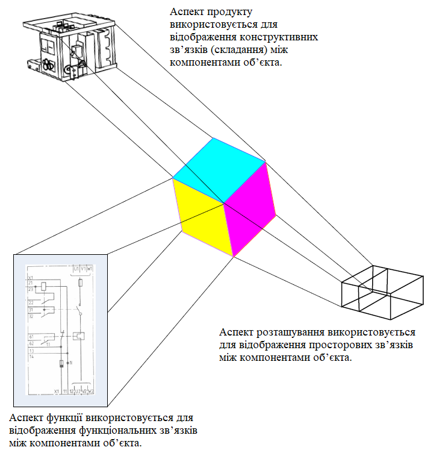
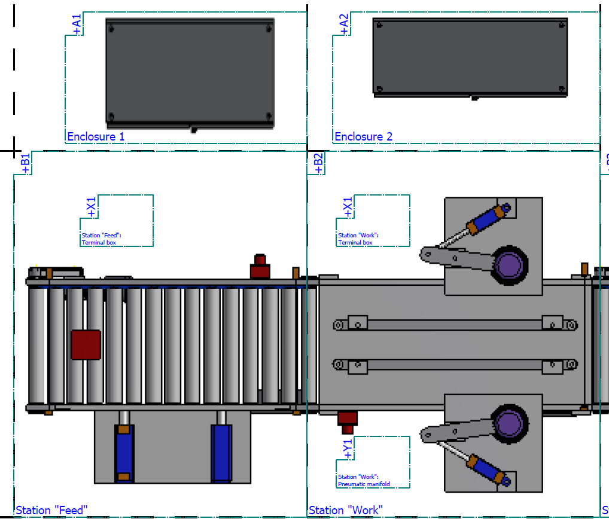
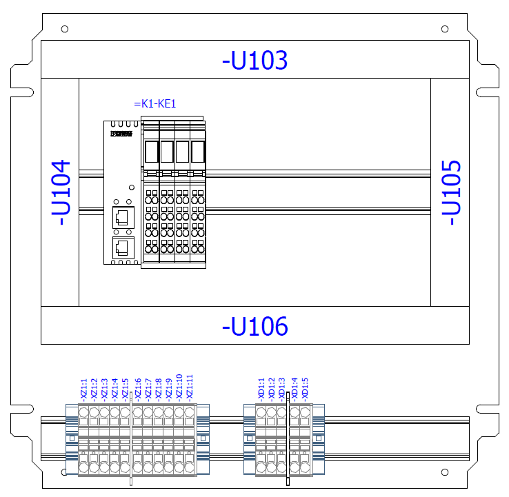
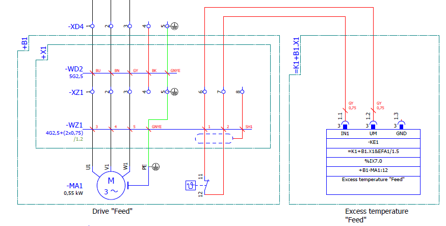
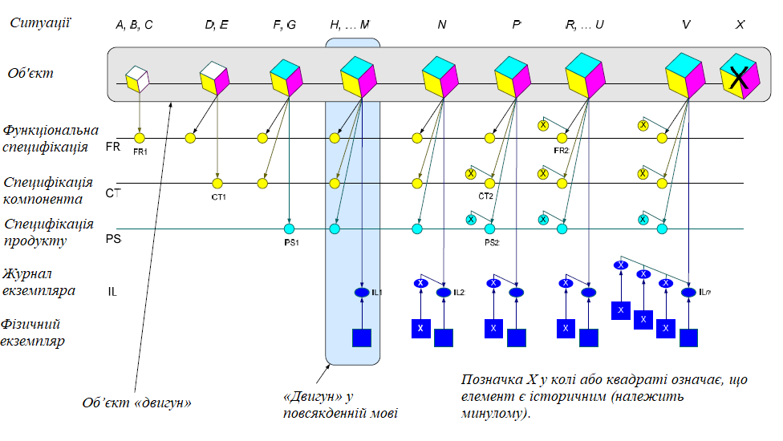

[<- До підрозділу](README.md)

# Формування структурованих позначень відповідно до IEC81346: теоретична частина

## 1. Вступ

Історія стандарту IEC 81346 почалася з усвідомлення потреби у спільних правилах позначення об’єктів технічних систем. Упродовж другої половини ХХ століття різні галузі — електротехніка, машинобудування, будівництво — розвивали власні традиції маркування й структуризації, що формувалися незалежно одна від одної. Унаслідок цього той самий символ або код у різних документаціях міг означати різні об’єкти, а складні установки часто мали окремі схеми позначень для функцій, виробів і місць розташування. Відсутність єдиних принципів узгодження між цими підходами ускладнювала супровід і модернізацію технічних систем.

Цю різнорідність особливо добре видно на прикладі систем автоматизації. Тут об’єкти однієї й тієї самої установки описуються в різних документах з різних точок зору. На схемі технологічного процесу та автоматизації (P&ID) основну увагу зосереджено на функціональних зв’язках — як вимірювальні прилади, клапани та виконавчі механізми взаємодіють у межах процесу. Натомість на принципових електричних схемах ті самі об’єкти подаються з позиції пристроїв, електричних з’єднань, живлення, сигналів і контактів. Додатково існують монтажні схеми, що показують фізичне розміщення компонентів у шафі керування або на об’єкті, а також кабельні журнали, відомості сигналів, топологічні плани мереж чи навіть креслення пневматики й гідравліки. Кожен із цих документів має власну систему позначень, яка добре працює у своєму контексті, але не завжди узгоджується з іншими.

Якщо продовжити логіку прикладу з документацією систем автоматизації, проблема різноманітних позначень стає очевидною на практиці. На схемі P&ID, скажімо, клапан подається як елемент керування потоком — він має функціональне позначення, наприклад, `LV-102`, де літера `L` означає параметр (рівень або витрата), а `V` — сам клапан. Це позначення зрозуміле технологу або інженеру з автоматизації, бо відображає логіку процесу. Але на принциповій електричній схемі той самий клапан з’явиться вже як як `YV102` або `K1Y1`, тобто як електричний пристрій у колі керування. Для монтажника важливі не функції, а контакти, напруга, місце розташування й спосіб підключення. А у монтажному кресленні цей клапан може мати ще третє позначення — наприклад, `+U3+5`, що вказує його місце в шафі керування або на полі розподілу.

З точки зору кожного окремого фахівця ці позначення цілком логічні. Проте коли проєкт переходить від однієї стадії до іншої, а дані з P&ID мають бути узгоджені з електричними схемами й монтажними планами, з’ясовується, що один і той самий фізичний об’єкт описано трьома різними системами ідентифікації, які між собою не пов’язані. У результаті кожна зміна, навіть така проста, як заміна типу клапана або його положення, потребує ручного оновлення в усіх документах. Якщо ж десь забули виправити один запис, виникає розрив: на електричній схемі пристрій є, а в технологічній — уже ні. 

У той же час є зв'язок з конкретними виробами, які протягом життєвого циклу стають на місце того чи іншого компонента системи, виконуючи різні функції. Під час життєвого циклу системи, на позиції об'єкта з певною роллю можуть ставати різні вироби, що вносить додаткові труднощі в процес проєктування та супроводження.  

Така плутанина стала поштовхом до пошуку універсальної системи позначень, яка б дозволила зрозуміло описувати об’єкти незалежно від галузі чи країни. У 1990-х роках у рамках Міжнародної електротехнічної комісії (IEC) розпочалися роботи з розроблення нової методології, що мала об’єднати логіку системного мислення, досвід проектування промислових установок і сучасні підходи до керування даними. Так з’явилася серія стандартів IEC 61346, яка згодом еволюціонувала у сучасний IEC 81346. Мета стандарту — дати єдину мову для опису складних технічних систем через принципи структурування та референтних позначень. Стандарт не забороняє існування кількох позначень для одного об’єкта, але пропонує зробити їх усвідомлено зв’язаними.

На сьогодні стандарт складається з кількох частин, що утворюють єдину систему правил для позначення та структурування технічних систем. Частина 1 встановлює основні принципи побудови структур і формування референтних позначень, частина 2 означує класифікацію об’єктів і коди класів, які можуть входити до складу позначень. Подальші частини орієнтовані на галузеві застосування: частина 10 описує адаптацію принципів стандарту для будівельних систем і споруд, а частина 12 деталізує правила для будівельних і інженерно-технічних мереж. Крім того, у 2012 році була опублікована технічна специфікація ISO/TS 81346-3, що містить практичні рекомендації щодо використання системи референтних позначень у документації та програмних засобах проєктування. Разом ці документи забезпечують узгоджений підхід до опису, ідентифікації та взаємопов’язання об’єктів у технічних і будівельних системах незалежно від галузі.

Метою даного розділу є ознайомлення з основними концепціями стандарту через призму розуміння документацї, для чого використовуватимо приклад звіту в форматі PDF з демонастраційного проєкту Eplan Electric, який можна завантажити [за посиланням](https://drive.google.com/file/d/1-gCNRni9uxw9hDuNx5i-Ww0ubRMdAeK6/view?usp=drive_link). Розділ містить як адаптовані частини стандарту так і авторське розуміння його аспектів. Варто зауважити, що розділ з часом може змінюватися.

## 2. Основні концепції

### Система, об’єкт та його аспекти

Центральним означенням у стандарті IEC 81346 є **об’єкт** — це все, що може бути ідентифіковане, описане та розглянуте як окрема сутність у певному технічному контексті. Об’єкт може бути матеріальним, типу двигун, клапан, кабель чи шафа керування, або нематеріальним - функція, сигнал, алгоритм, процес, навіть роль чи місце розташування. Його межі визначаються не фізично, а змістовно — тим, як він розглядається в межах системи. У цьому підході об’єкт не дорівнює компоненту чи деталі. Він може охоплювати як найменший елемент, так і цілу підсистему, якщо та розглядається як єдине ціле. Наприклад, насосна станція може бути одним об’єктом на рівні підприємства, але всередині неї насоси, клапани й датчики виступають уже окремими об’єктами нижчих рівнів.

Саме від поняття об’єкта відштовхуються всі інші принципи IEC 81346 — структурування, побудова ієрархій, означення аспектів та формування референтних позначень. Об’єкт є тією "точкою відліку", завдяки якій різні представлення системи можна зв’язати між собою. Він поєднує світ технічної реальності з її описом у документації, роблячи можливим узгоджене бачення системи між усіма учасниками проєкту — від технолога й конструктора до монтажника та експлуатанта. У цьому розділі об'єкт також розглядається в контексті життєвого циклу. 

У стандарті виділяють поняття **системи (технічної системи)** яка виступає контекстом, у межах якого застосовуються принципи структурування та формуються референтні позначення.  Технічна система - це сукупність взаємопов’язаних об’єктів, які спільно виконують певну технічну функцію. Вони можуть включати як фізичні елементи, так і програмні чи інформаційні компоненти. Головне, що всі ці частини працюють разом для досягнення спільної мети, наприклад транспортування матеріалу, подачі енергії або керування процесом. У стандарті технічна система використовується як окремий випадок об’єкта верхнього рівня, в все що є її частиною - об'єкти. Як тільки система розглядається як частина іншої системи, вона інтерпретується як об’єкт.  Цей термін потрібен для тих ситуацій, коли важливо підкреслити саме системний рівень — не окремий пристрій чи елемент, а взаємодію багатьох об’єктів у межах спільної мети. Так у [проєкті](https://drive.google.com/file/d/1-gCNRni9uxw9hDuNx5i-Ww0ubRMdAeK6/view?usp=drive_link), що розглядається в даному розділі як приклад технічною системою є шліфувальна машина, для якої цей проєкт розроблено.

Щоб зрозуміти, як побудована система, як об’єкти взаємодіють з іншими, на систему та об'єкти потрібно дивитися з різних точок зору — **аспектів**. Аспект можна уявити як фільтр, що виділяє тільки ту інформацію, яка важлива в певному контексті.  Стандарт IEC 81346 розрізняє три основні аспекти (рис.1): 

- **функціональний** (function) — показує, що об’єкт робить; 
- **продуктний** (product) — за допомогою чого він це робить; 
- і **просторовий** (location, розташування) — де він розташований. 

За потреби можуть вводитися й інші аспекти, якщо цих трьох недостатньо. Аспекти служать інструментом структурування: кожен із них відкриває лише ті підоб’єкти, які мають значення для даної точки зору, хоча самі підоб’єкти можуть бути релевантними й для інших аспектів. Якщо об’єкт означено в певному аспекті, це автоматично дає змогу звертатися до всієї інформації, що його описує, незалежно від того, у якому аспекті вона виникла. 

Надалі в даному розділі на рисунках при зображенні різних аспектів буде використовуватися кольорова палітра, що прийнята в стандарті: жовтий - функціональний, блакитний - продуктний, рожевий - просторовий. 



рис.1. Аспекти об'єкту (Джерело IEC 81346-1)

### Функція, продукт та місце розташування

Для розуміння запропонованих вище аспектів, варто розглянути поняття функції, продукту, компонента та розташування. 

У контексті цього стандарту **функція** означає завдання об’єкта без знання або врахування його реалізації. Такий об'єкт може бути частиною розглянутої технічної системи і при подальшому плануванні бути пов'язаним з іншими структурами. Функції технічної системи при декомпозиції діляться на менші взаємопов'язані функції, а ті на менші, таким чином організовуючи ієрархію в функціональному аспекті.  

**Продукт (product)** зазвичай означується як результат процесу. Результатом процесу який зазвичай призначений для продажу (наприклад, готовий продукт), постачання (за домовленістю між двома сторонами), використання як складової в іншому процесі, або як вхідні дані, або як інструмент. Таким чином, технічну систему або установку можна вважати продуктом, оскільки вони є результатом процесу і також постачаються. Зазвичай продукт має номер деталі, позначення типу та/або назву, його також можна ідентифікувати за номером замовлення. Якщо для об’єкта, який постачається надана структура що орієнтована на продукт, вона показує, як постачальник організував доставлені підоб’єкти щодо цього продукту, тобто як інші продукти використовуються в якості його компонентів. Таким чином структура, орієнтована на продукт, зазвичай вказує на те, як саме організовані результати технічної системи. Це може бути наприклад відомість частин. **Компонент (Component)** - це продукт, який поставляється від постачальника або виготовляється в майстерні та адаптований до фактичних потреб, щоб служити складовою частиною системного контексту. Таким чином продукти що стають частинами технічної системи, є її компонентами і розглядаються в продуктному аспекті. У якості конкретного компоненту системи може стати різний тип продукту від різних постачальників. У таблиці 1 показаний приклад специфікації, який вказує продукти у якості компонентів технічної системи.  

Таблиця 1. Приклад зведеної специфікації з проєкту

| Номер замовлення | Кількість | Найменування                                                 | Тип                    | Постачальник | Позиція |
| ---------------- | --------- | ------------------------------------------------------------ | ---------------------- | ------------ | ------- |
| 3022218          | 14        | Кінцевий затискач                                            | CLIPFIX 35             | PXC          | 1       |
| 3036563          | 3         | Клема запобіжникова модульна                                 | ST 4-HESILA 250 (5×20) | PXC          | 2       |
| 8886000          | 1         | Система шаф VX, з’єднувана, розміри 800×1800×600 мм, одна дверця | VX.8886000             | Rittal       | 3       |
| 8800752          | 4         | Кабельний канал для монтажної плити, розміри 60×2000×80 мм   | TS.8800752             | Rittal       | 4       |
| 8800750          | 6         | Кабельний канал для монтажної плити, розміри 30×2000×80 мм   | TS.8800750             | Rittal       | 5       |
| 2313150          | 6         | Монтажна рейка за EN 60715, тип TS 35/15, довжина 2000 мм    | SZ.2313150             | Rittal       | 6       |
| 4568000          | 4         | Підйомне кільце (гак), для серій TS, SE, листова сталь, оцинкована | PS.4568000             | Rittal       | 7       |
| 8186245          | 2         | Бічна панель VX, з кріпленням гвинтами, розміри 1800×600 мм  | VX.8186245             | Rittal       | 8       |

**Місце розташування (location)** означає простір, утворений об’єктом, наприклад, приміщенням, зоною всередині будівельної конструкції, прорізом монтажної рами всередині приладу керування, або поверхнею пластини всередині машини, тощо. Такий об'єкт може бути частиною проектованої технічної системи і при подальшому плануванні бути пов'язаним з іншими спорудами. Говорячи про просторовий аспект об’єкта щодо структурування, маються на увазі визначені простори всередині об’єкта, а не простір, який сам об’єкт займає в системі. Результатом застосування просторового аспекту до об'єкта є його внутрішня структура, орієнтована на розташування.

### Структурування

Для того, щоб система була ефективно специфікована, розроблена, виготовлена, обслуговувалась або експлуатувалася, система та інформація про систему зазвичай поділяються на частини. Кожну з цих частин можна додатково розділити. Цей послідовний поділ на частини та організація цих частин називається "структуруванням". Конструкції використовуються для: 

- організації інформації про систему, тобто як інформація розподіляється між різними документами та/або наборами інформації; 
- організації вмісту в кожному документі;

- навігації всередині інформації про систему;
- побудови референтних позначень

У складних технічних системах кількість елементів, їхніх зв’язків і залежностей настільки велика, що без чіткої логічної структури неможливо ефективно проєктувати, документувати й обслуговувати такі системи. Різні фахівці працюють із різними аспектами однієї установки і кожен створює власне уявлення про її будову. Без спільного принципу ці уявлення не поєднуються, виникають дублювання, неузгодженість і втрата цілісності. Саме тому в IEC 81346 сформульовано принципи структурування: вони дають спосіб розкласти систему на частини таким чином, щоб усі представлення залишалися взаємопов’язаними. Кожен об’єкт розглядається як частина більшої системи й водночас може містити власні підоб’єкти, утворюючи ієрархію. Структурування може проводитися за функцією, продуктом або місцем розташування, але в будь-якому випадку має забезпечувати послідовність, узгодженість і можливість однозначного позначення кожного елемента системи.

У той же час стандарт не забороняє створювати структури, що поєднують кілька аспектів одночасно або спираються на інші принципи, якщо це необхідно для конкретного завдання. Тобто можуть застосовуватися й інші аспекти, коли функціональний, продуктний або просторовий аспект не забезпечують достатнього опису системи. Наприклад, це можуть бути інформаційні, організаційні чи часові аспекти. Також в практиці проєктування часто виникає потреба поєднати різні аспекти, щоб отримати повніше уявлення про об’єкт, наприклад показати зв’язок між функцією та її фізичним виконанням або між обладнанням і його просторовим розміщенням. Такі комбіновані структури допускаються, якщо вони побудовані послідовно та зберігають узгодженість референтних позначень між усіма аспектами.

Згідно стандарту структури мають створюватися поетапно, відповідно до методу зверху вниз або знизу вгору. Структурування може проводитися по одному аспекту, або аспект може змінюватися в процесі структурування. Якщо дотримуватися одного аспекту, виділяються наступні типи структур:

- **Функціонально-орієнтована структура** показує підрозділ системи на складові об’єкти щодо функціонального аспекту, без урахування можливого розташування та/або аспектів продукту цих об’єктів. Документи, в яких інформація про систему організована відповідно до функціонально-орієнтованої структури, підкреслюють функціональні зв’язки між компонентами цієї системи. 
- **Структура, орієнтована на продукт**, базується на способі впровадження, створення або доставки системи з використанням проміжних або кінцевих компонентів. Така структура показує підрозділ системи на складові об’єкти щодо аспекту продукту без урахування можливих функціонального та/або просторового аспектів цих об’єктів. Документи, в яких інформація про систему організована відповідно до продуктоорієнтованої структури, підкреслюють фізичне розташування компонентів цієї системи.
- **Структура, орієнтована на розташування**, базується на просторових складових або, якщо достатньо, на топографічному плані об’єкта. Така структура показує підрозділ системи на складові об’єкти щодо просторового аспекту без урахування можливих аспектів продукту та/або функції цих об’єктів. Документи, в яких інформація про систему організована відповідно до орієнтованої на розташування структури, підкреслюють топографічні зв’язки між компонентами цієї системи.

Іноді буває корисно ідентифікувати об’єкт у розглядуваній системі за допомогою більш ніж одного аспекту. Дотримуючись цієї концепції, об'єкт можна ідентифікувати з будь-якого боку; наприклад, продукт/компонент не обов’язково потрібно ідентифікувати в структурі, орієнтованій на продукт, але його можна ідентифікувати в структурі, орієнтованій на функції, або в структурі, орієнтованій на розташування. Нижче розглянемо це на прикладах розбору референтних позначень

### Референтне позначення

Коли система набуває структурованої форми, виникає потреба в однозначному способі позначення кожного її елемента. Саме для цього вводиться поняття **референтного позначення (reference designation)**. Воно показує місце об’єкта в структурі та дозволяє безпомилково ідентифікувати його тобто однозначно відрізняти його серед інших елементів системи. Референтне позначення будується за принципом адреси — послідовності символів, у якій кожна частина відображає певний рівень ієрархії або аспект розгляду. Завдяки цьому позначення не просто називає об’єкт, а водночас фіксує його зв’язки та контекст. 

Референтне позначення не є унікальним кодом, призначеним лише для розпізнавання об’єкта. Його головна мета — показати місце об’єкта в структурі системи та зв’язки з іншими елементами. Простий унікальний ідентифікатор тільки відрізняє один об’єкт від іншого, тоді як референтне позначення несе смислову інформацію: воно відображає ієрархію, аспект розгляду (функцію, виріб чи місце розташування) і навіть спосіб взаємодії між частинами. Завдяки цьому позначення не просто називає об’єкт, а описує його контекст у межах системи. Звичайний ідентифікатор може бути будь-яким, наприклад серійним номером, і залишається незмінним у базі даних, тоді як референтне позначення може змінюватися разом зі зміною структури або з призначенням об’єкта, відображаючи розвиток самої системи.

Референтні позначення можуть мати різну форму залежно від складності системи та рівня деталізації. У позначеннях використовуються префікси, що вказують на аспект розгляду: 

- `=` при відношенні до функціонального аспекту об'єкта; 
- `-` при відношенні до продуктного аспекту об'єкта;

+ `+` при відношенні до просторового аспекту об'єкта;
+ `#` при відношенні до інших аспектів об'єкта. 

Після префікса, який позначає аспект, записується власне ідентифікатор об’єкта — послідовність символів, що відображає його місце у структурі. Перша частина стандарту не встановлює жорсткого формату для цієї частини, але означує кілька загальних правил. Позначення повинно бути коротким, зрозумілим і унікальним у межах свого рівня структури. Допускається використання літер, цифр і деяких спеціальних символів, якщо вони не створюють неоднозначності. Зазвичай ідентифікатори утворюють за логічним принципом, прийнятим у відповідній дисципліні: наприклад, `F1` для функції, `M1` або `QF1` для пристрою, `U1` для шафи чи монтажного місця. У великих системах можуть застосовуватись комбінації цифр і літер, що утворюють послідовність із внутрішнім порядком, наприклад `–M101` або `+U12A`. Головна вимога полягає в тому, щоб у межах однієї структури жодні два об’єкти не мали однакового позначення. Позначення повинні залишатися стабільними протягом життєвого циклу системи, щоб зберігалася простежуваність і узгодженість між усіма документами.

У наступних частинах серії IEC 81346 правила побудови та застосування референтних позначень розвиваються і конкретизуються. Частина 2 доповнює базові принципи, вводячи систему класифікаційних кодів для типів об’єктів, які можуть бути використані як елементи позначень, щоб одразу відобразити функціональне призначення чи вид обладнання. Частина 3, присвячена практичному застосуванню системи позначень, пояснює, як їх використовувати в документації, на кресленнях, у базах даних і засобах автоматизованого проєктування, щоб забезпечити простежуваність і узгодженість між інженерними дисциплінами. Частини 10 та 12, орієнтовані на будівельну та інженерну галузі, адаптують ці правила до об’єктів будівництва, де референтні позначення застосовуються не лише до технічного обладнання, а й до приміщень, поверхів, зон і будівельних систем. Усі ці частини спільно забезпечують уніфікований підхід до створення позначень, які залишаються зрозумілими й сумісними між різними типами проєктів і середовищами.

Найпростіший варіант формування референтного позначення — однорівневий, що складається з одного коду, наприклад `=M1` для електродвигуна або `=G1` для шафи керування. Таке позначення використовується, коли немає потреби показувати внутрішню структуру об’єкта або його підпорядкованість, і визначає лише сам об’єкт у межах певного аспекту. Коли система має ієрархічну будову, застосовуються багаторівневі позначення. Вони складаються з кількох частин, розділених символами, які позначають вкладеність об’єктів. 

На рис.2 показаний фрагмент прикладу позначень місця розташування шліфувального станку, взятий з демо-проєкту, а у таблиці 2 наведений повний їх перелік.



рис.2. Приклад позначення місця розташування

Таблиця 2. Перелік референтних позначень місць розташування

| Референтне позначення | Description (English)              | Опис (українською)                    |
| --------------------- | ---------------------------------- | ------------------------------------- |
| +A1                   | Enclosure 1                        | Шафа 1                                |
| +A2                   | Enclosure 2                        | Шафа 2                                |
| +A3                   | Air-conditioning unit              | Кондиціонер                           |
| +A4                   | Enclosure 3                        | Шафа 3                                |
| +A5                   | Enclosure                          | Шафа                                  |
| +B1                   | Station “Feed”                     | Станція "Подача"                      |
| +B1.X1                | Station “Feed”: Terminal box       | Станція "Подача": шафа підключення    |
| +B2                   | Station “Work”                     | Станція "Обробка"                     |
| +B2.X1                | Station “Work”: Terminal box       | Станція "Обробка": шафа підключення   |
| +B2.Y1                | Station “Work”: Pneumatic manifold | Станція "Обробка": пневморозподільник |
| +B3                   | Station “Provide”                  | Станція "Видача"                      |
| +B3.X1                | Station “Provide”: Terminal box    | Станція "Видача": шафа підключення    |
| +B4                   | Field                              | Польовий рівень                       |
| +C2                   | Control panel                      | Панель керування                      |

У таблиці 3 наведений перелік референтних позначень функцій з демо-проєкту.

Таблиця 3. Перелік референтних позначень функцій з демо-проєкту, де є функції живлення, керування, технологічні. 

| Референтне позначення | Description (English)           | Опис (українською)                       |
| --------------------- | ------------------------------- | ---------------------------------------- |
| =GAA                  | 400 V power supply              | Живлення 400 В                           |
| =GAB1                 | 24 V device power supply        | Живлення пристроїв 24 В                  |
| =GAB2                 | 24 V supply PLC signals         | Живлення сигналів PLC (24 В)             |
| =GQA                  | Compressed air supply           | Подача стисненого повітря                |
| =EA                   | Lighting                        | Освітлення                               |
| =F                    | Emergency-stop control          | Контур аварійного зупину                 |
| =EC1                  | Cooling                         | Охолодження                              |
| =K1                   | PLC controller                  | Контролер PLC                            |
| =K2                   | Valve control                   | Керування клапанами                      |
| =S1                   | Machine operation enclosure     | Шафа керування машиною                   |
| =S2                   | Machine operation control panel | Панель керування машиною                 |
| =GL1                  | Feed workpiece: Transport       | Подача заготовки: транспортування        |
| =MM1                  | Feed workpiece: Position        | Подача заготовки: позиціювання           |
| =GL2                  | Work workpiece: Transport       | Обробка заготовки: транспортування       |
| =MM2                  | Work workpiece: Position        | Обробка заготовки: позиціювання          |
| =MM3                  | Work workpiece: Position        | Обробка заготовки: позиціювання          |
| =TM1                  | Work workpiece: Grind           | Обробка заготовки: шліфування            |
| =TM2                  | Work workpiece: Grind           | Обробка заготовки: шліфування            |
| =GL3                  | Provide workpiece: Transport    | Видача заготовки: транспортування        |
| =HK1                  | Paint workpiece                 | Фарбування заготовки                     |
| =HK1.HW1              | Prepare basic color red         | Приготування основного червоного кольору |
| =HK1.HW2              | Mix paint color red             | Змішування червоного фарбника            |
| =HK1.HW3              | Feed process liquid             | Подача технологічної рідини              |
| =HK1.HW4              | Feed additive                   | Подача добавки                           |

Згідно стандарту, якщо для тієї самої системи потрібно створити кілька різних структур одного й того самого аспекту, наприклад кілька функціональних або кілька продуктових подань, то для їх розрізнення символ префікса повторюють двічі чи більше разів (`==`, `--`, `++`), а значення цих додаткових представлень обов’язково пояснюють у супровідній документації. Наприклад, функціональне представлення може бути розділене на кілька подань - технологічних функцій, функцій керування, енергопостачання і двигун в ньому може бути ідентифікований згідно з усіма трьома структурними поданнями. Під час проєктування складальних вузлів може бути доцільно використовувати дві структури, орієнтовані на розташування - одна на топографії установки (системи), а інша на розташуваннях усередині складальних вузлів. Продукт може бути структурований по-різному залежно від способу використання продуктно-орієнтованих структур — для проєктування, виготовлення, експлуатації, технічного обслуговування тощо.

### Багаторівневі референтні позначення

У складних технічних системах, де кожен об’єкт може містити підоб’єкти й бути частиною більшої структури, однорівневих позначень недостатньо. Для відображення цієї ієрархії застосовується багаторівневе референтне позначення. Воно будується як послідовність кількох рівнів, розділених символами, де кожен рівень відповідає певному підоб’єкту в межах системи. Такий запис відображає не лише сам елемент, а й його місце у структурі — "адресу" об’єкта від найвищого до найнижчого рівня. Наприклад, позначення `–G1–M2–K5` може означати, що контактор `K5` входить до складу двигуна `M2`, який, у свою чергу, є частиною шафи керування `G1`. Багаторівневе позначення необхідне для того, щоб зберігати логічний зв’язок між усіма рівнями структури, забезпечувати простежуваність компонентів і однозначність при роботі з великими системами, де тисячі елементів можуть мати схожі функції, але різні місця у структурі. 

У стандарті IEC 81346 дерево структури завжди побудоване від верхнього вузла (top node), який представляє цілу систему до нижчих вузлів, що представляють її підоб’єкти, компоненти або функції. Об’єкт, представлений верхнім вузлом, отримує референтне позначення лише тоді, коли система інтегрується в більшу систему, у іншому випадку він вважається контекстом і не вказується. Якщо його треба вказати явно використовується синтаксис кутових дужок `<...>`, наприклад `<123456-X>=A1B1` означає об’єкт `=A1B1` у системі з ідентифікатором верхнього вузла `123456-X`.

Якщо в одному багаторівневому позначенні кілька послідовних рівнів належать до того самого аспекту, повторення префікса для кожного рівня не є обов’язковим. Замість нього дозволяється використовувати крапку, яка виконує роль скорочення та підвищує читабельність запису. Наприклад, повне функціональне позначення `=F1=F2=F3` може бути записане у скороченій формі `=F1.F2.F3`, а продуктне `–G1–M1–K5` — як `–G1.M1.K5`. Такий підхід не змінює змісту позначення, але робить його коротшим і зручнішим для читання, особливо коли система має багато рівнів вкладеності. Так у прикладі (див. рис.2 та таблицю 2) `+B1.X1` є шафою підключення (`+X1`) яка розміщена в cтанції "Подача"  (`+B1`). А `=HK1.HW1` (див. таб.2) вказує на функцію "Приготування основного червоного кольору" (`=HW1`) в функціональній підсистемі "Фарбування заготовки" (`=HK1`)

У багатьох випадках опис технічної системи потребує показати не лише внутрішню структуру, а й те, як об’єкти різних аспектів пов’язані між собою. Стандарт дозволяє створювати змішані багаторівневі позначення, у яких переходи між аспектами відображають послідовність вкладеності. У такому записі кожен наступний елемент уточнює попередній: виріб реалізує частину функції, а його конкретне місце розташування показує, де саме ця функція виконується. Наприклад, позначення `=F1–M2+U3` означає, що виріб `M2` реалізує частину функції `F1` і розташований у місці `U3`. Такі позначення описують не набір паралельних властивостей, а шлях крізь структуру системи, який показує взаємозв’язок між функцією, фізичним виконанням і просторовим контекстом. Так, наприклад на рис.3 показане розміщення виробів в шафі підключення `+B1.X1`.  Виріб `-KE1` є пристроєм вводу-виводу типу  `IL PN BK DI8 DO4 2TX-PAC`, який функціонально є частиною  PLC `=K1`, тому на нього можна посилатися як на `=K1-KE1`.  У той же час розміщується він в `+B1.X1`, тому посилання на нього можна зробити через наступне референтне позначення  `=K1+B1.X1-KE1`, яке можна прочитати як пристрій вводу-виводу `-KE1`(`IL PN...`), який розміщується в в шафі підключення `+B1.X1` і що є функціональною частиною контролера `=K1`. 



рис.3. Приклад плану розміщення виробів в шафі підключення `+B1.X1`

На рис.4  можна побачити як однорівневі референтні позначення так і багаторівневі. У цьому випадку однорівневі референтні позначення вказують на той контекст в який їх "помістили" графічно. Основний напис схеми з рис.4 містить два референті посилання `=GL1` - "Подача заготовки: транспортування" (див. таб. 3), та  `+A1` -  "Шафа 1", (див. таб. 2) отже вони передають верхній контекст в функційному та просторовому аспектах. У свою чергу об'єкти схеми розміщені в контурах, що мають також референтні позначення. Тому, наприклад `-MA1` відносно загального контексту схеми має референтне позначення `+B1-MA1` , а відносно всієї системи `=GL1+B1-MA1` .      




рис.4. Фрагмент принципової електричної схеми з використанням референтних позначень (вгорі - фрагмент схеми, внизу - фрагмент основного напису)

У демонстраційному проєкті в розділі кожного місця розташування є відомість пристроїв, в яких вказується референтне позначення. У таблиці 4 показаний фрагмент розділу документації, що розташовано в щиті `+A2`. Зверніть увагу на різні варіанти комбінації аспектів та їх послідовності. Очевидно що кабелі не мають функціонального навантаження, тому вони не є частинкою функцій. Окрім того Eplan P8 структура тегів пристроїв завжди має [послідовність](https://www.eplan.help/en-us/Infoportal/Content/Plattform/2.9/EPLAN_Help.htm#htm/devicetaggui_k_aufbauvonbm.htm%3FTocPath%3DEPLAN%2520Help%7CEditing%2520Schematics%7CDevices%7CBasics%7C_____3)

```
=Funtcion+Location-Device
```

Таблиця 4. Приклад відомості пристроїв з демо-проєкту.

| Референтне позначення | Кількість | Найменування                                                 | Тип / Артикул      | Виробник        | Каталожний номер       |
| --------------------- | --------- | ------------------------------------------------------------ | ------------------ | --------------- | ---------------------- |
| +A2-WD5               | 1         | З’єднувальний кабель для системного світильника LED          | SZ.2500400         | Rittal          | RIT.2500400            |
| +A2-WG1               | 1         | Кабель ÖLFLEX® CLASSIC 100 40G0,75                           | ÖLFLEX CLASSIC 100 | LAPP            | LAPP.0010036           |
| =GAB1+A2-TB1          | 1         | Джерело живлення QUINT4-PS/3AC/24DC/20                       | 2904622            | Phoenix Contact | PXC.2904622            |
| =EA+A2-EA1            | 1         | Світильник LED системний                                     | SZ.2500210         | Rittal          | RIT.2500210            |
| =K1+A2-FC6            | 1         | Автоматичний вимикач 230/400 В 10 кА, 1 полюс, характеристика C, 6 А, D = 70 мм | 5SY4106-7          | Siemens         | SIE.5SY4106-7          |
| =K1+A2-KE1            | 1         | Промисловий модуль зв’язку Bus Coupler IL PN BK DI8 DO4 2TX-PAC | 2703994            | Phoenix Contact | PXC.2703994            |
| =K1+A2-KE2            | 1         | Вхідний термінальний модуль IB IL 24 DI 16-PAC               | 2861250            | Phoenix Contact | PXC.2861250            |
| =K1+A2-KE3            | 1         | Вхідний термінальний модуль IB IL 24 DI 16-PAC               | 2861250            | Phoenix Contact | PXC.2861250            |
| =K1+A2-KE4            | 1         | Сегментний модуль IB IL 24 SEG-PAC                           | 2861344            | Phoenix Contact | PXC.2861344            |
| =K1+A2-KE5            | 1         | Вихідний термінальний модуль IB IL 24 DO 8-PAC               | 2861289            | Phoenix Contact | PXC.2861289            |
| =K1+A2-KEB1           | 1         | Промисловий ПК VL BPC 1001                                   | 2701290            | Phoenix Contact | PXC.2701290            |
| =S1+A2-PH1            | 1         | Сенсорна панель TP 5170S                                     | 2403107            | Phoenix Contact | PXC.2403107            |
| =TM1+A2-PF1           | 1         | Світлодіодний модуль, синій                                  | 3SU1401-1BB50-1AA0 | Siemens         | SIE.3SU1401-1BB50-1AA0 |

### Набори референтних позначень

Оскільки об’єкт інтересу можна розглядати з різних аспектів, він може мати кілька посилань, що ідентифікують положення об’єкта інтересу в різних структурах. Якщо з об’єктом пов’язано більше ніж одне посилальне позначення, це називається **набором референтних позначень (Reference designation set)**. Набори можуть також виникати, коли проєктувальник вирішить "об'єднати" тісно пов'язані об'єкти з різних аспектних структур (див.п.4)  

Якщо позначення подаються в кілька рядків, кожне з них починається з нового рядка, щоб не виникало плутанини. Якщо ж набір записується в один рядок, то між окремими позначеннями ставлять роздільник `/`, але лише тоді, коли є ймовірність непорозуміння. Порядок розташування позначень у наборі не має значення — він не впливає на зміст і не визначає пріоритет жодного аспекту. Таким чином, записи `=A1/-B2/+C3` і `+C3/=A1/-B2` означають той самий набір, який пов’язує три представлення одного об’єкта у функціональному, продуктному та просторовому аспектах.

Розглянемо це на прикладі. У системі передбачено використання насосу в системі подачі рідини (`=WP1`), який приводиться в дію електродвигуном. Це завдання потребує керування подачею електричної енергії (`=WC1`), що передбачає у свою чергу захист від наслідків короткого замикання та перевантаження. Для комутації енергії потрібен автоматичний вимикач, який також має виконувати функцію захисту підключеного обладнання. Вимикач розміщується в шафі (просторовий аспект `+B1+S3+R2+U1`), яка встановлюється в приміщенні (`+B1+S3+R2`)  поверху `+B1+S3` у будівлі (`+B1`) з кількома поверхами. Разом ці об’єкти утворюють технічну систему, здатну виконувати заданий процес, яка складається з кількох об'єктів в різних аспектах. 

- Об’єкт «постачання електроенергії» у функціональносму аспекті `=WP1=WC1` має два підоб’єкти — для перемикання `=WP1=WC1=QA1`  та для захисту `=WP1=WC1=FC1`. Атрибути, пов’язані з цими об’єктами, означують необхідну комутаційну здатність і рівень захисту від наслідків короткого замикання та перевантаження.

- Об’єкт «шафа» також може розглядатися з кількох основних аспектів: 
  - продуктному (`-UC1`) що включає підоб’єкти: корпус, автоматичний вимикач (`-UC1-QA1`), клеми, шини тощо.
  - просторовому, в якому видно внутрішні розміри шафи, тобто підпростори, які вона має; також тут міститься інформація про простір, який шафа займає або який їй потрібен.

- Об’єкт «автоматичний вимикач» має потенціал для виконання цих вимог. Його можна розглядати з трьох основних аспектів: 
  - продуктному `-UC1-QA1`, що включає підоб’єкти: корпус, контакти (`-UC1-QA1-Q1`), провідники тощо; 
  - просторовому , в якому видно габарити автоматичного вимикача, тобто простір, який він займає; 
  - функціональному, в якому є два підоб’єкти, що виконують функції комутації (`-UC1-QA1=Q1` ) та захисту (`-UC1-QA1=F1`); хоча функції комутації та захисту вважаються функціонально незалежними, у наявному виробі може бути неможливо фізично відокремити ці підоб’єкти один від одного (і тому вони не можуть мати окремі позначення в продуктовому аспекті). Проте, щоб забезпечити порівняння між необхідними та наданими функціями, такі функції мають існувати принаймні у вигляді наборів інформації.
- Об’єкт «приміщення» (`+B1+S3+R2`) є простором із певними характеристиками навколишнього середовища, який розглядається у просторовому аспекті. У приміщенні є кілька підоб’єктів (підпросторів), один із яких призначений для розміщення шафи  (`+B1+S3+R2+U1`).

На рис.5 показані ієрархії з точки зору різних аспектів. Для даного випадку потрібна функція комутації (`=WP1=WC1=QA1`) забезпечується функцією комутації (`-UC1-QA1-Q1`), яку надає автоматичний вимикач (`-UC1-QA1`). Потрібна функція захисту (`=WP1=WC1=FC1`) забезпечується функцією захисту (`-UC1-QA1=F1`), яку надає автоматичний вимикач (`-UC1-QA1`). Потрібний простір для шафи (`-UC1`) забезпечується наявним простором (`+B1+S3+R2+U1`) у приміщенні (`+B1+S3+R2`). Кожну з цих пар об’єктів, таким чином, можна об’єднати в один, який містить інформацію як про потрібні, так і про фактичні дані, і який може бути адресований з обох структур.

Позначення посилань для комутаційного пристрою, захисту та шафи можуть бути подані, як показано в таблиці 5, за допомогою наборів позначень посилань. Передумовою для надання набору позначень посилань, у якому кожне позначення є однозначним, є звернення до одного й того ж об’єкта (перший стовпець). 

Таблиця 5. Можливі набори позначень посилань

| Об’єкт    | Обидва позначення посилань є однозначними, об’єднаний об’єкт адресовано з обох структур | Лише перше позначення посилань є однозначним, друге адресує інший об’єкт, ієрархічно пов’язаний із першим об’єктом |
| --------- | ------------------------------------------------------------ | ------------------------------------------------------------ |
| Комутація | `=WP1=WC1=QA1/-UC1-QA1=Q1`                                   | `=WP1=WC1=QA1/-UC1-QA1…`                                     |
| Захист    | `=WP1=WC1=FC1/-UC1-QA1=F1`                                   | `=WP1=WC1=FC1/-UC1-QA1…`                                     |
| Шафа      | `-UC1/+B1+S3+R2+U1`                                          | `-UC1/+B1+S3+R2…`                                            |


рис.5. Створення набору референтних позначень (Джерело IEC 81346-1)

## 3. Розгляд об'єкту через сценарій життєвого циклу 

### Приклад життєвого циклу двигуна

Для кращого розуміння використання стандарту, у ньому для прикладу описується розвиток одного конкретного об’єкта протягом усього його життєвого циклу, а саме "двигуна" приводу водяного насоса в певному промисловому процесі. Поданий нижче опис є адаптацією додатку B стандарту, який показує низку можливих ситуацій, які можуть виникати протягом життєвого циклу об’єкта які показані на рис.6 і позначені літерами. 

Для спрощення передбачається, що ця установка проєктується, розробляється та вводиться в експлуатацію однією компанією (назвемо "підрядник"), а необхідні компоненти закуповуються в інших компаній, назвемо "постачальники". Підрядник надає всю інформацію для користувача, а замовник вносить її у свою систему для обслуговування установки.  



рис.6. Життєвий цикл об'єкту (Джерело IEC 81346-1)

- **Функціональна потреба (A)**. Під час проєктування технологічного процесу з'являється функціональна потреба створити рідинний потік. Для реалізації передбачається використання насоса (об’єкта, який виконує функцію "створення потоку"), що приводить до функціональної потреби у приводі для цього насоса, яку реалізує двигун (об’єкт, що виконує функцію "приводу"). Саме у цей момент створюється об’єкт, який розглядається в цій історії життєвого циклу, який належить до класу "двигун". При цьому не обов’язково зазначати, чи це електродвигун, дизельний двигун або інший тип двигуна. Щоб відрізнити цей двигун від інших подібних об’єктів, його потрібно ідентифікувати. Для цього корисним буде референтне позначення, засноване на функціонально-орієнтованій структурі, оскільки на цьому етапі відомий і актуальний лише функціональний аспект, що пов’язує об’єкт із відповідним місцем у запланованому промисловому процесі. Однак на початковому етапі проєктування процесу ще немає чіткого представлення, наприклад може виявитися, що потребу в перекачуванні можна перенести між різними ділянками процесу, що у свою чергу може призвести до необхідності змінити це референтне позначення.

- **Специфікація функціональних вимог FR1 (B)**. Проєктувальник процесу визначає необхідну продуктивність насоса, а як наслідок — і потужність двигуна, а також що двигун буде електричним. Це приводить до створення першої версії специфікації функціональних вимог, яку позначимо як `FR1` . На цьому етапі об’єкт можна назвати звичайною мовою відповідно до його місця в функціональному процесі, а його код означується референтним позначенням, заснованим на функціонально-орієнтованій структурі. Cпецифікація `FR1` та інші види специфікацій, згадані далі, можуть складати окремий документ, бути частиною одного документа або складатися з кількох окремих документів, або зберігатися у базі даних. У подальших поясненнях і прикладах важливим є логічний набір інформації, а не форма її реалізації в різних документах. Окрім текстової специфікації, об’єкт може бути поданий одним або кількома символами, наприклад, на оглядовій схемі, де він може бути позначений своїм референтним позначенням. Інформація, пов’язана з двигуном, має статус "як вимоги" (as required).

- **Просторовий аспект (C).** Подальша робота над проєктуванням загальної системи визначає, які напруги живлення будуть доступні на установці. Процесне та будівельне проєктування встановлюють додаткові вимоги щодо умов навколишнього середовища, обмежень за розмірами тощо. Специфікація функціональних вимог поступово стає повнішою. Припустимо, що на цьому етапі вона досягає остаточної версії, а для приміщень уже визначено просторово-орієнтовану структуру з відповідними позначеннями. Тепер об’єкт можна називати звичайною мовою відповідно до його місця у функціональному процесі, або за його розташуванням, або за обома критеріями. Оскільки система позначень для приміщень уже означена, за допомогою референтного позначення, заснованого на просторово-орієнтованій структурі можна ідентифікувати даний об’єкт і з точки зору просторового аспекту. Це значить що можна вказати простір, який займатиме двигун, або принаймні приміщення чи зону, у якій його буде розміщено. Це позначення, разом із раніше означеним референтним позначенням, заснованим на функціонально-орієнтованій структурі, утворює набір референтних позначень. Такі властивості, як об’єм приміщення та можливі вимоги до навколишнього середовища, повинні бути (або зроблені) такими, щоб відповідати функціональним вимогам до двигуна.

- **Специфікація типу компонента CT1 (D).** Наявність великої кількості двигунів на установці робить необхідною оптимізацію кількості різних типів двигунів, щоб обмежити обсяг потрібних запасних частин. У результаті двигун, який буде використано, більше не повністю відповідає специфікації `FR1`, натомість потрібно вибрати "більший" двигун з обмеженої кількості стандартних типорозмірів. Цей двигун описується у специфікації типу компонента, яка використовується для цілей закупівлі - `CT1`. Ця специфікація означує тип двигуна і включається в проєктовану систему через посилання з кожного екземпляра, оскільки одночасно є чинною для великої кількості двигунів на установці. Принципово специфікація `CT1` існує, навіть якщо є лише один об’єкт кожного типу. Інформація, пов’язана з двигуном, тепер має статус "як означено" (as specified).

- **Відомість функцій `FL1` та відомість розташування `LL1` (E).** Виконується детальне інженерне проєктування, і тепер двигун з’являється також у схемах, відомостях об’єктів тощо. Для керування двигуном він також враховується у системі керування процесом. Використовуються як референтні позначення, засновані на функціонально-орієнтованій структурі, так і на просторово-орієнтованій. Референтні позначення, засновані на просторово-орієнтованій структурі, можуть, зокрема, застосовуватись для керування CAD-системою при створенні відомості з’єднань і відомості кабелів. Означено список об’єктів у вигляді функціонального списку `FL1`, у якому референтне позначення, засноване на функціонально-орієнтованій структурі, використовується для вибору об’єктів і сортування (а позначення, засноване на просторовій структурі, як додаткова інформація). Означено список об’єктів  `LL1` у вигляді відомості розташування, у якому референтне позначення, засноване на просторово-орієнтованій структурі, використовується для вибору об’єктів і сортування (а позначення, засноване на функціональній структурі, як додаткова інформація).

- **Специфікація виробу `PS1` (F).** Приймається рішення щодо постачальника двигуна. Це часто означає, що фактично придбаний виріб (продукт) від постачальника матиме властивості, які дещо відрізняються від зазначених у специфікації. Від постачальника отримується специфікація виробу `PS1`, чинна для фактичного типу двигуна, який буде використано як компонент у контексті системи. Принципово, на цю специфікацію слід посилатися від об’єкта через назву постачальника та номер виробу з каталогу постачальника. У деяких випадках (наприклад, для спеціальних двигунів) постачальник повинен надати окремий набір даних (документ) із додатковою інформацією. Тепер об’єкт реалізується як фізичний виріб, і ми вперше маємо зв’язок із реальним фізичним об’єктом. Проте слід зазначити, що це означає передусім появу посилання, яке складається з двох даних: назви постачальника та номера виробу. Інформація, пов’язана з двигуном, тепер має статус "як законтрактовано" (as contracted), а згодом — "як поставлено" (as supplied).

- **Специфікація компонентів для виробництва або монтажу `PL1` (G).** Передбачається, що насос разом із двигуном буде встановлений у певному механічному вузлі, який монтується безпосередньо на місці. Тому під час проєктування готується інформація, необхідна для цього монтажу. На кресленні складання двигун зображується графічно та вноситься до специфікації компонентів `PL1`. Слід зазначити, що під час його підготовки за основу може бути використано відомість розташування `LL1`. На цьому етапі об’єкт має бути пов’язаний із продуктово-орієнтованою структурою вузла. Тому в документації на це складання (тобто на виріб, змонтований на місці) об’єкт, як правило, позначається за продуктовим референтним позначенням. Інші референтні позначення можуть бути додані як допоміжна інформація, але вони не є необхідними для цілей складання. Інформація, пов’язана зі складальним вузлом, що містить двигун, має статус "як визначено" (as specified).

- **Специфікація транспортування (H).** Усі компоненти, включно з двигуном, транспортуються на майданчик і тимчасово зберігаються. Це, звичайно, потребує значної кількості інших ідентифікаційних даних, пов’язаних із відправленням, пакуванням, логістикою на об’єкті тощо, але ці питання тут не розглядаються.

- **Монтаж (J).** Насос і двигун встановлюються на місці відповідно до інформації, підготовленої на етапі G. За потреби ця інформація оновлюється. Референтне позначення об’єкта наноситься на етикетку на установці. Етикетку слід закріпити поруч із двигуном, але не безпосередньо на ньому. Це своєрідна форма "на місці" документування того, де повинен розташовуватись двигун заданого типу, але зазвичай не має значення, який саме фізичний екземпляр цього типу встановлено.

- **Введення в експлуатацію (K).** Насос і двигун функціонально вводяться в роботу відповідно до інформації, створеної на етапах A–G. Кінцева експлуатаційна документація (інформація про установку) передається від постачальника замовнику. Відтепер об’єкт обліковується в системі технічного обслуговування замовника. За потреби інформація про вузол і двигун оновлюється до статусу "як побудовано" (as built).

- **Приймання та індивідуальний журнал `IL1` (L).** Проводяться приймальні випробування, і весь процес переходить у регулярну експлуатацію. Якщо цього не було зроблено раніше, тепер саме час задокументувати, який саме фізичний двигун (екземпляр) використовується для обслуговування даного об’єкта. Це можна зробити за серійним номером постачальника (якщо він є) або за власним інвентарним номером замовника. Цей номер має бути вказаний на етикетці, міцно прикріпленій до двигуна. Якщо необхідно вести облік використання різних фізичних екземплярів двигунів, для кожного з них слід створити журнал `IL1`, ідентифікований за інвентарним номером. На нього має бути посилання від об’єкта.

- **Експлуатація та технічне обслуговування (M).** Експлуатаційні дані, наприклад, нормальне навантаження, максимальне навантаження, час роботи тощо, збираються в експлуатаційному журналі. Частина цієї інформації може стосуватися об’єкта в системі, але більшість даних має бути внесена до індивідуального журналу, пов’язаного з конкретним фізичним екземпляром двигуна. Проводяться роботи з технічного обслуговування. Для правильного виконання технічного обслуговування може знадобитися така інформація: типи, тобто артикульні номери компонентів; типова інформація, тобто доступ до документації щодо типових виробів; продуктова структура виробів; списки запасних частин; розташування всіх екземплярів певного типу; фактичний стан використання кожного екземпляра — у роботі, на ремонті, на складі; потреба в калібруванні, профілактичному обслуговуванні тощо для різних екземплярів.

- **Альтернативний екземпляр двигуна (N).** Відповідно до встановленої політики технічного обслуговування, фізичні екземпляри двигунів регулярно замінюються іншими того ж типу, а використані двигуни або ремонтуються, або утилізуються. Це означає, що під час такої заміни об’єкт має бути пов’язаний з іншим інвентарним номером, який ідентифікує новий фізичний екземпляр двигуну.

- **Альтернативний тип двигуна `CT2` та виріб `PS2` (P).** Незважаючи на проведення технічного обслуговування, використаний двигун вийшов з ладу. Тип двигуна, який застосовувався, більше не випускається, а постачальник припинив діяльність. Власник установки заздалегідь підготувався до такої ситуації: він проаналізував вимоги з початкових специфікацій `FR1` і `CT1`, а також досвід, задокументований в експлуатаційному журналі, і створив нову специфікацію типу компоненту `CT2`, на основі якої були закуплені двигуни від нового постачальника. Нова специфікація виробу для фактично придбаного типу двигуна стала `PS2`. Як наслідок, об’єкт має тепер посилатися не лише на новий інвентарний номер, а й на іншу назву постачальника та новий ідентифікаційний номер виробу.

- **Модифікація процесу (R).** Після подальшої експлуатації приймається рішення вдосконалити процес. Одним із наслідків є додавання ще одного насоса у розглянуту частину процесу — перед наявним насосом. Через це змінюються умови роботи двигуна. Функціональні вимоги також можуть змінитися, що призводить до створення оновленої специфікації функціональних вимог `FR2`.

- **Розширення місця розташування (S).** Будівля, у якій розташований процес, також розширюється, у результаті чого насос із двигуном переміщується. Унаслідок цього референтне позначення, засноване на просторово-орієнтованій структурі, змінюється.
- **Інше (T).** Інші можливі ситуації.
- **Виведення з експлуатації (U).** Після кількох років подальшої роботи установка остаточно виводиться з експлуатації. Експлуатаційний журнал закривається.
- **Демонтаж (V).** Процесна установка демонтується. Двигун розбирається для повторного використання матеріалів. Це завершення життєвого циклу останнього фізичного двигуна.
- **Завершення життєвого циклу (X).** Інформація про установку, включно з даними про використання розглянутого двигуна, архівується на кілька наступних років. Потім ця інформація або видаляється, або використовується як вхідні дані для проєктування більш економічної установки. Це кінець життєвого циклу об’єкта.

### Що таке об'єкт - двигун

У описових частинах наведеної вище історії життєвого циклу використовувався термін "двигун" коли вживався звичайний розмовний стиль. У той же час використовувалися також терміни "об’єкт", "тип компонента", "тип виробу", "фізичний двигун" або "фізичний екземпляр". Це зроблено для того, щоб підкреслити, що слово "двигун" має різні значення залежно від контексту:

- двигун - об’єкт зі специфікацією `FR1`, `FR2` тощо;
- двигун - тип компонента зі специфікацією `CT1`, `CT2` тощо;
- двигун - тип виробу зі специфікацією `PS1`, `PS2` тощо;
- двигун - фізичний двигун (індивідуальний екземпляр) з індивідуальним журналом `IL1`, `IL2` тощо.

Для зв’язку об’єкта з розробленою системою потрібне референтне позначення, а типи компонентів, типи виробів та окремі екземпляри можуть існувати незалежно від цього системного контексту, тому потребують власних ідентифікаторів, пов’язаних із відповідними контекстами. 

З наведеної історії видно, що об’єкт важко описати інакше, ніж як ядро набору інформації, яке розвивається від моменту створення до моменту видалення. Об’єкт "містить" усю історію свого життєвого циклу. Інші набори даних, що містять інформацію про "тимчасові" реалізації, пов’язуються з ним — бажано через посилання, оскільки ці набори час від часу передаються іншим сторонам (а старі зберігаються як історичні). Об’єкти, з якими ми маємо справу, існують лише у "модельному світі", так само як і набір описових документів теж є "моделлю" . Вони мають зв’язок із "реальним об’єктом", але цей зв’язок не є сталим. Інформація, що найбільш тісно пов’язана з об’єктом, включає:

- вимоги (з посиланням на контекст процесу);
- посилання на тип компонента та конкретний виріб (екземпляр), що зараз використовується для задоволення цих вимог;
- історичний журнал, у якому зареєстровано, які типи виробів та фізичні екземпляри використовувалися раніше;
- експлуатаційний журнал, також пов’язаний із контекстом процесу.

### Проєктування зі здатністю до змін 

Не зважаючи на те, що менше 1 % часу існування об’єкта відбуваються зміни, пов'язані з ним, важливим є здатність до змін. Тому система референтних позначень має бути спроєктована так, щоб уміти працювати зі змінами. Щоб цього досягти, її слід будувати на поняттях, які максимально наближені до реальності. Проблема в тому, що звичайна мова часто приховує справжні концепти, використовуючи синоніми для одного поняття, а ще гірше — омоніми для різних понять. Тому потрібно певний час, щоб ці концепти віднайти, і не можна повністю довіряти природній мові. У міжнародній діяльності ця проблема ускладнюється тим, що поняття в різних мовах не збігаються повністю. Це одна з причин, чому моделювання інформації стало таким важливим у сучасному проєктуванні комп’ютерних систем.

Розгляд змін допомагає виявити, як речі насправді залежать одна від одної. Із наведеної вище історії життєвого циклу можна легко побачити, що об’єкт "двигун", який ми ідентифікуємо за допомогою референтного позначення (див. горизонтальну межу), не є тотожним тому, що ми у повсякденній мові називаємо "двигуном" (див. вертикальну межу) у стабільному стані.

Варто зауважити, що навіть референтне позначення об’єкта може змінюватися протягом життєвого циклу. Таке трапляється нечасто, але трапляється — отже, у комп’ютерних системах референтні позначення не слід використовувати як внутрішні ключі. У системі краще застосовувати внутрішні ідентифікатори, повністю приховані від користувача. Референтні позначення служать лише для зовнішньої ідентифікації.

### Різні життєві цикли

У наведеному вище описі відстежувався життєвий цикл об’єкта, однак існують інші життєві цикли, які не слід плутати з ним. Для двигуна існують такі три життєві цикли:

- Життєвий цикл об’єкта — належить до системного контексту, у якому виникає потреба в об’єкті. Починається з ідеї створення об’єкта і закінчується тоді, коли він більше не є потрібним.
- Життєвий цикл типу виробу (продукту) — належить до компанії-виробника двигуна. Починається з моменту усвідомлення потреби у створенні нового покоління виробів і закінчується, коли це покоління знято з виробництва.
- Життєвий цикл окремого екземпляра двигуна — спільний для постачальника й користувача. Починається з виготовлення і закінчується демонтажем або утилізацією.

Як наслідок, термін «демонтаж» як фаза життєвого циклу слід уживати обережно, оскільки він може стосуватися лише фізичних екземплярів.

## 4. Робота з об’єктами

Принципи структурування, визначені в IEC 81346, розроблені так, щоб не встановлювати жодних вимог або обмежень щодо того, як саме має здійснюватися процес проєктування та інженерії. Вони зосереджені на тому, як керувати й позначати поточні результати у вигляді об’єктів у міру розвитку процесу проєктування та інженерії. Аспекти використовуються як засіб для впорядкування об’єктів незалежно від того, як вони з’являються чи зникають.

У стандарті є важливе твердження про те, що "об’єкт містить пов’язану з ним інформацію". Весь процес проєктування й інженерії до етапу реалізації має справу лише з інформацією, тому ця "пов’язана інформація" може змінюватися зовсім інакше, ніж "реальний" об’єкт, який ця інформація представляє. У цьому пункті, який є адаптацією з додатку C стандарту, розглянемо як саме об’єкти з пов’язаною інформацією опрацьовуються на ранніх етапах.  

Правильні принципи структурування можуть стати ефективним інструментом у будь-якому процесі проєктування та інженерії в процесі його виконання. Не варто його сприймати як лиш простий засіб для документування кінцевого результату проєктного та інженерного процесу, який відбувається окремо від нього, або, що ще гірше, лише інструментом для отримання референтних позначень для цілей маркування.

### Створення та чинність об’єктів

Об’єкт створюється тоді, коли проєктувальник вважає, що в ньому є потреба. Така потреба може виникнути внаслідок розгляду будь-якого з аспектів, які вже використовуються в процесі, або з’явитися внаслідок необхідності врахувати новий аспект, зумовлений потребою в цьому об’єкті. Інших спеціальних правил для створення об’єкта не існує. Таким чином, об’єкт може бути створений навіть при мінімальному розумінні того, чим він зрештою стане. У найпростішому випадку це лише "контейнер" для інформації, з певною назвою та, можливо, ідентифікований своїм референтним позначенням у контексті системи, що проєктується. Такий контейнер використовується для накопичення інформації під час процесу проєктування та інженерії системи. Справді, ціла "порожня" структура може бути створена таким чином, наприклад, для використання в якості шаблону.

Унаслідок цього, особливо коли над проєктом працює кілька розробників, у системі можуть з’явитися об’єкти, що тісно пов’язані між собою або навіть фактично є одним і тим самим, але означеного з різних аспектів. Такі взаємозв’язки потрібно виявляти, а можливі дублікати — усувати.

Подібні явища спостерігаються, наприклад, тоді, коли об’єкт, означений на основі вимог із функціонального аспекту, має бути реалізований за допомогою наявного виробу (продуктовий аспект). Відмінність від попереднього випадку полягає в тому, що тут один об’єкт усередині системи пов’язується з об’єктом, який спочатку є зовнішнім для неї.

Об’єкт видаляється, коли проєктувальник вважає, що в ньому більше немає потреби. Це зазвичай трапляється, коли знайдено інше рішення проєктного завдання, що може або не може призвести до створення нових об’єктів. Інших спеціальних правил для цього немає.

### Реалізація об’єкта

Реалізація об’єкта — це ситуація, коли подальше структурування більше не потрібне, тобто коли означене входження об’єкта у структурі, що розглядається, може бути пов’язане з відомим рішенням. Типовий приклад такої ситуації, коли об’єкт означено, наприклад, із функціонального аспекту, а  пов’язана з ним інформація містить усі вимоги, що розглядаються в контексті системи. Проєктувальник виявляє, що ці вимоги можна задовольнити виробом, наявним на ринку, тобто об’єктом, який спочатку є зовнішнім щодо розглядуваної системи. Інформація, пов’язана з цим виробом, організована відповідно до способу, означеного постачальником.

Постає потреба інтегрувати цей виріб як компонент системи, що розглядається. Існує лише два способи інтеграції такої інформації:

- Через копіювання інформації, пов’язаної з виробом (повністю або частково, за потреби) до інформації, пов’язаної з наявним об’єктом у системі. Ілюстрацію. Перевагою цього методу є повний контроль розробника системи над інформацією про виріб, доступ до неї з усіх CAx-систем та документації. Розробник системи бере на себе усію відповідальність за інформацію про об’єкт, тоді як між моментом проєктування та реалізації інформація від постачальника про виріб може змінитися. У той же час, якщо зовнішньо означені та задокументовані вироби копіюються до внутрішнього сховища типів компонентів, з якого вони потім включаються до всіх екземплярів, можливі зміни до моменту реалізації можна легше відстежити та керувати ними.

- Через посилання інформації, пов’язаної з виробом, на його ідентифікаційний номер у відповідній базі. За правильність інформації про виріб  повністю відповідає постачальник виробу для компонента, однак враховуючи зміни не можна бути впевненим, що виріб залишиться придатним і відповідатиме вимогам в якості компоненту під час реалізації чи ремонту. Цей метод вимагає легкого доступу до інформації про виріб постачальника. Якщо посилання здійснюється на внутрішньо означені та задокументовані типи компонентів, то посилання для їхніх входжень буде під контролем розробника системи, і в документації на компоненти можуть, наприклад, зазначатися альтернативні постачальники.

Проблемою в обох випадках є керування змінами з часом. Метод копіювання широко використовувався, особливо для промислових установок і споруд, тоді як метод посилання застосовується для виробничої документації та є необхідним для реалізації структурованого проєктування.

### Взаємозв’язки між тісно пов’язаними об’єктами

Коли в системі незалежно означено більше ніж одну структуру можуть виникати тісно пов’язані об’єкти в них. Наприклад три об’єкти, де кожен означений в іншому аспекті (функціональний, продуктний та просторовий) тісно пов’язані між собою в тому сенсі, що перший задає вимоги до другого, який, у свою чергу, має бути розташований у третьому. Цей зв’язок має бути усвідомлений і врахований. Є два можливі, принципово різних способи роботи з такою ситуацією:

- Усі три об’єкти залишаються окремими протягом процесу проєктування та інженерії, позначаються за допомогою трьох різних референтних позначень, а їхні взаємозв’язки описуються та підтримуються, наприклад, у використовуваному CAx-інструменті. Тут дуже важливо пов’язати інформацію з правильним об’єктом, бо існує ризик дублювання, а отже, і ризик невідповідності. Крім того правила щодо створення та підтримання таких зв’язків між об'єктами не описується стандартом і реалізується індивідуально.

- Початкові об’єкти настільки тісно пов’язані, що їх розглядають як один. Інформація, пов’язана з цими трьома об’єктами, об’єднується та пов’язується з одним об’єктом. Отриманий об’єкт позначається за допомогою набору референтних позначень, що складається з тих позначень, які мали початкові об’єкти. Слід зазначити, що об’єднаний об’єкт представляє сукупність вихідних об’єктів, тому його повна назва має це враховувати. Якщо взяти приклад із «двигуном», повна назва мала б звучати як «двигун із певним призначенням у системі, вбудований у складальний виріб у заданому положенні та розташований у певному місці», хоча в повсякденній мові це зазвичай скорочується до простого слова «двигун». Ризик дублювання та невідповідностей у цьому випадку є незначним. 


Теоретичне заняття розробив  [Олександр Пупена](https://github.com/pupenasan).

Якщо Ви хочете залишити коментар у Вас є наступні варіанти:

- [Обговорення у WhatsApp](https://chat.whatsapp.com/BRbPAQrE1s7BwCLtNtMoqN)
- [Обговорення в Телеграм](https://t.me/+GA2smCKs5QU1MWMy)
- [Група у Фейсбуці](https://www.facebook.com/groups/asu.in.ua)

Про проект і можливість допомогти проекту написано [тут](https://asu-in-ua.github.io/atpv/)
