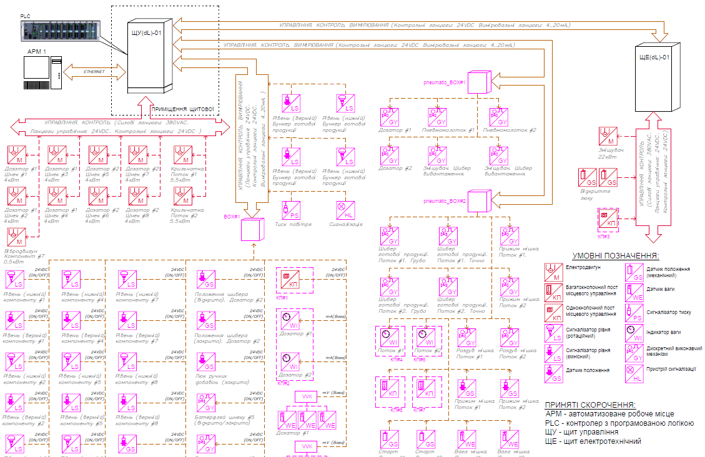
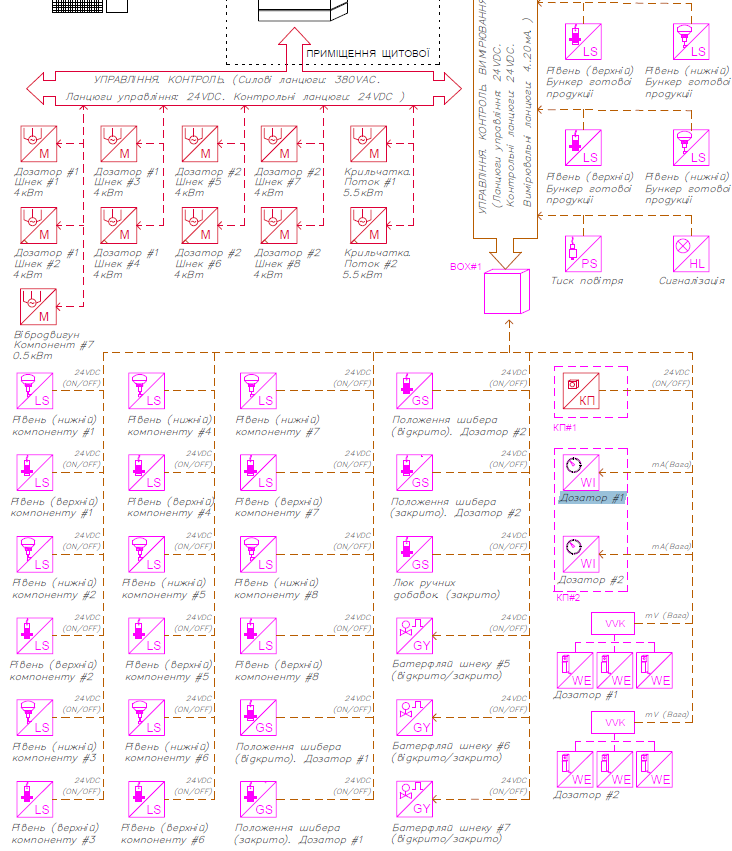
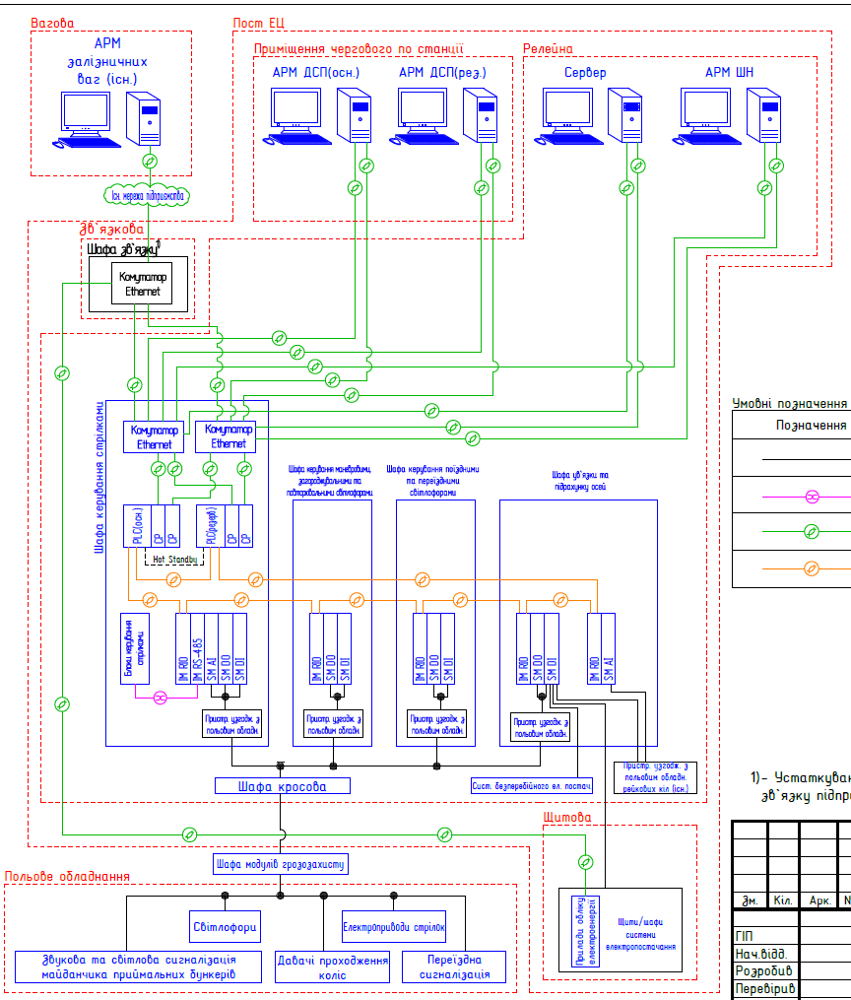
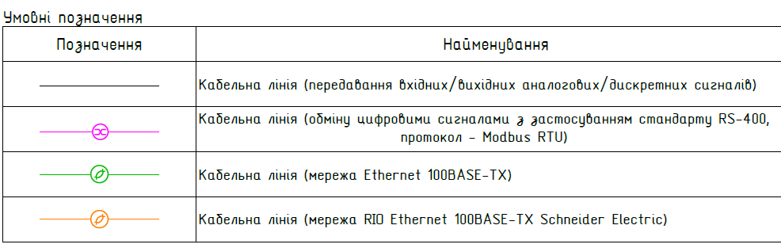
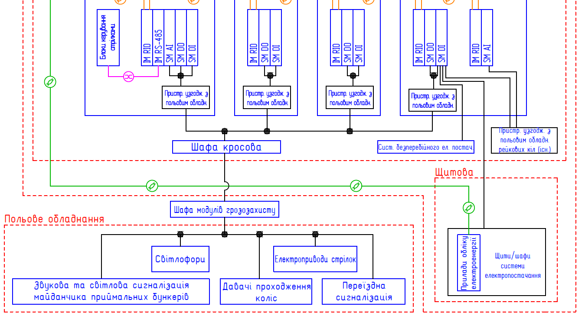
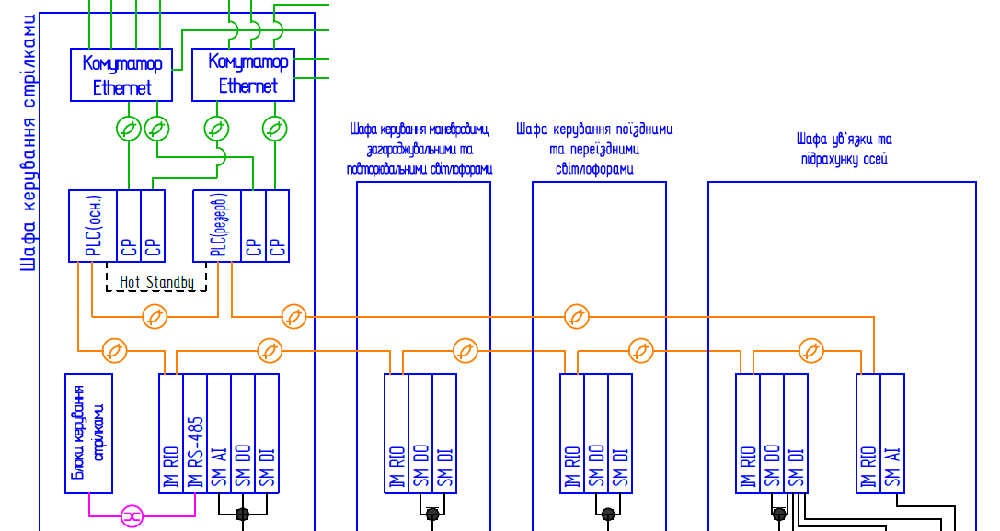
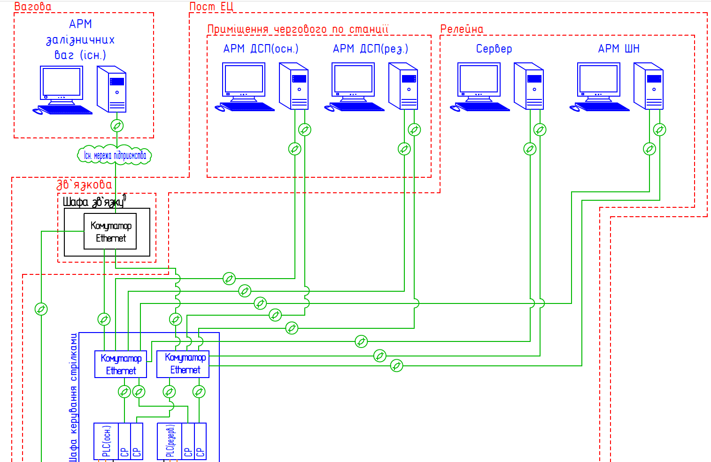

[<- До підрозділу](README.md)		[Коментувати](#feedback)

# Представлення технічної структури системи

Це не завершений розділ.

## 1. Вступ

Представлення технічної структури системи є необхідним для фіксації складу технічних засобів, їх ієрархії та взаємозв’язків, на основі яких реалізуються функції автоматизованої системи. Таке подання дозволяє узгодити функціональні рішення з конкретними апаратними та програмно-технічними компонентами, забезпечує однозначне розуміння системи всіма учасниками проєкту та слугує основою для проєктування, монтажу, налагодження й експлуатації.

У стандартах серії ГОСТ 34, яким до сих пір користуються українські інженери, це завдання реалізується через опис технічної структури та структурну схему комплексу технічних засобів, які розглядаються як канонічне подання апаратної складової автоматизованої системи. У сучасних стандартах системної та архітектурної інженерії (зокрема ISO/IEC/IEEE 42010) подання технічної структури розглядається ширше — як одне з архітектурних подань, що формується відповідно до обраної точки зору та потреб зацікавлених сторін, без жорсткої прив’язки до конкретної форми документа.

Графічно структуру не можна подавати у вигляді електричних схем, вимоги до яких регламентуються стандартами, бо вона повинна бути досить простою, щоб осягнути технічне рішення системи в комплексі і без надмірної деталізації. Схеми, які представляють технічну структуру радше є інженерним способом зафіксувати архітектуру системи керування у графічному вигляді. Вимоги до чіткого вигляду таких схем не означені навіть в старих стандартах ГОСТ, тому вони можуть виглядати зовсім по різному. У той же час, сьогодні стандарти серії ГОСТ 34 формально вже не діють на території України, і фактично вже не відповідають вимогам сучасного проєктування. Тим не менше, самі схеми досить часто використовуються як зручний інструмент на різних стадіях життєвого циклу систем, тому для інженера автоматника вони повинні бути зрозуміли як для читання, так і для розроблення. 

У цьому розділі посібника основна увага приділена розробці графічної частини, які в 34-й версії стандартів прийнято називати структурними схемами  комплексу технічних засобів (КТЗ). Тим не менше, читач повинен розуміти, що інженерія у світі базується на сучасних стандартах, зокрема ISO/IEC/IEEE 42010, який з 2025 року діє в Україні як ДСТУ ISO/IEC/IEEE 42010:2025, який описаний в [Опис архітектури систем відповідно до ISO 42010](iso42010.md).

## 2. Вимоги зі стандартів ГОСТ 34

### Документи серії ГОСТ34

Хоч не варто вдаватися в подробиці стандартів ГОСТ 34, трохи зупинимося на тій частині, яка стосується саме технічної структури автоматизованої системи (**АС**). Почнемо з того, що у стандартах серії ГОСТ 34 поняття **технічна структура** не подається у вигляді формального означення. Натомість, його зміст розкривається через склад і взаємозв’язки технічних засобів автоматизованої системи, що відображаються на структурній схемі комплексу технічних засобів. Таким чином, у межах ГОСТ 34 технічна структура трактується як сукупність технічних засобів та зв’язків між ними, що забезпечують реалізацію функцій системи. 

Також варто зауважити, що у цих стандартах існує чітке концептуальне протиставлення технічних і програмних засобів. **Технічні засоби** розглядаються як апаратна складова автоматизованої системи (обчислювальна техніка, мережі, пристрої введення-виведення), тоді як **програмні засоби** виділяються в окрему складову, що забезпечує реалізацію алгоритмів, логіки керування та оброблення даних. Відповідно, технічна структура і програмна структура в ГОСТ 34 описуються окремо та відносяться до різних аспектів системи, навіть виконуються відповідно до різних груп стандартів.

Цікавим для покоління що виросло в незалежній Україні може бути той факт, що в самих стандартах серії 34, практично нічого немає про виконання схем і він не має практичної цінності, однак мав юридичну вагу. Натомість додатково видавалися так звані РД (керівні документи) та РМ (керівні матеріали). 

- РМ використовувався для надання методичних рекомендацій: як застосовувати вимоги стандартів на практиці, як виконувати схеми, розрахунки, оформлення документації. РМ не був обов’язковим стандартом, але слугував орієнтиром для проєктантів і експертів. 
- РД як керівний документ мав вищий статус, ніж РМ, і часто містив обов’язкові або напівобов’язкові вимоги для певної галузі або відомства. РД застосовували для уніфікації практик там, де ГОСТ був надто загальним або не враховував галузевої специфіки.

Тобто ГОСТ вказував “що потрібно”, РД уточнював “як саме це робити”, а РМ пояснював “як робити правильно на практиці”. Так само стандарт ГОСТ 34.201-89 вказував на перелік документів, їх позначення та комплекти на різних стадіях ЖЦ автоматизованих систем, а РД50-34.698.90 вказував на вимоги до їх змісту. Саме в цьому документі є вказівки на те, як треба наводити структуру комплексу технічних засобів, тому нижче розглянемо його частини, що відносяться до теми розділу.

У наведених вище стандартах можна виділити три документи, які можна віднести до представлення технічної структури системи. Всі вони входять до технічного забезпечення АС: 

- структурна схема комплексу технічних засобів (позначувався як `С1`)
- опис комплексу технічних засобів (позначувався як `П9`)
- Інструкція з експлуатації КТС (позначувався як `ІЕ`)

Хоч в оригіналі використовується абревіатура КТС, надалі ми будемо вживати українську абревіатуру - **КТЗ**. Варто також зауважити, що інші документи технічного забезпечення також стосуються комплексу технічних засобів, однак ми зазначили тільки ті, що стосуються саме загального архітектурного представлення.

### Структурна схема комплексу технічних засобів (С1)

У РД небагато написано про виконання схеми комплексу технічних засобів. Нижче дається прямий переклад 

> 4.1.1. Документ містить склад комплексу технічних засобів та зв’язки між цими технічними засобами або групами технічних засобів, об’єднаними за певними логічними ознаками (наприклад, за спільним виконанням окремих або кількох функцій, однаковим призначенням тощо).
> 4.9.2. Під час виконання схем допускається:
>
> 1) зазначати основні характеристики технічних засобів;
>
> 2) подавати структуру КТЗ автоматизованої системи (за потреби) кількома схемами, першою з яких є укрупнена схема КТС автоматизованої системи в цілому.

### Опис комплексу технічних засобів (П9)

Цей документ описує весь комплекс технічних засобів і містить кілька розділів:

- загальні положення;  
- структура комплексу технічних засобів;
- засоби обчислювальної техніки;
- апаратура передавання даних.

Надалі даємо прямий переклад оригіналу:

> 4.2.2. У загальних положеннях наводять вихідні дані, які використовуються при проектуванні технічного забезпечення системи;
>
> 4.2.3. У розділі "Структура комплексу технічних засобів" наводять:
>
> 1. обґрунтування вибору структури КТЗ, зокрема технічні рішення щодо обміну даними з технічними засобами інших АС (за наявності таких зв’язків), щодо використання технічних засобів обмеженого застосування (відповідно до переліків, затверджених у встановленому порядку), а також посилання на документи, що підтверджують погодження їх постачання;
> 2. опис функціонування КТЗ, зокрема в пускових та аварійних режимах;
> 3. опис розміщення КТЗ на об’єктах та у виробничих приміщеннях з урахуванням виконання вимог техніки безпеки та дотримання технічних умов експлуатації технічних засобів;
> 4. обґрунтування застосування і технічні вимоги до обладнання, передбаченого в затверджених проєктах і кошторисах на будівництво або реконструкцію підприємств, а також виготовленого в індивідуальному порядку промисловими підприємствами або будівельно-монтажними організаціями за замовними специфікаціями і кресленнями проєктних організацій як разового, що не має галузевої приналежності за виготовленням і застосовується в силу особливих технічних рішень у проєкті;
> 5. обґрунтування методів захисту технічних засобів від механічних, теплових, електромагнітних та інших впливів, захисту даних, зокрема від несанкціонованого доступу, а також забезпечення заданої достовірності даних у процесі функціонування КТЗ (за потреби);
> 6. результати проєктної оцінки надійності КТЗ
>
> 4.2.4. У розділі «Засоби обчислювальної техніки» наводять:
>
> 1. обґрунтування та опис основних рішень щодо вибору типу ЕОМ;
> 2. обґрунтування та опис основних рішень щодо вибору типів периферійних технічних засобів, зокрема засобів отримання, контролю, підготовки, збирання, реєстрації, зберігання та відображення інформації;
> 3. опис структурної схеми технічних засобів, розміщених в обчислювальному центрі та на робочих місцях персоналу;
> 4. результати розрахунку або розрахунок кількості технічних засобів і потреби в машинних носіях даних;
> 5. обґрунтування чисельності персоналу, що забезпечує функціонування технічних засобів у різних режимах;
> 6. технічні рішення щодо оснащення робочих місць персоналу, включно з описом робочих місць і розрахунком площ;
> 7. опис особливостей функціонування технічних засобів у пусковому, нормальному та аварійному режимах.
>
> 4.2.5. У розділі «Апаратура передавання даних» наводять:
>
> 1. обґрунтування та опис рішень щодо вибору засобів телеоброблення та передавання даних, зокрема рішень щодо вибору каналів зв’язку та результати їх розрахунку (за потреби — розрахунок їх кількості);
> 2. рішення щодо вибору технічних засобів, що забезпечують спряження з каналами зв’язку, зокрема результати розрахунку (або розрахунок) їх потреби;
> 3. вимоги до орендованих каналів зв’язку;
> 4. відомості про розміщення абонентів і об’ємно-часові характеристики передаваних даних;
> 5. основні показники надійності, достовірності та інших технічних характеристик засобів телеоброблення і передавання даних.

### Інструкція з експлуатації КТС (ІЕ)

Надалі даємо прямий переклад оригіналу:

> 4.19.1. Документ містить такі розділи:
>
> 1) загальні вказівки;
> 2)  заходи безпеки;
> 3) порядок роботи;
> 4) перевірка правильності функціонування;
> 5) вказівки щодо дій у різних режимах.
>
> 4.19.2. У розділі «Загальні вказівки» зазначають:
>
> 1) вид обладнання, для якого складено інструкцію;
> 2) найменування функцій автоматизованої системи, що реалізуються на цьому обладнанні;
> 3) регламент і режими роботи обладнання під час реалізації функцій;
> 4) перелік експлуатаційних документів, якими персонал повинен додатково керуватися під час експлуатації цього обладнання.
>
> 4.19.3. У розділі «Заходи безпеки» наводять правила безпеки, яких необхідно дотримуватися під час підготовки обладнання до роботи та під час його експлуатації.
>
> 4.19.4. У розділі «Порядок роботи» зазначають:
>
> 1) склад і кваліфікацію персоналу, допущеного до експлуатації обладнання;
> 2) порядок перевірки знань персоналу та допуску його до роботи;
> 3) опис робіт і послідовність їх виконання.
>
> 4.19.5. У розділі «Перевірка правильності функціонування» зазначають зміст і стислий опис методик основних перевірок працездатності обладнання та правильності виконання функцій системи.
>
> 4.19.6. У розділі «Вказівки щодо дій у різних режимах» перелічують дії персоналу в нормальному режимі роботи, під час аварійного відключення обладнання, у передаварійному та аварійному станах об’єкта автоматизації, а також у пусковому та зупинному режимах об’єкта автоматизації.

## 3. Формування вимог до структури КТЗ

Враховуючи тяглість практик розроблення структури КТЗ зі стандартів ГОСТ 34, спробуємо тут визначити можливі вимоги до цих схем, виходячи з цих стандартів. Серед наведених вище документів та вимог більше всього зосередимся на структурній схемі комплексу технічних засобів, та деяких пунктах опису комплексу технічних засобів, так як ці документи доповнюють один одного і є цілісним представленням структури КТЗ. 

На особисту думку автора даного розділу графічне представлення легше і швидше сприймається, ніж текстовий опис. Отже варто показати усю необхідну інформацію графічно, якщо це можливо і не нагнітатиме схему. Виходячи з цього, можна зробити наступні висновки щодо необхідності зображень відповідно до РД:

1. на схемі показується технічні засоби та зв’язки між ними (згідно 4.1.1) 
2. на схемі можуть показуватися групи технічних засобів, об’єднаними за певними логічними ознаками (наприклад, за спільним виконанням окремих або кількох функцій, однаковим призначенням тощо), які об'єднані між собою зв'язками (згідно 4.1.1); 
3. структуру КТЗ можна подавати кількома схемами, першою з яких є укрупнена схема КТС автоматизованої системи в цілому (згідно 4.1.2)
4. на схемі можна зазначати основні характеристики технічних засобів (згідно 4.1.2);
5. графічно виділяти (наприклад штриховою лінією) розміщення КТЗ на об’єктах (поверх, цех, тощо) та у виробничих приміщеннях, відповідно до різних вимог техніки безпеки та дотримання ТУ (ex зона, хім виконання тощо) (посилання з 4.2.3);
6. показувати технічні засоби телеоброблення та передавання даних, зокрема канали зв’язку (посилання з 4.2.5);
7. показувати технічні засоби, що забезпечують спряження з каналами зв’язку (посилання з 4.2.5);

Пропонується також добавити ті речі, які на думку автора даного розділу, є очевидними, хоча в стандарті не зазначені: 

8) зв'язки між технічними засобами є фізичними (провідники, кабелі), а не логічними чи інформаційними; 
9) якщо фізичні зв'язки мають показувати напрямок передачі інформації по провідникам, можна вказати це стрілками біля технічного засобу; 
10) якщо передача інформації багатостороння (наприклад в мережах), стрілки напряму не варто вказувати;

11) кожен технічний засіб має мати унікальне умовне текстове позначення для його ідентифікації в системі;

12) кожен канал зв'язку має бути ідентифікований відносно способу обміну даними;

13) якщо канал зв'язку є частиною мережі, це має бути зрозуміло зі схеми;       

## 4. Приклади виконання

Як вже зазначалося вище, жорстких вимог до схеми КТЗ навіть в старих стандартах ГОСТ 34 немає, тоді як варто нагадати, що ці стандарти навіть не є чинними в Україні. Тому виконання схем може бути зовсім різним, але маючи відповідні технічні компетентності будь хто має її прочитати. Тому основна вимога до таких схем саме в тому, щоб їх можна було правильно прочитати, тобто вірно зрозуміти, що там зображено (задача мінімум). У той же час, наявність усієї необхідної інформації на схемі покращує її призначення.  

У цьому пункті розберемо кілька прикладів виконання, надані спільнотою автоматників. 

### Приклад 1

У даному прикладі розглянемо схему, яку люб'язно надали співробітники [ТОВ “ТЕХЕНЕРГОЦЕНТР”](https://tec.co.ua) . Ця схема показує технічну структуру класичної системи керування з одним PLC, одним АРМ та засобами вводу/виводу (давачі, виконавчі механізми). Повна схема доступна за [цим посиланням](https://drive.google.com/file/d/1Q8ICCtjXBnHQZIO_YjIenLIexjuaLknt/view?usp=sharing). 

Для початку розглянемо схему повністю, щоб означити основні частини документу (рис.1). Документ включає:

- безпосередньо схему 
- перелік умовних позначень
- скорочення

Зверніть увагу, що без переліку умовних позначень та скорочень схема не повна, тому їх наявність є обов'язковими.   

Сама схема побудована за класичним ієрархічним принципом, де верхній рівень керування знаходиться у верхній частині, а периферія - в нижній. На схемі розміщені групи технічних засобів, зокрема давачі з обв'язкою, ВМ, двигуни, пости, щити, АРМ. Зі схеми не зрозуміло скільки пристроїв входить до груп, тому можливо деякі позначення вказують на індивідуальні засоби. Групи засобів з'єднані між собою стрілками з написами, які показують призначення проводок, які з'єднують їх, напрям передачі сигналів, типи сигналів. Стрілки у вигляді фігур очевидно показують магістралі кабелів, тоді як пунктирні стрілки - індивідуальні кабелі/проводки. На даній схемі немає уточнень щодо умовних позначень з'єднань, можливо це є на початку комплекту документів.  Також з рис.1 видно, що:

- щити `ЩУ` та `ЩЕ` з'єднані проводками для `УПРАВЛIННЯ. КОНТРОЛЬ. ВИМIРЮВАННЯ (Контрольнi ланцюги: 24VDC Вимiрювальнi ланцюги: 4..20мА.)` і мають два напрямки 
- місце розміщення ЩУ (`Приміщення щитової`), у той же час зі схеми не зрозуміло місце розміщення інших груп засобів;
- АРМ та ЩУ з'єднані за допомогою Ethernet

Групування пристроїв не дає можливості вказати, як саме зроблені з'єднання, тобто не вказані ні пристрої зв'язку, ні канали зв'язку на цих пристроях, бо показані групи засобів а не самі засоби а також магістралі проводок і не окремі кабелі.       

рис.1. Загальний вигляд схеми КТС (приклад 1)

Тепер розглянемо одну з частин схеми. На рис.2 показаний фрагмент схеми, де зокрема зображено:

- електродвигуни
- датчики та сигналізатори 
- пристрої сигналізації
- `BOX` (позначення не зрозуміле, бо його немає ні в умовних позначеннях ні в скороченнях)

Деякі групи засобів з'єднані тонкими пунктирними лініями, які мають стрілку в одному напрямку, що очевидно вказує на напрям передачі сигналу. Над деякими лініями вказується як сам тип сигнал4 (`24 VDC`) так і його зміст (`ON/OFF`). 

Зверніть увагу на `Дозатор #1` та `Дозатор #2`, на вхід якого подається `mA (вага)`. Можна зрозуміти це як задане значення ваги дозування, однак діапазони при цьому не вказані.    

рис.2. Фрагмент схеми КТС  (приклад 1)

Для кращого розуміння даної схеми КТС, потрібен опис, так як не вся інформація доступна безпосередньо зі схеми. 

### Приклад 2

У цьому прикладі ми розглянемо наступну схему для автоматизованої системи мікропроцесорної централізації ([тут доступна повна версія](https://drive.google.com/file/d/1YTLcfvcPbShFR83bOYYbPpuFFZW5zKYf/view?usp=drive_link)), спроєктовану вже іншою організацією. 

На рис.3 показаний загальний вигляд повної схеми. Для кращого відображення на самому рисунку не показані частини, де наведені умовні позначення та прийняті скорочення, натомість умовні позначення наведені нижче сехми. 

Як і в першому прикладі, схема має ієрархічний вигляд:

- верхній рівень - супервізорне керування з АРМ
- середній рівень - контролерів 
- нижній рівень - польове обладнання 

Пунктиром виділені місця розміщення груп технічних засобів в приміщеннях: "Вагова", "Пост ЕЦ", "Релейна", "Щитова", "Зв'язкова", "Польове обладнання". Технічні засоби розміщуються в шафах, які також показані на схемах. Розміщення дає змогу не тільки визначити положення а і унікально ідентифікувати засоби.   

рис.3. Загальний вигляд схеми КТС (приклад 2)

На відміну від попереднього прикладу, ця система є більшою за масштабами, тому тут використовуються механізми групування в залежності від кількості засобів та необхідності їх унікальної ідентифікації. У той же час на схемі показані як групи засобів, так і самі засоби. Це дає змогу з одного боку не нагнітати лишніми деталями схему, а з іншого - показати структуру системи цілком. 

Усі засоби та групи засобів мають текстове умовне позначення. У ряді випадків воно унікальне, а в інших - унікальність досягається шляхом розміщення в різних місцях. 

Особливим випадком є наявність двох однакових пристроїв "Комутатор Ethernet". З першого погляду з цієї схеми не вдається чітко ідентифікувати їх. Однак в цьому немає потреби, бо вони дзеркальні (див. причину нижче).   

Усі польові засоби та засоби перетворення згруповані наступним чином (рис.4):

- польове обладнання згруповане за призначенням
- засоби в шафах перетворювачів показані як шафи 
- пристрої узгодження з польовим обладнанням показані окремими групами
- модулі дискретних та аналогових сигналів для PLC показані окремими групами (`SM AI`, `SM DI`  ...)
- усі зв'язки для передавання вхідних/вихідних аналогових та дискретних сигналів показані як єдині кабельні лінії   

рис.4. Фрагмент схеми КТС  (приклад 2, польові засоби)

Така реалізація дає можливість зрозуміти, як зв'язані польовий рівень та рівень керування, та які проміжні групи засобів використовуються. Зі схеми не видно на скільки багато засобів в групах. Однак якщо навіть припустити що в кожній групі їх по два (що вочевидь надзвичайно занижене припущення)  подумайте, на скільки б ускладнилася дана схема. Виходом з ситуації може бути додаткова схема КТС, яка буде показувати тільки частину системи, наприклад для кожного `IM RIO` окремо, якщо звісно в цьому є сенс.

Тепер розглянемо рівень контролерів, який показано на рис.5. Зі схеми чітко видно топологію мережі RIO на базі Ethernet, яка об'єднує в кільце наступні засоби:

- пару CPU резервованого PLC: основного та резервного
- `IM RIO`: інтерфейсні модулі засобів віддаленого вводу/виводу   

Кільце явно простежується, підключення до модулів також. Хоч на схемі не видно портів підключення на модулях, при наявності двох рівнозначних портів в цьому немає потреби. Однак якщо їх більше, варто би було зазначити це на схемі. Зауважимо також, що в одній із шаф IM не мають унікальної ідентифікації, що може внести плутанину при читанні під час експлуатації системи.

Між CPU явно видно зв'язок Hot Standby, враховуючи що для цього використовується спеціальний виділений порт CPU, ідентифікувати його на схемі не обов'язково, бо це нагнітає лишньою інформацією. Також на схемі показана мережа Modbus RTU на базі RS-485 між одним із засобів RIO (через модуль `IM RS-485`) та блоком керування стрілками.    

рис.5. Фрагмент схеми КТС  (приклад 2, рівень контролерів)  

Наступна частина - рівень АРМ (рис.6). Зі схеми чітко видно структуру мережі верхнього рівня на базі Ethernet, яка побудована з використанням комутаторів за топологією "дерево", до якої входять: 

- кілька ПК АРМ
- ПК Сервер
- комутатори
- PLC через комунікаційні процесори (`CP`)

Зі схеми видно, що на більшості ПК присутні дві комунікаційні карти, вочевидь з метою резервування як підключення до основного або резервного PLC, так і самих каналів зв'язку.     

рис.6. Фрагмент схеми КТС  (приклад 2, рівень АРМ)  

### Приклад 3

https://drive.google.com/file/d/11DCu3BsSyB85xloYay3y39fOa-nI2xkp/view?usp=drive_link

## Джерела

1. 

## Автори

Теоретичне заняття розробив [Олександр Пупена](https://github.com/pupenasan). 

Подяка учасникам спільноти, які надали схеми для прикладів.

## Feedback

Якщо Ви хочете залишити коментар у Вас є наступні варіанти:

- [Обговорення у WhatsApp](https://chat.whatsapp.com/BRbPAQrE1s7BwCLtNtMoqN)
- [Обговорення в Телеграм](https://t.me/+GA2smCKs5QU1MWMy)
- [Група у Фейсбуці](https://www.facebook.com/groups/asu.in.ua)

Про проект і можливість допомогти проекту написано [тут](https://asu-in-ua.github.io/atpv/)