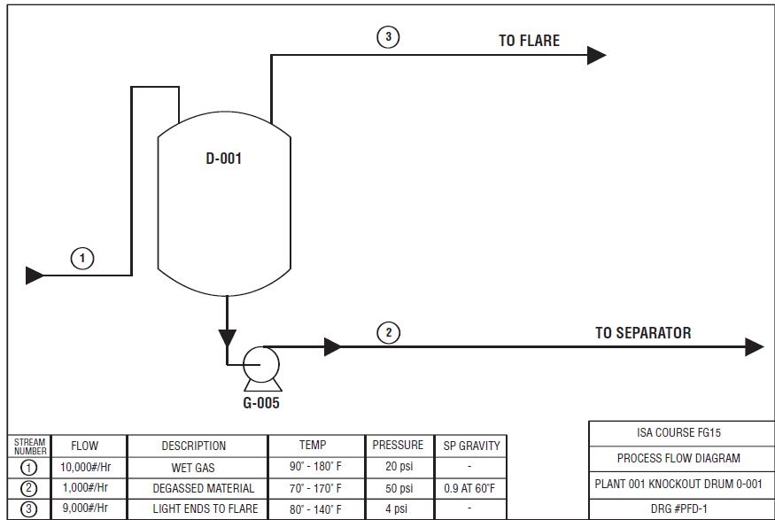
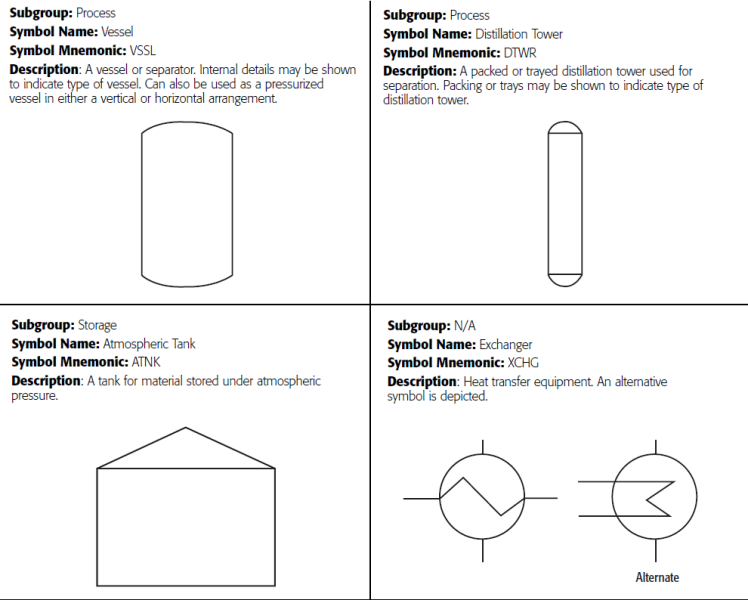

[Зміст](README.md)

# Схема технологічного процесу (PFD)

Схема технологічного процесу (Process Flow Diagram, PFD) — це вузькоспеціалізований документ, який ви, можливо, ніколи не бачили. Тим не менш, він критично важливий для організованого раннього розвитку будь-якого складного технологічного процесу. PFD — це фундаментальне представлення процесу, який схематично зображує перетворення сировини на готову продукцію без заглиблення в деталі того, як це перетворення відбувається. Він означує потік матеріалів і комунікацій, він означує основні співвідношення між основними частинами обладнання, а також означує витрату, тиск і температуру процесу.

Групи розробників проекту найбільш ефективно використовують PFD на етапах розроблення проекту, перед початком детального проектування. На цих етапах  проводяться техніко-економічні обґрунтування та роботи з означення обсягу робіт. PFD тісно пов'язані з матеріальними балансами. Вони використовуються, щоб вирішити, чи достатньо є сировини та інженерних комунікацій для реалізації проекту. У межах експлуатаційної компанії загальнозаводська проектна група та керівництво підприємства можуть використовувати PFD для документування потоків технологічних матеріалів та інженерних комунікацій між різними підрозділами в межах підприємства.

Не існує загальноприйнятого галузевого стандарту, який би допомагав у розробці PFD. Отже, деякі PFD показують мінімум деталей, тоді як інші можуть містити значні деталі. Ці два різні підходи до проектування обговорюються нижче.

- **Підхід мінімальної деталізації** . Щоб PFD був ефективним, весь процес демонструється в мінімальному просторі, наскільки це можливо. Зображуються лише основні етапи процесу, деталі зведені до мінімуму. Мета полягає в тому, щоб просто показати, що була внесена зміна або продукт був виготовлений, а не те, як ця зміна була внесена. Тому необхідно обмежити деталі, показані на PFD. Наприклад, на PFD показано дуже мало деталей КВПіА (instrumentation and control, I&C) або зовсім їх немає, оскільки це обладнання не є критичним для матеріального балансу. Окремі компоненти інформаційно-комунікаційної системи також не є суттєвою складовою витрат у загальному бюджеті. Клапани та трансмітери зазвичай значно дешевші, ніж пов’язані з ними резервуари під тиском. Деталі будуть показані пізніше в P&ID та інших документах проекту. P&ID будуть детально розглянуті в наступному розділі. Як вирішити, що саме необхідно відобразити на PFD? Якщо ви професіонал з КВПіА і при цьому використовується підхід з мінімальною деталізацією, на цьому етапі розробки процесу буде використано не так багато вашої роботи. Одне успішне емпіричне правило полягає в тому, щоб показувати деталі обладнання, лише тоді, коли ця інформація має значний вплив на матеріальний баланс, або якщо ця інформація потрібна для означення чогось особливого щодо цього обладнання. Термін «особливий» тут означає «значний вплив на вартість проекту». Якщо інформація потрібна для прийняття критичного проектного рішення, вона може бути достатньо важливою для відображення в PFD.

- **Підхід максимальної деталізації**.  Інші групи проектувальників заводу та власники заводу вважають, що PFD має містити якомога більше деталей проекту. Ці команди та власники залучають інженерів КВПіА вже на початку проекту, і вони беруть участь у розробці PFD. Тоді PFD можуть містити деталі конструкції, такі як основні вимірювальні точки, методи керування, регулюючі клапани та аналізатори процесу. PFD використовуються як орієнтир або, можливо, навіть як перший крок у розробці P&ID. Деталі будуть показані (або дубльовані) у P&ID та інших документах проекту. P&ID будуть детально розглянуті в розділі 2.

Одна схема PFD може містити достатньо інформації для кількох P&ID. Основне правило: PFD може містити достатньо інформації для розробки до 10 P&ID!

Метою PFD є означення проекту технологічного процесу. Рис. 1-1 є прикладом спрощеної PFD. Для установки неперервного процесу завершення розроблення PFD часто є відправною точкою детального проектування.

Рис. 1-1: Process Flow Diagram

Схема PFD, швидше за все, розробляється в кілька етапів. На першому кроці власник заводу може розробити попередню версію PFD, яка буде використовуватися як «документ для роздумів», який встановлює на папері запропонований процес або зміну процесу, який розглядається. Власник підприємства може використовувати інші методи для документування роботи, наприклад, письмовий опис для означення обсягу технологічного процесу, наприклад:

> Опис технологічного процесу Plant 001 Knockout Drum D-001 
>
> - Вхідний газ, який складається із змішаних нафтових рідин і парів, виникає в різних секціях установки і подається по трубопроводу до вибивного барабана (Knockout Drum) D-001, де рідини і пари розділяються шляхом розширення та уповільнення швидкості.
> - Змішані нафтові рідини перекачуються до сепаратора, а пари направляються до факелу.
> - Вхідний матеріал зазвичай складається з 10% конденсату, але за деяких умов вміст конденсату може бути суттєво зменшений.
> - Температура вологого газу змінюватиметься від низької 90°F до високої 180°F.

У будь-якій з цих форм, надана власником інформація використовується для встановлення початкових критеріїв проектування заводу.

Потім, зазвичай, перед випуском для детального проектування, надана схема PFD або інша концептуальна інформація переглядається інженерами-технологами підрядника та командою планування. Перевірка має забезпечити виконання двох критеріїв:

1. На PFD існує достатньо інформації для розроблення P&ID за всіма дисциплінами детального проектування. Рішення про те, що представлено «достатньо» інформації, ймовірно, найкраще залишити за проектною організацією, яка використовуватиме PFD.

2. Для підтримки надається достатньо інформації про матеріальні баланси (про кількість матеріалів, які надходять в систему і виходять з неї). Ця інформація використовується для того, щоб допомогти командам проектування та закупівель визначити та задати специфікації для обладнання, яке має бути замовлене заздалегідь. Це обладнання потребує більше часу для виготовлення та доставки, тому його важливо означити на ранніх етапах проекту. Іншими словами, це обладнання, яке потрібно придбати на початку проекту.

PFD, розроблені власником заводу, ймовірно, будуть перерисовані командою інженерів. Нова версія міститиме інформацію, необхідну групі проектантів.

Власник докладе багато зусиль і інвестує багато часу, грошей і досвіду в проект ще до того, як буде розроблено PFD. Нижче наведено спрощений погляд на кроки, які зробить власник.

- Проект може початися з блиску чиїхось очей або голосу посеред ночі. Ми могли б продати набагато більше продукції, якби у нас був новий, ефективніший завод. Ми могли б продавати новий продукт, наприклад мило, або фарбу, або бікарбонат натрію, або тканину, або толуолдіізоціанат, або комп’ютерні мікросхеми, за умови, що ми можемо виробляти це економічно ефективним способом. Ми могли б використати новий завод, новий процес, нові матеріали чи інші методи. Ми могли б зробити наш продукт кращим або дешевшим. Ми могли б зменшити забруднення або мати менше побічних продуктів. Ми могли б зробити нашу продукцію більш прибутковою за допомогою вищої якості. Потім блиск в очах передається команді для подальшого розвитку.

- Команда включатиме керівників і спеціалістів компанії, таких як консультанти, інженери, консультанти з нерухомості, менеджери із закупівель, відділи маркетингу, експерти з продажу та інший допоміжний персонал. Команда розробляє принаймні загальний розмір і розташування заводу, маркетинговий план продукту та фінансовий план для визначення та контролю витрат. Попередній процес визначається за допомогою PFD, а також визначаються джерело та вартість сировини.

- Якщо вся ця інформація є сприятливою, керівники компанії, швидше за все, вирішать побудувати завод, який вироблятиме певну кількість одиниць на рік, використовуючи найкращі існуючі технології. У плані, можливо, буде вказано, що завод буде розташований там, де є сировина, електроенергія, вода та розумна робоча сила. У плані будуть означені витрати та розрахована посилання для тривалості проекту. План витрат включатиме прогнози виходу продукції, а також заплановану вартість сировини, об’єднану та розподілену, щоб забезпечити собівартість одиниці та маржу для проданих одиниць. Зрештою план передбачатиме повернення інвестицій (ROI) для проекту, який, сподіваємося, буде вищим за порогове значення компанії для нових проектів. Якщо прибуток від інвестицій буде невеликим або якщо він буде нижчим від порогу компанії, проект просто не буде схвалено.

- Після прийняття рішення про продовження проекту планування продовжується. Далі виконавча команда забезпечить необхідну землю та підготує пакет документів щодо визначення обсягу. Вони слугуватимуть відправною точкою для детального проектування. Початкова або попередня PFD або інший опис процесу, розроблений інженерами або консультантами власника, буде включений до цих документів щодо обсягу. Багато фірм використовують незалежних інженерних підрядників для детального проектування. Інші фірми мають власні можливості та персонал і вважають за краще виконувати детальний інженерний проект самостійно.

- Якщо буде використано незалежний інженерний підрядник, щоб допомогти в забезпеченні послуг підрядника через конкурсні торги або інші процеси відбору, власник використовуватиме підготовлену документацію про обсяг, .

- Типова попередня схема PFD або опис процесу покаже продукт, виготовлений заводом; необхідна для цього продукту сировина; побічні продукти, отримані в процесі; відходи, які підлягають утилізації; технологічний тиск, температури та потоки, необхідні для виробництва продукту; і необхідне основне обладнання. На PFD показано важливі ділянки трубопроводу, але не вказані розміри трубопроводу, не показані допоміжні та комунальні трубопроводи. Також, можливо, щоб підкреслити певні критичні характеристики процесу, може бути включений письмовий опис процесу, .

> Незалежно від того, чи розробляє проект підрядник, чи це виконується власними силами, роботу виконує команда інженерів-проектувальників, що складається з багатьох груп спеціалістів. Типову команду очолюватиме інженер проекту або менеджер з інженерії, і вона може складатися з таких проектних груп:
>
> - Civil
>
> - Electrical
>- Instrumentation and Control
> - Mechanical Equipment 
> - Plant Design/Piping
> - Process
> - Project
> - Structural
> - Vessels
> 
> Команда проектувальників є частиною загальної організації, необхідної для управління проектуванням і будівництвом об’єкта. Одним із загальних термінів для сфери діяльності всієї організації є EPC: проектування – закупівлі – будівництво. Деякі власники наймають підрядників для виконання деяких або всіх трьох частин, тоді як інші виконують усі три самостійно. Керівник проекту власника має загальний контроль над проектом. Керівник проекту також може мати додатковий персонал для виконання інших функцій, таких як розрахунок витрат, оцінка та юридичні функції. Підрядники також можуть використовувати менеджера проекту для контролю своєї частини проекту, якщо вони мають інші обов’язки, окрім інженерних.

Для ідентифікації обладнання на PFD використовувуються символи та літерні позначення. Немає необхідності додавати багато деталей до обладнання, показаного на PFD. Для цього підійде простий лінійний ескіз. Наприклад, теплообмінник можна показати як просте лінійне представлення основного технологічного потоку та потоку теплоносія, не маючи на увазі конкретного типу теплообмінника. Для PFD необхідна лише інформація про те, що частина обладнання передає тепло в цій точці, а не показ конкретного механізму передачі. Кілька типових символів PFD для обладнання дивіться на рис.1-3.

Деякі проекти можуть ідентифікувати обладнання за допомогою символьної мнемоніки, показаної на рис.1-3: `VSSL` для ємностей, `DTWR` для ректифікаційних колон, `ATNK` для атмосферного танка та `XCHG` для теплообмінника. Інші проекти можуть використовувати одну букву для ідентифікації: наприклад, `C` для колон і тнаків, `D` для барабанів і ємностей, `E` для теплообмінників і охолоджувачів і `G` для насосів. Існує багато варіацій використовуваних літер і символів. Дуже важливо бути послідовним протягом усього проекту, і майже так само важливо використовувати символи, знайомі тим, хто їх використовуватиме.

Рис.1-3: PFD Equipment Symbols

Успішний підрядник з інженерії для проекту перегляне та, ймовірно, змінить або замінить PFD (схему технологічного процесу) власника на нову PFD, використовуючи стандарти підрядника. Ймовірно, для підрядника буде ефективніше перерисувати PFD, щоб скористатися перевагами їхнього «стандартизованого» символу та особливостей розробки креслень, властивих пакету автоматизованого креслення (CAD) підрядника.

На PFD вказуються дані процесу та умови. Ці умови зазвичай є «проектними» умовами, але — якщо це важливо для балансу матеріалів або розмірів обладнання — можуть бути передбачені нормальні або робочі умови, максимальні умови та навіть мінімальні умови. Оскільки PFD тісно пов’язаний з матеріальним балансом, зазвичай використовуються одиниці масової витрати. Крім того, передбачені умови тиску і температури.

Існує два поширених способи відображення інформації про процес. Перший полягає в тому, щоб надати набір чисел над і, можливо, нижче обладнання, що з’єднує лінію, використовуючи стандартний формат: витрата/тиск/температура. Між умовами використовуються роздільники. Одиниці вимірювання не надаються зазвичай для економії місця. Одиниці стандартизовані та представлені в аркуші з умовними позначеннями. Умови потоку – це ті умови, на яких базується проект, купується обладнання та визначаються розміри трубопроводу пізніше в процесі проектування.

Іншим корисним способом документування умов процесу є використання таблиці з переліком умовних позначень. Над лінією або частиною обладнання на кресленні додається пронумерований символ, часто у вигляді ромба із внутрішнім номером. Потім у верхній або нижній частині PFD надається таблиця з переліком умов процесу для цього пронумерованого символу. Цей підхід має перевагу в тому, що спрощує додавання додаткових умов процесу та полегшує підтримку даних у таблиці.

Як обговорювалося раніше в цій главі, деякі інженерні підрядники або власники включають більше інформації про PFD, ніж мінімум, описаний вище. Це має бути узгоджено між власником і підрядником. Можна стверджувати, що коли вимагається більше деталей до PFD, цілком можливо, що настав час перенаправити зусилля на проектування P&ID. Деякі проекти можуть відображати базову або навіть більш детальну інформацію про прилади та засоби керування. Однак для позначення цих пристроїв на PFD зазвичай використовуються дуже прості символи.

> Установки з порційним виробництвом можуть містити обладнання, яке використовується різними способами, у різній послідовності - часто для багатьох різних партій або продуктів одночасно або в різний час. PFD дуже ефективно означує неперервний процес. Однак для порційного виробництва може знадобитися додаткове означення. Процеси порційного виробництва піддають фіксовану кількість матеріалу (партія, порція) одному або декільком етапам процесу в одному або кількох елементах обладнання. Процес відбувається в комплекті обладнання, означеному в ANSI/ISA-88.01-1995, Керування порційним виробництвом, частина 1: Моделі та термінологія, як технологічна комірка.
>
> Технологічна комірка може бути використана для виготовлення одного або багатьох продуктів. Є ще два варіанти, якщо комірка виробляє багато продуктів. Комірка може використовувати різну сировину з різними параметрами процесу та або використовувати те саме обладнання, або, альтернативно, використовувати інше обладнання. Багато технологічних комірок мають можливість обробляти більше однієї партії однакових або різних продуктів одночасно. Одна схема PFD може означувати один процес. У порційному виробництві схема PFD часто доповнюється рецептом через складність. Рецепти містять п’ять категорій інформації, як показано в таб.1-4, і є специфічними для кінцевого продукту.
>
> Таб. 1-4 взято з книги «Застосування S88, Керування порційним виробництвом з точки зору користувача», написаної Джимом Паршаллом і Ларрі Лембом. Книга містить означення керівного рецепту: «Керівний рецепт використовується для створення однієї конкретної партії... Керівні рецепти, унікальні для окремих партій, дозволяють відстежувати продукт або генеалогію».
>
> Таб.1.4. Зміст рецепту
>
> |                        |                                                              |
> | ---------------------- | ------------------------------------------------------------ |
> | Header                 | Адміністративна інформація та короткий опис процесу          |
> | Equipment Requirements | Інформація про конкретне обладнання, необхідне для виготовлення партії або певної частини партії |
> | Procedure              | Означує стратегію здійснення процесу                         |
> | Formula                | Описує вхідні дані процесу, параметри процесу та вихідні дані процесу |
> | Other information      | Безпека продукту, нормативна та інша інформація, яка не відноситься до інших категорій |

Деякі інженерні підрядники або власники використовують PFD в якості першого кроку при проектуванні P&ID. Враховуються важливі вимоги до моніторингу та керування процесом, коли вони стають відомими. У цій ситуації група проектувальників процесу вкаже на схемі PFD також інформацію де потрібно вимірювати різні змінні процесу. Наприклад, коло з однією літерою `P` всередині означає, що для процесу важливий тиск у цій точці, тому його слід вимірювати. Подібним чином використання `F` для витрати, `L` для рівня або `T` для температури в колі вказує, де вимірюються ці змінні. Точне вибір та означення необхідних засобів КВПіА буде зроблено пізніше та показано на схемі P&ID.

Інші підрядники чи власники можуть вибрати показ важливих, критичних або, як правило, дорогих компонентів приладів і систем керування. Наприклад, вбудований технологічний хроматограф може з’явитися вже на PFD через його важливість для загального процесу, або через його велику вартість. Інші команди проекту можуть вирішити означити точки вимірювання змінних процесу та символічно показати регулятори та регулюючі клапани. Схеми PFD призначені для створення полотна для широкого мистецтва інженерів-технологів. Дрібні деталі, яких потребують інженери з КВПіА, слід залишити P&ID.

Ми не показали жодних символів приладів на нашому прикладі схеми PFD, але ми обговоримо символи та ідентифікацію систем КВПіА у розділі 2.

Для нашого обговорення ми вибрали дуже простий безперервний процес. Решту проектної документації для нашого заводу ми розробимо в наступних розділах. PFD для нашого змодельованого проекту показано на рис. 1-1, а текстовий опис процесу показано під ним.

Схема PFD на рис. 1-1 показує, що в технологічній лінії, номер потоку (1), є витрата 10 000 фунтів/год вологого газу з температурою від 90°F до 180°F і тиском 20 psi. Зміна температури спричинена змінами процесу перед нашим PFD. Зверніть увагу, що тільки номер потоку (1), (2) або (3) ідентифікує конвеєри. Не включено розмір лінії, матеріал конструкції чи номінальний тиск (ANSI 150, ANSI 300 тощо) для будь-якого трубопроводу, показаного на PFD. Також зауважте, що для привода насоса не показано жодних символів або даних. Лише номер обладнання, `G-005`, ідентифікує насос.

Вологий газ потрапляє в D-001, вибійний барабан, де рідина конденсується з потоку вологого газу, коли газ розширюється й охолоджується. Рідина перекачується в сепаратор (на іншому PFD), де вода та технологічна рідина розділяються. Номер потоку (2) показує, що насос G-005 має тиск нагнітання 50 psi. Рідини, що перекачуються, мають питому вагу 0,9 при 60ºF. Насос має продуктивність 1000 фунтів/год, а температура дегазованого матеріалу коливається від 70ºF до 170ºF.

Легкі фракції або гази, 9000 фунтів/годину і показані як номер потоку (3), направляються до факелу, який показаний на іншому PFD. Тиск, необхідний для переміщення цієї кількості газу до факелу, становить 4 psi. З цієї простої симуляції PFD ми маємо достатньо інформації, щоб почати розробку P&ID. Для команди проектувальників PFD стає менш важливим, оскільки P&ID розробляється, а технологічні температури, тиск і витрати використовуються для розробки проектних критеріїв. Однак, якщо він підтримується в актуальному стані під час розробки проекту, його можна використовувати для ознайомлення персоналу підрядника та власника з процесом. Зазвичай набагато легше зрозуміти основи технологічного процесу з PFD, ніж з P&ID.

[<<--](intro.md)                 [-->>](2.md) 