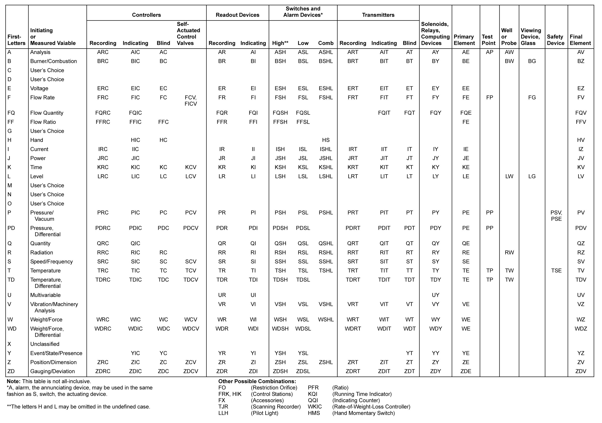
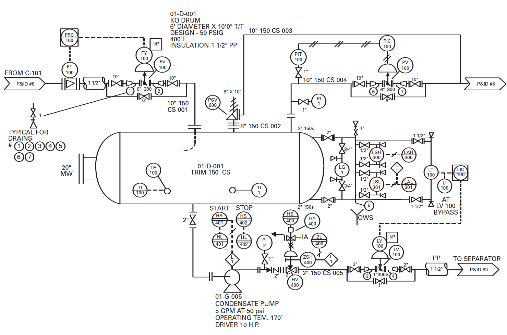

[Зміст](README.md)

# Схеми P&IDs та символи

## Огляд

Абревіатура “**P&ID**” у промисловому виробництві в основному розуміється як ім'я основного документу що використовується для означення процесу – обладнання, труб та всіх компонентів контролю та керування. 4-та редакція "Automation, Systems and Instrumentation Dictionary" означують це як Piping and Instrumentation Drawing (P&ID). P&IDs “показують взаємозв’язок технологічного обладнання та приладів, що використовуються для керування процесом”.

> Примітка перекладача: Я колись теж задався питанням[ трактування](http://asu.in.ua/viewtopic.php?f=251&t=166) P&ID. Схеми P&ID схожі на наші схеми автоматизації. Кажуть, що при розробці нашого стандарту ГОСТ 21.404-85 взяли за основу ISA-5.1-1984. Якщо їх порівняти, сумнівів практично немає. Однак наш стандарт так і завис в 1985-му році, а їх ISA-5.1 постійно розвивається.  

Для того щоб зобразити механічне обладнання, трубопроводи, елементи трубопроводів, клапани, двигуни, прилади контролю та керування використовуються набори позначень. Ці позначення показуються на схемі автоматизації таким чином, щоб чітко означити технологічний процес. Позначення для приладів контролю та керування (instrumentation and control, I&C) що використовуються в схемах P&ID в основному беруться з ISA-5.1-1984-(R1992), Instrumentation Symbols and Identification.  

>  Примітка перекладача:  На сьогодні актуальна версія[ ISA-5.1-2009](http://asu.in.ua/viewforum.php?f=250).

Ця книга допоможе у вирішенні довго існуючої до сих пір заплутаності інформації про P&ID. Існування плутанини зрозуміле, бо немає універсального стандарту для означення того, яка інформація повинна бути включена в P&ID, ба навіть значення літер "P","I" та "D". Ви можете стопроцентово знати що значать ці літери і сама абревіатура P&ID, але спец на об’єкті може з цими трактуваннями не погодитися. Наприклад "P" може значити Process (процес) чи Piping (трубопровід). Літера "I" може значити[Instrument](http://asu.in.ua/viewtopic.php?f=251&t=135) (прилад) або[ Instrumentation](http://asu.in.ua/viewtopic.php?f=251&t=135) (засоби КВП). "D" можна трактувати як Drawing (креслення, схема) або Diagram (діаграма, схема). P&ID можуть називати "Потоковими діаграмами" (Flow Diagrams), які не треба плутати з тими, що розглянуті в попередній главі. P&ID інколи називають "потоковими листами" (Flow Sheets). Термін часто означується відділом, який ініціює або розробляє їх, наприклад Інженери або Автоматники. У цій книзі для простоти, ми будемо звертатися до цього документу просто по абревіатурі P&ID.    

> Переклад деяких термінів дається та обговорюється на[ форумі АСУ в Україні](http://asu.in.ua/viewforum.php?f=251).  

Немає універсального, національного або міжнародного, багатопрофільного стандарту, що охоплює розвиток і зміст P&ID. Тим не менше, більша частина інформації про використання P&ID розглядається в ISA-5.1, який є чудовим, гнучким елементом, що означує, в першу чергу, позначення приладів. 

У цій книзі в якості кінцевого посилання використовується ISA-5.1. Ми розуміємо, що цей документ на момент написання книги, на початку 2004 року, знаходиться на стадії розгляду і перегляду. Після переробки, в стандарт ймовірно будуть внесені деякі зміни, але ми впевнені, що наміри та фокус стандарту будуть збережені. 

Інша професійна організація, Process Industry Practices (PIP), розробила та опублікувала багато рекомендованих практик. Серед них одна на P&ID. Додаткову інформацію про PIP можете отримати з розділу [10](10.md).

Ймовірно, що на вашому підприємстві схеми P&ID були розроблені та перероблені протягом багатьох років декількома розробниками. Для вдосконалення та доповнення технологічного процесу а також зміни системи керування, до редагування змісту і навіть набору позначень на ваших P&ID допущено багато різних людей. Якщо ви тільки не є неймовірно везучим в наявності підтримки корпоративних стандартів, деякі з ваших схем P&ID будуть використовувати позначення та формат відмінний від оригіналу, та навіть один від одного. Як Ви добре розумієте, непослідовність використання позначень та формату P&ID може дратувати, плутати і що більш важливо, робить інформацію на цих схемах суб’єктом непорозумінь. 

Хоч схема P&ID є документом, що використовується для означення процесу, перший документ, що розробляється при проектуванні технологічного процесу є схема технологічного процесу (PFD, Process Flow Diagram), що розглядається в розділі [1](1.md). Після того як PFD випускається для подальшого проектування, схема може бути використана для створення P&ID. 

Схеми P&ID розробляються покроково. Ключові члени команди розробників, можливо технологи, монтажники, проектувальники викладають концептуальний підхід щодо зображення резервуарів, обладнань та основних трубопроводів. Засоби КВПіА як правило добавляються опісля, так як вони часто потребують значного додаткового місця на схемі. Як сказав один із менеджерів проекту, "у вас, хлопці, багато бульбашок". Ці спеціалісти заповнюють інформаційні блоки що вміщують номера обладнання, титули та кінцевий текст зарезервований для критичної інформації про обладнання: розмір, потужність, пропускна здатність, необхідність в дод. обладнанні. Процес проектування є ітеративним. Інформація добавляється покроково до тих пір, поки документ не стане заповнений всіма необхідними деталями.

Схеми P&IDs – це офіційні документи, які контролюються на різних стадіях. Контроль означає зміни в схемах, що ідентифікуються і чітко документуються належним чином, які перевіряються або проходять інші процедури якісної перевірки. Такий догляд за контролем наповнення схеми P&ID може бути зрозумілим у світлі того факту, що P&ID несуть остаточну інформацію з якою працюють багато різних учасників проекту. З P&ID беруться відомості (переліки) приладів (Instrument List) а також специфікація, придбання та встановлення всіх засобів КВПіА, переліки двигунів з їх потужністю (motor list with horsepower). З P&ID беруться перелік ліній трубопроводів (piping line list), розміри, призначення та обслуговування. На схемах навіть зазначають важливу інформацію про резервуари, ємності та інше обладнання – все що використовується для створення специфікації і закупки обладнання. У деяких штатах, P&ID мають штампи професійних інженерів.

Після якісної контрольної перевірки P&ID-схеми розповсюджуються серед учасників проектної групи і зацікавленого персоналу клієнту. Цей формальний випуск (issue) проходить декілька раз в ході проектних робіт. Ці схеми настільки важливі, що ключові етапи часто вписуються в графік проектних робіт з урахуванням різних випусків P&ID. Деякі типові формальні випуски P&ID схем можуть містити:

A – випуск для означення області дії

B – випуск для затвердження клієнтом

C – випуск для замовлення та закупки основного обладнання

D – випуск для детального проектування

0 – випуск для побудови (або 1, чи 2, чи 3, і.т.д.)

Перш, ніж ми почнемо розглядати P&ID означимо декілька термінів, з особливим акцентом на прилади та елементи керування.

Нижче наведено декілька простих означень. 

- **Прилад** (Instrument) - Пристрій для вимірювання, показу або керування

- **Керування процесом** (Process control) - все керування на першому рівні – процесне або дискретне – складається з трьох частин:

  - ​    зчитування, отримання інформації з об’єкту (sensing)

  - ​    порівняння з необхідним (comparing)

  - ​    коригування, внесення змін в процес (correcting)

Прилад (Instrument) - це пристрій для вимірювання, відображення або керування процесом. Прилади можуть бути як простими так і складними пристроями. Манометри (Pressure gauges) або стрілкові термометри (dial thermometers) – це типові прості пристрої. Складні пристрої можуть включати аналізатори процесу – припустимо газовий хроматограф, що визначає тип і кількість компонентів газу в технологічному потоці. Термін "Керування процесом" (“Process Control”) можна зрозуміти з будь-якого словникового визначення двох слів. У найпростішій формі, процес (Process) є послідовністю кроків, а керувати (Control) - може бути регулювати (regulate). Таким чином Process Control є регулювання послідовністю кроків. Усі типи керування процесом включають три функції: зчитування, порівняння та коригування.

### Зчитування (Sensing)

По-перше, ми повинні знати в якому стані ми знаходимося, зчитуючи відповідну характеристику нашого середовища, також відомого як процес. Одне з означень зчитування процесу є встановлення або вимірювання змінної процесу і перетворення її значення в деяку зрозумілу форму. 

Витрата рідини в трубі або повітря у повітропроводі, рівень рідини в резервуарі, тиск газу в сосуді, температура рідини в ректифікаційній колоні – це все змінні процесу. Як правило, при керуванні процесом, ці змінні вимірюються постійно. Передавач вимірює процес і певним шляхом передає інформацію в центральний пункт, де проходить порівняння. Центральний пункт, як правило знаходиться в диспетчерській, де оператори станції спостерігають за процесом, або в кімнаті, де знаходиться комп’ютер керування процесом, який виконує це порівняння.

### Порівняння (Comparing) 

Значення змінної процесу (PV, process variable) порівнюється з бажаною величиною (уставкою SP, set point) і формується сигнал для забезпечення їх вирівнювання. Цей сигнал залежить від того як далеко PV від SP, як довго вони знаходилися один від одного, як швидко вони рухаються один від одного або навпаки. Керування відбувається автоматично і неперервно. Порівняння відбувається в пневматичному або електронному регуляторі (controller) або через панель (shared display) системи сумісного керування (shared control system) таких як розподілена системи керування (DCS), або в ПЛК (PLC, programmable logic controller), або у вбудованій в польовий пристрій мікросхемі, або навіть в настільному комп’ютері. Ці пристрої можуть розглядатися через три характеристики процесу: 

- P – Пропорційна (Proportional) або підсилення – як далеко змінна процесу знаходиться від уставки
- I – Інтегральна (Integral) або скидання – як довго змінна процесу знаходилась далеко від уставки
- D- Похідна (Derivative) або швидкість – як швидко змінюється змінна процесу 

Це просто збіг, що три складові алгоритму керування процесом сформували ту ж абревіатуру (PID) що і основна схема проектування, яка деталізує контрольований процес.

### Коригування (Correcting)  

Потім пристрій керування виробляє сигнал для приведення змінної процесу до уставки. Цей сигнал передається польовому пристрою, що змінює значення змінної процесу. Цим пристроєм частіше всього є регулюючий клапан або привод насосу зі змінною швидкістю. Регулюючі клапани, як правило, але не завжди приводяться в дію пневматичним приводом, часто за допомогою сигналу 3-15[ psi](https://uk.wikipedia.org/wiki/Тиск) (20-103 кПа), можуть бути пересунуті безпосередньо за допомогою пневматичного регулятору, або приводяться в дію перетворювачем якщо сигнал керування є електричним або цифровим.

## Контур керування/регулювання (Control Loop)

При автоматичному керуванні, три пристрої – передавач зчитуваної змінної процесу, регулятор що порівнює, та регулюючий клапан що проводить коригування – з’єднані між собою в форму контуру керування (регулювання). З'єднання може бути пневматичним, електронним, цифровим або комбінацією всіх. Пневматичні прилади як правило працюють з сигналами 3-15 psi (20-103 кПа). Якщо зв'язок електричний, як правило використовується 4-20 мА, хоч можуть використовуватися і інші рівні сигналу. Рівень сигналу залежить від вибраної системи керування. Поки що немає узгодженості в промисловості на стандарт цифрової передачі, і багато книг написані про відносних перевагах різноманітних протоколів.

Рисунок 2-4 показує пневматичний контур регулювання тиску в трубопроводі. Номер контуру дорівнює 100, тому як всі пристрої в контурі будуть мати номер 100. Лінії з подвійним штрихом показують, що від передатчика PT-100 до регулятора з індикацією PIC-100 і від PIC-100 до регулюючого клапану PV-100 інформація передається пневматичним сигналом, який коливається в діапазоні 3-15 psi (20-103 кПа). Регулюючий клапан рухається у відповідності до цього сигналу. Він має позначення FO, а це значить, що якщо живлення клапану втрачається (у цьому випадку падає тиск повітря) клапан буде в позиції нормально відкритий (відкритий при відмові, Fail Open).

Рисунок 2-4: Означення контуру - Комбінація взаємопов’язаних приладів що вимірюють та/або керують (регулюють) змінну процесу. 

> **Чого не вистачає?**
>
> Чи є ця схема простого контуру регулювання тиску повною? Ймовірно не існує вірної відповіді на це питання окрім як "Що ви про це думаєте?" Ми насправді не заглиблюємося в це питання. Але пам’ятайте, людям, відповідальним за P&ID, прийдеться жити з цією схемою протягом багатьох років. "Зацікавлені особи" (stakeholders) в проекті повинні вирішити на скільки деталізувати P&ID. Передбачувані області застосування схем P&ID, такі як проектна документація (design document), конструкторська документація (construction document) та експлуатація системи, усі певним чином впливають на показувані деталі.  
>
> **Вузли підготовки повітря** (Air sets) – інколи до пневматичних пристроїв добавляється умовне позначення, що показує де прилад підключається до повітря і необхідний вузол підготовки повітря. Вузол складається з будь-якої комбінації редуктору тиску, фільтру і манометра.  
>
> **Уставки** – Деякі фірми добавляють на схему уставки для регуляторів та перемикачів, хоч ми вважаємо, що це краще показати на діаграмі контурів (Loop Diagram).
>
> **Відбірний кран** (Root valve) – Відбірний кран для приладу між процесом та передавачем може потребувати розміру та специфікації.
>
> **Розмір регулюючого клапану** – Інколи розмір клапану виводиться по розміру трубопроводу або по розміру редукторів; інколи розмір показують у вигляді верхнього індексу над колом зображення приладу.
>
> **Позиціонер клапану** (Valve positioner) – На нашу думку, позиціонери можуть бути визначені в конструкторських чи закупочних специфікаціях і в деталях монтажу. Ми не бачимо необхідності в тому, щоб показати позиціонери на P&ID.
>
> **Розміщення регулятору** - Місце розміщення (панель, диспетчерська або інше) можуть бути добавлені в якості ідентифікатора ззовні біля кола позначення регулятора. Позначення, як правило показуються у вигляді абревіатури або декількох букв, які додатково розшифровуються на легенді P&ID.

## Регулюючі клапани (Control Valves)

Надалі під словом "клапан" буде розумітися будь-яка трубопровідна арматура (заслінка, кран, засувка), якщо не буде вказано інше.  

При зникненні живлення (при відмові, fail) регулюючі клапани можуть зупинитися в різних положеннях – відкритий, закритий, заблокований (не змінювати положення) або в невизначеному. Положення при відмові може суттєво впливати на пов’язане з ним обладнання, і , тому, про це необхідно знати експлуатаційному персоналу. Стан клапану при відмові часто обговорюється і узгоджується на зустрічах при обговорені P&ID, тому є сенс показати це на схемі. Для дій на клапан при відмові, термін "живлення" ("Power") значить наявність середовища, яке переміщує виконавчий механізм (actuator) а отже і шток клапана. Дуже поширеним типом живлення є пневматичне. Живлення не відноситься до сигналів, хіба що сигнал являється також живленням, яке приводить в дію виконавчий механізм. 

Позиція при відмові може бути показана на P&ID з використанням літер нижче графічного позначення: FO для нормально відкритого (Fail Open); FC – нормально закритого (Fail Closed); FL – без зміни або заблокований (Fail Last or Locked); FI - невизначено (Fail Indeterminate). На рис.2-5 "дія виконавчого механізму при зникненні живлення" показані інші способи зображення позицій клапану при відмові. З рисунку видно, що стрілка вгору показує на нормально відкритий клапан, а стрілка вниз - на нормально закритий, одинарний штрих – невизначений стан, а подвійний – фіксований.

Рисунок 2-5: Дія виконавчого механізму при зникненні живлення

Важливо пам’ятати, що позиція клапана при відмові відноситься до втрати того живлення, яке його рухає. Зняття електронного сигналу з перетворювача клапану або електро-пневмопозиціонеру може визвати іншу реакцію. Наприклад, клапани, що приводяться в дію поршневими безпружинними виконавчими механізмами при зникненні повітряного живлення залишаються в невизначеному положенні. Однак, якщо там буде позиціонер, то після втрати електричного живлення, клапан може далі рухатися в одному з напрямків. 

> **Природний газ може замінити повітря** 
>
> Пневматичні системи не завжди працюють на повітрі. Морські платформи для видобутку вуглеводневого палива мають готові запаси стисненого газу, хоч цей газ вуглеводневого походження. Для невеликих платформ без електроживлення, підсушений фільтрований газ дуже добре підходить в якості робочого середовища для систем керування. Очевидно що куріння на такій роботі не схвалюється. Панелі керування являють собою великий комплекс на базі пневматики, що містять спеціалізовані компоненти відображення важливих показників. Доречі, природний газ не має запаху. Запах схожий на тухлі яйця, газ отримує від одоранту, який спеціально вприскується в нього для функцій безпеки споживачів. Це дуже ефективне рішення для даної задачі.

На рисунку 2-6 показаний електричний контур регулювання витрати в трубопроводі. Номер контуру дорівнює 101. Пунктирна лінія показує, що інформація передається в електричній (електронній, electronically) формі від передавача витрати FT-101 на регулятор з індикацією FIC-101, а з регулятору - на електро-пневмоперетворювач (струмовий в пневматичний, I/P) FY-101. Передавач FT-101 зчитує з елементу вимірювання (діафрагми) FE-101 перепад тиску, що пропорційний швидкості потоку у трубопроводі. FT-101 передає до FIC-101 сигнал 4-20 мА постійного струму, відповідно до значення перепаду тиску. Електронний регулятор витрати FIC-101 передає до перетворювача FY-101 сигнал 4-20 мА, який перетворюється ним в пневматичний. Цей сигнал змінює позицію виконавчого механізму, який в свою чергу, змінює положення внутрішнього механізму регулюючого клапану, змінюючи крізь нього потік.

 Рисунок 2-6: Електричний контур регулювання витрати 

Елементарні прилади (показуючі прилади безпосередньої дії) дозволяють безпосередньо бачити значення змінної на встановленому обладнанні (в полі, in the field). До цих пристроїв відносяться стрілкові манометри, термометри, скляні рівнеміри та ротаметри. Інші контури, що є дещо складнішими, передають сигнал до системи дистанційного керування в пункті керування для індикації або архівування значення змінної процесу, але вони не мають виходу керування. Обидва ці класи засобів автоматизації показуються на схемі P&ID.

Проектувальники КВПіА (Members of the instrumentation and control design group) добавляють усі контури і локальні прилади на P&ID по одному, до тих пір, поки система не буде повністю означена схемою. Не можна нехтувати правильністю розміщення локальних приладів, так як вони являються першим рівнем контакту з процесом експлуатаційного і обслуговуючого персоналу. Ваше устаткування може тільки тоді бути покращене, коли експлуатаційний та обслуговуючий персонал допомагає в цьому.

## ISA-5.1

ISA-5.1 – стандарт, який частіше всього використовується в промисловості в якості базового документу з правилами зображення засобів автоматизації на схемах P&ID та інших документах. Він має широке використання і є гнучким у використанні. Нижче наведений фрагмент з ANSI/ISA-5.1-1984 (R1992), пункт 4.4.1 

"Приклади в цьому стандарті показують умовні позначення (symbols), що призначені для зображення на схемах та діаграмах засобів автоматизації. Демонструються методи зображення умовних графічних позначень (symbolization) та літерних позначень (ідентифікації, identification). На прикладах показані літерні позначення (ідентифікацію) які є типовими для зображених приладів або пов’язаних функцій. Наведені ті графічні умовні позначення (symbols), що типовим способом використовують для зображення різних приладів або функцій. Однак таке використання не має на увазі, що застосування в якості позначень приладу або функцій обмежується тільки ними. Також не слід розуміти, що вибрані схеми для ілюстрації містять рекомендації до методів вимірювання чи керування. Якщо альтернативні графічні умовні позначення наведені без формулювання переваги, їх відносний порядок не значить перевагу." 

Основні норми позначення змінних (tagging) в системах керування процесами на більшості виробничих об’єктів базується на ISA-5.1. Однак, ви зустрінете випадки, коли була добавлена додаткова інформація або зроблені цікаві інтерпретації для задоволення конкретних вимог, або навіть для підтримки традицій конкретного об’єкту. Дуже важливо щоб стандарти, що використовуються на вашому підприємстві, були повністю означені і жорстко дотримувалися. 

Без ретельного контролю за використанням умовних позначень, ваша документація буде швидко перетворюватися на безлад, який буде важко зрозуміти і використовувати. Дуже важливим є те, що якщо схеми будуть заплутаними для читання та опрацювання, люди просто перестануть ними користуватися. Схеми та документація повинні постійно оновлюватися, щоб узгоджуватися з новими доповненнями та змінами. Якщо буде будь-яка проблема з використанням схем, якщо вони заплутані, неоднозначні, важко-читабельні, або недоступні, то вони не будуть збережені. Схеми, які не підтримуються належним чином, швидко стають непотрібними, або ще гірше – не відповідають дійсності. 

> **Показувати або не показувати?**
>
> Одна з проблем, з якою ви будете стикатися при розробці схем P&ID є зображення на ній систем від третіх організацій. Якщо у вас є комплекс обладнання (island of equipment) від третьої організації (постачальника), скільки цього обладнання необхідно показати на схемі? Якщо з системами третьої організації постачаються власні схеми P&ID, треба копіювати їх у свій комплект схем (drawing set) або можливо просто включити їх туди? Немає однозначних відповідей на ці запитання. Кожен об’єкт керується різним чином, кожен проект має різну область застосування, кожна із зацікавлених осіб (stakeholder) ставить до схем P&ID різні вимоги.
>
> Недешевим способом є перерисувати схему P&ID у вашому комплекті документів. Крім того це не дуже гарна ідея мати дві схеми - свою і постачальника, які показують одне і те саме. Ці схеми можуть бути узгоджені тільки на день перевірки і випуску для використання. Як тільки хтось вносить зміни, ви починаєте "погоню за змінами"
>
> Одним із успішних і економічно ефективних підходів є показування точок інтерфейсу між системою постачальника і вашою системою керування – просто відображуються компоненти, які видимі на операторській станції. А на ваших схемах йдуть посилання на схеми P&ID і інструкції користувача постачальника для отримання додаткових деталей. 

## Означення пристрою (Device Definition)

Як видно з рисунків 2-4 та 2-6 для означення пристрою в контурі використовується комбінація ідентифікаційних літер, цифр та графічного позначення  . Ідентифікаційні літери означені в ISA-5.1 і показані на рис.2-7.

 

На цій сторінці показана таблиця літер з нової версії стандарту, де змінені цифри в дужках, які даються для додаткових пояснень.  

Рисунок 2-7 складається з 26 рядків і 5 стовпчиків. 

Перший стовпчик колонка в алфавітному порядку показує 26 типів змінних процесу, або як кажуть в ISA-5.1 " вимірювальна або ініціювальна змінна". Тому перша літера будь якого імені (ідентифікатору, позначення) тегу буде вказувати на вимірювальну змінну процесу. Найбільш поширені змінні технологічного процесу включають:

- F – Flow (Витрата)
- L – Level (Рівень)
- P – Pressure (Тиск)
- T – Temperature (Температура)

Є декілька букв - C, D, G, M, N, O, які можуть бути означені користувачем. Звичайно, користувач повинен чітко задокументувати вказані значення в таблиці легенди P&ID, і ці значення повинні зберігатися без неоднозначності або зміни для всього підприємства або ідеально для всієї компанії.

Багато об’єктів можуть використовувати ISA-5.1 в якості стартової точки. Тоді в таблицю легенди P&ID можна включити назначені літерні позначення або навіть спеціально означують прийнятні або стандартні сполучення літер для даного підприємства. 

Літера X використовується в якості першої тільки в особливому випадку. У ISA 5.1 зазначено: "Не класифікована літера X призначена для позначення не включеної в перелік вимірювальних величин, що використовується тільки один раз або в обмеженому порядку. Якщо літера використовується, вона може мати будь-яку кількість значень" Призначення літери може бути означено як на легенді листа так і декількома описовими літерами ззовні кружечка. При правильному застосуванні, літера X з'являється рідко – один раз, або в обмеженій мірі. Замість неї, для позначення пристроїв що регулярно з'являються, навіть якщо не часто, використовуються літери, означені користувачем (user-defined).

Таким чином, на багатьох сучасних виробничих об’єктах, X як правило використовувати не потрібно, так як більшість пристроїв з'являються з певною регулярністю. Якщо ж схеми на вашому об’єкті наповнені передавачами XT або перетворювачами XY, не хвилюйтеся, це положення ISA-5.1 часто ігнорується. Ви не один такий. Хвилюватися треба, тільки якщо Ви непослідовний!

Другий стовпчик, що називається "Модифікатор", добавляє додаткову інформацію про першу літеру, тобто про змінну процесу. Наприклад, якщо прилад використовується для вимірювання перепаду тиску між входом та виходом фільтр-преса, перша літера "P" використовується для позначення тиску, а друга літера "D" – як модифікатор, що значить "диференційний". Дивись Рис.2-8 та 2-9. Якщо до вимірювання витрати добавляється суматор, для забезпечення визначення сумарного об’єму протягом певного періоду - позначення пристрою буде FQ. Перша літера імені тегу – "F" (flow, витрата), а друга "Q" – підсумовування, інтегрування.  

Рисунок 2-8: Фільтр-прес з D/P індикатором 

Рисунок 2-9: Фільтр-прес з D/P передавачем

Наступні три стовпчики означують пристрій. Перша з них означає зчитувальну або пасивну функцію. 

Наприклад, рисунок 2-8 показує, що перепад тиску на фільтр-пресі вимірюється та відображається, що показується літерою "I" (індикація). Відсутність горизонтальної розділової лінії по центру кола (яке також називають "бульбашкою") показує що дифманометр знаходиться за місцем а не на щиті. Тому пристрій PDI встановлений за місцем і показує перепад тиску на фільтрі. 

Рисунок 2-9 показує, що значення перепаду тиску передається на центральний пункт. Другий стовпчик показує, що для зображення передавача використовується літера "Т", таким чином пристрій буде позначатися як PDT.  

Починаючи зі змінної процесу лівої частини рисунка 2-9, і добавляючи літери означені у наступних колонках, означується повна функціональність пристрою в системі керування. 

Рис. 2-10, якмй взятий із ISA-5.1, показує багато можливих літерних комбінацій і описує пристрій, представлений літерами. 

Рисунок 2-10: Типові буквосполучення

Читаючи рис.2-10, починаючи з F, початкової або вимірюваної змінної для витрати, наступні літери описують пристрої та функції наступним чином:

FRC - Flow Recorder Controller. Реєстратор значення миттєвої витрати, інтегрований з регулятором витрати.
FIC - Flow Indicating Controller. Індикатор миттєвої витрати в поєднанні з регулятором витрати.
FC - Blind Flow Controller. Регулятор витрати без будь-якої індикації чи запису миттєвої витрати.
FCV - Самоспрацьовуючий регулюючий клапан, який регулює витрату.
FICV - FCV з вбудованим індикатором миттєвої витрати.

> **Поширена помилка**
>
> Згідно з ISA-5.1, некоректно використовувати наступні літери CV для будь-чого, крім самоспрацьовуючого регулюючого клапана. Регулюючий клапан у контурі витрати ідентифікується як FV. FCV є автономним регулятором витрати.

FR - Flow Recorder. Реєстратор витрати.
FI - Flow Indicator. Індикатор витрати.
FSH - Flow Switch High. Перемикач, який змінює стан при високій витраті.
FSL - Flow Switch Low. Перемикач, який змінює стан при низькій витраті.
FSHL - Flow Switch High-Low. Перемикач, який змінює стан при високій або низькій витраті і не змінюється між ними.
FRT - Flow Recording Transmitter. Для передачі та реєстрації в тому ж самому пристрої.
FIT - Flow Indicating Transmitter. Передавач з вбудованою індикацією миттєвої витрати.
FT - Blind Flow Transmitter. Передавач без індикації миттєвої витрати.
FY - Solenoid (Соленоїд), Relay (Реле), Computing Device (Обчислювальний пристрій). Наприклад, перетворювачі струму (I) у пневматичний (P) сигнал у контурі витрати відповідно до ISA-5.1 правильно ідентифікуються  як FY, з подальшим означенням I/P, показаним поза символом, часто у квадратній рамці.
FE - Первинний елемент. Діафрагма.
FP - Точка відбору проби (Test Point). Місце в трубопроводі, де проводиться відбір проби; прилад зазвичай не підключений до точки постійно. Точка зазвичай має клапан або інше ізолюючий засіб.
FG - Flow Glass (Оглядове Скло). Отвір для скла або оглядового пристрою. Зоровий індикатор потоку. Надається некалібрований вид потоку.
FV - Flow Valve. Регулюючий клапан в контурі витрати.

> **Цікаві інтерпретації – і думка**
>
> Електропневматичний перетворювач, який зазвичай показують як `I/P`, в "стандарті ISA" ймовірно має більше комбінацій тегів, ніж будь-який інший компонент системи керування. Ми говоримо «стандарт ISA» дещо жартівливо, оскільки очевидно, що всі підходи не можуть бути правильними, але ви можете бути впевнені, що хтось на цьому шляху запевнив когось іншого, що їхній конкретний підхід відповідає ISA-5.1. Творче тегування електро-пневматичних перетворювачів включає, навіть у межах одного об’єкта, наступні варіанти: відсутність тегу взагалі, `I/P`, `IP`, `FY`, `XY`, `NY` тощо. «Відсутність тегу» може легко виникнути, коли електропневмперетворювач прибуває на місце, вже попередньо встановлений постачальником в регулюючий клапан, і регулюючий клапан є єдиним тегом у вашій системі.
>
> Правильне тегування I/P полягає у використанні першої літери контуру, у якому з’являється I/P, тобто «змінна процесу», після якої йде «Y» як вихідна функція «convert». Таким чином, I/P в контурі витрати буде FY. Щоб бути повністю зрозумілим, I/P має бути записаний у функціональному блоці або полі поруч із бульбашкою. Причина для творчого тегування I/P може полягати в тому, що з широким використанням баз даних електронних приладів деякі можуть побачити перевагу в розробці унікального ідентифікатора для I/P, тому сортування бази даних може перелічувати всі I/P у проекті під одним ідентифікатором незалежно від контуру, який він обслуговує.
>
> У проекті буде багато електропневмоперетворювачів. Можливість перерахувати всі входження компонента є зручним під час означення та придбання компонента. Крім того, з практичної точки зору автора цього посібника одного разу запитали: «Оскільки вони називаються I/P, чому б не позначити їх як «I/P»? З такою логікою важко сперечатися! Тег I/P працює, оскільки немає іншого загального пристрою, який би вимагав використання I/P; конфлікту даних немає.
>
> Детальні пояснення для обґрунтування тегу I/P зазвичай починаються з: «I — змінна процесу для струму, а P — пневматичний тиск, отже, це працює». Що ж, це може бути правдою. Це, безумовно, працює, але технічно це не відповідає дійсності з точки зору ISA-5.1, тому деякі практики можуть не працювати. Літера «змінна процесу» призначена для всього контуру, а не для одного пристрою в ньому, тому технічно це має бути F, P, T, L тощо, змінна, яку контур вимірює або керує. «P» насправді не вказано як вихідна функція. P – це «тиск» лише як змінна процесу, перша літера в рядку тегу.

## Нумерація приладів

На додаток до літер група проектування контрольно-вимірювальних приладів і керування присвоює кожній функції порядковий номер. Усі пристрої в цій функції мають однаковий порядковий номер – іншими словами, номер контуру. Єдиний номер контуру використовується для ідентифікації пристроїв, які виконують одну конкретну дію – зазвичай це вхід і вихід для ПІД-регулювання, вхід для індикації змінної процесу або ручний вихід. Цей номер у поєднанні з буквеним позначенням однозначно ідентифікує кожен пристрій у цьому наборі.

Ці номери можуть відповідати пропозиціям у ISA-5.1. Однак існує багато інших систем нумерації, які використовуються в промисловості. ISA-5.1 передбачає, що нумерація контурів може бути паралельною або послідовною. Паралельна нумерація ISA-5.1 передбачає початок нової цифрової послідовності для кожної першої літери. Таким чином, можуть бути `FRC-101`, `PIC-101` і `TI-101`. Під послідовною нумерацією ISA-5.1 передбачається використання однієї цифрової послідовності для всіх пристроїв. Таким чином, можуть бути `FRC-101`, `LR-102`, `PIC-103` і `TI-104`.

Для позначення певних типів пристроїв іноді використовується блок цифр. Наприклад, усі запобіжні клапани можуть використовувати серію `900`: `PSV-900`, `PSV-901`, `PSV-902` тощо.

Також нумерація приладів  може бути структурованою відповідно до ідентифікації розташування контуру або служби: 

- Використовуйте базовий номер, якщо проект невеликий і в ньому немає кількох цехів, технологічних вузлів або установок:
  - приклад: FT-2 або FT-02 або FT-002
- Якщо в проекті є кілька цехів, технологічних вузлів або установок (9 або менше), використовуйте в номері тегу першу цифру рівною номеру установки:
  - приклад FT-102 (1 = номер цеху, підрозділу або установки) 
- Якщо проект поділено на цехи, технологічні вузли або установки:
  - 1-FT002
  - 01-FT002
  - 001-FT002

Наприклад, перша цифра номера може означати номер установки; отже, `FT-102` є приладом на установці `1`. Інший спосіб ідентифікації розташування приладу – це префікс, наприклад: 2 (цех), або 03 (технологічний вузол), або 004 (установка 4), який означує область обслуговування контуру: `2-FT-102` – це контур 102 в цеху 2, або `03-FT-102` — це контур 102 у технологічному вузлі 03, або `004-FT-102` — це контур 102 в установці 4. Ці числа також можна об’єднати, щоб показати площу-одиницю-завод в одному номері: `234-FT-102` – це передавач витрати в контурі 102, який обслуговує цех 2, технологічний вузол 3 і установку 4. Щоб повністю заплутатися, пам’ятайте, що номер контуру означує елементи в контурі, тому контур може обслуговувати зону, перераховану вище, але певний пристрій може фізично перебувати в іншій зоні.

Різновидом цієї системи є прив’язування до певної області номерів аркушів схеми P&ID, а потім послідовне нумерування приладів на цьому аркуші P&ID. Наприклад, аркуш P&ID 25 містить до 100 контурів, або номери контурів приладів знаходяться від 2500 до 2599. Елегантність цієї системи полягає в тому, що ви можете знайти потрбіну схему P&ID для приладу лише на основі номера тегу, оскільки номер тегу включає номер аркушу P&ID. Часто номер області все одно вкладається в номер P&ID, тому ви також дізнаєтесь про територію, яку обслуговує контур, просто подивившись на номер контуру.

Систему нумерації, вибрану для ваших P&ID і контурів, слід протестувати та перевірити, щоб переконатися, що вони працюють належним чином із різними електронними програмами, які використовуються на вашому підприємстві. Контур номер `1` і контур номер `001` матимуть помітно різну обробку деякими базами даних і програмним забезпеченням планування технічного обслуговування та контролю запасів.

Використовується багато різних систем нумерації. Деякі в ідентифікацію приладу включають основний номер обладнання. Ще один варіант відхиляється від вимоги «унікального номера» шляхом використання номера «контуру» як системи кодування для групування подібних пристроїв товарного типу. Номер, який відображається в місці номера контуру на колі приладу, є ідентифікатором компонента, який прив’язаний до специфікації головного пристрою. Цей підхід може бути корисним для виклику пристроїв, які не підключаються до системи керування, наприклад, локальних індикаторів, таких як манометри, іншими словами, пристроїв товарного типу.

Наприклад, на вашому підприємстві `PI-100` вказано в специфікації компонента як манометр діаметром 4 1/2 дюйма з діапазоном `0-150 psig` і трубкою Бурдона з нержавіючої сталі. Поки всі ваші `PI-100` однакові, ця система працює. Коли ця система використовується на датчиках температури, буде багато номерів компонентів, оскільки існує дуже багато варіацій довжини штока, розміру циферблата та діапазонів. Якщо у вас інший матеріал конструкції або інша зміна, потрібно використовувати інший номер. Звичайно, більш повну специфікацію манометра можна використати під час фактичного придбання манометра. Цей підхід не є поширеним, але якщо бути обережним, він може бути корисним.

Літери та цифри, які ідентифікують компоненти контуру, мають з’явитися десь на кресленні, тому наступним кроком є розміщення ідентифікатора вибраної функції та номера контуру, номера тега, на P&ID. ISA-5.1 надає інформацію, необхідну для подальшого означення розташування приладу та пристрою керування за допомогою спеціальних символів. Символи показані на рис. 2-12.

Рисунок 2-12: Загальні позначення приладів або функцій

Кола, квадрати, шестикутники та ромби мають значення. Коло означає, що пристрій встановлено за місцем (розташоване в технологічній області установки). Якщо коло перетинає лінія, пристрій розташований у основному місці, зазвичай доступному для оператора (центральна диспетчерська). Якщо додається друга лінія, паралельна першій, пристрій розташовується у допоміжному місці, зазвичай доступному для оператора (локальна панель або на касеті стартера в центрі керування двигуном). Пунктирна лінія в центрі кола показує, що пристрій зазвичай недоступний для оператора (в щиті). Якщо до кола додається зовнішній квадрат, символи представляють пристрої або функції, які є частиною спільної системи керування дисплеєм (розподілена система керування, DCS). Якщо ми замінимо коло чи коло у квадраті шестикутником, символи представляють комп’ютерну функцію. Ромб у квадраті використовується для означення функцій у програмованому логічному контролері, ПЛК.

Символи ліній використовуються для означення способів передачі інформації між польовими пристроями та центральним місцем керування.

## Символи ліній

Рис 2-13. Символи ліній з'єднання приладів, скопійовано з ISA-5.1. Символи описують, як сигнали передаються між пристроями. По-перше, використовувані лінії мають бути тоншими, ніж відповідні технологічні трубопроводи. Лінія вимірювання технологічного процесу, труба або трубка, яка з’єднує датчик тиску безпосередньо з технологічним процесом, є найлегшою (найтоншою) допустимою «трубою» (поз.1). 

Лінія з подвійною паралельною штриховкою на ній означує пневматичну передачу (поз. 3) – зазвичай, але не завжди, це приладове повітря (деякі газопроводи використовують природний газ, деякі заводи використовують азот). Для бінарних пневматичних сигналів або сигналів увімкнення-вимкнення необов’язковий символ передбачає додавання однієї протилежної штрихової лінії на лінії пневматичного сигналу (поз. 11). Це зазвичай не використовується, хоча б з іншої причини, аніж додаткова інформація щодо природи сигналу, ймовірно, не є критично важливою для P&ID. 

Для електронної передачі показані два символи – пунктирна лінія та потрійна штрихівка на лінії (поз.4). У США переважає пунктирна лінія. Подальше означення електронного сигналу як двійкового або дискретного доступне шляхом додавання протилежного штриху через електричну лінію (поз.12). Однак цей електричний двійковий символ широко не використовується. 

Некерована електромагнітна передача, включаючи тепло, радіохвилі, ядерне випромінювання та світло, показана послідовністю синусоїдальних хвиль (поз. 8). Якщо синусоїди накладаються на лінію, вони є напрямними (поз.7). Внутрішні системні зв’язки, такі як програмне забезпечення або канал передачі даних, відображаються тире та колом (поз.9). Цей символ зазвичай використовується для цифрового сигналу.

Поява цифрового зв’язку з польовими пристроями дає змогу використовувати пунктирну лінію електричного сигналу або лінію передачі даних для підключення польових передавачів і регуляторів клапанів. Одним із підходів може бути збереження символу пунктирної лінії для проводки польових пристроїв і символу «лінія-коло-лінія» для означення функціональних зв’язків у керуючому комп’ютері або для основних каналів передачі даних між керуючими комп’ютерами. Лінія з однією штриховкою (поз.2) є неозначеним сигналом, можливо, для використання на ранній стадії розробки P&ID.

Рис 2-13. Символи ліній з'єднання приладів. Примітка: 'OR' значить на вибір користувача. Рекомендується консистенція.

\* Для позначення типів джерел живлення пропонуються наступні скорочення. Ці позначення також можна застосовувати для подачі продувної рідини. 

- AS - Air Supply,  Options:
  - IA - Instrument Air
  - PA - Plant Air

- HS - Hydraulic Supply
- NS - Nitrogen Supply
- SS - Steam Supply
- ES - Electric Supply 
- GS - Gas Supply
- WS - Water Supply

До лінії подачі приладу може бути доданий рівень сигналу, наприклад, `AS-100`, подача повітря 100 psig; `ES-24DC`, джерело постійного струму 24 В.

\** Символ пневматичного сигналу застосовується до сигналу, що використовує будь-який газ як середовище сигналу. Якщо використовується газ, відмінний від повітря, цей газ може бути ідентифікований поміткою на символі сигналу або іншим чином.

\*** До електромагнітних явищ належать тепло, радіохвилі, ядерне випромінювання та світло.

### Пневматична система передачі

Повна система пневматичної передачі показана на рис. 2-14. Для цілей цього прикладу тиск пневматичного сигналу становить 3-15 psig. На практиці тиск сигналу також може становити 6-30 psig, хоча й рідше. `PT-6`, передавач тиску, встановлений на місці, створює та передає сигнал 3-15 psig, пропорційний тиску процесу. Сигнал передається на встановлений на місці регулятор з індикацією `PIC-6`. Реглятор формує і передає коригуючий сигнал 3-15 psig на регулюючий клапан `PV-6`.

Якщо механізм керування клапаном (привод або верхня частина) може рухати регулюючий клапан у всьому його діапазоні за допомогою сигналу 3-15 psig, незалежно від технологічного тиску, пневматична лінія підключається безпосередньо до механзму керування клапану. Якщо сигналу 3-15 psig недостатньо для роботи клапана за всіх його проектних умов і діапазону, до механізму керування клапаном додається позиціонер. Функцією позиціонера є порівняння вхідного сигналу з фактичним положенням клапана та створення вихідного тиску повітря, необхідного для позиціонування клапана відповідно до вхідного сигналу. Вихідний тиск від позиціонера до клапана має вищий тиск, зазвичай 30 psig або вище.

На рис. 2-14 показано, що нам потрібне джерело пневматичного живлення приладу (IA) на трансмітері, ще одне на регуляторі і ще одне на позиціонері клапана. Пневматичне живлення для приладів в польових умовах зазвичай розподіляється системою пневматичного колектору, часто при номінальному тиску в магістралі 100 psig. Для зниження тиску повітря в приладі до рівня, необхідного для польового пристрою у окремих споживачів можуть бути розташовані регулятори тиску, на кшталт `PCV-6` на рисунку . Регулятори тиску, які обслуговують пневматичні пристрої, зазвичай не мають ідентифікаторів контуру. Вони можуть з’являтися на схемах як немаркований символ, як-от затемнений трикутник або якийсь варіант букви А з лінією, що проходить через неї до пневматичного пристрою, що обслуговується.

Рис. 2-14: Пневматична система передачі

### Електрична система передачі 

На рис.2-15 показана типова електрична (електронна) система передачі.

Рис 2-15: Електрична система передачі

Багато електричних систем передачі для контрольно-вимірювальних приладів і засобів керування називають «двопровідною системою». Це означає, що до польового передавача підключено лише два дроти. Сигнал, що передається, зазвичай має діапазон від 4 мА до 20 мА, номінально 24 В постійного струму, хоча деякі установки можуть використовувати сигнал 10-50 мА постійного струму або 1-5 В постійного струму.

Більшість регулюючих клапанів працюють пневматично, тому навіть у сучасній електронній системі керування електронний сигнал перетворюється на пневматичний, щоб фактично змінити положення клапана. Пристроєм, який це робить, є перетворювач або передавач, як правило, I/P або електропневматичний позиціонер. I/P показано на рисунку 2-15 як `PY`, традиційне правило тегування. `P` означає тиск, а `Y` означає соленоїд, реле або обчислювальний пристрій.

Щоб уточнити, використовується функціональний блок - невеликий квадрат (1/4 дюйма), що оточує літери I/P, який додається праворуч від кола приладу конвертера. Пневматичний або електропневматичний позиціонер часто не позначається окремо від клапана, ймовірно тому, що він зазвичай встановлюється і поставляється як частина регулюючого клапана. Однак для вашого використання в ISA-5.1 є символ і тег для позиціонерів (`ZC`),  Символічно, наявність позиціонера показується як простий прямокутник на штоці регулюючого клапану. Коли замість пневматичного сигналу  на коробці закінчується електронний сигнал, вказується електропневматичний позиціонер .

У ISA-5.1 є багато інших символів для конкретних приладів. Ми не будемо намагатися показати їх усі. На наступному рисунку показано кілька типів клапанів. 

## Клапани

Для позначення корпусу регулюючого клапана або клапана з ручним керуванням може використовуватися загальний символ клапана - «краватка-метелик». У деяких проектах саме цей символ використовується як загальне позначення регулюючого клапана. Однак можна означити тип символом конкретного типу, тобто батерфляй (butterfly), шарового (globe) або поворотного(rotary), як це може показано на рис. 2-16.

Рис. 2-16: Клапани

На цьому етапі важливо збалансувати важливість інформації та витрати на збереження цієї інформації. Вирішуючи відобразити фактичний тип регулюючого клапана за допомогою спеціального символу клапана, ви повинні запитати, чи ця інформація важлива для функції схеми, оскільки вона служить вашій команді та тим, хто використовуватиме схему в майбутньому.

Для схем P&ID це стосується розуміння процесу? Чи під час перегляду P&ID потрібно знати, що регулюючий клапан є типом «батерфляй»? Чи більшість користувачів P&ID хвилює, який тип регулюючого клапана використовується, чи достатньо знати, що там є регулюючий клапан? Інформаційне навантаження – це вартість підтримки правильного символу. Ми використовуємо символ регулюючого клапана як один із прикладів запитань, які слід поставити, вирішуючи, що входить до P&ID, а що ні.

P&ID розробляються (а не підтримуються) здебільшого під час проектування. Фактичний тип регулюючого клапана може бути не відомий, поки клапан не буде придбано, тобто через тривалий час після того, як P&ID будуть видані для детального проектування. Ви можете бути майже впевнені, що клапан буде дисковою заслінкою, але насправді ви не дізнаєтеся про це, доки цей клапан не буде придбано. Якщо ви показуєте фактичний тип клапана на P&ID, після придбання регулюючих клапанів хтось повинен буде переглянути кожен символ клапана, щоб переконатися, що вибрано правильний символ для нього. Існує вартість перегляду, виправлення і, тим більше, повторного видання креслень. У великому проекті витрати на копіювання та розповсюдження креслень можуть бути астрономічними. Після випуску P&ID і завершення проекту деталі щодо цього конкретного пристрою доступні в інших місцях – на схемах контурів, аркушах даних, індексі приладів тощо.

На рис.2-16 показано також додаткові символи для клапанів. Символ запобіжних (safety) або редукційних/перепускних (relief) клапанів складається з кутового клапана в поєднанні з пружиною. Регулятори тиску – це регулювальні клапани з приводами, але без зовнішнього керуючого сигналу, у прикладі позначені як `PCV` - самоактивований клапан, який регулює тиск. Лінія вимірювання тиску показана вище за потоком, якщо `PCV` регулює зворотний тиск, і вниз за потоком, якщо вона регулює вихідний тиск.

Одним із найпоширеніших методів вимірювання потоку та передачі цього вимірювання є діафрагма та датчик перепаду тиску (`d/p`).

## Витратоміри

На рис.2-17 показано кілька варіантів первинних елементів (`FE`) для вимірювання витрати, які створюють перепад тиску відносно потоку: діафрагма (orifice plate) та фланці (flanges) з фланцевими кранами, діафрагма з фланцями та трубами, трубка Вентурі та трубка Піто.

Рис. 2-17: Типові передавачі витратомірів

Рис. 2-18: Витратоміри

Інші методи вимірювання витрати показані на рис. 2-18. Турбінний витратомір (turbine meter) вимірює в потоці змінну швидкість турбінної лопатки. Витратомір змінної площі (variable area meter), також відомий як ротаметр (rotameter), вимірює витрату через взаємне положення «поплавця» або центрипу відносно градуйованої трубки. Пристрій позитивного витіснення (positive displacement device) використовується для об’ємного вимірювання витрати рідини, наприклад, лічильник води в будинку. Оглядове скло потоку — це скляне віконце, встановлене в технологічній лінії для вказівки, але не вимірювання витрати. Електромагнітний витратомір (magnetic flow meter) вимірює дуже малу напругу, що виникає, коли провідна рідина проходить через магнітне поле. Вихровий витратомір (vortex meter) вимірює зміни в технологічному потоці, коли вихор розвивається та відступає.

## Вправа

Ми представили огляд символів у ISA-5.1. Для повторення виконайте наступні вправи.

Установіть відповідність між описами нижче та символами приладів, взятими з рисунку 2-20. Коли ви закінчите, перевірте свої відповіді відповіддю Додатку А.

Instructions: Match the drawing/symbols on the next page with the instrument function title/description below.
1. ( ) Символ пневматичної лінії
2. ( ) Дискретний прилад  - Розташований в первинному місці з нормальним доступом для оператору 
3. ( ) Запобіжний (Safety) клапан
4. ( ) Дискретний прилад - Розташований у вторинному місці з нормальним доступом для оператору
5. ( ) Електронний регулятор рівня, встановлений на щиті
6. ( ) Клапан типу батерфляй (Butterfly) 
7. ( ) Регулятор зворотного тиску - автономний
8. ( ) Внутрішній системний зв'язок - Програмний або зв'язок даних 
9. ( ) Дискретний прилад, Недоступний для оператора (Розміщений за панеллю)
10. ( ) Shared Display or Control - Primary Location Normally Accessible to Operator
11. ( ) Electromagnetic or Sonic Signal, Not Guided
12. ( ) Electric or Electronic Signal
13. ( ) Variable Area Meter (Rotameter)
14. ( ) Control Valve - Pneumatic Actuator, Fail Open
15. ( ) Electric or Electronic Signal
16. ( ) Discrete Instrument - Field Mounted
17. ( ) Control Valve, Fail Closed
18. ( ) Pneumatic Binary Signal
19. ( ) Pressure Indicator
20. ( ) Programmable Logic Controller - Primary Location Normally Accessible to Operator
21. ( ) Flow Gauge

Рис. 2-20: Символи для вправи

## PFD означує умови технологічного процесу

У міру розроблення проекту для означення умов процесу для обладнання та трубопроводів використовується інформація з PFD. Групи що займаються обладнанням або резервуарами означують їх розмір, використовуючи інформацію, вперше встановлену в PFD. Група що замається трубопроводами або, можливо, група технологів обчислює розміри труб. Група механіків підбирає обладнання. Вимоги до обладнання можуть впливати на пропускну здатність процесу, що має повторюваний вплив на технологічну частину проекту. Зміни в обладнанні приводять до зміни в технологічний процес, які змінюють розміри лінії. Зрештою рівновага досягається тоді, коли команда проекту встановлює більше деталей і стає доступною відповідна інформація. Уся ця інформація записується та оновлюється на P&ID. P&ID є координаційним документом між проектними групами. Кожна проектна група повинна постійно додавати інформацію до P&ID і перевіряти інформацію, додану іншими групами. Коли стають доступними деталі трубопроводів і обладнання, група проектування контрольно-вимірювальних приладів і засобів керування встановлює точки вимірювання процесу, розраховує розміри регулюючого клапана та починає додавати означення контуру керування.

Часто інформація, що додається до P&ID, є закодованим посиланням на більш повні дані, які зберігаються окремо у формах специфікацій (технічних аркушах) і базах даних. Номер, зображений на трубі, є буквено-цифровим кодом. Номер забезпечує доступ до додаткової інформації в списку ліній і в специфікації трубопроводів. Ця додаткова інформація може включати матеріали конструкції, номінальний тиск, методи підключення та обслуговування.

## Детальне проектування

У якийсь момент особи, які приймають рішення в рамках проекту, приходять до висновку, що P&ID достатньо розроблені, щоб почати детальний проект. Процес проектування йде на високу швидкість. Деякі проекти відзначають цей момент як віху графіка. P&ID та, можливо, інші креслення та документи офіційно видані для детального проектування. Вони позначені таким чином у блоках перегляду креслень, виданих для детального проектування, або в деяких подібних варіантах. Цей момент відповідає значному нарощуванню штату та початку генерації проектної документації. Потім група проектування контрольно-вимірювальних приладів і засобів керування збільшує свою діяльність, щоб розміщувати символи та номери тегів на P&ID, щоб відобразити кожен прилад або функцію системи керування. Номери тегів приладу вказують на змінну процесу та функцію пристрою. Номер тегу надає доступ до більш повної інформації у формах специфікацій та інших документах приладів і систем керування.

Немає універсальних стандартів, які стосуються формату, який буде використовуватися при розробці P&ID. Формат, який використовується більшістю дизайнерських груп, розроблявся протягом багатьох років. Однак ось кілька вказівок, які служать спрощеним стандартом де-факто:

- Процес протікає зліва від P&ID праворуч.
- P&ID розробляються як аркуші розміру «D» (22" x 34") або більше, але мають бути розбірливими, якщо зменшити їх до розміру "B" (11" x 17") для зручності використання в офісі та на місцях.
- P&ID повинні показувати достатньо інформації для означення процесу без пересичення. Для одного P&ID зазвичай достатньо однієї-трьох одиниць обладнання з допоміжним обладнанням.
- Щоб зменшити безлад, для повторюваних компонентів  можна використовувати типову деталь  (див. "typical drain" («типовий злив») на рис. 2-21) 
- Коли трубопроводи стають складними, використовуються допоміжні P&ID.
- Додайте примітки для розуміння та ясності.
- Показати відносні розміри обладнання, але не включати конкретні висоти чи розміри.
- Кожен набір P&ID повинен включати аркуш або аркуші легенди для означення використовуваних символів і скорочень.
- Вільний простір на P&ID має полегшити додавання майбутніх змін в процесу; найкраще не починати з перевантажених P&ID.

Завжди існує компроміс щодо того, скільки інформації та скільки деталей слід включити до P&ID. Більшість груп спеціалістів, як правило, бажають отримати більше інформації про P&ID, а проектні групи хочуть показувати менше інформації та не захаращувати P&ID. Тому також корисно запитати себе: «Чи справді ця інформація має цінність для кінцевих користувачів P&ID?» Або ця інформація краще зберігається деінде?»

У цій книзі наша команда проекту використовує діаграму процесу з розділу 1, рис. 1-1, щоб розробити P&ID, рис. 2-21. P&ID включає KO
Барабан, `01-D-001`, а також пов’язане з ним обладнання, трубопроводи, прилади та компоненти керування.

Рисунок 2-21 містить приклади кількох контурів керування. Цей приклад P&ID також включає кілька різних методів документування компонентів керування. Він показує, як інформація може відображатися на P&ID, але він не призначений для реалістичного проекту барабана KO та відповідного обладнання.

Рис 2-21: P&ID

## Ідентифікація обладнання

Креслення, розроблені під час проектування, будуть ідентифіковані, як мінімум, номером креслення та номером або літерою редакції. Ця та інша інформація буде включена в блок заголовку. Блоки заголовків не показані на P&ID для простоти та економії місця. У Розділі 9 ми розглянемо номери креслень, номери редакцій, літери та блоки заголовків.

Для ідентифікації обладнання на P&ID використовується унікальний номер. Наприклад, номер обладнання `01-D-001` з’являється щонайменше у двох місцях – на PFD та на P&ID. `D-001`, який використовується на PFD, тепер розширено, щоб включити префікс `01`, який означає, що барабан розташований на установці `01` (рис.2.21). У цьому прикладі номінальний показник для труб - це вуглецева сталь ANSI 150, що показано безпосередньо на символі резервуару `150 CS`. Додаткова інформація часто відображається у верхній і нижній частині креслення P&ID. Зокрема, потужність обладнання, розмір і номінальна або проектна пропускна здатність надаються в P&ID. Однак не існує стандартного способу відображення цієї інформації. У деяких проектах показують інформацію про обладнання всередині самого символу або поруч із ним. Інші відображатимуть детальну інформацію в нижній частині схеми, покладаючись на близькість, щоб зв’язати символ і дані. Або, можливо, для зв’язку даних із символом використовується номер обладнання.

Група що займається резервуарами розробила резервуар `01-D-001`, і символ P&ID тепер відображає це рішення. Цей горизонтальний резервуар, діаметром шість футів і десять футів від дотичної до дотичної. Дотичні лінії означують циліндричну частину резервуару. Голови завершують резервуар. Також показано отвір доступу  `MW`, який раніше називали лазом, з діаметром 20 дюймів,  та внутрішній трубопровод для спрямування вологого газу, що надходить.

Як показано в тексті даних резервуару на схемі, вона сконструйована таким чином, щоб витримувати максимальний внутрішній тиск 50 psig при 400ºF. Дві прості літери `PP` в тексті містять багато інформації інформації про резервуар. Напис `1 ½ PP` означає, що резервуар буде ізольовано півтора дюймами ізоляції для захисту персоналу. Ця ізоляція розміщена на обладнанні та трубопроводах, щоб захистити персонал від травм через контакт із гарячою поверхнею. Весь резервуар не ізольований, тому що ми хочемо, щоб газ охолоджувався.  Частина `01-D-001`, яка підлягає ізоляції, означена в технічній документації заводу чи проекту – можливо, та, до якої можна дістатися з землі чи платформи, або до якої можна торкнутися, піднімаючись по стаціонарно встановленій драбині.

Наш P&ID поруч із символом насоса `01-G-005` показує інформацію про насос. У інших проектах може відображатися більше чи менше інформації в іншому місці. Ми вирішили не показувати символ двигуна насоса, хоча схеми в деякий проектах можуть містити цю інформацію. Ми показали інформацію про запуск і зупинку двигуна насоса. Коли кожен двигун на об’єкті запускається та зупиняється однаково, дані двигуна можуть бути представлені одним типовим символом, деталі надаються лише для винятків.

Трубопроводи, контрольно-вимірювальні прилади та з’єднання системи керування тепер мають розміри та відображаються на P&ID. Ці зв'язки вимагають координації між кількома групами проектантів.

Наприклад, група проектантів контрольно-вимірювальних приладів і засобів керування додала до P&ID символи для термопари (`TE-100`) та її гільзи (мале коло). Група, що відповідає за резервуари, та група контрольно-вимірювальних приладів та автоматики погодили, після консультації зі специфікаціями проєкту та заводу, що з'єднання резервуара, його розмір і тип будуть виконані у вигляді різьбової муфти на один дюйм з робочим тиском 3,000 psi. Узгоджені місця будуть включені в креслення дизайну резервуара та в план розташування. Більше інформації про плани розташування дивіться у Розділі 8 

Креслення конструкції резервуару зазвичай є стилізованим планом і вертикальною схемою, що показує макет резервуару з товщиною стінки труби із переліком призначення, розміру, потужностей, інформації про з’єднання та розташування всіх з’єднань, наданих виробником резервуару. Пам’ятайте, що резервуари надходять на тендер, купівлю та виготовлення відносно на початку проекту, тому команда проектувальників систем керування повинна зосередитися на ранньому означенні вимог до резервуарів, щоб забезпечувати необхідні графіки.

Група проектувальників трубопроводів визначила розмір і номінальні параметри для основного технологічного трубопроводу на основі інформації в PFD та технічних характеристиках проекту та/або заводу. Вони додають цю інформацію та номери ліній до P&ID, а потім уточнюють баланс вторинної інформації про трубопроводи в міру розробки проекту. Група проектувальників резервуарів використовує цю інформацію для означення розміру та типу з’єднання резервуарів. Наш P&ID використовує просту систему нумерації ліній для ідентифікації всіх ліній. Немає галузевого стандарту для нумерації ліній, хоча PIP може вирішувати проблему. Наша система включає розмір лінії в дюймах, номінальний тиск лінії в фунтах на квадратний дюйм, матеріал лінії за абревіатурою та порядковий номер. Наприклад, вхідна лінія до `01-D-001` — це `10" l50 CS 001`. Це 10-дюймова лінія з вуглецевої сталі, що відповідає класу 150 ANSI і ідентифікується порядковим номером `001`.

Оскільки не існує галузевого стандарту для нумерації ліній, інші конструкції можуть відображати більше або менше інформації про P&ID. Деякі конструкції містять лише порядковий номер на P&ID. Вся додаткова інформація відображається окремим рядком списку або окремою базою даних. Деякі списки ліній показують інформацію про початок і кінець лінії, інформацію «Від і До». Зазвичай надається товщина стінки труб і номінальний тиск. Розрахункові витрати можуть бути показані в списку ліній, але цю інформацію краще надавати, підтримувати та координувати за допомогою P&ID. У наших P&ID ми показали номінальний тиск.

Інші конструкції включають більш складні номери ліній P&ID. Багато містять символ або абревіатуру сервісу, який вказує на матеріал, що тече в лінії. Приклад цих абревіатур включає:

`A` - air
`C` - condensate
`CW` - cooling water
`FG` - fuel gas
`FO` - fuel oil
`IA` - instrument air
`N` - nitrogen
`S` - steam
`S-25` - 25 psig steam
`S-100` - 100 psig steam
`PA` - plant air
`PW` - potable water

Список ліній або база даних може включати додаткову інформацію про матеріал, що тече, – наприклад, потік у галонах на хвилину, фунтах на годину, кубічних футах на хвилину, тиск, температуру, в’язкість, щільність і питому вагу. Стандартні одиниці слід використовувати у всьому наборі P&ID. Наприклад, рідини завжди можна вказувати в галонах на хвилину, пару – у фунтах на годину, повітря – у стандартних кубічних футах на хвилину, а гази – у будь-яких одиницях, типових для вашої галузі. Паперова промисловість може давати тонни деревного волокна в сухому стані на день. Одиниці, ймовірно, є метричними, якщо материнська компанія є європейською чи канадською. Щоб звести до мінімуму простір, необхідний для ідентифікації лінії, одиниці часто не вказуються у виносках лінії; вони показані лише на легенді.

Паралельно з вищезазначеною розробкою P&ID група контрольно-вимірювального обладнання та засобів керування прийме рішення щодо загальної схеми керування. Зазвичай це відбувається після консультації з представником власника та робочою групою проекту. Обидві ці групи мають цінну інформацію про найкращі засоби керування процесом.

У нашому прикладі проектна група контрольно-вимірювальних приладів і засобів керування додала три контури керування до P&ID. На лінії № 10" 150 `CS 001` є контур регулювання витрати (`FRC-100`).

Рис. 2-22: Контур витрати FRC-100

На рис. 2-22 витратомір (`FT-100`) є вихровим. Він вимірює витрату за зміною вихору рідини, що тече. Вихор вводиться в рідину за допомогою стрижня поперек потоку. Регулятор (`FRC-100`) є частиною спільної системи керування дисплеєм – DCS на нашому підприємстві. DCS розташована в центральній диспетчерській або, як зазначено в ISA-5.1, у «основному місці, зазвичай доступному для оператора».

Сигнали в контурі передаються в електронному вигляді, це показано пунктирними лініями. Електронний сигнал перетворюється в пневматичний на `FY-100`, перетворювач I/P (струм-пневматичний), встановлений на регулюючому клапані `FV-100`. `FV-100` – це дросельний регулюючий клапан з діафрагмовим приводом, який включає в себе пружину для відкриття клапана. Якщо подача повітря до клапана припиняється, клапан залишиться у відкритому положенні, що показано стрілкою вгору на приводі клапана. FV-100 встановлений з відсічними та обвідними клапанами, як визначено, ймовірно, в специфікації вимог до проєкту власника. Відсічний і перепускний клапани дозволяють ізолювати регулюючий клапан і продовжувати процес, керуючи перепускним клапаном вручну. Група контрольно-вимірювального обладнання та контролю розрахувала розмір регулюючого клапана, використовуючи потік, перепад тиску та температуру, погоджені з групами трубопроводів і технологічних процесів. Розмір регулюючого клапана становить 6 дюймів, а його фланці мають номінальний стандарт ANSI 300 відповідно до специфікацій проекту. Таким чином, група трубопроводів показала редуктори в лінії до та від `FV-100` при використанні повного розміру (10 дюймів). ) запірна арматура.

Група проектувальників контрольно-вимірювальних приладів і засобів керування оцінить і задокументує всю відповідну інформацію про регулюючий клапан у формах специфікацій або таблицях даних. Вони надсилають цю інформацію групі закупівель, яка купує клапани. Вибраний постачальник клапанів надасть інформацію про розміри кожного клапана групі проектувальників приладів і засобів керування. Ця інформація передається до групи проектувальників  трубопроводів, щоб вони могли завершити проект трубопроводу.

На лінії `10" 150 CS 004` є пневматичний контур `PIC-100`. Цей контур регулює тиск у барабані KO. `PIT-100` вимірює тиск у лінії та передає пневматичний сигнал на `PIC-100`, встановлений на місці. Пневматичний регулятор `PIC-100` виробляє коригувальний сигнал і передає його на дросельну заслінку `PV-100`. PV-100 залишається у відкритому положенні при втраті подачі повітря.

Рис. 2-23: Контур тиску PIC-100

На рис. 2-24 зображено електронний контур рівня `LIC-100`, що складається з `LT-100`, `LIC-100`, `LI-100`, `LY-100` і `LV-100`.

Рис. 2-24: Контур рівня LIC-100

`LT` показано як передавач зсувного типу, `LIC-100` . Регулятор з індикацією є частиною системи DCS. `LI-100`, локальний електронний покажчик рівня, показаний приміткою, розташований на байпасі регулювального клапана `LV-100`. Це може знадобитися, якщо регулюючий клапан `LV-100` не працює для технічного обслуговування, але електроніка DCS все ще працює. Оператор процесу міг би таким чином контролювати рівень у барабані, вручну розташувавши перепускний клапан, спостерігаючи за рівнем у барабані на `LI-100`. `LY-100` — I/P конвертер. `LV-100` – це дросельний регулюючий клапан, який закривається після втрати повітря, оскільки живлення приводу клапана подається лише сигналом приладу.

Група проектування трубопроводів додала 1-дюймові заглушені дренажні клапани до та після всіх регулюючих клапанів для зливу будь-якої залишкової рідини в лінії, коли необхідне технічне обслуговування клапана. Під час використання дренажі підключаються до портативної системи відновлення. Після зливу рідини регулюючий клапан можна зняти без атмосферного забруднення.

Усі пристрої рівня під’єднані до опори, яка також називається трубною опорою, або підвісом, з’єднаним з `KO Drum 01-D-001`. Опора є безперервною трубою, зазвичай з номінальним діаметром 2 дюйми, з’єднана з резервуаром через верхній і нижній відсічні клапани. Прилади рівня встановлені на опорі та включають індикатор рівня (`LG-1`), вимикач високого рівня (`LSH-300`), вимикач низького рівня (`LSL-301`) і передавач рівня (`LT-100`).

Пристрої рівня іноді, але не завжди, підключаються до резервуарів таким чином з кількох причин. По-перше, прикріплення приладів рівня до ізольованої опори або підвісу полегшує тестування приладів без порушення виробництва або без відкриття всього резервуару. Якщо це підходить для технологічної рідини, опору можна ізолювати, вентиляційний клапан відкрити, і сумісну технологічну рідину можна ввести через дренаж, щоб перевірити роботу пристроїв рівня. По-друге, резервуари зазвичай мають тривалий термін доставки, тому їх купують на початку проекту. Прилади рівня зазвичай купуються набагато пізніше. Точна інформація про розміри для встановлення пристроїв рівня може бути недоступною, якщо необхідно встановити з’єднання безпосередньо на резервуарі. Таким чином, у цьому прикладі два 2-дюймові з’єднання розміщено на резервуарі для сильної опори. Підєднання приладів до опори заплановано набагато пізніше в проекті.

По-третє, підключення до резервуарів коштує дорожче, ніж підключення до труб. Ми не виступаємо за підключення пристроїв усіх рівнів до опор, а не безпосередньо до резервуару, але ми показуємо такий тип встановлення як можливість.

На рис. 2-25 кнопки та індикатори (`HS/HL 401` і `402`) запускають, зупиняють і вказують на стан насоса `01-G-005`. Позначки тегів розташовані в колі з двома паралельними лініями. Це говорить нам, що ці кнопки та індикатори розташовані на локальній панелі або, як зазначено в ISA-5.1, у «допоміжному місці, зазвичай доступному для оператора». Ця локальна панель також може бути центром керування двигуном. Можна додати ідентифікатор, щоб вказати, яка панель містить компоненти. Зазвичай абревіатуру з трьох літер достатньо для позначення панелей. Ці абревіатури мають бути означені на аркуші легенди.

`HS-400`, також на локальній панелі, живить електромагнітний клапан `HY-400`. Це відкриває клапан із пневматичним керуванням `HV-400`. Символ трійника (`T`) на приводі вказує на наявність ручного керування на клапані. Ручний привід дозволяє оператору ігнорувати пневматичний сигнал і закривати клапан.

Рис. 2-25: Лакальна панель перемикачів та індикаторів 

Як показано на ромбі із внутрішньою легендою `L1`, існує деяке вмикання-вимкнення, або логіка, або блокування, пов’язане з `01-D-001`. P&ID показує, що керування вмиканням/вимкненням включає ручні перемикачі (`HS 401/402`), перемикач високого рівня  (`ZSH-401`) і перемикач низького рівня (`LSL-301`). Необхідно звернутися до логічної схеми `L-1` у Розділі 6, щоб означити керування увімкненням та вимкненням.

На схемі значений запобіжний клапан (`PSV-600`) , членом команди проекту була підготовлена форма специфікації. Інколи за запобіжні клапани відповідає група контрольно-вимірювальних приладів та керування, інколи — технологічна група, а інколи — механічна група. Відповідальна група забезпечить (або гарантує), що запобіжні клапани правильно показані на схемі P&ID.

На P&ID показано два манометри: PI-1 і PI-2 — один для вказівки тиску в посудині, а інший для вказівки тиску нагнітання насоса 01-G-005.

Щоб звести до мінімуму забруднення, труби з силової опори мають злив в каналізацію `OWS` замасленої води. Це окрема підземна система трубопроводів, яка підключена до системи відновлення нафти. Символ каналізаційної системи, що містить замаслену воду, позначається літерою `Y` із позначкою `OWS`.

Типовий ескіз показаний для семи дренажних клапанів, до і після регулюючих клапанів `FV-100`, `LV-100` і `PV-100`, плюс один для дренажу сильного зворотного клапана.

У цьому розділі ми детально розглянули P&ID, описуючи, яка інформація може відображатися на P&ID і яку форму ця інформація може мати.

Ми розглянули символи приладів і їх значення, що базуються на основі ISA-5.1.