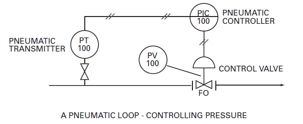

[Зміст](README.md)

# Вступ

У промисловості існує три види процесів: неперервні, порційні та дискретне виробництво. Нижче подано короткий опис кожного типу:

- **Безперервний (Continuous)** Матеріал подається в процес і видаляється з нього одночасно. Переробка нафти є хорошим прикладом. Приклади типових безперервних процесів: Виробництво пари, Хімічні реакції,  Розділення, Обробка відходів, Дистиляція
- **Порційне (Batch).** Матеріал додається до резервуару чи іншого обладнання, відбувається певний процес, а змінений матеріал підлягає наступному етапу. Для виготовлення готового продукту може знадобитися багато повторів вищезазначених кроків, можливо, з використанням іншого обладнання. Пиво, наприклад, виготовляється способом порційного виробництва. 
- **Дискретне виробництво (Discrete).** Окремі компоненти, деталі або підвузли виготовляються або збираються для виробництва продукту. Прикладом є автомобілебудування.

Сектор переробної промисловості світової економіки складається з заводів, які працюють безперервно, і тих, які працюють у режимі порційного виробництва. Оскільки існує подібність у конструкції та роботі, заводи, які працюють безперервно, і ті, що працюють у режимі порційного виробництва, зазвичай об’єднуються під маркою «переробні промисловості» (process industries). Усі документи, які розглядаються в цій книзі, є звичайними для переробної промисловості.

Характер документації, яку ми використовуємо для опису сучасних контрольно-вимірювальних приладів і систем керування, розвивався протягом багатьох років, щоб підтримувати основну мету – ефективно та чітко повідомити навченому технарю основні моменти про конкретний процес. У міру того як процеси, якими ми займаємося, стають складнішими, ускладнюється і документація. Старовинний простий процес порційного типу, такий як виготовлення розсолу, можна було б чітко описати без схематичного рисунку, просто показавши кілька труб, резервуар і кілька ручних клапанів.
Сучасний безперервний процес, який працює двадцять чотири години на добу, сім днів на тиждень, із спеціальними вимогами до трубопроводів і клапанів, багатьма взаємопов’язаними засобами керування, численними точками моніторингу, вимогами до керування оператора, насосами, моторизованим обладнанням і системами безпеки, звичайно, вимагатиме більш складна система документації.

Оскільки кількість інформації, необхідної для означення процесу, збільшується, документи повинні ставати більш спеціалізованими, що дозволяє ефективно групувати деталі. Група проектантів з трубопроводів розробляє та підтримує свої списки труб; група проектування контрольно-вимірювальних приладів і засобів керування робить те саме зі своїми списками приладів. Хоча обидва списки певним простим способом пов’язані з загальним документом, самі списки надзвичайно детальні та довгі, містять інформацію, яка є важливою для спеціалістів, але не обов’язково важливою для інших.

Загальна інформація, яка означає процес, підтримується у формі, яка є одночасно простою та легкою для читання, але без усієї детальної інформації, необхідної спеціалісту. Прикладом загального документа є креслення трубопроводів і приладів (P&ID). Загальний документ служить ключем до більш детальних документів. Представлення та зберігання інформації стало більш ефективним. Загальна картина та спільна інформація, корисна для більшості людей, містяться в загальному документі. У детальному документі зберігається інформація, яка буде використана фахівцями для конкретизації проекту.

Документи, що описують сучасні промислові процеси, як і більшість технічних робіт, припускають певний рівень розуміння з боку читача. У документах використовується схематична «мова», заснована на символах, яка може нагадувати ієрогліфи майя для тих, хто не знайомий з номенклатурою процесу. Однак символи містять велику кількість інформації для тих, хто навчений їх перекладати. Традиція та стандарти також регулюють представлення цих символів на документі. Дійсно, саме існування деяких типів документів може здатися дивним, якщо спостерігач не розуміє їх призначеної функції. Як і будь-яка сучасна сучасна мова, символи та їх застосування постійно вдосконалюються, щоб відповідати новим викликам.

Ця книга навчить вас читати, розуміти та застосовувати символи та документи, які використовуються для означення сучасних промислових контрольно-вимірювальних приладів і систем керування. Для більш досвідчених професіоналів ми запропонуємо ознайомлення з ефективним використанням символів і документів, включаючи пояснення щодо їх використання. Ми представимо варіанти використання символів і документів, які ми бачили, і вкажемо на деякі підводні камені, яких слід уникати. Щоб краще зрозуміти сучасну проектну документацію, ми розглянемо, як і коли розробляються документи, хто їх розробляє, навіщо вони розробляються та як використовуються. Типи документів, які ми будемо обговорювати, включають:

- Технологічні схеми (Process Flow Diagrams), 
- Схеми технологічних трубопровідів та приладів (Piping and Instrumentation
  Drawings), 
- відомість засобів КВПіА (Instrument Lists), 
- форми специфікацій (Specification Forms), 
- логічні діаграми (Logic Diagrams), 
- деталі встановлення (Installation Details), 
- плани розміщення (Location Plans) 
- діаграми контурів (Loop Diagrams). 

Ми також досліджуватимемо, як ці документи можна використати з максимальною користю під час будівництва та експлуатації заводу.

Автори є рішучими прихильниками дотримання та використання стандартів, у тому числі галузевих стандартів, розроблених ISA — The Instrumentation, Systems, and Automation Society та іншими організаціями, а також стандартів заводів, розроблених спеціально для конкретного місця розташування. Однак ми не є фанатиками. Документація має задовольняти потреби, а не надавати інформацію просто тому, що ви вважаєте, що це вимагається якимось стандартом. Тим не менш, ви повинні розуміти, що стандарти майже завжди набагато «досвідченіші», ніж ви. Вони були розроблені, переглянуті та перевірені часом людьми з усіх галузей і кожної функції в цих галузях. Ви не повинні відхилятися від стандартів, якщо ви ретельно не розглянули всі наслідки цього. Наприклад, ми знаємо одну компанію, яка не використовує діаграми контурів (Loop Diagrams). Вони змогли задовольнити свої вимоги до технічного обслуговування, конфігурації, будівництва та закупівлі за допомогою дуже творчого використання баз даних приладів. Вони переглянули запропонований набір документів з усіма зацікавленими сторонами, включаючи своїх підрядників з проектування та будівництва та власне керівництво, перш ніж взяти на себе зобов’язання використовувати бази даних замість циклічних діаграм.

Документи процесу мають «працювати», щоб бути ефективними. Проектувальник заводу та експлуатаційний персонал, який використовує їх, повинні бути впевнені, що відображена інформація є точною та актуальною. Об’єкт може працювати небезпечно, якщо немає культури чи системи для оновлення документів. Якщо ця труба більше не з’єднується з цим обладнанням, чи пов’язаний запобіжний клапан все ще захищає те, що він повинен? Чи можуть елементи керування підтримувати температуру, якщо охолоджуючої рідини недостатньо через незадокументовані з’єднання, які призвели до виснаження доступної охолоджувальної води? Якщо документи неактуальні, майбутні зміни у вашому закладі будуть надзвичайно дорогими. Будь-який авторитетний підрядник перевірить поточний стан процесу перед внесенням змін. Ефективні зміни повинні бути зроблені на основі того, що ви маєте, а не того, що ви мали.

Галузеві стандарти, які ми обговорюємо в цій книзі, перевірені часом, і вони працюють. Ми пояснимо, як і чому вони працюють; від вас залежить, як застосувати ці знання. Звісно, документація, якою ви користуєтеся, та її зміст мають витримати перевірку «замовником». Вони повинні мати цінність для клієнта, і вони повинні бути корисними! Ідеально виконана діаграма контурів з усіма функціями, викладеними в ISA-5.4-1991, діаграми контурів приладів мало цінні, якщо їх ніхто не використовує. Ми також хочемо зазначити, що галузеві стандарти дозволяють вам вносити зміни у зміст документації відповідно до ваших конкретних вимог.

Цю книгу буде легко читати, з багатьма ілюстраціями та невеликою кількістю математики (і зовсім без обчислення!). Це буде цікаво інженерам і технікам не тільки в галузі промислової автоматизації, але й багатьох інших спеціальностей. Групи проектувальників КВПіА унікальні тим, що вони повинні координувати роботу всіх інших дисциплін на заводі під час проектування та експлуатації. У цій книзі пояснюється їхня різноманітна, всеосяжна мова. Це також буде корисним для експлуатаційного, обслуговуючого та допоміжного персоналу, який зацікавлений у «результатах» проектування установки – документації, яку зазвичай розробляє група проектування приладів і засобів керування.

Фаза інженерного проектування типової установки безперервного процесу може тривати від кількох місяців до кількох років. Збудований завод може працювати тридцять і більше років. Здоровий глузд підказує, що документи, розроблені на етапі проектування, повинні мати довготривалу цінність протягом усього терміну експлуатації підприємства.

Мета книги — надати читачеві достатньо інформації, щоб він міг зрозуміти документи та інформацію в них і ефективно використовувати це розуміння. Є надія, що ці знання будуть корисними не лише на існуючих заводах, а й як основа для перегляду та перевірки реальності майбутніх пакетів інженерних проектів. Також — сміємо сказати — ми сподіваємося заохотити ефективні дискусії між командою проектувальників, будівельним підрядником і групою технічного обслуговування, які дозволять їм узгодити набір документації, який найбільш ефективно відповідатиме всім їхнім вимогам.

Документи, які ми розглянемо в цій книзі, були розроблені з часом, щоб дуже ефективно відповідати потребам будівництва заводу. Оскільки персонал із більшим технічним досвідом уважно вивчатиме ці документи, можливо, вони зможуть їх покращити.

Ми розглянемо інструменти та контрольні документи двома способами. По-перше, ми розглянемо досить детально, щоб допомогти читачеві зрозуміти форму та функцію; тоді ми розглянемо заявку. Для деяких із цих документів немає опублікованих галузевих стандартів, які б інформували нас про їх зміст. Тому ми опишемо те, що, на нашу думку, є середнім шляхом — який приймуть багато, але, реалістично, такий, який не всі можуть прийняти в усіх деталях.

Можливо, ви чули, як розробники стандартів кажуть «мій шлях або шосе» або «є два способи зробити що-небудь: мій і неправильний». Вони дотримуються такого підходу через необхідність, оскільки безглуздий галузевий стандарт не є «стандартом»; воно має невелику цінність. Ми не будемо такими догматичними, оскільки ми хочемо, щоб ви розробили набір документації, який підходить для вашого об’єкта – такий, який відповідає вашим конкретним вимогам. Ми вважаємо, що стандарти заводської документації для вашого об’єкта доцільно розробити демократичним шляхом – із залученням усіх сторін, які зацікавлені в продукті, а також тих, які дотримуються галузевих стандартів. Однак ми закликаємо вас дуже ретельно контролювати зміни цього заводського стандарту, коли більшість ваших користувачів визначать ваші вимоги до документації. Жорсткий контроль є критичним для ефективної системи. вільно розвиватися; діють жорстко.

Другий спосіб, яким ми розглянемо типовий набір документів, полягає у використанні дуже простого змодельованого проекту для дотримання послідовності, за якою розробляються документи. У їх підготовці є логічна послідовність. Часто один тип документа має бути по суті завершеним, перш ніж можна буде розпочати наступний тип документа. Якщо документи розроблені не в правильній послідовності, робочі години будуть витрачені даремно, оскільки вам доведеться переглядати документ пізніше, щоб включити відсутню інформацію. Хоча послідовність є більш важливою для тих, хто зацікавлений у процесі проектування, для експлуатаційного персоналу корисно зрозуміти, як розробляються набори документів. Якщо це зроблено без будь-якої іншої причини, це розуміння допоможе гарантувати, що оперативний персонал змінюватиме всю інформацію в усіх відповідних документах, коли вони вносять зміни.

З нашого досвіду існує багато різних способів означення приладів і систем керування. Усі заводи, які використовували суттєво різні пакети документів, зрештою були побудовані та експлуатувалися. Звичайно, деякі проекти йшли гладко, а в інших, здавалося, щохвилини розвивалася криза. Деякі було легше побудувати, а деякі займали більше часу, але зрештою всі заводи були завершені. Іноді вміст набору документів безпосередньо впливав на те, наскільки успішно працював проект, а безперебійний проект є менш дорогим проектом.

Використання комп’ютерів у інженерному проектуванні пропонує нові способи означення роботи, яку потрібно виконати. Дійсно, нові способи, доступні зараз із пов’язаними документами, пропонують привабливу ефективність і точність, що може змусити деяких переглянути вміст набору документів стандартного пакету проекту. Вісім типів документів, перерахованих нижче — детально розглянутих у цій книзі — успішно використовувалися як «набір» документів протягом багатьох років.

## Технологічна схема (Process Flow Diagram)

Технологічна схема (PFD) схематично означує технологічний процес. Він показує, що і скільки кожного продукту буде виготовляти завод; кількість і види сировини, необхідної для виготовлення продукції; які побічні продукти виробляються; критичні умови процесу — тиск, температура та потік, необхідні для виготовлення продукту; необхідні основні труби та обладнання.
Приклад дуже простого PFD показаний на рис.

## Схеми технологічних трубопровідів та приладів (Piping and Instrumentation Drawing)

Схеми технологічних трубопровідів та приладів (P&ID) — це загальний проектний документ для технологічного підприємства. Він означує – за допомогою символів і словесних описів – обладнання, трубопроводи, прилади та систему керування. Це також ключ до інших документів. Наприклад, номери тегів приладів показані на P&ID. Цей номер тегу є ключем до пошуку додаткової інформації про цей пристрій у багатьох інших документах. Те саме стосується номерів лінії та обладнання. P&ID розглядаються в [розділі 2](2.md). 

## Перелік засобів КВПіА (Instrument List)

Перелік засобів КВПіА — це буквено-цифровий список даних, пов’язаних із компонентами контрольно-вимірювальних приладів і систем управління об’єкта та, можливо, функціями. Списки приладів організовані за допомогою буквено-цифрових номерів тегів приладів і пристроїв системи керування. Вони посилаються на різноманітні документи, які містять інформацію, необхідну для означення загальної інсталяції.
Списки інструментів розглядаються [в розділі 3](3.md).

## Технічні специфікації (Specification Forms)

Технічні специфікації або аркуші даних приладу означують кожен пристрій контрольно-вимірювального приладу та системи керування з пронумерованим тегом із достатньою кількістю деталей, щоб постачальник міг запропонувати пропозицію та, зрештою, надати пристрій. Для типової форми специфікації див. [розділ 4](4.md),

## Логічні діаграми (Logic Diagrams)

Логічні схеми — це схеми, які використовуються для проектування та означення вмикання-вимкнення або послідовної частини установки безперервного процесу. Типову логічну схему див. у [розділі 6](6.md), малюнок 6-5 (стор. 101).

## Діаграми контурів (Loop Diagrams)

Схема контурів — це схематичне зображення одного контуру керування (чутливого елемента, компонента керування та кінцевого елемента). Він зображує технологічні з’єднання та з’єднання компонентів із джерелами живлення та системами передачі (пневматичними, електронними чи цифровими). Типову контурну схему див. у [розділі 7](7.md), 

## Креслення встановлення (Installation Details)

Креслення встановлення використовуються, щоб показати, як компоненти контрольно-вимірювальних приладів і системи керування підключені та взаємопов’язані з процесом. Вони надають методи, які завод використовує для підтримки пристроїв, і конкретні вимоги для правильного підключення до процесу. Деталі встановлення описані в [Розділі 8](8.md).

## Плани розташування (Location Plans)

Плани розміщення — це ортографічні види заводу, накреслені в масштабі, які показують розташування приладів і компонентів системи керування. Вони часто показують інше обладнання системи керування, включаючи розподільні панелі, термінальні стійки, локальні панелі керування, розподільні коробки, інструментальні стійки та, можливо, панелі живлення та центри керування двигунами. Плани розміщення обговорюються в [Розділі 8](8.md).

## Послідовність розроблення

Ці вісім типів документів розробляються послідовно в міру просування проекту та отримання відповідної інформації. Нижче рисунок ілюструє типову послідовну розробку документа.

Схема технологічного процесу (PFD) є відправною точкою для проектування будь-якої технологічної установки. Це макроскопічне, схематичне зображення основних характеристик процесу або об’єкта; це «розмовний документ» для менеджерів, планувальників і команди проектувальників процесів. Група проектування контрольно-вимірювальних приладів і засобів керування мало залучена до розробки PFD через його макроскопічну природу. PFD використовуються для розроблення обсягу проекту; їх також можна використовувати (і підтримувати) для документування загальних балансів продукту та корисності. Для будь-якого конкретного проекту PFD зазвичай видається з метою збору коментарів і перегляду. Після того, як питання та роз’яснення вирішено, загальний обсяг по суті встановлюється, а потім запускаються P&ID разом із процесами детального визначення обсягу, оцінки та проектування.

Розробка P&ID є дуже інтерактивним процесом. Фахівці, що проектують резервуари, механічне обладнання, трубопроводи, технологічні, електричні, контрольно-вимірювальні системи та системи керування, вносять свій внесок у їх розробку. Кожна група спеціалістів розміщує інформацію на кресленні стандартизованим способом, додаючи деталі, коли вони стають доступними. 

Більш детально ми обговоримо символи та номери тегів у [розділі 2](2.md). Коротко кажучи, символ означує тип приладу, а номер тегу унікально ідентифікує цей конкретний прилад. Номер тегу складається з кількох літер, які описують пристрій, а також комбінації цифр і літер для унікальної ідентифікації. Див. рис I-3 для прикладу приладу, який може бути вказаний на P&ID. Коло показує прилад, встановлений на трубі. «PI» далі описує пристрій як індикатор тиску або манометр. У цьому випадку використовується порядкова нумерація. Оскільки манометр є першим у своєму типі в P&ID, використовується номер «контуру» «1». Наступний манометр у цій системі нумерації матиме номер тегу «PI-2».

Рис. I-3: Монтований на місці манометр

Деякі номери тегів набагато складніші. Див. рис. I-4 для дуже складного номера тегу: `1A-AA-PT-100-A`. `1A-AA` — це префікс, який позначає означення технологічного вузла (тобто частини або одиниці установки) під назвою `1A` та позначення системи (тобто технологічної системи в межах установки) під назвою `AA`. `PT-100` позначає послідовність перетворювача тиску під номером `100`. Нарешті, суфікс `A` використовується, якщо є два ідентичні прилади в межах порядкового номера `100` — наприклад, коли є інший датчик тиску з номером `100` у технологічному вузлі `1A`, система `AA`. У цьому випадку другий датчик тиску матиме номер тегу `1A-AA-PT-100-B`. 

Рисунок I-4: Комплексний номер тегу

Персонал групи проектування контрольно-вимірювальних приладів і засобів керування розміщує номери тегів на P&ID і вносить їх до переліку засобів КВПіА або бази даних для відстеження. Це робиться з метою контролю, тому що у великому проекті може бути багато-багато P&ID – можливо, сто або близько того – плюс тисячі пристроїв з тегами. Оскільки кожен пристрій виконує певну функцію, стан усіх пристроїв необхідно відстежувати, доки вони не будуть встановлені, їхня робота перевірена, а установка буде прийнята власником.

Після того, як номери тегів внесено до переліку засобів КВПіА, група проектування приладів і засобів керування починає розробляти технічні специфікації для кожного елемента, позначеного тегом. Розробка цих технічних специфікацій є основною частиною зусиль групи проектування приладів і систем керування. Технічні специфікації повинні бути заповнені, щоб забезпечити тендерні пропозиції від відповідних постачальників приладів, придбати предмети в успішного учасника та створити постійний запис про те, що було придбано.

У міру розробки проекту стане очевидною потреба у означенні вмикання-вимкнення або дискретного керування. Наприклад, на проекті целюлозно-паперового комбінату може знадобитися ізолювати випускний отвір насоса, щоб запобігти зневодненню маси целюлози в трубі, якщо насос вимкнеться. Для забезпечення ізоляції додається запірний клапан, але необхідно задокументувати, чому цей пристрій було додано та що він має робити. Оскільки це керування типу увімкнення-вимкнення впливає на інші групи, важливо означити його якомога раніше та якомога точніше. Один із способів зробити це – використовувати логічну діаграму.

Група контрольно-вимірювальних приладів і засобів керування розробляє деталі встановлення на основі конкретних вимог до пристроїв, які вона вказала, а також будь-яких вимог власника. Вимоги до встановлення, необхідні для якісного вимірювання, встановлюються постачальником приладу, різними промисловими групами та самими власниками. Потім ці вимоги документуються в Креслення встановлення. Ці деталі можуть бути розроблені для проекту, для конкретного майданчику або, можливо, юридичною особою власника.

У той же час макет заводу також прогресував, тому група проектування контрольно-вимірювальних приладів і засобів керування може почати розміщувати прилади на Планах розташування. Ці креслення найчастіше використовуються, щоб допомогти будівельному підряднику знайти прилади, але вони також можуть бути корисними для експлуатації та технічного обслуговування, оскільки вони показують, де встановлено прилади на завершеному заводі.

Нарешті, коли всі деталі з’єднання відомі, а електричний проект просунувся до точки з’єднання проводів, група проектування контрольно-вимірювальних приладів і засобів керування може розробити діаграми контурів. Ці діаграми показують всю інформацію, необхідну для встановлення та перевірки контуру. Оскільки ці діаграми можуть повторювати інформацію про P&ID та розробленої групою проектувальників електричної частини, надзвичайно важливо, щоб група контрольно-вимірювальних приладів і засобів керування тісно координувала роботу з іншими дисциплінами.

## Резюме

У цьому вступі ми коротко описали документи, які входять до комплекту результатів контрольно-вимірювальних приладів і систем керування, і послідовність їх розробки. У наступних розділах ми додамо більше деталей, щоб описати результати, як їх можна ефективно використовувати та як галузеві стандарти можуть допомогти в розумінні.

Багато ілюстрацій у цій книзі спочатку були розроблені для різних навчальних курсів ISA, особливо ISA-FG-15 Розробка та застосування стандартної документації з приладів і контролю, версія 2.2, стандарти ISA та інші публікації ISA. Походження деяких ілюстрацій зазначено поруч із рисунком. Повні назви оригінальних документів наведено в Додатку Б, Скорочення. Деякі ілюстрації були переглянуті для ясності та послідовності.

[-->>](1.md)