[<- До підрозділу](README.md)

# Практичне заняття Citect: Тривоги та події

**Тривалість**: 4 акад. години (4 пари).

**Мета:** ознайомлення з принципами розробки тривогової підсистеми, роботи з пристроями, шрифтами  

**Завдання для виконання роботи**

**Цілі.** 

1. Опанувати основні діяльності з налаштування тривог Citect та їх відображення.

2. Опанувати основні діяльності з налаштування пристрїв Citect. 


**Лабораторна установка**

- Апаратне забезпечення: ПК. 

- Програмне забезпечення: UNITY PRO V>=7.0 або Control Expert,  Citect 2016 (або новіше). **Увага! Графічна система, починаючи з Citect 2020 повністю змінена. Тому даний лабораторний практикум не призначений для версій Citect, новіших за Citect 2018R2.** 


**Примітки щодо відео: представлені в роботі відеоматеріали є студентською інтерпретацією лабораторної роботи, носять ознайомчий характер і можуть містити помилки!** 

## Порядок виконання роботи

## 1.Ознайомлення з додатками 

- [ ] Ознайомтеся з усіма додатками до лабораторної роботи:
- [Додаток 4.1.Базові можливості налаштування тривогової підсистеми Citect](lab4a_1.md)
- [Додаток 4.2.Пристрої системного введення/виведення в Citect та ведення журналу користувацьких подій ](lab4a_2.md)
- [Додаток 4.5.Робота з шрифтами](lab4a_5.md)

## 2. Підготовка імітатору на ПЛК

- [ ] Завантажте в імітатор контролера підготовлений проект Unity PRO, що описаний у файлі [Завдання](../basedesign/task.md), як це робили на попередній роботі. Якщо проект був збережений як `STU`, варто відкрити його а не файл експорту. 
- [ ] Запустіть на виконання проект в Unity PRO. Перевірте його працездатність.

## 3. Відновлення власного проекту та перевірка його роботи

- [ ] Запустіть середовище розробки Citect. 

- [ ] Якщо Ваш минулий проект не завантажено або змінено кимось іншим, зробіть відновлення свого проекту з резервної копії, збереженої минулої лабораторної роботи. 
- [ ] За необхідності, зробіть компіляцію проекту. 
- [ ] Запустіть свій проект на виконання і перевірте його працездатність, наприклад, змінюючи одну зі мінних у Citect і перевіряючи ці зміни в імітаторі ПЛК.   

## 4. Створення шрифтів

У цьому пункті необхідно створити шрифти для відображення тривог різних категорій різним кольором та величини. 

- [ ] Уважно прочитайте [Додаток 4.5.Робота з шрифтами](lab4a_5.md). 
- [ ] Створіть шрифти для тривог категорії 1 та категорії 2 відповідно до вказаних полів в таблиці 4.2. Не вказані поля залиште порожніми. Можете скопіювати поля таблиці для пришвидшення дії. 

Таб.4.2.Налаштування шрифтів.

| **Назва**        | **Тип шрифта** | **Розмір** | **Колір тексту** | **Миготіння тексту** |
| ---------------- | -------------- | ---------- | ---------------- | -------------------- |
| AlmUnAckON_cat1  | Arial          | -10        | LIGHT_RED        | RED                  |
| AlmUnAckOFF_cat1 | Arial          | -10        | LIGHT_RED        | DARK_GREY            |
| AlmAckON_cat1    | Arial          | -10        | LIGHT_RED        | LIGHT_RED            |
| AlmAckOFF_cat1   | Arial          | -10        | BLACK            | BLACK                |
| AlmUnAckON_cat2  | Arial          | -10        | 0x00ff8000       | RED                  |
| AlmUnAckOFF_cat2 | Arial          | -10        | 0x00ff8000       | DARK_GREY            |
| AlmAckON_cat2    | Arial          | -10        | 0x00ff8000       | 0x00ff8000           |
| AlmAckOFF_cat2   | Arial          | -10        | BLACK            | BLACK                |

- [ ] Змініть налаштування шрифтів для системної категорії. А саме змініть колір тексту для усіх шрифтів, що закінчуються на  `_Set0` на чорний.  

- [ ] Збережіть зміни.

<iframe width="560" height="315" src="https://www.youtube.com/embed/Dva4kO0qaFk" title="YouTube video player" frameborder="0" allow="accelerometer; autoplay; clipboard-write; encrypted-media; gyroscope; picture-in-picture" allowfullscreen></iframe>

## 5. Налаштування категорій тривог

- [ ] Перевірте чи створений тривоговий сервер (Розділ "Топология"). Якщо немає – створіть його з іменем "AlarmServer1" (Розділ "Топология"->"Правка"->"Серевры алармов").
- [ ]  Перейдіть в Citect Studio на закладку налаштувань тривог (Настройка->Алармы) 

- [ ] Створіть або модифікуйте категорії з номерами 1 та 2 відповідно до вказаних полів в таблиці 4.3. Не вказані поля залиште порожніми. 

Таб.4.3.Налаштування категорій.

| Номер | Шрифт НЕКВИТ. ВКЛ.алармов | Шрифт НЕКВИТ. ОТКЛ.алармов | Шрифт КВИТ. ВКЛ. | Шрифт КВИТ. ОТКЛ. | **Коментар**              |
| ----- | ------------------------- | -------------------------- | ---------------- | ----------------- | ------------------------- |
| 1     | AlmUnAckON_cat1           | AlmUnAckOFF_cat1           | AlmAckON_cat1    | AlmAckOFF_cat1    | Категорія для аварій      |
| 2     | AlmUnAckON_cat2           | AlmUnAckOFF_cat2           | AlmAckON_cat2    | AlmAckOFF_cat2    | Категорія для попереджень |

<iframe width="560" height="315" src="https://www.youtube.com/embed/dVeWAqgWoNk" title="YouTube video player" frameborder="0" allow="accelerometer; autoplay; clipboard-write; encrypted-media; gyroscope; picture-in-picture" allowfullscreen></iframe>

## 6. Створення та перевірка роботи дискретної тривоги D1_LVS1_ALCLS

- [ ] Уважно прочитайте

-  [Додаток 4.1.Базові можливості налаштування тривогової підсистеми Citect](lab4a_1.md) та
-  [Додаток 4.2.Пристрої системного введення/виведення в Citect та ведення журналу користувацьких подій ](lab4a_2.md)

- [ ] Перейдіть у "Модель системы" -> "Алармы", створіть дискретну тривогу `D1_LVS1_ALCLS`, відповідно до рис.4.8. 

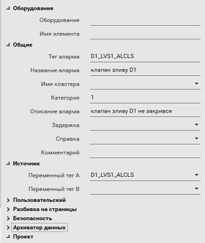

Рис.4.8. Налаштування дискретної тривоги

- [ ] Після створення скомпілюйте проект. Якщо середовище виконання в роботі, зупиніть його, так як зміна налаштувань в тривогах передбачає перезавантаження системи. Запустіть середовище виконання. 
- [ ] Змініть значення `DIFRC[10]` в `1` на сторінці змінних або в операторському екрані UnityPRO. 

Це зафорсує значення змінної `D1_LVS1_CLS`, щоб вона не змінювалася з програми імітації. Таким чином змінну можна буде змінювати вручну. 

- [ ] Змініть значення `D1_LVS1_CLS` в `0` на сторінці змінних або в операторському екрані UnityPRO
- [ ] Якщо на клапан діє команда закрити, виникне тривога. Проконтролюйте що її відображення на тривоговому банері відповідає сконфігурованій. Вона повинна моргати.
- [ ] Зареєструйтеся в системі. Зробіть підтвердження тривоги через контекстне меню. Стан тривоги повинен змінитися на підтверджений, вид повинен бути неморгаючим. 
- [ ] Зніміть форсування, виставляючи `DIFRC[10]` в `0`. Тривога повинна зникнути.      
- [ ] Після усіх змін подивіться журнал для цієї тривоги на сторінці SOE. 

<iframe width="560" height="315" src="https://www.youtube.com/embed/lTIT7RUahQ8" title="YouTube video player" frameborder="0" allow="accelerometer; autoplay; clipboard-write; encrypted-media; gyroscope; picture-in-picture" allowfullscreen></iframe>

## 7. Створення та перевірка роботи інших дискретних тривог

- [ ] Уважно прочитайте вимоги до реалізації підсистеми тривог та подій, що наведені в п.7 [Завдання](../basedesign/task.md) таблицю 13.
- [ ] Використовуючи вимоги в таблиці 13 реалізуйте у проекті усі інші дискретні тривоги. Зверніть увагу, що категорія "Аварія" є в проекті категорією 1.

Для пришвидшення роботи рекомендується використовувати копіювання з файлу завдання та вставлення, а також при необхідності сторонні табличні редактори.

- [ ] Перевірте роботу в Runtime на одній з довільно вибраних тривог, форсуючи відповідну змінну через `DIFRC`.

<iframe width="560" height="315" src="https://www.youtube.com/embed/6pDFLuHAeBE" title="YouTube video player" frameborder="0" allow="accelerometer; autoplay; clipboard-write; encrypted-media; gyroscope; picture-in-picture" allowfullscreen></iframe>

## 8. Створення та перевірка аналогової тривоги

- [ ] Створіть аларм тег для аналогової тривоги `HEA_TT1_WRN`, з налаштуваннями відповідно до рис.4.9. 

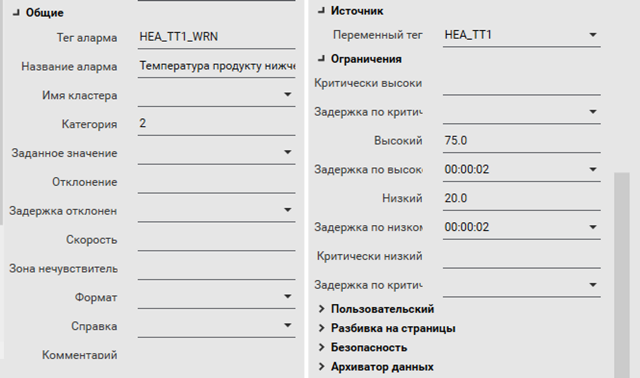

Рис.4.9 Налаштування аналогової тривоги

Ця тривога буде спрацьовувати, коли температура вийшла за межі попередження.

- [ ] Створіть аларм тег `HEA_TT1_WRN_DEA`, який буде відслідковувати розузгодження між дійсним та аналоговим значенням (рис.4.10).

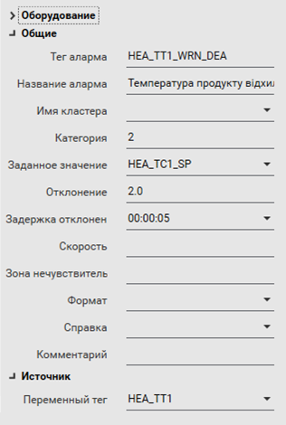

Рис.4.10 Налаштування аналогової тривоги відхилення

- [ ] Cкомпілюйте проект та запустіть його на  виконання, попередньо закривши Runtime попередньої версії проекту.
- [ ] Змініть значення `AIFRC[4]=1` на сторінці Startup або в операторському екрані CTRL1 UnityPRO.
- [ ] Добийтеся спрацювання обидвох тривог. Зробіть їх підтвердження.
- [ ] Після усіх змін подивіться журнал для цієї тривоги на сторінці SOE. 

<iframe width="560" height="315" src="https://www.youtube.com/embed/9-mDJvwrCQg" title="YouTube video player" frameborder="0" allow="accelerometer; autoplay; clipboard-write; encrypted-media; gyroscope; picture-in-picture" allowfullscreen></iframe>

## 9. Створення та перевірка усіх аналогових тривог

- [ ] Уважно прочитайте вимоги до реалізації підсистеми тривог та подій, що наведені в п.7 [Завдання](../basedesign/task.md) таблицю 12.
- [ ] Використовуючи вимоги в таблиці 12 реалізуйте у проекті усі інші аналогові тривоги. Зверніть увагу, що категорія "Попередження" є в проекті категорією 2. 

Для коректного виконання наступних пунктів назви тегів алармів мають називатися як назви змінних з добавленням суфіксу як показано в таб.4.4.

Таб.4.4. Найменування аналогових тривог

| Назва змінної в ПЛК | Опис                                                     | Назва тега аларма |
| ------------------- | -------------------------------------------------------- | ----------------- |
| HEA_TT1             | Т продукту на виході підігрівача відхилення від заданого | HEA_TT1_WRN_DEA   |
| HEA_TT1             | Т продукту на виході підігрівача попередження            | HEA_TT1_WRN       |
| HEA_TT1             | Т продукту на виході підігрівача аварія                  | HEA_TT1_ALM       |
| HEA_TT2             | Т гарячої води на виході підігрівача попередження        | HEA_TT2_WRN       |
| HEA_TT2             | Т гарячої води на виході підігрівача аварія              | HEA_TT2_ALM       |

- [ ] Перевірте роботу в Runtime на одній з довільно вибраних тривог, форсуючи відповідну змінну через `AIFRC`.

<iframe width="560" height="315" src="https://www.youtube.com/embed/CxKU9iVlTxs" title="YouTube video player" frameborder="0" allow="accelerometer; autoplay; clipboard-write; encrypted-media; gyroscope; picture-in-picture" allowfullscreen></iframe>

## 10. Створення символів для зображення тривог

У даному пункті необхідно створити два символи для відображення тривог рівня "аварія" та "попередження".

- [ ] У редакторі графіки створіть новий символ "Файл" -> "Новый символ".
- [ ] Включіть режим прив'язки до сітки.
- [ ] За допомогою елемента "полігон" та тексту створіть символи відображення тривоги рівня "Аварія" (рис.4.11). Для точного налаштування зображення трикутнику скористайтеся властивостями символу "Полігон".

  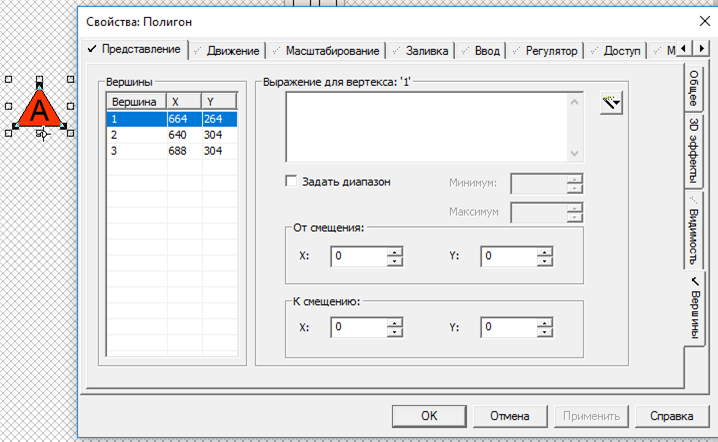

 Рис.4.11 Налаштування символу для зображення тривоги рівня "Аварія" 

- [ ] Збережіть символ під іменем "alert" у бібліотеці "alarms", яку попередньо створіть у вікні збереження.
- [ ] Аналогічним чином створіть та збережіть символ "warning" (рис.4.12) 

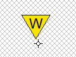

 Рис.4.12. Символ для зображення тривоги рівня "Попередження" 

<iframe width="560" height="315" src="https://www.youtube.com/embed/M3aLhbk-rRA" title="YouTube video player" frameborder="0" allow="accelerometer; autoplay; clipboard-write; encrypted-media; gyroscope; picture-in-picture" allowfullscreen></iframe>

## 11. Створення джину для відображення аналогового значення з відображенням стану тривоги

У цьому пункті необхідно створити джин, який би відображав значення числової змінної. 

- [ ] Створіть новий джин. 
- [ ] Збережіть джин з назвою `anaIND` у власній бібліотеці MyGeans. 

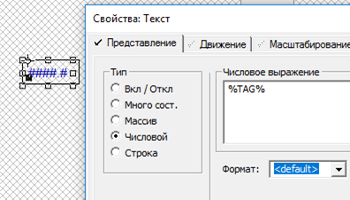

 Рис.4.13. Створення джина з налаштуваннями прив'язки до змінної.

- [ ] Вставте два джини `anaIND` у відповідні позиції на сторінці "Heat" та прив'яжіть їх до `HEAT_TT1` та `HEA_TT2`. 
- [ ] Збережіть та запустіть на виконання проект, проконтролюйте що значення відображаються коректно.
- [ ] Змініть джин `anaIND` щоб він показував наявність тривоги рівня аварія у вигляді символу та контуру (рис.4.14). 

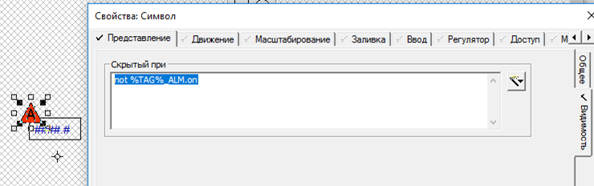

 Рис.4.14. Створення джина з налаштуваннями відображення символу тривоги "аварія"

У [додатку 4.1.1](lab4a_1.md) описано, що тривоги мають свої властивості, до яких можна звертатися як до тегів. У нашому прикладі використовується властивість `.On`. У результаті символ буде прихований тоді, коли аларм теги `HEA_TT101_AM.on`  або відповідно  `HEA_TT102_AM.on` будуть в `0`. Тобто символ буде прихований, коли тривоги не буде.

- [ ] Аналогічним чином зробіть налаштування символу попередження. Слід зауважити, що в даному проекті аналогові тривоги рівнів попередження та аварії для однієї і тієї ж змінної будуть відображатися одночасно. Щоб не відображалися обидва символи, необхідно зробити додаткову умову приховання  по або, що тривога рівня "аварія" працює (рис.4.15).   

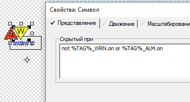

 Рис.4.15. Створення джина з налаштуваннями відображення символу тривоги "попередження"

- [ ] Збережіть джин, потім сторінку, де він використовувався (для оновлення), скомпілюйте проект та перевірте роботу джина.

<iframe width="560" height="315" src="https://www.youtube.com/embed/VT0Oz0yY2X4" title="YouTube video player" frameborder="0" allow="accelerometer; autoplay; clipboard-write; encrypted-media; gyroscope; picture-in-picture" allowfullscreen></iframe>

## 12. Зміна джину для відображення стану підтвердження

У цьому пункті для відображення стану тривог в джині зробимо обводку, яка буде змінювати колір.     

- [ ] У джині `anaIND` нарисуйте незаповнений прямокутник, який буде змінювати колір в залежності від стану активності `.on` та підтвердження `.ack` тривоги (рис.4.16).  

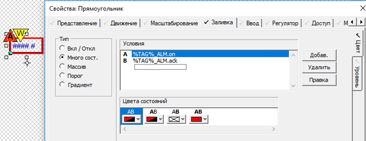

 Рис.4.16. Створення в джині контуру з налаштуваннями стану тривоги "аварія"

Зверніть увагу що в анімації застосовані кольори миготіння та прозорий.

- [ ] Зробіть також налаштування анімації щоб прямокутник змінював свою видимість в залежності від наявності активної та непідтвердженої тривоги. Це потрібно буде для того, щоб елемент не перекривав інші (рис.4.17).   

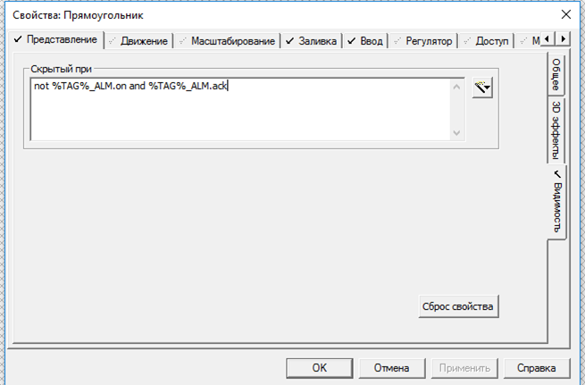

Рис.4.17. Налаштування в джині втрати видимості контуру при відсутності неактивних та непідтверджених тривог  

- [ ] Для відображення тривог рівня "попередження" аналогічним чином зробіть ще один прямокутник. Однак слід врахувати, що він повинен відображатися тільки коли немає непідтверджених або активних тривог рівня "аварія" (рис.4.18).

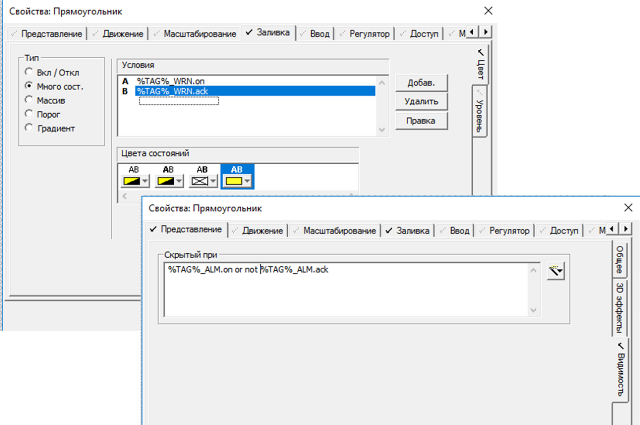

 Рис.4.18. Створення в джині контуру з налаштуваннями стану тривоги "попередження"

- [ ] Збережіть джин, потім сторінку, де він використовувався (для оновлення), скомпілюйте проект та перевірте роботу джина.

<iframe width="560" height="315" src="https://www.youtube.com/embed/D8Q6ski17QY" title="YouTube video player" frameborder="0" allow="accelerometer; autoplay; clipboard-write; encrypted-media; gyroscope; picture-in-picture" allowfullscreen></iframe>

## 13. Зміна джину для виконання підтвердження

У цьому пункті необхідно реалізувати підтвердження тривоги безпосередньо через джин, натискаючи подвійним кліком по зображенню контуру тривоги. 

У таблиці Д4.1.4 додатку Д4 вказано, що властивість `.Ack` тривоги доступна для запису. Це значить, що можна робити підтвердження тривоги, записуючи туди логічну 1. Використаємо цю властивість для підтвердження оператором тривоги натискаючи подвійним кліком по мигаючому контуру.

- [ ] Відкрийте редактор для джину `anaIND`. Використовуючи меню "Средства" -> "Перейти к объекту" відкрийте налаштування контуру для попередження. Налаштуйте дію при подвійному кліку (рис.4.19)     

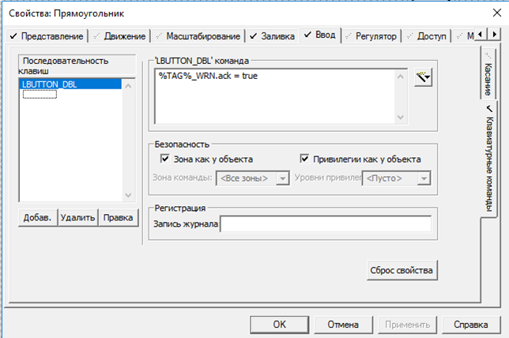

 Рис.4.19. Налаштування дії при подвійному кліку.

Зверніть увагу, що подвійний клік миші налаштовується в закладці "Клавиатурные команды" з використанням спеціальної клавіші.

- [ ] Аналогічним чином налаштуйте дію для підтвердження тривог рівня "аварія" для іншого контуру. 
- [ ] Збережіть джин, потім сторінку, де він використовувався (для оновлення), скомпілюйте проект та перевірте роботу джина.

<iframe width="560" height="315" src="https://www.youtube.com/embed/l8D3_zVeuA0" title="YouTube video player" frameborder="0" allow="accelerometer; autoplay; clipboard-write; encrypted-media; gyroscope; picture-in-picture" allowfullscreen></iframe>

## 14. Зміна джину для клапанів для відображення стану тривог

У цьому пункті необхідно реалізувати відображення стану тривог для клапанів.  Аналогічно попереднім пунктам необхідно реалізувати прямокутний контур для клапанів. Він повинен змінювати свій колір від стану тривог помилок відкриття та закриття:

- при будь якій непідтвердженій тривозі миготіти червоним;

- при наявності будь-якої підтвердженої тривоги світитися червоним. 

- [ ] Відкрийте джин `DValveH` і розмістіть у ньому прямокутний контур (незаповнений) в якості підкладки на задньому фоні клапана. Налаштуйте анімацію кольору, як це показано на рис.4.20.

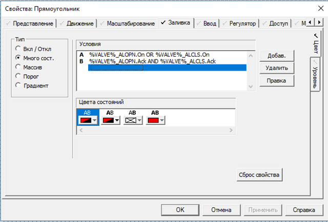

Рис.4.20. Налаштування прямокутного контуру 

- [ ] Аналогічним чином самостійно налаштуйте щоб відображався символ тривоги "Аварія".
- [ ] Збережіть джин, відкрийте та збережіть сторінку "Tanks". Запустіть Runtime. 
- [ ] Змініть значення `DIFRC[10]=1` на сторінці Startup або в операторському екрані UnityPRO. Змінюючи змінну `D1_LVS1_ALCLS` та команди квітування перевірте роботу анімації.  

<iframe width="560" height="315" src="https://www.youtube.com/embed/Xznj1tm-hIM" title="YouTube video player" frameborder="0" allow="accelerometer; autoplay; clipboard-write; encrypted-media; gyroscope; picture-in-picture" allowfullscreen></iframe>

## 15. Зміна спливаючих сторінок для клапанів для відображення стану тривог

У цьому пункті необхідно зробити, щоб при наявності тривог на сторінці з’являлися написи відповідних повідомлень помилок клапанів. Подвійний клік по напису повинен робити підтвердження.

- [ ] У редакторі графіки відкрийте сторінку `!ValveCtrl`.  
- [ ] Розмістіть на сторінці два елементи "текст" і налаштуйте їх властивості так, як показано на рис.4.21. Збережіть сторінку. 

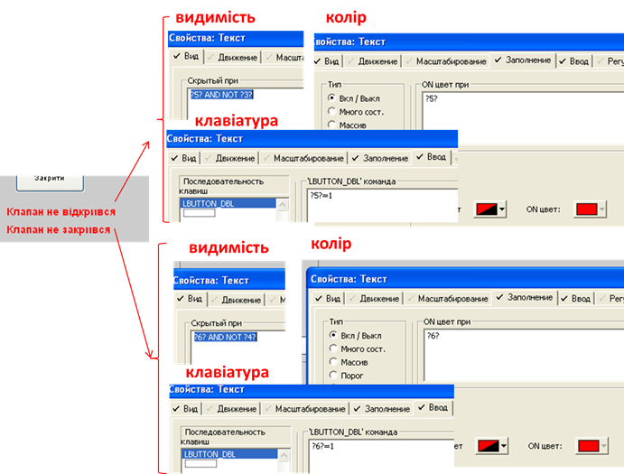

Рис.4.21 Налаштування відображення повідомлень помилок відкриття та закриття клапанів на вікні керування клапаном

- [ ] Модифікуйте джин `DValveH` так, щоб при натисканні на зображення ВМ додатково до команди та стану клапану передавалися стани тривог (див. рис.4.22). 

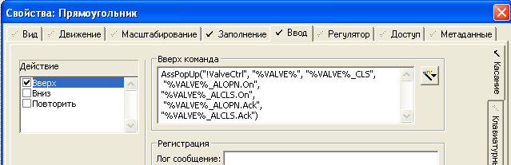

Рис.4.22 Налаштування відкриття сторінки з передачею змінних для асоціацій

- [ ] Збережіть джин. Збережіть сторінку "Tank". Скомпілюйте проект та перевірте функціональність змінених джинів.

<iframe width="560" height="315" src="https://www.youtube.com/embed/czbYZCAwsVc" title="YouTube video player" frameborder="0" allow="accelerometer; autoplay; clipboard-write; encrypted-media; gyroscope; picture-in-picture" allowfullscreen></iframe>

## 16. Створення журналу дій оператору

У цьому пункті необхідно зробити, щоб дії оператору записувалися в системний журнал

- [ ] Уважно ознайомтеся з [Додатком 4.2.Пристрої системного введення/виведення в Citect та ведення журналу користувацьких подій ](lab4a_2.md). 
- [ ] Створіть пристрій для ведення журналу подій з іменем `MsgLog` з налаштуваннями, як показано на рис.4.23.  

Для спрощення текстові налаштування виведені нижче:

`{DATE,8} {TIME,12} {UserName,5}^t{MSGLOG,20}^t{ARG1,6}`

`[DATA]:MsgLog.txt`

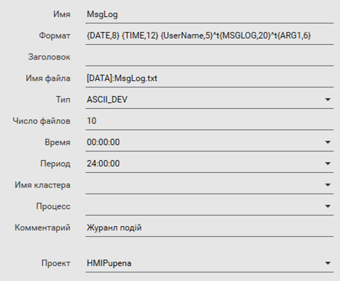

Рис.4.23. Налаштування пристрою

- [ ] На сторінці `Tanks` для елементу введення тексту, налаштуйте щоб дії оператора записувалися в `MsgLog`  та налаштуйте текст який буде вноситись при діях оператору (рис.4.24) 

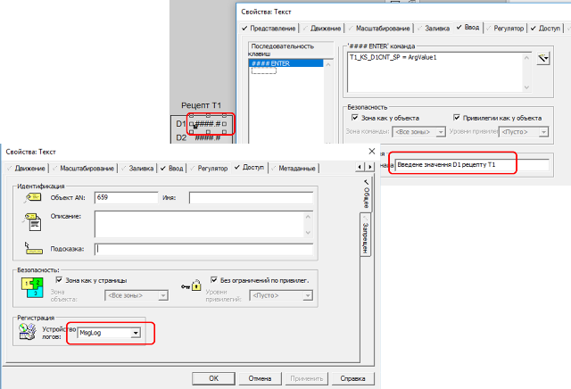

Рис.4.24. Налаштування елементу введення

- [ ] Збережіть сторінку. Скомпілюйте проект і перезапустіть середовище виконання. Змініть значення уставки D1. 
- [ ] Відкрийте папку з даними. Розміщення "Папка данных" вказується при налаштуванні середовища виконання - див рис.Д1.3. [додатку до Л.Р.1](lab1a1.md)  
- [ ] Знайдіть файл `MsgLog.txt` , відкрийте його в текстовому редакторі. Там повинен знаходитися запис про зміну значення.

<iframe width="560" height="315" src="https://www.youtube.com/embed/BACYkxwRrUI" title="YouTube video player" frameborder="0" allow="accelerometer; autoplay; clipboard-write; encrypted-media; gyroscope; picture-in-picture" allowfullscreen></iframe>

## 17. Створення сторінки відображення журналу оператора. 

У цьому пункті необхідно зробити сторінку з відображенням файлу журналу.

- [ ] Створіть нову сторінку на базі шаблону `file`.
- [ ] На сторінці зробіть подвійний клік і введіть в поле `file ` значення `[DATA]:MsgLog.txt` (рис.4.25)

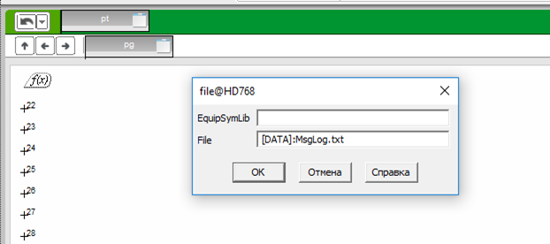

Рис.4.25. Налаштування шляху розміщення файлу для відображення

- [ ] Збережіть сторінку під іменем "LogView". Скомпілюйте проект, запустіть на виконання. 
- [ ] Відкрийте сторінку  "LogView", на ній повинен відображатися зміст файлу.

<iframe width="560" height="315" src="https://www.youtube.com/embed/D5X0C-h0tTs" title="YouTube video player" frameborder="0" allow="accelerometer; autoplay; clipboard-write; encrypted-media; gyroscope; picture-in-picture" allowfullscreen></iframe>

## 18. Створення фіксування подій через тривоги 

У цьому пункті необхідно реалізувати одну з вимог до реалізації підсистеми ведення журналу подій , що наведена в Таблиці 15 [Завдання](task.md), а саме фіксацію включення автоматичного режиму роботи контуру. Є кілька способів реалізації такого фіксування. Один з них - використання тривог з особливими налаштуваннями категорії. Саме цей спосіб використаємо у цьому пункті.

- [ ] Створіть шрифти для нової категорії тривог, з параметрами, які задані в таблиці 4.5.

Таблиця 4.5. Шрифти для 

| Назва            | Тип шрифта | Розмір | Колір тексту |
| ---------------- | ---------- | ------ | ------------ |
| AlmUnAckON_cat3  | Arial      | -10    | BLACK        |
| AlmUnAckOFF_cat3 | Arial      | -10    | BLACK        |
| AlmAckON_cat3    | Arial      | -10    | BLACK        |
| AlmAckOFF_cat3   | Arial      | -10    | BLACK        |

- [ ] Створіть категорію тривог з номером 3, яка призначена тільки для ведення журналу виникнення подій.     Налаштуйте категорію відповідно до рис.4.26

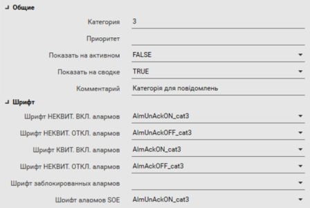

Рис.4.26 Налаштування категорії 3 для подій

- [ ] Створіть цифровий аларм з наступними налаштуваннями (рис.4.27)   

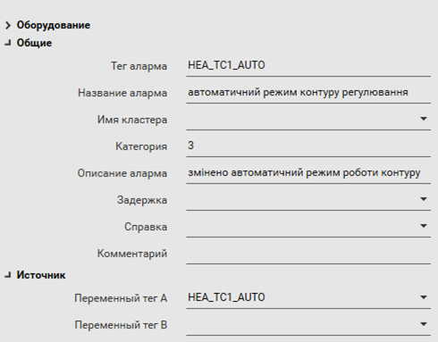

Рис.4.27 Налаштування тривоги для фіксації переключення контуру регулювання в автоматичний режим 

- [ ] Збережіть проект і зробіть компіляцію проекту. Перезапустіть середоивще виконання. 

- [ ] Перейдіть на сторінку `Heat` і декілька  раз змініть значення змінної `HEA_TC1_AUTO`.
- [ ] Відкрийте сторінку SOE ("Исторические события"). Знайдіть там відповідні події.

Зверніть увагу, що за замовченням сторінка журналу SOE не налаштована на оптимальне відображення. Тому варто налаштувати її.

- [ ] Використовуючи контекстне меню колонок приховайте на SOE неінформативні колонки і відобразіть ті, які Ви вважаєте найбільш інформативними. Збережіть вигляд за допомогою кнопки "Сохранить представления".

Зверніть увагу, що подія має два записи, оскільки тривога реєструється в системі при спрацюванні (on) та при відключенні (off). Це одна з причин, чому для журналювання подій краще скористаися іншим механізмом -  через спеціальну Cicode функцію.

<iframe width="560" height="315" src="https://www.youtube.com/embed/D9YQGj6hZvA" title="YouTube video player" frameborder="0" allow="accelerometer; autoplay; clipboard-write; encrypted-media; gyroscope; picture-in-picture" allowfullscreen></iframe>

## 19. Створення фіксування подій через Cicode функцію

У цьому пункті подія відкриття сторінки налаштування системи, що повинна фіксуватися в журналі SOE, записуватиметься через Cicode функцію `SOEEventAdd`. 

- [ ] Почитайте опис функції `SOEEventAdd` в Д.4.6.5.
- [ ] У редакторі графіки відкрийте сторінку `Heat`
- [ ] Через контекстне меню відкрийте налаштування сторінки. У налаштуванні події "При входе на страницу команда" впишіть наступну Cicode-команду:

```
SOEEventAdd(TimestampCurrent(), "Відкрита сторінка установки підігріву")
```

 Функція `TimestampCurrent()` повертає плинне значення відмітки часу. 

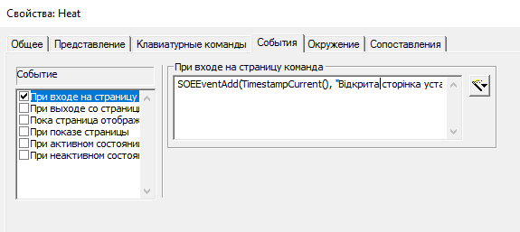

Рис.4.28 Налаштування реєстрації в журналі події відкриття сторінки підігріву.

- [ ] Збережіть сторінку, скомпілюйте проект та запустіть середовище виконання. 
- [ ] Відкрийте сторінку `Heat`. Після цього відкрийте сторінку SOE (Historical Events) знайдіть там відповідний запис. 

<iframe width="560" height="315" src="https://www.youtube.com/embed/5dfiHy9uKHw" title="YouTube video player" frameborder="0" allow="accelerometer; autoplay; clipboard-write; encrypted-media; gyroscope; picture-in-picture" allowfullscreen></iframe>

## 20. Створення резервної копії проекту

- [ ] Зробіть резервну копію проекту, скопіюйте її на змінний носій або на хмарному сховищі. У випадку роботи в лабораторії – покажіть викладачу, і з його відома видаліть свій проект. 

## Питання до захисту 

1. Яке призначення і принципи функціонування підсистеми керування тривогами? Розкажіть про     діаграму станів тривоги Citect. Покажіть на прикладі працюючого проекту можливу поведінку тривоги в кожному стані.
2. Що таке тривога? Як оператор може дізнатися про тривогу? Навіщо потрібне підтвердження (квітування) тривоги? Розкажіть як це робиться у виконавчій системі Citect.
3. Навіщо потрібна заборона тривоги? Покажіть яким чином у Citect проводиться заборона тривог.     Поясніть навіщо це потрібно.
4. Розкажіть про призначення фільтрів у переглядачах тривог та подій?
5. Розкажіть про принципи роботи дискретних та аналогових тривог?
6. Чим події відрізняються від тривог? Наведіть приклади подій. Де фіксуються події і як переглянути їх історію.
7. Які основні типи тривог можна означити у системі Citect? Розкажіть про призначення цих тривог. 
8. Розкажіть про призначення та налаштування дискретних та мультидискретних тривог. Покажіть на     прикладі.
9. Розкажіть про призначення та налаштування аналогових тривог. Покажіть на прикладі.
10. Розкажіть про призначення та налаштування категорії тривог. Покажіть на прикладі.
11. Розкажіть про призначення журналів тривог. Яка інформація туди записується? 
12. Покажіть на прикладі використання елементів та вікна активних тривог.     
13. Для яких цілей можуть використуватися пристрої ("устройства", "devices") у Citect? Які типи пристроїв при цьому використовуються? 
14. Як налаштовується глибина запису даних журналу в пристрої (логу)? Покажіть на прикладі.
15. Розкажіть про призначення поля формату в пристрої. Які значення там можуть використовуватися?     Покажіть на прикладі.
16. Покажіть на прикладі яким чином проводиться запис в журнал подій. Як можна вивести цей журнал в     системі Citect?
17. Розкажіть та покажіть на прикладах механізми використання джинів.
18. Розкажіть та покажіть на прикладах механізми використання суперджинів та спливаючих сторінок з     асоціаціями.

 Практичне заняття розробив [Олександр Пупена](https://github.com/pupenasan) 
