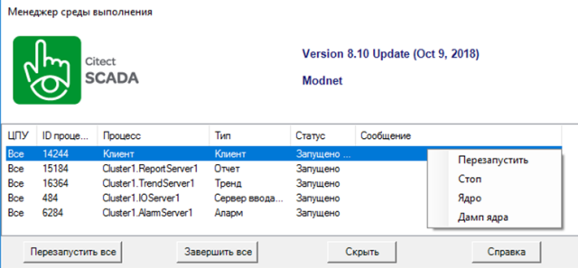
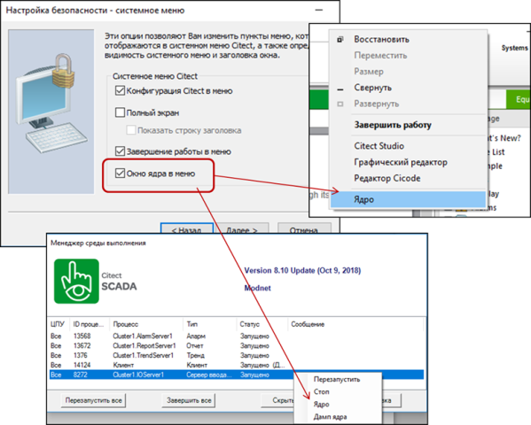
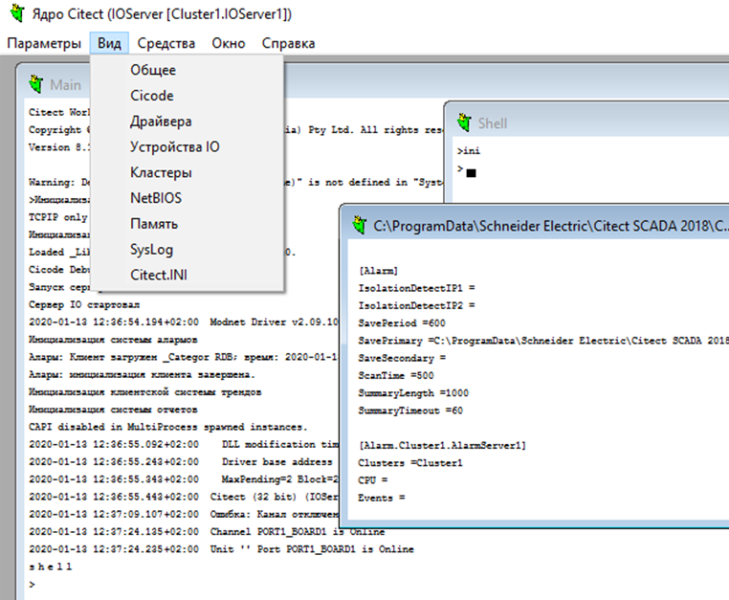

# Виконання та налагодження проекту в Citect та Plant Scada

## Компілювання та запуск

Для перевірки працездатності проекту його необхідно скомпілювати через відповідний пункт меню. При невдалому компілюванні у відповідному вікні з’являться повідомлення:

- помилки (Error): компіляція завершена, але проект не може бути запущений на виконання до їх виправлення;

- критичні помилки (Fatal): компіляція не завершилася через критичну помилку;

- попередження (Warning): компіляція завершена з помилками, але проект може бути виконаний.  

В опціях проекту можна задати режим інкрементної компіляції, при якій буде проводитися компіляція тільки змінених файлів.

Компілювання приводить до створення файлів виконання, серед яких є база даних режиму виконання (RDB, runtime databases), на які перетворюються конфігураційні таблиці. 

Після компілювання проекту його необхідно запустити на виконання для перевірки та налагодження. Запуск виконання можна проводити як із середовища розроблення Citect Studio, так і з меню програм Windows. У першому випадку попередньо буде зроблено компілювання проекту, якщо в цьому є необхідність, і проект буде вибраний як стартовий. В обох випадках буде запущений стартовий проект (шлях вказаний у параметрі [Ctedit]RUN файлу Citect.ini).

Для керування середовищем виконання в Citect є спеціальний менеджер (Runtime Manager), який дозволяє запускати, зупиняти, контролювати стан та зупиняти процеси середовища виконання (рис. 8). Менеджер запускається автоматично при запуску середовища виконання, його вікно можна відкрити через контекстне меню піктограми в панелі статусу. Враховуючи, що Citect може виконуватися в кількох процесах (див. параграф 9.1.6), кожен з них може керуватися окремо. 

*Рис. 8*. Вікно менеджера середовища виконання

Для перевірки та зміни тегів в Citect є шаблон DataBrowse, який виводить значення усіх тегів у вигляді таблиці. Крім того, є функції TagDebug та TagDebugForm, які виводять вікна читання/записування значень тегів.

Теги введення/виведення беруть значення з I/O Device, для яких, виставивши властивість Memory (рос.лок "Память") в значення TRUE, можна вказати на необхідність "відключення" від зовнішнього джерела. Цей механізм можна використовувати при налагодженні для тимчасового відключення від джерела.

Для налагодження необхідно збирати та аналізувати діагностичну інформацію. Ця інформація може бути отримана такими чином:

- файли журналів: файли з повідомленнями про помилки роботи Citect;

- апаратні тривоги: тривоги середовища виконання, що показують системні помилки. 

Цю інформацію можна аналізувати безпосередньо (журнали зберігаються в папці Logs, наприклад, "C:\ProgramData\Schneider Electric\Citect SCADA 2018\Logs" або "C:\ProgramData\AVEVA Plant SCADA\Logs") або з використанням спеціального інструмента Citect SCADA Kernel. 

## Ядро (Kernel)

### Загальні відомості

Kernel (надалі "Ядро") може виконувати низько-рівневу діагностику та налагодження, аналіз середовища виконання. Він може відображати структури даних нижнього рівня, бази даних реального часу, статистику, мережний трафік, трафік введення/виведення тощо.   

Ядро можна викликати, виставивши параметр [Debug]Kernel=1, що передбачає автоматичний запуск Ядра при старті середовища виконання або через контекстне меню (вікно керування) середовища виконання (через вікно клієнта або менеджера виконання), виставивши в налаштуваннях "Computer Setup Wizard" відповідну опцію (рис. 9). Вікно Ядра також можна викликати через Cicode-функцію DspKernel. Слід зазначити, що Ядро працює в контексті процесу, з якого він був викликаний. Наприклад, для налагодження підсистеми введення/виведення треба відкривати Ядро через контекстне меню необхідного сервера введення/виведення менеджера середовища виконання. 

Вікно Ядра є консольними і передбачає діалоговий режим через інтерфейс командного рядка. Основні команди і повідомлення виконуються через вікно Main. Для доступу до команд керування кешем (Cache) та Cicode необхідно ввести пароль, попередньо зареєстрованого користувача з ім'ям "kernel". 

У версії 2018 доступні такі команди Ядра:

- Shell – відкриває нове командне вікно shell, яке дозволяє вводити команди з нього;

- Exit – закриває вікно Cicode або Shell.

- Help – відображає список деяких команд, доступних в Kernel;

- Cls – очищає текст у вікнах Main або Cicode;

- Cache – змінює тайм-аути кешів для кожного I/O Device;

- Cicode – відкриває дочірнє вікно, в якому можна викликати функції Cicode в контексті вказаного процесу Серверу Citect або імені комп’ютера клієнта;

- Debug – активує журналювання в файл SysLog.DAT пересилання запитів від Citect SCADA до драйвера відповідно до вказаного I/O Port; наприклад debug port1_board1 read – виводить запити на читання змінних через порт "port1_board1";

*Рис. 9*. Налаштування та виклик опції Ядра в меню керування

- DriverTrace – виводить driver control blocks (DCBs) що є на I/O Server, які очікують доставки на  driver;

- INI – відображає локальний файл citect.ini;

- Log – активує або деактивує журналювання звіту читання та записування для вибраного I/O Device; наприклад *log plc1 all* – виводить звіт по кожному читанню та записуванню для пристрою “plc1”;  

- Page General – відкриває вікно із загальною статистичною інформацією.

- Page Driver – відкриває вікно з інформацією про кожен драйвер у Citect.

- Page Memory – відкриває вікно з інформацією про пам'ять; 

- Page Table – відкриває вікно з інформацією про внутрішні структури даних Citect;

- Page RDB – відкриває вікно з інформацією про всі конфігураційні таблиці режиму виконання RDB (Citect runtime databases);

- Page Unit – відкриває вікно з інформацією про кожний I/O Device в Citect.

- Pause – пауза виведення в журнал;

- Profile – "profile 1" активує профайлера Cicode, "profile 0" – деактивує.

- Stats – скидає системну статистику;

- SysLog – відображає файл syslog.dat.

Вікна, що виводять списки таблиць, передбачають їх прогортання через команди PgUp та PgDwn. Зовнішній вигляд вікна Ядра, яке запущене в контексті сервера введення/виведення показаний на рис. 10. 

*Рис.10.* Зовнішній вигляд вікна Citect Kernel (Ядро)