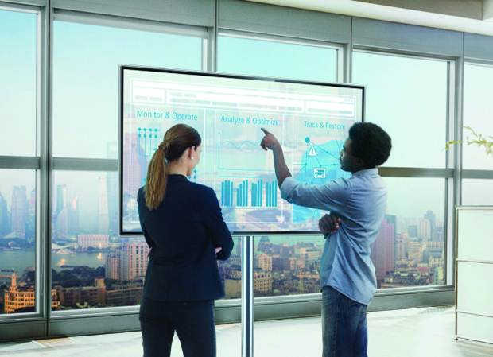

[< -- До розділу](../README.md)         [Зміст](../../contents.md)

# Призначення та можливості людино-машинних інтерфейсів та збирання даних в автоматизованих системах керування

**Про що:**

- про загальні принципи функціонування засобів SCADA/HMI з точки зору інженерного та технічно-експлуатаційного персоналу  

**Що отримаєте:**

- знання про можливості, принципи функціонування та побудови засобів людино-машинного інтерфейсу та SCADA
- вміння користуватися базовими функціями середовища виконання SCADA/HMI 
- навики роботи з середовищами виконання SCADA/HMI 

**Що потрібно знати вже:**

- базові розуміння функціонування систем керування

**Необхідні інструменти:**

- ПК, все необхідне буде надано для завантаження

**Джерела:** 

- [Посібник Розроблення людино-машинних інтерфейсів та систем збирання даних з використанням програмних засобів SCADA/HMI](https://pupenasan.github.io/hmibook/)
- [Матеріали дисципліни Людино-машинні інтерфейси](https://pupenasan.github.io/hmi)
- [Матеріали дисципліни Моніторинг виробничих операцій](https://pupenasan.github.io/monitorproduction)

## Теоретична частина

- [Призначення та можливості людино-машинних інтерфейсів та збирання даних в автоматизованих системах керування: теоретична частина](teor.md)

## Практична частина

- [Знайомство з середовищем виконання SCADA/HMI на прикладі zenon](labzenon.md)
- [Знайомство з середовищем виконання SCADA/HMI на прикладі Citect](labcitect.md)

## Перевірка знань

todo

