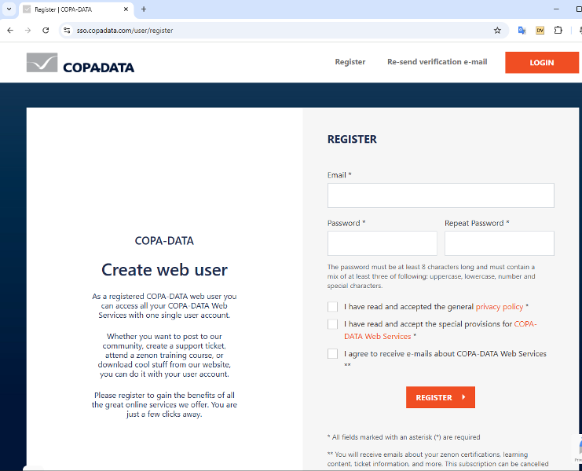
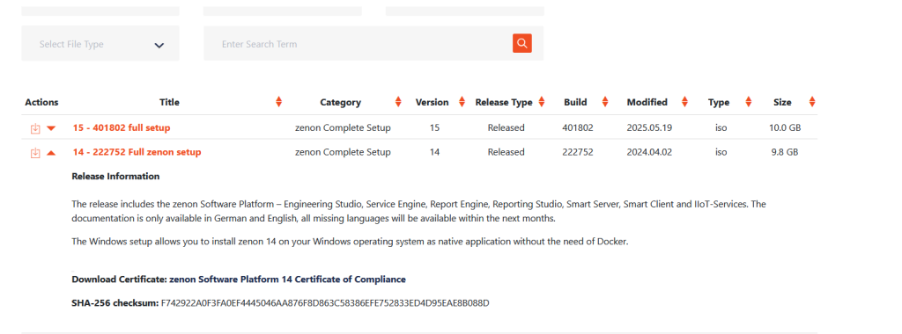

[<- До підрозділу](README.md)	[SCADA zenon](../zenon.md)		[Коментувати](#feedback)

# Встановлення zenon 14 : практичне заняття

Завантаження 

- [ ] Зареєструqтеся на порталі COPADATA [https://sso.copadata.com/user/register](https://sso.copadata.com/user/register), це безкоштовно. При реєстрації необхідно вказати пошту та пароль, яким Ви будете користуватися при вході.

- [ ] Після реєстрації необхідно буде ввести додаткові дані про місце роботи/навчання, та своє прізвище та ім'я.  

- [ ] Перейдіть на сторінку завантаження [https://productdownloads.copadata.com/product-downloads](https://productdownloads.copadata.com/product-downloads) і завантажте образ 14-ї версії

- [ ] zenon можна встановити в trial ліцензії, яка  Для того щоб можна було повторно
- [ ] [Встановлення та налаштування ВМ з Windows 10](../../vm/vbox/labwin10.md)

## Автори

Теоретичне заняття розробив [Олександр Пупена](https://github.com/pupenasan) 

## Feedback

Якщо Ви хочете залишити коментар у Вас є наступні варіанти:

- [Обговорення у WhatsApp](https://chat.whatsapp.com/BRbPAQrE1s7BwCLtNtMoqN)
- [Обговорення в Телеграм](https://t.me/+GA2smCKs5QU1MWMy)
- [Група у Фейсбуці](https://www.facebook.com/groups/asu.in.ua)

Про проект і можливість допомогти проекту написано [тут](https://asu-in-ua.github.io/atpv/)
