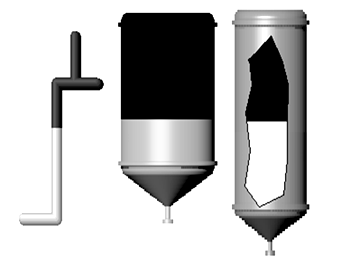
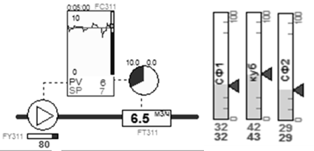
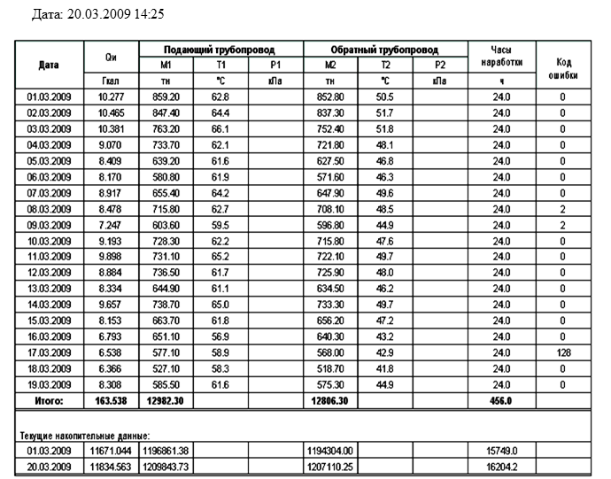

[<- До підрозділу](README.md)

# Призначення та можливості людино-машинних інтерфейсів та збирання даних в автоматизованих системах керування

## 1. Місце засобів SCADA/HMI в структурі керування

### 1.1. Способи реалізації людино-машинного інтерфейсу

Більшість систем керування технологічними процесами автоматизовані, тобто такі, що потребують участі людини в процесі керування. Це зумовлено рядом факторів. Насамперед тим, що не завжди можна розробити алгоритм керування, за допомогою якого можна було б реалізувати повністю автоматичну систему керування. Для цього або недостатньо інформації про стан об’єкта керування, або в процесі керування можуть виникати непередбачувані ситуації, з якими не може впоратись існуюча система автоматизації. Крім того, навіть для традиційних і добре вивчених і відпрацьованих завдань автоматичного регулювання (стабілізуюче, програмне і слідкуюче) та завдань дискретного керування періодичними процесами, для яких існують надійні алгоритми і програми керування, виникає необхідність коригувати їх роботу. 

У будь-якому випадку необхідно налагодити зв'язок, який би, з одного боку, давав можливість людині контролювати стан процесу та системи, а з іншого – забезпечував можливість втрутитися в процес керування. Тобто необхідно в системі керування передбачити **людино-машинний інтерфейс** (**HMI** – Human-Machine Interface). Під "машиною" в цьому випадку розуміється система з усіх технічних засобів, що бере участь у процесі вимірювання, контролю, сигналізації та керуванні, а під "людиною" – оператор-технолог, який бере безпосередню участь у процесі керування. Отже, людина задіяна у процесі керування, тому вона є частиною цієї системи (автоматизованої системи керування технологічними процесами, АСКТП). Саме людина приймає найвідповідальніші рішення в процесі керування. Людино-машинний інтерфейс є частиною автоматизованого робочого місця (**АРМ**) оператора. 

На відміну від прямого візуального контролю та безпосереднього керування регулюючими органами, в АСКТП процес отримання людиною інформації та ручне керування проходить опосередковано через засоби людино-машинного інтерфейсу, обчислювальні машини різного рівня складності (наприклад ПЛК), виконавчі механізми та датчики (рис.1). Такий процес отримав назву **супервізорного керування**. 

                              

Рис.1. Супервізорне керування об’єктом

Для невеликих процесів людино-машинний інтерфейс може бути реалізований з використанням кнопок, перемикачів, різного типу індикаторів. Однак більшість технологічних процесів потребує значної кількості елементів відображення та ручного керування, а також різного типу самописців та елементів сигналізації. У цьому випадку для реалізації людино-машинного інтерфейсу використовують **операторські панелі** (ще називають **панелі оператора**). Це невеликі мікропроцесорні засоби з текстовим або графічним дисплеєм для відображення інформації та елементами керування – кнопками або/та сенсорним екраном. Передня частина таких панелей захищена від пилу, бруду, вологи, що дає змогу оператору керувати процесом безпосередньо біля об’єкта. Для захисту іншої частини панелі її розміщують у спеціальному щиті.

Для великих АСКТП панель оператора не забезпечує можливості контролю за всім процесом, архівування великої кількості параметрів, зв’язку з іншими системами керування процесами та виробництвом у цілому. Ці функції можуть бути реалізовані засобами людино-машинного інтерфейсу, побудованим на базі комп’ютерів зі спеціалізованим програмним забезпеченням. На виробництві такі автоматизовані робочі місця оператора-технолога розміщуються, як правило, в спеціально обладнаних диспетчерських, які захищають комп’ютери від пагубного впливу виробничих умов та надають можливість нормально працювати операторам. У диспетчерських приміщеннях для керування об’єктами з великим обсягом інформації застосовують також настінні екрани, інколи комбінуючи їх з пультами та щитами керування.

Для реалізації роботи людино-машинного інтерфейсу необхідно забезпечити двосторонній обмін даними:

- збирати інформацію про стан технологічного устатковання і значень технологічних параметрів;

- передавати команди оператора в зворотному напрямку. 

При побудові комплексної АСКТП на базі програмованих контролерів цими процесами займаються **SCADA** (Supervisory Control And Data Acquisition – супервізорне керування і збирання даних). Тобто організація роботи АРМ складається, як мінімум, з двох складових: SCADA – для збирання даних та керування; HMI – для реалізації людино-машинного інтерфейсу. 

У АСКТП, побудованих на базі **DCS** (Distributed control system – системи розподіленого керування), концептуальна база даних процесу є єдиною як для керування процесом у реальному часі, так і для візуалізації. Тому окремо функція SCADA не виділяється, але процес створення людино-машинного інтерфейсу практично такий самий. Надалі будемо розглядати тільки системи, побудовані за принципом: контролери+SCADA+HMI.

### 1.2. Засоби розроблення автоматизованих робочих місць

Програмне забезпечення для комп’ютерів АРМ можна створити на базі універсальних середовищ та мов програмування. Такий підхід дає змогу створити систему з будь-яким функціоналом за бажанням замовника, однак він має ряд недоліків. По-перше, розроблення проектів займає багато часу і потребує залучення спеціалістів з комп’ютерного програмування. По-друге, відлагодження такого проекту триває досить довго, а помилки в роботі програм нерідко проявляються протягом усього життєвого циклу системи. По-третє, такі програми важко супроводжувати і вносити туди зміни, оскільки це потребує постійного контакту з людиною-розробником. 

Альтернативою наведеному вище підходу є використання спеціального програмного забезпечення, яке значно спрощує розроблення прикладного програмного забезпечення для реалізації АРМів різного призначення. Таке інструментальне програмне забезпечення належить до класу **SCADA/HMI**. Основний принцип розроблення з використанням цих інструментів – "Конфігурування замість програмування", що різко зменшує витрачений час та вірогідність помилок, адже функціональність АРМів у своїй базовій частині мало залежить від особливостей виробництва. Програмні пакети для розроблення АРМів на базі комп'ютерів прийнято називати "**SCADA-програмами**", або просто "SCADA", а для панелей оператора – "**HMI-програмами**", або просто "HMI". Надалі ми будемо використовувати загальний термін, який об’єднує ці поняття – програми **SCADA/HMI**. У світі налічуються сотні компаній, що активно займаються розробленням і розповсюдженням програм SCADA/HMI. 

Необхідно розрізняти програмне забезпечення SCADA/HMI, яке функціонує на автоматизованому робочому місці оператора, і набір інструментальних програмних засобів, призначених для розроблення такого прикладного програмного забезпечення (рис.2). **Середовище розроблення (Design-Time)** використовується на стадії створення системи і містить набір різних редакторів. Як правило, ця програма виконується тільки на комп’ютері розробника ( так званій **інженерній робочій станції**). **Середовище виконання (Run-Time)** містить усі виконавчі підсистеми для реалізації функцій, розроблених виробником SCADA/HMI. Воно слугує для запуску і виконання створеного проекту на комп’ютері автоматизованого робочого місця в режимі м’якого реального часу. На самому підприємстві обов’язковим є наявність середовища виконання проекту. 

Результат розроблення – набір пов’язаних файлів, які називають **проектом**. За аналогією із середовищем розроблення і виконання у більшості SCADA/HMI проект може бути в 2-х варіантах (див. рис.2):

- **вихідний проект**, де зберігаються проектні дані у формі, доступній для редагування;

- **скомпільований проект**, який вміщує код, який може інтерпретувати середовище виконання і недоступний для редагування людиною.


Рис.2. Порядок створення, компіляції та виконання проекту

Для функціонування автоматизованої системи в режимі операційної роботи необхідне тільки середовище виконання та скомпільований проект. Однак, якщо в майбутньому планується вводити зміни в проект, підприємство повинно домовитися з розробниками про передачу також вихідного проекту. 

Слід зазначити, що середовище виконання для комп’ютерів є платним і ліцензується залежно від функціональних можливостей та кількості змінних процесу, які задіяні в контролі та керуванні. Середовище виконання для панелей оператора вже вбудоване в неї і входить у вартість устатковання. Середовище розроблення може бути як платним так і безкоштовним, залежно від особливості фінансової політики виробника SCADA/HMI.

Розділення SCADA/HMI на два середовища є загальноприйнятою практикою, але не правилом. Ряд продуктів підтримує різні режими роботи одного середовища. Деякі базуються на WEB-технологіях, де середовищем виконання по суті є ВЕБ-сервер (серверна частина) і браузер (клієнтська). Тим не менше, надалі в посібнику дотримується саме таке розділення, як найбільш вживане. 

### 1.3. Функціональні можливості середовищ виконання SCADA/HMI

Більшість програм SCADA/HMI має типовий набір функціональних можливостей для реалізації завдань АРМів:

- збирання інформації про контрольовані технологічні параметри (даних реального часу) з контролерів та засобів віддаленого введення/виведення;

- графічне представлення стану технологічного процесу і устатковання в зручній для сприйняття формі у вигляді мнемосхем;

- вторинне оброблення інформації (масштабування, обмеження вводу, перевірка коректності тощо); 

- приймання команд оператора і передача їх на контролер, або засіб віддаленого виведення;

- збереження даних реального часу в архівах даних і графічне представлення історичної інформації в зручній для сприйняття формі у вигляді графіків, гістограм тощо;

- сповіщення експлуатаційного і обслуговуючого персоналу про виявлені аварійні події в технологічному процесі і програмно-апаратних засобах;

- фіксація в електронних журналах виникнення аварійних подій у контрольованому технологічному процесі та дій експлуатаційного персоналу; 

- формування звітів на основі архівної інформації, тривог та даних реального часу;

- обмін інформацією з автоматизованими системами керування виробництвом та підприємством у складі інтегрованих систем керування; 

- виконання певної логіки оброблення даних з використанням вбудованих мов, наприклад, VBA;

- захист від несанкціонованого доступу до компонентів і файлів;

- формування, записування, читання та збереження даних у вигляді рецептів;

- створення оперативних календарних планів керування устаткованням.

Налаштування та робота цих функцій розглянуті в інших розділах даного посібника. У цьому розділі наведено тільки основні характеристики, які варто знати як розробникам, так і користувачам SCADA/HMI. 

## 2. Людино-машинний інтерфейс (HMI)

У цьому підрозділі HMI розглядається з точки зору оператора. Детальніше особливості розроблення HMI розглянуто в розділі [Графічний людино-машинний інтерфейс](../hmi/README.md). 

### 2.1. Загальний вигляд графічного HMI

Загальний вигляд графічного людино-машинного інтерфейсу (HMI) суттєво залежить від характеру технологічного процесу, прийнятих стандартів (корпоративних, галузевих) на побудову автоматизованих систем та індивідуальних потреб замовника (наприклад, технологів, інженерного персоналу). Сьогодні найбільш передові досягнення у області HMI знайшли відображення у стандарті ISA-101, який детально розглядається у розділі в розділі [Графічний людино-машинний інтерфейс](../hmi/README.md)  цього посібника. Далі у цьому підрозділі наводяться приклади найбільш типових підходів до побудови графічного інтерфейсу АРМа. 

**Графічна підсистема** АРМа оператора має багатовіконний інтерфейс з можливістю відображення у вікнах **дисплеїв** (**display**) процесу, трендів, тривог та іншої службової інформації. Враховуючи, що вся доступна інформація не може вміститися в одному вікні, в один момент відображається тільки один дисплей процесу. Такі дисплеї можуть називатися по-різному, залежно від термінології прийнятої для вибраної SCADA/HMI, наприклад **сторінки** (**pages**), **екрани** (**screens**) або відображення (view). Дисплеї, які призначені для відображення технологічного процесу або його частини, часто називають дисплейними **мнемосхемами** (mimic diagram, mimic, mnemonic) або дисплеями процесу (process display). На рис.3 показано приклад загального вигляду дисплея, де мнемосхема процесу займає більшу його частину. 


<a href=""media/1_3.png" target="_blank"></a>                               

Рис.3. Приклад загального вигляду дисплея людино-машинного інтерфейсу  (SCADA Citect): 1 – дисплейна мнемосхема процесу; 2 – панель(меню) доступу  до інших сторінок та команд; 3 – вікно відображення активних тривог та подій

Такий спрощений вигляд установки з відображенням значень технологічних параметрів у плинний момент часу дає оператору інформацію про стан цієї частини процесу. Для перегляду інших частин процесу оператор повинен відкрити інший дисплей, наприклад, за допомогою панелі керування, меню або інших елементів керування. Таким чином, використовуючи меню або панель навігації, оператор може переглянути детально будь-яку частину процесу.

Для введення дій, перегляду уточнювальної інформації чи тимчасового відображення ряду параметрів також використовують спливаючі вікна. Вони відкриваються поверх основного вікна і не заважають перегляду його вмісту. 

Хоча кількість дисплеїв процесу, як правило, не обмежується системою, оператор не може вчасно зреагувати на зміни в системі, постійно їх перемикаючи. Тому в більшості випадків в графічній підсистемі є головна мнемосхема, де відображається найбільш загальна інформація про весь процес. Крім того, всі технологічні параметри, що потребують підвищеного контролю з боку оператора, повинні відслідковуватися підсистемою тривожної сигналізації (наприклад, вихід значення змінної за аварійні межі). Графічна підсистема повинна бути розроблена таким чином, щоб тривоги, які з’явилися, відразу привертали увагу оператора. Останні тривоги, як правило, показуються у вигляді постійно видимого **вікна активних тривог** (див. рис.3) або окремого підсвічуваного елемента, що вказує на наявність нештатної ситуації в системі. 

Графічний людино-машинний інтерфейс реалізується через:

- елементи відображення, які надають операторові інформацію про стан змінних процесу;

- елементи введення, що надають можливість впливати на процес шляхом зміни значень змінних або відправки команд.

Часто функції відображення та введення комбінуються в одному елементі. Далі розглянемо детальніше способи відображення та введення, а також типові елементи, які використовуються для цього.

### 2.2. Способи та елементи відображення стану процесу

Інформація про значення технологічних параметрів повинна бути надана в такому вигляді, щоб оператор швидко визначив загальний стан процесу. Для цього, окрім відображення значення величини у вигляді тексту, можна використовувати різного типу зміни властивостей графічного об’єкта, зокрема:

- кольору;

- тексту;

- видимості;

- вигляду зображення;

- геометричних розмірів;

- заповнення;

- позиції на екрані;

- кута повороту. 

Зміну якоїсь властивості графічного елемента залежно від значення змінної часто називають **анімацією**. 

Анімація кольору використовується для показу стану змінної процесу або устатковання чи агрегату. Яскраві червоні та жовті кольори прийнято використовувати для сигналізації відповідно аварійного та передаварійного стану, а всі інші – для уточнення діапазону нормального стану. Останнім часом передові організації-розробники рекомендують використовувати відтінки сірого кольору а також білі та чорні кольори. Інші кольори рекомендуються використовувати для виділення станів елементів, на які особливо треба звернути увагу, або для розрізнення елементів між собою (трубопроводи з різною рідиною, графіки на трендах тощо).

Для відображення стану дискретної змінної (типу "увімкнено"/"вимкнено") можна використати два кольори. Наприклад, зелений може вказувати на стан "увімкнений", а сірий – для стану "вимкнений". Згідно з останніми дослідженнями, бажано використовувати чорно-білу гаму кольорів, для даного прикладу – пару білий/темно-сірий, як показано на рис.4. У будь-якому випадку призначення кольорів необхідно заздалегідь узгодити між розробниками та замовниками.

 

Рис.4. Приклад зображення стану дискретної змінної: 1– клапан відкритий; 2 – клапан закритий; 3 – насос увімкнений; 4 – насос вимкнений

Стан аналогової змінної теж можна показати у вигляді зміни кольору елемента або його частини. У цьому випадку колір може вказувати на діапазон, в якому знаходиться значення змінної (рис.5). У такий спосіб оператор швидко може зорієнтуватися, чи знаходиться змінна в нормі, або в якому технологічному режимі знаходиться установка. У підрозділі 5.8 показано вади такого підходу і альтернативу йому. 

 

Рис.1.5. Приклад зображення різного стану аналогової змінної шляхом зміни кольору фону та тексту

Зміна кольору елемента часто використовується для сигналізації. 

Стан періодичного процесу також може відображатися у вигляді різних кольорів або відтінків. Так, стани "ПУСК", "СТОП", "БЛОКУВАННЯ", "ПАУЗА" можуть відображатися на одному й тому самому елементі у вигляді однойменних написів з різним кольоровим підсвічуванням. Крім того, активний крок (етап) процесу можна показати на діаграмі станів у вигляді яскравого елемента. Так, на рис.6 показано діаграму стану 4-х танків, один погляд на яку відразу вказує на активні кроки.

 

Рис.1.6. Приклад зображення активних кроків (етапів)

Поряд з кольором та текстом нерідко використовується миготіння. Цей тип анімації в основному призначений для привертання уваги оператора до події, що виникла й потребує його реакції. Найчастіше миготіння використовується в підсистемі тривог, де оператор повинен підтвердити факт, що він побачив тривогу, шляхом її квитування – активної дії (наприклад, натискання кнопки). Таким чином, миготіння може тривати доти, поки оператор не зверне уваги і не підтвердить тривогу.

Зміна видимості елементів може використовуватися для різних функцій. Наприклад, на рис.7(2) поява зображення руки вказує на ручний (дистанційний) режим роботи клапана, а на рис.7(4) поява трикутника із символом "W" – на наявність попереджувальної тривоги, пов’язаної з даним насосом. Крім того, властивість видимості може бути використана для виведення на екран операторові тільки тих елементів, які використовуються в цей момент.

 

Рис.1.7. Приклад зображення стану устатковання шляхом зміни видимості

Одним із наглядніших способів представлення аналогової величини є показ ступеня наповненості фігури у відсотковому відношенні (заливки). На рис.8 наведено декілька прикладів заливки в якості відображення рівня в збірниках та наповнення трубопроводу (додаткові рекомендації – в підрозділі 8  [Графічний людино-машинний інтерфейс](../hmi/README.md). ). 

 

Рис.1.8. Приклади використання вертикальної заливки

Хоч інтуїтивно заливка підходить для відображення рівня (ступеня заповнення), анімацію заповнення використовують для будь-яких аналогових змінних процесу. Як правило, для цього в засобах SCADA/HMI доступні стандартні елементи, які прийнято називати **стовпчикові діаграми**, або **гістограми**. На рис.9 наведено приклади стовпчикових діаграм, на яких, окрім самого стовпчика, показано вимірювальну шкалу, а також відображено аварійні та попереджувальні межі, щоб оператор бачив, у якому діапазоні зараз знаходиться величина. Стовпчикові діаграми також можуть змінювати колір заповнення стовпчика залежно від значення та показувати бажане значення величини.

 

Рис.9. Стовпчикові діаграми (гістограми): ліворуч – вертикальні; праворуч – горизонтальні

Крім стовпчикових діаграм, для відображення значення аналогових величин можна використовувати **кругові діаграми**. Так, на рис.10 кругова діаграма показує плинну витрату речовини. Так само можна показувати ступінь відкриття регулюючого органу. На рис.13 у нижній частині фільтра F3 за допомогою кругової діаграми показано, скільки часу пройшло з початку етапу фільтрації відносно заданого.

        

Рис.1.10. Фрагмент мнемосхеми з різними типами діаграм

За допомогою анімації руху по вертикалі чи по горизонталі можна показувати як значення вимірюваної величини, так і значення уставки (заданого або бажаного значення). Так, на рис.10 (праворуч) показано стовпчикові діаграми з відміткою заданих значень (вказані трикутними стрілками). 

Анімація обертання (зміна кута повороту), як правило, використовується в **стрілочних індикаторах** (рис.11). Цей тип графічних елементів інтуїтивно зрозумілий оператору, а інформація з нього швидко сприймається. Комбінація з анімацією кольору поліпшує процес сприйняття.

        

Рис.1.11. Стрілочні індикатори

Крім цього, анімацію руху застосовують, щоб показати залежність однієї змінної від іншої або розподіл (градієнт) параметрів у просторі. Наприклад, на рис.12 показано значення температур на контрольних тарілках колони у вигляді точок, розміщених на горизонтальних лініях. Поєднавши ці точки, можна показати градієнт розподілу температур по висоті колони. Застосувавши такий підхід разом з анімацією кольору, можна одним поглядом оцінити стан роботи колони.

 

Рис.12. Приклад відображення градієнта температур по висоті колон

Для відображення тенденції зміни значення технологічних змінних використовуються **самописці**, які також називають **трендами реального часу**.

Наприклад, у мнемосхемі на рис.10 самописець дає операторові уявлення про поведінку тиску, оскільки різке його підвищення може вказувати на забитість фільтраційного матеріалу. Слід зазначити, що в такому випадку абсолютна величина тиску не має такого значення, як його зміна в часі. А на рис.13 самописець показує тенденцію відхилення дійсного значення витрати від заданого, що значно інформативніше, аніж бачити тільки їхні плинні значення.


Рис.1.13. Приклад мнемосхеми з використанням самописців і кругової діаграми

Крім того, на мнемосхемі рис.13 задіяно функцію видимості, оскільки самописець і кругова діаграма показані тільки для працюючого фільтра, тому що в іншому випадку вони не мають ніякого значення і тільки заплутують оператора надлишковою непотрібною інформацією.

Як видно з рис.14, самописець часто використовується у вікнах налаштування регулятора, оскільки саме вигляд перехідного процесу дає наладчикові інформацію про вдалий підбір його настройок. 

Сучасні програми SCADA/HMI дають можливість залежно від значення змінних керувати активністю мультимедійного контенту, наприклад фільмів, аудіо або різного типу анімації GIF, Flash і т. д. Однак не слід зловживати цими засобами, тому що їхнє надмірне використання тільки погіршує процес сприйняття інформації та адекватну оцінку стану процесу. 

 

Рис.14. Приклад використання самописця

### 2.3. Способи та елементи введення (зміни значення змінних)

Графічні елементи, які використовуються для зміни значення змінних або відправки команд, називають **елементами керування**. Впливати на ці елементи можна, використовуючи один з доступних елементів введення:

- маніпулятор "миша";

- сенсорний екран;

- клавіатура. 

Для виконання команд для зміни значення дискретних змінних типу "увімкнути"/"вимкнути" використовуються кнопки, перемикачі або графічні еле­менти з цими функціями. Графічний вигляд таких елементів може бути дуже різним (рис.15). Тим не менше, можна виділити два типи команд для таких елементів:

- перемикання, яке приводить до зміни значення ВКЛ на ОТКЛ, та навпаки;

- записування константи, яка відповідає одному зі станів: "ВКЛ" або "ОТКЛ".

Можна здогадатися, що на рис.15 показано перемикачі, оскільки команди (наприклад по кліку миші) приводять до зміни значення на обернене. Однак функціональність таких елементів не обов’язково збігається із зображенням, тому слід заздалегідь обговорювати їх із розробником.


Рис.1.15. Приклади зображення перемикачів

На рис.16 наведено приклади використання кнопок із командами записування константи. В обох прикладах для включення та виключення установки/двигуна необхідно використати різні кнопки: "Начать" та "ВКЛ" для включення і "СТОП" та "ОТКЛ" для відключення. 

 

Рис.16. Приклади використання

Аналогічним способом можна записати значення константи для аналогової або текстової змінної. Однак цей спосіб не такий вживаний, тому що є необхідність у записувані будь-яких значень з дозволеного діапазону введення. Один з найбільш універсальних способів – ввести значення з клавіатури в полі для введення. Для цього елемент введення отримує курсор введення, який називають **фокусом**. У більшості засобів SCADA/HMI по отриманні фокуса значення вводиться безпосередньо в поле для введення (рис.17). Бувають і інші способи введення значення, як, наприклад, набір значення під елементом, що отримав фокус.


Рис.1.17. Різні способи введення значення аналогової змінної.

Враховуючи, що у зв’язку з виробничими умовами чи наявністю сенсорного екрана клавіатури на АРМі може не бути, для введення значення можна використати віртуальну клавіатуру (див. рис.17). 

Більшість SCADA/HMI обмежують введене значення в дозволених межах, що зменшує ймовірність помилкової дії оператора. 

Введення з клавіатури надає змогу записати вказане значення з дозволеного діапазону, однак часто операторові необхідно змінити його відносно плинного стану. Крім того, оператор при керуванні користується нечіткими більш інтуїтивними поняттями, на кшталт "трохи збільшити" чи "сильно зменшити", або "відкрити десь наполовину". Для такого типу керування більш підходять "аналогові" засоби керування типу повзуна чи кнопки "більше/ менше".

**Повзуни** (slider) призначені для зміни значення змінної шляхом пересування "ручки" по шкалі від мінімального до максимального значення. Повзуни бувають вертикальними, горизонтальними та круговими (рис.18).

 

Рис.18. Приклади повзунів.

Приклад використання вертикального повзуна показано на рис.19 для завдання заданого значення та ручного виходу на виконавчий механізм. Серед усіх елементів введення повзун виділяється найшвидшим способом зміни значення змінної. 

Для зміни значення змінної на кшталт "трохи більше" чи "трохи менше" найкраще використовувати кнопки ступеневої зміни. На рис.19 кнопки "більше" та "менше" поряд з повзунами відповідно збільшують та зменшують значення на 1%. Іноді крок зміни параметра залежить від тривалості натиснення відповідної кнопки. Чим більша тривалість натиснення кнопки, тим більша величина кроку і з більшою швидкістю змінюється параметр.


Рис.1.19. Приклади використання кнопок "більше" та "менше" .

Це не весь перелік способів та елементів відображення та зміни, які можуть використовуватися в засобах HMI. У підрозділі 5.8 наводяться деякі елементи високоефективних людино-машинних інтерфейсів, які можуть значно покращити ситуаційну обізнаність.

## 3. Підсистема тривожної сигналізації та подій

У цьому підрозділі тривожна сигналізація розглядається з точки зору оператора. Детальніше особливості розроблення подано в розділі [Розроблення підсистеми тривожної сигналізації](../alarm/README.md). 

### 3.1. Загальні принципи функціонування

Кількість параметрів, які контролює один оператор, може вимірюватися сотнями, при цьому кількість мнемосхем може перевищувати десяток. При таких обставинах навіть найуважніший і досвідчений оператор не зможе вчасно зреагувати на вихід за регламентні межі значення однієї з контрольованих величин. Тому для кращого моніторингу процесу в SCADA/HMI використовуються підсистеми **тривожної сигналізації** (**Alarms Management**). Основна ідея її функціонування – відслідковування виходу змінної процесу за нормовані межі. Тобто, коли всі технологічні параметри процесу перебувають в регламентних межах, оператор може не слідкувати за всіма значеннями контрольованих параметрів, оскільки за ними слідкує підсистема тривожної сигналізації. Як тільки значення хоча б однієї зі змінних переходить у ненормований стан (за межі нормованих значень), то підсистема оповіщає про це оператора, щоб той звернув на це увагу і, за можливості, усунув причину тривоги. Факт появи тривоги може сигналізуватися зміною кольору елемента (наприклад, яскраво-червоним чи жовтим), миготінням, звуковим сигналом, спливаючим вікном та іншими способами, які привертають увагу оператора. Тобто перша функція підсистеми тривожної сигналізації – виявити тривожну подію та сповістити про неї оператора. Сама нештатна подія називається **тривогою**.

Як уже зазначалося, тривога повинна сигналізуватися таким чином, щоб привертати увагу оператора незалежно від відкритого дисплею  на даний момент часу. Після виявлення оператором тривожного факту такі засоби сигналізації як звук, чи миготіння можуть заважати його адекватній роботі, через додатковий психологічний тиск. Тому оператор може дати команду **підтвердження**, що він помітив тривогу (**квитування**, acknowledge alarm). Після цього тривога переходить у стан активної (оскільки умова тривоги продовжує виконуватись), але підтвердженої (заквітованої), а отже, і по-іншому буде відображатися (наприклад, без звуку та миготіння). При створенні системи розробники повинні узгодити з технологами, які саме тривоги повинні бути з підтвердженням, а які – без, а також яким чином будуть себе вести при цьому елементи HMI.

У будь-якому випадку тривога відключається тоді, коли перестає виконуватись умова її появи та було зроблене її підтвердження (якщо таке вимагалось). Елементи сигналізації відповідно до станів тривог можуть мати чотири варіанти кольорів, миготінь, звуків тощо. 

У деяких ситуаціях, наприклад, коли частина устатковання вийшла з ладу, або у випадках тимчасової відсутності деяких датчиків, тривоги, пов’язані з цими процесами, варто перевести в стан **заборонених**, або **заблокованих** (suppress). Це потрібно для того, щоб вони не сигналізувалися. В іншому випаду до постійно включеної сигналізації оператори поступово звикають, і з часом вся підсистема втрачає своє функціональне призначення, оскільки нові тривожні повідомлення не виділяються на фоні постійно діючих. Це ще одна з причин, чому до розроблення системи тривожної сигналізації необхідно підходити скрупульозно. Додатково до цього, система може передбачати відтермінування тривог, тобто блокування на певний час.  

### 3.2. Ведення журналу тривог та його перегляд

Для підвищення якості виробництва та запобігання аваріям в перспективі всі тривожні події, що виникли в технологічному процесі, повинні аналізуватися. Для цього вони заносяться в **журнал тривог**, який зберігається в постійно-запам’ятовуючій пам’яті (наприклад, на жорсткому диску) протягом указаного часу (наприклад, одного місяця). Таким чином, друга функція підсистеми тривог – ведення архівного журналу тривог з можливістю його подальшого перегляду. У журнал автоматично заносяться: відмітка часу появи тривоги, її підтвердження та зникнення, а також **повідомлення тривоги** (alarm message або текст тривоги – alarm text). Крім того, в журнал може також вноситися інша додаткова інформація про тривогу. Переглядаючи журнал тривог, можна отримати послідовність проходження тривоги через усі стани. Так, за відмітками часу можна визначити час, коли виникла тривога, наскільки швидко зреагував на неї оператор (час підтвердження) та в який термін тривога була усунута (час зникнення тривоги).

Для перегляду включених (активних) та непідтверджених тривог, а також архівного журналу засоби SCADA/HMI надають спеціальні інструменти, які називають **переглядачами тривог** (alarm viewer). Функціональні можливості таких переглядачів відрізняються залежно від середовища, але в більшості випадків вони надають такі можливості:

-     перегляду станів включених (активних) на даний момент тривог;

-     перегляду архівного журналу тривог за вказаний проміжок часу;

-     перегляду відміток часу появи, підтвердження, зникнення тривог;

-     перегляду повідомлення та додаткових властивостей тривоги;

-     налаштування різних способів відображення, наприклад, у вигляді списку тривог;

-     налаштування фільтрів для виведення в переглядач тільки тих тривог, які відповідають заданим критеріям (наприклад, по імені змінної чи пріоритету)

Як правило, переглядач останніх трьох-чотирьох тривог завжди видимий на екрані (див. поз. 3 на рис.3). Приклад такого переглядача показано на рис.20. В ідеальному варіанті, коли немає тривог, список повинен бути порожнім. Нове повідомлення появляється в ньому на вершині списку, повідомляючи операторові про наявність нової тривоги.
<a href="media/1_20.png" target="_blank"></a>                            
Рис.20. Приклад переглядача останніх тривог

Крім найважливішої інформації про тривогу (назва, повідомлення, час виникнення та стан тривоги), операторові можуть бути доступні такі дії, як підтвердження тривоги, заборона (блокування) тривоги та доступ до інших властивостей. У наведеному прикладі на рис.20 переглядач дає можливість перейти до повного списку тривог різної категорії. Число біля піктограми вказує на кількість тривог у списку.

Тривоги можуть мати властивість **пріоритетності**. У цьому випадку найбільш пріоритетні тривоги будуть розміщені в переглядачі на першому місці (на вершині списку). У випадку великої кількості активних тривог (у цьому випадку – більше 3-х) повний перелік доступний через дисплей зведення тривог (переглядач усіх тривог), який відкривається на окремій сторінці. Дисплей показує список усіх тривог з їх активним станом, аналогічно до того, який показаний на рис.21. Повідомлення про тривоги можуть підсвічуватися та/або миготіти відповідно до їхнього стану.

 

Рис.21. Приклад зведення тривог у вигляді списку

Для аналізу історії тривог переглядачі можуть відображати інформацію з журналу тривог (історичний режим). Операторові може бути зручно переглядати історію у вигляді списку, де кожна дія відображається окремим повідомленням, або у вигляді зведення, де окремий рядок представляє повну історію появи, підтвердження і зникнення тривоги. Так, на рис.22(1) показано, як змінювався стан тривоги з дескриптором (назвою) ALARM_6, яка відповідає за зниження рівня масла у двигуні 3. Кожна нова зміна стану показана в списку у вигляді окремого запису:

```
9:54:25 – тривога включилась;
9:55:18 – оператор її підтвердив (квитував);
9:59:03 – тривога відключилась. 
```
<a href="media/1_22.png" target="_blank"></a> 

Рис.22. Приклад переглядача журналу тривог у вигляді: 1 – списку; 2 – зведення

На рис.22(2) овалами виділено відмітки часу зміни стану ALARM_6 на переглядачі журналу у вигляді зведення тривог. 

Переглядачі тривог, як правило, надають можливість сортувати повідомлення за різними полями, наприклад, за ім’ям (дескриптора), часом виникнення тривоги тощо. Для відображення тільки необхідних записів можна налаштувати фільтри; приклади:

- відображати тільки непідтверджені записи за вказаний період часу;

- відображати тільки тривоги з указаною категорією;

- відображати всі тривоги з указаним дескриптором (назвою). 

### 3.3. Типи тривог

Тривоги можуть виникати за різних причин. Більшість засобів SCADA/HMI надають можливості генерувати тривоги за такими подіями:

- зміна значення дискретної змінної (**дискретні тривоги**);

- зміна значення аналогової змінної (**аналогові тривоги**);

- збій роботи зв’язку середовища виконання SCADA/HMI з джерелом даних (наприклад, контролером) або неполадки в роботі самої системи (**системні тривоги**).

Умову виникнення дискретних тривог можна налаштувати як на ВКЛючення (ON, 1), так і на ВИКЛючення (OFF, 0). Яке саме значення є тривогою, визначається залежно від завдання. 

Для аналогових тривог умовою спрацювання може бути:

- вихід значення за попереджувальну верхню межу (англійською позначається як HI)

- вихід значення за аварійну верхню межу (HIHI); 

- вихід значення за попереджувальну нижню межу (LO)

- вихід значення за аварійну нижню межу (LOLO).

- відхилення величини від заданого значення (deviation).

Для зручності фільтрації повідомлень у переглядачі тривог, а також групового налаштування можуть використовуватись додаткові властивості тривог, такі як номер групи, зона дії (наприклад, цех, відділення), категорія (наприклад, критичні, некритичні, системні) та ін. 

### 3.4. Події та журнал подій

Подібно до фіксування тривог, засоби SCADA/HMI мають можливість вести **журнал подій**. На відміну від тривоги, **подія** – це штатна зміна значення змінної, виконання команди або системної дії. Необхідність у фіксуванні таких подій може бути пов’язана з:

- включенням насоса, установки, відкриття клапана;

- запуском програми приготування продукту, перехід до етапу, закінчення її;

- запуском та зупинкою SCADA системи чи її частини;

- реєстрацією користувача в системі (оператор зайшов під своїм іменем та паролем);

- введення оператором значення змінної.

З наведених прикладів видно, що ці ситуації є штатними і в більшості випадків не потребують підтвердження. Тим не менше, вони можуть бути зафіксовані в журналі подій для подальшого аналізу або звітності. Деякі події потребують реакції оператора і повинні при активації відображатися на екрані. Для виведення списку та журналу подій використовуються переглядачі подій, функції яких дуже схожі до переглядачів тривог. На рис.23 показано приклад зовнішнього вигляду переглядача журналу, де видно події останнього запуску та зупинки системи, модифікацію значення змінних оператором ("Модификация спонтанного значения") з іменем “SYSTEM” на конкретному комп’ютері системи.

  

Рис.23. Приклад переглядача журналу подій. 

Враховуючи схожість функцій оброблення подій та тривог, у деяких засобах SCADA/HMI вони поєднуються в єдиній підсистемі (Alarms and Events), яка також може бути реалізована як окремий **сервер тривог та подій** (Alarms and Events Server). Слід зауважити, що архівні журнали подій та тривог можуть використовуватися при формуванні звітів.

## 4. Підсистема трендів

У цьому підрозділі підсистема трендів розглядається з точки зору оператора. Детальніше особливості розроблення розглянуто в розділі [Розроблення підсистеми трендів](../trends/README.md). 

### 4.1. Загальні принципи функціонування

У підрозділі2 показано, які можливості для аналізу динаміки надають самописці. Кожна точка на самописці – це значення змінної в конкретний момент часу в минулому, а їх взаємне поєднання показує тенденцію її зміни в часі. Таке представлення прийнято називати ***трендом***. Самописці являють собою ***тренди реального часу*** (Real-Time Trend), оскільки зміна змінної показується, починаючи з плинного часу (див. рис.14) в крайній правій точці графіка за певний невеликий відрізок часу (як правило, до однієї години). Причому це зображення постійно оновлюється новими значеннями, а крайні ліві значення (найстаріші) зникають.

Тренди реального часу призначені тільки для перегляду тенденції змінної в даний момент часу, для кращого оцінювання поведінки процесу саме зараз. Тим не менше, для таких трендів все одно необхідно зберігати (буферизувати) попередні значення. Буфер тренду розрахований тільки на певний час, а отже, старі значення завжди будуть зникати. Для можливості аналізу тенденції зміни значень змінних, що відбувалися в минулому, їх треба зберігати на постійному запам’ятовуючому пристрої (наприклад, жорсткому диску). Такі тренди прийнято називати ***історичними*** (Historical Trend). На відміну від трендів реального часу, підсистема керування історичними трендами виконує два окремі завдання:

- записує дані в архів (історію);

- вибирає дані з архіву для відображення на елементах людино-машинного інтерфейсу або у звітах.

На відміну від трендів реального часу, в яких значення на самописці оновлюється разом з оновленням змінної, записування даних в архів, як правило, проводиться рідше, ніж їх зчитування з джерела даних (контролера). Слід розуміти, що надмірно часте записування даних призводить до значних затрат ресурсів комп’ютера. Тому разом з ***періодичністю записування*** визначається ***глибина історії*** (архіву) – діапазон часу, протягом якого зберігаються архівні дані. Таким чином, чим частіше проводиться записування і чим довше зберігається історія, тим більше дискового простору буде виділятися під файли архіву і тим довше доведеться системі відшукувати потрібні значення. Продемонструємо це на прикладі.

Припустимо, кожний запис в архіві займає 100 байт. Якщо змінну записувати з періодичністю один раз за секунду, за місяць архів для даної змінної буде займати:

```
100 × 60 с × 60 хв × 24 години × 30 діб = 259200000 байт ≈ 247 Мбайт
```

Якщо кількість змінних становитиме декілька сотень, то архів займатиме десятки, а то й сотні Гігабайт. Якщо ж змінну записувати один раз за 10 с, то об’єм архіву буде вже в 10 разів менший. Навіть при великих об’ємах дискового простору залишається проблема швидкого доступу до архівних даних для читання. Тому при проектуванні SCADA/HMI розробникам разом з технологами необхідно визначитися з глибиною та періодичністю записування. При виборі періодичності записування треба враховувати швидкість зміни параметра, а при виборі глибини – необхідність аналізу історичних даних у майбутньому. Для детального аналізу одну й ту саму змінну можуть записувати в архівні тренди різної глибини. Наприклад, у добові тренди (глибиною 24 год) можуть писати змінну один раз за 1 с, а в місячні (глибина один місяць) – один раз за 1 хв.

Окрім трендів, особливості конфігурування яких в SCADA/HMI розглянуто в розділі і [Розроблення підсистеми трендів](../trends/README.md), для збирання та збереження великої кількості даних використовують спеціалізовані програмні засоби – Historian. Цей тип ПЗ дає накопичувати історичні дані та події за великий проміжок часу з малою періодичністю та відмітками часу до мілісекунд і менше. Детальніше про Historian йдеться розділі [Historian](../historian/README.md) посібника.  

Більшість SCADA/HMI, окрім періодичного способу записування, підтримують записування за зміни значення. Цей спосіб дає можливість економити дисковий простір, оскільки в більшості часу технологічні параметри не змінюються. При цьому для аналогових змінних також треба визначити зону (поріг) нечутливості, переходячи через який відбуватиметься записування.

Деякі SCADA/HMI підтримують записування по тригеру**.** Це дає можливість записувати дані в архів тільки при спрацюванні певних умов. Комбінація записування по тригеру з іншими типами дає можливість вести ***порційні архіви*** (batch archive), коли дані пишуться тільки на певних етапах процесу. Це може бути актуально для періодичного процесу приготування продукту в танках, де записування значень параметрів (температур, тисків, рівнів і т.п.) необхідно робити тільки на стадіях участі танка в процесі. 

Підсистема трендів може бути реалізована у вигляді окремого програмного забезпечення, яке у багатьох випадках називають ***сервером трендів*** (Trend Server).

### 4.2. Переглядання трендів

Вибірка даних з історичного тренду, як правило, проводиться спеціальними елементами відображення або підсистемою звітів. Для відображення трендів можна використати табличний вигляд, однак частіше для цього застосовуються самописці, які також називають ***переглядачами трендів*** (Trend Viewer), а ще частіше – трендами. Ці елементи відображення, часто, можуть працювати як у режимі перегляду трендів реального часу, так і історичних. Розглянемо найбільш вживані можливості переглядачів трендів на прикладах рис.24 та25.


*Рис.24.* Приклад переглядача трендів.

Сукупність взаємопов’язаних точок на тренді для однієї змінної прийнято називати ***кривими*** (curves), або ***перами*** (pens). Для того щоб відрізняти пера на тренді, їм призначають свій колір або/та тип лінії (суцільна, пунктирна, штрихова тощо), які пов’язують точки. Крім того, самі точки можна показувати різними геометричними фігурами (див. рис.25).

Криві показуються у вибраному діапазоні часу (***інтервалі***), який може налаштовуватися спеціальними кнопками типу "розтягування" ("<>"), "звуження" ("> <") або вибору з ряду заданих (див. рис.24). Початкове значення дати та часу перегляду вибирається за допомогою календаря або вказується шляхом введення. Швидка навігація доступна через кнопки:

" < " – на половину інтервалу назад; 

" << " – на один інтервал назад;

" > " – на половину інтервалу вперед; 

" >> " – на один інтервал уперед.                               

 

*Рис.1.25.* Приклад переглядача трендів з розширеними можливостями.

За допомогою ***легенди*** оператор може подивитися призначення кожної кривої тренду відповідно до кольору, налаштувати масштаб відображення, показувати чи ховати пера на графіку. Крім того, більшість переглядачів мають можливість показати ***курсор часу***, що дає можливість відобразити числове значення трендів у потрібній точці часу. Так, на рис.25 видно, що 05.11.2014 о 15:17:06 значення тиску внизу колони К1 було 76,7 Па.

Наведені вище можливості – це не повний перелік тих, які надаються переглядачами трендів. Наприклад, за допомогою панелі керування (див. рис.25) можна добавляти/видаляти пера, налаштовувати особливості відображення, створювати незалежні панелі зі своїми осями та багато чого іншого. 

## 5. Додаткові підсистеми SCADA/HMI

У цьому підрозділі додаткові підсистеми розглядаються з точки зору оператора. Детальніше особливості розроблення у відповідних розділах.

### 5.1. Формування звітів

Для аналізу подій і тривог, тенденції зміни технологічних параметрів протягом певного часу можна скористатися відповідними переглядачами. Крім виведення на екран, вони дають змогу виводити тренди та журнали на принтер. Не дивлячись на те, що в цей спосіб можна вивести багато потрібної й детальної інформації, вона недостатньо оброблена для отримання загальних показників ефективності роботи процесу чи установки. Для виведення загальних показників використовують звіти. 

***Звіт*** (Report) – це документ, сформований на основі визначеної для нього форми та статистично оброблених активних чи історичних даних. У ***формі звіту*** означується розміщення та призначення полів, а при генеруванні звіту ці поля заповнюються конкретними значеннями. Крім полів, вміст яких залежить від даних, форма звіту може вміщувати статичну графічну та текстову інформацію. 

На рис.26 показано приклад звіту, в якому, починаючи з початку місяця, вказуються сумарні добові та місячні величини споживання теплоенергії, середньодобові значення температур та кількість годин напрацювання за добу. Слід звернути увагу, що у звітах, у більшості випадків, використовуються не миттєві значення параметрів (які дають тренди чи журнали), а статистично оброблені за певний звітний період дані (наприклад, за добу, місяць, рік). Тому для звіту необхідне серйозне статистичне оброблення історичних даних, що потребує від розробника високої кваліфікації програміста, а від середовища розроблення – додаткових функціональних можливостей. Як правило, засоби SCADA/HMI мають досить обмежені можливості для роботи зі звітами, тому для складних звітів потрібне додаткове спеціалізоване програмне забезпечення або модулі класу MES/MOM. 

                               

*Рис.26.* Приклад звіту

Звіти можуть генеруватися автоматично (в разі виникнення події чи тривоги або періодично в зазначений астрономічний час) або за запитом оператора. Це може бути віддрукований документ, файл формату PDF, RTF, TXT, CSV, HTML сторінка або таблиця Excel чи якоїсь бази даних. Звіти у вигляді текстових документів насамперед цікавлять керівний персонал, якому вони потрібні для аналізу технологічного процесу. Електронні таблиці потрібні для ведення автоматизованого загальновиробничого обліку (наприклад, передача на рівень керування виробництвом та підприємством). Наприклад, кількість спожитої теплоенергії може бути використано для розрахунку собівартості продукції. 

### 5.2. Керування рецептами

***Рецепт*** (recipe) – це сукупність технологічних параметрів, які зчитуються, записуються, зберігаються як єдине ціле. Рецепти дають можливість оператору зберегти в системі задані значення певних технологічних параметрів для приготування конкретного продукту. Враховуючи, що одне й те саме устатковання може використовуватись для приготування різного виду продукту, ***підсистема керування рецептами*** може значно допомогти в цьому.

Наприклад, технолог може змінити значення уставок температур у програмі варіння пива і зберегти його в системі під новим ім'ям рецепта (рис.27). Якщо виникає необхідність зварити пиво за певним рецептом, то оператор вибирає його і відправляє на записування у контролер. Іншими словами, в контролер будуть записані всі значення змінних, які вказані у вибраному рецепті. 

 

*Рис.27.* Приклад дисплея керування рецептами (SCADA zenon)

Підсистема керування рецептами, як правило, надає такі можливості:

- створювати нові рецепти, добавляти в них технологічні параметри (змінні), вказувати їхнє значення;

- редагувати існуючі рецепти;

- відправляти рецепт на записування у контролер;

- зчитувати значення параметрів рецепта з контролера;

- зберігати рецепти на диску.

Рецепти можуть також використовуватися для збереження конфігураційних параметрів механізмів, налаштувань регуляторів тощо. Слід зауважити, що підсистема керування рецептами не є обов’язковою складовою SCADA/HMI, тому це треба мати на увазі при виборі середовища розроблення та виконання. 

У пакеті SCADA може бути наявний модуль керування порційними виробництвами (Batch Control), який може передбачати створення та зміну процедури рецепту відповідно до стандартів ISA-88 та його аналогу IEC 61512. 

### 5.3. Планувальники

Для ряду об’єктів має бути передбачене керування установками згідно з календарним графіком та астрономічним часом. Наприклад, у ряді систем керування водо- та теплопостачання необхідно забезпечити вмикання та вимикання насосів згідно з установленим графіком. У цьому випадку можна скористатися спеціальними підсистемами SCADA/HMI, які називаються ***планувальниками*** (Scheduler). На рис.28 наведено приклад дисплея налаштування планувальника, де оператор може створювати нові плани (процес-плани). У цих процес-планах на заданий час кожного дня тижня можна добавляти дії над дискретними змінними (включення/відключення), аналоговими змінними (записування вказаного значення) та виконувати функції (наприклад, запуск скрипту). 

<a href="media/1_28.png" target="_blank"></a> 

*Рис.1.28.* Приклад дисплея налаштування планувальника (SCADA zenon)

Слід розуміти, що логіка керування процесом, у тому числі включення та відключення устатковання, формування завдань залежно від часу тощо, як правило, реалізується в контролері. Однак у випадку, якщо необхідна гнучкість у таких налаш­туваннях, як зміна часу, добавка нового устатковання в план керування, створення нового плану, реалізувати це без планувальника можна тільки через ручне керування. 

Функції планувальника доступні не в усіх системах SCADA/HMI, а отже розроблення її потребує додаткових фінансових затрат, більше часу та вищої компетенції розробника. 

### 5.4. Система розмежування доступу

Доступ до автоматизованої системи керування технологічним процесом можуть мати:

- оператори процесу, до функцій яких входить контроль за процесом, зміна уставок, внесення керуючих дій у ручному режимі;

- технологи, до функцій яких входить визначення технологічних параметрів процесу, аналіз; 

- працівники служб експлуатації, до функцій яких входить контроль за правильністю роботи устатковання, налаштування контурів керування, діагностування та конфігурування пристроїв;

- інші працівники підприємства, яким потрібна певна інформація про стан процесу.

Це означає, що автоматизованим робочим місцем можуть користуватися декілька операторів для виконання різних функцій. Треба чітко розуміти, що, згідно з організаційною структурою, працівник служби КВПіА, як правило, не має права змінювати уставку чи закривати клапани, оскільки за це відповідає оператор. З іншого боку, оператор не має права змінювати налаштування регуляторів, бо це не в його компетенції. Таким чином, виникає завдання розмежування доступу до сторінок та елементів SCADA/HMI. У більшості випадків для цього використовуються механізми, що ґрунтуються на системі ***аутентифікації*** (визначення дійсності входу конкретного оператора) та ***авторизації*** (визначення прав доступу для конкретного користувача). Для кожного користувача створюється ім’я входу (login) та пароль (password) і визначаються права доступу до сторінок та елементів. Якщо користувач хоче доступитися до елементів з обмеженим доступом, то система потребує від нього зайти під своїм ім’ям. 

При проектуванні системи керування технологи разом з розробниками повинні визначитися з кількістю користувачів та їх правами доступу.

## 6. Мережні архітектури

У найпростішому випадку системи на базі SCADA/HMI мають ***одиночну архітектуру***, де на одному комп’ютері суміщені підсистема збирання даних з контролерів і АРМ оператора. У цьому випадку системою не передбачається інтеграція із зовнішніми по відношенню до неї підсистемами інших станцій SCADA/HMI. Такі системи порівняно прості в побудові, однак мають ряд недоліків, зокрема: можливість одночасно працювати тільки одному операторові, оскільки термінал тільки один; ризик втрати даних та контролю за процесом при перебоях або неполадках в ПК; відсутність інтеграції з верхнім рівнем.   

Для можливості доступу до керування або тільки для контролю з декількох робочих місць багато засобів SCADA/HMI пропонують ***клієнт-серверну архітектуру***, в якій на сервер покладається завдання збирати дані (а також архівування, контроль за тривогами та ін.), а клієнтська частина (тобто людино-машинний інтерфейс) реалізується на окремих комп’ютерах. При великій кількості джерел даних (контролерів) може використовуватись мультисерверна архітектура, в якій кожний сервер збирає дані з окремої групи пристроїв, а клієнт (клієнти) мають доступ до всіх даних серверів. Якщо технологічний процес функціонально небезпечний або втрата даних може призвести до створення аварійних ситуацій, то необхідно використовувати архітектури з резервуванням. Сучасні SCADA/HMI надають можливість доступу до системи через Internet або локальну мережу, використовуючи WEB-браузер. Засоби SCADA/HMI часто виступають в якості нижнього рівня контролю та керування для систем керування виробництвом та підприємством. 

Усі ці випадки передбачають розроблення розподілених (мережних) архітектур, які детальніше описано в розділі 9 посібника. 

## Контрольні запитання 

1.     В яких випадках виникає необхідність участі людини в процесі керування?

2.     Поясніть своїми словами, що таке нештатна ситуація. Наведіть приклади. Чому для автоматики проблематично прийняти рішення щодо керування в таких ситуаціях? 

3.     Поясніть своїми словами, що таке людино-машинний інтерфейс (HMI).

4.     Яке місце посідає людина в АСКТП?

5.     Поясніть, що таке супервізорне (опосередковане) керування. Які пристрої беруть участь на шляху супервізорного керування та отримання інформації?

6.     З використанням яких технічних засобів може бути реалізований людино-машинний інтерфейс? У яких випадках використовується кожен із них?

7.     Де розміщені операторські панелі? Як вони захищені від пилу, бруду та вологи?

8.     Де розташовуються автоматизовані робочі місця, які реалізовані на базі комп’ютерів?

9.     Поясніть призначення SCADA. Поясніть відмінність між SCADA та HMI.

10.     Які підходи використовуються при розробленні програмного забезпечення для АРМів операторів АСКТП? 

11.     Які переваги та недоліки в розробленні АРМу на базі універсальних середовищ програмування?

12.     Який основний принцип використання програм SCADA/HMI при створенні АРМу оператору?

13.     Поясніть відмінність середовища розроблення та середовища виконання SCADA/HMI. Яке саме середовище потрібне для роботи АРМу оператору на підприємстві?

14.     Поясніть, що таке проект SCADA/HMI? Чим відрізняється вихідний проект від скомпільованого і коли підприємству необхідні обидва варіанти проектів?

15.     Від чого залежить вартість середовища виконання SCADA/HMI?

16.     Які типові функції надають програми SCADA/HMI?

17.     Які типи дисплеїв (сторінок) можуть відображатися на екрані оператору АРМу?

18.     Що таке мнемосхема?

19.     Які підходи використовують, щоб оператор міг контролювати велику кількість параметрів технологічного процесу?

20.     Зміною яких властивостей графічних елементів можна показати стан технологічних параметрів? Як прийнято називати такі зміни?

21.     Які загальні рекомендації щодо використання кольору в графічній підсистемі?

22.     Якими способами можна показати стан дискретної змінної?

23.     Якими способами можна показати стан аналогової змінної?

24.     Навіщо, як правило, використовується миготіння?

25.     Як можна використати анімацію видимості?

26.     Поясніть призначення та можливості стовпчикових діаграм (гістограм).

27.     Розкажіть про призначення та можливості кругових діаграм.

28.     Як можна використати анімацію руху?

29.     Розкажіть про призначення самописців та наведіть приклади їх використання.

30.     Якими способами можна змінити значення дискретної змінної?

31.     Якими способами можна змінити значення аналогової змінної?

32.     Розкажіть про призначення повзунів, кнопок "більше"/"менше" та наведіть приклади їх використання.

33.     Яке призначення і принципи функціонування підсистеми тривожної сигналізації?

34.     Що таке тривога? Як оператор може дізнатися про тривогу?

35.     Навіщо потрібне підтвердження (квитування) тривоги? 

36.     В яких станах може перебувати тривога?

37.     Навіщо потрібне блокування (заборона) тривоги?

38.     Розкажіть про призначення журналів тривог. Яка інформація туди записується? 

39.     Яким чином можна переглянути список усіх активних тривог? Яка саме інформація може бути доступна для перегляду?

40.     Яким чином і в якому вигляді можна переглянути журнал (історію) тривог? Яка саме інформація може бути доступна для перегляду?

41.     Розкажіть про призначення фільтрів у переглядачах тривог та подій?

42.     Розкажіть про принципи роботи дискретних та аналогових тривог?

43.     Чим події відрізняються від тривог? Наведіть приклади подій. Де фіксуються події і як переглянути їхню історію?

44.     Що таке тренд? Чим відрізняються тренди реального часу від історичних?

45.     Які задачі виконує підсистема керування трендами?

46.     Навіщо визначати для трендів періодичність записування та глибину? Як пов’язані ці властивості та яким чином їх вибирати/розраховувати?

47.     За якими подіями може відбуватися записування значень змінних у тренд? Що таке порційний (batch) архів?

48.     Розкажіть про можливості переглядачів трендів (самописців).

49.     Як показуються змінні на самописцях і як їх відрізняти між собою? Як дізнатися значення змінної в конкретній точці?

50.     Яке призначення звітів? Якої функціональності звітів немає в трендах, журналах подій та тривог?

51.     Які можуть бути формати звітів, у яких випадках використовується кожний з них? 

52.     Яке призначення і можливості підсистеми керування рецептами?

53.     Яке призначення і можливості підсистеми планування (планувальників)? 

54.     Розкажіть про необхідність розмежування доступу до АРМу оператору.

55.     Поясніть відмінність між автентифікацією та авторизацією.

56) Які мережні архітектури Ви можете назвати? 


Теоретичне заняття розробив [Олександр Пупена](https://github.com/pupenasan). 
