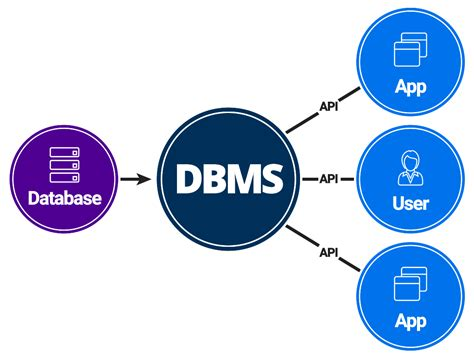

[< -- До розділу](../README.md)         [Зміст](../../contents.md)

# Доступ до баз даних зі SCADA/HMI

**Про що:**

- про 

**Що отримаєте:**

- знання 
- вміння 
- навики 

**Що потрібно знати вже:**

- Теоретичний матеріал теми [Призначення та можливості людино-машинних інтерфейсів та збирання даних в автоматизованих системах керування](../basic/README.md)
- Практичні заняття потребують послідовного виконання з минулих, якщо інше не вказано. 

**Необхідні інструменти:**

- для виконання практичних робіт потрібен ПК, все необхідне ПЗ буде надано для завантаження

**Джерела:** 

- [Посібник Розроблення людино-машинних інтерфейсів та систем збирання даних з використанням програмних засобів SCADA/HMI](https://pupenasan.github.io/hmibook/)
- [Матеріали дисципліни Людино-машинні інтерфейси](https://pupenasan.github.io/hmi)
- [Матеріали дисципліни Моніторинг виробничих операцій](https://pupenasan.github.io/monitorproduction)

## Теоретична частина

- [Доступ до баз даних зі SCADA/HMI: теоретична частина](teor.md)
- [Доступ до БД з Citect](citect.md)
- [Робота з SQL в zenon: теоретична частина](zenon.md)
- [Доступ до БД з Aveva Edge](avevaedge.md)

## Практична частина

- [Прототип: практична частина](lab.md)
- [Робота з SQL драйверами zenon: практична частина](sqlzenonlab.md)

## Перевірка знань

todo

