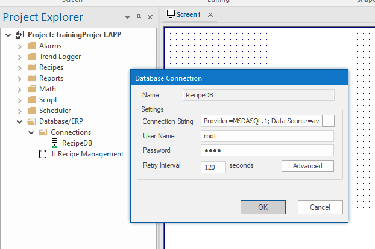
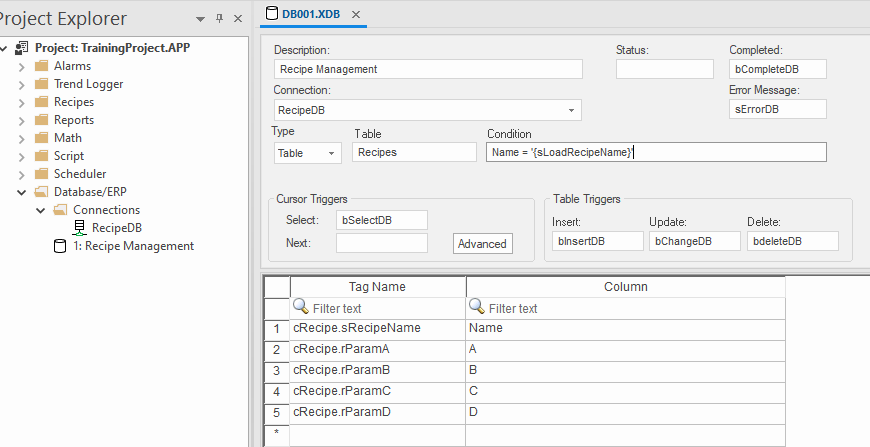

[<- До підрозділу](README.md)

# Доступ до БД з Aveva Edge

## Можливості взаємодії з зовнішніми базами даних

Aveva Edge може взаємодіяти з зовнішніми джерелами даних з використанням технології ADO.NET, яка в свою чергу має провайдерів для підключення через OLEDB чи ODBC.  Інтерфейс до бази даних підтримують наступні завдання:

- Alarms: для збереження/зчитування повідомлення історії тривог у реляційній базі даних.
- Events: для збереження/зчитування повідомлення про події в реляційній базі даних.
- Trends: для збереження/зчитування значення історії трендів у реляційній базі даних.
- Viewer: інформацію бази даних можна відображати як у форматі таблиці (об’єкти Alarm/Event  Control та Grid), так і в графічному форматі (об’єкт Trend Control).
- Web: доступні елементи у веб-інтерфейсі AVEVA Edge можуть доступатися через проект до реляційних базі даних.
- Database/ERP worksheet: для доступу до читання/запису баз даних через змінні
- вбудовані скрипти: для доступу до читання/запису баз даних через вбудовані функції 

Більшість з цих завдань передбачають налаштування зв'язування AVEVA Edge Alarms, Events чи Trends з таблицями зовнішніх баз даних через певного постачальника бази даних. Так можна налаштувати збереження даних не у файли з власним форматом від AVEVA Edge, а у зовнішні реляційні бази даних SQL. 

## Database/ERP worksheet

Для взаємодії тегів Aveva Edge з зовнішніми джерелами даних можна використати  Database/ERP worksheet з розділу Tasks. Спочатку там налаштовуються підключення до баз даних (рис.1) 

рис.1. Налаштування підключення до бази даних.

рис.2. Database worksheet 

Теоретичне заняття розробив [Олександр Пупена](https://github.com/pupenasan). 