[<- До підрозділу](README.md)		[Коментувати](#feedback)

# Робота з SQL драйверами zenon: практична частина

**Тривалість**: 

**Мета:**  

## Лабораторна установка для проведення лабораторної роботи у віртуальному середовищі.

Апаратне забезпечення, матеріали та інструменти для проведення віртуальної лабораторної роботи. 

- PC

Програмне забезпечення, що використане у віртуальній лабораторній роботі.

1. SCADA zenon
2. Maria DB 

## Загальна постановка задачі

Цілі роботи: 

- 

## Послідовність виконання роботи

### 1. Встановлення та налаштування MariaDB

- [ ] На комп'ютер або віртуальну машину з встановленою SCADA zenon Встановіть СКБД MariaDB https://mariadb.org/. При встановленні необхідно буде вказати root користувача і пароль
- [ ] Запустіть тестовий клієнт `HeidiSQL`, який поставляється разом з MariaDB. У вікні переліку сесій створіть підключення з іменем `localhost` і в налаштуваннях паролю вкажіть пароль і натисніть кнопку `Open` (рис.1)

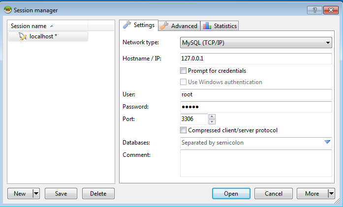

рис.1.

- [ ] Створіть нову базу даних з іменем `zenondb`

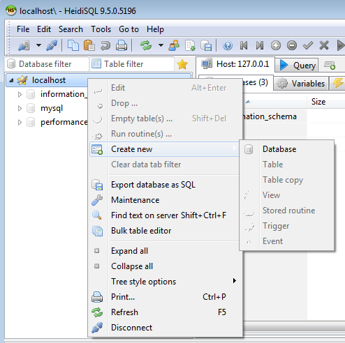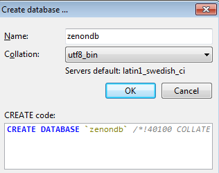

рис.2.

### 2. Встановлення драйверів та налаштування ODBC

- [ ] Встановіть драйвери ODBC для MariaDB для вашої ОС за [цим посиланням](https://mariadb.com/downloads/connectors/connectors-data-access/odbc-connector/) старі версії драйверів можна знайти за [цим посиланням](https://dlm.mariadb.com/browse/odbc_connector/). Зверніть увагу, що навіть якщо у вас 64-розрядна ОС, для даної лабораторної роботи треба ставити саме 32-розрядну версію.

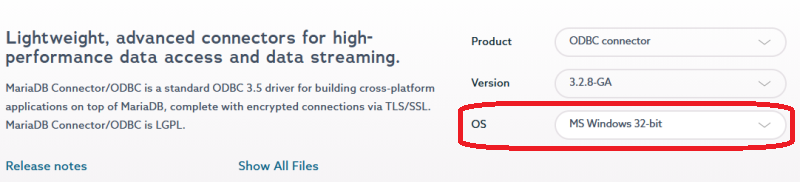

рис.3. 

Для налаштування ODBC-з’єднання необхідно використовувати **32-розрядний ODBC Administrator**, оскільки драйвери zenon є 32-бітними. 

- [ ] Відкрийте налаштування ODBC через командний рядок, для сучасних 64 розрядних систем 

```shell
C:\Windows\SysWOW64\odbcad32.exe
```

якщо у вас стара 32-розрядна операційна система, тоді

```shell
odbcad32.exe
```

- [ ] Перейдіть на вкладку `SystemDSN`, натисніть кнопку `Add` для запуску налаштування майстра (рис.4)
- [ ] Виберіть драйвер `Maria ODBC`

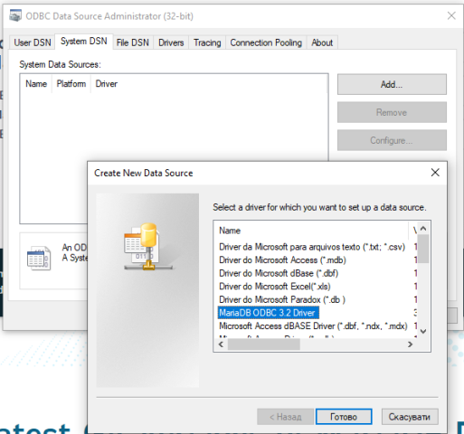

рис.4. 

- [ ] Дайте ім'я підключенню `zenondb` (рис.5) та натисніть `Next`

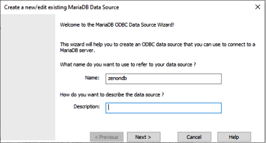

рис.5.

- [ ] Вкажіть розміщення бази даних та пароль після чого натисніть `TestDSN` (рис.6)

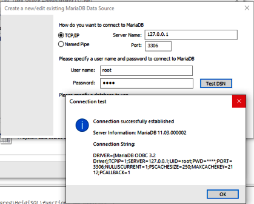

рис.6. 

- [ ] За вдалого тестування підключення у списку `Database` виберіть базу даних за замовченням `zenondb`

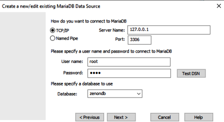

рис.7.

- [ ] Після цього використовуючи кнопки `Next`  та `Finish` завершіть роботу майстра налаштування 

### 3. Створення проєкту в SCADA zenon для запису змінних в SQL

- [ ] Створіть новий робочий простір і новий проєкт в SCADA zenon
- [ ] Добавте драйвер `Write variable values in SQL`

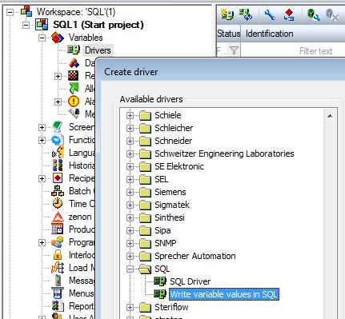

рис.8. 

- [ ] У налаштуваннях драйверу (рис.9):
  - налаштуйте зв'язок з ODBC вказавши DSN, 
  - вкажіть назву таблиці наприклад `T1`
  - добавте три змінні, які будуть писатися в таблицю, з різними типами даних 

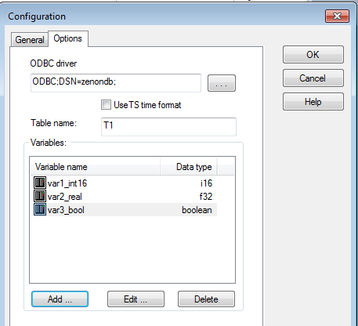

рис.9.

- [ ] Імпортуйте змінні драйверу в змінні zenon, для цього зробіть наступні дії:
  - виберіть з контекстного меню відповідний пункт (рис.10)
  - добавте усі змінні у перелік імпорту (рис.11)

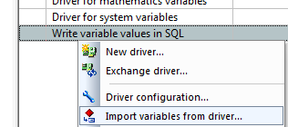

рис.10

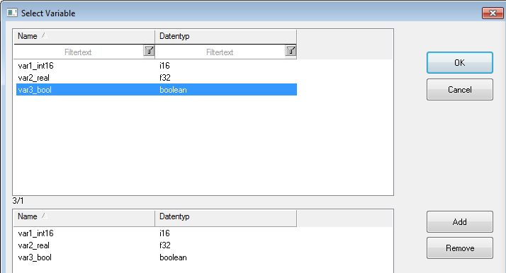

рис.11.

У Variables має з'явитися три змінні (рис.12) 

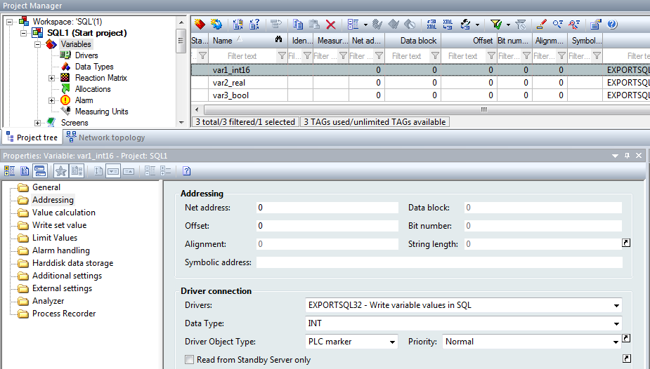

рис.12.

- [ ] Добавте тригерну змінну, зміна якої буде приводити до запису таблиці в базу даних (рис.13)

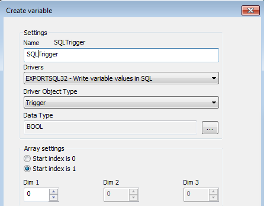

рис.13.

- [ ] Створіть функцію яка змінює значення тригерної змінної (рис.14)

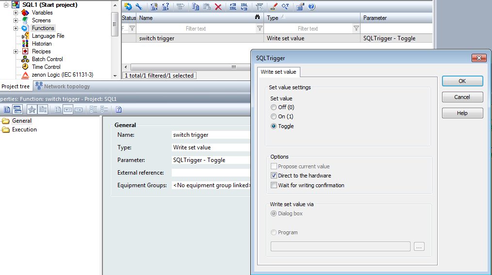

рис.14.

- [ ] Створіть Screen в якій можна відображати і змінювати значення змінних а також кнопку для запуску функції зміни тригера

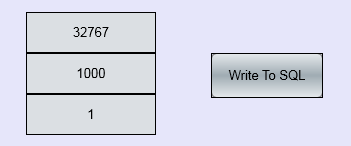

рис.15.

### 4. Перевірка роботи

- [ ] Скомпілюйте проєкт, запустіть zenon Runtime
- [ ] Змініть значення змінних і натисніть кнопку `Write To Sql`
- [ ] Відкрийте Heidi SQL і підключіться до MariaDB серверу, якщо Ви цього ще не зробили
- [ ] Використовуючи кнопки Refresh знайдіть таблицю `t1` та відповідні записи (рис.16) 

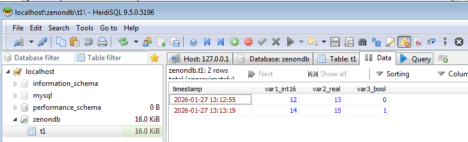

рис.16.

### 4. Робота SCADA zenon для запису змінних через SQL drv

- [ ] Ство


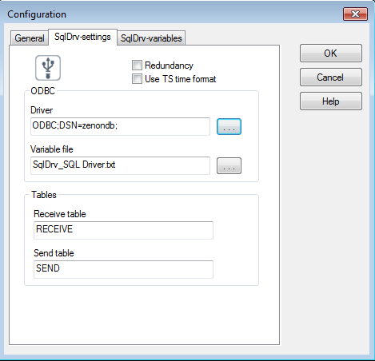

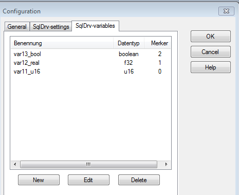

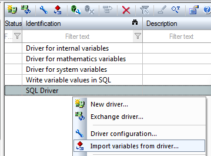

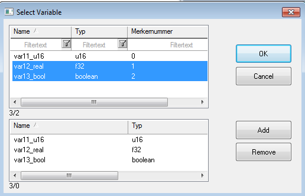


## Джерела

1. 


## Автори


Практичне заняття розробив  [Олександр Пупена](https://github.com/pupenasan). 

## Feedback

Якщо Ви хочете залишити коментар у Вас є наступні варіанти:

- [Обговорення у WhatsApp](https://chat.whatsapp.com/BRbPAQrE1s7BwCLtNtMoqN)
- [Обговорення в Телеграм](https://t.me/+GA2smCKs5QU1MWMy)
- [Група у Фейсбуці](https://www.facebook.com/groups/asu.in.ua)

Про проект і можливість допомогти проекту написано [тут](https://asu-in-ua.github.io/atpv/)