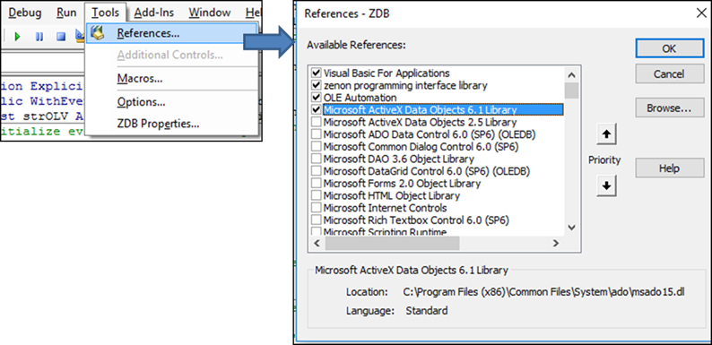
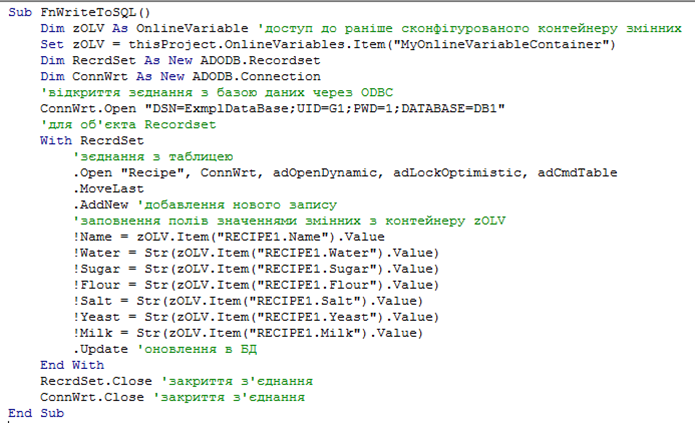

[<- До підрозділу](README.md)		[Коментувати](#feedback)

# Робота з SQL в zenon: теоретична частина

Це чернетка

## 1. ExportSQL32

### Призначення

Драйвер EXPORTSQL32 використовується для експорту значень змінних zenon у таблицю SQL бази даних через ODBC. Він забезпечує односторонній запис даних з Runtime у зовнішню базу даних і не підтримує зворотний обмін або читання значень. EXPORTSQL32 не встановлює з’єднання з PLC та не виконує опитування сигналів. Джерелом даних для нього є змінні zenon, а цільовим середовищем — SQL база даних.

Змінні типу Communication details призначені для діагностики та аналізу стану драйвера. Вони містять інформацію про версію, стан Runtime, статистику та помилки. Ці змінні не представляють технологічні дані і не пов’язані з PLC, але корисні для контролю роботи механізму експорту. 

Драйвер має низку принципових обмежень: не підтримує циклічне опитування; не підтримує пріоритети змінних; не підтримує RDA; не підтримує читання даних з SQL; не призначений для роботи в режимі реального часу.

EXPORTSQL32 доцільно використовувати у таких випадках:

- технологічне логування подій і значень;
- передача даних у зовнішні ERP, MES або BI системи;
- формування власного історіана поза zenon;
- аудит подій та трасування процесів.

EXPORTSQL32 слід розглядати як інструмент інтеграції та експорту даних, а не як засіб обміну даними з PLC. Його подієва модель, простота та незалежність від структури бази даних роблять драйвер зручним для задач логування і подальшої аналітики.

### Загальна концепція записування

Запис у базу даних здійснюється у вигляді рядків таблиці. Кожен запис містить часову мітку та значення змінних, визначених у конфігурації драйвера.

Драйвер працює за подієвим принципом. Новий рядок у таблиці створюється при записі у змінну типу trigger. Саме тригерні змінні ініціюють операцію запису. Інші змінні (marker) надають значення, які зберігаються в тому ж рядку, але не викликають запис самостійно. Така модель дозволяє фіксувати лише значущі події та уникати циклічного логування з фіксованим інтервалом.

У цільовій таблиці обов’язково має бути перша колонка з назвою `timestamp` і типом `datetime`. Якщо таблиця вже існує, драйвер перевіряє її структуру:

- зайві колонки ігноруються;
- відсутні колонки додаються автоматично;
- порядок колонок не є критичним.

Якщо таблиця з заданою назвою відсутня, драйвер створює її самостійно відповідно до своєї конфігурації. Відсутність колонки `timestamp` типу `datetime` призводить до помилки Runtime.

### Типи змінних

EXPORTSQL32 підтримує лише прості типи змінних:

- `BOOL`
- цілі типи 8, 16 та 32 біти, зі знаком і без
- `REAL`

Структури та масиви напряму не підтримуються і можуть бути експортовані лише шляхом розгортання на окремі змінні.

У драйвері EXPORTSQL32 використовуються три типи змінних:

- `PLC marker` — змінні з даними, що експортуються в SQL;
- `Trigger` — змінні, запис у які ініціює створення нового рядка в SQL таблиці;
- `Communication details` — сервісні змінні для діагностики роботи драйвера.

Запис у SQL виконується виключно при спрацюванні trigger-змінної; PLC marker змінні лише надають значення для цього запису. Змінні типу Trigger не призначені для відображення в Runtime. Вони використовуються виключно як подійні змінні для ініціювання дій, зокрема створення запису в SQL, тому елементи візуалізації, прив’язані до trigger-змінних, не відображаються.

## SqlDrv

### Призначення

SqlDrv (sqldrv.exe) забезпечує обмін даними між zenon і SQL базою даних через ODBC. На відміну від EXPORTSQL32, це двосторонній механізм.

SqlDrv доцільний, коли потрібен керований обмін через БД:

- приймання даних у zenon з зовнішньої системи через RECEIVE
- передавання команд або задань з zenon через SEND
- сценарії інтеграції, де БД є “шлюзом” між системами

Для роботи драйвера має виконуватися таке:

- файл sqldrv.exe присутній у каталозі zenon
- налаштоване ODBC-з’єднання до БД
- у БД означені таблиці `RECEIVE` і `SEND` (або створені за вимогами драйвера)

### Налаштування таблиць БД

SqlDrv працює через ODBC-підключення до SQL БД і використовує дві таблиці однакового формату:

- `RECEIVE`: zenon читає з цієї таблиці (отримує значення)
- `SEND`: zenon записує в цю таблицю (передає значення)

Назви БД і таблиць задаються у налаштуваннях драйвера.

Драйвер SqlDrv не створює SQL таблиці автоматично. Таблиці `RECEIVE` та `SEND` повинні бути створені в базі даних заздалегідь і відповідати очікуваній структурі драйвера.

Таблиці мають однаковий формат. Основні поля:

- `ID` (Long Integer): автонумерація, при вставці не задається

- `NAME` (Text): ім’я змінної, має повністю збігатися з описом змінної у драйвері (включно з пробілами)

- `DATUMZEIT` (Date/Time): часова мітка без мілісекунд, формат DD.MM.YYYY HH:mm:ss
  Особливість: якщо вказано 1970-01-01 00:00:00, драйвер підставляє поточні дату і час у Runtime

- `ZEIT_MS` (Integer): мілісекунди часової мітки

- `WERT` (Text): значення змінної (формат залежить від типу даних)

- `Status` (Number): 64 статусні біти змінної як десяткове число; 0 означає, що драйвер передає статус SPONTANEOUS у Runtime; поле не повинно бути порожнім

  Розширення для резервування (стосується RECEIVE):

- `ACK_SRV` (Number): =1 якщо прочитав сервер

- `ACK_SB` (Number): =1 якщо прочитав standby

- `INSERTZEIT` (Date/Time): час вставки рядка, зазвичай Now()

Прив’язка між даними в БД і змінними zenon виконується за унікальною відповідністю:

- текстове ім’я змінної в колонці `NAME`
- внутрішній номер пам’яті zenon (marker number з Offset)

Імена в NAME мають збігатися точно. Якщо у RECEIVE є рядок з NAME, якого немає в конфігурації драйвера, у LOG з’явиться повідомлення на кшталт “Variable not Defined: ...”.

### Конфігурація драйвера

Ключові параметри у діалозі налаштувань:

- `Drivers`: ODBC connection (рядок підключення)
- `Variable file`: файл збереження прив’язок змінних (у каталозі проєкту zenon)
- `Receive table`: назва таблиці для читання (рекомендація RECEIVE)
- `Send table`: назва таблиці для запису (рекомендація SEND)
- `Redundancy`: вмикається, якщо server і standby працюють з однією RECEIVE; тоді потрібні додаткові колонки ACK_SRV, ACK_SB, INSERTZEIT
- `Use TS time format`: використання ODBC-формату дати й часу

### Типи змінних і типи даних

Драйвер підтримує об’єкт PLC marker для типів REAL, BOOL, цілочисельних (8/16/32 біт зі знаком і без), STRING. Також доступні змінні Communication details для діагностики. Відповідність типів описана як mapping між IEC типами zenon і типами даних.

Особливості та обмеження (важливо для практики)

- Для коректної роботи з RDA (читання архівних значень) має бути зареєстрована хоча б одна не-RDA змінна з реальними значеннями (наприклад змінна на екрані або “dummy” з контролем меж). Якщо створені лише RDA-змінні, база не опитується.
- Підключення до MySQL через “MySQL ODBC Driver 3.51” не працює, оскільки цей ODBC-драйвер не підтримує dynasets.
- Максимальна довжина рядка для читання/запису 32767 символів, додатково діють обмеження конкретної БД.

SqlDrv пише повідомлення у загальні LOG-файли zenon. Для перегляду використовується Diagnosis Viewer (Diagviewer). За замовченням логуються переважно помилки, для розширеної діагностики вмикають рівні Debug або Deep Debug. Також важливо, що Diagnosis Viewer показує час у UTC, не в локальному часі.

Запис (у таблицю SEND) відбувається:
 – коли у Runtime змінюється значення змінної, прив’язаної до SEND;
 – у момент виконання функції Write для такої змінної.

Читання (з таблиці RECEIVE) відбувається:
 – циклічно, з інтервалом опитування драйвера;
 – при наявності нових рядків у RECEIVE;
 – у резервованих системах — з урахуванням ACK-полів.

## Доступ до БД зі SCADA zenon в скриптах

Для роботи із зовнішніми базами даних для записування та читання в довільному форматі у SCADA zenon необхідно скористатися скриптами у VBA або VSTA з підключенням відповідних бібліотек. 

Наприклад, для записування значень у таблицю, що означена в прикладі з параграфа 8.3.3 через інтерфейс ADO необхідно у VBA підключити бібліотеку ADODB (рис. 1) 

 

*Рис. 1.* Підключення до VBA бібліотеки ADODB

На рис. 2 показано приклад функції FnWriteToSQL, яка заносить новий запис через об’єкт Recordset та полями Name, Water, Sugar, Flour, Salt, Yeast, Milk. 

 

*Рис. 2.* Лістинг програми добавлення нових записів рецепту у VBA

Для роботи з БД з VBA можна використовувати й інші бібліотеки, що підтримують інтерфейси OLEAutomation та ActiveX. SCADA zenon має можливість працювати з ODBC через драйвер SQLDRV. Однак цей драйвер дає можливість зчитувати та записувати значення змінних у наперед сконфігуровані у відповідному форматі таблиці RECEIVE та SEND. Цей драйвер можна використовувати як інтеграційну ланку з іншими застосунками. 

## Джерела

1. 

## Автори

Теоретичне заняття розробив [Олександр Пупена](https://github.com/pupenasan). 

## Feedback

Якщо Ви хочете залишити коментар у Вас є наступні варіанти:

- [Обговорення у WhatsApp](https://chat.whatsapp.com/BRbPAQrE1s7BwCLtNtMoqN)
- [Обговорення в Телеграм](https://t.me/+GA2smCKs5QU1MWMy)
- [Група у Фейсбуці](https://www.facebook.com/groups/asu.in.ua)

Про проект і можливість допомогти проекту написано [тут](https://asu-in-ua.github.io/atpv/)