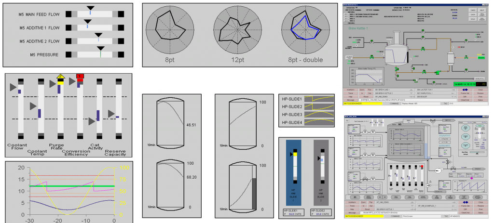

[< -- До розділу](../README.md)         [Зміст](../../contents.md)

# Графічний людино-машинний інтерфейс

**Про що:**

- про принципи розроблення графічного людино-машинного інтерфейсу з використанням SCADA/HMI

**Що отримаєте:**

- знання 
- вміння 
- навики 

**Що потрібно знати вже:**

- Теоретичний матеріал теми [Призначення та можливості людино-машинних інтерфейсів та збирання даних в автоматизованих системах керування](../basic/README.md)
- Практичні заняття потребують послідовного виконання з минулих, якщо інше не вказано. 

**Необхідні інструменти:**

- для виконання практичних робіт потрібен ПК, все необхідне ПЗ буде надано для завантаження

**Джерела:** 

- [Посібник Розроблення людино-машинних інтерфейсів та систем збирання даних з використанням програмних засобів SCADA/HMI](https://pupenasan.github.io/hmibook/)
- [Матеріали дисципліни Людино-машинні інтерфейси](https://pupenasan.github.io/hmi)
- [Матеріали дисципліни Моніторинг виробничих операцій](https://pupenasan.github.io/monitorproduction)

## Теоретична частина

- [Графічний людино-машинний інтерфейс: теоретична частина](teor.md)

## Практична частина

- [Практичне заняття SCADA zenon: Створення графічного інтерфейсу](labzenon.md)
- [Практичне заняття SCADA zenon:  Розроблення головних та контекстних меню](labzenonmenu.md)
- [Практичне заняття Citect: Основи розроблення людино-машинного інтерфейсу](labcitect.md)
- [Практичне заняття Citect: Робота з джинами та суперджинами](labcitectjenie.md)

## Перевірка знань

todo

