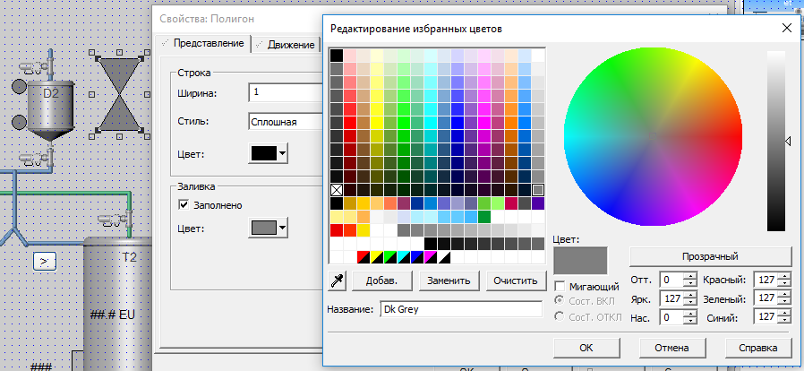
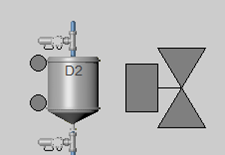
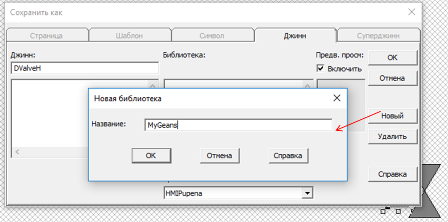
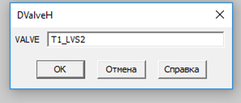
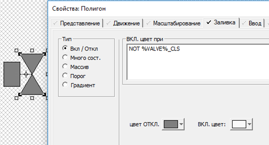
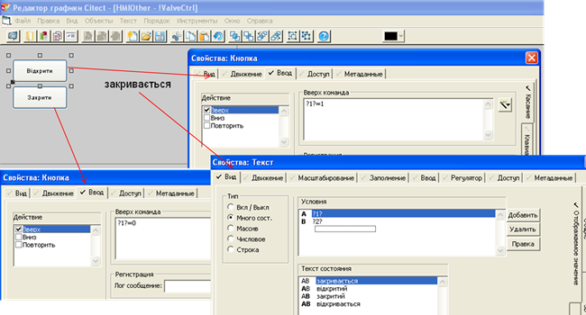

[<- До підрозділу](README.md)

# Практичне заняття Citect: Робота з джинами та суперджинами

**Тривалість**: 4 акад. години (4 пари).

**Мета:** ознайомлення з джинами та спливаючими вікнами.  

**Завдання для виконання роботи**

**Цілі.** 

1. Опанувати основні діяльності зі створення та використання джинів (Genie) та спливаючих сторінок. 

**Лабораторна установка**

- Апаратне забезпечення: ПК. 

- Програмне забезпечення: UNITY PRO V>=7.0 або Control Expert,  Citect 2016 (або новіше). **Увага! Графічна система, починаючи з Citect 2020 повністю змінена. Тому даний лабораторний практикум не призначений для версій Citect, новіших за Citect 2018R2.** 

**Примітки щодо відео: представлені в роботі відеоматеріали є студентською інтерпретацією лабораторної роботи, носять ознайомчий характер і можуть містити помилки!** 

## Порядок виконання роботи

## 1.Ознайомлення з додатками 

- [ ] Ознайомтеся з усіма додатками до лабораторної роботи:

- [Додаток 4.3. Використання анімованих елементів Джинів - (Genie)](lab4a_3.md)

- [Додаток 4.4. Використання спливаючих сторінок з вбудованою анімацією та суперджинів](lab4a_4.md)
- [Додаток 4.6.Cicode функції, що використані в лабораторній роботі](lab4a_6.md)

## 2. Підготовка імітатору на ПЛК

- [ ] Завантажте в імітатор контролера підготовлений проект Unity PRO, що описаний у файлі [Завдання](../basedesign/task.md), як це робили на попередній роботі. Якщо проект був збережений як `STU`, варто відкрити його а не файл експорту. 
- [ ] Запустіть на виконання проект в Unity PRO. Перевірте його працездатність.

## 3. Відновлення власного проекту та перевірка його роботи

- [ ] Запустіть середовище розробки Citect. 

- [ ] Якщо Ваш минулий проект не завантажено або змінено кимось іншим, зробіть відновлення свого проекту з резервної копії, збереженої минулої лабораторної роботи. 
- [ ] За необхідності, зробіть компіляцію проекту. 
- [ ] Запустіть свій проект на виконання і перевірте його працездатність, наприклад, змінюючи одну зі мінних у Citect і перевіряючи ці зміни в імітаторі ПЛК.   

## 4. Створення анімованого зображення для клапану

У цьому пункті необхідно зробити зображення клапану, який буде показувати значення команди що одається на виконавчий механізм і його стан. 

- [ ] Відкрийте сторінку "Tanks". Налаштуйте привязку до сітки.
- [ ] Використовуючи полігон, нарисуйте зображення регулюючого органу (рис.4.1). Краще рисувати у великому розмірі, потім його можна буде зменшити. Для рисування полігону зробіть наступні дії:
  - [ ] перший сегмент рисується утриманням лівої кнопки миші
  - [ ] наступні сегменти одинарном кліком миші
  - [ ] для завершення полігону робиться подвійний клік



Рис.4.1. Рисування полігону та його заповнення

- [ ] Налаштуйте заповнення полігону сірим кольором "Dk Grey"(у палітрі RGB 127,127,127). Прямокутник на клапані показує команду на виконавчий механізм. 

- [ ] Нарисуйте прямокутник та лінію для зображення ВМ клапану (рис.4.2).



Рис.4.2. Зображення клапану

- [ ] Зробіть анімацію кольору прямокутника з прив’язкою до `T1_LVS2` (набір першого танку): при 0 – сірий, при 1 – свтіло-сірий (250,250,250).
- [ ] Збережіть сторінку. Запустіть проект на виконання і перевірте роботу анімації клапану, запустивши програму приготування. 

<iframe width="560" height="315" src="https://www.youtube.com/embed/AmLyBPnw3To" title="YouTube video player" frameborder="0" allow="accelerometer; autoplay; clipboard-write; encrypted-media; gyroscope; picture-in-picture" allowfullscreen></iframe>

## 5. Створення джину для клапану

У цьому пункті створюється для клапану джин - анміований символ. 

- [ ] Уважно прочитайте [Додаток 4.3. Використання анімованих елементів Джинів - (Genie)](lab4a_3.md) 
- [ ] Створіть новий джин: в редакторі графіки "Файл"->"Новый"->"Джин" 
- [ ] Перенесіть створені до цього елементи зображення клапану в джин і розмістіть їх по центру (пказаний сепціальним символом). 
- [ ] Замініть прив’язку `T1_LVS2` на `%VALVE%`. 
- [ ] Збережіть джин з іменем "DValveH" у бібліотеці MyGeans. 



Рис.4.3. Збереження джину

<iframe width="560" height="315" src="https://www.youtube.com/embed/FDv-j_e3f4g" title="YouTube video player" frameborder="0" allow="accelerometer; autoplay; clipboard-write; encrypted-media; gyroscope; picture-in-picture" allowfullscreen></iframe>

## 6. Використання джину для клапану

- [ ] На сторінці "Tanks" помістіть біля одного з дискретних клапанів (наприклад T1_LVS2) джин "DValveH". Для цього використайте елемент вставки джину і виберіть його з Вшої бібліотеки.
- [ ] При вставці джина вкажіть назву тегу для клапану (наприклад T1_LVS2), як показано на рис.4.4



Рис.4.4. Вказівка замінника

- [ ] Зменшіть вставлений джин до необхідного розміру.
- [ ] Скопіюйте вставлений джин для всіх дискретних клапанів і розмістіть їх поряд з існуючими.
- [ ] Прив’яжіть їх до відповідних значень змінних тегів. Для зміни значення заміннка необхідно клікнути подвійним кліком по ньому. 
- [ ] Збережіть сторінку, скомпілюйте і перевірте її роботу. Для спрощення перевірте в прискореному режимі імітації. 
- [ ] Після перевірки видаліть старі зображення клапанів і розмістіть на їх місці створені джини. Для точного позиціонування можна відключити привязку до сітки. 

<iframe width="560" height="315" src="https://www.youtube.com/embed/R7x-MfYTof8" title="YouTube video player" frameborder="0" allow="accelerometer; autoplay; clipboard-write; encrypted-media; gyroscope; picture-in-picture" allowfullscreen></iframe>

## 7. Зміна джину для відображення стану

У цьому пункті необхідно змінити джин таким чином, щоб зображення клапану показувало стан кінцевого положення датчика закриття. 

- [ ] Відкрийте редактор джину для редагування клапану.
- [ ] Для полігона визначте анімацію, як це показано на рис.4.5. 



Рис.4.5 Налаштування анімації полігону

- [ ] Збережіть джин.
- [ ] Збережіть сторінку "Tanks", скомпілюйте проект і перевірте її роботу.

<iframe width="560" height="315" src="https://www.youtube.com/embed/7JpJFCsqOQo" title="YouTube video player" frameborder="0" allow="accelerometer; autoplay; clipboard-write; encrypted-media; gyroscope; picture-in-picture" allowfullscreen></iframe>

## 8. Створення спливаючої сторінки 

У цьому пункті необхідно зробити сторінку керування клапаном, що буде показуватися у діалоговому вікні при натисканні на зображення клапану.    

- [ ] Уважно прочитайте [Додаток 4.4. Використання спливаючих сторінок з вбудованою анімацією та суперджинів](lab4a_4.md)

- [ ] Створіть сторінку на основі шаблону "blank" з наступними властивостями:  

Таб.4.1.Налаштування сторінки.

| **Властивість** | **Значення**       |
| --------------- | ------------------ |
| Ширина          | 400                |
| Висота          | 200                |
| Колір           | Color80  (сірий)   |
| Заголовок вікна | Керування клапаном |

- [ ] Розмістіть на сторінці дві кнопки та числове поле (рис.4.6). 
- [ ] Налаштуйте анімацію кнопок таким чином, щоб асоціація `1` використовувалася для команди керування клапаном: 
  - [ ] присвоєння 1 при натисканні "Відкрити"
  - [ ] присвоєння 2 при натисканні "Закрити" 
- [ ] Налаштуйте анімацію числового поля таким чином, щоб асоціація `2` використовувалася для відображення положення клапана (див. рис.4.6) 



 Рис.4.6 Налаштування сторінки

- [ ] Розмістіть на сторінці кнопку для закриття вікна з написом "Ок"
- [ ] Використайте анімацію "Касание", яка запускає функцію `WinFree` (див. [Додаток 4.6.Cicode функції, що використані в лабораторній роботі](lab4a_6.md)) що закриває плинне вікно. 
- [ ] Збережіть сторінку з іменем `!ValveCtrl`. Символ `!` напочатку назви робить сторінку невидимою в списку (системною).

<iframe width="560" height="315" src="https://www.youtube.com/embed/Psq6l9i6a4Q" title="YouTube video player" frameborder="0" allow="accelerometer; autoplay; clipboard-write; encrypted-media; gyroscope; picture-in-picture" allowfullscreen></iframe>

## 9. Звязування сторінки з тегами та її виклик

У цьому пункті необхідно налаштувати джин так, щоб він викликав сторінку, попредньо налаштувавши там асоціації. 

- [ ] Уважно прочитайте  [Додаток 4.6.Cicode функції, що використані в лабораторній роботі](lab4a_6.md) 
- [ ] Відкрийте реадактор джину клапану.
- [ ] Для прямокутника (зображення ВМ) використайте анімацію "Касание" для означення відкриття сторінки керування клапаном з передачею туди замінників (див.рис.4.7). Зверніть увагу на те, що замінники у функції `AssPopUp` беруться у подвйні лапки.  

```
AssPopUp ("!ValveCtrl", "%VALVE%", "%VALVE%_CLS")
```


Рис.4.7 Налаштування анімації відкриття сторінки керування клапаном

- [ ] Збережіть послідовно одну за одною: спливаючу сторінку, джин, сторінку "Tanks".
- [ ] Скомпілюйте та запустіть на виконання проект.
- [ ] Зупиніть виконання автоматичного приготування (натиснувши кнопку "Пуск").
- [ ] Натискаючи на зображення ВМ клапанів перевіте як працює вікно керування. 

<iframe width="560" height="315" src="https://www.youtube.com/embed/_I7ML4T4KtA" title="YouTube video player" frameborder="0" allow="accelerometer; autoplay; clipboard-write; encrypted-media; gyroscope; picture-in-picture" allowfullscreen></iframe>


## 10. Створення резервної копії проекту

- [ ] Зробіть резервну копію проекту, скопіюйте її на змінний носій або на хмарному сховищі. У випадку роботи в лабораторії – покажіть викладачу, і з його відома видаліть свій проект. 

## Питання до захисту 

1. Розкажіть та покажіть на прикладах механізми використання джинів.
18. Розкажіть та покажіть на прикладах механізми використання суперджинів та спливаючих сторінок з     асоціаціями.

 Практичне заняття розробив [Олександр Пупена](https://github.com/pupenasan) 
