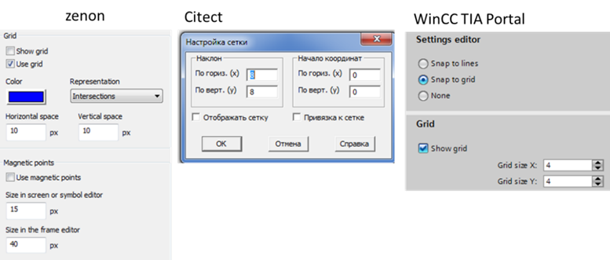
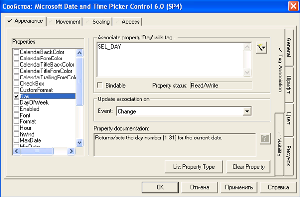
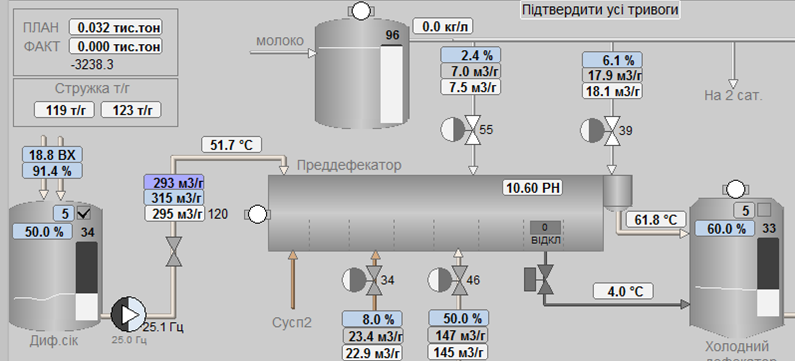
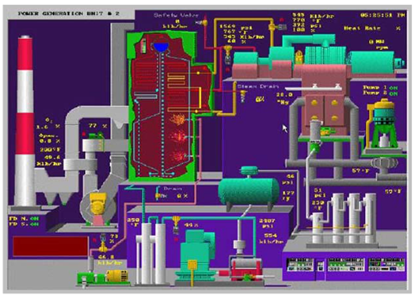
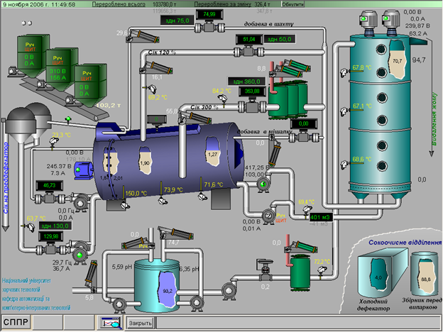

[<- До підрозділу](README.md)

# Графічний людино-машинний інтерфейс

## 1. Основи побудови ефективних людино-машинних інтерфейсів 

### 1.1. Модель контура контролю та керування 

Людина в системах автоматизованого керування відіграє важливу роль у безпечному та ефективному проходженні технологічного процесу. HMI в цьому повинен допомогти в ранньому виявленні, діагностиці та правильному реагуванні на нештатну ситуацію. Тому для розроблення високоефективних людино-машинних інтерфейсів необхідно чітко розуміти усі фактори, що впливають на процеси усвідомлення ситуації людиною, прийняти рішення та реалізувати дії. Щоб отримати інформацію про загальний стан процесу, оператор з надзвичайно великої кількості контрольованих ним сигналів повинен виділити найбільш пріоритетні, на основі чого прийняти й реалізувати правильні рішення.   

Розглянемо контур контролю та ручного/супервізорного керування в системі як комплекс взаємопов’язаних функцій (рис. 1). Інформація від об’єкта керування (ОК) проходить ряд перетворень і зрештою замикається на ньому через дію оператора: 

- вимірювання значення даних, які необхідно контролювати з об’єкта керування;

- оброблення даних на пристрої збору (наприклад ПЛК);

- зчитування даних з пристрою збору та їх оброблення  в базі даних реального часу (БДРЧ);

- зчитування даних з бази даних реального часу та їх оброблення в інших підсистемах;

- відображення стану в підсистемі HMI;

- сприйняття оператором інформації; 

- усвідомлення стану оператором (ситуаційна обізнаність) ;

- прийняття рішень оператором;

- реалізація керуючих дій. 

Оператор повинен якнайшвидше зорієнтуватися в ситуації, яка є на даний момент, прийняти рішення і реалізувати керуючу дію. Контроль та дія можуть відбуватися як через засоби супервізорного спостереження та керування (тобто через SCADA/HMI), так і безпосередньо на об’єкті (тобто за допомогою візуального, аудіального, органолептичного і т.п. сприйняття та ручних засобів керування). Дії оператора через SCADA/HMI записуються в журнал. 

<a href="media/5_1.png" target="_blank"></a> 

*Рис. 1.* Модель контуру контролю та керування з використанням SCADA/HMI 

Виділені у наведеному вище переліку напівжирним шрифтом процеси стосуються безпосередньо оператора і повинні обов’язково враховуватися при розробленні SCADA/HMI. Враховуючи, що саме оператор є особою, яка приймає рішення та реалізує керування, необхідно розроблювати системи таким чином, щоб максимально сприяти правильності та швидкості прийняття рішень, а також швидкості їх реалізації. Для цього необхідно забезпечити:

1)   отримання даних з об’єкта з необхідною швидкістю (частотою, періодичністю);

2)   отримання інформації про достовірність/доступність даних;

3)   оброблення даних для сприйняття людиною; 

4)   представлення даних на засобах HMI у потрібному контексті;

5)   допомогу в прийнятті рішень;

6)   швидкий доступ до елементів керування;

7)   уникнення помилкових дій.   

При цьому необхідно враховувати внутрішні та зовнішні чинники, а також досвід операторів. Слід зазначити, що розробники SCADA/HMI часто не враховують частини з наведених вище вимог. 

Розроблення високоефективних HMI тісно пов’язане з ергономікою, яка є окремою дисципліною, тому її розгляд виходить за рамки посібника. Окрім вимог до HMI, ергономіка розглядає інші, не менш важливі, а навіть первинні фактори. З питаннями ергономіки в HMI можна ознайомитися у праці Анохіна та Івкіна [2]. Далі розглянемо тільки деякі рекомендації, означені в стандарті ISA-101 [[1](https://www.isa.org/products/ansi-isa-101-01-2015-human-machine-interfaces-for)].

Виділимо три складові, які впливають на ефективність роботи оператора:

1)   правильне усвідомлення ситуації (ситуаційна обізнаність);

2)   правильне прийняття рішень;

3)   достатній час для усвідомлення, прийняття рішень та безпомилкової реалізації керуючої дії

У наступних параграфах розглядаються фактори, що впливають на ситуаційну обізнаність у розроблювальних HMI, а також на взаємодію з користувачем. На правильність прийняття рішень оператором також впливає використання інших підсистем – тривожної сигналізації, трендів, формування допомоги, підтримка прийняття рішень і т. п. Не менш важливими факторами є первинне навчання операторів, періодичні тренінги, аналіз минулих ситуацій і т. п., які є частиною життєвого циклу системи.   

### 1.2. Ситуаційна обізнаність 

Як зазначено у стандарті ISA-101  [[1](https://www.isa.org/products/ansi-isa-101-01-2015-human-machine-interfaces-for)], проведення досліджень показали, що недостатня ситуаційна обізнаність була одним із основних факторів нещасних випадків, пов’язаних із помилками людини. Під ***ситуаційною обізнаністю* (**усвідомленням ситуації) розуміють не тільки сприйняття теперішнього стану об’єкта, а й прогнозування на майбутнє. Оператор повинен реагувати на відхилення стану від бажаного, який задається інструкціями, порадами та навіть власним досвідом. При отриманні інформації необхідно враховувати сенсорні можливості та обмеження користувача в її сприйнятті, що зумовлено як його суб’єктивними властивостями, так і зовнішніми обставинами (див. рис. 1). На продуктивність користувача та основні когнітивні процеси (здатність розуміти, пізнавати, вивчати, усвідомлювати, сприймати і перероблювати зовнішню інформацію) впливає рівень завантаженості роботи, усвідомлення ситуації та складність завдання, кожен з яких може бути оптимізоване засобами HMI.

Одна з основних ідей побудови високоефективних HMI ґрунтується на тому принципі, що **за нормального функціонування процесу дисплеї повинні проявляти мінімальні сенсорні стимулювання, тобто не привертати до себе уваги**. І навпаки, **коли процес відхиляється від норми, засоби HMI повинні проявляти візуальні та звукові активності**. Для цього можна скористатися кольором, яскравістю та контрастністю елементів, взаємним їх розміщенням, рухом, блиманням чи миготінням, видимістю та звуковими оповіщеннями. Далі розглянемо рекомендації стандарту щодо використання цих властивостей.  

**Використання кольору, яскравості та контрастністю**

   Конструкція HMI повинна враховувати візуальні обмеження групи користувачів у середовищах, де повинні виконуватися завдання, пов'язані з процесом (робоче місце оператора). При виборі засобів HMI, кольорів та контрастів дисплеїв та елементів необхідно враховувати зовнішнє освітлення. У нормальному стані процесу елементи HMI не повинні бути надмірно контрастними, однак за необхідності інформація повинна чітко сприйматися. Під час проектування слід враховувати потенційні недоліки або відсутність сприйняття кольорів операторами. Відмінності в кольоровому сприйнятті для поширених типів колірної сліпоти (дальтонізму) показані на рис. 2 [[3](https://uk.wikipedia.org/wiki/%D0%94%D0%B0%D0%BB%D1%8C%D1%82%D0%BE%D0%BD%D1%96%D0%B7%D0%BC)]. 

 

*Рис. 2.* Відмінності кольорового сприйняття для найбільш поширених типів дальтонізму

Слід використовувати відповідний диференційний контраст і яскравість. Для всіх користувачів вибрані кольори повинні відрізнятися один від одного і мають бути перевірені на зручність використання. Як правило, колір слід використовувати для підкреслення ключової інформації, такої як тривоги та аномальні умови. Зверніть увагу, що при використанні зеленого та червоного кольорів у якості позначення увімкненого та вимкненого обладнання для більшості людей з дальтонізмом сприймаються практично однаково. Тому для розділення елементів можуть бути використані їх контраст та яскравість, наприклад, білий іде в контрасті з темно-сірим (як відтінок білого). На рис. 3 показано приклад використання позначення контрастності та яскравості замість кольору для стану насосів.

 

*Рис. 3.* Використання контрастності та яскравості замість кольору 

Корисно перевірити кольорове зображення, перетворивши його на градації сірого, щоб переконатися, що всі комбінації елементів мають достатній контраст, який може виявити користувач з дальтонізмом.

Кольори, які використовуються для індикації тривоги відповідно до методології тривожної сигналізації ISA-18.2 (див. розділ 6), слід резервувати і не використовувати з будь-якою іншою метою. Це необхідно для усунення плутанини та швидкості реакції оператора на тривогу. Тим не менше, на колір не слід покладатися як на єдиний показник важливості умови. Кольорове кодування повинно дублюватися іншими способами подання інформації, включаючи форму, текст, яскравість, розмір і текстуру. На рис. 4 для відображення попереджувального рівня, окрім жовтого кольору, використовується поява трикутника із зображенням рівня пріоритету. 

 

*Рис. 4.* Використання форми (трикутник) в якості відображення тривоги 2-го пріоритету

Вибір кольорів, які використовуються на дисплеї, повинен відображати важливість поданої інформації: для найбільш важливої інформації слід використовувати найбільш помітні кольори. Градієнти кольорів не повинні використовуватися на дисплеї для статичних або нединамічних елементів, але можуть застосовуватися, щоб виділити динамічний елемент. Колір та/або миготіння символів мають спрямовувати увагу оператора на нові критичні ситуації.

Фон дисплею повинен мати ненасичений або нейтральний колір (наприклад, сірий), щоб обмежити хроматичні спотворення і забезпечити виразність відображеної на ньому інформації. У більшості застосувань слід уникати використання кольорів фону, які можуть викликати надмірний контраст, наприклад, чорного. При цьому колір фону має бути таким, щоб забезпечити прийнятний і достатній контраст в очікуваних умовах освітлення. Комбінації кольорів переднього плану та фону повинні забезпечувати достатній контраст для виділення елементів. У табл. 1 наведено приклад вибору призначених кольорів. Таблиця свідомо має задній фон кольору фону дисплею для сприйняття контрастності інших кольорів. На рис. 5 наведено приклад використання кольорів. Слід зазначити, що такий перелік кольорів не означений стандартом і наведений тільки як приклад. 

Таблиця 1. 

**Приклад вибору призначення кольорів.**

<a href="media/t5_1.png" target="_blank"></a> 

<a href="media/5_5.png" target="_blank"></a> 

   *Рис. 5.* Використання кольорів на дисплеях 

На рис. 6 показано варіанти з різним вибором кольору [[4](http://wilmingtonisa.org/files/Download/ISA-Applying-ISA101-to-Existing-HMIs_MikeHawrylo.pdf)]. Верхній варіант більш яскравий, можливо, навіть більш привабливий, однак він не дасть змоги швидко звернути увагу на аварійний рівень, якщо його підсвітити іншим кольором. 

 

*Рис. 6.* Порівняння використання кольорів на дисплеях 

Якщо серед операторів є люди похилого віку, то слід враховувати також вікові недоліки зору. Розміщення та регулювання моніторів має враховувати використання різних лінз, що коригують зір. 

**Щільність**

Слід враховувати можливість сприйняття людиною інформації з дисплеїв при високій щільності (великій кількості елементів на одиниці площі). Необхідно виводити відповідну інформацію, яку оператор може швидко інтерпретувати, уникаючи зайвого. Елементи дисплея мають розташовуватися послідовно в просторі, щоб уникнути захаращення. Для цього проводять: 

- консолідацію (гуртування) різних об’єднаних процесом даних у єдиний інформаційний компонент, що робить меншу щільність на дисплеї;

- використання стилю дисплею (див. підрозділ 2), більш ефективного для інтерпретації оператором;

- надають деяку інформацію лише за вимогою (наприклад, через контекстне меню);

- розділення одного дисплея на декілька.

Послідовне об'єднання даних в єдину групу при сприйнятті людина оброблює як єдиний об'єкт, прискорюючи його реакцію. Про це детальніше можна ознайомитися в підрозділі 8.

**Рух, блимання, миготіння та видимість**

Через обмеження сприйняття на дисплеях може бути ефективно використана лише обмежена кількість кольорів. Тому для привернення уваги оператора до конкретної інформації можна застосовувати такі методи візуального динамічного кодування: рух, блимання (blinking, типу видимість-невидимість), миготіння (flashing, зміна кольору) та умовну видимість. Однак при цьому треба врахувати ряд обмежень:

- блимання повинно бути зарезервоване для предметів, які призначені для появи та зникнення, наприклад, символів або меж для непідтвердженої тривоги; 

- текст і цифри самі по собі не повинні рухатись або блимати, оскільки зміна положення чи кута або чергування появи та зникнення тексту чи цифр утруднюють їх читання; 

- жодна частина дисплея не повинна блимати або миготіти, якщо від оператора не вимагається реакції на це; використання візуальної динаміки має бути зарезервоване для висвітлення аномальних ситуацій або ситуацій, що потребують уваги оператора (наприклад, тривоги);

- операторові повинні бути надані засоби для зупинки блимання або миготіння.

**Звукові сповіщення**

Візуальні попередження повинні дублюватися звуковими, зокрема при появі нової тривоги, неправильній дії по введенню, помилці HMI або неможливості виконати відправлену команду. Звукові сповіщення повинні допомагати спрямовувати оператора в місце виникнення ситуації і не заважати його нормальній роботі. При проектуванні необхідно також враховувати шуми довкілля.

Значення кожного звукового сигналу має бути чітким та однозначним. Звукові сповіщення повинні виникати безпосередньо на консолі оператора і бути достатньо гнучкими для їх сприйняття, але не сильно гнучкими, щоб не відволікати операторів інших консолей у тому самому пункті керування. Слід передбачити спосіб заглушити звуковий сигнал після його підтвердження оператором. Якщо операторові не потрібно постійно знаходитись у безпосередній близькості від консолі HMI, то слід застосовувати альтернативні методи, що охоплюють усі передбачувані робочі зони. 

### 1.3. Взаємодія з користувачем  

При реалізації керуючих дій, а також для отримання більшої кількості інформації для ситуаційної обізнаності оператор постійно взаємодіє через засоби HMI. Правильна організація взаємодії є не менш важливою, ніж правильна організація відображення чи сповіщення. Методи досягнення ситуаційної обізнаності та взаємодії з користувачем мають бути прописані у методології HMI, бажано ще на стадії технічного завдання. Згідно зі стандартом ISA-101, при організації взаємодії з користувачем застосовуються методи:

- введення даних та команд;

- навігації;

- уникнення помилок;

- організації доступу користувачів;

- позасистемних повідомлень.

При розробленні інтерактивних елементів HMI слід намагатися уникати складної взаємодії, тобто такої, що потребує великої кількості дій. Інтерактивні елементи мають підпорядковуватися загальному розробленому правилу, щоб дія оператора приводила до очікуваної реакції. При цьому елементи повинні візуально або/та аудіально якомога швидше реагувати на дію, щоб оператор мав можливість отримати зворотній зв'язок. Повідомлення про помилку введення або блокування команди повинні виділятися за стилем від інших повідомлень.     

Нижче подано деякі пропозиції щодо організації взаємодії з оператором, які взяті з ISA-101 і є рекомендованими (необов’язковими). Методи навігації наведені в підрозділі 7.  

**Методи введення даних та команд**

Інтерактивні елементи, або компоненти, включають у себе усі засоби HMI, що реагують на дію оператора, зокрема: елементи введення, кнопки, опції, списки, командні графічні елементи/компоненти (що реагують на натискання), елементи приладових панелей та спливаючих вікон. У першому розділі ці елементи були перераховані з точки зору оператора, тут зупинимося на рекомендаціях щодо їх проектування. 

Для елементів  введення даних та команд рекомендується використовувати візуальні підказки про доступний метод введення. При наведенні вказівника на елемент, що приймає команди, бажано використовувати зміну вигляду курсору, а при його виділенні – він повинен набувати чіткого видимого позначення знаходження "у фокусі". Заблокований для введення чи команди елемент повинен мати інший колір (наприклад сірий).      

Якщо введене значення має неправильний формат, воно повинно бути відхилено, про що операторові повинно бути повідомлено візуально та/або звуком. У випадках, якщо для забезпечення обмежень щодо введення даних застосовуються методи уникнення помилок, слід повідомити про причини відхилення.

Уведення даних та команд не повинно заважати відображенню на активному дисплеї. Для цього рекомендується використовувати вбудовані елементи цього самого дисплея, спливаючі екрани, лицьові панелі (faceplate) які потребують тільки частини простору дисплея. Відкривати інший дисплей слід тільки за необхідності навігації за процесом. 

Для елементів із числовими даними необхідно забезпечувати можливість введення та відображення із заданою точністю (кількість знаків після коми) та вказувати знак (де це потрібно). Оператор повинен постійно, або через підказку бачити інженерні одиниці вимірювання введеного/відображеного значення. Вводити значення необхідно в тих самих інженерних одиницях, що відображаються. Після введення протягом короткого часу значення повинно бути відображене (при позитивному результаті) або має з’явитися повідомлення про причину відхилення.      

Для елементів введення та відображення тексту необхідно: забезпечувати вирівнювання в полі для зручності читання; уникати використання слів, написаних прописними літерами, оскільки вони погано читаються (за винятком абревіатур або службових слів); уникати скорочень та абревіатур, невідомих оператору; уникати підкреслень, які варто використовувати для гіперпосилань; текст відображати в напрямку звичного читання (горизонтально); за можливості при введенні вибирати текст із доступного набору.  

Командні елементи (що сприймають дії оператора від клавіатури, миші, торкання і т. п.) повинні візуально виділятися від звичайних (не інтерактивних) елементів. Якщо команди  призводять до прямої дії в процесі (наприклад відкриття клапана), вони повинні вимагати від оператора декількох вхідних дій (наприклад, додаткового підтвердження або натискання додаткової кнопки клавіатури), щоб уникнути ненавмисного виклику команди. Якщо команда передбачає кількох виборів опцій оператором, то її виконання повинен підтверджувати оператор для всього списку дій (наприклад, вибір нового рецепта та підтвердження джерел і напрямків продукту). При цьому для великої кількості опцій їх рекомендується візуально групувати. Якщо команда складна і передбачає реакцію процесу на певних кроках, то рекомендується використовувати діалогові вікна команд. Рекомендується передбачати засоби відміни відправленої команди або/та повернення до попередньої конфігурації. Ряд команд, як і елементи введення, можуть потребувати обмеження на їх виконання. У цьому разі у випадку невиконання команди оператору мають бути повідомлені причини. У будь-якому випадку оператор повинен побачити (почути) результат виконання команди. 

Для виконання команд, запуску програм чи навігації можуть використовуватися кнопки. Ці типи кнопок повинні візуально відрізнятися між собою. Кнопки мають бути достатньо великого розміру, щоб користувачі могли швидко й точно вибирати їх із тим вказівним пристроєм, який планується використовувати. Якщо кнопка недоступна за певних причин, вона повинна залишатися видимою, але мати характерний вигляд (наприклад сірий напис). Для кнопок, що запускають певний процес або програму, може бути потрібне додаткове підтвердження.

Для діалогів рекомендується використовувати спливаючі вікна (pop-up window), які не повинні займати велику частину екрана, щоб не заважати перегляду основного дисплея. Альтернативою можуть бути лицьові панелі (faceplate), які розміщені на спеціально виділеній частині загального дисплея, що змінюються залежно від вибраного контексту. При використанні кількох спливаючих вікон або панелей оператор повинен чітко бачити, яке з них має фокус введення. Для спливаючих вікон рекомендується використовувати період очікування, після якого, за відсутності дії оператора, вікно саме закривається.

**Методи уникнення помилок**

При проектуванні HMI слід приділити увагу методам уникнення помилок при введенні та додатковим підтвердженням. Вони потрібні для уникнення неправильно введених оператором даних (наприклад, вихід значення за дозволений діапазон), випадкового виклику команд, а інколи для внесення в журнал причини виклику команди. Тим не менше, методи уникнення помилок не повинні надмірно перешкоджати операторам швидко робити зміни та бути інтуїтивно зрозумілими. Ці методи разом з іншими мають бути описані в методології HMI.

Як уже зазначалося, при контролі введення та команд оператор повинен бачити результат – як позитивний, так і негативний. Це може бути у формі візуальної зміни, звукового сигналу або їх комбінації. У ряді випадків може бути потрібне спливаюче вікно з повідомленням.   

Якщо команди потребують додаткового підтвердження, це може бути реалізовано через прості діалогові вікна з кнопками типу "так" та "відміна". Тим не менше, в ряді випадків може бути потрібна вказівка причини запуску команди, наприклад, через уведення тексту або вибір опції. Для дуже відповідальних об’єктів може знадобитися уведення паролю або навіть автентифікація користувача через сканування біометричних даних (наприклад, відбиток пальця або сканування сітківки ока), які описані в підрозділі 8.7.  

**Методи позасистемних повідомлень**

Для взаємодії з операторами або обслуговуючим персоналом, що за якихось причин не перебувають у зоні дії HMI, використовуються позасистемні повідомлення (Off-system messaging). До них можна віднести:

- голосові повідомлення автовідповідача;

- віддалені тривоги;

- повідомлення пейджерів, SMS;

- електронні листи;

- інші.

Так само, як і інші методи, вони є частиною методології HMI, в якій повинні також бути прописані способи кодування та, за необхідності, зарезервовані канали позасистемних повідомлень. 

Обмін із суміжними системами детальніше розглядається в розділі 9 посібника.

**Методи організації доступу користувачів**

Підсистема організації користувачів розглядається в підрозділі 8.7 посібника; тут зупинимося на основних рекомендаціях щодо організації доступу до інтерактивних елементів. Стандарт ISA-101 передбачає, що в системі HMI виділяється кілька рівнів доступів, які ґрунтуються на ролях та привілеях, відповідно за якими обмежується використання елементів різними користувачами. Автентифікація може проводитися як за ім'ям та паролем, так і на підставі біометричних даних. Для організації доступу можуть використовуватися також електронні підписи. Може бути передбачено обмеження доступу залежно від місця входження користувача.    

Стандарт передбачає можливість тимчасового входу в систему (тільки на час виконання дії), якщо необхідно виконати високопріоритетну команду.  

Дії користувача можуть фіксуватися в журналі разом із його обліковими даними та за необхідності – з його примітками. 

## 2. Дисплеї

У першому розділі сказано, що робота графічної підсистеми ґрунтується на дисплеях, які в різних середовищах розроблення можуть називатися сторінками, екранами, мнемосхемами або відображеннями. У стандарті ISA-101 використовується саме термін Display. Ми надалі будемо вживати слова, які вважатимемо синонімами: ***дисплей*, *дисплейна сторінка*** або ***сторінка***. Для прикладу конкретної програми SCADA/HMI буде вживатися прийнятий у ній термін. 

Більшість АРМ потребують багатосторінкового інтерфейсу. Це викликано необхідністю відобразити велику кількість даних, які неможливо помістити на одній дисплейній сторінці. Деякі стилі передбачають використання одного дисплея, в межах якого в певних місцях екрана переключаються сторінки залежно від контексту.  

Дисплейні сторінки за призначенням умовно можна розділити на такі типи:

- технологічні (наприклад, сторінка відділення фільтрації; сторінка станції приготування, тощо); 

- діагностичні та тривогові (наприклад, сторінка списку активних тривог; сторінка списку повідомлень; сторінка стану приводу);

- трендові (наприклад, сторінка історичних трендів);

- звітні (наприклад, сторінка звіту приготування продукту; сторінка із загальними показниками ефективності процесу (KPI)); 

- налагоджувальні (наприклад, карта ПЛК; налаштування ПІД-регулятора контуру температури); 

- конфігураційні (наприклад, параметри роботи фільтра; налаштування роботи виконавчих механізмів). 

Стилі відображення дисплейних сторінок відрізняється залежно від призначення. У стандарті ISA-101 виділено стилі, показані в табл. 2.

*Таблиця 2.* 

**Типи стилів дисплейних сторінок**

| **Тип стилю**                                           | **Опис**                                                     | **Приклад  застосування**                                    | **Приклад  зовнішнього вигляду**                             |
| ------------------------------------------------------- | ------------------------------------------------------------ | ------------------------------------------------------------ | ------------------------------------------------------------ |
| Список  (List)                                          | Рядки  або списки з даними. Текстові і числові дані можуть змішуватися із символами  технологічного обладнання | Таблиця  технологічних змінних із відображенням значень, таблиці конфігурування  змінних та тривог | <a href="media/t5_2_1.png" target="_blank"></a> |
| Процес,  технологічний (Process)                        | Графічне  відображення технологічного обладнання, трубних з'єднань та засобів  автоматизації | Перероблені  схеми автоматизації (P&ID) або технологічні схеми (PFD) | <a href="media/t5_2_2.png" target="_blank"></a> |
| Схематичний  огляд  (Schematic overview)                | Інформаційний  огляд області керування без деталізації. Типи елементів керування та  відображення на схемі залежать від функціональних вимог | Схема  всього цеху або технологічної лінії, схема транспортування матеріалів | <a href="media/t5_2_3.png" target="_blank"></a> |
| Функціональний  огляд  (Functional overview, Dashboard) | Представлення  функціональних залежностей даних              | Відображення  ключових показників ефективності (KPI)         | <a href="media/t5_2_4.png" target="_blank"></a> |
| Топологічний,  за розміщенням (Topology, Location)      | Представлення  розміщення обладнання на місцевості           | Схема  розміщення обладнання в цеху                          | <a href="media/t5_2_5.png" target="_blank"></a> |
| Графіки  (Graph)                                        | Представлення  даних у вигляді графіків залежностей або діаграм історичних даних чи даних  реального часу | Тренди  реального часу або історичні.   Статистичні  діаграми якості або статистичні діаграми керування процесом | <a href="media/t5_2_6.png" target="_blank"></a> |
| Груповий  (Group)                                       | Набір  лицьових панелей для точок вимірювання                | Керуючі  клапани багатокорпусного підігрівника.     Клапани  регулювання витрат ректифікаційної колони | <a href="media/t5_2_7.png" target="_blank"></a> |
| Логічне  відображення (Logic Monitor)                   | Дисплеї,  що відображають логічні залежності між функціями системи | Дискретні/логічні  діаграми, блочні діаграми, ступінчасті діаграми, діаграми послідовностей | <a href="media/t5_2_8.png" target="_blank"></a> |
| Процедурний (Procedural)                                | Дисплеї  логіки процедурного керування                       | Діаграми  SFC (Sequential function chart) або PFC (Procedure function  chart) | <a href="media/t5_2_9.png" target="_blank"></a> |
| Відео  (Video)                                          | Дисплеї  з відображенням потокового або записаного відео     | Відео  відображення технологічного процесу. Відеонагляд      | <a href="media/t5_2_10.jpg" target="_blank"></a> |
| Діагностичний  (Health/ Diagnostic)                     | Відображення  стану певної інфраструктури компонентів HMI та системи керування | Дисплей  стану обчислювальної мережі                         | <a href="media/t5_2_11.jpg" target="_blank"></a> |
| Список  тривог (Alarm list)                             | Відображення  списку статусної інформації                    | Дисплей  зведення тривог.  Дисплей  відтермінованих  тривог.  Дисплей  виведених з обслуговування тривог.   Дисплей  журналу повідомлень | <a href="media/t5_2_12.png" target="_blank"></a> |

Дисплейні сторінки відображаються на ***вікнах***. Вікна можуть бути ***постійними***, які завжди займають всю область відображення, або ***спливаючими*** (***pop-up***), що появляються поверх інших вікон, як правило, для діалогових цілей (наприклад, повідомлення з підтвердженням або вікно керування виконавчим механізмом). При налаштуванні вікон, на яких розміщуються сторінки, як правило, вказують:

- розмір та позицію вікна; 

- можливість переміщення; 

- налаштування заголовка вікна; 

- ширина заголовка;

- наявність системних кнопок вікна.

Залежно від інструментальних засобів SCADA/HMI, параметри вікон, на яких розміщуються дисплейні сторінки можуть налаштовуватися в параметрах самої дисплейної сторінки або окремо. У першому випадку властивості вікна задаються безпосередньо в налаштуваннях дисплейної сторінки. У другому – розробник спочатку розробляє концепцію відображення дисплеїв на засобах HMI, тобто в якому саме місці відображатимуться конкретні типи дисплеїв, які будуть спливаючими, і т. п., а після цього – прив’язує дисплеї до цих вікон. 

Багато SCADA/HMI програм підтримують механізм ***шаблонних сторінок*** (***Template***). Шаблонна сторінка – це дисплейна сторінка, яка призначена для використання її в якості підкладки для інших сторінок. Наприклад, якщо треба на багатьох сторінках використовувати однакові кнопки навігації, то це можна зробити тільки на одній шаблонній сторінці, на базі якої створити усі інші сторінки. Слід сказати, що зв'язок дисплейної сторінки із шаблонною сторінкою залишається. Це значить, що якщо необхідно добавити нові елементи на шаблон або змінити існуючі, то це автоматично відобразиться на всіх дисплейних сторінках.


## 3. Редактори графічної підсистеми

Можливості редакторів графіки в SCADA/HMI значно впливають на швидкість розроблення та зручність. Нерідко вподобання розробників щодо конкретного програмного пакета диктуються саме критеріями зручності. Огляд усіх можливостей реакторів навіть однієї SCADA/HMI програми міг би зайняти весь обсяг посібника. Тому тут наведемо найбільш вживані підходи, характерні для більшості редакторів.

Для розміщення графічних елементів на дисплейній сторінці часто зручно використовувати сітку. Ця можливість наявна практично в усіх редакторах. У налаштуванні вказується крок сітки та опція прив’язки, яку можна в будь-який момент активувати чи деактивувати (рис. 10).

<a href="media/5_10.png" target="_blank"></a> 

*Рис. 10.* Налаштування сітки та прив’язки до сітки

Елементи на сторінці мають такі основні властивості:

- позиція на екрані;

- розміри (висота та ширина);

- позиція по осі Z відносно інших елементів на екрані (над, під);

- кут нахилу.

Більшість редакторів дають можливість змінювати ці властивості рухами миші та клавіш переміщення або безпосереднім уведенням значення властивості. Нижче перерахуємо основні можливості, які надають редактори для взаємного розміщення елементів (як це виглядає в різних редакторах показано на рис. 11):

- вирівняти виділені елементи по висоті, ширині;

- вирівняти позицію елементів по вертикалі, горизонталі;

- розмістити виділені елементи рівномірно відносно першого та останнього (по вертикалі та горизонталі);

- перемістити елемент вище/нижче, над/під усіма іншими елементами;

- згрупувати елементи разом, зручно переміщувати як єдине ціле; 

- повернути елемент на 90º, 270º, довільний кут;

- відобразити елемент дзеркально відносно горизонталі/вертикалі для вказаної якірної точки.  

Якірна точка або лінія – це умовна точка/лінія, відносно якої відбувається поворот, дзеркальне відображення або анімація ширини, висоти, повернення.

<a href="media/5_11.png" target="_blank"></a> 

*Рис. 11.* Інструменти редагування графічних елементів SCADA/HMI 

Якщо елементів на екрані дуже багато або вони розміщені один над одним і потрібно керувати їхньою видимістю, ряд редакторів надають можливість розміщувати їх по ***шарах*** (layers). Кожен елемент розміщується на одному з шарів. За необхідністю, в редакторі шари можна ховати/показувати. Приклад конфігурування шарів показано на рис. 12. Шари можуть також бути доступні для анімації видимості в середовищі виконання.

<a href="media/5_12.png" target="_blank"></a> 

*Рис. 12.* Налаштування шарів (Layers) в WinCC TIA Portal

## 4. Об'єкти людино-машинного інтерфейсу та анімація

### 4.1. Типи об'єктів людино-машинного інтерфейсу

Основні об’єкти людино-машинного інтерфейсу та їх анімаційні можливості показані в розділі 1. Тут зосередимося на механізмах налаштування об’єктів та їх анімацій. Слід зазначити, що підходи до налаштування анімації в різних інструментах SCADA/HMI можуть дуже відрізнятися. Тим не менше, далі наведено результати певної класифікації за визначеними ознаками. 

Для зручності використання усі об’єкти зосереджують на палітрі (рис. 13). Об'єкти HMI можна умовно розподілити на:

- базові елементи, що не мають вбудованої анімації;

- об’єкти із вбудованою анімацією;

- базові компоненти (символи, групи), що складені з декількох об’єктів без анімації;

- компоненти із вбудованою анімацією;

- об’єкти сторонніх виробників.  

                               

*Рис. 13.* Палітра об’єктів у різних SCADA/HMI

**Базові елементи** не мають за замовченням вбудованої анімації. Це, як правило, геометричні фігури, лінії, трубопроводи і т. п. Тим не менше, ряд їх властивостей, таких як колір, розміри, кут повороту, позиція, можна анімувати. 

**Об'єкти із вбудованою анімацією** – вже мають анімаційні властивості, в які треба тільки задати потрібні змінні (теги) або вирази. Номенклатура таких об’єктів дуже різноманітна і по-різному реалізована в SCADA/HMI. Ідея полягає в тому, щоб прив’язати вже існуючу анімацію до змінних або виразів. 

**Базові компоненти (символи**) – це об'єднання об’єктів, що, як правило, не мають вбудованої анімації, або вбудована анімація не підтримує заміни. Таке об'єднання дає можливість робити складні геометричні графічні компоненти і зберігати їх у бібліотеці проекту або глобальних бібліотеках. Один раз розробивши символ двигуна, можна його використовувати в проекті декілька разів. При цьому часто використовують механізм зв’язування. Це значить, що при зміні символу в бібліотеці усі його екземпляри автоматично також будуть змінені. У SCADA/HMI такі компоненти можуть називатися символами (symbol) або групами (group). Використання символу із вбудованою анімацією, яка не може бути змінена, як правило, мало корисне. Однак компонент із вбудованою анімацією зі змінюваними прив’язками є дуже потужним механізмом, за допомогою якого можна значно прискорити процес розроблення проекту. Цей механізм розглянуто в наступному підрозділі.    

У програмах SCADA/HMI можуть також бути використані об’єкти сторонніх виробників. Інтеграція відбувається через стандартні механізми вбудовування та зв’язування. Детальніше ці механізми розглядаються в підрозділі 6.

Нижче, на прикладах SCADA zenon, SCADA Citect, та HMI WinCC Comfort, розглядаються підходи до базової анімації. Принципи налаштування анімацій показано на прикладі зміни кольору прямокутника залежно від значення числової змінної VAR1 типу REAL: 

- білий, коли VAR1>100

- сірий, коли VAR1<100 

### 4.2. Налаштування реакцій на подію

Для налаштування реакції на події оператора базові елементи можуть мати додаткові властивості. На рис. 17 показано налаштування обробника в Citect для кнопок миші ("Ввод"->"Касание") та клавіатури ("Ввод" -> "Клавиатурные команды"). Налаштування обробника миші для елемента треба розуміти так: якщо дія відпускання лівої кнопки миші ("^") – виконати команду 

```
VAR1 = VAR1 + 0.1
```

Налаштування для обробника клавіатури для елемента слід розуміти так: якщо набрана послідовність чотирьох або менше клавіш та натиснута клавіша "ENTER", то буде виконана команда 

```
VAR1 = ArgValue1
```

Оскільки ArgValue1 – це системна "змінна" вікна, що отримує значення вводу, в VAR1 буде записане те значення, яке набрав оператор. 

У Citect будь-який елемент має можливість обробника події. У zenon та WinCC Comfort оброблення подій від оператора налаштовується тільки для об’єктів із вбудованою анімацією. Для того щоб вийти з такої ситуації, коли необхідно, наприклад, обробити натиснення миші на довільному графічному елементі, використовують прозорі кнопки. На рис. 18 показано, як налаштовуються обробники подій для кнопки у WinCC Comfort. Це налаштування треба розуміти так: коли оператор натиснув кнопку – буде викликана функція SetTag, що запише у змінну VAR1 значення 2.5. Оскільки кнопка має властивість Mode = Invisible, оператор візуально буде натискати на зображення під кнопкою. 

  

*Рис. 17.* Налаштування оброблення подій в Citect

<a href="media/5_18.png" target="_blank"></a> 

*Рис. 18.* Налаштування оброблення подій у WinCC Comfort для прозорої кнопки 

На рис. 19 показано, як налаштовуються обробники подій для кнопки у SCADA zenon. Для виконання будь-яких дій в zenon необхідно створити функцію користувача. У цьому прикладі це функція типу "Write set Value" з назвою "Збільшити VAR1 на 2.5". Для кнопки виставляється властивість Fill->Transparent, що робить її прозорою. У групі властивостей "Write Set Value" знімається опція "Switch", що говорить про використання кнопки для виклику функції. А в параметрах Variable/Function вказується потрібна функція. Аналогічну дію можна виконати через опції Write Set Value.

<a href="media/5_19.png" target="_blank"></a> 

*Рис. 19.* Налаштування оброблення подій у zenon для прозорої кнопки

## 5. Анімовані компоненти (символи) та сторінки із замінними прив’язками анімацій 

При розробленні великої кількості однотипних об’єктів, що мають кілька прив’язок, виникає необхідність в автоматизації рутинних однакових операцій. Для прикладу, уявіть собі проект із кількома сотнями різнотипних виконавчих механізмів (запірно-регулюючої арматури, кількома десятками насосів та інших двигунів), кожен з яких на HMI повинен показувати не тільки стан (активний/неактивний), а й надавати ряд інших функціональних можливостей, наприклад:

- відображати дійсне значення параметрів (положення, швидкість);

- відображати режим роботи руч./авт./блок.;

- давати можливість змінювати стан, віддаючи команди через спливаючі вікна;

- відображати стан тривог, пов’язаних із даним ВМ;

- надавати дії через контекстне меню. 

Подібне характерно не тільки для виконавчих механізмів, а й для індикаторів, що мають багато змінних параметрів. Наприклад, на рис. 20 показано фрагмент схеми, в якій використовується багато індикаторів, які, окрім плинного значення відображають стан тривоги, межі тривог та іншу інформацію. Якщо такі індикатори необхідно розробити самостійно, кожен з них потребує множинної анімації, що ускладнює їх використання навіть у кількох екземплярах.  
<a href="media/5_20.png" target="_blank"></a> 

*Рис. 20.* Фрагмент мнемосхеми з великою кількістю індикаторів

Звичайно, розробивши один прототип та об’єднавши його в групу, можна скопіювати необхідну їх кількість, а далі пошуком і заміною змінити прив’язки на необхідні. Зрештою, на це може піти від кількох десятків хвилин до кількох годин, що не так вже багато в масштабах життєвого циклу проекту. Однак у більшості випадків робота над проектом потребує змін, а кожна зміна з прототипом потребує повторення цієї процедури. Тому більшість SCADA/HMI надають механізми створення ***анімованих компонентів* (*символів*)**, які, на відміну від базових мають вбудовану анімацію, що змінюється відповідно до вимог конкретного екземпляра. 

Механізм функціонування таких символів сильно залежить від інструменту, однак є певні загальні підходи, які схожі на використання функцій або об’єктів у програмуванні. Ідея ґрунтується на тому, що є певний прототип анімованого символу, який можна умовно назвати ***класом символу***. У класі визначається поведінка об’єкта, робляться віртуальні прив’язки до змінних, які задаються ***формальними параметрами***. З точки зору користувача розроблення такого компоненту нічим не відрізняється від розроблення звичайного набору графічних елементів, хіба що редагування може бути виділено в окремому вікні, і прив’язки робляться не до тегів, а до формальних параметрів. Інколи створення такого класу відбувається шляхом прототипування існуючого набору (групи). Далі на базі цього прототипу (класу) створюються ***екземпляри анімованих символів***. При створенні екземпляра відбувається означення фактичних параметрів взамін формальним. При правильній назві формальних параметрів можна вказати тільки частину імені, тоді на весь об’єкт приводиться тільки одна частина прив’язки. Екземпляри зберігають зв'язок із класом, тому будь-які зміни в класі приводить до зміни в усіх екземплярах. 

Приблизно такий самий механізм використовується для сторінок (як правило, спливаючих). На сторінці використовуються прив’язки, які при виклику можна замінити. Таким чином, наприклад, вікна налаштування регуляторів можуть бути однаковими, але з різними прив’язками, і розробникові не доведеться розроблювати однакові дисплейні сторінки.  

Розглянемо це на прикладах.    

## 6. Можливості розширення палітри анімаційних компонентів

Більшість SCADA/HMI програм надають можливість не тільки розроблювати власні компоненти з існуючих елементів, а й впроваджувати графічні активні елементи, розроблені в інших редакторах. Вже класичною технологією, яка використовується для цього, є ActiveX. Треба зазначити, що, не дивлячись на велику кількість розроблених ActiveX-компонентів, сама технологія вже не рекомендується Microsoft (яка її й розробила) для розвитку, оскільки має ряд вад, зокрема:

- є небезпечною, оскільки розробник компоненту може розмістити шкідливий або нестабільний код;

- підтримується тільки Windows;

- підтримується не всіма браузерами, що ускладнює використання тих самих вікон для ВЕБ-доступу.

Альтернативою є використання технології WPF, яка розроблена Microsoft для заміни ActiveX. У майбутньому очікується повний перехід на HTML5, тому й компоненти вочевидь також будуть ґрунтуватися на сумісних технологіях. Тим не менше, поки що ActiveX має найбільш популярне використання в SCADA/HMI.

Розглянемо приклад, де в SCADA Citect потрібно забезпечити можливість вибору оператором необхідної дати в зручному графічному інтерфейсі, для подальшого її використання в перегляді історичних трендів. Для цього можна використати ActiveX елемент "Microsoft Date AND Time Picker Control". У Citect створюються три внутрішні змінні типу INT: SEL_DAY, SEL_MONTH, SEL_YEAR. Ці змінні плануються для використання в мові Cicode для визначення початкової дати перегляду трендів. У Graphics Builder на панелі Tools вибирається елемент ActiveX, після чого з’явиться список установлених на ПК елементів ActiveX. Необхідно вибрати елемент "Microsoft Date AND Time Picker Control" і, вибравши вкладку "Appearance", закладку "TagAssociation", у вікні "Propertiies" настроїти такі властивості (рис. 5.26):

- властивість Day, вибрати тег SEL_DAY, в полі "Update association on" вибрати "Change";

- властивість Month, вибрати тег SEL_MONTH, в полі "Update association on" вибрати "Change";

- властивість Date, вибрати тег SEL_DATE, в полі "Update association on" вибрати "Change".

На вкладці "TagAssociation" настроюється зв’язок властивостей ActiveX зі значеннями змінних. Запис значень властивостей у змінні проводиться в момент виникнення події, яка задається в полі "Update association on". Для відображення внутрішніх змінних на мнемосхемі виведемо 3 елементи Number, і в закладці "Display Value" прив’яжемо їх значення до змінних SEL_DAY, SEL_MONTH, SEL_YEAR. 

                               

*Рис. 5.26.* Зовнішній вигляд вікна налаштування елемента ActiveX в SCADA Citect

Результат роботи RunTime системи з елементом ActiveX "Microsoft Date AND Time Picker Control" показано на рис 5.27.

Як видно з даного прикладу, можна розширити функціональність графічного інтерфейсу за рахунок вставки сторонніх елементів, навіть не написавши код. Тим не менше це радше виняток, аніж правило, бо використання ActiveX нерідко потребує виклик методів та оброблення подій.  

 

*Рис. 5.27.*Фрагмент мнемосхеми RunTime системи SCADA Citect з демонстрацією роботи ActiveX елемента

## 7. Ієрархія дисплеїв та навігація 

### 7.1. Ієрархія дисплеїв

Практично для всіх АСКТП кількість дисплеїв перевищує один. Тому при проектуванні та розробленні необхідно чітко визначитися з тим, які дисплеї будуть використовуватися для постійного перегляду і як відбуватиметься навігація по інших дисплеях. У стандарті ISA-101 рекомендується означити ієрархію дисплеїв, кожен рівень якого має певне призначення. Ця ієрархія потрібна для забезпечення надання оператору структурованого представлення всієї сфери їх відповідальності, забезпечуючи при цьому можливість перейти до більших рівнів деталізації та функціональності керування. Рекомендовано максимум чотири рівні ієрархії, причому рівень 1 має найширший обсяг, а рівень 4 – найбільшу деталізацію. Хоча ієрархічний характер рівнів відображати не обов'язково, він узгоджується з ієрархією навігації, яка може мати менше або більше рівнів. 

Дисплеї 1-го рівня використовуються для забезпечення огляду або зведення ключових параметрів, тривог, розрахованих показників проходження процесів та шляхів поширення збурень для всієї області контрольованої оператором на одному  робочому місці (рис. 5.28). У великих системах дисплеї 1-го рівня можуть показуватися на кількох моніторах, якщо їх необхідно бачити всі одночасно. Такі дисплеї мають найширший масштаб і найнижчий рівень деталізації процесу або системи. Дисплеї першого рівня можуть бути застосовані як інструмент спільного використання для забезпечення можливості обміну ключовою інформацією між операторами центрального та місцевих пунктів керування.

Дисплеїв 1-го рівня розробляються з урахуванням таких міркувань [[1](https://www.isa.org/products/ansi-isa-101-01-2015-human-machine-interfaces-for)].

1)   Для різних операційних режимів роботи установки слід розроблювати різні оглядові дисплеї. Наприклад, для неперервних процесів бажано розроблювати, окрім дисплеїв нормального режиму роботи, окремо дисплеї для процедур запуску та зупинки. 

2)   Повинні відображатися усі тривоги з найвищим пріоритетом, розташовані з урахуванням функціональних відносин (тобто прикріплених візуально до відповідного обладнання або пристрою).

3)   Повинні містити фактичні значення, аномальний статус і величину відхилення для ключових технологічних параметрів або розрахункових показників процесу, які відображають загальний стан частин технологічних процесів або сукупності обладнання (наприклад, печі, реактора або ректифікаційної колони). Якщо це можливо, рекомендується також забезпечити відображення величин відхилень, напрямів змін значень та/або тенденцій (наприклад трендів).

4)   Рекомендується розміщувати додаткову інформацію про пов'язані з ним об'єкти заводу, такими як допоміжне виробництво (постачання пари, електроенергії тощо) або суміжні відділення.
<a href="media/5_28.png" target="_blank"></a>                              
*Рис. 5.28.* Приклад дисплею 1-го рівня

5)   Рекомендується відображати вбудовані тренди про важливі параметри.

6)   Дисплеї повинні орієнтувати оператора на існування, ступінь важливості, розміщення та напрямок зміни аномальних умов процесу.

7)   Дисплеї, як правило, не повинні використовуватися для виконання керуючих функцій (наприклад зміни уставки регулятора).

Дисплеї 2-го рівня по суті є дисплейними мнемосхемами верхнього рівня для конкретного технологічного процесу або групи обладнання (рис. 5.29). Зазвичай вони містять більше деталей, ніж відображає рівень 1. Дисплеї 2-го рівня мають бути основним робочим дисплеєм оператора під час звичайних операцій типових змін і моніторингу. Вони можуть включати огляди апаратів або первинні дисплеї для кожної великої системи (наприклад, апарат, керований конкретним оператором). Їх часто називають загальними оглядами (overview) системи та підсистеми. Дисплеї 2-го рівня забезпечують легку навігацію до деталей, представлених на рівнях 3 та 4. В той час як дисплеї першого рівня забезпечують безперервний огляд області контрольованої оператором, дисплеї 2-го рівня повинні мати можливість дозволити операторові виконувати зміну завдання за допомогою обмеженої кількості дисплеїв і мінімальної навігації.

Дисплеї 2-го рівня розробляються з урахуванням таких міркувань.

1.   Дисплеї розроблюються як первинні дисплеї для загальних оглядів технологічних апаратів.

2.   Повинні відображати всі сигнали найвищого і середнього пріоритету для конкретної системи або підсистеми.

3.   Повинні надавати чіткі сигнали для навігації до непоказаних на дисплеї тривог з низьким пріоритетом.

4.   Повинні забезпечувати надання достатньої кількості інформації та засобів керування в основному інтерфейсі для керування системою для більшості умов.

5.   Повинні містити первинні засоби керування для конкретної області процесу.

6.   Повинні відображати задано-залежну інформацію для запуску та/або зупинки процесу.
<a href="media/5_29.png" target="_blank"></a> 

*Рис.5. 29.* Приклад дисплею 2-го рівня

Дисплеї 3-го рівня найкраще описуються як дисплеї відображення деталей системи або підсистеми. Вони, як правило, містять більше деталей, ніж дисплеї рівня 2. Дисплеї 3-го рівня повинні бути дисплеями, які оператор використовує для виконання нестандартних операцій, таких як керування виконавчими механізмами в ручному режимі, перемикання обладнання або інші рутинні завдання (рис. 5.30). Вони повинні надавати достатню інформацію для полегшення діагностики процесу і мають бути засновані на конкретних завданнях, що дає змогу операторові виконувати їх за допомогою обмеженої кількості дисплеїв і мінімальної навігації.

Дисплеї 3-го рівня розробляються з урахуванням таких міркувань:

1.   Дисплеї містять контури керування та індикатори технологічного обладнання.

2.   Дисплеї відображають тривоги для всіх пріоритетів.

3.   Дисплеї відображають стан різних блокувань для відображеного обладнання.

Залежно від конкретного процесу, установки, проектування дисплея та загальної ієрархії відображення, ця інформація рівня 3 може бути об'єднана в представлення рівня 2 або 4.
<a href="media/5_30.png" target="_blank"></a> 

*Рис. 5.30.* Приклад дисплею 3-го рівня

Дисплеї 4-го рівня найкраще описуються як діагностичні (налагоджувальні) дисплеї. Через такий тип дисплеїв повинна бути доступна уся інформація про систему. Дисплеї 4-го рівня не призначені для використання в керуванні усім процесом або системою, однак може бути доступна функціональність для здійснення керування конкретною точкою. Дисплеї 4-го рівня можуть не потребувати повноекранного відображення, що дає змогу відображати системну інформацію на панелях або в спливаючому вікні (рис. 5.31).

Дисплеї рівня 4 можуть, наприклад, використовуватися для:

- забезпечення експлуатаційних процедур для окремих частин обладнання;

- надання довідкової інформації для контролю та діагностики обладнання;

- відображення деталей безпечної зупинки;

- відображення інформації про блокування та дозволи.
<a href="media/5_31.png" target="_blank"></a> 

*Рис. 5.31*. Приклад дисплею 4-го рівня.

### 7.2. Навігація по дисплеях

Ефективна та інтуїтивна схема навігації безпосередньо впливає на швидкість втручання оператора в процес керування. Основними критеріями розроблення системи навігації є продуктивність, послідовність та інтуїтивність. Залежно від вимог користувача, для забезпечення робастного, швидкого та послідовного доступу до дисплеїв повинні бути передбачені кілька методів навігації. 

Методи навігації включають графічні символи на дисплеях, а також кнопки клавіатури, пункти меню, кнопки на панелі інструментів, дерева папок, вкладки та контекстні меню. Для внесення кількох змін в HMI на основі вибору оператором об'єктів або нового виклику дисплея також можуть використовуватися такі методи навігації, як захоплення. Захоплення може включати інші дисплеї, лицьові панелі, тренди та відповідні детальні дисплеї.

Для документування шляху між різними дисплеями може бути доцільним рисунок навігаційної мережі (рис. 5.32). Навігаційний рисунок повинен показувати шляхи переходів між дисплеями. 

Немає єдиного принципу побудови навігації, який підходить для всіх процесів. Він повинен відповідати функціональним вимогам HMI. У стандарті ISA-101 виділені наступні такі типи навігації.

1.   **Ієрархічна навігація**. Це найбільш часто використовуваний принцип, де інформація структурована відповідно фізичній організації процесу, вона використовує структуру дерева, в якій нижні гілки надають більш конкретну інформацію, пов'язану з верхніми гілками і хребтом. Ієрархічна структура може бути описана з точки зору глибини (кількість рівнів в ієрархії) і ширини (кількість варіантів на вузол). Коли використовується ієрархічна структура навігації, то часто кожен рівень дисплеїв відображає певний рівень ієрархії устатковання, відповідно до стандартів IEC 62264 (ISA-95) і IEC 61512 (ISA-88) (див. підрозділ 9.2). Наприклад, найвищий рівень – завод, нижче – цех, далі – робочий центр або відділення, після чого – апарат або агрегат.

 

*Рис. 5.32.* Приклад навігаційного рисунка в документації

2.   **Реляційна навігація**. Реляційно-пов’язані дисплеї ґрунтуються на взаємозалежностях вузлів, які на них відображені. Так, можна будувати переходи по потоку речовини, або по енергетичних зв’язках (від виробника до споживача) тощо. Ця конструкція зазвичай містить навігаційні посилання з боку в бік.

3.   **Послідовнісна навігація**. Ця навігація ґрунтується на відображенні певного кроку послідовності процесу, наприклад, для рецептурних порційних (Batch) виробництв. При такому підході набір сторінок та їх зміст в ієрархії може змінюватися залежно від партії. Перехід між сторінками – це перехід між кроками технологічного процесу. 

При розробленні навігації необхідно розглянути такі керівні принципи:

- доступ до дисплея повинен проводитися з якомога меншою кількістю натискань клавіш (табл.5.3); 

- оператор не повинен вводити назву дисплея або тегу, який необхідно відобразити, хоча повинна бути надана підтримка для такого способу;

- символи дисплеїв, які є навігаційними підказками, повинні мати послідовне та чітке візуальне кодування;

- у HMI бажано підтримувати навігацію окремо для нормальних умов і нештатних ситуацій;

- організацію навігації бажано проводити з урахуванням послідовної деталізації змісту;

- за можливості реалізації бажано автоматично відкривати дисплеї, пов’язані з вибраною інформацією.  

*Таблиця 5.3.* 

**Приклад швидкодії навігації по сторінках різного призначення** 

| **Метрика**                                                  | **Тип дисплея**                                        | **Максимальний час/кількість  доступу** |
| ------------------------------------------------------------ | ------------------------------------------------------ | --------------------------------------- |
| Доступ до дисплеїв тривог                                    | Зведення тривог (активні тривоги)                      | 1 с                                     |
|                                                              | Списки тривог, наприклад список відтермінованих тривог | 5 с                                     |
| Кількість кліків для переходу: клік може бути будь-якою  взаємодією користувача, наприклад, клацанням миші, вибором кнопки, вибором  програмної клавіші тощо | Критичні дисплеї                                       | 1...2 кліки                             |
|                                                              | Некритичні дисплеї                                     | 3 кліки                                 |
|                                                              | Зведення тривог                                        | 1 клік                                  |
|                                                              | Системна діагностика                                   | 1…2 кліки                               |
| Зміни в системі                                              | Зміна оператора                                        | 5 с                                     |
|                                                              | Зміна мови                                             | 5 с                                     |

Методи навігації включають:

- вбудовані гіперпосилання;

- відображення символів з гіперпосиланнями;

- головне меню: відображається для всього дисплея; 

- контексте меню: відображається для обраного об’єкта дисплея;

- дерева;

- закладки;

- панелі інструментів;

- панелі приладів/панелі завдань;

- кнопки на дисплеях;

- кнопки користувацької клавіатури (функція та інші користувацькі кнопки);

- контекстні меню (наприклад, клацання правою кнопкою миші для розкривного меню);

- механізми для отримання детальної інформації;

- посилання на каталоги файлів;

- кнопки передачі дисплеїв;

- голосові команди;

- перетягування.

Велика частина перерахованих методів реалізуються в SCADA/HMI через стандартні механізми оброблення команд. Наприклад, при натисканні кнопки на дисплеї або комбінації на клавіатурі буде викликана функція відображення конкретного дисплея. Реалізація інших методів (наприклад, голосове керування) може потребувати використання сторонніх засобів, підключених через доступний інтерфейс SCADA/HMI. 

Деякі засоби SCADA/HMI надають вбудовані можливості побудови головних та контекстних меню. Головні меню постійно відображаються на екрані і передбачають навігацію та можливість виклику різноманітних команд, які повинні бути доступні на будь-якому дисплеї. Контекстні меню (відкриваються по правій кнопці миші над об’єктом) передбачають виклик команд залежно від об’єкта, для якого воно було викликане. Контекстне меню передбачає передачу контексту (наприклад, імені тегу) з об’єкта, для якого він був викликаний. Розглянемо приклади варіантів реалізації меню. 

## 8. Принципи розроблення високоефективного   людино-машинного інтерфейсу

### 5.8.1. Стан проблеми високоефективних HMI

На сьогоднішній день велика кількість існуючих людино-машинних інтерфейсів недостатньо ефективна [5]–[9]. Під ефективністю розуміється ступінь використання наявних ресурсів з точки зору швидкості, надійності, керованості та спостережності.  

Велика кількість низькоефективних HMI пов’язана з рядом факторів, основним з яких є відсутність до недавнішніх пір стандартів, присвячених їх розробленню. Останні 10–15 років ряд організацій та вчених проводили дослідження інцидентів та аварій на промислових підприємствах і причин, які на них впливали. Виявилося, що однією з головних причин цих інцидентів був людський фактор. При цьому велика кількість неправильно прийнятих рішень оператором була пов’язана з недостатньою ситуаційною обізнаністю, які, в свою чергу, сильно залежали від погано реалізованого людино-машинного інтерфейсу. Сьогодні багато проблемних питань вирішується шляхом застосування вимог та рекомендацій стандарту ISA-101 які наведені вище у цьому розділі. У цьому підрозділі зупинимося на інших рекомендаціях та тенденціях, які не увійшли в цей стандарт.   

### 8.2. Основні недоліки реалізованих HMI

Нижче наведені типові помилки та рекомендації щодо побудови високоефективного HMI, які після ряду досліджень та експериментів організації PAS були викладені у їхньому вебінарі [[5](https://youtu.be/RSpwACuPv9A)]. Автори наводять такі типові недоліки.

**1.**   **Використання схем** **P&ID (типу схем автоматизації та технологічних схем**) в якості дисплеїв верхнього рівня.

Традиційно основні мнемосхеми розробляються у вигляді схеми установки. Наприклад, на рис. 5.37 показано устатковання, точки вимірювання та керування аналогічно до технологічної схеми або/та схеми автоматизації. Це традиційно і досить звично, оскільки використовується у більшості випадків, які нам траплялися. Найчастіше автори вебінару, а також автор посібника робили дисплеї верхнього рівня саме такими. Такий підхід може бути зручним для пуско-налагодження, для пояснення того, як діє технологічний процес (первинне ознайомлення оператора), для навчання оператора, для керування установкою в ручному режимі. Однак такі сторінки недостатньо ефективні при використання їх в якості постійного дисплея верхнього рівня в ієрархії дисплеїв. Причин для цього декілька:

- інформація розосереджена по всьому дисплею за принципом територіального розміщення засобів КВПіА, що потребує контролю кількох точок на екрані для ситуаційної обізнаності в роботі конкретної функції або завдання; для дисплеїв верхнього рівня варто розміщувати елементи за функціональною ознакою; наприклад, значення pH за потоком матеріалу бажано було б виставити в один ряд, так само як і витрати; 

- на дисплеї велика кількість відображених даних, які не потрібно поміщати на основній мнемосхемі; наприклад, значення ступеня відкритості клапанів або частоти двигунів насосів, як правило, не потрібні при нормальній експлуатації, достатньо тільки графічного відображення стану;  

- велику частину екрана займають графічні зображення устатковання, що ускладнює пошук потрібних значень; наприклад, якби всі показання перемістити в один куток екрана, це зайняло б менше 25%;
<a href="media/5_37.png" target="_blank"></a> 

*Рис. 5.37.* Фрагмент мнемосхеми, зробленої за прототипом технологічної схеми або схеми автоматизації  

**2.**    **Використання цифрових індикаторів без аналогової інтерпретації**

Один із основних постулатів, озвучених у праці [5](), є: "дані – це не інформація!". Для кращої ситуаційної обізнаності дані треба представляти в контексті, інакше оператор буде змушений подумки представляти те, яким чином показане значення співвідноситься до меж норми або з іншими значеннями. Наприклад, на рис. 5.38 показано представлення профілю (розподілу) температури по колоні. Перші дві колони на рисунку показують той самий профіль: перший тільки цифровим індикатором, а другий – графічно, у вигляді "аналогових" гістограм, де значення візуально знаходиться в контексті діапазонів. Причому значення на аналогових індикаторах з’єднані графічно, створюючи графік профілю. Крім того, на третій колоні, яка відображається в стилі 2-ї, одразу видно не тільки те, що температура внизу дуже низька, а й те, як вона спадає вниз по колоні. Людина легше сприймає аналогове представлення, ніж цифрове. Глянувши одним поглядом на таке зображення, оператору вже не потрібно дивитися на числа, щоб оцінити стан процесу.   

 

*Рис. 5.38.* Використання аналогового представлення температурного розподілу по колоні

**3.**   **Надмірне використання** **3D та анімації руху.**

На рис. 5.39 показано не дуже вдалий дисплей з точки зору ситуаційної обізнаності [[5](https://youtu.be/RSpwACuPv9A)]. Окрім яскравих кольорів та цифрових індикаторів, які заважають оцінюванню ситуації, дисплей вміщує об’ємні зображення. Об’ємне зображення устатковання набагато приємніше і реалістичніше виглядає, аніж плоске, але воно ускладнює читання інформації з дисплея.   

 

*Рис. 5.39.* Приклад невдалого використання 3D

На рис. 5.40 показано інший приклад дисплея, який розроблював автор цього посібника на одному з цукрових підприємств. У цій мнемосхемі є багато недоліків, про які вже було сказано (невдале використання кольорів, цифрові індикатори, відображення рівнів у "розірваних отворах"). Тут зупинимося на проблемі надмірного використання об’ємної графіки. Ця мнемосхема подобалася як автору цього посібника (був основним розробником мнемосхеми), так і іншим учасникам проекту, операторам, керівництву підприємства та, зрештою, всім опитуваним. "Подобається" – це був головний критерій при розробленні цього дисплея. Однак, слід задатися питанням, яким чином на цьому дисплеї 3D-візуалізація впливає на ефективність сприйняття? Використання 3D для цього проекту мало такі наслідки:

- змусило використати більше простору, ніж 2D зображення; окрім бокових і задніх частин, надмірно малі зображення не давали можливості вставити в рисунок індикатори, щоб не порушити естетику; зображення самих засобів вимірювання та керування зайняли багато місця для непотрібної графіки; 

- змусило використати градієнт, який ускладнював відображення показань; на рис. 5.40 цей ефект видно на температурах колони, де текст "°C" поступово "розмазується"; жовтий колір – невдалий для цього випадку; на рис. 5.43 показано приклад, де градієнт ускладнює читання тренду реального часу; 

- примусило використати різні відтінки кольору та надати їм більше контрасту; якщо подивитися, що найбільше привертає на себе увагу, то виявиться, що ці елементи не є важливими з точки зору керування.     
<a href="media/5_40.png" target="_blank"></a> 

*Рис. 5.40.* Приклад невдалого використання 3D з власної практики автора

Окрім наявного 3D, мнемосхема з рис. 5.40 має ще одну особливість – виконавчі механізми на ній були рухомими: пневмоциліндри змінювали своє положення, стрічка подачі стружки мала анімацію руху. Про недоліки використання анімації руху сказано в стандарті ISA-101 і описано вище. Оператор інтуїтивно при першому погляді буде дивитися саме на рухомі частини мнемосхеми, тоді як у тій частині процесу, за фактом, нічого не трапилося. У цьому випадку розроблення анімованих компонентів диктувалося двома критеріями: "цікаво" і "задоволення власних амбіцій".       

Слід сказати, що демонстраційні проекти більшості постачальників програмних засобів SCADA/HMI перенасичені кількістю подібних дисплеїв. Щоб упевнитися в "модності" і популярності таких дисплеїв, достатньо в пошуковому запиті Інтернету набрати "3D HMI/SCADA". Це пояснюється бажанням звабити потенційного покупця яскравими та гарними рисунками. Зрештою, як відзначають автори вебінару [[5](https://youtu.be/RSpwACuPv9A)], такі дисплеї можуть бути саме для таких цілей, а не використовуватися в операційному режимі.   

Також треба розуміти, що в деяких випадках використання 3D на дисплеях виправдане і потрібне. Як приклад, це можуть бути дисплеї для дистанційного керування кранами, або навігації по цеху для технічного обслуговування, діагностичні екрани устатковання з відображенням його складових тощо. Екрани з 3D можна використовувати для навчання персоналу або в якості анімованих конструкторських документів. Використання 3D також є невід’ємною частиною віртуальної реальності, яка також може бути частиною SCADA/HMI.   

**4.**   **Неправильне використання кольорів.**

   Про правильне і неправильне використання кольорів описано в підрозділі 5.1. Тут зупинимося на використання кольору в якості відображення тривоги (детальніше про тривоги читайте в наступному розділі). Дослідники у своїх працях [[5](https://youtu.be/RSpwACuPv9A)],[[9](https://www.amazon.com/High-Performance-HMI-Handbook-Comprehensive-ebook/dp/B00CELQJU8)] оцінили різні способи відображення тривог на графічних елементах дисплеїв з урахуванням миготіння або/та блимання елементів чи складових непідтверджених тривог. Найгіршим способом вони вважають зміну кольору значення індикатора (рис. 5.41, Варіант 1), оскільки він погано видимий у стані тривоги, а при миготінні – тим паче. Крім того, він має усі недоліки наступного, 2-го варіанту.    

Другим варіантом є використання зміни кольору фону (а) або контуру (б) індикатора залежно від стану тривоги. Порівняно з попереднім способом, при виникненні тривоги елемент досить добре виділяється на фоні, ще краще – при блиманні. Однак і тут є ряд проблем:

- одночасне відображення тривог кількох пріоритетів; цієї проблеми немає при використанні зміни кольору контурів (варіант 2,б), оскільки вони можуть бути різного розміру і не накладатися один на одного; 

- немає дублювання формою та текстом, що може стати проблемою для сприйняття людьми з вадою зору (див. параграф 5.1.2). 
<a href="media/5_41.png" target="_blank"></a> 

*Рис. 5.41.* Варіанти відображення станів тривоги та їх оцінка [[9](https://www.amazon.com/High-Performance-HMI-Handbook-Comprehensive-ebook/dp/B00CELQJU8)]

Найкращим, на думку авторів [[5](https://youtu.be/RSpwACuPv9A)] та [[9](https://www.amazon.com/High-Performance-HMI-Handbook-Comprehensive-ebook/dp/B00CELQJU8)], є використання третього варіанта, тому що тут для кожного пріоритету тривоги використовується свій символ зі своїм кольором, формою і текстом. Крім того можна вказати додатковий символ для заблокованих тривог. Альтернативним до третього варіанта є використання окремих символів також і для типів тривог, а не тільки для пріоритету (на рис. 5.41 не показана). Автори вважають, що такий спосіб займає багато простору і він надто складний в реалізації, а також потребує вирішення питань одночасної появи тривог кількох типів.   

**5.**   **Правильне налаштування відображення тривог.**

Про розроблення ефективних підсистем тривожної сигналізації описано в розділі 6.

**6.**   **Використання трендів реального часу тільки на окремих дисплеях.**

Тренди реального часу можуть значно допомогти в ситуаційній обізнаності. Однак у багатьох реалізаціях вони виведені в окремі дисплеї. У гіршому випадку, щоб вивести на екран тренд для затребуваного тегу, необхідно виконати декілька десятків дій, що, звісно, не припустимо для швидкого оцінювання стану. 

Розміщення трендів на одній сторінці з іншими елементами пов'язане зі складністю використання ними значної частини дисплею. Для дисплейних сторінок рівнів 1 і 2, тренди повинні бути одним із основних елементів для найбільш затребуваних змінних процесу. Для дисплеїв 2-го та 3-го рівня, де використовується зображення устатковання, тренди можна відображати безпосередньо на самому устаткуванні. Так, автори [[5](https://youtu.be/RSpwACuPv9A)],[[9](https://www.amazon.com/High-Performance-HMI-Handbook-Comprehensive-ebook/dp/B00CELQJU8)] пропонують використовувати зображення ємностей в якості канви для трендів реального часу. Вони навели кілька способів відображення рівня в ємності та оцінили їх (рис. 5.42). На їхню думку, найгірший варіант – показувати рівень у вигляді "розірваного" отвору на 3D зображенні ємності, хоч детального пояснення причини такій оцінці в їхніх працях [5] та [9] немає. Найкращий варіант, той, де значення рівня показується стовпчиковою діаграмою, а задній фон ємності використовується як тренд реального часу. Це дає змогу операторові не тільки оцінити плинний стан рівня (значення в контексті меж), а й тенденцію, що, звісно, дає можливість запобігти виникненню тривоги ще до того, як вона спрацювала.     

 

*Рис. 5.42.* Різні варіанти відображення рівня

Запропонований підхід був апробований автором цього посібника на кількох підприємствах. На рис. 5.37 та 5.43 показані значення рівня в збірниках. На рис. 5.37 та 5.43 (внизу) тренди зроблені на устаткованні, що виконані у вигляді 3D (з використанням градієнта). Використання градієнта було вимогою замовника, що значно ускладнило сприйняття тренду. На верхній частині рис. 5.43 показано той самий фрагмент дисплейної сторінки, але вже без градієнтів; відсутність градієнта зробило кращим контрастування трендів. Це ще одна причина, чому не варто зловживати 3D та градієнтами. Слід зазначити, що фрагменти дисплеїв з рис. 5.42 мають ще ряд недоліків, зокрема, не дуже вдало були підібрані відтінки та заповненні області устатковання.   
<a href="media/5_43.png" target="_blank"></a> 

*Рис. 5.43.* Використання трендів реального часу на збірниках без градієнта (вгорі) та з градієнтом (внизу) 

Хоч наведені на рис. 5.42 варіанти “a та b” були розкритиковані дослідниками [[5](https://youtu.be/RSpwACuPv9A)],[[9](https://www.amazon.com/High-Performance-HMI-Handbook-Comprehensive-ebook/dp/B00CELQJU8)], автор цього посібника провів експеримент, в якому оператори після кількох днів використання попросили змінити зображення рівнів у ємностях зберігання молока з вигляду варіанта “e” до варіанта “b”. Їх основний аргумент: "краще видно навіть здалеку". Відображення ж тенденції зміни рівня для операторів не було затребуваним, оскільки збірники наповнювалися та вивантажувалися періодично. Таким чином, використання того чи іншого варіанта зображення сильно залежить від об’єкта та реалізації інших складових системи.  

### 5.8.3. Елементи високоефективних людино-машинних інтерфейсів

   Деякі підходи щодо розроблення високоефективних людино-машинних інтерфейсів описані в підрозділі 5.1 та в параграфі 5.8.2. Велика кількість приладів наведені в роботах [2–12] а також вони є у вільному доступі в Інтернеті. Дуже цікавим є відео [[10](https://youtu.be/9YdIYMwWkxM)], яке наглядно показує графічні можливості, що є у Wonderware HMI SCADA. 

Далі наведені тільки деякі доповнення елементами та підходами, що з’явилися за останні кілька років.

**1.**   **Збірні компоненти для відображення стану процесу або контуру у вигляді індикаторів.**

Останнім часом у засобах SCADA/HMI почали з’являтися нові складені компоненти, які відображають стан процесу або контуру регулювання, що характеризуються кількома змінними. Зовнішній вигляд і стиль можуть сильно змінюватися, але їх об’єднує один принцип – скомпонований графічний елемент змінює свою зовнішність залежно від кількох значень (плинне, задане, обмеження та ін.). Це дає можливість оцінити стан частини процесу (функції, контуру регулювання тощо) одним поглядом. 

На рис. 5.44 показано приклад відображення індикаторів в аналоговій формі. На рисунку видно не тільки саме значення, а і його розміщення відносно діапазонів його меж. Праворуч відображений стан регулятора, де індикатор доповнюється уставкою, значенням виходу на виконавчий механізм (ВМ) та режимом роботи. Якщо виконавчий механізм має зворотній зв'язок за положенням регулюючого органу (РО), він показується на тому самому повзунку, що й вихід на ВМ, тому при однаковості їх значень вони займуть ту саму позицію.    
<a href="media/5_44.png" target="_blank"></a> 

*Рис. 5.44.* Компоненти – "аналогові" індикатори та регулятори 

Індикатори можуть також містити додаткову смугу, висота якої показує на значення параметра за останній час, наприклад, за останню годину (рис. 5.45).

 

*Рис. 5.45.* Індикатори з додатковим відображенням смуги діапазону зміни значення за останній час 

Варіанти подібних індикаторів трапляються все частіше в бібліотеках сучасних засобів SCADA/HMI. На рис. 5.46 показано кілька варіантів індикаторів з бібліотеки Wonderware Situational Awareness із System Platform. Там закладені подібні до розглянутих вище ідеї, однак тут для різних типів параметрів пропонуються дещо різні зображення. Тим не менше, кожен компонент будується приблизно за однаковим принципом (рис. 5.47). Рекомендується відображати плинне значення в діапазоні доступних меж, який, як правило, менший від діапазону вимірювального датчика. За необхідності компонент може відображати повний діапазон, при цьому графічно вказується "прапорець" перпендикулярно до шкали. Бібліотечні елементи підтримують багато додаткових можливостей, зокрема: автоматичне масштабування; автоматична зміна діапазону доступних значень на повний діапазон вимірювання; поява стрілки напрямку зміни.     
<a href="media/5_46.png" target="_blank"></a> 

*Рис.* *5.46.*Кілька варіантів компонентів з бібліотеки Wonderware Situational Awareness Library  

<a href="media/5_47.png" target="_blank"></a> 

*Рис.* *5.47.* Налаштування компонента з бібліотеки Wonderware Situational Awareness Library 

У стані тривоги весь компонент виділяється смугою відповідного кольору та з позначкою тривоги в геометричній фігурі. На дисплеї це матиме вигляд, як показано на рис .5.48.  
<a href="media/5_48.jpg" target="_blank"></a> 

*Рис.* *5.48.* Відображення тривоги на дисплейному компоненті в Wonderware Situational Awareness Library 

**2.**   **Збірні багатоелементні компоненти.**

Окрім стандартних форм представлення змінних процесу та регуляторів у вигляді індикаторів (так званий "приладовий інтерфейс"), все частіше використовують складені багатоелементні компоненти, які автори [2–6] називають "екологічним інтерфейсом". Одним з таких компонентів є пелюсткова діаграма, на якій відображено кілька значень параметрів у якості відрізку на одному з променів-радіусів кола, що зміщені один відносно одного на однаковий кут. З’єднанні між собою кінці відрізків утворюють фігуру. На прикладі використання (рис. 5.49, а) таких параметрів 12. Форма фігури є представленням стану технологічного процесу або його частини. 
<a href="media/5_49.png" target="_blank"></a> 

*Рис.5.49.* Приклад використання та налаштування пелюсткових діаграм.

На рис. 5.49,б показано також приклад налаштування пелюсткової діаграми на 8-ми променях із бібліотеки Wonderware Situational Awareness Library. На схемі позначені такі елементи (D – динамічні, S – статичні, O – інші об’єкти ):

D1: плинний контур пелюсткової діаграми;

D2: виділення тривожного пелюстка (пов’язано з O2);

D3: виділення тривожного сигналу/променя (пов’язано з O2);

S1: ідентифікатор променя;

S2: очікувана форма пелюстка; 

S3: вісь; 

O1: ідентифікатор стану якості даних;

O2: рамка компонента в стані тривоги.

На рис. 5.50 показано приклад відображення іншого типу компонента, для барабана-сепаратора, в якому пароводяна суміш розділяється на пар та конденсат [6]. Рівень води повинен підтримуватися в досить вузькому діапазоні, і залежить від кількох параметрів: витрат суміші з реактора, від системи живлення і продувки, відбору пари та води. Компонент допомагає:

- показати тенденцію зміни рівня в барабані за трендом;

- показати різницю показань рівня за двома вимірюваними резервованими датчиками, що відображається товщиною лінії тренду; 

- відобразити дисбаланс між подачею води в барабан і відбором пари шляхом опускання перпендикуляра від однієї шкали до іншої;

- визначити за уставками час спрацювання захисту, якщо процес протікатиме в тому самому напрямку.
<a href="media/5_50.png" target="_blank"></a> 

*Рис. 5.50.* Приклад відображення барабана-сепаратора [6]

**3.**   **Контекстна допомога.**

Використання контекстної допомоги може значно допомогти операторові при нештатних ситуаціях. Крім того, контекстна допомога може зберігати усю додаткову інформацію про устатковання або технологічний процес, що потрібно не тільки оператору, а й обслуговуючому персоналу. Контекстну допомогу можна реалізувати, наприклад, через елементи контекстного меню (див. підрозділ 5.7).

**4.**   **Дисплеї спеціального призначення.**

Для пусків, зуп

инок, перехідних режимів, нештатних ситуацій рекомендується робити окремі дисплеї, які вміщують необхідну інформацію, характерну тільки для цих режимів установки. Серед таких елементів можуть бути спеціальні тренди, які показують знаходження змінної в заданих межах, що також змінюються з часом (рис. 5.51). Автори вебінару [[5](https://youtu.be/RSpwACuPv9A)] порівнюють лінії обмежень з відмітками на автомобільних дорогах.  

 

*Рис. 5.51.* Приклад відображення трендів запуску установки

## Контрольні запитання 

1.    Який на сьогоднішній день міжнародний стандарт є актуальним для розроблення та експлуатації людино-машинних інтерфейсів?

2.    Прокоментуйте функціонування контуру контролю та керування об’єктом керування з використанням SCADA/HMI (див. рис. 5.1). Які процеси стосуються взаємодії з оператором?  

3.    Що необхідно забезпечити в SCADA/HMI для сприйняття правильності та швидкості прийняття рішень, а також швидкості їх реалізації?

4.    Що впливає на ефективність роботи оператора?

5.    Поясніть, що таке ситуаційна обізнаність. Що на неї впливає?

6.    Яка основна ідея побудови високоефективних HMI?

7.    Наведіть рекомендації щодо використання кольору відповідно до стандарту ISA-101.

8.    У чому обмежується використання кольору для диференціації станів? Які рекомендації є щодо усунення цих недоліків?

9.    Наведіть рекомендації щодо використання кольору для фону та динамічних елементів.

10.    Наведіть рекомендації щодо щільності елементів на дисплеях. За допомогою яких прийомів зменшують щільність?

11.    Наведіть рекомендації щодо використання анімації руху, блимання, миготіння та видимості.

12.    Наведіть рекомендації щодо використання звукових сповіщень.

13.    Які методи використовуються при організації взаємодії з користувачем відповідно до стандарту ISA-101?

14.    Наведіть загальні рекомендації щодо побудови взаємодії з користувачем.

15.    Розкажіть про використання підказок у методах уведення даних та команд, які означені стандартом ISA-101.

16.    Розкажіть про механізми запобігання великій кількості елементів, що передбачають введення.

17.    Розкажіть про вимоги до представлення формату введення числових та текстових даних.

18.    Розкажіть про методи введення для командних елементів, що проводять дії при натисканні.

19.    Розкажіть про методи використання візуальних кнопок.  

20.    Розкажіть про методи використання діалогів.  

21.    Розкажіть про методи уникнення помилок, які означені стандартом ISA-101.

22.    Розкажіть про методи позасистемних повідомлень, які означені стандартом ISA-101.

23.    Розкажіть про методи організації доступу користувачів, які означені стандартом ISA-101.

24.    Перерахуйте типи дисплеїв відповідно до їх призначення.

25.    Які стилі дисплеїв означені в стандарті ISA-101? Для яких цілей їх використовують? 

26.    Які типи вікон використовують для відображення дисплейних сторінок?

27.    Які властивості вікон конфігурують у SCADA/HMI? Покажіть на прикладі однієї з програм SCADA/HMI.

28.    Розкажіть про використання шаблонних сторінок. Покажіть на прикладі однієї з програм SCADA/HMI.

29.    Які підходи використовують у редакторах графічної підсистеми SCADA/HMI? Покажіть їх на прикладі однієї з програм SCADA/HMI.  

30.    Перерахуйте типи об’єктів HMI, які доступні розробникові. Покажіть їх на прикладі однієї з програм SCADA/HMI.

31.    Розкажіть про реалізацію налаштування реакцій графічних об’єктів на подію. Покажіть їх на прикладі однієї з програм SCADA/HMI.

32.    Розкажіть, у чому актуальність використання анімованих компонентів (символів) при розробленні SCADA/HMI. Що загрожує розробникові при відсутності таких компонентів в інструментах SCADA/HMI? 

33.    Покажіть на прикладі однієї з програм SCADA/HMI механізм використання анімованого компонента.

34.    Розкажіть про призначення та механізми роботи анімованих сторінок із заміною прив’язки. Покажіть їх на прикладі однієї з програм SCADA/HMI.

35.    Які можливості розширення палітри анімаційних компонентів можуть бути доступними в інструментальних засобах SCADA/HMI? Покажіть їх на прикладі використання однієї з програм SCADA/HMI.

36.    Навіщо потрібно означувати ієрархію дисплеїв?

37.    Яке призначення дисплеїв 1-го рівня відповідно до стандарту ISA-101? З яких міркувань їх розроблюють? 

38.    Яке призначення дисплеїв 2-го рівня відповідно до стандарту ISA-101? З яких міркувань їх розроблюють? 

39.    Яке призначення дисплеїв 3-го рівня відповідно до стандарту ISA-101? З яких міркувань їх розроблюють?

40.    Яке призначення дисплеїв 4-го рівня відповідно до стандарту ISA-101? З яких міркувань їх розроблюють? 

41.    Назвіть кілька методів навігації по дисплеях.

42.    Наведіть та охарактеризуйте типи навігації, що приводяться в стандарті ISA-101. 

43.    Якими принципами керуються при розробленні навігації?

44.    Перерахуйте методи навігації.

45.    Покажіть на прикладах SCADA/HMI реалізацію головних меню.

46.    У чому особливість контекстних меню? Покажіть на прикладах SCADA/HMI реалізацію контекстних меню.

47.    Назвіть основні причини, по яких не варто використовувати схеми автоматизації та технологічні схеми в якості сторінок верхнього рівня.

48.    Чому відображення цифрових індикаторів недостатнє для представлення аналогових значень? 

49.    Назвіть основні причини, по яких не варто зловживати 3D на дисплеях.

50.    Назвіть основні причини, по яких не варто зловживати анімацією руху на дисплеях.

51.    Використовуючи рис. 5.41, порівняйте використання різного способу відображення для станів тривог.  

52.    Розкажіть причини, які ускладнюють використання трендів реального часу на окремих дисплеях. 

53.    Які прийоми можна використати для оптимізації розміщення трендів на дисплеї?

54.    На прикладах рис. 5.44 – 5.48 покажіть, як можна з використанням скомпонованих індикаторів показати контури контролю та регулювання.

55.    Яка ідея закладена в пелюсткові діаграми? Наведіть приклад їх використання.

## Список використаних джерел

1.    The International Society of Automation. (2015). ANSI/ISA-101.01-2015, Human Machine Interfaces for Process Automation Systems. [Електронний ресурс]. Доступно: https://www.isa.org/products/ansi-isa-101-01-2015-human-machine-interfaces-for.

2.    А.Н. Анохин и В.А. Острейковский. Вопросы эргономики в ядерной энергетике. Москва, Россия. Энергоатомиздат, 2000.

3.    Дальтонізм. Матеріал з Вікіпедії — вільної енциклопедії. [Електронний ресурс]. Доступно:  [https://uk.wikipedia.org/wiki/Дальтонізм ](https://uk.wikipedia.org/wiki/Дальтонізм ) 

4.    ISA101, Human Machine Interfaces Applying ISA101 Concepts to Existing HMI Applications. [Електронний ресурс]. Доступно: [http://wilmingtonisa.org/files/ Download/ISA-Applying-ISA101-to-Existing-HMIs_MikeHawrylo.pdf](http://wilmingtonisa.org/files/Download/ISA-Applying-ISA101-to-Existing-HMIs_MikeHawrylo.pdf) 

5.    HP HMI вебінар PAS озвучено українською мовою. [Електронний ресурс]. Доступно: https://youtu.be/RSpwACuPv9A 

6.    А.Н. Анохин и А.С. Ивкин, Человеко-машинный интерфейс для поддержки когнитивной деятельности операторов АС. Ядерные измерительно-информационные технологии. №1 (41), с. 57-66, 2012.

7.    Bill Hollifield. The high performance HMI. Process graphics to maximize operator effectiveness. [Електронний ресурс]. Доступно: https://dokumen.tips/documents/the-high-performance-hmi-idc-high-performance-hmi-process-graphics-to-maximize.html

8.    Bill Hollifield, A High Performance HMI: Better Graphics for Operations Effectiveness, [Електронний ресурс]. Доступно: https://isawaterwastewater.com/wp-content/uploads/2012/07/WWAC2012-invited_BillHollified_HighPerformanceHMIs_paper.pdf

9.    B. Hollifield, E. Habibi, D. Oliver, I. Nimmo and K. Renner. The High Performance HMI Handbook: A Comprehensive Guide to Designing, Implementing and Maintaining Effective HMIs for Industrial Plant Operations. Houston, USA. Plant Automation Services, 2008. [Електронний ресурс]. Доступно: https://www.amazon.com/High-Performance-HMI-Handbook-Comprehensive-ebook/dp/B00CELQJU8 

10.    30 Ways Operations Management Interface Advances HMI and SCADA. Wonderware HMI SCADA. [Електронний ресурс]. Доступно: https://youtu.be/9YdIYMwWkxM 

11.    J Krajewski. Situational Awareness – The Next Leap in Industrial Human Machine Interface Design [Електронний ресурс]. Доступно: https://drive.google.com/file/d/0B2FfwwwweBSVTXpHTlRPQi1nNVE/view 

12.    ТДА17-1 Сучасні технології та стандарти проектування та розроблення SCADA/HMI. Матеріали конференції. [Електронний ресурс]. Доступно: [https://www.tda.in.ua/17-1-scadahmi%D0%BD%D1%83%D1%85%D1%82](https://www.tda.in.ua/17-1-scadahmiнухт) 

Теоретичне заняття розробив [Олександр Пупена](https://github.com/pupenasan). 
