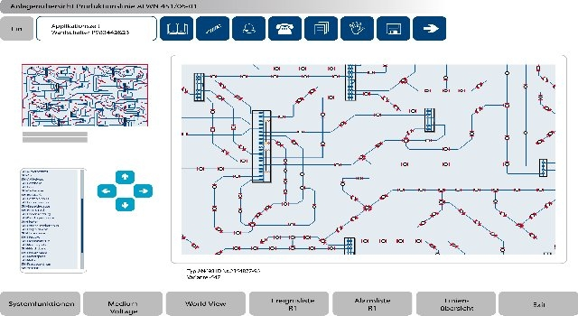
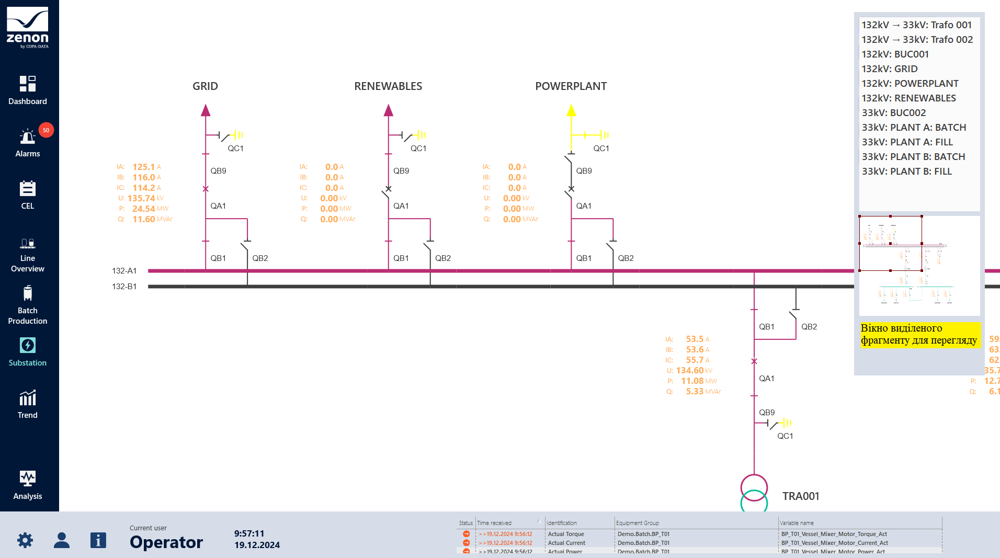
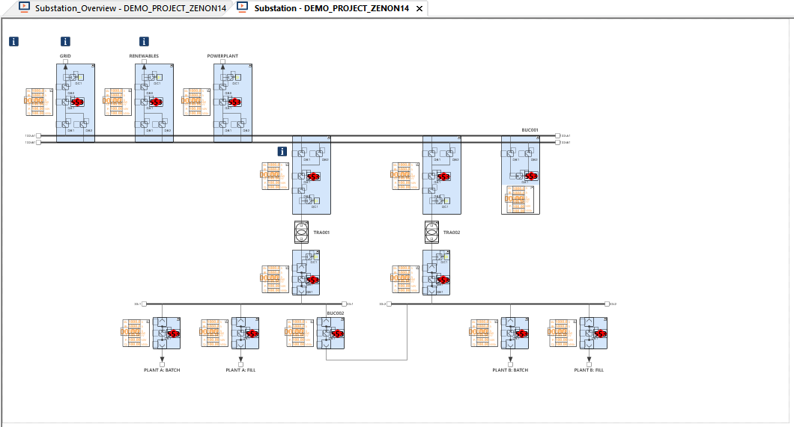
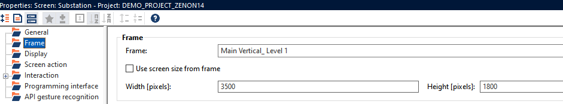
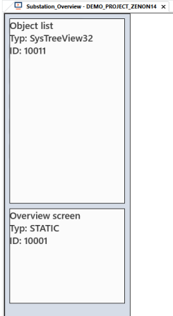
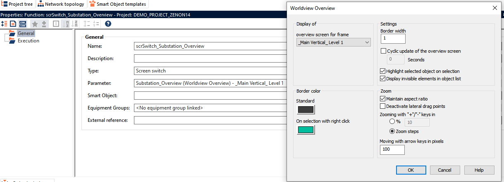
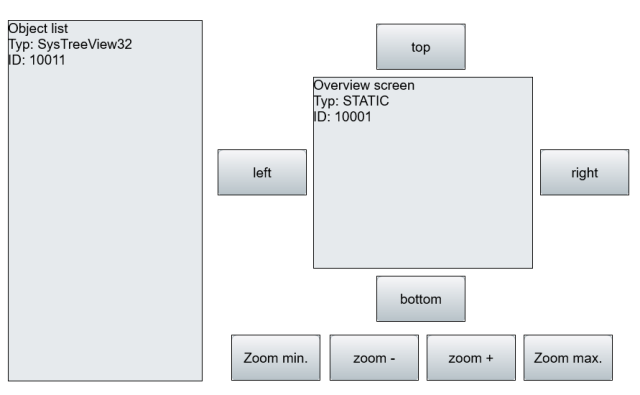
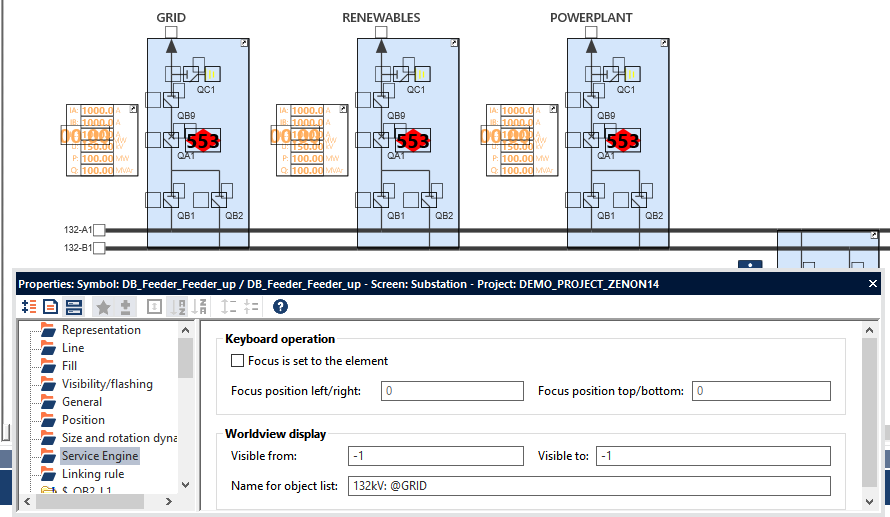

[<- До підрозділу](README.md)

# Перегляд великих екранів Worldview в SCADA zenon

Функція Worldview у zenon дає можливість створювати дуже великі екрани (мнемосхеми, у zenon поняття  екран - це сторінка зі змістом), які незручно розділювати на частини і потребують цілісності, з можливістю перегляду виділеної частини цього екрану в іншому вікні. Це характерно для таких задач як перегляд анімованої трубопровідної системи, шляхопроводів, карт, електричних схем тощо. Якщо монітор підтримує multi-tuch, то потреби зі зміною масштабу немає.  

рис.1. Загальний вигляд Worldview.

Функціональність Worldviews надає такі можливості:

- Відображення екранів, які перевищують розмір фрейму (фрейми - це означення розмірів та позиції екранів на моніторі)
- Навігація по цих екранах
- Масштабування в реальному часі цих екранів

Завдяки цьому можна повністю відобразити дуже велике обладнання та орієнтуватися в ньому, збільшити частини обладнання. Залежно від рівнів масштабування можна означити, які деталі відображаються (масштабування, панорамування та видалення безладу). Також можна переходити безпосередньо до елементів.

Можна подивитися роботу Worldview у демопроекті zenon14, у розділі `Substation`. Усю мнемосхему видно у невеликому вікні (рис.2), виділений фрагмент в ньому відображається у основній частині екрану.  Над вікном з виділеним фрагментом знаходиться перелік доступних об'єктів керованих на екрані, клікнувши по якому можна перейти на конкретну частину основного екрану. Уся анімація на екрані доступна так само як і на звичайних екранах. 

рис.2. Приклад Worldview у демопроекті zenon14 у режимі виконання

Загальна ідея полягає в тому, що створюються два екрани, які мають базуватися на різних фреймах:

- Екран звичайного типу, з великим розміром, на якому відображається вся потрібна схема. Для цього екрану вимкнено параметр `Use screen size from frame` і він має бути більший або такий самий за розміром, як фрейм, на базі якого його створено. 
- екран спеціального типу  `Worldview Overview` який забезпечує керування екрану звичайного типу (рис.4)

рис.3. Основний екран звичайного типу  у демопроекті zenon14 у режимі редагування: зверху - наповнення екрану, знизу - вікно властивостей з розмірами та вимкненою властивістю `Use screen size from frame`

рис.4. Екран `Substation_Overview`  у демопроекті zenon14 у режимі редагування

Викликаючи екран типу `Worldview Overview` означується, яким саме фреймом керуватиме цей екран. Так у демопроекті це `_Main Vertical_Level 1` (рис.5). Там же налаштовуються інші характеристики, зокрема: підсвічування вибраних об'єктів, параметри масштабування, та керування масштабуванням.  

рис.5. Налаштування функції виклику екрану типу  `Worldview Overview`

У демопроекті використовуються тільки два спеціальних елементи екрану (див. рис.4). Окрім них доступні ще кілька, зокрема за замовченням екран типу  `Worldview Overview` містить елементи керування, показані на рис.6.

рис.6. Розміщення спеціальних елементів керування шаблоном за замовченням.

Для кожного об'єкта налаштування рівня масштабування, при якому об’єкт має бути видимим у worldview, установлюється в групі властивостей `Service Engine` об’єкта в розділі worldview (рис.7). Деякі елементи не можна масштабувати, наприклад комбінований/списковий список, список повідомлень тривоги, діаграма розширеного тренду тощо. Розмір цих елементів залишається постійним. Однак їх позиція змінюється.

рис.7. Налаштування видимості об'єктів та відображення імені в списку для   `Worldview Overview`

Екрани типу Worldview Overview можна використовувати лише з фіксованими розмірами frame . Adjustable  розміри frame не підтримуються.

Теоретичне заняття розробив [Олександр Пупена](https://github.com/pupenasan). 
