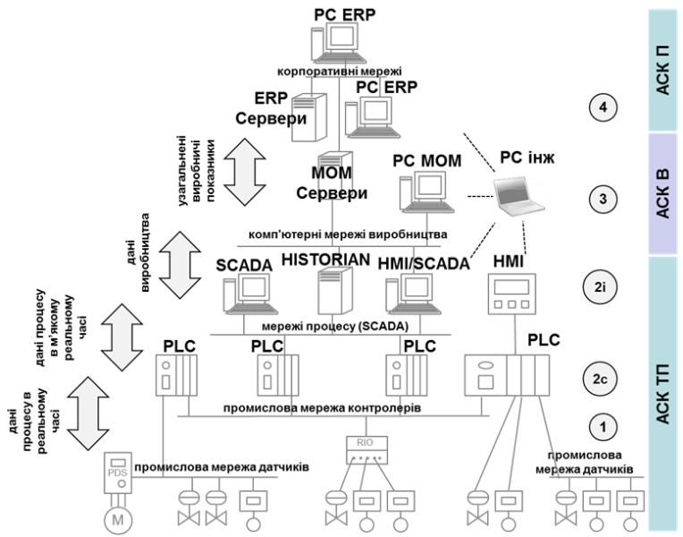

[<- До підрозділу](README.md)

# Інтегрування SCADA/HMI з верхніми рівнями керування

## 1. Місце SCADA/HMI в інтегрованій системі керування

Вище наведено різні архітектури систем на базі SCADA/HMI, де робочі станції (клієнти) і сервери взаємодіють між собою, обмінюючись даними процесу для відображення, диспетчерського керування, архівування та формування тривог. Такий обмін відбувається на одному рівні диспетчерського керування (SCADA), тому його прийнято називати ***горизонтальною інтеграцією***. Однак у сучасних підприємствах засоби SCADA/HMI не функціонують самі по собі і повинні взаємодіяти з іншими рівнями керування. 

Класична структура інтегрованої системи керування підприємством має вигляд піраміди (рис. 9.15), де засоби SCADA/HMI та ПЛК займають другий рівень (керування АСКТП). Вони взаємодіють з процесом через контролери (PLC), які, в свою чергу, можуть бути поєднані між собою промисловими мережами. Обмін SCADA/HMI з контролерами проходить у м’якому реальному часі, тобто коли запізнення оновлення даних не є критичним, а між контролерами – в жорсткому реальному часі, коли дані повинні надходити в чітко визначені проміжки часу. У свою чергу, промислові контролери взаємодіють з технологічним процесом через датчики та виконавчі механізми, які можуть підключатися з використанням уніфікованих сигналів або промислових мереж рівня датчиків.

 

*Рис.* *9.15.* Типова технічна структура інтегрованої системи керування підприємством

Як видно з рис. 9.15, у сучасних системах керування підприємством рівень SCADA/HMI не є найвищим. Для ефективного керування всією виробничою діяльністю використовують системи керування виробництвом (АСК В), які прийнято називати ***MOM*** (Manufacturing Operations Management). До завдань MOM входять функції керування різними виробничими операціями, зокрема (не повний перелік): 

- *керування операціями основного виробництва* (системи MES – Manufacturing Execution Systems): планування, диспетчерування, запуск виконання, контроль та звітність виконання і т. п; системи призначені для різного типу керівників виробництва (начальник виробництва, начальник дільниці і т. п); 

- *керування операціями по обслуговуванню устатковання* (***ТОіР*** – технологічне обслуговування та ремонт; ***EAM*** – Enterprise Asset Management, який включає також функції вищого рівня): планування, контроль стану, контроль виконання, звітність, замовлення деталей і т. п.; системи призначені для інженерно-технічних підрозділів підприємства (механіки, електрики, КВПіА);

- *керування операціями по контролю якості* (LIMS – Laboratory Information Management System): планування та виконання контролю якості, формування звітної інформації з якості і т. п.; системи призначені для керівників з якості, працівників лабораторій і т. п; 

- *керування операціями з запасами* (WMS – Warehouse Management System): планування та контроль наявності, переміщення сировини, напівпродуктів та продуктів; системи призначені для начальників складів, виробничників та іншого персоналу, відповідального за запаси.     

У свою чергу, системи MOM взаємодіють із системами рівня керування підприємством (АСК П), а саме – його фінансово-економічною діяльністю. До таких систем належать ERP (Enterprise Resource Planning), призначення яких – автоматизація планування та виконання бізнес-процесів, організаційно-економічної діяльності, документообігу і т. п. Також там можуть виконуватися інші спеціалізовані застосунки, як ***SCM*** (Supply Chain Management) для керування ланцюжком постачань. З рівня MOM в системи рівня АСК П передаються узагальнені виробничі показники, а на рівень MOM – об’ємні виробничі плани.

Системи керування рівня MOM та АСТКП забезпечують виконання виробничих операцій, або, іншими словами, автоматизують операційні технології ***OT*** (Operation Technologies). Системи керування бізнес-процесами автоматизують інформаційні процеси; вони належать до класу ***IT*** (Information Technologies). На *виробничому* підприємстві ці два сектори взаємодіють для забезпечення функціонування єдиної інтегрованої системи керування усім підприємством.

Для реалізації єдиної інтеграційної платформи даних OT часто використовуються засоби Historian, які детально розглянуті в підрозділі 9.3.  

Фізична структура інтегрованої системи може відрізнятися залежно від підходів. Наприклад, інтегрування рівнів може проводитися з використанням технологій промислового Інтернету речей (IIoT), а явно виділених систем деяких рівнів може не бути. 

## 2. Інтегрування зі SCADA та ієрархія устатковання 

При доступі до даних SCADA/HMI використовуються ті самі технології, що й наведені в попередньому підрозділі. Однак треба розуміти, що забезпечення інтеграції на рівні даних – це лише частина завдання, інша частина – це інтерпретація цих даних.    

На сьогоднішній день ці питання інтегрування систем керування описуються рядом стандартів, зокрема ДСТУ EN 62264 та ДСТУ EN 61512. Згідно з цими стандартами, керування підприємством може бути представлено у вигляді функціональної ієрархії (рис. 9.16). На кожному рівні вирішуються окремі функції, які потребують різних часових рамок. Відповідно до рис. 9.15, обмін між другим і третім рівнем може функціонувати як обмін зі SCADA. Стандарт ДСТУ EN 62264 стандартизує представлення об’єктів та функцій, які стосуються операційної діяльності на рівні 3. Тобто стандарт описує, які повинні бути сутності (об’єкти) і як вони мають бути представлені в інформаційних структурах (наприклад таблицях), для того щоб представити операційну діяльність виробництва. До таких об’єктів входять різні види ресурсів: устатковання (забезпечує виробництво), персонал, матеріали (з чого виготовляється і що виготовляється), активи (наявні підконтрольні необоротні ресурси) та їх об’єднання. Для представлення об’єктів рівня 2 (АСКТП) існують стандарти групи ДСТУ EN 61512, але вони стосуються тільки порційного типу виробництва, хоч можуть бути так само прийняті й до інших типів виробництв. 

 

*Рис. 9.16.* Функціональна ієрархія виробничого підприємства

Для обох стандартів спільним є представлення моделі рольової ієрархії устатковання (рис. 9.17). Відповідно до цієї ієрархії, кожне устатковання (***equipment, обладнання***) виконує певну роль у процесі виготовлення продукції. При інтегруванні верхніх рівнів з системами АСКТП керування та контроль відбуваються саме в поняттях устатковання. Тобто підконтрольне устатковання знаходиться в якомусь стані, і на нього йде певна команда. Розглянемо, яке саме устатковання стосується АСКТП.          

***Модуль керування*** (***Control Module***) – забезпечує виконання функцій керування обладнанням. По суті, це ті засоби та їх функції, які прийнято показувати на схемах автоматизації як засоби КВПіА: датчики, виконавчі механізми, регулятори та їх об’єднання. Цей рівень устатковання може бути цікавим для систем класу ТОіР та EAM. Наприклад, системи ТОіР (технічного обслуговування та ремонту) може цікавити інформація про кількість спрацювань, мотогодини роботи, статистика тривог і т. п. Зверніть увагу, що в цьому прикладі систему верхнього рівня цікавить інформація не про стан датчиків положення, а про узагальнений стан виконавчого механізму.     

 

*Рис. 9.17.* Рольова ієрархія устатковання підприємства

***Модуль технологічного устатковання*** (***Equipment Module***) – виконує певну дію в технологічному процесі, наприклад, перекачування продукту (насосні агрегати) чи нагрівання (теплообмінники) і т. п. Вони включають у себе різне технологічне устатковання та модулі керування. При інтегруванні з верхнім рівнем так само може передаватися інформація про стан. 

***Робочий вузол*** (***Work*** ***Unit***) – виконує певну одну або кілька виробничий операцій. Для порційного виробництва (***Технологічний вузол,*** ***Unit***) це може бути реактор або ємність, в якій виробляється певна порція продукту. Для неперервного виробництва це може бути певний апарат неперервного типу, для дискретного – якась машина (наприклад пакувальна). На верхній рівень може передаватися стан устатковання, кількість виготовленої продукції та інші узагальнені показники й статистичні дані. З верхнього рівня можуть передаватися команди на запуск (зупинку, паузу і т. п), задану кількість, потрібну операці, рецепт і т. п.  

***Робочий центр*** (***Work Center***) – це набір устатковання, що виготовляє певний напівпродукт. Як і в попередньому випадку, може відбуватися обмін станами, командами і параметрами.  

Як правило, рівень АСКТП не виходить за межі робочого центру, а часто – й за рамки робочого вузла. Тому устатковання на вищих рівнях не стосується SCADA.

   Отже, з кожним устаткованням пов’язані, як мінімум, два параметри: стан і команда. Для модулів керування та модуля технологічного устатковання стан може бути представлений набором статусів типу відкрито/закрито, відкривається/закривається або включено/відключено, а також нормальна робота/тривога і т. п. Для робочих вузлів і робочих центрів стан може описуватися складним автоматом станів. Крім станів та команд, устатковання також може мати режим (наприклад, ручний/автоматичний), статистичну інформацію про кількість спрацювань, мотогодин роботи, кількість поломок і т. п. Детальніше про це можете дізнатися зі статей [[6](http://www.tk185.appau.org.ua)] та опису каркасу [[7](https://github.com/pupenasan/PACFramework)].

   Наявність моделей устатковання на кожному з рівнів робить можливим побудувати єдину базу SCADA. Це значно спростить інтегрування з функціональної точки зору. Якщо в рівень MOM необхідно передати якусь інформацію, зручно буде, якщо вона буде вже підготовленою в термінах устатковання. Це може бути також певна звітна інформація, наприклад, про кількість тривог, статистика по трендах, тощо за певний період. У засобах SCADA/HMI деяких виробників з’являється підтримка устатковання. У більшості випадків це зроблено не з метою інтегрування, а для спрощення контролю та керування. У наступних параграфах наведено приклади використання моделей устатковання в SCADA Citect та zenon, які надають можливість у середовищі виконання фільтрувати тривоги та записи в журналах по вибраному устаткованню, а також виконувати функції для нього. Для середовища розроблення устатковання можна використовувати як допоміжне поле для фільтрації. Це тільки частина з переліку доступних функцій, детальніше описано нижче.      

## Контрольні запитання

1.    На яких мережних архітектурах можуть базуватися системи SCADA/HMI?

2.    В якому випадку варто використовувати одиночну архітектуру SCADA/HMI? Які недоліки вона має? 

3.    Покажіть на прикладі однієї з SCADA/HMI, як відбувається резервування каналів введення/виведення.

4.    Розкажіть про принципи організації клієнт-серверної архітектури. Покажіть на прикладі однієї із SCADA. 

5.    Наведіть приклади тонких клієнтів.

6.    Розкажіть про реалізацію мережної архітектури SCADA/HMI з доступом через WEB. Які переваги та недоліки має така архітектура?

7.    Розкажіть про можливі принципи організації HMI-доступу через мобільні пристрої. Що необхідно враховувати при розробленні таких рішень?

8.    Розкажіть про необхідність і принципи побудови мультисерверних архітектур. Покажіть на прикладі однієї із SCADA. 

9.    Розкажіть про необхідність і принципи функціонування архітектур із резервуванням серверів. Покажіть на прикладі однієї із SCADA.

10.    Покажіть на прикладі однієї із SCADA принципи організації внутрішніх мережних змінних у розподілених архітектурах. 

11.    Наведіть приклади, в яких необхідно об’єднати кілька засобів SCADA/HMI різних виробників між собою.

12.    Поясніть, що таке горизонтальна інтеграція?

13.    Яке місце посідає SCADA/HMI ієрархії керування підприємством?

14.    Які функції входять до завдань рівня керування виробничими операціями? Навіщо SCADA інтегрується з застосунками рівня MOM? 

15.    Які системи керування підприємством типово відносять до ІТ, а які до ОТ?

16.    Які можете назвати стандарти інтегрування систем керування? Які основні ідеї закладені в стандартах? 

17.    Використовуючи рис. 9.16, поясніть функціональну ієрархію виробничого підприємства.

18.    Що являє собою устатковання відповідно до стандартів ДСТУ EN 62264 та ДСТУ EN 61512? 

19.    Розкажіть про рольову ієрархію устатковання відповідно до ДСТУ EN 62264 та ДСТУ EN 61512. 

20.    На прикладі однієї із SCADA/HMI покажіть використання ієрархії устатковання.

21.    Які обмеження на збирання та оброблення даних мають засоби SCADA/HMI?

22.    Поясніть необхідність організації єдиної інтеграційної платформи для керування виробництвом.

23.    Поясніть, чому не всі дані, які необхідні у функціях MOM, збираються в SCADA/HMI.

24.    Перерахуйте основні функції Historian.

25.    Які засоби є користувачами Historian? 

26.    Поясніть, яким чином Historian забезпечує єдиною інформаційною платформою засоби MOM. 

27.    Які завдання можна вирішувати з  Historian через спеціальні клієнтські застосунки?

28.    Яке призначення в Операційних та Корпоративних Historian?

29.    Поясніть призначення та особливості реалізації форматів даних часових рядів?

30.    Які показники використовують при виборі Historian за типом організації бази даних?

31.    Навіщо суміщати різні формати даних для  Historian?

32.    Що таке Інтернет речей (IoT)?

33.    Яка відмінність IoT від архітектури системи з розподіленими датчиками та виконавчими механізмами, що використовується в промисловій автоматизації?

34.    Які переваги надає IoT?

35.    Поясніть відмінності Інтернету речей (IoT) від промислового Інтернету Речей(IIoT).

36.    Використовуючи рис. 9.30 та рис. 9.32, прокоментуйте призначення компонентів в архітектурі IIoT.

37.    Поясніть призначення IoT Edge Gateway. Які функції він виконує?

38.    Поясніть що таке хмарні обчислення. Які можливості вони можуть надати для систем АСКТП?

39.    Наведіть та поясніть принципи функціонування хмар з точки зору моделей їх топології.

40.    Наведіть та поясніть принципи функціонування хмар з точки зору моделей надання послуг. Наведіть приклади.

41.    Використовуючи приклад з рис. 9.34, покажіть типовий шлях оброблення даних у хмарних середовищах.

42.    Назвіть приклади споживчих та спеціалізованих хмарних платформ, які можуть використовуватися для завдань АСКТП.

43.    Використовуючи рис. 9.35 та рис. 9.36, поясніть можливі структури інтегрування SCADA з хмарною платформою через OPC UA.

44.    Використовуючи рис. 9.37, поясніть структуру інтегрування SCADA з хмарною платформою через шлюзи OPC DA – OPC UA.

45.    Поясніть, яким чином, використовуючи відкриті технології доступу до БД, можна організувати доступ до хмарних сховищ.

46.    Наведіть кілька відомих випадків інцидентів кібератак на системи АСКТП.

47.    Спростуйте міф: "Кібератаки не сильно актуальні для промислових чи кіберфізичних систем"

48.    Спростуйте міф: " Система ізольована від Інтернету, тому вона безпечна"

49.    Спростуйте міф: " Рівень ймовірного пошкодження надто низький, щоб перейматися кіберзахистом"

50.    Спростуйте міф: "Робочі станції оснащені антивірусним програмним забезпеченням і брандмауером, тому система захищена"

51.    Спростуйте міф: "Використання віртуальної приватної мережі (VPN) убезпечує від несанкціонованого доступу"

52.    Спростуйте міф: "Система інформаційної безпеки (ISS Information System Security) є дорогою і створює багато обмежень для ефективного функціонування".

53.    Які основні відмінності між ІТ та ОТ з точки зору кібербезпеки?

54.    Які міжнародні стандарти кібербезпеки для АСКТП Вам відомі?

55.    Які стандарти кібербезпеки для АСКТП діють в Україні?

56.    Що таке кібератака?

57.    Наведіть приклади джерел атак.

58.    Покажіть приклад багатоетапного проведення атаки.

59.    Що таке компрометація та компрометований засіб?

60.    Що таке вірус?

61.    Що таке Троян?

62.    Що таке Бекдор?

63.    Що таке Ботнет?

64.    Поясніть відмінності між внутрішніми та зовнішніми кіберзагрозами.

65.    Перерахуйте можливі вектори атак на АСКТП.

66.    Які типи атак засобів Ви знаєте?

67.    Які типи атак WEB-серверів Ви знаєте?

68.    Які типи мережних атак Ви знаєте?

69.    Які типи фізичних атак Ви знаєте?

70.    Які типи атак з використанням людського фактора Ви знаєте?

71.    Використовуючи приклад поверхні атаки, показаної на рис. 9.39, прокоментуйте вразливі точки.

72.    У чому полягає метод захисту ідентифікації та контролю активів і персоналу?

73.    У чому полягають архітектурні підходи до захисту?

74.    Що таке зона безпеки і тракт?

75.    Що таке демілітаризована зона?

76.    У чому полягає захист фізичного доступу?

77.    Які мережні компоненти використовуються для захисту? У чому принцип їхньої дії?

78.    У чому полягає зміцнення конфігурацій?

79.    Розкажіть, в чому ідея організації кіберзахистів, що базується етапах динаміки ризиків.

80.    Назвіть етапи керування ризиками та заходи, які проводяться на цих етапах відповідно до пропозицій NIST.

81.    Розкажіть про стратегію захисту в глибину.

82.    Наведіть приклад заходів для кібербезпеки з переліку хороших практик, описаних у посібнику. 

83.    Розкажіть про принципи шифрування та дешифрування з використанням симетричних та асиметричних ключів.

84.    Що таке хешування та хеш-сума?

85.    Розкажіть про призначення та принципи використання електронних цифрових підписів.

86.    Розкажіть про призначення та принципи використання цифрових сертифікатів.

87.    Розкажіть про призначення та принципи використання інфраструктури відкритих ключів.

88.    Розкажіть про використання SSH.

89.    Розкажіть про використання SSL/TLS.

90.    Розкажіть про використання IPsec.

91.    Розкажіть про принципи організації VPN-тунелів. 

92.    Наведіть приклади використання VPN-тунелів в АСКТП та SCADA/HMI зокрема.

Теоретичне заняття розробив [Олександр Пупена](https://github.com/pupenasan). 
