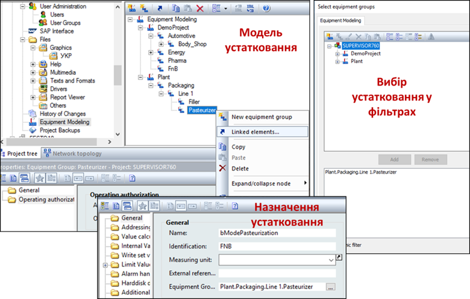
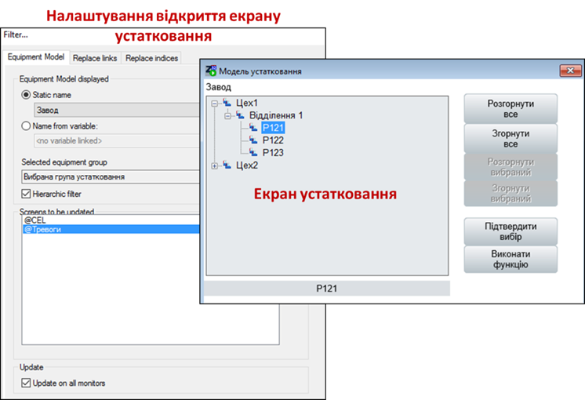

# Використання ієрархії устатковання в SCADA zenon  

У SCADA zenon ієрархія устатковання створюється у відповідному розділі проекту "Equipment Modeling" (див. рис. 9.22). Ім’я групи устатковання (Equipment group) може бути вказано як додатковий параметр для більшості елементів проекту, в тому числі:

- змінних (Variables) та типів змінних; 

- екранів (Screens) та шаблонів (frames);

- функцій та скриптів;

- стандартних рецептів та груп рецептів;

- часових функцій;

- моделей планувальника;

- пунктів меню;

- користувачів;

- матриць реакцій;

- переприсвоєнь (Allocation);

- класів, груп та дільниць тривог.

Один елемент може одночасно бути назначений кільком групам устатковання. Назначивши елемент устаткованню, воно може бути використано як фільтр у середовищі виконання. Фільтр налаштовується шляхом вибору груп устатковання, до якого має входити елемент, щоб відображатися в таблиці. Крім того, в ієрархії устатковання можна отримати інформацію про прив’язані до нього елементи через пункт "Linked elements" контекстного меню.   

 

  *Рис. 9.22.* Створення ієрархічної моделі устатковання та використання її в змінній 

У середовищі виконання устатковання може бути використано в якості фільтрів та додаткових параметрів в функціях. Наприклад, в аргументах функцій виклику екранів AML, CEL, Recipegroup Manager або керування змінами (Shift management) для фільтру може бути використана група устатковання. При цьому можна вказати, необхідно відображати елементи тільки вибраного рівня чи усіх підлеглих (опція "Hierarchic filter"). Ієрархію устатковання також можна використовувати в означенні тривог. 

Вибирати устатковання для фільтрів можна і після відкриття екранів. Це можна зробити через спеціальні екрани налаштування фільтрів, де поряд з вибором часу, формату відображення тощо можна вказати групу устатковання. Однак це не дуже зручно, оскільки потребує великої кількості операцій. Альтернативою є використання спеціального типу екрана "Equipment model". Після створення екрана для його виклику створюється функція "Screen switch", в аргументах якої можна налаштувати екрани, фільтри яких будуть оновлюватися при виборі групи устатковання ("Screens to be update"). Тут можна також вказати текстову змінну, яка отримуватиме назву вибраної групи устатковання. 

Використовуючи екран моделі устатковання в середовищі виконання, оператор зможе вибрати необхідну групу та підтвердити свій вибір. Після цього фільтри усіх налаштованих екранів будуть оновлені. Використовуючи кнопку запуску функції, можна також запустити усі функції, що прив’язані до вибраної групи устатковання. 

 

*Рис. 9.23.* Налаштування аргументів функції "Screen switch" для відкриття екрана моделі устатковання та вигляд екрана в режимі виконання 