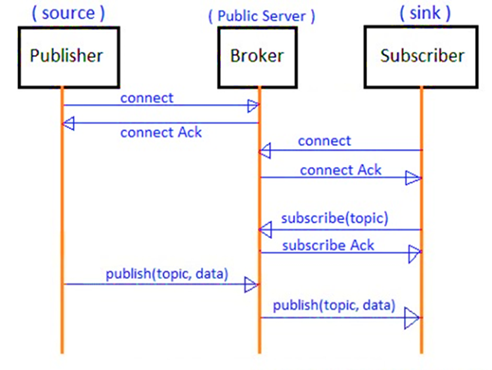
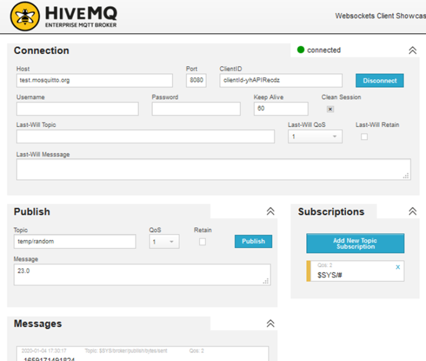
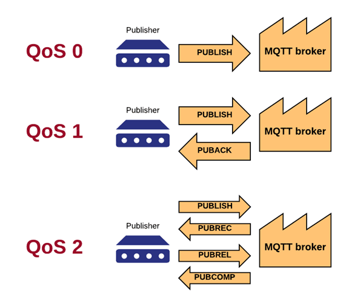
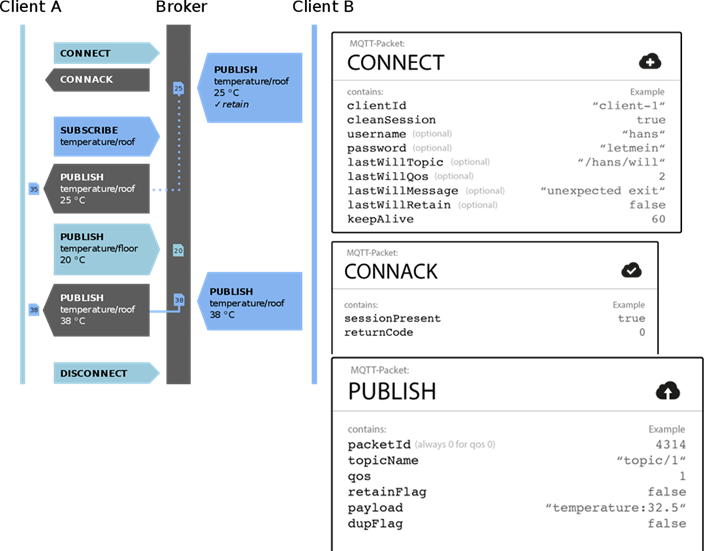
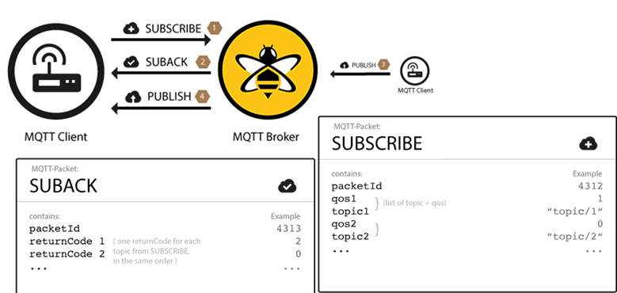
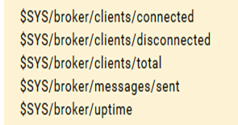

[<- До підрозділу](README.md)

#  Протокол MQTT

## 1. Загальні принципи функціонування MQTT

У підрозділі 9.4 показано структури промислового Інтернету речей, де засоби взаємодіють між собою через мережу Інтернет безпосередньо, або через комунікаційні шлюзи. При такому обміні може й не бути явно виділеного сервера, куди треба передавати дані, адже IoT передбачає зв'язок "речей" між собою, а не з централізованим "концентратором" даних. Тому поряд з використанням HTTP API та WebSocket, в IoT є спеціальні протоколи Інтернету речей, такі як AMQP, MQTT, STOMP та інші, які не передбачають зв'язку типу клієнт-сервер. У цих протоколах одні засоби розміщують повідомлення в буфері або стеці, інші – зчитують їх. MQTT є одним з таких.  

MQTT може використовуватися як протокол обміну територіально-розподілених засобів IoT з центральним диспетчерським пунктом SCADA, які його підтримують. У даному випадку SCADA-сервер не обов’язково повинен знаходитися на ПК, який має виділену IP-адресу, а також може бути за NAT та не потребує відкритих вхідних TCP/UDP портів, що робить це рішення простішим і безпечнішим (див. підрозділ 9.5).   

MQTT свого часу був внутрішнім і пропрієтарним протоколом для IBM протягом багатьох років. У 2010 р. він був випущений у версії 3.1 в якості безкоштовного продукту, у 2013 р. – стандартизований і прийнятий в консорціум OASIS, у 2014 р. – OASIS опублікував його публічно як версію MQTT 3.1.1. MQTT також є стандартом ISO (ISO / IECPRF 20922). 

Протокол MQTT ґрунтується на стеці TCP/IP. У ньому використовується модель публікації-підписування (publish-subscribe, або pub/sub). Клієнт, що передає повідомлення, називається ***видавцем*** (***publisher***); клієнт, який отримує повідомлення – ***абонентом*** (***subscriber***). У центрі знаходиться ***MQTT-брокер*** (***MQTT broker***), який несе відповідальність за обмін повідомленнями між клієнтами і фільтрацію даних (рис. 70). Таким способом йде відокремлення клієнта, що відправляє повідомлення, від іншого клієнта, який отримує повідомлення. На відміну від традиційної моделі клієнт-сервер, клієнти, що публікують і підписуються на повідомлення, не обізнані про будь-які фізичні ідентифікатори інтерфейсів пристроїв або застосунків (на зразок IP-адреси, або TCP/UDP порту). Вони знають тільки про розміщення в мережі брокера, через який відбувається обмін. У MQTT може бути багато видавців і багато абонентів.

Абонент, підписуючись під отримування повідомлень від видавців, використовує різноманітні фільтри, які забезпечують:

- **фільтрацію за темами** (**Topic Filters**) – за задумом, клієнти підписуються на ***теми*** (***topic***) і певні гілки тем, тому не отримують непотрібних їм даних. Кожне опубліковане повідомлення повинно містити тему (topic), і брокер несе відповідальність за повторну передачу цього повідомлення абонентам або ігнорування його;

- **фільтрацію за вмістом** – брокери мають можливість перевіряти і фільтрувати опубліковані дані. Таким чином, будь-які дані, які не зашифровані, можуть скеровуватися брокером до того, як зберегти їх або передати іншим клієнтам;

- **фільтрацію за типом** – клієнт, що прослуховує потік даних, на які він підписаний, може також застосовувати свої власні фільтри. Вхідні дані можуть аналізуватися, і залежно від цього потік їх обробляється далі або ігнорується.

                               

*Рис. 70*. Принцип обміну MQTT повідомленнями через брокер 

Абонент може підписатися на кілька тем. Одна з особливостей моделі видавець/абонент полягає в тому, що перед початком передачі клієнти повинні знати тему гілки і формат даних, але не взаємне розміщення один одного. Це дуже корисно при розгортанні IoT, оскільки IP-адреса клієнтів може бути динамічною або/та приватною. 

MQTT є часово-незалежним протоколом. Це значить, що повідомлення, опубліковане одним клієнтом-видавцем, може бути прочитане абонентом в будь-який час. Абонент може перебувати в місці з низьким енергоспоживанням або обмеженою пропускною здатністю і відповісти на повідомлення через кілька хвилин або годин. 

Брокери можуть бути розгорнуті на будь-якому загальнодоступному усім клієнтам ресурсі і мати виділену і відому їм адресу. При реалізації IoT з використанням хмарних платформ, функцію брокера бере на себе відповідний сервіс. Керовані хмарою брокери MQTT зазвичай можуть поглинати мільйони повідомлень на годину і підтримувати десятки тисяч видавців.

MQTT не залежить від формату даних. Корисне навантаження (payload) може містити будь-який тип даних, тому і видавці, і абоненти повинні розуміти і погоджувати формат даних. У корисному навантаженні можна передавати текстові повідомлення, дані зображення, звукові дані, зашифровані дані, двійкові дані, об'єкти JSON або практично будь-яку іншу структуру. Тим не менше, текстові і двійкові дані JSON є найбільш поширеними типами даних корисного навантаження.

Максимально допустимий розмір пакета в MQTT становить 256 Мб, що дає можливість отримати надзвичайно велике корисне навантаження. Зверніть увагу, що це також залежить від обмеження клієнтів, хмарних сервісів (якщо використовуються) і брокера. Наприклад, хмарний сервіс IBM Watson дає змогу оброблювати дані розміром до 128 Кб, а Google підтримує 256 Кб. З іншого боку, опубліковане повідомлення може включати корисне навантаження нульової довжини, тобто поле корисного навантаження не обов'язкове. Доцільно звірити відповідність розмірів корисного навантаження з хмарним провайдером або конкретною реалізацією брокера. 

В Інтернеті є безкоштовні MQTT брокери, використовуючи які можна обмінюватися між пристроями IoT, не маючи власного сервера або виділеного хмарного сервісу для MQTT. Серед найбільш відомих MQTT брокерів є:

- [http://test.mosquitto.org](http://test.mosquitto.org/gauge/)

- http://www.mqtt-dashboard.com 

  Тут слід наголосити, що використання публічних брокерів в Інтернет може стати в нагоді для навчання або тестів, однак з точки зору промислового використання є небезпечним і ненадійним. Для побудови проектів диспетчеризації необхідно розгортати власний брокер (є безкоштовні версії) або користуватися відповідними хмарними сервісами IoT (див. підрозділ. 9.4).

  Також для перевірки обміну по MQTT можна скористатися тестовими MQTT-клієнтами, наприклад, онлайн-клієнт HiveMQ [[19](http://www.hivemq.com/demos/websocket-client)] або офлайновий MQTT-explorer [[20](http://mqtt-explorer.com/)]. На рис. 71 показано зовнішній вигляд вікна клієнта HiveMQ для перевірки відправки (publish) та отримання повідомлень (subscription), у даному випадку той же клієнт може бути як видавцем, так і абонентом. У полі "hosts" вказується DNS-ім’я або IP-адреса брокера також вказується порт і власний ідентифікатор. Для відправки вказується тема (Topic) та корисне навантаження (Message) для отримання теми підписки.   

## 2. Деталі архітектури MQTT

MQTT може зберігати повідомлення в брокері необмежено довго. Цей режим роботи керується відповідним прапорцем. Збережене на брокері повідомлення відправляється будь-якому клієнту, який підписується на цю тематичну гілку MQTT. При підписуванні повідомлення негайно відправляється новому абоненту, що дозволяє йому отримати статус або сигнал з теми без очікування. Може виникнути ситуація, що абонент може очікувати годину або навіть дні, перш ніж видавець опублікує нові дані.

MQTT означує додатковий об'єкт під назвою ***Остання воля і заповіт*** (***LWT***). LWT – це повідомлення, яке вказує клієнт брокеру на етапі підключення. LWT містить назву теми "Останньої волі" (Last-Will Topic), QoS (Last-Will QoS) і фактичне повідомлення (Last-Will Message; див. рис. 71). Якщо клієнт неправильно відключається від брокерського з'єднання (наприклад, тайм-аут keep-alive, помилка введення-виведення або клієнт закриває сеанс без відключення), тоді брокер зобов'язаний транслювати повідомлення LWT усім іншим підписаним на цю тему клієнтам.
<a href="media4/4_71.png" target="_blank"></a> 

*Рис. 71*. Вікно тестового MQTT-клієнта

Незважаючи на те, що MQTT заснований на TCP, з'єднання можуть обриватися, особливо в разі бездротових датчиків. Пристрій може втратити живлення, зв'язок або може відбутися поломка, і сеанс перейде в напіввідкритий стан (тобто, з одного боку, вважається, що з’єднання є, а з іншого – його немає). У цьому випадку TCP-сервер брокера буде вважати, що з'єднання, як і раніше, є надійним і очікуватиме дані. Щоб вийти з цього напіввідкритого стану, MQTT використовує систему ***keep-alive* (**утримування**)**. Використовуючи цю систему, як брокер MQTT, так і клієнт мають гарантію того, що з'єднання залишається працездатним, навіть якщо протягом деякого часу не було передачі. Значення часу утримування задає клієнт при підключенні (див. рис. 71). Після отримання чергового будь-якого пакета, таймери keep-alive скидаються на клієнті і сервері і починають відлік. Якщо протягом часу keep-alive клієнти не мають даних для відправлення, вони повинні відправити пакет PINGREQ брокеру, який, у свою чергу, підтверджує повідомлення за допомогою PINGRESP. Якщо протягом півтори часу keep-alive пакет не буде отримано, брокер закриє з’єднання і відправить LWT-пакет усім клієнтам. Максимальний час keep-alive – 18 годин 12 хвилин 15 секунд. 

MQTT дає також можливість підтримувати постійні сеанси (persistent session). Постійний сеанс зберігає на стороні брокера таке:

- усі підписки клієнта;

- усі повідомлення з QoS, що дорівнюють1 або 2, які не були підтверджені клієнтом;

- усі нові повідомлення з QoS, що дорівнюють 1 або 2, пропущені клієнтом;

- усі повідомлення з QoS, що дорівнюють 2, але не підтверджені клієнтом унаслідок втрати зв’язку.  

Для цього клієнт при підключенні вказує свій client_id (див. рис. 71). Клієнт може запитувати постійний сеанс, проте брокер може відхилити запит і примусово перезапустити новий сеанс. При з'єднанні з брокером клієнт використовує прапорець cleanSession (див. рис. 71), щоб показати відсутність необхідності постійного сеансу. Клієнт за допомогою повідомлення-відповіді CONNACK може визначити, чи зберігся попередній сеанс.

Постійні сеанси повинні використовуватися для клієнтів, які мають отримувати всі повідомлення, навіть якщо немає зв'язку. Вони не повинні використовуватися в ситуаціях, коли клієнт тільки публікує (записує) дані в теми.

Більше інформації про MQTT можна прочитати в [[21](https://www.hivemq.com/mqtt-essentials/)]. 

## 3. Рівні якості обслуговування MQTT

У MQTT є три рівні якості обслуговування передачі повідомлень (рис. 72):

- **QoS-0 (незавірена передача)** – це мінімальний рівень QoS, який можна назвати "відправити і забути". Це найефективніший процес доставки без підтвердження одержувачем повідомлення і без повторної передачі повідомлення відправником при втраті даних;

- **QoS-1 (гарантована передача)** – цей режим гарантує доставку повідомлення одержувачеві хоча б один раз. Повідомлення може бути доставлено кілька разів, і одержувач на кожне з них відправить назад підтвердження з відповіддю PUBACK;

- **QoS-2** **(гарантований сервіс)** – це найвищий рівень QoS, який забезпечує переконання в доставці і інформування відправника та одержувача, що повідомлення було передано правильно. Цей режим генерує більше трафіку через багатокрокове рукостискання між відправником та отримувачем.

 

*Рис. 72*. Рівні обслуговування MQTT 

QoS в MQTT визначається і контролюється відправником, і в кожного відправника може бути своя політика. Типові випадки використання:

- QoS-0 слід використовувати, якщо повідомлення не потрібно зберігати в черзі. QoS-0 найкраще підходить для дротового підключення, або коли система сильно обмежена в пропускній здатності;

- Qos-1 слід використовувати за замовчуванням; QoS1 набагато швидше, ніж QoS2, і значно знижує вартість передачі;

- QoS-2 – для критично важливих застосунків; крім того, для випадків, коли повторна передача дубльованого повідомлення може призвести до помилок.

## 4. Установлення з’єднання та обмін повідомленнями в MQTT

MQTT ґрунтується на з’єднаннях клієнтів із сервером-брокером. Кожен клієнт ідентифікує себе з використанням унікального імені, за яким брокер може регулювати правила підключення. Для безпечності з’єднання може також використовуватися ідентифікація користувача та пароль. Також можна використовувати шифровану передачу над TLS/SSL (див. підрозділ 9.5).   

З'єднання з використанням MQTT починається з того, що клієнт відправляє повідомлення CONNECT брокеру. Тільки клієнт може ініціювати сеанс, і жоден клієнт не може безпосередньо зв'язатися з іншим клієнтом. У відповідь на повідомлення CONNECT брокер завжди буде відсилати CONNACK і код статусу. Після встановлення з'єднання воно починає працювати.

<a href="media4/4_73.png" target="_blank"></a> 

*Рис. 73*. Послідовність установлення обміну по MQTT для передачі 

У табл. 9 наведено дані для з’єднання в процедурі CONNECT MQTT.

*Таблиця 9.* 

**Значення полів при з’єднанні клієнта з брокером.**

| **Поле**        | **Обов’язкове  поле** | **Опис**                                                     |
| --------------- | --------------------- | ------------------------------------------------------------ |
| clientID        | Так                   | Ідентифікує клієнта не  сервері. Кожний клієнт має унікальний ідентифікатор, від 1 до 23 байт UTF-8 |
| cleanSession    | Ні                    | 0: сервер повинен відновити сеанс  із клієнтом; клієнт і сервер повинні зберегти стан сеансу після відключення;  1: клієнт і сервер повинні  відмінити попередній сеанс і почати новий |
| username        | Ні                    | Ім’я, що  використовується сервером для автентифікації       |
| password        | Ні                    | Пароль                                                       |
| lastWillTopic   | Ні                    | Тема (topic) гілки для публікації повідомлення "останньої волі" |
| lastWillQos     | Ні                    | Рівень QoS (0…2) повідомлення "останньої волі"               |
| lastWillMessage | Ні                    | Корисне навантаження (payload) повідомлення "останньої волі" |
| lastWillRetain  | Ні                    | Чи зберігається повідомлення "останньої  волі" після публікації |
| keepAlive       | Ні                    | Інтервал часу в секундах keep-alive  (утримування)           |

При відповіді CONNACK сервер (брокер) буде повертати код відповіді, які наведені в табл. 10.

*Таблиця 10.* 

**Коди відповідей клієнта.**

| **Код відповіді** | **Опис**                                                     |
| ----------------- | ------------------------------------------------------------ |
| 0                 | Успішне з’єднання                                            |
| 1                 | У з’єднанні відмовлено : неприйнятна версія протоколу  MQTT  |
| 2                 | У з’єднанні відмовлено : ідентифікатор клієнта – це  правильний UTF-8, однак не дозволений сервером |
| 3                 | У з’єднанні відмовлено : сервер недосяжний                   |
| 4                 | У з’єднанні відмовлено : неправильне ім’я користувача  чи пароль |
| 5                 | У з’єднанні відмовлено : клієнт не авторизований для  з’єднання |

 Клієнт MQTT може публікувати повідомлення, як тільки він підключається до брокера. MQTT використовує фільтрування повідомлень на брокері на основі тем. Кожне повідомлення має містити тему, яку брокер може використовувати для пересилання повідомлення зацікавленим клієнтам. Як правило, кожне повідомлення має корисну інформацію, яка містить дані для передачі у форматі байтів MQTT. 

Клієнт, що публікує дані (видавець) вирішує, які дані він хоче відправити: двійкові, текстові, XML або JSON. Повідомлення публікації (PUBLISH**)** у MQTT має кілька атрибутів, які вказані в табл. 11.

*Таблиця 11.* 

**Атрибути повідомлення** **PUBLISH**

| **Поле**   | **Обов’язкове поле** | **Опис**                                                     |
| ---------- | -------------------- | ------------------------------------------------------------ |
| packetID   | Так                  | Унікально ідентифікує пакет у змінному заголовку. Для QoS-0 завжди 0 |
| topicName  | Так                  | Тема гілки для публікації (наприклад, Drive/Speed)           |
| qos        | Так                  | Рівень QoS (0…2)                                             |
| retainFlag | Так                  | Прапорець, який показує, чи буде дане повідомлення  зберігатися як останнє хороше; якщо новий клієнт підпишеться під дану гілку, то  він автоматично отримає це повідомлення |
| payload    | Ні                   | Корисне навантаження                                         |
| dupFlag    | Так                  | Прапорець, який показує, що повідомлення є дублікатом і  відправлено повторно |

 Коли клієнт надсилає повідомлення до MQTT брокера для публікації, брокер читає повідомлення, підтверджує його (відповідно до рівня QoS) і обробляє. Оброблення брокером включає в себе визначення того, які клієнти підписалися на тему та надсилання їм повідомлення.

Клієнт, який спочатку публікує повідомлення, турбується тільки про доставку повідомлення PUBLISH брокерові. Як тільки брокер отримує повідомлення PUBLISH, він зобов'язаний доставити його всім абонентам. Видавець не отримує жодних відгуків щодо того, хто цікавиться опублікованим повідомленням чи скільки клієнтів отримали повідомлення від брокера.

Щоб отримувати повідомлення на потрібні теми, клієнт надсилає до брокерові MQTT повідомлення SUBSCRIBE (рис. 74). Це повідомлення містить унікальний ідентифікатор пакета та список підписувань на теми (перелік topicID). Кожна підписка складається з теми та рівня QoS. Тема в повідомленні підписки може містити підстановки, які дають змогу підписатися на теми за вказаним шаблоном, а не на одну конкретну тему. Якщо для одного клієнта існує паралельне підключення, то брокер доставляє повідомлення, яке має найвищий рівень QoS для цієї теми.

*Таблиця 12.* 

**Атрибути повідомлення** **SUBSCRIBE**

| **Поле** | **Обов’язкове поле** | **Опис**                                 |
| -------- | -------------------- | ---------------------------------------- |
| packetID | Так                  | Унікальний ідентифікатор пакета          |
| topic_1  | Так                  | Перша гілка, на  яку підписується клієнт |
| qos_1    | Так                  | Рівень QoS (0…2)  для першої гілки       |
| topic_2  | Ні                   | Друга гілка, на  яку підписується клієнт |
| qos_2    | Ні                   | Рівень QoS (0…2)  для другої гілки       |

<a href="media4/4_74.png" target="_blank"></a> 

*Рис. 74*. Підписування на повідомлення по MQTT 

Для підписування на декілька тем в одному повідомленні можуть використовуватися знаки підстановки. Детальніше про це – в наступному параграфі. Щоб підтвердити кожне підписування, брокер надсилає Клієнту повідомлення про підтвердження SUBAK. Це повідомлення містить ідентифікатор пакета оригінального повідомлення SUBSCRIBE (щоб чітко ідентифікувати повідомлення) та список кодів повернення:

0 – Успішно, Maximum QoS 0;

1 – Успішно, Maximum QoS 1;

2 – Успішно, Maximum QoS 2;

128 – Відмова.

Для відписки від теми використовується пакет Unsubscribe.

## 5. Теми повідомлень та використання шаблонів MQTT

У MQTT слово "тема" ("topic") відноситься до рядка UTF-8, який брокер використовує для фільтрування повідомлень для кожного зв'язаного клієнта. Тема складається з одного або декількох рівнів. Кожен рівень теми розділений косою рискою ("/" – роздільник рівня теми): 


Клієнтові не потрібно створювати потрібну тему, перш ніж її публікувати або підписатися на неї. Брокер приймає кожну дійсну тему без попередньої ініціалізації. Кожна тема повинна містити щонайменше 1 символ, рядок теми може мати пробіли. Теми є чутливими до регістру.

Коли клієнт підписується на тему, він може підписатися на конкретну тему опублікованого повідомлення або використовувати шаблони для підписування на кілька тем одночасно. ***Шаблони*** (***Wildcards***) можуть використовуватися лише для підписування на теми, а не для публікації повідомлення. Існує два різних типи шаблонів: single-level (однорівневий) та multi-level (багаторівневий).

Як випливає з назви, однорівневий шаблон замінює один рівень теми. Символ "+" є однорівневим символом у темі:


Будь-яка тема відповідає вказаній в однорівневому шаблоні, якщо вона містить довільний рядок замість символу підстановки ("+") у шаблоні. Наприклад, підписування на

```
myhome/groundfloor/+/temperature
```

може дати такі результати (зелена галочка – відповідність фільтру):

 

Багаторівневий шаблон охоплює багато рівнів тем і позначається символом "#". Для того щоб брокер визначив, які теми збігаються, багаторівневий підзаголовок слід розміщувати як останній символ у темі, перед яким передує коса риска:

 

 

Якщо клієнт підписується на тему з багаторівневим шаблоном, він отримує всі повідомлення тем, які починаються з шаблону перед символом підстановки, незалежно від того, яка довга назва цієї теми. Якщо ви вказали лише багаторівневий шаблон як тему (#), ви отримуєте всі повідомлення, які надсилаються брокерові MQTT. 

Як правило, клієнти можуть публікувати теми MQTT з будь-якими назвами, за винятком тих, що починаються із символу "$". Такі теми зарезервовані для внутрішньої статистики брокера MQTT, тому клієнти не можуть публікувати повідомлення з такими назвами тем. Наразі немає офіційної стандартизації на використання тем з "$". Зазвичай використовується теми з "$SYS", але реалізація брокерів змінюється. Для прикладу нижче за тему вибрано повний шлях до деяких системних тем, доступних для брокера mosquito: 

    

Більше інформації про MQTT можна прочитати в [[21](https://www.hivemq.com/mqtt-essentials/)]. 

## Контрольні запитання 

1. Яке призначення протоколу MQTT?
2. У чому принципова відмінність використання протоколу MQTT порівняно з "класичними", що використовуються в АСКТП?
3. Поясніть модель функціонування протоколу MQTT.
4. Поясніть призначення фільтрів в MQTT.
5. Які вимоги до розгортання в мережі брокерів MQTT?
6. Які формати даних можна передавати з використанням MQTT?
7. Які існують обмеження на об’єм даних, які можна передавати через MQTT?
8. Які обмеження для використання публічних брокерів MQTT?
9. Якими інструментами можна перевірити зв'язок між клієнтами MQTT?
10. Що необхідно вказати при підключенні до клієнта до брокера MQTT?
11. Розкажіть про призначення повідомлення LWT в MQTT.
12. Розкажіть про призначення налаштування keep-alive в MQTT.
13. Розкажіть про призначення налаштування persistent session в MQTT.
14. Розкажіть про рівні якості обслуговування в MQTT.
15. Як установлюється з’єднання в MQTT?
16. Розкажіть про призначення теми (topic) в MQTT.
17. Як клієнт MQTT підписується на повідомлення?
18. Розкажіть про правила формування шаблонів для підписування MQTT.

## Список використаних джерел

1. О.М. Пупена, І.В. Ельперін, Н.М. Луцька та А.П. Ладанюк. Промислові мережі та інтеграційні технології в автоматизованих системах. Київ, Україна. Ліра-К, 2011.

2. Відкритий курс "Промислові мережі та інтеграційні технологі" [Електронний ресурс]. Доступно: [http://asu.in.ua/viewtopic.php?f =194&t=1052](http://asu.in.ua/viewtopic.php?f=194&t=1052)

3. Com port development tool [Електронний ресурс]. Доступно: https://sites.google.com/site/terminalbpp/ 

4. Программа Portmon для Windows [Електронний ресурс]. Доступно: [https](file:///G:\san\Посібн ЛМІ\https)[://](https://technet.microsoft.com/ru-ru/sysinternals/bb896644.aspx)[technet.microsoft.com/ru-ru/sysinternals/bb896644.aspx](https://technet.microsoft.com/ru-ru/sysinternals/bb896644.aspx) 

5. Null-modem emulator [Електронний ресурс]. Доступно: [http](file:///G:\san\Посібн ЛМІ\http)[://sourceforge.net/ projects/com0com/?](http://sourceforge.net/projects/com0com/?source=navbar)[source=navbar](http://sourceforge.net/projects/com0com/?source=navbar) 

6. TCP/IP Builder [Електронний ресурс]. Доступно: [http://www.drk.com.ar/ builder.php](http://www.drk.com.ar/builder.php) 

7. Відкритий курс "Промислові мережі", Лабораторне заняття 7. Основи Ethernet та IP. [Електронний ресурс]. Доступно: <http://edu.asu.in.ua/mod/book/view.php?id=49>

8. CAS MODBUS SCANNER. [Електронний ресурс]. Доступно: http://www.chipkin.com/products/software/modbus-software/cas-modbus-explorer 

9. Відкритий курс "Промислові мережі", Лабораторне заняття 6. Використання шини MODBUS RTU та MODBUS TCP/IP для зв’язку SCADA програм з ПЛК. [Електронний ресурс]. Доступно: http://edu.asu.in.ua/mod/book/view.php?id=41

10. Gray Simulator. [Електронний ресурс]. Доступно: http://www.gray-box.net/download_graysim.php 

11. OPC Client Toolkit. [Електронний ресурс]. Доступно: https://www.kassl.de/opc/download.shtml 

12. OPC UA Fundamentals. [Електронний ресурс]. Доступно: https://documentation.unified-automation.com/uasdkcpp/1.5.6/html/L1OpcUaFundamentals.html 

13. OPC UA Servers. [Електронний ресурс]. Доступно: https://www.unified-automation.com/downloads/opc-ua-servers.html 

14. OPC UA Clients. [Електронний ресурс]. Доступно: https://www.unified-automation.com/downloads/opc-ua-clients.html

15. Publicly available OPC UA Servers and Clients. [Електронний ресурс]. Доступно: https://[github.com/node-opcua/node-opcua/wiki/publicly-available-OPC-UA-Servers-and-Clients](https://github.com/node-opcua/node-opcua/wiki/publicly-available-OPC-UA-Servers-and-Clients)

16. OPC UA client application running on Android. [Електронний ресурс]. Доступно: https://www.prosysopc.com/products/opc-ua-client-for-android/

17. Suppanel is an Android app to create SCADA/HMI type supervisory panels. [Електронний ресурс]. Доступно: http://www.suppanel.com/index.php/en/

18. Tutorial 1 OPC UA. [Електронний ресурс]. Доступно: https://[youtu.be/35 Tt8GHt58U](https://youtu.be/35Tt8GHt58U)

19. Websockets Client HiveMQ. [Електронний ресурс]. Доступно: http://www.hivemq.com/demos/websocket-client

20. MQTT-explorer. [Електронний ресурс]. Доступно: http://mqtt-explorer.com/ 

21. MQTT Essentials. [Електронний ресурс]. Доступно: https://www.hivemq.com/mqtt-essentials/ 

22. Reliable Data Movement for Connected Devices. [Електронний ресурс]. Доступно: https://www.hivemq.com 

Теоретичне заняття розробив [Олександр Пупена](https://github.com/pupenasan). 
