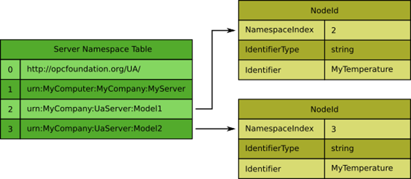
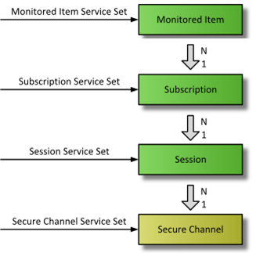
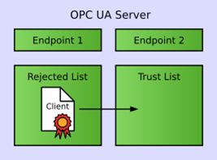
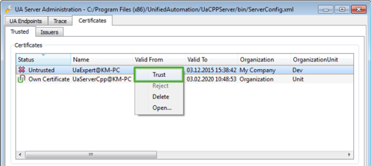
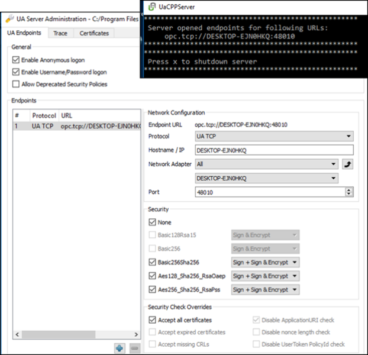

[<- До підрозділу](README.md)

#                                  OPC UA

## 1. Загальні принципи функціонування OPC UA

***OPC UA (OPC*** ***Unified Architecture)*** – це незалежний від платформи стандарт, який дає змогу обмінюватися виробничими даними між різними типами застосунків та користуватися їх сервісами. Принциповою відмінністю в OPC UA від своїх попередників є використання іншого стеку протоколів, що дало можливість:

- відв’язатися від залежності MS Windows;

- реалізовувати застосунки на різних типах пристроїв, а не тільки ПК;

- реалізовувати зв'язок на різних типах мереж, у т. ч. через Інтернет;

- будувати захищені з’єднання між застосунками;

- використовувати механізми обміну шляхом публікацій і підписування. 

OPC UA може функціонувати з використанням різних комунікаційних протоколів, при цьому дані можуть бути закодовані різними способами 
 (рис. 34). Означено кілька протоколів, які можна використовувати:

- OPC UA TCP;

- HTTPS;

- WebSockets.

Означено три способи кодування даних:

- XML/text;

- UA Binary;

- JSON.

 

*Рис. 34.* Комунікаційна архітектура OPC UA

OPC UA так само як OPC DA має клієнт-серверну модель функціонування, в якій сервери можуть надавати різні набори ***Сервісів*** (***Services***). Під час підключення сервер повідомляє клієнту, які із сервісів він підтримує. Обмін інформацією відбувається з використанням типів даних, означених як у стандартах OPC UA, так і постачальниками. 

Усі дані і сервіси доступні через ***об’єкти***, які надаються клієнтському застосунку через взаємопов’язану об’єктну модель. сервери означують об'єктні моделі, які клієнти можуть динамічно переглянути. Через ці об’єкти сервери можуть надати доступ як до даних реального часу, так і до історичних (Historical), тривог (Alarms) і подій (Events). 

Кожен об’єкт може надавати доступ до читання/записування його змінних, або до виклику методів (рис.  35). Користувачам OPC UA не обов’язково використовувати об'єктно-орієнтовані підходи, що передбачають використання методів та подій. Як і в класичному OPC Data Access, може бути побудована проста модель адресного простору, в якій використовуються об'єкти-папки та змінні. Тим не менше, наявність розширених об'єктно-орієнтованих функцій значно полегшує представлення об'єктно-орієнтованих систем за допомогою OPC UA. 

 

*Рис.35*.Об’єктна модель OPC UA

Об’єкти можуть посилатися на інші об’єкти через різний тип зав’язків. Взаємозв’язані об’єкти сервера доступні клієнтам через механізм організації у вигляді ***адресного простору*** OPC UA (***Address Space***). Усі об’єкти в адресному просторі знаходяться у певній взаємозалежності, що представляється через об'єктну модель OPC UA.  Для визначення взаємозв'язків між об'єктами та їх складовими може використовуватися сервіс перегляду. Елементи об’єктної моделі (об’єкти та їх складові) представлені в адресному просторі як ***вузли*** (***Node***). Кожен вузол представляє певний клас вузлів (тип елементів об’єктної моделі), такий як об'єкт, змінна (Змінна Даних або Властивість) або Метод і т.п. (рис. 36).

 

*Рис. 36.* Приклад перегляду адресного простору сервера OPC UA  

***Класи вузлів* (*Node Classes*)** означують набір атрибутів та типів посилань для різних вузлів. OPC UA описує вісім класів вузлів (див. рис. 35): 

- Object (Об’єкт) – використовується для представлення системних об’єктів, складових системи, об'єктів реального світу та програмних об'єктів (аналогія екземплярів в ООП);

- Variable (Змінна) – використовуються для представлення значень (вмісту) об’єкта; 

- Method (Метод) – використовується для представлення методу в адресному просторі сервера;

- View (Представлення) – використовується для обмеження кількості видимих вузлів і посилань у великому адресному просторі; 

- ObjectType (Тип Об’єкта) – використовується для представлення в просторі типів об'єктів, на які посилаються вузли-об’єкти (аналогія класів в ООП); 

- VariableType (Тип Змінної) – використовуються для означення Властивостей, доступних для екземпляра Змінної;

- ReferenceType (Тип Посилання) – використовується для представлення типу посилання, що використовуються сервером;

- DataType (Тип Даних).

Кожен вузол адресного простору є екземпляром одного з цих класів вузлів. Клієнтам і серверам не дозволяється означувати додаткові класи вузлів або розширювати означення цих класів (наприклад, список атрибутів для класу).

Вузли описуються атрибутами (attributes) і взаємопов'язані посиланнями (references) (рис. 37).

 

*Рис.37*. Вузли і Посилання 

***Атрибути*** (***Attributes***) – це елементарні дані, що описують вузол. Клієнти можуть отримувати доступ до значень атрибутів за допомогою сервісів Читання (Read), Записування (Write), Запиту (Query) та Підписування/Контролю елемента (Subscription/Monitored Item). Атрибути є елементарними складовими класів вузлів, перелік і призначення яких описані в стандарті, тому заздалегідь відомі клієнтам і не є безпосередньо видимими в адресному просторі. Набір атрибутів, означених для кожного класу вузлів, не може бути розширений клієнтами або серверами. Кожне означення атрибуту складається з ідентифікатора атрибута (attribute id), імені (name), опису (description), типу даних (data type) і обов'язкового/необов'язкового індикатора (indicator). На рис. 38 показаний набір атрибутів (Назва та значення) для вузла класу Variable.

 

*Рис. 38.* Приклад набору атрибутів для вузла класу Variable 

***Посилання*** (***References***) використовуються для зв'язку вузлів між собою. Їх можна отримати за допомогою сервісів перегляду (browsing) та запиту (querying). Подібно атрибутам, вони означуються як фундаментальні складові вузлів. На відміну від атрибутів, посилання означуються як екземпляри вузлів класу ReferenceType, які видимі в адресному просторі. Вузол, що містить посилання, називається ***вихідним вузлом*** (***source node***), а вузол, на який посилаються, називається ***цільовим вузлом*** (***target node***). Для унікальної ідентифікації посилань у сервісах OPC UA використовується комбінація вихідного і цільового вузлів ReferenceType. Таким чином, кожен вузол може посилатися на інший вузол з тією самою ReferenceType тільки один раз. На рис. 39 показано приклад посилання. Цільовий вузол може знаходитися в тому самому адресному просторі або в адресному просторі іншого OPC UA сервера. Цільові вузли, розташовані на інших серверах, ідентифікуються в сервісах OPC UA з використанням комбінації імені віддаленого сервера та ідентифікатора вузла.

***Змінні*** (***Variables***) використовуються для представлення змісту об’єктів (див. рис. 35). Означено два типи вузлів-Змінних: Properties (Властивості) і DataVariables (Змінні Даних). Вони відрізняються різновидом даних, що представляють, як можливістю вміщувати інші змінні.
<a href="media4/4_39.png" target="_blank"></a> 

*Рис. 39.* Посилання

***Властивості*** (***Properties***), подібно до атрибуту вузла, містять задані сервером метадані об'єктів, змінних даних та інших вузлів. Властивості відрізняються від атрибутів тим, що вони можуть бути означені і додані сервером і охарактеризувати те, що представляє вузол. Набір атрибутів і їх призначення однакове для всіх вузлів конкретного класу, тоді як властивості можуть бути означені сервером. Наприклад, властивість може використовуватися для зазначення інженерної одиниці змінних. Властивості, як і інші вузли, також вміщують атрибути (рис. 40), але не можуть включати в себе інші властивості. Властивості безпосередньо видимі в адресному просторі як вузол, тоді як атрибути не є вузлами. Вузол (Змінна, Об’єкт) і його властивості завжди повинні знаходитися на одному сервері.

***Змінні Даних*** *(Data Variables)* представляють зміст (дані) об'єкта. Нагадаємо, що об'єкт є контейнером для змінних і методів (див. рис. 35). Оскільки вузли-об'єкти (object node) безпосередньо не надають скалярних значень даних, це роблять вузли-змінні. 

Змінні Даних можуть включати в себе (посилатися на) властивості або інші Змінні Даних. При включенні змінних даних формуються складені (структурні) Змінні Даних. Наприклад, об'єкт-файл використовує Змінну Даних для представлення вмісту файлу у вигляді масиву байтів. При цьому для розкриття часу створення і власника об’єкта-файлу можуть бути використані Властивості. 

Наведемо інший приклад. Функціональні блоки в системах керування можуть бути представлені як об'єкти. Параметри функціонального блоку, такі як його задані значення, можуть бути представлені у вигляді Змінних Даних. Об'єкт функціонального блока може також мати Властивості, що описують його час виконання і тип.
<a href="media4/4_40.png" target="_blank"></a> 

*Рис. 40*. Порівняння атрибутів і властивостей 

## 2. Ідентифікація вузлів в OPC UA

Класичний сервер OPC DA використовує прості "символьні" ідентифікатори елементів "ItemID", який є унікальним на всьому сервері OPC. Тобто в класичному OPC існує тільки один "простір імен". Крім того, класичні сервери DA мають можливості лише простої ієрархії, тобто деревоподібної структури з гілками і листям (див.рис. 22). Таким чином, розробники для створення унікальних ItemID мають використовувати повну ієрархію папок (наприклад, "Folder1.Folder2.Folder3.MyTemperature"). Це призводить до великої кількості надлишкових рядків, втрати пам'яті та уповільнення продуктивності під час перегляду або пошуку окремих елементів. 

При розробленні стандарту OPC UA ця концепція ідентифікації була відкинута. Тут кожен об'єкт в адресному просторі є вузлом. Щоб однозначно ідентифікувати вузол, у ньому є ***NodeId***, який завжди складається з трьох елементів: Namespace Index (індекс простору імен), Identifier Type (тип ідентифікатора) та Identifier (ідентифікатор).

***Namespace*** ***Index*** – Індекс, який сервер OPC UA використовує для ідентифікації URI простору імен (Уніфікований ідентифікатор ресурсів, Uniform Resource Identifier). Ідентифікатори в межах різних просторів імен можуть бути однаковими. ***URI простору імен*** ідентифікує того, хто(що) є автором імен у його межах (подібно до XML). Такими URI можуть бути, наприклад, "OPC Foundation", інші стандартні органи та консорціуми, або локальний сервер. Ці URI зберігаються в так званому масиві імен (також називається таблицею імен), індекси яких і використовуються для ідентифікації просторів імен. 

Таким чином унікальність імен досягається тим, що в них є свої простори, які також унікальні й означуються ідентифікаторами URI. Щоб посилатися не на довгі і незручні URI, у кожному сервері є таблиця цих імен, індекси (NamespaceIndex) якої можна використовувати для посилання. На рис. 41 показані URI на сервері та їх індекси .  

 

*Рис. 41.* Приклади URI просторів імен серверу UACppServer

***Identifier*** ***Type*** – формат і тип даних ідентифікатора. Це може бути числове значення, рядок, глобальний унікальний ідентифікатор (GUID) або непрозоре значення (специфічний формат простору імен у форматі ByteString). Простір імен OPC UA, як означено в OPC Foundation, використовує числові NodeIds. Загальносистемні та глобальні унікальні ідентифікатори дають змогу клієнтам відстежувати вузли, які переміщуються між серверами OPC UA, що буває у випадку, коли, наприклад, робочі замовлення просуваються по ланцюжку доданої вартості.

***Identifier*** – ідентифікатор вузла в адресному просторі сервера OPC UA.

Наступне зображення показує приклади для NodeIds, що мають різні типи ідентифікаторів.

 

*Рис. 42*.Приклади різних типів NodeIds

Існує XML-нотація, означена за допомогою схеми XML OPC UA, яка представляє повний кваліфікатор NodeId з використанням наведених вище елементів. Формат рядка:

```
ns=<namespaceIndex>;<identifiertype>=<identifier>
```

де `<namespace index>` – Індекс простору імен, відформатований в 10-ковій формі. Якщо індекс дорівнює 0, то "ns = 0;".

`<identifier type>`  – прапорець, який вказує на тип ідентифікатора:

`i` – NUMERIC (UInteger); 

`s` – STRING (String); 

`g` – GUID (Guid); 

`b` – OPAQUE (ByteString)

`<identifier>` – ідентифікатор, закодований як string. Ідентифікатор форматується за допомогою відображення типу даних XML для типу ідентифікатора. Зауважте, що ідентифікатор може містити будь-який ненульовий символ UTF8, включаючи пробіл. У табл. 3 подано приклади ідентифікаторів NodeID

*Таблиця 3.* 

**Приклади ідентифікаторів** **NodeID**

| **NodeID**                                    | **Пояснення**                                    |
| --------------------------------------------- | ------------------------------------------------ |
| `ns=2;s=MyTemperature`                        | namespace index 2,  string identifier            |
| `i=2045`                                      | namespace index 0,  numeric identifier           |
| `ns=1;g=09087e75-8e5e-499b-954f-f2a9603db28a` | namespace index 1,  GUID identifier              |
| `ns=1;b=M/RbKBsRVkePCePcx24oRA==`             | namespace index 1,  Opaque/ByteString identifier |

Частина ідентифікатора NodeId однозначно ідентифікує вузол у просторі імен, але можливо, що один і той самий ідентифікатор використовується в різних просторах імен для різних вузлів. Отже, тільки ідентифікатор разом з простором імен формує повністю кваліфікований ідентифікатор (рис. 43). Це означає, що якщо клієнт запитує вузол, наприклад, у службі читання, служба потребує вказівки не тільки ідентифікатора, а й простору імен, до якого належить вузол.

 

*Рис. 43*. Вузли з однаковим ідентифікатором у різних просторах імен

Оскільки у сервісах OPC UA замість довгого URI використовується індекс простору імен, клієнт повинен подбати про правильне відображення URI в індекс. Поки існує активний сеанс, серверам не дозволяється змінювати індекс для конкретного URI або видаляти записи з таблиці просторів імен, щоб для активного сеансу клієнти могли кешувати таблицю простору імен. Але якщо клієнт не підключений до сервера, він може змінювати індекси і видаляти записи з таблиці просторів імен. З цієї причини клієнт не повинен зберігати індекс без зберігання URI, оскільки протягом наступного сеансу він може отримати інший індекс. Таким чином, при встановленні сеансу з сервером клієнт завжди повинен читати таблицю простору імен сервера та оновити індекси простору імен.

Розглянемо це на прикладі (див. рис. 44). Клієнт бажає прочитати дані з Вузлу, представленого ідентифікатором "MyTemperature", який належить до простору імен, означеним URI "urn:MyCompany:UaServer:Model2". Клієнт зберігає власну таблицю просторів імен, що містить потрібні URI, щоб створити повністю кваліфікований NodeIds, але ще не знає відповідного індексу простору імен у таблиці імен сервера. 

Для того щоб мати доступ до правильного вузла, клієнт повинен спочатку прочитати таблицю простору імен сервера. URI простору імен “urn:MyCompany:UaServer:Model2” представлений індексом простору імен “3” на сервері. Тепер клієнт може оновлювати індекси простору імен у своїй таблиці простору імен, тобто індекс "2" індексом "3", і для доступу до правильного node використати адресу у форматі XML “ns=3;s=MyTemperature”.

Якби клієнт не оновив індекси в таблиці простору імен, могла б виникнути така ситуація. Оскільки допускається, що простір імен, ідентифікований іншим URI, наприклад "urn:MyCompany:UaServer:Model1", також може містити вузол, що має ідентифікатор "MyTemperature", клієнт може навіть не помітити, що він звернувся до неправильного вузла при читанні "ns=2;s=MyTemperature”.
<a href="media4/4_44.png" target="_blank"></a> 

*Рис. 44.* Читання і збереження таблиці простору імен

## 3. Функціонування читання/записування в OPC UA

Для оновлення даних на клієнті технологія OPC UA надає функціональність ***підписування*** (***Subscription***). Клієнт OPC UA може підписатися на вибрані вузли і казати серверу стежити за цими елементами. Таким чином сервер повідомлятиме клієнта тільки про якісь зміни значень або стану. Цей механізм значно зменшує обсяг переданих даних. Окрім зменшення завантаження на мережу, цей механізм надає додаткові переваги і є рекомендованим механізмом "зчитування" інформації з OPC UA сервера.

Клієнт може підписатися на різні типи інформації, що надається сервером OPC UA. ***Контрольовані Елементи*** ***(Monitored Items)*** групуються разом в єдиний блок, що називається ***Notification*** (***Оповіщення***). При цьому, коли клієнт підписується на зміни даних та події, залучається ряд сервісів, які показані на рис. 45.

Підписка складається, принаймні, з одного Контрольованого Елемента, який повинен бути створений в контексті ***сеансу* (*Session*)** і може бути переданий до іншого сеансу. Щоб створити сеанс, необхідно встановити захищений канал (Secure Channel) між клієнтом і сервером.

 

 

*Рис. 45.* Контекст, що необхідний для підписування на зміни даних і Події

Існує три різні типи "змін", на які може підписатися клієнт, додаючи Контрольовані Елементи до Підписки:

- підписатися на зміну значень змінних (атрибут Value змінної);

- підписатися на події об'єктів (атрибут EventNotifier об'єкта та набору фільтрів подій);

- підписатися на агреговані значення, які обчислюються в означених клієнтом часових інтервалах на основі поточних змінних значень.

Налаштування, доступні для Контрольованих Елементів (Monitored Items) та Підписки (Subscription), наведені на рис. 46.

<a href="media4/4_46.png" target="_blank"></a> 

*Рис. 46.* Налаштування Контрольованих Елементів (Monitored Items) та Підписки (Subscription)

***Інтервал вибірки*** (***sampling interval***) означує часовий інтервал індивідуально для кожного Контрольованого Елементу в Підписці. Це період, з якою сервер перевіряє джерело даних на зміни. Вибірка може проводитися набагато частіше, ніж клієнту відправлятиметься повідомлення. У цьому випадку сервер може записувати вимірюване значення протягом певного часу в чергу, а згодом публікувати повну чергу. У випадку ***Агрегованих Контрольованих Елементів* (*Aggregate Monitored Items*)** інтервал вибірки означує інтервал, для якого агрегуються дані.

***Фільтри*** (***filter***) містять декілька критеріїв, за якими можна вказати, які зміни даних або події слід повідомляти, а які повинні бути заблоковані (не передаватися). У випадку Агрегованих Контрольованих Елементів він також містить інтервал дискретизації необроблених даних, який означує швидкість вибірки значень з джерела даних.

UA-сервер може підтримувати записування у чергу (буфер) вимірюваних даних або подій. Розмір черги, тобто максимальне число значень, які можна поставити в чергу, можна налаштувати для кожного Контрольованого Елемента. Коли дані надходять до клієнта (при публікації), черга очищається. Кожна черга має політику відкидання (наприклад, відхилення найстаріших) у разі виникнення переповнення. 

Установивши режим моніторингу, вибірку даних та звітність можна увімкнути або вимкнути.

Існує два параметри, які впливають на підписування: Publishing Interval і Publish Enabled. Після кожного ***Publishing Interval*** (***Інтервалу Публікації***) сповіщення, зібрані в черзі, доставляються клієнту в повідомленні сповіщення (Publish Response). Клієнт повинен гарантувати, що сервер отримав достатню кількість маркерів публікації (Publish Tokens = Publish Requests), так що кожного разу, коли закінчиться інтервал публікації і повідомлення буде готове до відправки, сервер використовує такий маркер і надсилає дані в межах Publish Response. У випадку, якщо нічого не повідомляється (наприклад, ніяких значень не було змінено), сервер надішле повідомлення клієнту KeepAlive, яке є пустим Publish-повідомленням, щоб вказати, що сервер ще працює, тільки йому нічого відправляти. Надсилання повідомлення сповіщення можна ввімкнути або вимкнути, змінивши параметр ***Publish Enabled*** (Опублікування ввімкнено).

## 4. Принципи підключення до OPC UA Server та захисту

Щоб підключитися до сервера, клієнту необхідно вказати мережну адресу, протокол і параметри безпеки. Для цього OPC UA означує набір функцій виявлення. Вся інформація, необхідна для встановлення підключення клієнту до серверу, зберігається в його ***кінцевій точці (**endpoint). Сервер* може надати кілька кінцевих точок, кожна з яких містить (див. рис. 47)

- URL кінцевої точки (протокол і адреса мережі);

- політика безпеки (Security Policy, назва для набору алгоритмів безпеки та довжина ключа) ;

- режим захисту повідомлень (Message Security Mode, рівень безпеки для обміну повідомленнями) ;

- тип маркера користувача (User Token Type, типи автентифікації користувача, що підтримуються сервером).

Якщо існує декілька серверів OPC UA, для надання інформації про доступні сервери можна використовувати ***сервер виявлення*** *(Discovery Server),* на які попередньо реєструються OPC UA сервери. Клієнти можуть запитувати список всіх доступних серверів з сервера виявлення, після чого можна використовувати службу "Get Endpoints" для отримання інформації про доступні з'єднання з сервера.

 

*Рис. 47*. Принципи роботи сервера Виявлення та приклад переліку кінцевих точок 

Щоб ідентифікувати себе для комунікаційних партнерів, кожен установлений застосунок або пристрій OPC UA потребує ***Application Instance Certificate*** (***Сертифікат екземпляру застосунку***) та пов'язану пару публічних/приватних ключів (див. параграф 9.5.6). Відкритий ключ розповсюджується разом із сертифікатом. Приватний ключ повинен залишатися таємним. Він використовується для підписування та/або розшифрування повідомлень. Партнер зв'язку може використовувати відкритий ключ для перевірки відношення довіри, перевірки підпису повідомлень і шифрування повідомлень. Сертифікат екземпляра застосунку, включаючи публічний і приватний ключ, може бути згенерований застосунком або наданий адміністратором.

Сертифікати зберігаються в ***Сховищі Сертифікатів*** (***Certificate Store***), що містить окремі місця для довірених і власних сертифікатів, а також сертифікати органів сертифікації, які використовуються для перевірки ланцюгів (chain) сертифікатів. Додаткове місце відхилених сертифікатів може містити сертифікати застосунків, які намагалися підключитися, але їм досі не довіряють.

Сертифікати, що видаються самим застосунком, називаються ***самопідписаними сертифікатами*** (***self-signed certificates***). Вони зазвичай генеруються під час інсталяції застосунку або при першому запуску. Щоб установити відношення довіри між клієнтом OPC UA і сервером, самопідписані сертифікати партнера зв'язку добавляються до ***списку довіри*** (***trust list***). Сертифікат клієнта добавляється до списку довіри сервера і сертифікат сервера – до списку довіри клієнта. Якщо сертифікат застосунку видаляється зі списку довіри, встановлення зв'язку більше неможливе.

Сертифікати, підписані ***органами сертифікації***(Certificate Authorities, ***CA***), дають змогу організувати центральне довірче керування для групи застосунків або пристроїв OPC UA. У цьому випадку у список довіри застосунків OPC UA повинен бути встановлений тільки сертифікат CA. Після встановлення сертифіката CA всі інші застосунки із сертифікатами, підписаними CA, можуть взаємодіяти один з одним. Щоб виключити з комунікації раніше довірені застосунки, CA зберігає ***список відкликаних сертифікатів*** (***Certificate Revocation List, CRL***). Кожен установлений сертифікат CA повинен мати встановлений асоційований CRL. Цей CRL необхідний для перевірки відносини довіри. OPC UA Global Discovery Server забезпечує механізм центрального керування підписаними CA сертифікатами та оновлення відповідних CRL. 

Сертифікати CA можуть створювати ланцюжок. Наприклад: 

```
кореневий CA для компанії -> CA для заводу, на якому CA підписаний кореневим CA -> CA для виробничої лінії на заводі
```

Застосунок OPC UA у виробничій лінії буде лише довіряти CA для виробничої лінії. Інші сертифікати CA використовуються лише для перевірки ланцюжка.

Сховище сертифікатів ґрунтується на основі файлів, в якому містяться такі каталоги (Імена та структури можуть відрізнятися між застосунками):

- ***Own*** – cертифікат екземпляра та закритий ключ застосунку;

- ***Trusted*** – самопідписані сертифікати довірених застосунків OPC UA або сертифікатів CA для довірених CA. Кожен сертифікат CA поставляється з CRL, який потребує частого оновлення;

- ***Issuers*** – сертифікати CA, які не мають прямої довіри, але потрібні для перевірки ланцюжка сертифікатів CA. Кожен сертифікат CA поставляється з CRL, який потребує частого оновлення.

Крім того, типово існує каталог ***відхилених сертифікатів*** (***Rejected***), де застосунок OPC UA може зберігати сертифікати з інших застосунків, які намагалися підключитися, але не були довірені. Адміністратори можуть переміщувати сертифікати з Rejected до Trusted, якщо дозволено підключення до застосунку.

Таким чином, після встановлення OPC UA сервера, його конфігурація складається з:

- сертифіката екземпляра застосунку, що ідентифікує інсталяцію сервера;

- сховища сертифікатів, включаючи список довірених і відхилених сертифікатів екземплярів застосунків;

- принаймні одну кінцеву точку (Endpoint).
- <a href="media4/4_48.png" target="_blank"></a> 

*Рис. 48.* Сховища сертифікатів

Сервер повинен надати принаймні одну кінцеву точку, до якої можуть підключатися клієнти. Клієнт використовує ***Discovery URL*** (як правило, ідентичну URL кінцевої точки) для запиту із сервера списку кінцевих точок, включаючи конфігурацію безпеки. Цей запит через сервіс GetEndpoints завжди працює без перевірки безпеки. Адреса Discovery URL зазвичай надається серверами Discovery, але може бути надана користувачем вручну.

*URL* кінцевої точки (*Endpoint* *URL)* надає основну інформацію, яку клієнти потребують для підключення до сервера, включаючи протокол, ім'я хоста або IP-адресу, а також номер порту. Наприклад, 

```
opc.tcp://localhost:48020
```

Крім того, клієнт повинен знати параметри безпеки, налаштовані на сервері:

- Security Policies;

- Message Security Modes;

- User Identity Token Types.

OPC UA означує ***політику безпеки*** (***Security Policies***) та унікальний URI для кожної політики (табл. 4).

*Таблиця.4.*

**Варіанти політик безпеки та приклади** **URI**

| **Security Policy** | **URI**                                                      |
| ------------------- | ------------------------------------------------------------ |
| Basic256Sha256      | http://opcfoundation.org/UA/SecurityPolicy#Basic256Sha256    |
| Basic256            | http://opcfoundation.org/UA/SecurityPolicy#Basic256          |
| Basic128Rsa15       | http://opcfoundation.org/UA/SecurityPolicy#Basic128Rsa15    більше не вважається безпечним |
| None                | http://opcfoundation.org/UA/SecurityPolicy#None              |

 

OPC UA підтримує такі режими безпеки повідомлення (***Message Security Modes***):

- None – захист не застосовується; 

- Sign – усі повідомлення підписані, але не зашифровані; 

- Sign&Encrypt – усі повідомлення підписані та зашифровані. 

З міркувань безпеки Security Policies *Basic128Rsa15* та None, а також Message Security Mode = None слід вимкнути за замовчуванням. 

У даний час OPC UA підтримує такі типи маркерів ідентифікації користувача (***User Identity Token Types***):

- Anonymous Identity Token – інформація про користувача недоступна;

- Username Identity Token – користувач, ідентифікований за іменем користувача та паролем; 

- X.509 Identity Token – користувач, ідентифікований сертифікатом X509v3;

- Issued Identity Token – користувач, ідентифікований WS-SecurityToken.

У табл. 5 показано приклади типових установок кінцевих точок.  

*Таблиця 5.*

**Приклади установки кінцевих точок**

| Endpoint 1                                                   | Endpoint 2                                                   |
| ------------------------------------------------------------ | ------------------------------------------------------------ |
| **Endpoint URL**   opc.tcp://MyServer:48001   **Security Policy**   Basic256   **Message Security Mode**   Sign, SignAndEncrypt   User Token Type   Username, X.509 | **Endpoint URL**   opc.tcp://MyServer:48001   **Security Policy**   Basic256Sha256   **Message Security Mode**   Sign, SignAndEncrypt   User Token Type   Username |

Щоб OPC UA сервери могли бути знайдені клієнтами, вони можуть реєструватися на так званих серверах виявлення (Discovery Servers). ***Локальний сервер виявлення*** (***Local Discovery Server, LDS***)  необхідний на мережному вузлі тільки у тому випадку, якщо на ньому доступно більше одного сервера OPC UA. Наприклад, це може бути на комп'ютері з ОС Windows, на якому встановлено кілька серверів OPC UA. У цьому випадку LDS прослуховує порт 4840, який є зареєстрованим портом IANA для OPC UA. Клієнти OPC UA використовуючи цей порт за допомогою сервісу FindServers, розпочинають процес виявлення.

Сервери OPC UA на пристроях або інших системах з одним екземпляром сервера використовують порт 4840 безпосередньо. У цьому випадку немає потреби в LDS. Кожен сервер OPC UA реалізує сервіс FindServers, що повертає посилання на самого себе.

Якщо клієнт знає, що на певному хості працюють сервери OPC UA, але немає детальної інформації про з'єднання, він може побудувати URL-адресу з'єднання з імені хоста й стандартного порту OPC UA 4840. Наприклад:

```
opc.tcp://localhost:4840
```

або 

```
opc.tcp://targetHost:4840
```

Ця URL-адреса потім використовується для підключення до сервера виявлення та виклику FindServers. Якщо в системі встановлено більше одного сервера OPC UA, на порту 4840 запускається локальний сервер виявлення.

Є також інші варіанти LDS – Multicast Subnet Discovery та Global Discovery Server. У цьому посібнику вони не розглядаються. 

## 5. Процедура підключення OPC UA клієнта

Після встановлення OPC UA клієнта його конфігурація включає в себе:

- сертифікат екземпляра для ідентифікації клієнтського застосунку; 

- сховище сертифікатів, включаючи список довірених сертифікатів;

- список кінцевих точок сервера. 

Клієнт може знайти сервери з використанням різних опцій Discovery. Як тільки клієнт знайшов сервер, до якого він має намір підключитися, він може викликати службу отримання кінцевих точок (GetEndpoints). Сервер повертає список кінцевих точок, які він надає, включаючи конфігурацію безпеки і свій сертифікат (включаючи відкритий ключ сервера) (рис. 49).

 

*Рис. 49*. Отримання списку кінцевих точок сервера і сертифіката

Для встановлення безпечного з'єднання з сервером клієнт повинен довіряти сертифікату сервера, тобто сертифікат повинен бути доданий до списку довіри. Зазвичай відкривається діалогове вікно, яке спонукає користувача переглянути сертифікат і вирішити, чи слід довіряти йому. На рис. 50 показано діалогове вікно в тестовому OPC UA Client “UaExpert” при спробі вперше підключитися до сервера “UAServerCpp”. Він відображає вміст сертифіката сервера і дозволяє користувачеві вирішувати, слід довіряти сертифікату чи ні. Якщо користувач вибирає "Trust Server Certificate", він зберігається в папці, *trusted/certs* в сховищі сертифікатів PKI UaExpert.
<a href="media4/4_50.png" target="_blank"></a> 

*Рис. 50*. Приклад користувацького вікна для перегляду, прийняття 
 або відхилення сертифіката

Довірившись сертифікату, клієнт може перевірити підпис (сигнатуру) повідомлень із сервера і зашифрувати повідомлення, що надсилаються на сервер. Після збереження кінцевих точок у списку з'єднань сервера завершується конфігурація клієнта.

Тепер клієнт може спробувати створити безпечний канал із сервером, відправивши йому Application Instance Certificate (включаючи відкритий ключ клієнта). Ця перша спроба з'єднання буде відхилена, оскільки сервер ще не довіряє клієнту (рис. 51).

 

*Рис. 51*. Відправка сертифіката OPC UA сервера

Підтвердження довіри до сертифіката клієнта на сервері проводить адміністратор. Зазвичай адміністратор сервера повинен перемістити сертифікат клієнта зі списку відхилених до списку довірених сертифікатів.

 

*Рис. 52.* Перенесення сертифіката зі списку відхилених 
 до списку довірених

Наприклад, при використанні демо-сервера "UAServerCpp" це можна зробити за допомогою засобу адміністрування, як показано рис. 53. На вкладці "Sertificates" перелічено сертифікати в сховищі сертифікатів сервера. Сертифікати з каталогу *Trusted* відображаються як довірені, а сертифікати з каталогу "*Rejected*" відображаються як недостовірні. Сертифікат UaExpert відображається як "Untrusted" (Ненадійний). Клацнувши правою кнопкою миші на сертифікаті та вибравши “Trust” (Довіряти) з контекстного меню, сертифікат переміститься з папки *rejected до* *trusted/certs* у сховищі сертифікатів сервера.

 

*Рис. 53*. Приклад керування сертифікатами на сервері UAServerCpp

Наступна спроба клієнта створити захищений канал вже буде успішною, і він зможе створювати і активувати сеанс із сервером.

## 6. Тестові OPC UA клієнти та сервери

   Як і для класичного OPC, для OPC UA є достатньо багато доступних безкоштовних тестових клієнтів і серверів. Враховуючи, що технологія є мульти-платформовою, ці утиліти доступні не тільки для Windows і не тільки для ПК. Наявність мобільних застосунків робить її ще більш привабливою. 

Серед безкоштовних "еталонних" серверів для Windows зупинимося на UaCPPServer (OPC UA C++ Demo Server [[13](https://www.unified-automation.com/downloads/opc-ua-servers.html)]) – тестовий OPC Unified Architecture Server для операційних систем Windows, в якому імітуються дані та інформаційна модель (Standard, DI та PLCopen). Після запуску ОРС-сервера створюється тільки одне консольне вікно, в якому виводиться URL кінцевої точки (рис. 54). Для конфігурування використовується окрема програма (UA Server Administration), в якій також можна керувати сертифікатами. На рис. 54 видно, що стоїть опція “Accept all certificates”; це дозволяє підключатися кому завгодно з будь-яким сертифікатом, також дозволено підключатися без шифрування та автентифікації. Таке налаштування зручне при тестових підключеннях, але для реальних проектів **недопустиме з точки зору кібербезпеки**! З темою кібербезпеки можна ознайомитися в підрозділі 9.5 посібника. 

 

*Рис. 54.* Вікно сервера OPC UA C++ Demo (UaCPPServer) та утиліти його конфігурування 

У демо-сервері UaCPPServer прописані користувачі та паролі з різними ролями (табл. 6)

*Таблиця 6.* 

**Користувачі та їх паролі наперед визначені в** **UaCPPServer**

| **UserId** | **GroupIds** | **UserName** | **Password** |
| ---------- | ------------ | ------------ | ------------ |
| 0          | 0            | root         | secret       |
| 1          | 1            | joe          | god          |
| 2          | 0,1,2        | john         | master       |
| 3          | 1,2          | sue          | curly        |

 У якості клієнта під Windows зручною є безкоштовна утиліта UaExpert [[14](https://www.unified-automation.com/downloads/opc-ua-clients.html)] – це повнофункціональний клієнт OPC UA, який може працювати з декількома профілями та функціями OPC UA. Інтерфейс містить перелік серверів проекту, де зазначено їх стан, навігатор адресного простору, вікно вибраних об’єктів, вікно атрибутів і посилань (рис. 55). Клієнт дає можливість змінювати значення Змінних.
<a href="media4/4_55.png" target="_blank"></a> 

*Рис. 55*. Вікно UaExpert

Окрім офлайнових тестових утиліт, є й он-лайнові. На рис. 56 показано зовнішній вигляд он-лайнового клієнта – "OPC UA Web Client", інтерфейс якого схожий на UaExpert. 
<a href="media4/4_56.png" target="_blank"></a> 

   *Рис. 56*. Зовнішній вигляд вікна сервісу OPC UA Web Client 

Вхід на тестовий OPC UA сервер доступний за посиланням "opc.tcp://opcuaserver.com:4840". 

Посилання на деякі інші он-лайнові клієнти і сервери можна знайти на ресурсі [[15](https://github.com/node-opcua/node-opcua/wiki/publicly-available-OPC-UA-Servers-and-Clients)]. Серед тестових клієнтів для Андроїд можна виділити "Prosys OPC UA Client for Android" [[16](https://www.prosysopc.com/products/opc-ua-client-for-android/)]. 

# Контрольні запитання 

1. Які режими безпеки доступні для OPC UA?
2. Як в OPC UA організована довіра клієнтів і серверів через сертифікацію?
3. Які варіанти параметрів безпеки доступні в OPC UA?
4. Розкажіть про процедуру підключення OPC UA клієнта. Покажіть на прикладі однієї з програм SCADA/HMI.
5. Розкажіть на прикладі як можна використати тестові утиліти OPC UA для виявлення проблем.

# Список використаних джерел

1. О.М. Пупена, І.В. Ельперін, Н.М. Луцька та А.П. Ладанюк. Промислові мережі та інтеграційні технології в автоматизованих системах. Київ, Україна. Ліра-К, 2011.
2. Відкритий курс "Промислові мережі та інтеграційні технологі" [Електронний ресурс]. Доступно: [http://asu.in.ua/viewtopic.php?f =194&t=1052](http://asu.in.ua/viewtopic.php?f=194&t=1052)
3. Com port development tool [Електронний ресурс]. Доступно: https://sites.google.com/site/terminalbpp/ 
4. Программа Portmon для Windows [Електронний ресурс]. Доступно: [https](file:///G:\san\Посібн ЛМІ\https)[://](https://technet.microsoft.com/ru-ru/sysinternals/bb896644.aspx)[technet.microsoft.com/ru-ru/sysinternals/bb896644.aspx](https://technet.microsoft.com/ru-ru/sysinternals/bb896644.aspx) 
5. Null-modem emulator [Електронний ресурс]. Доступно: [http](file:///G:\san\Посібн ЛМІ\http)[://sourceforge.net/ projects/com0com/?](http://sourceforge.net/projects/com0com/?source=navbar)[source=navbar](http://sourceforge.net/projects/com0com/?source=navbar) 
6. TCP/IP Builder [Електронний ресурс]. Доступно: [http://www.drk.com.ar/ builder.php](http://www.drk.com.ar/builder.php) 
7. Відкритий курс "Промислові мережі", Лабораторне заняття 7. Основи Ethernet та IP. [Електронний ресурс]. Доступно: <http://edu.asu.in.ua/mod/book/view.php?id=49>
8. CAS MODBUS SCANNER. [Електронний ресурс]. Доступно: http://www.chipkin.com/products/software/modbus-software/cas-modbus-explorer 
9. Відкритий курс "Промислові мережі", Лабораторне заняття 6. Використання шини MODBUS RTU та MODBUS TCP/IP для зв’язку SCADA програм з ПЛК. [Електронний ресурс]. Доступно: http://edu.asu.in.ua/mod/book/view.php?id=41
10. Gray Simulator. [Електронний ресурс]. Доступно: http://www.gray-box.net/download_graysim.php 
11. OPC Client Toolkit. [Електронний ресурс]. Доступно: https://www.kassl.de/opc/download.shtml 
12. OPC UA Fundamentals. [Електронний ресурс]. Доступно: https://documentation.unified-automation.com/uasdkcpp/1.5.6/html/L1OpcUaFundamentals.html 
13. OPC UA Servers. [Електронний ресурс]. Доступно: https://www.unified-automation.com/downloads/opc-ua-servers.html 
14. OPC UA Clients. [Електронний ресурс]. Доступно: https://www.unified-automation.com/downloads/opc-ua-clients.html
15. Publicly available OPC UA Servers and Clients. [Електронний ресурс]. Доступно: https://[github.com/node-opcua/node-opcua/wiki/publicly-available-OPC-UA-Servers-and-Clients](https://github.com/node-opcua/node-opcua/wiki/publicly-available-OPC-UA-Servers-and-Clients)
16. OPC UA client application running on Android. [Електронний ресурс]. Доступно: https://www.prosysopc.com/products/opc-ua-client-for-android/
17. Suppanel is an Android app to create SCADA/HMI type supervisory panels. [Електронний ресурс]. Доступно: http://www.suppanel.com/index.php/en/
18. Tutorial 1 OPC UA. [Електронний ресурс]. Доступно: https://[youtu.be/35 Tt8GHt58U](https://youtu.be/35Tt8GHt58U)

Теоретичне заняття розробив [Олександр Пупена](https://github.com/pupenasan). 
