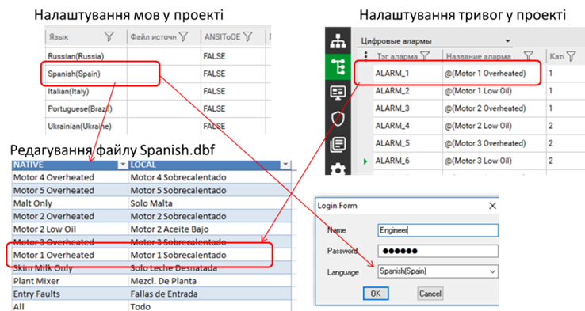

[<- До підрозділу](README.md)

# Мультимовна підтримка в Citect 

Переключення мов у Citect (починаючи з версії 7.4) відбувається з використанням функцій входу в систему користувача. Citect підтримує зміну тексту як у ЛМІ, так і в деяких властивостях тегів, тривог, трендів та інших розділів проекту.

Для забезпечення мультимовної підтримки в проекті та в середовищі виконання Citect необхідно виконати такі процедури:

1. *Позначити тексти, що будуть перекладатися*. Для текстів, що будуть перекладатися, використовуються спеціальні позначки зміни мови (@). Citect розрізняє оригінальну мову (native), яка використовується в проекті при розробленні, та локальну (local), яка відображається для користувача в режимі виконання. Будь-який текст, позначений для перекладу, змінюватиметься в середовищі виконання на локальну, якщо є відповідник. 

2. *Означити мови, що підтримуються в проекті*. Для цього у проекті Citect SCADA є файл бази даних LANG.dbf, в якому записи означують локальні мови, які підтримуються даним проектом. Для кожної мови створюється однойменна база даних, яка створюються під час компіляції. 

3. *Перекласти бази даних локальних мов*. Бази даних локальних мов використовуються для означення перекладу з оригінальної мови проекту на локальну. При компіляції проекту будь який-текст, позначений для перекладу, потрапляє в базу даних локальних мов. Можна вручну редагувати бази даних для означення перекладів, після перекомпіляції записи будуть зберігатися. 

4. *Забезпечити переключення мови при реєстрації користувача*. У середовищі виконання викликається одна з функцій реєстрації користувача, в якій вибирається також мова. 

Тексти, які необхідно відображати в середовищі виконання різними мовами, повинні в проекті бути поміченими з використанням спеціального синтаксису:

```
@( Native Text, Width, Justify)
```

де Native Text – оригінальний текст;

*Width –* опція, яка задає кількість літер, що виділяється для тексту;

*Justify* – опція, яка задає вирівнювання (L – Left, R – Right, C – Center, N – None).

Наприклад, на рис. 8.69 у налаштуваннях тривог проекту використовується запис 

```
@(Motor 1 Overheated)
```

який вказує на необхідність його перекладу. 

<a href="media8/8_69.png" target="_blank"></a>           

*Рис.8.69.* Налаштування мультимовного проекту в Citect

Створення кількох мовних таблиць у проекті проводиться в розділі Setup (рос. лок. "Настройка") на закладці Languages (рос. лок. "Языки"), який, по суті, редагує файл LANG.dbf . Можна вказати кілька мов у проекті, вказавши назву, наприклад, Spanish та в дужках регіон, наприклад, Spain (рис. 8.69). Назва регіону буде використовуватися для вибору кодової сторінки, налаштувань відображення дати та часу, а за назвою мови буде створено однойменний файл "*.dbf". При компіляції буде створено файл "*.dbf", в якому в колонці Native будуть вписані всі тексти, що позначені в проекті як мультимовний текст. Якщо в колонці налаштування Source File (рос. лок. "Языки") буде вказаний файл DBF, усі тексти перекладу будуть взяті з нього; в іншому випадку в колонці LOCAL файлу будуть порожні записи, які можна буде заповнити. Редагувати файл мови можна в Excel з використанням Citect DBF Add-in. Наприклад, для іспанської мови у файлі Spanish.dbf буде локальний відповідник оригінальному тексту (див. рис. 8.69).

Вибір мови в середовищі виконання відбувається із застосуванням функцій реєстрації користувача з використання Cicode функцій Login(), UserLogin() або LoginForm(). У результаті LoginForm з’явиться вікно реєстрації користувача в системі (рис. 8.64), а синтаксис Login матиме такий вигляд: 

```
Login(sUserName, sPassword, bSync, sLanguage)
```

де `sUserName` – ім’я користувача; 

`sPassword` – пароль;

`bSync` – блокуюча чи неблокуюча функція (1 – блокує викликаючу програму, поки користувач не зареєструється); 

`sLanguage` – мова, вказана в переліку мов проекту.

Citect підтримує системні повідомлення кількома мовами та має деякі об’єкти (наприклад Process Analyst), які також підтримують вибір мови. Перелік цих мов обмежений і він входить до списку "офіційно підтримуваних мов". До цього переліку, наприклад, не входить українська мова, і це значить, що тексти в цих елементах будуть відображатися однією з офіційних мов. Крім того, в citect.ini в параметрі `[Language]CharSet` можна виставити кодову сторінку, яка буде використовуватися.

Теоретичне заняття розробив [Олександр Пупена](https://github.com/pupenasan). 