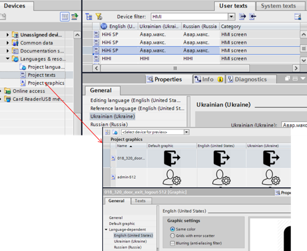

# Мультимовна підтримка у WinCC Comfort

WinCC Comfort підтримує можливість зміни тексту або графіки залежно від вибраної мови. Для забезпечення мультимовної підтримки в проекті TIA Portal необхідно виконати такі процедури:

1. *Означити мови, що підтримуються в проекті* *TIA Portal*. Для цього в проекті TIA Portal у розділі "Languages & Resources -> Project languages" вибираються потрібні мови. 

2. *Означити мови, що підтримуються в пристрої* *WinCC Comfort*. Для цього в проекті TIA Portal у розділі пристрою (операторської панелі) “Runtime Settings” -> "Languages & Fonts" вибираються потрібні мови з вибраних в п.1 та означуються для них шрифти. 

3. *Перекласти* *тексти*. Тексти редактору (Editing Language) перекладаються на локальні. 

4. *Забезпечити переключення мови*. У середовищі виконання викликається функція зміни мови, в якій також вказуються додаткові параметри шрифтів та папок зі змінними ресурсними файлами (рисунки, файли допомоги тощо).

При виборі мови у п.1 у проекті TIA Portal вказується мова, що буде використовуватися як мова редагування ("Editing Language"), а також як мова за замовченням ("Reference Language"). Усі тексти автоматично будуть копіюватися в "Reference Language". Переклад для всіх інших вибраних в п.2 мов можна зробити у вкладці "Texts" конкретного елемента, або централізовано у розділі "Languages & Resources”->“Project texts” (рис. 8.72). Окрім тексту, до мови можна також прив’язати зміну графічних зображень. 

 

*Рис. 8.72.* Налаштування мультимовної підтримки в TIA Portal

Переключення мови в середовищі виконання відбувається шляхом виклику функції SetLanguage. 