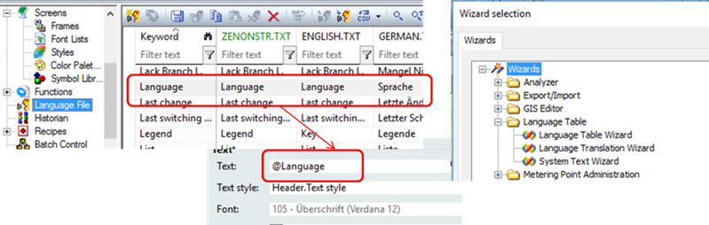
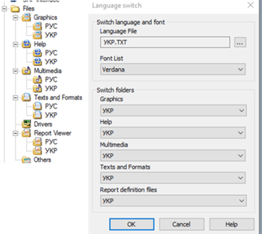

[<- До підрозділу](README.md)

# Мультимовна підтримка в zenon 

У SCADA zenon мультимовність підтримується не тільки для тексту, а й для рисунків та шрифтів. Тобто залежно від вибраної мови автоматично можуть змінюватися інші елменти інтерфейсу. Крім того, zenon підтримує переклад системних повідомлень (із середовища виконання). Для забезпечення мультимовної підтримки в проекті zenon необхідно виконати такі процедури:

1. *Позначити тексти, що будуть перекладатися*. Для текстів, що будуть перекладатися, використовуються спеціальні позначки зміни мови (`@`). 

2. *Означити мови, що підтримуються в проекті*. Для цього у проекті zenon є текстові мовні файли, які можна редагувати безпосередньо в редакторі проекту або зовнішніми засобами. 

3. *Перекласти мовні файли*. Текстові файли локальних мов використовуються для означення перекладу з оригінальної мови в проекті на локальну. 

4. *Забезпечення переключення мови*. У середовищі виконання викликається функція зміни мови, в якій також вказуються додаткові параметри шрифтів та папок із змінними ресурсними файлами (рисунки, файли допомоги тощо).

Оригінальний текст у проекті, що потребує перекладу, виділяється з обох боків за допомогою символів "@". У записі 

```
@Text1@Text2
```

оригінальний текст "Text1" буде замінено на локальний з мовного файлу. Текст "Text2" залишиться без зміни. Якщо треба перекласти весь текст праворуч від символу "@", другий символ можна не ставити.

Мовні файли (TXT) створюються в розділі проекту Language File (рис. 8.70). Файли вміщують оригінальні тексти, які в zenon називаються ключовими словами (keywords), та їх переклад, розділені символом "|". За замовченням ці файли порожні. Щоб заповнити їх ключовими словами автоматично в zenon можна скористатися помічником Language Table Wizard (Tools -> Start Editor wizard). Цей помічник також перед заповненням може усі звичайні тексти в потрібних розділах проекту помітити символом "@", таким чином автоматизувавши перетворення зі звичайного проекту в мультимовний. Усі ключові слова записуються в колонку “keyword” та в файл "ZENONSTR.TXT", який завантажується автоматично при старті середовища виконання (типу файл мови за замовченням). 

Перекладені відповідники ключовим словам можна вставляти у відповідну колонку мовного файлу безпосередньо в редакторі проекту. Можна також імпортувати та експортувати ці файли. Додатково можна скористатися помічником System Text Wizard, який знаходить усі тексти та їх відповідні переклади в системних вікнах та меню zenon а також існуючі перекладені варіанти та записує їх у відповідні файли. Таким чином можна реалізувати або змінити переклад існуючих системних вікон середовища виконання zenon. 

<a href="media8/8_70.png" target="_blank"></a> 

Рис.8.70. Налаштування мультимовного проекту в zenon

Переключення мови проводиться викликом функції "Language switch" (рис. 8.71). Окрім файлу мови можна опційно вказати набір шрифтів та попередньо створені папки ресурсів проекту (рисунків, файлів допомоги, мультимедіа, файлів звітів). У випадку вибору папок для мови, вони повинні містити ресурси з тією самою назвою та розширенням. 

 

*Рис. 8.71.* Конфігурування виклику функції "Language switch" в zenon

Теоретичне заняття розробив [Олександр Пупена](https://github.com/pupenasan). 