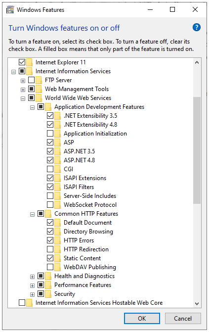
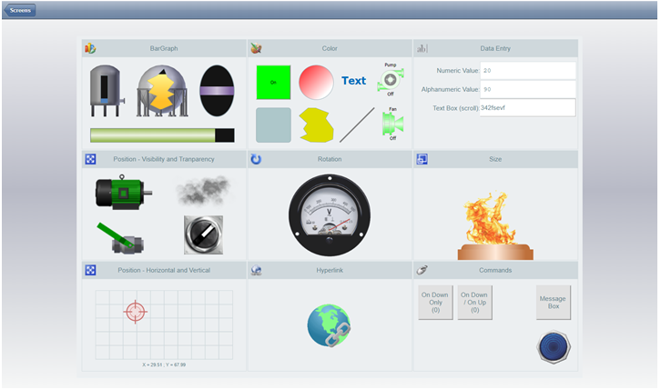
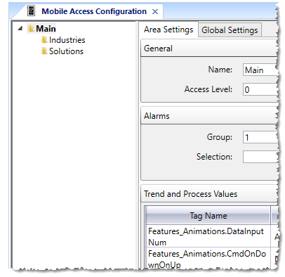
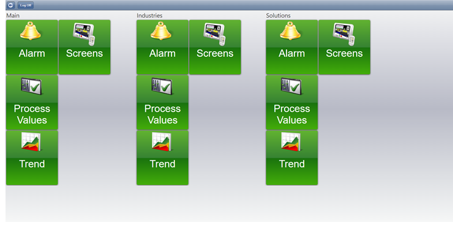
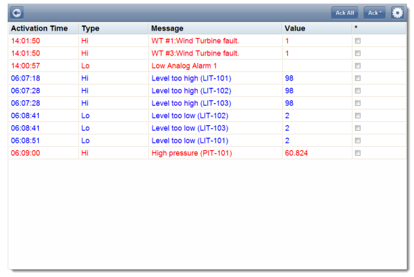
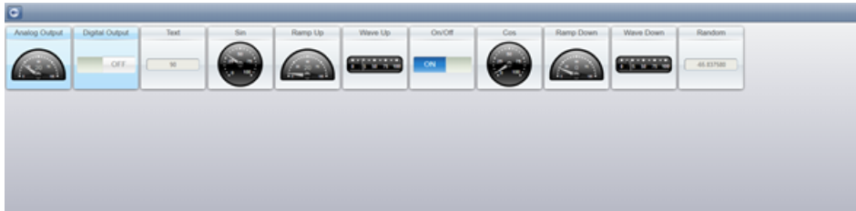
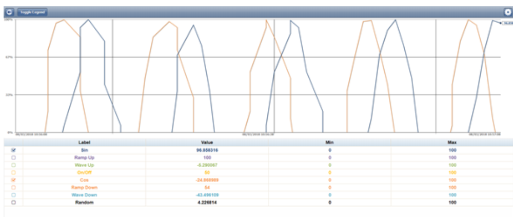
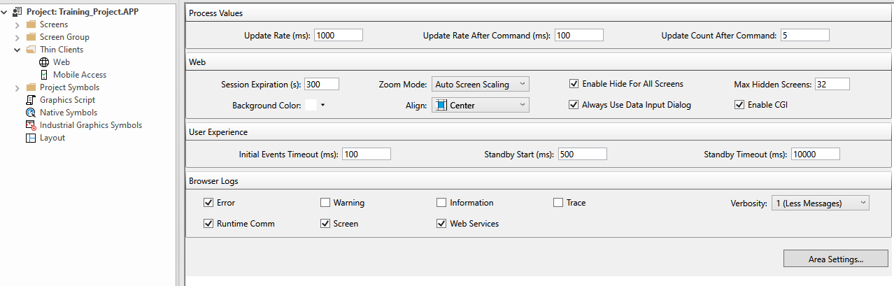
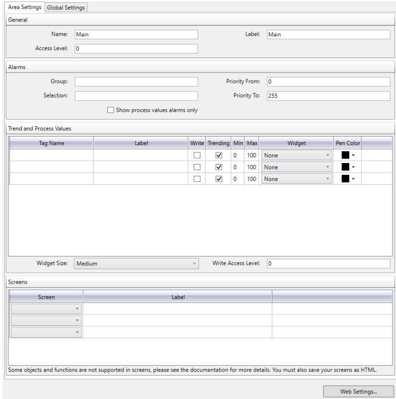
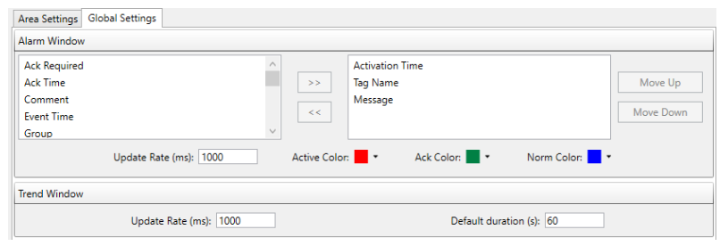

[<- До підрозділу](README.md)

# Мобільний доступ в Aveva Edge

## Основні можливості та встановлення

Aveva Edge підтримує мобільний доступ (який також називається Studio Mobile Access або **SMA**) на основі розгортання веб-інтерфейсу що базується на HTML5. Цей веб-інтерфейс розроблено для смартфонів і планшетів, наприклад пристроїв Android та iOS, але доступ до нього можна отримати з сучасного веб-браузера на будь якому пристрої. На відміну від іншої технології з Веб-доступом Thin Client, що базується на ActiveX, Mobile Access не потребує спеціального браузера що підтримує ActiveX, бо використовує технологію HTML5.   

Mobile Access базується на веб-сервері Microsoft IIS або інших серверах із підтримкою CGI (наприклад, Apache). Ліцензія на програмне забезпечення має включати достатню кількість тонких клієнтів для одночасного доступу. За роботу підсистеми відповідає Mobile Access Runtime, який можна інсталювати як частину повного програмного забезпечення AVEVA Edge (Mobile Access  add-on) або на додаток до програмного забезпечення Embedded HMI. Надбудову потрібно інсталювати разом із веб-сервером на тому самому комп’ютері, на якому розміщено сервер виконання проекту. Для роботи веб-серверу на базі Microsoft IIS необхідно активувати компонент `Internet Information Services` з додатково виставленими наступними компонентами IIS в ОС Windows:

- Application Development Features
  - .NET Extensibility 3.5 
  - .NET Extensibility 4.x 
  - ASP 
  - ASP.NET 3.5 
  - ASP.NET 4.x 
  - ISAPI Extensions 
  - ISAPI Filters 
- Common HTTP Features
  - Static Content 



рис.1. Необхідні компоненти для Mobile Access

Враховуючи особливості реалізації не всі функції середовища виконання підтримуються через мобільний доступ. На рис.2 наведений приклад екрану доступний через мобільний доступ.



рис.2. Приклади підтримуваних екранних об’єктів і анімації

Коли мобільний доступ активовано та налаштовано, доступ до нього відбувається за адресою (підтримується також доступ за `https` якщо це налаштовано)

```
http://адресапристрою/ma/
```

Після входження на сторінку необхідно залогуватися під відповідним іменем користувача та паролем. Після реєстрації користувача, він попадає на домашню сторінку веб-інтерфейсу. Не можна відкривати більш ніж одну вкладку в тому ж браузері для доступу до Веб-серверу мобільного доступу. Веб-інтерфейс проекту складається з однієї або кількох зон (Areas), які ієрархічно організовані, наприклад за розташуванням, системою чи машиною, що дає можливість зручно налаштувати навігацію. Так, наприклад, на рис.3 зконфігурована для мобільного доступу загальна зона `Main` та підзони `Industries` та `Solutions` як будуть відображені окремими частинами в браузері (рис.4).   



рис.3. Приклади ієрархічної організації навігації

Кожна зона має елемент керування `Alarm` (відображення активних тривог, рис.4), `Process Values` (відображення та зміна змінних через віджети, рис.5), `Trend` (відображення трендів реального часу та історичних, рис.6) та `Screens` (відображення сторінок, що опубліковані для тонких клієнтів з певними обмеженнями, рис.2). Ці елементи керування відображаються у веб-інтерфейсі як зелені плитки (рис.4), натискаючи на які відкривається окрема сторінка. Сторінки автоматично відкриваються настільки широкими, наскільки це потрібно, щоб вмістити всі зони, однак частина сторінки може бути поза полем зору залежно від розміру вікна браузера або мобільного пристрою.



рис.4. Приклади основної сторінки з зоною`Main` та підзонами `Industries`  та `Solutions`



рис.5. Приклад вікна з тривогами (Alarm)



Рис.6. Приклад вінка Process Values



Рис.6. Приклад вінка з трендами (Trend) 

## Конфігурування

Налаштування мобільного доступу проводиться через меню `Thin Clients` -> `Mobile Access` . На основному вікні (рис.7) налаштовуються:

- для технологічних змінних (Process Values) нормальна швидкість оновлення та після виконання команди (для негайного оновлення з зазначенням кількості разів)
- час дії неактивної сесії, колір фону, режим масштабування, режим прихованості сторінок
- спосіб зворотного зв’язку з користувачем (User Experience), коли сервер виконання проекту повільно відповідає 
- типи повідомлень, які будуть доступні в журналі браузера мобільного доступу (Browser Logs)     



рис.7. Основне вікно налаштування мобільного доступу

У налаштуванні зон (доступне через `Arrea Settings`) вказуються (рис.8):

- назва, рівень доступу, відображувана назва
- налаштування тривог для сторінки Alarm: групи тривог, максимальне значення пріоритету, показати тільки тривоги що пов'язані зі змінним в розділі (Trend and Process Values)  
- перелік змінних для сторінок Trend  Process Values з вказівкою:
  - відображуваного імені (Label)
  - необхідність доступу для запису (Write)
  - діапазон мінімуму та максимуму змінної для віджетів
  - віджет, який використовуватиметься для відображення (доступно кілька варіантів)
  - Trending, якщо необхідно щоб змінна відображалася на вікні трендів та колір пера; якщо опція не стоїть, змінна буде відображатися у вікні Process Values 



рис.8. Налаштування зони

Налаштування поведінки тривог та трендів проводиться у вікні `Global Settings`



рис.9.  Вікно`Global Settings`

Теоретичне заняття розробив [Олександр Пупена](https://github.com/pupenasan). 